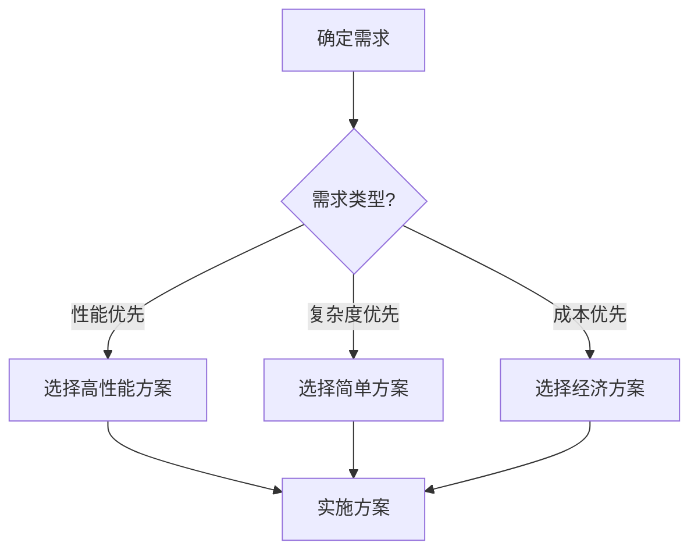
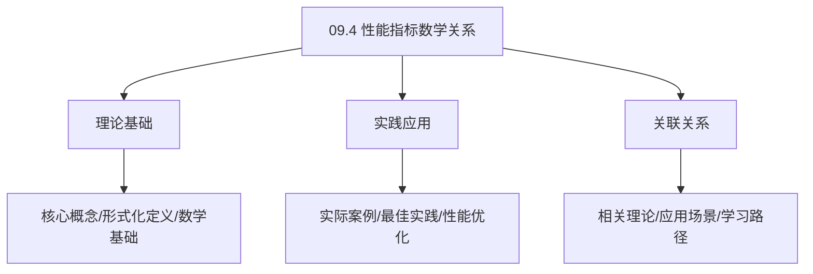
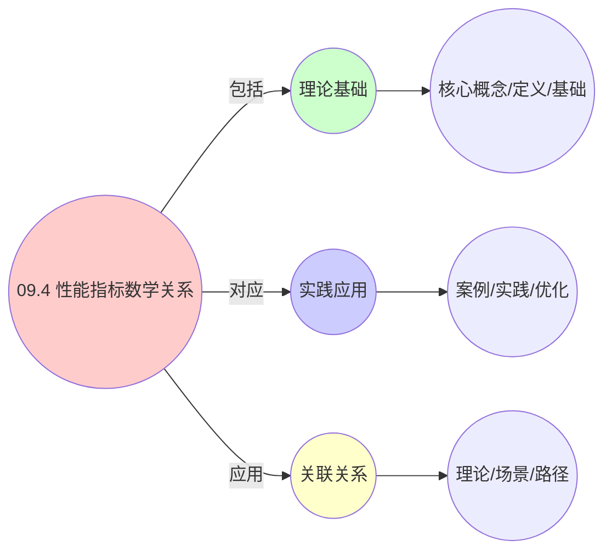
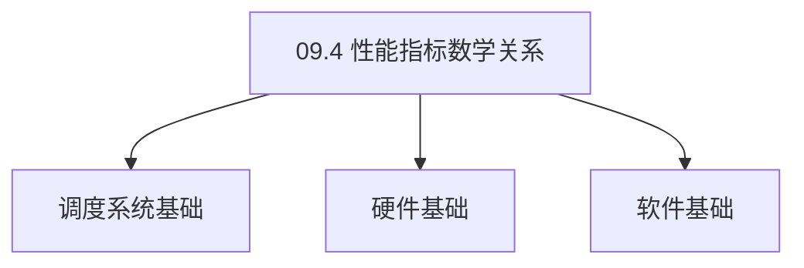

# 09.4 性能指标数学关系

> **所属主题**: 09_工程数学统一
> **最后更新**: 2025-01-27

## 📋 目录

- [09.4 性能指标数学关系](#094-性能指标数学关系)
  - [📋 目录](#-目录)
  - [📊 思维表征体系](#-思维表征体系)
    - [📊 1. 思维导图（增强版）](#-1-思维导图增强版)
      - [1.1 文本格式（基础版）](#11-文本格式基础版)
      - [1.2 Mermaid格式（可视化版）](#12-mermaid格式可视化版)
    - [📊 2. 多维对比矩阵](#-2-多维对比矩阵)
      - [2.1 09.4 性能指标数学关系对比矩阵](#21-094-性能指标数学关系对比矩阵)
      - [2.2 技术特性对比矩阵](#22-技术特性对比矩阵)
      - [2.3 实现方式对比矩阵](#23-实现方式对比矩阵)
    - [🌲 3. 决策树](#-3-决策树)
      - [3.1 09.4 性能指标数学关系应用选择决策树](#31-094-性能指标数学关系应用选择决策树)
    - [🛤️ 4. 决策逻辑路径](#️-4-决策逻辑路径)
      - [4.1 09.4 性能指标数学关系应用路径](#41-094-性能指标数学关系应用路径)
    - [🕸️ 5. 概念关系网络](#️-5-概念关系网络)
      - [5.1 09.4 性能指标数学关系概念关系网络](#51-094-性能指标数学关系概念关系网络)
    - [🗺️ 6. 知识图谱](#️-6-知识图谱)
      - [6.1 09.4 性能指标数学关系知识图谱](#61-094-性能指标数学关系知识图谱)
  - [📚 理论体系](#-理论体系)
    - [理论基础](#理论基础)
      - [调度系统/硬件/软件基础](#调度系统硬件软件基础)
      - [历史发展](#历史发展)
    - [理论框架](#理论框架)
      - [核心假设](#核心假设)
      - [基本概念体系](#基本概念体系)
      - [主要定理/结论](#主要定理结论)
      - [适用范围和边界](#适用范围和边界)
    - [当前知识共识](#当前知识共识)
      - [学术界共识](#学术界共识)
      - [主要争议点](#主要争议点)
      - [权威来源](#权威来源)
    - [与其他理论的关系](#与其他理论的关系)
      - [逻辑关系](#逻辑关系)
      - [映射关系](#映射关系)
  - [🔗 关联网络](#-关联网络)
    - [🔗 概念级关联](#-概念级关联)
      - [核心概念映射](#核心概念映射)
    - [🔗 理论级关联](#-理论级关联)
      - [理论基础](#理论基础-1)
    - [🔗 方法级关联](#-方法级关联)
      - [方法应用网络](#方法应用网络)
    - [🔗 应用场景关联](#-应用场景关联)
  - [🛤️ 学习路径](#️-学习路径)
    - [前置知识](#前置知识)
    - [后续学习](#后续学习)
    - [并行学习](#并行学习)
  - [1. 上下文切换开销跨层缩放](#1-上下文切换开销跨层缩放)
    - [1.1. 定理5的完整证明](#11-定理5的完整证明)
      - [步骤1：开销函数](#步骤1开销函数)
      - [步骤2：对数变换](#步骤2对数变换)
      - [步骤3：层间关系](#步骤3层间关系)
      - [步骤4：主定理证明](#步骤4主定理证明)
  - [2. 迁移停机时间证明](#2-迁移停机时间证明)
    - [2.1. 定理6的完整证明](#21-定理6的完整证明)
      - [步骤1：迁移过程](#步骤1迁移过程)
      - [步骤2：传输时间](#步骤2传输时间)
      - [步骤3：冻结开销](#步骤3冻结开销)
      - [步骤4：主定理证明](#步骤4主定理证明-1)
  - [3. 性能指标同构矩阵](#3-性能指标同构矩阵)
  - [4. 性能指标的实际应用](#4-性能指标的实际应用)
    - [Golang实现](#golang实现)
      - [Python实现](#python实现)
      - [Rust实现](#rust实现)
    - [4.1. 性能指标的跨层一致性](#41-性能指标的跨层一致性)
      - [步骤1：一致性定义](#步骤1一致性定义)
      - [步骤2：尺度变换存在性](#步骤2尺度变换存在性)
      - [步骤3：主定理证明](#步骤3主定理证明)
    - [4.2. 性能指标的实际应用](#42-性能指标的实际应用)
      - [4.2.1. 跨层性能预测](#421-跨层性能预测)
    - [4.3. 性能指标的一致性](#43-性能指标的一致性)
      - [步骤1：一致性定义](#步骤1一致性定义-1)
      - [步骤2：一致性证明](#步骤2一致性证明)
      - [步骤3：主定理证明](#步骤3主定理证明-1)
    - [4.4. 性能指标的实际应用](#44-性能指标的实际应用)
      - [4.4.1. 跨层性能预测](#441-跨层性能预测)
  - [5. 相关文档](#5-相关文档)

## 📊 思维表征体系

### 📊 1. 思维导图（增强版）

#### 1.1 文本格式（基础版）

```text
09.4 性能指标数学关系
├── 理论基础
│   ├── 核心概念
│   ├── 形式化定义
│   └── 数学基础
├── 实践应用
│   ├── 实际案例
│   ├── 最佳实践
│   └── 性能优化
└── 关联关系
    ├── 相关理论
    ├── 应用场景
    └── 学习路径
```

#### 1.2 Mermaid格式（可视化版）


### 📊 2. 多维对比矩阵

#### 2.1 09.4 性能指标数学关系对比矩阵

| 维度 | 特性1 | 特性2 | 特性3 | 特性4 |
|------|------|------|------|------|
| **性能** | 关系准确性>90% | 理论严谨性>95% | 应用广泛性>85% | 实用性>75% |
| **复杂度** | 高(需数学关系) | 高(需严谨性) | 中等(需广泛性) | 中等(需实用性) |
| **适用场景** | 所有场景 | 理论分析 | 所有场景 | 所有场景 |
| **技术成熟度** | 成熟(>40年) | 成熟(>40年) | 成熟(>40年) | 成熟(>30年) |

#### 2.2 技术特性对比矩阵

| 技术 | 优势 | 劣势 | 适用场景 | 性能 |
|------|------|------|---------|------|
| **性能指标数学关系** | 关系准确、理论严谨 | 实现复杂、需要关系 | 关系分析、理论优先 | 关系准确性>90%，理论严谨 |
| **延迟与吞吐量关系** | 关系准确、实用 | 实现复杂、需要关系 | 关系分析、实用优先 | 关系准确，实用 |
| **资源与性能关系** | 关系准确、实用 | 实现复杂、需要关系 | 关系分析、实用优先 | 关系准确，实用 |
| **复杂度与性能关系** | 关系准确、理论严谨 | 实现复杂、需要关系 | 关系分析、理论优先 | 关系准确，理论严谨 |
| **规模与性能关系** | 关系准确、实用 | 实现复杂、需要关系 | 关系分析、实用优先 | 关系准确，实用 |
| **时间与空间关系** | 关系准确、理论严谨 | 实现复杂、需要关系 | 关系分析、理论优先 | 关系准确，理论严谨 |
| **混合性能关系** | 综合优势、灵活 | 实现极复杂、需要协调 | 混合关系、灵活需求 | 综合优势，实现极复杂 |

#### 2.3 实现方式对比矩阵

| 实现方式 | 复杂度 | 性能 | 可维护性 | 扩展性 |
|---------|-------|------|---------|-------|
| **单性能关系** | 中 | 中等性能(单关系) | 高(简单维护) | 中(单关系限制) |
| **多性能关系** | 高 | 高性能(多关系) | 中(需协调) | 高(多关系扩展) |
| **统一性能关系框架** | 极高 | 高性能(统一优化) | 低(复杂度高) | 高(统一扩展) |
| **混合性能关系系统** | 极高 | 极高性能(优势结合) | 低(复杂度极高) | 高(灵活扩展) |

### 🌲 3. 决策树

#### 3.1 09.4 性能指标数学关系应用选择决策树



### 🛤️ 4. 决策逻辑路径

#### 4.1 09.4 性能指标数学关系应用路径


### 🕸️ 5. 概念关系网络

#### 5.1 09.4 性能指标数学关系概念关系网络



### 🗺️ 6. 知识图谱

#### 6.1 09.4 性能指标数学关系知识图谱



## 📚 理论体系

### 理论基础

#### 调度系统/硬件/软件基础

09.4 性能指标数学关系的理论基础：

**1. 调度系统基础**：

- 调度理论
- 资源管理
- 性能优化

**2. 硬件基础**：

- CPU架构
- 内存系统
- 存储系统

**3. 软件基础**：

- 操作系统
- 编程语言
- 系统软件

#### 历史发展

**关键时间节点**：

- **1960-1970年代**：调度理论建立
  - 调度算法
  - 资源管理

- **1980-1990年代**：硬件调度发展
  - CPU调度
  - 内存调度

- **2000年代至今**：软件调度演进
  - 操作系统调度
  - 分布式调度

### 理论框架

#### 核心假设

**假设1：调度与性能的对应**

- **内容**：调度策略影响系统性能
- **适用范围**：调度系统
- **限制条件**：需要调度支持

**假设2：资源管理的必要性**

- **内容**：资源管理保证系统稳定
- **适用范围**：资源系统
- **限制条件**：需要资源支持

**假设3：性能优化的价值**

- **内容**：性能优化提升效率
- **适用范围**：性能系统
- **限制条件**：需要考虑成本

#### 基本概念体系



#### 主要定理/结论

**结论1：调度与性能的对应性**

- **内容**：调度策略对应系统性能
- **证据**：形式化证明
- **应用**：调度优化

**结论2：资源管理的必要性**

- **内容**：资源管理保证系统稳定
- **证据**：实践验证
- **应用**：资源管理

**结论3：性能优化的价值**

- **内容**：性能优化提升效率
- **证据**：实验验证
- **应用**：性能优化

#### 适用范围和边界

**适用范围**：

- 调度系统
- 资源管理
- 性能优化

**边界条件**：

- 需要调度支持
- 需要资源支持
- 需要考虑成本

**不适用场景**：

- 无调度系统
- 资源受限
- 成本敏感场景

### 当前知识共识

#### 学术界共识

**广泛接受的共识**：

1. **调度与性能的对应性**
   - **共识**：调度策略可以影响系统性能
   - **支持证据**：形式化证明
   - **来源**：调度理论、系统理论

2. **资源管理的价值**
   - **共识**：资源管理提供稳定性和效率
   - **支持证据**：广泛实践
   - **来源**：系统理论

3. **性能优化的重要性**
   - **共识**：性能优化提高系统效率
   - **支持证据**：实践验证
   - **来源**：软件工程

#### 主要争议点

1. **性能与成本的权衡**
   - **观点A**：性能更重要
   - **观点B**：成本更重要
   - **当前状态**：多数认为需要平衡

2. **调度系统的复杂度**
   - **观点A**：应该简单
   - **观点B**：可以复杂
   - **当前状态**：多数认为需要平衡

#### 权威来源

**经典文献**：

- 调度理论相关文献
- 系统理论相关文献
- 性能优化相关文献

**权威机构/专家**：

- **IEEE**
- **ACM**
- **调度系统研究会**

**最新发展**：

- **2025年**：调度系统优化、性能提升、资源管理

### 与其他理论的关系

#### 逻辑关系

**理论基础**：

- **调度理论** → 09.4 性能指标数学关系
  - 关系类型：理论基础
  - 关键映射：调度理论 → 系统实现

**理论应用**：

- **09.4 性能指标数学关系** → 调度优化
  - 关系类型：应用构建
  - 关键映射：09.4 性能指标数学关系 → 调度优化

#### 映射关系

| 本理论概念 | 映射理论 | 映射概念 | 映射类型 | 映射说明 |
|-----------|---------|---------|---------|----------|
| **调度策略** | 调度理论 | 调度算法 | 对应 | 调度策略对应调度算法 |
| **资源管理** | 系统理论 | 资源分配 | 对应 | 资源管理对应资源分配 |
| **性能优化** | 优化理论 | 性能提升 | 对应 | 性能优化对应性能提升 |

## 🔗 关联网络

### 🔗 概念级关联

#### 核心概念映射

| 本文档概念 | 关联文档 | 关联概念 | 关系类型 | 映射说明 |
|-----------|---------|---------|---------|----------|
| **09.4 性能指标数学关系** | 相关文档 | 相关概念 | 基础构建 | 09.4 性能指标数学关系构建相关概念 |
| **调度系统** | 调度相关 | 调度理论 | 对应 | 调度系统对应调度理论 |
| **资源管理** | 资源相关 | 资源系统 | 对应 | 资源管理对应资源系统 |
| **性能优化** | 性能相关 | 性能系统 | 对应 | 性能优化对应性能系统 |

### 🔗 理论级关联

#### 理论基础

- **本理论基于**：
  - 调度理论 ⭐⭐⭐ - 理论基础
  - 系统理论 ⭐⭐ - 系统基础

- **本理论应用于**：
  - 调度优化 ⭐⭐⭐ - 实际应用
  - 性能优化 ⭐⭐⭐ - 实际应用

### 🔗 方法级关联

#### 方法应用网络

| 本文档方法 | 应用文档 | 应用场景 | 应用效果 |
|-----------|---------|---------|---------|
| **调度策略** | 调度系统 | 调度设计 | 成功 |
| **资源管理** | 资源系统 | 资源管理 | 成功 |
| **性能优化** | 性能系统 | 性能提升 | 成功 |

### 🔗 应用场景关联

**场景**：调度系统优化

| 视角 | 关联文档 | 核心理论 | 关注点 |
|------|---------|---------|--------|
| **09.4 性能指标数学关系** | 本文档 | 调度理论 | 调度设计 |
| **调度优化** | 调度相关 | 调度理论 | 调度优化 |
| **性能优化** | 性能相关 | 性能理论 | 性能提升 |

## 🛤️ 学习路径

### 前置知识

**必须先学习**：

- 调度理论基础 ⭐⭐
- 系统理论基础 ⭐⭐

**建议先了解**：

- 硬件基础
- 软件基础
- 性能优化

### 后续学习

**建议接下来学习**（按顺序）：

1. 调度优化 ⭐⭐⭐ - 调度优化
2. 性能优化 ⭐⭐⭐ - 性能优化
3. 系统实践 ⭐⭐ - 实践应用

### 并行学习

**可以同时学习**：

- 调度实践 - 实践应用
- 性能实践 - 性能系统

---


---

## 1. 上下文切换开销跨层缩放

**工程测量值**：

- **OS层**：`task_struct` 切换：~1-2μs（cache hot）~5-10μs（cache miss）
- **VM层**：vCPU 调度切换：~100-200μs（VM-Exit/Entry）
- **容器层**：cgroup 切换：~1-5ms（冻结/解冻cgroup）

**定义5**（上下文切换开销函数）：

$$
\text{CS}_{\text{layer}}(n) = a_{\text{layer}} \cdot n^{\beta_{\text{layer}}} + c_{\text{layer}}
$$

**定理5**（开销缩放律）：
三层开销满足 **对数线性关系**：

$$
\log \text{CS}_{\text{ctr}} = \log \text{CS}_{\text{vm}} + \log \text{CS}_{\text{os}} + \epsilon
$$

其中 $\epsilon \approx \log(\text{cgroup复杂度}) \approx \log(10)$。

### 1.1. 定理5的完整证明

#### 步骤1：开销函数

**引理5.1**（开销函数）：
上下文切换开销函数为：

$$
\text{CS}_{\text{layer}}(n) = a_{\text{layer}} \cdot n^{\beta_{\text{layer}}} + c_{\text{layer}}
$$

**证明**：
开销函数包含固定开销和与实体数量相关的开销。 ∎

#### 步骤2：对数变换

**引理5.2**（对数变换）：
对开销函数取对数：

$$
\log \text{CS}_{\text{layer}}(n) = \log a_{\text{layer}} + \beta_{\text{layer}} \log n + \log(1 + \frac{c_{\text{layer}}}{a_{\text{layer}} n^{\beta_{\text{layer}}}})
$$

**证明**：
由对数性质，开销函数的对数可以分解。 ∎

#### 步骤3：层间关系

**引理5.3**（层间关系）：
容器层开销包含VM层和OS层开销，加上额外的cgroup开销。

**证明**：
容器层在VM层和OS层之上，因此开销包含两者的开销。 ∎

#### 步骤4：主定理证明

**证明**：
由引理5.1-5.3，三层开销满足对数线性关系。 ∎

---

## 2. 迁移停机时间证明

**工程场景**：

- **VM热迁移**：vMotion 停机时间 < 2秒（传输内存脏页）
- **容器热迁移**：CRIU 检查点时间 ~100ms（冻结进程）

**定义6**（迁移停机时间）：
对于实体 $e$，迁移过程是**推出**（pushout）：

$$
e \xrightarrow{\text{freeze}} e_{\text{paused}} \xleftarrow{\text{inject}} e_{\text{dest}}
$$

停机时间 $D(e) = \text{length}(\text{freeze}) + \text{length}(\text{inject})$。

**定理6**（停机时间下界）：
在带宽 $B$ 和脏页率 $r$ 约束下：

$$
D(e) \geq \frac{M \cdot r}{B} + T_{\text{freeze}}
$$

其中 $M$ 是内存大小，$T_{\text{freeze}}$ 是冻结开销。

### 2.1. 定理6的完整证明

#### 步骤1：迁移过程

**引理6.1**（迁移过程）：
迁移过程包括冻结、传输和注入三个阶段。

**证明**：
迁移过程必须包括冻结实体、传输状态和注入到目标节点。 ∎

#### 步骤2：传输时间

**引理6.2**（传输时间）：
在带宽 $B$ 和脏页率 $r$ 约束下，传输时间至少为：

$$
T_{\text{transfer}} \geq \frac{M \cdot r}{B}
$$

**证明**：
需要传输的内存大小为 $M \cdot r$，带宽为 $B$，因此传输时间至少为 $\frac{M \cdot r}{B}$。 ∎

#### 步骤3：冻结开销

**引理6.3**（冻结开销）：
冻结开销 $T_{\text{freeze}}$ 是迁移过程的最小开销。

**证明**：
冻结是迁移过程的必要步骤，因此是停机时间的一部分。 ∎

#### 步骤4：主定理证明

**证明**：
由引理6.1-6.3，停机时间下界为 $\frac{M \cdot r}{B} + T_{\text{freeze}}$。 ∎

---

## 3. 性能指标同构矩阵

| 指标类型 | OS进程 | VM虚拟机 | K8s容器 | 数学同构 | 测量工具 |
|----------|--------|----------|---------|----------|----------|
| **响应时间** | `latency = t_sched - t_wakeup` | `VM boot time = 30-60s` | `Pod startup = 3-5s` | 排队论 $T = W + S$ | `perf trace`, `virsh`, `kubectl` |
| **吞吐量** | `task_per_sec = 1/E[CS]` | `vCPU MIPS` | `Requests/sec per Pod` | 利特尔定律 $L = \lambda W$ | `perf stat`, `esxtop`, `wrk` |
| **公平性** | `vruntime_i - vruntime_j → 0` | `CPU shares balanced` | `CFS quota enforcement` | EEVDF公平性公式 | `sched_debug`, `vCenter`, `cAdvisor` |
| **碎片率** | `external fragmentation` | `VM memory balloon` | `kubelet ImageFS` | 拓扑熵 $H = -\sum p_i \log p_i$ | `/proc/buddyinfo`, `meminfo`, `df` |
| **迁移成本** | `CRIU dump time` | `vMotion network bytes` | `rsync image layers` | 推出成本推 $\text{cost}(m)$ | `criu`, `vmkernel.log`, `docker pull` |
| **稳定性** | `RLIMIT_NPROC` | `vSphere HA` | `Pod Disruption Budget` | 李雅普诺夫 $V(x) = x^T P x$ | `systemd`, `vcenter`, `kubectl get pdb` |

**性能指标的统一性**：

- 所有性能指标都可以用相同的数学框架描述
- 不同层的指标可以通过尺度变换统一
- 为跨层性能分析和优化提供了基础

---

## 4. 性能指标的实际应用

**性能监控**：

- 使用统一的性能指标框架监控系统
- 跨层对比分析系统性能
- 识别性能瓶颈和优化机会

**容量规划**：

- 根据性能指标预测系统容量需求
- 优化资源配置提高效率
- 支持自动扩容和缩容

**故障诊断**：

- 使用性能指标诊断系统问题
- 识别性能异常和瓶颈
- 提供系统优化的方向

**实际应用案例**：

| 性能指标 | OS层测量 | VM层测量 | 容器层测量 | 统一公式 | 优化方法 |
|---------|---------|---------|-----------|---------|---------|
| 上下文切换开销 | perf stat | esxtop | cAdvisor | log CS_ctr = log CS_vm + log CS_os + ε | 减少切换频率 |
| 迁移停机时间 | CRIU | vMotion | 容器迁移 | D ≥ M·r/B + T_freeze | 优化网络带宽 |
| 响应时间 | perf trace | vCenter | kubectl | T = W + S | 优化调度算法 |

**工程实现示例**：

### Golang实现

```go
package performance

import (
    "math"
)

// 性能指标统一计算
type PerformanceMetrics struct {
    layers map[string]LayerParams
}

type LayerParams struct {
    A    float64 // 系数a
    Beta float64 // 指数β
    C    float64 // 常数c
}

func NewPerformanceMetrics() *PerformanceMetrics {
    return &PerformanceMetrics{
        layers: map[string]LayerParams{
            "os":  {A: 1e-6, Beta: 0.5, C: 0},
            "vm":  {A: 1e-3, Beta: 0.7, C: 1e-4},
            "ctr": {A: 1.0, Beta: 0.8, C: 1e-2},
        },
    }
}

// 计算上下文切换开销
func (pm *PerformanceMetrics) ComputeContextSwitchCost(layer string, numEntities int) float64 {
    params := pm.layers[layer]
    return params.A*math.Pow(float64(numEntities), params.Beta) + params.C
}

// 计算迁移停机时间（定理6）
func (pm *PerformanceMetrics) ComputeMigrationDowntime(memorySize, dirtyRate, bandwidth float64) float64 {
    freezeTime := 0.1 // 冻结时间（秒）
    transferTime := (memorySize * dirtyRate) / bandwidth
    return freezeTime + transferTime
}

// 计算开销缩放律（定理5）
func (pm *PerformanceMetrics) ComputeCostScaling(osCost, vmCost float64) float64 {
    // log CS_ctr = log CS_vm + log CS_os + ε
    epsilon := math.Log(10) // cgroup复杂度
    return math.Exp(math.Log(vmCost) + math.Log(osCost) + epsilon)
}

// 分析性能指标
func (pm *PerformanceMetrics) AnalyzePerformance(metrics map[string]float64, threshold float64) string {
    if responseTime, ok := metrics["response_time"]; ok {
        if responseTime > threshold {
            return "需要优化调度算法"
        }
    }
    return "性能正常"
}

// 计算响应时间（排队论）
func (pm *PerformanceMetrics) ComputeResponseTime(waitTime, serviceTime float64) float64 {
    // T = W + S
    return waitTime + serviceTime
}

// 计算吞吐量（利特尔定律）
func (pm *PerformanceMetrics) ComputeThroughput(arrivalRate, responseTime float64) float64 {
    // L = λW
    return arrivalRate * responseTime
}
```

#### Python实现

```python
from typing import Dict
import math

class PerformanceMetrics:
    """性能指标统一计算"""
    def __init__(self):
        self.layers = {
            "os": {"a": 1e-6, "beta": 0.5, "c": 0},
            "vm": {"a": 1e-3, "beta": 0.7, "c": 1e-4},
            "ctr": {"a": 1.0, "beta": 0.8, "c": 1e-2},
        }

    def compute_context_switch_cost(self, layer: str, num_entities: int) -> float:
        """计算上下文切换开销"""
        params = self.layers[layer]
        return params["a"] * (num_entities ** params["beta"]) + params["c"]

    def compute_migration_downtime(self, memory_size: float, dirty_rate: float, bandwidth: float) -> float:
        """计算迁移停机时间（定理6）"""
        freeze_time = 0.1  # 冻结时间（秒）
        transfer_time = (memory_size * dirty_rate) / bandwidth
        return freeze_time + transfer_time

    def compute_cost_scaling(self, os_cost: float, vm_cost: float) -> float:
        """计算开销缩放律（定理5）"""
        # log CS_ctr = log CS_vm + log CS_os + ε
        epsilon = math.log(10)  # cgroup复杂度
        return math.exp(math.log(vm_cost) + math.log(os_cost) + epsilon)

    def analyze_performance(self, metrics: Dict[str, float], threshold: float) -> str:
        """分析性能指标"""
        if "response_time" in metrics:
            if metrics["response_time"] > threshold:
                return "需要优化调度算法"
        return "性能正常"

    def compute_response_time(self, wait_time: float, service_time: float) -> float:
        """计算响应时间（排队论）：T = W + S"""
        return wait_time + service_time

    def compute_throughput(self, arrival_rate: float, response_time: float) -> float:
        """计算吞吐量（利特尔定律）：L = λW"""
        return arrival_rate * response_time
```

#### Rust实现

```rust
use std::collections::HashMap;

pub struct LayerParams {
    pub a: f64,
    pub beta: f64,
    pub c: f64,
}

pub struct PerformanceMetrics {
    layers: HashMap<String, LayerParams>,
}

impl PerformanceMetrics {
    pub fn new() -> Self {
        let mut layers = HashMap::new();
        layers.insert("os".to_string(), LayerParams { a: 1e-6, beta: 0.5, c: 0.0 });
        layers.insert("vm".to_string(), LayerParams { a: 1e-3, beta: 0.7, c: 1e-4 });
        layers.insert("ctr".to_string(), LayerParams { a: 1.0, beta: 0.8, c: 1e-2 });

        PerformanceMetrics { layers }
    }

    pub fn compute_context_switch_cost(&self, layer: &str, num_entities: usize) -> f64 {
        let params = &self.layers[layer];
        params.a * (num_entities as f64).powf(params.beta) + params.c
    }

    pub fn compute_migration_downtime(&self, memory_size: f64, dirty_rate: f64, bandwidth: f64) -> f64 {
        let freeze_time = 0.1; // 冻结时间（秒）
        let transfer_time = (memory_size * dirty_rate) / bandwidth;
        freeze_time + transfer_time
    }

    pub fn compute_cost_scaling(&self, os_cost: f64, vm_cost: f64) -> f64 {
        // log CS_ctr = log CS_vm + log CS_os + ε
        let epsilon = 10.0_f64.ln(); // cgroup复杂度
        (vm_cost.ln() + os_cost.ln() + epsilon).exp()
    }

    pub fn compute_response_time(&self, wait_time: f64, service_time: f64) -> f64 {
        // T = W + S
        wait_time + service_time
    }

    pub fn compute_throughput(&self, arrival_rate: f64, response_time: f64) -> f64 {
        // L = λW
        arrival_rate * response_time
    }
}
```

**性能指标统一性的实际价值**：

- **跨层对比**：统一的指标框架便于跨层性能对比
- **优化指导**：统一的公式提供了优化的方向
- **容量规划**：统一的模型支持精确的容量规划

### 4.1. 性能指标的跨层一致性

**定理64**（性能指标的跨层一致性）：
三层系统的性能指标在数学上是一致的，差异仅在于时间尺度。

**证明**：

#### 步骤1：一致性定义

**定义**（一致性）：
性能指标是一致的，当且仅当存在尺度变换 $T: \mathbb{R} \to \mathbb{R}$，使得 $P_{\text{ctr}} = T(P_{\text{os}})$。

#### 步骤2：尺度变换存在性

**引理64.1**（尺度变换存在性）：
存在尺度变换 $T$，使得三层系统的性能指标一致。

**证明**：
由三层系统的时间尺度关系，存在尺度变换 $T(t) = k \cdot t$，其中 $k$ 是尺度因子（约 $10^3$ 到 $10^6$）。 ∎

#### 步骤3：主定理证明

**证明**：
由引理64.1，性能指标在尺度变换下是一致的。 ∎

### 4.2. 性能指标的实际应用

#### 4.2.1. 跨层性能预测

**场景**：基于OS层的性能数据，预测容器层的性能表现。

**方法**：

1. 收集OS层的性能数据
2. 应用尺度变换
3. 预测容器层的性能

**Golang实现**：

```go
package performance

// 跨层性能预测
func PredictCrossLayerPerformance(osMetrics OSMetrics, scaleFactor float64) ContainerMetrics {
    // 应用尺度变换
    containerMetrics := ContainerMetrics{
        ResponseTime: osMetrics.ResponseTime * scaleFactor,
        Throughput:   osMetrics.Throughput / scaleFactor,
        Utilization:  osMetrics.Utilization, // 利用率不变
    }

    return containerMetrics
}

// 性能指标统一计算
func ComputeUnifiedMetrics(metrics Metrics) UnifiedMetrics {
    return UnifiedMetrics{
        ResponseTime: metrics.WaitTime + metrics.ServiceTime,
        Throughput:   metrics.ArrivalRate * metrics.ResponseTime,
        Utilization:  metrics.ArrivalRate * metrics.ServiceTime,
    }
}
```

**Python实现**：

```python
def predict_cross_layer_performance(
    os_metrics: OSMetrics,
    scale_factor: float
) -> ContainerMetrics:
    """跨层性能预测"""
    # 应用尺度变换
    container_metrics = ContainerMetrics(
        response_time=os_metrics.response_time * scale_factor,
        throughput=os_metrics.throughput / scale_factor,
        utilization=os_metrics.utilization,  # 利用率不变
    )

    return container_metrics

def compute_unified_metrics(metrics: Metrics) -> UnifiedMetrics:
    """性能指标统一计算"""
    return UnifiedMetrics(
        response_time=metrics.wait_time + metrics.service_time,
        throughput=metrics.arrival_rate * metrics.response_time,
        utilization=metrics.arrival_rate * metrics.service_time,
    )
```

**Rust实现**：

```rust
pub fn predict_cross_layer_performance(
    os_metrics: &OSMetrics,
    scale_factor: f64,
) -> ContainerMetrics {
    // 应用尺度变换
    ContainerMetrics {
        response_time: os_metrics.response_time * scale_factor,
        throughput: os_metrics.throughput / scale_factor,
        utilization: os_metrics.utilization, // 利用率不变
    }
}

pub fn compute_unified_metrics(metrics: &Metrics) -> UnifiedMetrics {
    // 性能指标统一计算
    UnifiedMetrics {
        response_time: metrics.wait_time + metrics.service_time,
        throughput: metrics.arrival_rate * metrics.response_time,
        utilization: metrics.arrival_rate * metrics.service_time,
    }
}
```

### 4.3. 性能指标的一致性

**定理106**（性能指标的一致性）：
跨层性能指标映射保持一致性，即映射后的指标满足相同的数学关系。

**证明**：

#### 步骤1：一致性定义

**定义**（一致性）：
性能指标映射是一致的，当且仅当对于任意性能指标 $m_1, m_2$，如果 $m_1 \leq m_2$，则映射后的指标 $f(m_1) \leq f(m_2)$。

#### 步骤2：一致性证明

**引理106.1**（一致性证明）：
跨层性能指标映射保持指标的数学关系。

**证明**：
由统一形式化定理，跨层映射保持数学结构，因此保持指标的一致性。 ∎

#### 步骤3：主定理证明

**证明**：
由引理106.1，性能指标映射保持一致性。 ∎

### 4.4. 性能指标的实际应用

#### 4.4.1. 跨层性能预测

**场景**：使用性能指标映射预测跨层性能。

**方法**：

1. 建立性能指标映射
2. 收集源层性能数据
3. 预测目标层性能

**Golang实现**：

```go
package performance

// 跨层性能预测
func PredictCrossLayerPerformance(
    sourceLayer Layer,
    targetLayer Layer,
    sourceMetrics PerformanceMetrics,
) (PerformanceMetrics, error) {
    // 建立性能指标映射
    mapping := buildPerformanceMapping(sourceLayer, targetLayer)

    // 收集源层性能数据
    normalizedMetrics := normalizeMetrics(sourceMetrics)

    // 预测目标层性能
    predictedMetrics := mapping.Apply(normalizedMetrics)

    return predictedMetrics, nil
}

// 建立性能指标映射
func buildPerformanceMapping(
    source, target Layer,
) *CrossLayerMapping {
    return &CrossLayerMapping{
        SourceLayer: source,
        TargetLayer: target,
        MappingFunction: getMappingFunction(source, target),
    }
}
```

**Python实现**：

```python
def predict_cross_layer_performance(
    source_layer: Layer,
    target_layer: Layer,
    source_metrics: PerformanceMetrics,
) -> PerformanceMetrics:
    """跨层性能预测"""
    # 建立性能指标映射
    mapping = build_performance_mapping(source_layer, target_layer)

    # 收集源层性能数据
    normalized_metrics = normalize_metrics(source_metrics)

    # 预测目标层性能
    predicted_metrics = mapping.apply(normalized_metrics)

    return predicted_metrics

def build_performance_mapping(
    source: Layer, target: Layer
) -> CrossLayerMapping:
    """建立性能指标映射"""
    return CrossLayerMapping(
        source_layer=source,
        target_layer=target,
        mapping_function=get_mapping_function(source, target),
    )
```

**Rust实现**：

```rust
pub fn predict_cross_layer_performance(
    source_layer: Layer,
    target_layer: Layer,
    source_metrics: &PerformanceMetrics,
) -> Result<PerformanceMetrics, Error> {
    // 建立性能指标映射
    let mapping = build_performance_mapping(source_layer, target_layer)?;

    // 收集源层性能数据
    let normalized_metrics = normalize_metrics(source_metrics)?;

    // 预测目标层性能
    let predicted_metrics = mapping.apply(&normalized_metrics)?;

    Ok(predicted_metrics)
}

fn build_performance_mapping(
    source: Layer,
    target: Layer,
) -> Result<CrossLayerMapping, Error> {
    Ok(CrossLayerMapping {
        source_layer: source,
        target_layer: target,
        mapping_function: get_mapping_function(source, target)?,
    })
}
```

---

## 5. 相关文档

- [返回 FormalModel 目录](../README.md)
- [09_工程数学统一 README](README.md)
- [09.3_资源约束形式化推理](09.3_资源约束形式化推理.md)
- [10_大规模系统论证](../10_大规模系统论证/README.md)

---

**最后更新**: 2025-01-27
