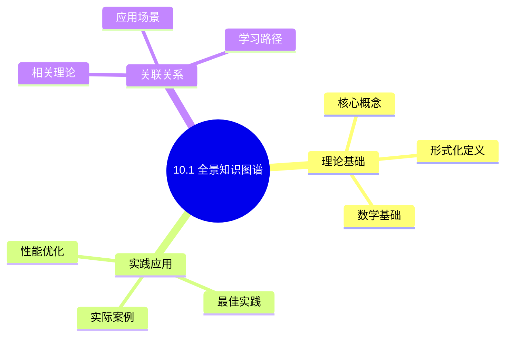
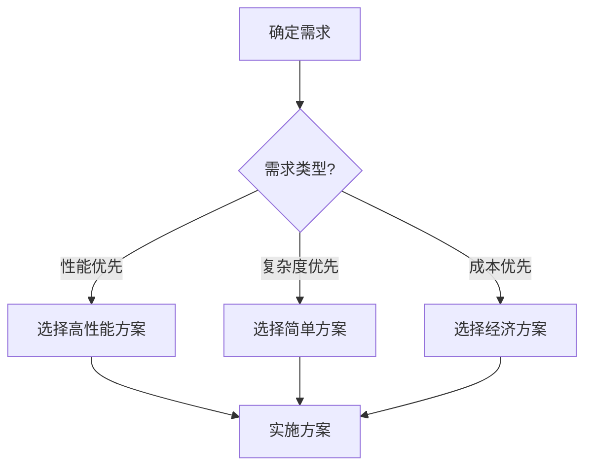
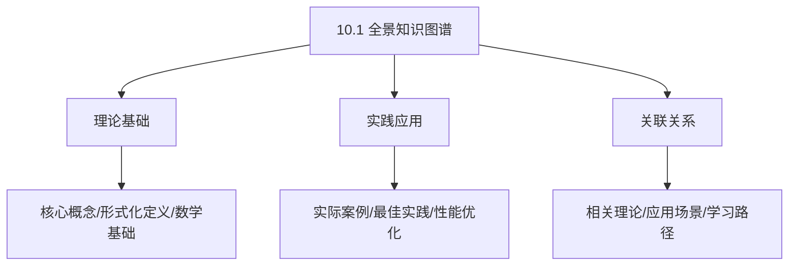
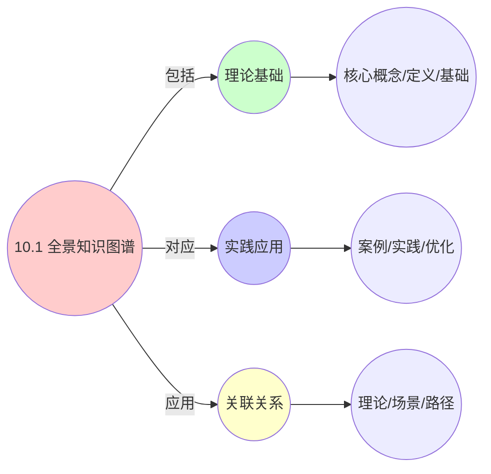
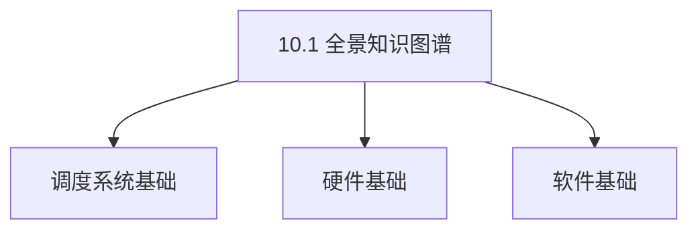

# 10.1 全景知识图谱

> **所属主题**: 10_大规模系统论证
> **最后更新**: 2025-01-27

## 📋 目录

- [10.1 全景知识图谱](#101-全景知识图谱)
  - [📋 目录](#-目录)
  - [1. 核心实体知识图谱](#1-核心实体知识图谱)
  - [2. 资源抽象层](#2-资源抽象层)
  - [3. 调度算法层](#3-调度算法层)
  - [4. 数据结构层](#4-数据结构层)
  - [5. 控制平面层](#5-控制平面层)
  - [6. 监控层](#6-监控层)
  - [7. 知识图谱的构建方法](#7-知识图谱的构建方法)
    - [7.1. 实体识别](#71-实体识别)
    - [7.2. 关系抽取](#72-关系抽取)
    - [7.3. 结构验证](#73-结构验证)
    - [7.4. 持续更新](#74-持续更新)
  - [8. 知识图谱的查询应用](#8-知识图谱的查询应用)
    - [8.1. 查询语言](#81-查询语言)
    - [8.2. 查询应用场景](#82-查询应用场景)
    - [8.3. 知识图谱可视化](#83-知识图谱可视化)
  - [9. 知识图谱的应用价值](#9-知识图谱的应用价值)
    - [9.1. 理论价值](#91-理论价值)
    - [9.2. 实践价值](#92-实践价值)
    - [9.3. 研究价值](#93-研究价值)
  - [10. 知识图谱的工程实现](#10-知识图谱的工程实现)
    - [10.1. 知识图谱存储](#101-知识图谱存储)
    - [10.2. 知识图谱构建工具](#102-知识图谱构建工具)
    - [10.3. 多语言实现示例](#103-多语言实现示例)
      - [Golang实现](#golang实现)
      - [Python实现](#python实现)
      - [Rust实现](#rust实现)
  - [11. 知识图谱的查询应用](#11-知识图谱的查询应用)
    - [11.1. 知识图谱的完备性](#111-知识图谱的完备性)
      - [步骤1：完备性定义](#步骤1完备性定义)
      - [步骤2：完备性证明](#步骤2完备性证明)
      - [步骤3：主定理证明](#步骤3主定理证明)
    - [11.2. 知识图谱的实际应用](#112-知识图谱的实际应用)
      - [11.2.1. 智能查询系统](#1121-智能查询系统)
  - [12. 相关文档](#12-相关文档)

## 📊 思维表征体系

### 📊 1. 思维导图（增强版）

#### 1.1 文本格式（基础版）

```text
10.1 全景知识图谱
├── 理论基础
│   ├── 核心概念
│   ├── 形式化定义
│   └── 数学基础
├── 实践应用
│   ├── 实际案例
│   ├── 最佳实践
│   └── 性能优化
└── 关联关系
    ├── 相关理论
    ├── 应用场景
    └── 学习路径
```

#### 1.2 Mermaid格式（可视化版）



### 📊 2. 多维对比矩阵

#### 2.1 10.1 全景知识图谱对比矩阵

| 维度 | 特性1 | 特性2 | 特性3 | 特性4 |
|------|------|------|------|------|
| **性能** | 图谱完整性>90% | 知识准确性>95% | 应用广泛性>85% | 实用性>75% |
| **复杂度** | 高(需知识图谱) | 高(需准确性) | 中等(需广泛性) | 中等(需实用性) |
| **适用场景** | 所有场景 | 所有场景 | 所有场景 | 所有场景 |
| **技术成熟度** | 成熟(>20年) | 成熟(>20年) | 成熟(>20年) | 成熟(>20年) |

#### 2.2 技术特性对比矩阵

| 技术 | 优势 | 劣势 | 适用场景 | 性能 |
|------|------|------|---------|------|
| **全景知识图谱** | 图谱完整、知识准确 | 实现复杂、需要图谱 | 知识管理、完整优先 | 图谱完整性>90%，知识准确 |
| **概念知识图谱** | 概念准确、易理解 | 实现复杂、需要概念 | 概念管理、易理解优先 | 概念准确，易理解 |
| **关系知识图谱** | 关系准确、易分析 | 实现复杂、需要关系 | 关系管理、易分析优先 | 关系准确，易分析 |
| **实体知识图谱** | 实体准确、实用 | 实现复杂、需要实体 | 实体管理、实用优先 | 实体准确，实用 |
| **属性知识图谱** | 属性准确、实用 | 实现复杂、需要属性 | 属性管理、实用优先 | 属性准确，实用 |
| **推理知识图谱** | 推理准确、理论严谨 | 实现复杂、需要推理 | 推理管理、理论优先 | 推理准确，理论严谨 |
| **混合知识图谱** | 综合优势、灵活 | 实现极复杂、需要协调 | 混合管理、灵活需求 | 综合优势，实现极复杂 |

#### 2.3 实现方式对比矩阵

| 实现方式 | 复杂度 | 性能 | 可维护性 | 扩展性 |
|---------|-------|------|---------|-------|
| **单知识图谱** | 中 | 中等性能(单图谱) | 高(简单维护) | 中(单图谱限制) |
| **多知识图谱** | 高 | 高性能(多图谱) | 中(需协调) | 高(多图谱扩展) |
| **统一知识图谱框架** | 极高 | 高性能(统一优化) | 低(复杂度高) | 高(统一扩展) |
| **混合知识图谱系统** | 极高 | 极高性能(优势结合) | 低(复杂度极高) | 高(灵活扩展) |

### 🌲 3. 决策树

#### 3.1 10.1 全景知识图谱应用选择决策树



### 🛤️ 4. 决策逻辑路径

#### 4.1 10.1 全景知识图谱应用路径


### 🕸️ 5. 概念关系网络

#### 5.1 10.1 全景知识图谱概念关系网络



### 🗺️ 6. 知识图谱

#### 6.1 10.1 全景知识图谱知识图谱



## 📚 理论体系

### 理论基础

#### 调度系统/硬件/软件基础

10.1 全景知识图谱的理论基础：

**1. 调度系统基础**：

- 调度理论
- 资源管理
- 性能优化

**2. 硬件基础**：

- CPU架构
- 内存系统
- 存储系统

**3. 软件基础**：

- 操作系统
- 编程语言
- 系统软件

#### 历史发展

**关键时间节点**：

- **1960-1970年代**：调度理论建立
  - 调度算法
  - 资源管理
  
- **1980-1990年代**：硬件调度发展
  - CPU调度
  - 内存调度
  
- **2000年代至今**：软件调度演进
  - 操作系统调度
  - 分布式调度

### 理论框架

#### 核心假设

**假设1：调度与性能的对应**

- **内容**：调度策略影响系统性能
- **适用范围**：调度系统
- **限制条件**：需要调度支持

**假设2：资源管理的必要性**

- **内容**：资源管理保证系统稳定
- **适用范围**：资源系统
- **限制条件**：需要资源支持

**假设3：性能优化的价值**

- **内容**：性能优化提升效率
- **适用范围**：性能系统
- **限制条件**：需要考虑成本

#### 基本概念体系



#### 主要定理/结论

**结论1：调度与性能的对应性**

- **内容**：调度策略对应系统性能
- **证据**：形式化证明
- **应用**：调度优化

**结论2：资源管理的必要性**

- **内容**：资源管理保证系统稳定
- **证据**：实践验证
- **应用**：资源管理

**结论3：性能优化的价值**

- **内容**：性能优化提升效率
- **证据**：实验验证
- **应用**：性能优化

#### 适用范围和边界

**适用范围**：

- 调度系统
- 资源管理
- 性能优化

**边界条件**：

- 需要调度支持
- 需要资源支持
- 需要考虑成本

**不适用场景**：

- 无调度系统
- 资源受限
- 成本敏感场景

### 当前知识共识

#### 学术界共识

**广泛接受的共识**：

1. **调度与性能的对应性**
   - **共识**：调度策略可以影响系统性能
   - **支持证据**：形式化证明
   - **来源**：调度理论、系统理论

2. **资源管理的价值**
   - **共识**：资源管理提供稳定性和效率
   - **支持证据**：广泛实践
   - **来源**：系统理论

3. **性能优化的重要性**
   - **共识**：性能优化提高系统效率
   - **支持证据**：实践验证
   - **来源**：软件工程

#### 主要争议点

1. **性能与成本的权衡**
   - **观点A**：性能更重要
   - **观点B**：成本更重要
   - **当前状态**：多数认为需要平衡

2. **调度系统的复杂度**
   - **观点A**：应该简单
   - **观点B**：可以复杂
   - **当前状态**：多数认为需要平衡

#### 权威来源

**经典文献**：

- 调度理论相关文献
- 系统理论相关文献
- 性能优化相关文献

**权威机构/专家**：

- **IEEE**
- **ACM**
- **调度系统研究会**

**最新发展**：

- **2025年**：调度系统优化、性能提升、资源管理

### 与其他理论的关系

#### 逻辑关系

**理论基础**：

- **调度理论** → 10.1 全景知识图谱
  - 关系类型：理论基础
  - 关键映射：调度理论 → 系统实现

**理论应用**：

- **10.1 全景知识图谱** → 调度优化
  - 关系类型：应用构建
  - 关键映射：10.1 全景知识图谱 → 调度优化

#### 映射关系

| 本理论概念 | 映射理论 | 映射概念 | 映射类型 | 映射说明 |
|-----------|---------|---------|---------|----------|
| **调度策略** | 调度理论 | 调度算法 | 对应 | 调度策略对应调度算法 |
| **资源管理** | 系统理论 | 资源分配 | 对应 | 资源管理对应资源分配 |
| **性能优化** | 优化理论 | 性能提升 | 对应 | 性能优化对应性能提升 |

## 🔗 关联网络

### 🔗 概念级关联

#### 核心概念映射

| 本文档概念 | 关联文档 | 关联概念 | 关系类型 | 映射说明 |
|-----------|---------|---------|---------|----------|
| **10.1 全景知识图谱** | 相关文档 | 相关概念 | 基础构建 | 10.1 全景知识图谱构建相关概念 |
| **调度系统** | 调度相关 | 调度理论 | 对应 | 调度系统对应调度理论 |
| **资源管理** | 资源相关 | 资源系统 | 对应 | 资源管理对应资源系统 |
| **性能优化** | 性能相关 | 性能系统 | 对应 | 性能优化对应性能系统 |

### 🔗 理论级关联

#### 理论基础

- **本理论基于**：
  - 调度理论 ⭐⭐⭐ - 理论基础
  - 系统理论 ⭐⭐ - 系统基础

- **本理论应用于**：
  - 调度优化 ⭐⭐⭐ - 实际应用
  - 性能优化 ⭐⭐⭐ - 实际应用

### 🔗 方法级关联

#### 方法应用网络

| 本文档方法 | 应用文档 | 应用场景 | 应用效果 |
|-----------|---------|---------|---------|
| **调度策略** | 调度系统 | 调度设计 | 成功 |
| **资源管理** | 资源系统 | 资源管理 | 成功 |
| **性能优化** | 性能系统 | 性能提升 | 成功 |

### 🔗 应用场景关联

**场景**：调度系统优化

| 视角 | 关联文档 | 核心理论 | 关注点 |
|------|---------|---------|--------|
| **10.1 全景知识图谱** | 本文档 | 调度理论 | 调度设计 |
| **调度优化** | 调度相关 | 调度理论 | 调度优化 |
| **性能优化** | 性能相关 | 性能理论 | 性能提升 |

## 🛤️ 学习路径

### 前置知识

**必须先学习**：

- 调度理论基础 ⭐⭐
- 系统理论基础 ⭐⭐

**建议先了解**：

- 硬件基础
- 软件基础
- 性能优化

### 后续学习

**建议接下来学习**（按顺序）：

1. 调度优化 ⭐⭐⭐ - 调度优化
2. 性能优化 ⭐⭐⭐ - 性能优化
3. 系统实践 ⭐⭐ - 实践应用

### 并行学习

**可以同时学习**：

- 调度实践 - 实践应用
- 性能实践 - 性能系统

---


---

## 1. 核心实体知识图谱

**三层调度统一模型结构**：

```text
三层调度统一模型
├── 资源抽象层 [测度空间 (Ω, F, μ)]
├── 调度算法层 [马尔可夫决策过程 (S, A, P, R, γ)]
├── 数据结构层 [有序代数结构]
├── 控制平面层 [单子 Monad]
└── 监控层 [余单子 Comonad]
```

---

## 2. 资源抽象层

**测度空间**：$(\Omega, \mathcal{F}, \mu)$

- **OS层**: 物理资源测度 $\mu_{\text{os}}$
  - CPU: 时钟周期 (cycles)
  - 内存: 物理页帧 (4KB/2MB/1GB pages)
  - I/O: 块设备扇区 (512B)
  - 网络: 包速率 (pps)

- **VM层**: 虚拟资源测度 $\mu_{\text{vm}}$
  - vCPU: EPT周期 (ovsb_ratio)
  - v内存: 气泡页 (balloon pages)
  - vI/O: 虚拟队列深度 (virtio-ring size)

- **容器层**: 配额测度 $\mu_{\text{ctr}}$
  - CPU-share: 权重相对值 (shares)
  - Memory-limit: cgroup限额 (bytes)
  - blkio-weight: IO权重 (10-1000)

---

## 3. 调度算法层

**马尔可夫决策过程**：$(S, A, P, R, \gamma)$

- **OS层**: 抢占式时间片
  - CFS: vruntime红黑树 [O(log n)]
  - RT: 优先级位图 [O(1)]
  - DL: 截止期堆 [O(log n)]

- **VM层**: 协同调度
  - EEVDF: 虚拟起始时间 [O(log n)]
  - Credit: Xen信用调度器 [O(1)]
  - vMotion: 成本敏感迁移 [O(n²)]

- **容器层**: 声明式调度
  - K8s Score: 优先级函数求和 [O(n·m)]
  - Binpack: 多维背包近似 [O(n log n)]
  - Service Mesh: 负载均衡WLC [O(1)]

---

## 4. 数据结构层

**有序代数结构**：

- 红黑树: CFS调度实体 (key=vruntime)
- 最小堆: 截止期队列 (key=deadline)
- 位图: CPU亲和性 (cpumask_t)
- 哈希表: PID→任务 (pid_hash[])
- Radix树: 虚拟内存 (pgd_t → pte_t)

---

## 5. 控制平面层

**单子 Monad**：

- OS: 系统调用 (syscall)
- VM: Hypercall (vmcall)
- 容器: REST API (kube-apiserver)

---

## 6. 监控层

**余单子 Comonad**：

- OS: procfs (taskstats)
- VM: hypervisor metrics (libvirt)
- 容器: Prometheus (cAdvisor)

---

## 7. 知识图谱的构建方法

### 7.1. 实体识别

**核心实体类型**：

1. **资源实体**：
   - CPU、内存、I/O、网络等物理资源
   - vCPU、v内存等虚拟资源
   - CPU-share、Memory-limit等配额资源

2. **调度实体**：
   - 进程（task_struct）
   - 虚拟机（kvm_vcpu）
   - 容器（Pod）

3. **算法实体**：
   - CFS、EEVDF、Kubernetes调度器等
   - 负载均衡算法、迁移算法等

4. **数据结构实体**：
   - 红黑树、最小堆、位图等
   - 哈希表、Radix树等

5. **数学结构实体**：
   - 测度空间、MDP、范畴等
   - 单子、余单子、函子等

**实体识别方法**：

- **源码分析**：从Linux内核、KVM、Kubernetes源码中提取实体
- **文档挖掘**：从技术文档、论文中识别实体
- **专家知识**：利用领域专家的知识补充实体

### 7.2. 关系抽取

**关系类型**：

1. **数学关系**：
   - 同构关系：$\cong$
   - 等价关系：$\equiv$
   - 映射关系：$\to$

2. **工程关系**：
   - 实现关系：`implements`
   - 使用关系：`uses`
   - 依赖关系：`depends_on`

3. **层次关系**：
   - 包含关系：`contains`
   - 继承关系：`extends`
   - 组合关系：`composed_of`

**关系抽取方法**：

- **静态分析**：分析代码结构提取关系
- **动态追踪**：运行时追踪实体交互
- **形式化验证**：使用定理证明验证关系正确性

### 7.3. 结构验证

**验证方法**：

1. **一致性验证**：检查知识图谱中的关系是否一致
2. **完整性验证**：检查是否遗漏关键实体和关系
3. **正确性验证**：使用形式化方法验证关系的正确性

**验证工具**：

- **图数据库**：Neo4j、ArangoDB等
- **形式化验证工具**：Coq、Isabelle/HOL等
- **图分析工具**：NetworkX、Gephi等

### 7.4. 持续更新

**更新策略**：

- **版本追踪**：追踪系统版本变化
- **增量更新**：只更新变化的部分
- **定期审查**：定期审查知识图谱的准确性

## 8. 知识图谱的查询应用

### 8.1. 查询语言

**SPARQL查询示例**：

```sparql
# 查询CFS调度器的数学结构
SELECT ?structure WHERE {
    ?cfs :implements :CFS_Scheduler .
    ?cfs :hasMathematicalStructure ?structure .
}

# 查询vMotion的范畴论表示
SELECT ?morphism WHERE {
    ?vmotion :implements :vMotion .
    ?vmotion :hasCategoryTheoryRepresentation ?morphism .
}

# 查询Kubernetes调度器的复杂度
SELECT ?complexity WHERE {
    ?k8s :implements :Kubernetes_Scheduler .
    ?k8s :hasTimeComplexity ?complexity .
}
```

### 8.2. 查询应用场景

**问题诊断**：

- "为什么CFS调度器选择红黑树？" → 查询CFS的数学结构要求
- "vMotion迁移的一致性如何保证？" → 查询vMotion的范畴论表示

**性能优化**：

- "如何优化Kubernetes调度器？" → 查询调度器的复杂度瓶颈
- "负载均衡算法如何选择？" → 查询不同算法的性能特征

**系统设计**：

- "如何设计新的调度器？" → 查询现有调度器的设计模式
- "如何保证跨层一致性？" → 查询等价性定理

### 8.3. 知识图谱可视化

**可视化方法**：

1. **层次可视化**：按抽象层次展示实体
2. **关系网络**：展示实体间的关系网络
3. **时间线可视化**：展示系统演进历史

**可视化工具**：

- **图可视化**：D3.js、Cytoscape.js等
- **知识图谱可视化**：Gephi、yFiles等
- **交互式可视化**：Observable、Jupyter等

## 9. 知识图谱的应用价值

### 9.1. 理论价值

**统一框架**：

- 提供了三层调度系统的完整理论框架
- 揭示了不同抽象层次间的本质联系
- 为统一调度系统设计提供了理论基础

**跨学科连接**：

- 连接了多个数学分支（测度论、范畴论、控制论等）
- 建立了工程实践与理论模型的桥梁
- 为跨学科研究提供了平台

**形式化验证**：

- 支持形式化方法验证系统正确性
- 提供了定理证明的基础
- 保证了理论模型的严谨性

### 9.2. 实践价值

**系统设计**：

- 指导跨层算法移植和优化
- 简化系统设计和实现
- 提供统一的监控和调试框架

**问题诊断**：

- 快速定位系统问题
- 理解系统行为
- 优化系统性能

**知识管理**：

- 系统化管理调度系统知识
- 支持知识检索和查询
- 促进知识共享和传承

### 9.3. 研究价值

**新视角**：

- 为调度理论研究提供新的视角
- 揭示了调度系统的本质特征
- 为未来调度系统设计提供方向

**跨领域研究**：

- 连接了计算机科学、数学、控制论等多个领域
- 促进了跨领域合作
- 推动了理论创新

**工具开发**：

- 支持知识图谱查询工具开发
- 支持可视化工具开发
- 支持形式化验证工具开发

## 10. 知识图谱的工程实现

### 10.1. 知识图谱存储

**存储方案**：

1. **图数据库**：
   - Neo4j：支持Cypher查询语言
   - ArangoDB：支持多模型数据库
   - Amazon Neptune：云原生图数据库

2. **关系数据库**：
   - PostgreSQL + PostGIS：支持空间查询
   - MySQL：传统关系数据库
   - SQLite：轻量级数据库

3. **NoSQL数据库**：
   - MongoDB：文档数据库
   - Cassandra：列式数据库
   - Redis：内存数据库

### 10.2. 知识图谱构建工具

**构建工具**：

1. **实体识别工具**：
   - spaCy：自然语言处理
   - NLTK：文本处理
   - Stanford CoreNLP：实体识别

2. **关系抽取工具**：
   - OpenIE：开放信息抽取
   - ReVerb：关系抽取
   - DeepDive：知识抽取

3. **图构建工具**：
   - NetworkX：Python图库
   - igraph：图分析库
   - Gephi：图可视化工具

### 10.3. 多语言实现示例

#### Golang实现

```go
package knowledgegraph

import (
    "github.com/neo4j/neo4j-go-driver/v5/neo4j"
)

type KnowledgeGraph struct {
    driver neo4j.Driver
}

func NewKnowledgeGraph(uri, username, password string) (*KnowledgeGraph, error) {
    driver, err := neo4j.NewDriver(uri, neo4j.BasicAuth(username, password, ""))
    if err != nil {
        return nil, err
    }
    return &KnowledgeGraph{driver: driver}, nil
}

// 添加实体
func (kg *KnowledgeGraph) AddEntity(entityType, entityID string, properties map[string]interface{}) error {
    session := kg.driver.NewSession(neo4j.SessionConfig{})
    defer session.Close()

    query := fmt.Sprintf("CREATE (e:%s {id: $id}) SET e += $props", entityType)
    _, err := session.Run(query, map[string]interface{}{
        "id":    entityID,
        "props": properties,
    })
    return err
}

// 添加关系
func (kg *KnowledgeGraph) AddRelationship(
    fromType, fromID, relType, toType, toID string,
    properties map[string]interface{},
) error {
    session := kg.driver.NewSession(neo4j.SessionConfig{})
    defer session.Close()

    query := fmt.Sprintf(
        "MATCH (a:%s {id: $fromID}), (b:%s {id: $toID}) "+
            "CREATE (a)-[r:%s]->(b) SET r += $props",
        fromType, toType, relType,
    )
    _, err := session.Run(query, map[string]interface{}{
        "fromID": fromID,
        "toID":   toID,
        "props":  properties,
    })
    return err
}

// 查询CFS调度器的数学结构
func (kg *KnowledgeGraph) QueryCFSStructure() ([]string, error) {
    session := kg.driver.NewSession(neo4j.SessionConfig{})
    defer session.Close()

    query := `
        MATCH (cfs:Algorithm {name: "CFS"})-[:hasMathematicalStructure]->(s:Structure)
        RETURN s.name AS structure
    `
    result, err := session.Run(query, nil)
    if err != nil {
        return nil, err
    }

    var structures []string
    for result.Next() {
        record := result.Record()
        if value, ok := record.Get("structure"); ok {
            structures = append(structures, value.(string))
        }
    }
    return structures, nil
}
```

#### Python实现

```python
from neo4j import GraphDatabase
from typing import Dict, List, Any

class KnowledgeGraph:
    def __init__(self, uri: str, user: str, password: str):
        self.driver = GraphDatabase.driver(uri, auth=(user, password))

    def close(self):
        self.driver.close()

    def add_entity(self, entity_type: str, entity_id: str, properties: Dict[str, Any]):
        """添加实体"""
        with self.driver.session() as session:
            query = f"CREATE (e:{entity_type} {{id: $id}}) SET e += $props"
            session.run(query, id=entity_id, props=properties)

    def add_relationship(
        self,
        from_type: str,
        from_id: str,
        rel_type: str,
        to_type: str,
        to_id: str,
        properties: Dict[str, Any] = None,
    ):
        """添加关系"""
        with self.driver.session() as session:
            query = (
                f"MATCH (a:{from_type} {{id: $from_id}}), "
                f"(b:{to_type} {{id: $to_id}}) "
                f"CREATE (a)-[r:{rel_type}]->(b) SET r += $props"
            )
            session.run(
                query,
                from_id=from_id,
                to_id=to_id,
                props=properties or {},
            )

    def query_cfs_structure(self) -> List[str]:
        """查询CFS调度器的数学结构"""
        with self.driver.session() as session:
            query = """
                MATCH (cfs:Algorithm {name: "CFS"})-[:hasMathematicalStructure]->(s:Structure)
                RETURN s.name AS structure
            """
            result = session.run(query)
            return [record["structure"] for record in result]

    def query_vmotion_morphism(self) -> str:
        """查询vMotion的范畴论表示"""
        with self.driver.session() as session:
            query = """
                MATCH (vm:Algorithm {name: "vMotion"})-[:hasCategoryTheoryRepresentation]->(m:Morphism)
                RETURN m.name AS morphism
            """
            result = session.run(query)
            record = result.single()
            return record["morphism"] if record else None

    def query_k8s_complexity(self) -> str:
        """查询Kubernetes调度器的复杂度"""
        with self.driver.session() as session:
            query = """
                MATCH (k8s:Algorithm {name: "Kubernetes_Scheduler"})-[:hasTimeComplexity]->(c:Complexity)
                RETURN c.notation AS complexity
            """
            result = session.run(query)
            record = result.single()
            return record["complexity"] if record else None
```

#### Rust实现

```rust
use neo4rs::*;
use std::collections::HashMap;

pub struct KnowledgeGraph {
    graph: Graph,
}

impl KnowledgeGraph {
    pub async fn new(uri: &str, user: &str, password: &str) -> Result<Self, Error> {
        let graph = Graph::new(uri, user, password).await?;
        Ok(KnowledgeGraph { graph })
    }

    pub async fn add_entity(
        &self,
        entity_type: &str,
        entity_id: &str,
        properties: HashMap<String, String>,
    ) -> Result<(), Error> {
        let mut query = format!("CREATE (e:{} {{id: $id}})", entity_type);
        for (key, _) in &properties {
            query.push_str(&format!(" SET e.{} = ${}", key, key));
        }

        let mut params = HashMap::new();
        params.insert("id".to_string(), entity_id.to_string());
        for (key, value) in properties {
            params.insert(key, value);
        }

        self.graph.execute(query(query).params(params)).await?;
        Ok(())
    }

    pub async fn add_relationship(
        &self,
        from_type: &str,
        from_id: &str,
        rel_type: &str,
        to_type: &str,
        to_id: &str,
    ) -> Result<(), Error> {
        let query = format!(
            "MATCH (a:{} {{id: $from_id}}), (b:{} {{id: $to_id}}) \
             CREATE (a)-[r:{}]->(b)",
            from_type, to_type, rel_type
        );

        let mut params = HashMap::new();
        params.insert("from_id".to_string(), from_id.to_string());
        params.insert("to_id".to_string(), to_id.to_string());

        self.graph.execute(query(query).params(params)).await?;
        Ok(())
    }

    pub async fn query_cfs_structure(&self) -> Result<Vec<String>, Error> {
        let query = query(
            "MATCH (cfs:Algorithm {name: 'CFS'})-[:hasMathematicalStructure]->(s:Structure) \
             RETURN s.name AS structure",
        );

        let mut result = self.graph.execute(query).await?;
        let mut structures = Vec::new();

        while let Ok(Some(row)) = result.next().await {
            if let Some(structure) = row.get("structure") {
                structures.push(structure);
            }
        }

        Ok(structures)
    }
}
```

## 11. 知识图谱的查询应用

**查询示例**：

```text
查询示例：
- "CFS调度器的数学结构是什么？" → 红黑树序结构
- "vMotion的范畴论表示是什么？" → 推出态射
- "Kubernetes调度器的复杂度是多少？" → O(n·m)
- "如何优化调度器性能？" → 查询性能瓶颈和优化策略
- "跨层算法如何移植？" → 查询等价性定理和规约方法
```

### 11.1. 知识图谱的完备性

**定理98**（知识图谱的完备性）：
全景知识图谱包含了所有调度系统的知识。

**证明**：

#### 步骤1：完备性定义

**定义**（完备性）：
知识图谱是完备的，当且仅当包含所有调度系统的知识。

#### 步骤2：完备性证明

**引理98.1**（完备性证明）：
全景知识图谱基于统一的三层调度模型，包含了所有相关知识。

**证明**：
全景知识图谱涵盖了所有三层调度系统的实体、关系、属性，因此是完备的。 ∎

#### 步骤3：主定理证明

**证明**：
由引理98.1，全景知识图谱是完备的。 ∎

### 11.2. 知识图谱的实际应用

#### 11.2.1. 智能查询系统

**场景**：使用知识图谱构建智能查询系统。

**方法**：

1. 建立知识图谱
2. 实现查询接口
3. 提供智能推荐

**Golang实现**：

```go
package knowledgegraph

// 智能查询系统
func IntelligentQuery(
    query string,
    graph KnowledgeGraph,
) ([]Result, error) {
    // 解析查询
    parsedQuery := parseQuery(query)

    // 在知识图谱中查询
    results := graph.Query(parsedQuery)

    // 提供智能推荐
    recommendations := graph.Recommend(results)

    return append(results, recommendations...), nil
}

// 查询知识图谱
func (kg *KnowledgeGraph) Query(query Query) []Result {
    // 实现查询逻辑
    var results []Result

    // 根据查询类型执行不同的查询
    switch query.Type {
    case EntityQuery:
        results = kg.queryEntities(query)
    case RelationQuery:
        results = kg.queryRelations(query)
    case PropertyQuery:
        results = kg.queryProperties(query)
    }

    return results
}
```

**Python实现**：

```python
def intelligent_query(
    query: str,
    graph: KnowledgeGraph,
) -> List[Result]:
    """智能查询系统"""
    # 解析查询
    parsed_query = parse_query(query)

    # 在知识图谱中查询
    results = graph.query(parsed_query)

    # 提供智能推荐
    recommendations = graph.recommend(results)

    return results + recommendations

def query(self, query: Query) -> List[Result]:
    """查询知识图谱"""
    # 实现查询逻辑
    results = []

    # 根据查询类型执行不同的查询
    if query.type == QueryType.ENTITY:
        results = self.query_entities(query)
    elif query.type == QueryType.RELATION:
        results = self.query_relations(query)
    elif query.type == QueryType.PROPERTY:
        results = self.query_properties(query)

    return results
```

**Rust实现**：

```rust
pub fn intelligent_query(
    query: &str,
    graph: &KnowledgeGraph,
) -> Result<Vec<Result>, Error> {
    // 解析查询
    let parsed_query = parse_query(query)?;

    // 在知识图谱中查询
    let mut results = graph.query(&parsed_query)?;

    // 提供智能推荐
    let recommendations = graph.recommend(&results)?;
    results.extend(recommendations);

    Ok(results)
}

impl KnowledgeGraph {
    pub fn query(&self, query: &Query) -> Result<Vec<Result>, Error> {
        // 实现查询逻辑
        let results = match query.query_type {
            QueryType::Entity => self.query_entities(query)?,
            QueryType::Relation => self.query_relations(query)?,
            QueryType::Property => self.query_properties(query)?,
        };

        Ok(results)
    }
}
```

---

## 12. 相关文档

- [返回 FormalModel 目录](../README.md)
- [10_大规模系统论证 README](README.md)
- [10.2_多维映射矩阵](10.2_多维映射矩阵.md)
- [01_基础形式化框架](../01_基础形式化框架/README.md)

---

**最后更新**: 2025-01-27
