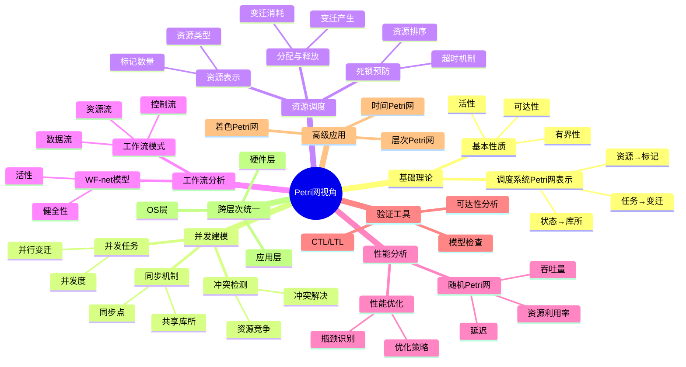

# Petri网视角：调度系统的并发与状态建模

> **视角编号**: PetriNetView
> **视角名称**: Petri网视角
> **最后更新**: 2025-12-02
> **文档状态**: ✅ 完成（8个子主题全部完成）

---

## 📋 目录

- [Petri网视角：调度系统的并发与状态建模](#petri网视角调度系统的并发与状态建模)
  - [📋 目录](#-目录)
  - [1 视角概述](#1-视角概述)
    - [1.1 核心洞察](#11-核心洞察)
    - [1.2 Petri网视角的独特性](#12-petri网视角的独特性)
    - [1.3 与其他视角的区别](#13-与其他视角的区别)
  - [2 子主题导航](#2-子主题导航)
    - [2.1 01 调度系统的Petri网基础](#21-01-调度系统的petri网基础)
    - [2.2 02 并发调度的Petri网建模](#22-02-并发调度的petri网建模)
    - [2.3 03 资源调度的Petri网模型](#23-03-资源调度的petri网模型)
    - [2.4 04 工作流调度的Petri网分析](#24-04-工作流调度的petri网分析)
    - [2.5 05 性能分析的Petri网方法](#25-05-性能分析的petri网方法)
    - [2.6 06 验证与优化的Petri网工具](#26-06-验证与优化的petri网工具)
    - [2.7 07 高级Petri网在调度中的应用](#27-07-高级petri网在调度中的应用)
    - [2.8 08 跨层次调度的Petri网统一模型](#28-08-跨层次调度的petri网统一模型)
  - [3 思维导图](#3-思维导图)
  - [4 与其他视角的关联](#4-与其他视角的关联)
    - [4.1 与FormalModel的关联](#41-与formalmodel的关联)
    - [4.2 与调度主题的关联](#42-与调度主题的关联)
    - [4.3 与形式语言视角的关联](#43-与形式语言视角的关联)
  - [5 理论框架结构](#5-理论框架结构)

---

## 1 视角概述

### 1.1 核心洞察

**Petri网视角**为调度系统提供了一个**独特的并发与状态建模框架**。与传统的状态机、队列模型不同，Petri网通过**库所（状态）、变迁（事件）、标记（资源）**的自然表示，能够：

1. **直观建模并发**：多个任务可以同时执行，无需显式枚举所有并发状态组合
2. **清晰表示同步**：通过共享库所自然表示任务间的同步关系
3. **自动检测冲突**：资源竞争和死锁问题自动显现
4. **形式化验证**：提供严格的数学基础进行系统性质验证

### 1.2 Petri网视角的独特性

**为什么Petri网视角是新颖的？**

| 特性 | 传统视角 | Petri网视角 |
|------|---------|------------|
| **并发表示** | 需要显式枚举状态组合 | 自然表示，状态空间小 |
| **同步机制** | 消息传递、锁机制 | 共享库所，直观清晰 |
| **冲突检测** | 需要额外分析 | 自动显现 |
| **状态空间** | 指数级增长 | 多项式级增长（有界情况） |
| **验证方法** | 模拟、测试 | 形式化分析、模型检查 |

**独特见解**：

1. **状态即资源**：库所中的标记直接表示资源状态，调度决策就是变迁选择
2. **并发即并行变迁**：多个变迁同时点火对应任务并发执行
3. **依赖即弧连接**：任务依赖关系通过库所-变迁-库所的路径自然表示
4. **死锁即无使能变迁**：死锁状态自动识别，无需额外检测算法

### 1.3 与其他视角的区别

**与FormalModel中其他视角的对比**：

- **排队论视角**：关注等待时间和队列长度，Petri网关注状态转换和并发
- **控制论视角**：关注反馈和稳定性，Petri网关注离散事件和状态可达性
- **博弈论视角**：关注策略和均衡，Petri网关注资源竞争和冲突解决
- **范畴论视角**：关注抽象结构，Petri网关注具体执行语义

**Petri网视角的互补性**：

- 提供**离散事件系统**的精确建模
- 支持**并发系统**的形式化分析
- 实现**工作流系统**的验证与优化

---

## 2 子主题导航

### 2.1 [01 调度系统的Petri网基础](01_调度系统的Petri网基础/README.md)

**核心内容**：

- 调度系统的Petri网表示
- 任务、资源、状态的Petri网映射
- 基本调度模式的Petri网建模
- Petri网性质与调度性质对应

**独特视角**：

- 将调度系统视为**离散事件系统**
- 任务调度就是**变迁点火序列**
- 资源分配就是**标记流动**

### 2.2 [02 并发调度的Petri网建模](02_并发调度的Petri网建模/README.md)

**核心内容**：

- 并发任务的Petri网表示
- 同步机制的Petri网建模
- 冲突检测与解决
- 并发度分析与优化

**独特视角**：

- **并发度** = 可同时点火的变迁数量
- **同步点** = 共享库所
- **冲突** = 竞争同一标记的变迁

### 2.3 [03 资源调度的Petri网模型](03_资源调度的Petri网模型/README.md)

**核心内容**：

- 资源的Petri网表示
- 资源分配与释放的Petri网建模
- 资源竞争的Petri网分析
- 死锁预防的Petri网方法

**独特视角**：

- **资源** = 库所中的标记
- **资源分配** = 变迁消耗标记
- **资源释放** = 变迁产生标记
- **死锁** = 无使能变迁的状态

### 2.4 [04 工作流调度的Petri网分析](04_工作流调度的Petri网分析/README.md)

**核心内容**：

- 工作流的WF-net模型
- 工作流模式的Petri网表示
- 工作流健全性验证
- 工作流性能分析

**独特视角**：

- **工作流** = 特殊的Petri网（WF-net）
- **健全性** = Petri网的活性+有界性
- **工作流模式** = Petri网结构模式

### 2.5 [05 性能分析的Petri网方法](05_性能分析的Petri网方法/README.md)

**核心内容**：

- 随机Petri网与性能分析
- 吞吐量、延迟、资源利用率的Petri网计算
- 性能瓶颈识别
- 性能优化策略

**独特视角**：

- **吞吐量** = 变迁点火率
- **延迟** = 从初始标记到目标标记的路径长度
- **资源利用率** = 库所标记的稳态概率

### 2.6 [06 验证与优化的Petri网工具](06_验证与优化的Petri网工具/README.md)

**核心内容**：

- Petri网验证方法（可达性、活性、有界性）
- 模型检查在调度系统中的应用
- Petri网优化方法
- 工具与实践

**独特视角**：

- **正确性验证** = 可达性分析
- **安全性验证** = 有界性分析
- **活性验证** = 活性分析

### 2.7 [07 高级Petri网在调度中的应用](07_高级Petri网在调度中的应用/README.md)

**核心内容**：

- 着色Petri网与复杂调度系统
- 时间Petri网与实时调度
- 随机Petri网与性能分析
- 层次Petri网与大规模系统

**独特视角**：

- **着色Petri网** = 带类型的调度系统
- **时间Petri网** = 实时约束的调度系统
- **随机Petri网** = 概率性能分析
- **层次Petri网** = 模块化调度系统

### 2.8 [08 跨层次调度的Petri网统一模型](08_跨层次调度的Petri网统一模型/README.md)

**核心内容**：

- 硬件层调度的Petri网模型
- OS层调度的Petri网模型
- 应用层调度的Petri网模型
- 跨层次调度的Petri网统一框架

**独特视角**：

- **统一建模**：所有层次的调度都可以用Petri网表示
- **层次抽象**：通过层次Petri网实现跨层次建模
- **接口定义**：通过库所和变迁定义层次接口

---

## 3 思维导图



---

## 4 与其他视角的关联

### 4.1 与FormalModel的关联

**Petri网视角作为新的形式化视角**：

- [03_多模型视角](../FormalModel/03_多模型视角/) - Petri网作为多模型之一，提供并发系统建模
- [04_动态交互模型](../FormalModel/04_动态交互模型/) - 状态转移系统的Petri网表示，离散事件系统
- [08_范畴论形式化](../FormalModel/08_范畴论形式化/) - Petri网的范畴论结构，函子与自然变换

**独特贡献**：


- Petri网视角补充了**并发系统建模**的空白
- 提供了**离散事件系统**的精确表示
- 实现了**工作流系统**的验证与优化

### 4.2 与调度主题的关联

**Petri网视角贯穿所有调度主题**：

- [30_工作流调度](../30_工作流调度/) - 工作流调度的Petri网分析（WF-net）
- [06_调度模型](../06_调度模型/) - 调度模型的Petri网统一表示
- [09_形式化理论与证明](../09_形式化理论与证明/) - Petri网的形式化验证方法
- [12_跨层次调度协同](../12_跨层次调度协同/) - 跨层次调度的Petri网统一模型


**独特贡献**：

- 提供了**统一的调度建模框架**
- 实现了**跨层次的统一分析**
- 支持**形式化的验证与优化**

### 4.3 与形式语言视角的关联

**理论基础关联**：

- [10_Petri网理论](../../formal_lang_view/10_Petri网理论/) - Petri网理论基础
- [类型系统映射](../../formal_lang_view/10_Petri网理论/10.5_Petri网与类型系统映射.md) - 类型与Petri网的对应
- [并发系统](../../formal_lang_view/10_Petri网理论/10.6_Petri网与并发系统.md) - 并发系统的Petri网建模


**独特贡献**：

- 建立了**类型系统与调度系统的桥梁**
- 提供了**形式语言与调度系统的映射**
- 实现了**理论到实践的完整路径**

---

## 5 理论框架结构

```text
Petri网视角框架
├── 基础理论（01）
│   ├── 调度系统Petri网表示
│   ├── 基本映射关系
│   └── 基本性质对应
├── 并发建模（02）
│   ├── 并发任务表示
│   ├── 同步机制
│   └── 冲突检测
├── 资源调度（03）
│   ├── 资源表示
│   ├── 分配与释放
│   └── 死锁预防
├── 工作流分析（04）
│   ├── WF-net模型
│   ├── 工作流模式
│   └── 健全性验证
├── 性能分析（05）
│   ├── 随机Petri网
│   ├── 性能指标
│   └── 优化策略
├── 验证工具（06）
│   ├── 可达性分析
│   ├── 模型检查
│   └── 优化方法
├── 高级应用（07）
│   ├── 着色Petri网
│   ├── 时间Petri网
│   └── 层次Petri网
└── 跨层次统一（08）
    ├── 硬件层模型
    ├── OS层模型
    └── 应用层模型
```

---

**返回**: [调度视角主索引](../README.md) | [FormalModel目录](../FormalModel/README.md)
