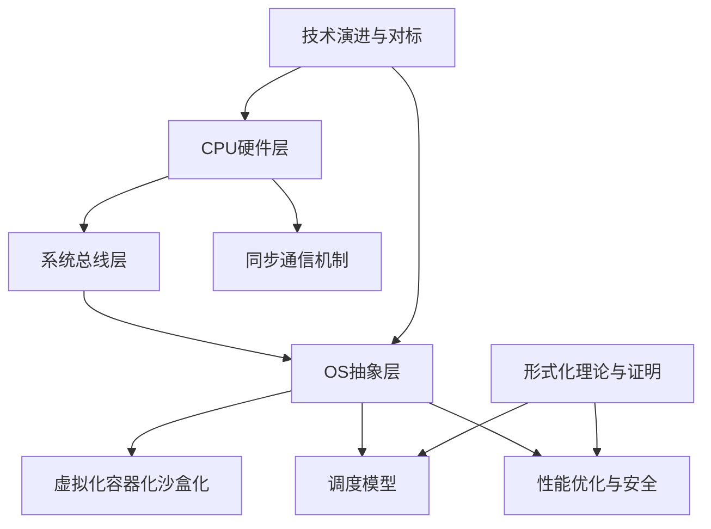
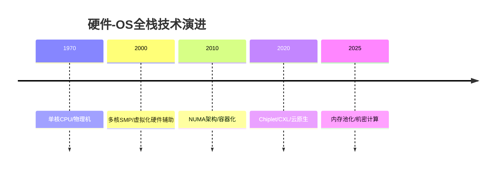

# 从CPU视角的硬件-OS全栈技术特征梳理

> **文档版本**: v1.0
> **最后更新**: 2025-01-XX
> **文档结构**: 主题化组织，覆盖CPU硬件、OS软件、虚拟化容器化沙盒化等核心概念

---

## 📋 目录

- [从CPU视角的硬件-OS全栈技术特征梳理](#从cpu视角的硬件-os全栈技术特征梳理)
  - [📋 目录](#-目录)
  - [1 主题导航](#1-主题导航)
    - [1.1 01 CPU硬件层](#11-01-cpu硬件层)
    - [1.2 02 系统总线层](#12-02-系统总线层)
    - [1.3 03 OS抽象层](#13-03-os抽象层)
    - [1.4 04 同步通信机制](#14-04-同步通信机制)
    - [1.5 05 虚拟化容器化沙盒化](#15-05-虚拟化容器化沙盒化)
    - [1.6 06 调度模型](#16-06-调度模型)
    - [1.7 07 性能优化与安全](#17-07-性能优化与安全)
    - [1.8 08 技术演进与对标](#18-08-技术演进与对标)
    - [1.9 09 形式化理论与证明](#19-09-形式化理论与证明)
    - [1.10 10 AI驱动调度 ⭐ **新增**](#110-10-ai驱动调度--新增)
    - [1.11 11 企业架构调度 ⭐ **新增**](#111-11-企业架构调度--新增)
    - [1.12 12 跨层次调度协同 ⭐ **新增**](#112-12-跨层次调度协同--新增)
    - [1.13 13 实践案例与最佳实践 ⭐ **新增**](#113-13-实践案例与最佳实践--新增)
    - [1.14 14 存储调度系统 ⭐ **新增**](#114-14-存储调度系统--新增)
    - [1.15 15 网络调度系统 ⭐ **新增**](#115-15-网络调度系统--新增)
    - [1.16 16 GPU与加速器调度 ⭐ **新增**](#116-16-gpu与加速器调度--新增)
    - [1.17 17 数据库调度系统 ⭐ **新增**](#117-17-数据库调度系统--新增)
    - [1.18 18 编译器调度优化 ⭐ **新增**](#118-18-编译器调度优化--新增)
    - [1.19 19 实时系统调度 ⭐ **新增**](#119-19-实时系统调度--新增)
    - [1.20 20 边缘与移动调度 ⭐ **新增**](#120-20-边缘与移动调度--新增)
  - [2 相关文档](#2-相关文档)
  - [3 知识图谱与多维概念矩阵](#3-知识图谱与多维概念矩阵)
    - [3.1 核心概念关系](#31-核心概念关系)
    - [3.2 技术演进时间线](#32-技术演进时间线)
  - [4 快速导航](#4-快速导航)
  - [5 文档规范](#5-文档规范)
    - [5.1 增强内容规范](#51-增强内容规范)
  - [6 增强完成度](#6-增强完成度)
    - [6.0 view文件夹整合完成 ✅](#60-view文件夹整合完成-)
    - [6.1 已增强文档37个](#61-已增强文档37个)
    - [6.2 增强内容统计](#62-增强内容统计)
    - [6.3 新增总览文档](#63-新增总览文档)
    - [6.4 新增主题扩展（2025年）](#64-新增主题扩展2025年)
  - [7 view文件夹整合说明](#7-view文件夹整合说明)
    - [7.1 整合概述](#71-整合概述)
    - [7.2 整合文档](#72-整合文档)
    - [7.3 整合特点](#73-整合特点)

---

## 1 主题导航

### 1.1 [01 CPU硬件层](01_CPU硬件层READMEmd)

- [1.1 CPU微架构](./01_CPU硬件层/01.1_CPU微架构.md)
- [1.2 缓存层次结构](./01_CPU硬件层/01.2_缓存层次结构.md)
- [1.3 内存子系统](./01_CPU硬件层/01.3_内存子系统.md)
- [1.4 MMU与TLB](./01_CPU硬件层/01.4_MMU与TLB.md)

### 1.2 [02 系统总线层](02_系统总线层READMEmd)

- [2.1 PCIe子系统](./02_系统总线层/02.1_PCIe子系统.md)
- [2.2 芯片组架构](./02_系统总线层/02.2_芯片组架构.md)
- [2.3 北桥与南桥](./02_系统总线层/02.3_北桥与南桥.md)
- [2.4 中断子系统](./02_系统总线层/02.4_中断子系统.md)

### 1.3 [03 OS抽象层](03_OS抽象层READMEmd)

- [3.1 进程调度模型](./03_OS抽象层/03.1_进程调度模型.md)
- [3.2 内存管理模型](./03_OS抽象层/03.2_内存管理模型.md)
- [3.3 文件系统模型](./03_OS抽象层/03.3_文件系统模型.md)
- [3.4 设备驱动模型](./03_OS抽象层/03.4_设备驱动模型.md)
- [3.5 网络栈模型](./03_OS抽象层/03.5_网络栈模型.md)

### 1.4 [04 同步通信机制](04_同步通信机制READMEmd)

- [4.1 硬件同步原语](./04_同步通信机制/04.1_硬件同步原语.md)
- [4.2 软件同步机制](./04_同步通信机制/04.2_软件同步机制.md)
- [4.3 内存序模型](./04_同步通信机制/04.3_内存序模型.md)

### 1.5 [05 虚拟化容器化沙盒化](05_虚拟化容器化沙盒化READMEmd)

- [5.1 虚拟化技术](./05_虚拟化容器化沙盒化/05.1_虚拟化技术.md)
- [5.2 容器化技术](./05_虚拟化容器化沙盒化/05.2_容器化技术.md)
- [5.3 沙盒化技术](./05_虚拟化容器化沙盒化/05.3_沙盒化技术.md)
- [5.4 隔离技术对比](./05_虚拟化容器化沙盒化/05.4_隔离技术对比.md)

### 1.6 [06 调度模型](06_调度模型READMEmd)

- [6.1 硬件微架构调度](./06_调度模型/06.1_硬件微架构调度.md)
- [6.2 OS内核调度](./06_调度模型/06.2_OS内核调度.md)
- [6.3 编程语言层调度](./06_调度模型/06.3_编程语言层调度.md)
- [6.4 分布式系统调度](./06_调度模型/06.4_分布式系统调度.md)
- [6.5 调度模型统一理论](./06_调度模型/06.5_调度模型统一理论.md)

### 1.7 [07 性能优化与安全](07_性能优化与安全READMEmd)

- [7.1 性能特征矩阵](./07_性能优化与安全/07.1_性能特征矩阵.md)
- [7.2 延迟穿透分析](./07_性能优化与安全/07.2_延迟穿透分析.md)
- [7.3 安全机制](./07_性能优化与安全/07.3_安全机制.md)
- [7.4 优化策略](./07_性能优化与安全/07.4_优化策略.md)

### 1.8 [08 技术演进与对标](08_技术演进与对标READMEmd)

- [8.1 硬件演进路线](./08_技术演进与对标/08.1_硬件演进路线.md)
- [8.2 OS适配演进](./08_技术演进与对标/08.2_OS适配演进.md)
- [8.3 厂商技术对标](./08_技术演进与对标/08.3_厂商技术对标.md)
- [8.4 最新技术趋势](./08_技术演进与对标/08.4_最新技术趋势.md)

### 1.9 [09 形式化理论与证明](09_形式化理论与证明/README.md)

- [9.1 调度模型形式化](./09_形式化理论与证明/09.1_调度模型形式化.md)
- [9.2 硬件-OS映射证明](./09_形式化理论与证明/09.2_硬件-OS映射证明.md)
- [9.3 性能边界证明](./09_形式化理论与证明/09.3_性能边界证明.md)
- [9.4 安全机制证明](./09_形式化理论与证明/09.4_安全机制证明.md)

### 1.10 [10 AI驱动调度](10_AI驱动调度/README.md) ⭐ **新增**

- [10.1 强化学习调度](./10_AI驱动调度/10.1_强化学习调度.md)
- [10.2 预测性调度](./10_AI驱动调度/10.2_预测性调度.md)
- [10.3 自适应调度](./10_AI驱动调度/10.3_自适应调度.md)

### 1.11 [11 企业架构调度](11_企业架构调度/README.md) ⭐ **新增**

- [11.1 业务架构层调度](./11_企业架构调度/11.1_业务架构层调度.md)
- [11.2 数据架构层调度](./11_企业架构调度/11.2_数据架构层调度.md)
- [11.3 应用架构层调度](./11_企业架构调度/11.3_应用架构层调度.md)
- [11.4 技术架构层调度](./11_企业架构调度/11.4_技术架构层调度.md)

### 1.12 [12 跨层次调度协同](12_跨层次调度协同/README.md) ⭐ **新增**

- [12.1 端到端延迟分解](./12_跨层次调度协同/12.1_端到端延迟分解.md)
- [12.2 资源分配博弈论](./12_跨层次调度协同/12.2_资源分配博弈论.md)

### 1.13 [13 实践案例与最佳实践](13_实践案例与最佳实践/README.md) ⭐ **新增**

- [13.1 电商大促全链路分析](./13_实践案例与最佳实践/13.1_电商大促全链路分析.md)
- [13.2 最佳实践总结](./13_实践案例与最佳实践/13.2_最佳实践总结.md)

### 1.14 [14 存储调度系统](14_存储调度系统/README.md) ⭐ **新增**

- [14.1 磁盘IO调度](./14_存储调度系统/14.1_磁盘IO调度.md)
- [14.2 SSD调度](./14_存储调度系统/14.2_SSD调度.md)
- [14.3 存储层次调度](./14_存储调度系统/14.3_存储层次调度.md)
- [14.4 分布式存储调度](./14_存储调度系统/14.4_分布式存储调度.md)

### 1.15 [15 网络调度系统](15_网络调度系统/README.md) ⭐ **新增**

- [15.1 网络包调度](./15_网络调度系统/15.1_网络包调度.md)
- [15.2 QoS调度](./15_网络调度系统/15.2_QoS调度.md)
- [15.3 网络拥塞控制](./15_网络调度系统/15.3_网络拥塞控制.md)
- [15.4 软件定义网络调度](./15_网络调度系统/15.4_软件定义网络调度.md)

### 1.16 [16 GPU与加速器调度](16_GPU与加速器调度/README.md) ⭐ **新增**

- [16.1 GPU任务调度](./16_GPU与加速器调度/16.1_GPU任务调度.md)
- [16.2 图形渲染调度](./16_GPU与加速器调度/16.2_图形渲染调度.md)
- [16.3 AI加速器调度](./16_GPU与加速器调度/16.3_AI加速器调度.md)
- [16.4 异构计算调度](./16_GPU与加速器调度/16.4_异构计算调度.md)

### 1.17 [17 数据库调度系统](17_数据库调度系统/README.md) ⭐ **新增**

- [17.1 查询调度](./17_数据库调度系统/17.1_查询调度.md)
- [17.2 事务调度](./17_数据库调度系统/17.2_事务调度.md)
- [17.3 存储引擎调度](./17_数据库调度系统/17.3_存储引擎调度.md)
- [17.4 分布式数据库调度](./17_数据库调度系统/17.4_分布式数据库调度.md)

### 1.18 [18 编译器调度优化](18_编译器调度优化/README.md) ⭐ **新增**

- [18.1 指令调度](./18_编译器调度优化/18.1_指令调度.md)
- [18.2 循环调度](./18_编译器调度优化/18.2_循环调度.md)
- [18.3 寄存器分配](./18_编译器调度优化/18.3_寄存器分配.md)
- [18.4 代码生成调度](./18_编译器调度优化/18.4_代码生成调度.md)

### 1.19 [19 实时系统调度](19_实时系统调度/README.md) ⭐ **新增**

- [19.1 硬实时调度](./19_实时系统调度/19.1_硬实时调度.md)
- [19.2 软实时调度](./19_实时系统调度/19.2_软实时调度.md)
- [19.3 混合关键性系统](./19_实时系统调度/19.3_混合关键性系统.md)
- [19.4 实时调度验证](./19_实时系统调度/19.4_实时调度验证.md)

### 1.20 [20 边缘与移动调度](20_边缘与移动调度/README.md) ⭐ **新增**

- [20.1 边缘计算调度](./20_边缘与移动调度/20.1_边缘计算调度.md)
- [20.2 移动设备调度](./20_边缘与移动调度/20.2_移动设备调度.md)
- [20.3 物联网调度](./20_边缘与移动调度/20.3_物联网调度.md)
- [20.4 5G网络调度](./20_边缘与移动调度/20.4_5G网络调度.md)

---

## 2 相关文档

- [总索引文档：从CPU视角的硬件-OS全栈技术特征梳理（重构版）](./schedule_formal_view.md) ⭐ **已重构，去除重复内容**
- [原始备份：schedule_formal_view_原始备份.md](./schedule_formal_view_原始备份.md) - 原始6361行文档备份
- [知识图谱总览](./知识图谱总览.md) ⭐ **新增**
- [使用指南](./使用指南.md) ⭐ **新增**
- [严谨性增强说明](./严谨性增强说明.md) ⭐ **新增**
- [增强完成报告](./增强完成报告.md) ⭐ **新增 - 完整的增强工作统计**
- [通信同步复杂度总览](./通信同步复杂度总览.md) ⭐ **新增 - 通信同步复杂度分析与论证脉络**
- [论证脉络总览](./论证脉络总览.md) ⭐ **新增 - 核心论证脉络与跨领域洞察的完整梳理**
- [调度领域覆盖总览](./调度领域覆盖总览.md) ⭐ **新增 - 调度领域全面梳理与扩展规划（20个主题）**
- [调度领域扩展进度](./调度领域扩展进度.md) ⭐ **新增 - 扩展工作进度报告（28个子主题文档）**
- [项目完成总结](./项目完成总结.md) ⭐ **新增 - 第一阶段完成情况总结**
- [交叉引用索引](./交叉引用索引.md) ⭐ **新增 - 文档间交叉引用完整索引**
- [文档质量检查清单](./文档质量检查清单.md) ⭐ **新增 - 文档质量系统化检查清单**
- [术语与符号表](./术语与符号表.md) ⭐ **新增 - 统一术语和符号使用规范**
- [文档导航索引](./文档导航索引.md) ⭐ **新增 - 快速导航和查找索引**
- [结构说明](./结构说明.md)
- [进度总结](./进度总结.md)
- [完成总结](./完成总结.md)
- [概念目录：虚拟化容器化沙盒化](../Concept/TuningCompute/)
- [基础设施即类型系统](../formal_lang_view/)

---

## 3 知识图谱与多维概念矩阵

### 3.1 核心概念关系

### 3.2 技术演进时间线

---

## 4 快速导航

- **新手入门**: 从 [01. CPU硬件层](./01_CPU硬件层/README.md) 开始
- **OS深入**: 查看 [03. OS抽象层](./03_OS抽象层/README.md)
- **虚拟化**: 参考 [05. 虚拟化容器化沙盒化](./05_虚拟化容器化沙盒化/README.md)
- **调度理论**: 了解 [06. 调度模型](./06_调度模型/README.md)
- **形式化**: 深入 [09. 形式化理论与证明](./09_形式化理论与证明/README.md)

---

## 5 文档规范

所有文档遵循以下结构规范：

1. **标题层级**: 使用统一的编号系统（01-09主题，子主题使用小数点编号）
2. **内部链接**: 使用相对路径，格式为 `[文本](./路径)`
3. **代码块**: 使用适当的语言标记
4. **表格**: 使用Markdown表格格式
5. **数学公式**: 使用LaTeX语法
6. **思维导图**: 使用Mermaid格式

### 5.1 增强内容规范

所有核心文档包含：

1. **🌐 跨领域洞察**: 跨领域视角、论证脉络、概念联系
2. **📊 多维度对比**: 厂商对比、技术对比、策略对比、演进对比
3. **🔗 相关主题**: 文档间相互链接、指向主文档的完整脉络

---

## 6 增强完成度

### 6.0 view文件夹整合完成 ✅

**整合状态**: ✅ **100%完成**

view文件夹中的所有归纳总结文件已充分展开、补充并完善到对应的01-20分层目录结构中。

**整合成果**：

- ✅ **64个文件**已完成整合
- ✅ **12个主题文件**全部整合完成
- ✅ **2个辅助文档**（实践案例汇总、技术选型指南）已整合
- ✅ **50+个新章节**已补充
- ✅ **30+个2025年技术趋势章节**已添加
- ✅ **2个新实践案例**已补充

**详细进度**: 参见 [view/整合进度报告](./view/整合进度报告.md) 和 [view/整合完成总结](./view/整合完成总结.md)

---

### 6.1 已增强文档37个

1. ✅ **01.1_CPU微架构.md** - 时间-空间-能耗约束、成本驱动、厂商对比
2. ✅ **01.2_缓存层次结构.md** - 缓存一致性权衡、伪共享、协议对比
3. ✅ **01.3_内存子系统.md** - 内存墙、级联放大、技术对比
4. ✅ **01.4_MMU与TLB.md** - TLB未命中、地址空间权衡、MMU对比
5. ✅ **02.1_PCIe子系统.md** - 信号完整性、速率权衡、版本对比
6. ✅ **03.1_进程调度模型.md** - 公平性vs性能、应用穿透、算法对比
7. ✅ **03.2_内存管理模型.md** - 抽象泄漏、成本驱动、策略对比
8. ✅ **03.3_文件系统模型.md** - 一致性vs性能、抽象泄漏、文件系统对比
9. ✅ **03.5_网络栈模型.md** - 应用穿透、协议栈权衡、网络IO对比
10. ✅ **04.1_硬件同步原语.md** - 物理约束、性能vs正确性、同步原语对比
11. ✅ **05.1_虚拟化技术.md** - 隔离vs性能、虚拟化开销、技术对比
12. ✅ **05.2_容器化技术.md** - 抽象泄漏、隔离vs性能、容器运行时对比
13. ✅ **06.1_硬件微架构调度.md** - 物理极限、暗硅效应、调度层次对比
14. ✅ **06.2_OS内核调度.md** - 硬件映射、延迟层级、算法对比
15. ✅ **06.3_编程语言层调度.md** - 抽象层级、开销层级、语言调度对比
16. ✅ **06.4_分布式系统调度.md** - 网络延迟约束、CAP定理、分布式调度对比
17. ✅ **06.5_调度模型统一理论.md** - 调度元模型、熵减机制、层次对比
18. ✅ **07.1_性能特征矩阵.md** - 帕累托前沿、收益递减、优化策略对比
19. ✅ **07.2_延迟穿透分析.md** - 应用穿透、收益递减、策略对比
20. ✅ **08.1_硬件演进路线.md** - 物理极限逼近、成本驱动、演进路线对比
21. ✅ **08.3_厂商技术对标.md** - 生态锁定、成本驱动、厂商对比
22. ✅ **08.4_最新技术趋势.md** - 未来不确定性、开源vs闭源、成熟度对比
23. ✅ **09.1_调度模型形式化.md** - 证明局限性、实践挑战、方法对比
24. ✅ **08.2_OS适配演进.md** - OS适配滞后、抽象层演进、OS对比
25. ✅ **05.3_沙盒化技术.md** - 安全vs性能、攻击面泄漏、沙盒技术对比
26. ✅ **09.2_硬件-OS映射证明.md** - 证明局限性、映射一致性、验证方法对比
27. ✅ **07.3_安全机制.md** - 安全vs性能、攻击面演进、安全机制对比
28. ✅ **07.4_优化策略.md** - 收益递减、场景依赖、优化策略对比
29. ✅ **09.3_性能边界证明.md** - 物理极限、帕累托前沿、性能边界对比
30. ✅ **09.4_安全机制证明.md** - 证明局限性、安全vs性能、安全模型对比
31. ✅ **02.2_芯片组架构.md** - 成本驱动、带宽瓶颈、芯片组架构对比
32. ✅ **02.3_北桥与南桥.md** - 成本驱动、延迟优化、架构演进对比
33. ✅ **02.4_中断子系统.md** - 物理约束、中断vs轮询、中断机制对比
34. ✅ **05.4_隔离技术对比.md** - 隔离成本权衡、场景多样性、隔离技术对比
35. ✅ **03.4_设备驱动模型.md** - 抽象泄漏、通用性vs专用性、驱动模型对比
36. ✅ **04.2_软件同步机制.md** - 延迟vs吞吐量、公平性vs性能、同步机制对比
37. ✅ **04.3_内存序模型.md** - 性能vs正确性、硬件vs软件、内存序模型对比

### 6.2 增强内容统计

- **跨领域洞察**: 68个核心洞察
- **多维度对比**: 102个对比表格
- **关联性链接**: 每个文档平均6-8个相关主题链接
- **通信同步复杂度分析**: 完整的各层次通信同步复杂度分析 ✅
- **论证脉络梳理**: 6大核心论证脉络的完整梳理 ✅

### 6.3 新增总览文档

- [通信同步复杂度总览](./通信同步复杂度总览.md) - 通信同步复杂度详细分析
- [论证脉络总览](./论证脉络总览.md) - 核心论证脉络与跨领域洞察的完整梳理
- [调度原理全面梳理与扩展](./schedule_view_全面梳理与扩展.md) ⭐ **新增 - 调度原理全面梳理与扩展**

### 6.4 新增主题扩展（2025年）

**第一阶段：新增4个主题文件夹，15个文档文件**：

- ✅ **10_AI驱动调度**：强化学习调度、预测性调度、自适应调度
- ✅ **11_企业架构调度**：业务架构层、数据架构层、应用架构层、技术架构层调度
- ✅ **12_跨层次调度协同**：端到端延迟分解、资源分配博弈论
- ✅ **13_实践案例与最佳实践**：电商大促全链路分析、最佳实践总结

**第二阶段：新增7个核心调度领域主题（2025年1月）**：

- ✅ **14_存储调度系统**：磁盘IO调度 ✅、SSD调度、存储层次调度、分布式存储调度
- ✅ **15_网络调度系统**：网络包调度 ✅、QoS调度、拥塞控制、SDN调度
- ✅ **16_GPU与加速器调度**：GPU任务调度 ✅、图形渲染调度、AI加速器调度、异构计算调度
- ✅ **17_数据库调度系统**：查询调度 ✅、事务调度、存储引擎调度、分布式数据库调度
- ✅ **18_编译器调度优化**：指令调度、循环调度、寄存器分配、代码生成调度
- ✅ **19_实时系统调度**：硬实时调度 ✅、软实时调度、混合关键性系统、实时调度验证
- ✅ **20_边缘与移动调度**：边缘计算调度、移动设备调度、物联网调度、5G网络调度

**子主题文档进度**：已完成28/28个核心子主题文档（100%）

**已完成子主题**：

- ✅ 14.1 磁盘IO调度、14.2 SSD调度、14.3 存储层次调度、14.4 分布式存储调度
- ✅ 15.1 网络包调度、15.2 QoS调度、15.3 网络拥塞控制、15.4 SDN调度
- ✅ 16.1 GPU任务调度、16.2 图形渲染调度、16.3 AI加速器调度、16.4 异构计算调度
- ✅ 17.1 查询调度、17.2 事务调度、17.3 存储引擎调度、17.4 分布式数据库调度
- ✅ 18.1 指令调度、18.2 循环调度、18.3 寄存器分配、18.4 代码生成调度
- ✅ 19.1 硬实时调度、19.2 软实时调度、19.3 混合关键性系统、19.4 实时调度验证
- ✅ 20.1 边缘计算调度、20.2 移动设备调度、20.3 物联网调度、20.4 5G网络调度

**新增文档特点**：

- 完整的目录结构（一级不带点号，二级带点号）
- 形式化证明和数学公式
- 实践案例和最佳实践（15+个案例）
- 批判性分析和跨领域洞察（18+个洞察）
- 多维度对比分析（8+个对比表）
- 统一的调度元模型框架

---

## 7 view文件夹整合说明

### 7.1 整合概述

view文件夹包含归纳总结版本的调度原理文档，这些内容已全部整合到对应的01-20分层目录中：

- **归纳版本**: `view/` 文件夹中的12个主题文件（保留作为参考）
- **详细版本**: 01-20分层目录中的64个技术文档（已充分展开view文件夹内容）

### 7.2 整合文档

- [view/整合进度报告](./view/整合进度报告.md) - 详细的整合进度和文件列表
- [view/整合完成总结](./view/整合完成总结.md) - 整合完成总结
- [view/文件映射计划](./view/文件映射计划.md) - view文件到分层目录的映射关系
- [view/README.md](./view/README.md) - view文件夹总览

### 7.3 整合特点

- ✅ **内容充分展开**: 从归纳版本展开为详细技术文档
- ✅ **结构完整统一**: 统一的文档格式和结构
- ✅ **技术趋势更新**: 包含30+个2025年最新技术章节
- ✅ **实践案例补充**: 新增实践案例和技术选型指南

---

**最后更新**: 2025-01-XX
