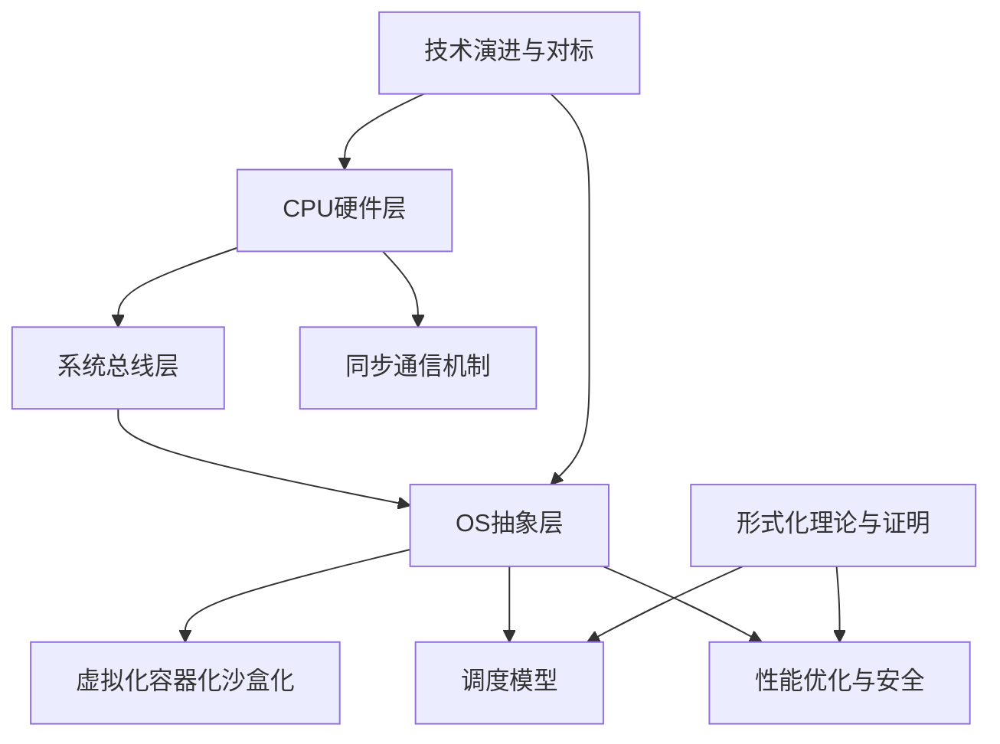
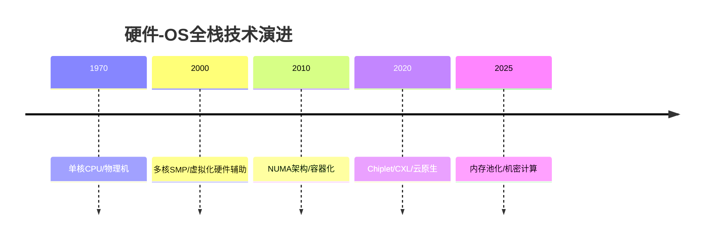

# 从CPU视角的硬件-OS全栈技术特征梳理

> **文档版本**: v1.0
> **最后更新**: 2025-01-XX
> **文档结构**: 主题化组织，覆盖CPU硬件、OS软件、虚拟化容器化沙盒化等核心概念

---

## 📚 主题导航

### [01. CPU硬件层](./01_CPU硬件层/README.md)

- [1.1 CPU微架构](./01_CPU硬件层/01.1_CPU微架构.md)
- [1.2 缓存层次结构](./01_CPU硬件层/01.2_缓存层次结构.md)
- [1.3 内存子系统](./01_CPU硬件层/01.3_内存子系统.md)
- [1.4 MMU与TLB](./01_CPU硬件层/01.4_MMU与TLB.md)

### [02. 系统总线层](./02_系统总线层/README.md)

- [2.1 PCIe子系统](./02_系统总线层/02.1_PCIe子系统.md)
- [2.2 芯片组架构](./02_系统总线层/02.2_芯片组架构.md)
- [2.3 北桥与南桥](./02_系统总线层/02.3_北桥与南桥.md)
- [2.4 中断子系统](./02_系统总线层/02.4_中断子系统.md)

### [03. OS抽象层](./03_OS抽象层/README.md)

- [3.1 进程调度模型](./03_OS抽象层/03.1_进程调度模型.md)
- [3.2 内存管理模型](./03_OS抽象层/03.2_内存管理模型.md)
- [3.3 文件系统模型](./03_OS抽象层/03.3_文件系统模型.md)
- [3.4 设备驱动模型](./03_OS抽象层/03.4_设备驱动模型.md)
- [3.5 网络栈模型](./03_OS抽象层/03.5_网络栈模型.md)

### [04. 同步通信机制](./04_同步通信机制/README.md)

- [4.1 硬件同步原语](./04_同步通信机制/04.1_硬件同步原语.md)
- [4.2 软件同步机制](./04_同步通信机制/04.2_软件同步机制.md)
- [4.3 内存序模型](./04_同步通信机制/04.3_内存序模型.md)

### [05. 虚拟化容器化沙盒化](./05_虚拟化容器化沙盒化/README.md)

- [5.1 虚拟化技术](./05_虚拟化容器化沙盒化/05.1_虚拟化技术.md)
- [5.2 容器化技术](./05_虚拟化容器化沙盒化/05.2_容器化技术.md)
- [5.3 沙盒化技术](./05_虚拟化容器化沙盒化/05.3_沙盒化技术.md)
- [5.4 隔离技术对比](./05_虚拟化容器化沙盒化/05.4_隔离技术对比.md)

### [06. 调度模型](./06_调度模型/README.md)

- [6.1 硬件微架构调度](./06_调度模型/06.1_硬件微架构调度.md)
- [6.2 OS内核调度](./06_调度模型/06.2_OS内核调度.md)
- [6.3 编程语言层调度](./06_调度模型/06.3_编程语言层调度.md)
- [6.4 分布式系统调度](./06_调度模型/06.4_分布式系统调度.md)
- [6.5 调度模型统一理论](./06_调度模型/06.5_调度模型统一理论.md)

### [07. 性能优化与安全](./07_性能优化与安全/README.md)

- [7.1 性能特征矩阵](./07_性能优化与安全/07.1_性能特征矩阵.md)
- [7.2 延迟穿透分析](./07_性能优化与安全/07.2_延迟穿透分析.md)
- [7.3 安全机制](./07_性能优化与安全/07.3_安全机制.md)
- [7.4 优化策略](./07_性能优化与安全/07.4_优化策略.md)

### [08. 技术演进与对标](./08_技术演进与对标/README.md)

- [8.1 硬件演进路线](./08_技术演进与对标/08.1_硬件演进路线.md)
- [8.2 OS适配演进](./08_技术演进与对标/08.2_OS适配演进.md)
- [8.3 厂商技术对标](./08_技术演进与对标/08.3_厂商技术对标.md)
- [8.4 最新技术趋势](./08_技术演进与对标/08.4_最新技术趋势.md)

### [09. 形式化理论与证明](./09_形式化理论与证明/README.md)

- [9.1 调度模型形式化](./09_形式化理论与证明/09.1_调度模型形式化.md)
- [9.2 硬件-OS映射证明](./09_形式化理论与证明/09.2_硬件-OS映射证明.md)
- [9.3 性能边界证明](./09_形式化理论与证明/09.3_性能边界证明.md)
- [9.4 安全机制证明](./09_形式化理论与证明/09.4_安全机制证明.md)

---

## 🔗 相关文档

- [总索引文档：从CPU视角的硬件-OS全栈技术特征梳理（重构版）](./schedule_formal_view.md) ⭐ **已重构，去除重复内容**
- [原始备份：schedule_formal_view_原始备份.md](./schedule_formal_view_原始备份.md) - 原始6361行文档备份
- [知识图谱总览](./知识图谱总览.md) ⭐ **新增**
- [使用指南](./使用指南.md) ⭐ **新增**
- [严谨性增强说明](./严谨性增强说明.md) ⭐ **新增**
- [增强完成报告](./增强完成报告.md) ⭐ **新增 - 完整的增强工作统计**
- [通信同步复杂度总览](./通信同步复杂度总览.md) ⭐ **新增 - 通信同步复杂度分析与论证脉络**
- [论证脉络总览](./论证脉络总览.md) ⭐ **新增 - 核心论证脉络与跨领域洞察的完整梳理**
- [结构说明](./结构说明.md)
- [进度总结](./进度总结.md)
- [完成总结](./完成总结.md)
- [概念目录：虚拟化容器化沙盒化](../Concept/TuningCompute/)
- [基础设施即类型系统](../formal_lang_view/)

---

## 📊 知识图谱与多维概念矩阵

### 核心概念关系

### 技术演进时间线

---

## 🎯 快速导航

- **新手入门**: 从 [01. CPU硬件层](./01_CPU硬件层/README.md) 开始
- **OS深入**: 查看 [03. OS抽象层](./03_OS抽象层/README.md)
- **虚拟化**: 参考 [05. 虚拟化容器化沙盒化](./05_虚拟化容器化沙盒化/README.md)
- **调度理论**: 了解 [06. 调度模型](./06_调度模型/README.md)
- **形式化**: 深入 [09. 形式化理论与证明](./09_形式化理论与证明/README.md)

---

## 📝 文档规范

所有文档遵循以下结构规范：

1. **标题层级**: 使用统一的编号系统（01-09主题，子主题使用小数点编号）
2. **内部链接**: 使用相对路径，格式为 `[文本](./路径)`
3. **代码块**: 使用适当的语言标记
4. **表格**: 使用Markdown表格格式
5. **数学公式**: 使用LaTeX语法
6. **思维导图**: 使用Mermaid格式

### 增强内容规范

所有核心文档包含：

1. **🌐 跨领域洞察**: 跨领域视角、论证脉络、概念联系
2. **📊 多维度对比**: 厂商对比、技术对比、策略对比、演进对比
3. **🔗 相关主题**: 文档间相互链接、指向主文档的完整脉络

---

## 📊 增强完成度

### 已增强文档（37个）

1. ✅ **01.1_CPU微架构.md** - 时间-空间-能耗约束、成本驱动、厂商对比
2. ✅ **01.2_缓存层次结构.md** - 缓存一致性权衡、伪共享、协议对比
3. ✅ **01.3_内存子系统.md** - 内存墙、级联放大、技术对比
4. ✅ **01.4_MMU与TLB.md** - TLB未命中、地址空间权衡、MMU对比
5. ✅ **02.1_PCIe子系统.md** - 信号完整性、速率权衡、版本对比
6. ✅ **03.1_进程调度模型.md** - 公平性vs性能、应用穿透、算法对比
7. ✅ **03.2_内存管理模型.md** - 抽象泄漏、成本驱动、策略对比
8. ✅ **03.3_文件系统模型.md** - 一致性vs性能、抽象泄漏、文件系统对比
9. ✅ **03.5_网络栈模型.md** - 应用穿透、协议栈权衡、网络IO对比
10. ✅ **04.1_硬件同步原语.md** - 物理约束、性能vs正确性、同步原语对比
11. ✅ **05.1_虚拟化技术.md** - 隔离vs性能、虚拟化开销、技术对比
12. ✅ **05.2_容器化技术.md** - 抽象泄漏、隔离vs性能、容器运行时对比
13. ✅ **06.1_硬件微架构调度.md** - 物理极限、暗硅效应、调度层次对比
14. ✅ **06.2_OS内核调度.md** - 硬件映射、延迟层级、算法对比
15. ✅ **06.3_编程语言层调度.md** - 抽象层级、开销层级、语言调度对比
16. ✅ **06.4_分布式系统调度.md** - 网络延迟约束、CAP定理、分布式调度对比
17. ✅ **06.5_调度模型统一理论.md** - 调度元模型、熵减机制、层次对比
18. ✅ **07.1_性能特征矩阵.md** - 帕累托前沿、收益递减、优化策略对比
19. ✅ **07.2_延迟穿透分析.md** - 应用穿透、收益递减、策略对比
20. ✅ **08.1_硬件演进路线.md** - 物理极限逼近、成本驱动、演进路线对比
21. ✅ **08.3_厂商技术对标.md** - 生态锁定、成本驱动、厂商对比
22. ✅ **08.4_最新技术趋势.md** - 未来不确定性、开源vs闭源、成熟度对比
23. ✅ **09.1_调度模型形式化.md** - 证明局限性、实践挑战、方法对比
24. ✅ **08.2_OS适配演进.md** - OS适配滞后、抽象层演进、OS对比
25. ✅ **05.3_沙盒化技术.md** - 安全vs性能、攻击面泄漏、沙盒技术对比
26. ✅ **09.2_硬件-OS映射证明.md** - 证明局限性、映射一致性、验证方法对比
27. ✅ **07.3_安全机制.md** - 安全vs性能、攻击面演进、安全机制对比
28. ✅ **07.4_优化策略.md** - 收益递减、场景依赖、优化策略对比
29. ✅ **09.3_性能边界证明.md** - 物理极限、帕累托前沿、性能边界对比
30. ✅ **09.4_安全机制证明.md** - 证明局限性、安全vs性能、安全模型对比
31. ✅ **02.2_芯片组架构.md** - 成本驱动、带宽瓶颈、芯片组架构对比
32. ✅ **02.3_北桥与南桥.md** - 成本驱动、延迟优化、架构演进对比
33. ✅ **02.4_中断子系统.md** - 物理约束、中断vs轮询、中断机制对比
34. ✅ **05.4_隔离技术对比.md** - 隔离成本权衡、场景多样性、隔离技术对比
35. ✅ **03.4_设备驱动模型.md** - 抽象泄漏、通用性vs专用性、驱动模型对比
36. ✅ **04.2_软件同步机制.md** - 延迟vs吞吐量、公平性vs性能、同步机制对比
37. ✅ **04.3_内存序模型.md** - 性能vs正确性、硬件vs软件、内存序模型对比

### 增强内容统计

- **跨领域洞察**: 68个核心洞察
- **多维度对比**: 102个对比表格
- **关联性链接**: 每个文档平均6-8个相关主题链接
- **通信同步复杂度分析**: 完整的各层次通信同步复杂度分析 ✅
- **论证脉络梳理**: 6大核心论证脉络的完整梳理 ✅

### 新增总览文档

- [通信同步复杂度总览](./通信同步复杂度总览.md) - 通信同步复杂度详细分析
- [论证脉络总览](./论证脉络总览.md) - 核心论证脉络与跨领域洞察的完整梳理

---

**最后更新**: 2025-01-XX
