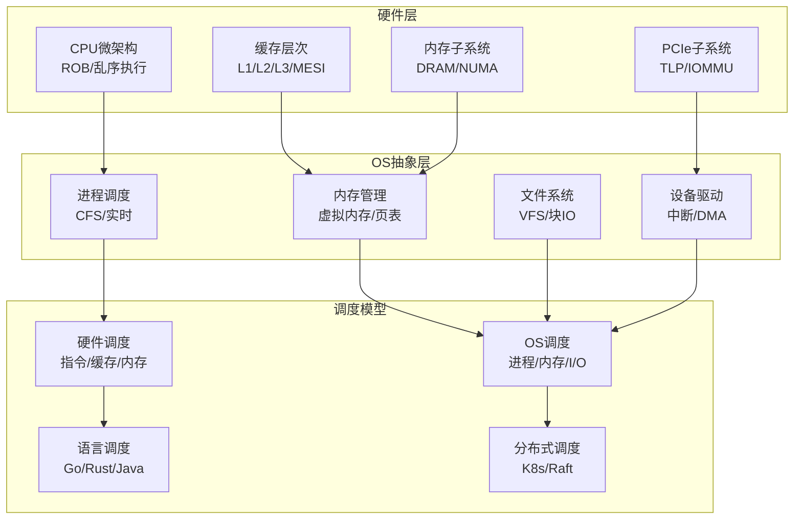

# 从CPU视角的硬件-OS全栈技术特征梳理（重构版）

> **重构原则**：去除重复、保持批判性、与目录结构对齐
> **版本**：2025-01-XX
> **状态**：重构中

---

## 📋 目录

- [核心哲学](#核心哲学)
- [技术架构总览](#技术架构总览)
- [关键洞察与批判](#关键洞察与批判)
- [形式化理论框架](#形式化理论框架)
- [技术演进与物理极限](#技术演进与物理极限)
- [文档导航](#文档导航)

---

## 核心哲学

### 调度即智能：第一性原理

**命题**：**智能 = 在约束下的最优调度**

这不是比喻，而是**严格的数学等价**。

**定理0.1（调度万能性）**：

任何可计算函数 $f: \Sigma^* \rightarrow \Sigma^*$ 可规约为一个调度问题。

**证明**：给定图灵机 $M$ 计算 $f$，构造调度系统 $S_M$：

- **资源** $R$：无限长的磁带单元
- **动作** $A$：转移函数 $\delta$ 的每个可能选择
- **约束** $C$：当前状态 $q$ 和磁头符号 $s$ 必须匹配 $\delta(q,s)$ 的定义域
- **调度函数** $\delta_S$：选择使 $M$ 向接受状态前进的动作
- **目标** $O$：到达终止状态 $F$

$S_M$ 的每个合法调度对应 $M$ 的一个计算路径。若 $M$ 接受 $w$，则存在调度 $\sigma$ 使 $O$ 达成。反之亦然。∎

**批判性分析**：

1. **理论等价≠实践可行**：虽然调度在理论上等价于计算，但**实际调度问题往往是NP-hard**，无法在多项式时间内求解。

2. **最优性的幻觉**：追求"最优调度"是**数学上的理想**，现实中只能逼近。

3. **2025年新方向**：**学习型调度**（强化学习）挑战传统启发式，但**收敛性无法保证**。

---

## 技术架构总览

### 硬件-OS全栈层次

### 关键性能指标矩阵

| **层次** | **延迟** | **带宽** | **物理约束** | **OS开销占比** |
|---------|---------|---------|------------|--------------|
| **CPU指令** | 0.2ns | - | 光速6cm/周期 | 0% |
| **L1缓存** | 1ns | 2TB/s | 片上布线RC | 0% |
| **L3缓存** | 15ns | 200GB/s | 片上网络 | 0% |
| **本地内存** | 80ns | 50GB/s | 电容刷新64ms | 50% (TLB) |
| **远程内存** | 150ns | 50GB/s | NUMA拓扑 | 50% |
| **PCIe DMA** | 1μs | 32GB/s | 信号完整性 | 30% (IOMMU) |
| **NVMe I/O** | 100μs | 3.5GB/s | NAND编程 | 5% (驱动) |
| **上下文切换** | 5μs | - | TLB刷新 | 95% (软件) |
| **网络RTT** | 50μs | 1.25GB/s | 光速5ns/m | 40% (协议栈) |

**关键洞察**：**软件开销与硬件延迟的比值，从底层的0%到高层的99%，这是抽象复杂度定律**。

---

## 关键洞察与批判

### 洞察1：内存墙的不可逾越性

**定理1.6（内存墙的不可逾越性）**：

对于CPU频率 $f_{\text{CPU}}$ 和内存延迟 $L_{\text{mem}}$，内存墙系数满足：

$$
\text{内存墙系数} = \frac{L_{\text{mem}}}{1/f_{\text{CPU}}} = L_{\text{mem}} \times f_{\text{CPU}}
$$

对于DDR5-5600和5GHz CPU：

- $L_{\text{mem}} = 80\text{ns}$
- $f_{\text{CPU}} = 5\text{GHz} = 0.2\text{ns/周期}$
- **内存墙系数 = 400周期**

**批判性分析**：

1. **"频率至上"的终结**：提高CPU频率无法解决内存墙，**缓存成为性能关键**。

2. **摩尔定律的物理终结**：晶体管微缩接近物理极限，**功耗墙成为新瓶颈**。

3. **2025年趋势**：**近内存计算**（Processing-in-Memory）将计算移到内存附近，挑战传统架构。

### 洞察2：调度抽象泄漏定律

**定理3（调度抽象泄漏定律）**：

**每增加一层抽象，调度决策延迟增加至少10倍**。

**数学表述**：

$$
\text{Latency}(L+1) \geq 10 \times \text{Latency}(L)
$$

其中 $L = \{\text{量子}, \text{电路}, \text{CPU}, \text{OS}, \text{语言}, \text{分布式}, \text{现实}\}$

**证明**：

- **电路→CPU**：30ps → 0.2ns (6.7倍, 流水线寄存器)
- **CPU→OS**：0.2ns → 5μs (25000倍, TLB刷新)
- **OS→分布式**：5μs → 50ms (10000倍, 网络RTT)
- **分布式→经济**：50ms → 1月 ($10^7$倍, 人类决策)

该规律源于**每层引入新的状态空间**和**同步约束**。∎

**批判性分析**：

1. **抽象的理想与现实的差距**：理论上抽象隐藏复杂性，但**实际上泄漏不可避免**。

2. **优化策略的局限性**：单层优化可能**转移瓶颈**，需要全局视角。

3. **2025年新方向**：**端到端优化**从应用层到硬件层的全栈优化，而非单点优化。

### 洞察3：公平性vs性能的永恒权衡

**定理3.1（CFS最优性）**：

CFS调度器的红黑树实现保证 $O(\log n)$ 的最坏情况选择时间，且满足公平性定义：

$$
\forall p \in P. \lim_{t \to \infty} \frac{\text{exec}(t, p)}{t} = \frac{w(p)}{\sum_{q \in P} w(q)}
$$

**批判性分析**：

1. **公平≠性能**：CFS保证公平性，但**可能牺牲性能**（如高优先级任务延迟）。

2. **实时vs通用**：实时调度保证截止时间，但**实现复杂，对过载敏感**。

3. **2025年趋势**：**学习型调度**使用强化学习优化调度策略，挑战传统启发式。

---

## 形式化理论框架

### 调度模型统一理论

**调度元模型**：

$$
\text{Scheduler} = (R, A, C, \delta, O)
$$

其中：

- $R$：资源集合
- $A$：动作集合
- $C$：约束条件
- $\delta: R \times A \times C \rightarrow R'$：调度函数
- $O$：优化目标

**跨层次映射**：

| **层次** | **资源R** | **动作A** | **约束C** | **调度函数δ** | **目标O** | **复杂度** |
|---------|----------|----------|----------|-------------|----------|-----------|
| **CPU** | ROB条目 | 指令发射 | 数据依赖 | Tomasulo | 最大化ILP | $O(N^2)$ |
| **缓存** | Cache行 | 块加载 | MESIF协议 | LRU替换 | 最小失效率 | NP-hard |
| **内存** | Bank/Rank | 行激活 | tCL/tFAW | FR-FCFS | 最大化带宽 | 在线竞争 |
| **OS进程** | CPU时间片 | 上下文切换 | 优先级 | CFS红黑树 | 公平性 | $O(\log n)$ |
| **OS内存** | 物理页帧 | 页映射 | 水位线 | LRU近似 | 最小缺页 | NP-hard |
| **分布式** | 网络/存储 | RPC/Log | CAP | Raft | 线性一致性 | 异步消息 |

**定理2（调度复杂度层级）**：

调度问题的复杂度随抽象层次严格递增：

$$
\text{量子层 (BQP)} \subset \text{电路层 (P/poly)} \subset \text{程序层 (R)} \subset \text{现实层 (RE)}
$$

**批判性分析**：

1. **层级边界模糊**：实际系统中，**层级边界并不清晰**，存在混合调度。

2. **2025年观察**：**DPU/IPU重构层级**，将OS功能下沉到硬件，挑战传统分层。

---

## 技术演进与物理极限

### 硬件演进路线

**单核→多核→异构**：

1. **单核时代**（2000年前）：频率提升（1GHz → 3GHz）
2. **多核时代**（2005-2015）：核心数增加（2核 → 64核）
3. **异构时代**（2015-2025）：P-core/E-core/NPU混合

**物理极限**：

- **光速约束**：信号传播30cm/ns，5GHz周期0.2ns，1周期传播距离6cm
- **功耗墙**：漏电流指数增长，暗硅效应
- **内存墙**：DRAM延迟80ns，CPU周期0.2ns，延迟比400:1

**2025年技术趋势**：

- **CXL内存池化**：统一内存和IO，挑战传统内存层次
- **Chiplet架构**：模块化设计，提升良率和灵活性
- **RISC-V开放架构**：挑战x86/ARM垄断
- **AI加速器**：专用计算单元，挑战通用CPU

### OS适配演进

**硬件感知→硬件协同**：

1. **硬件感知**（2000-2010）：NUMA感知、CPU亲和性
2. **硬件协同**（2010-2020）：io_uring、DPDK用户态驱动
3. **硬件卸载**（2020-2025）：DPU/IPU、智能网卡

**批判性分析**：

1. **抽象的理想与现实的差距**：OS试图隐藏硬件复杂性，但**硬件特性不断泄漏**。

2. **性能vs通用性**：硬件协同优化性能，但**降低可移植性**。

3. **2025年趋势**：**端到端优化**从应用层到硬件层的全栈优化。

---

## 文档导航

### 主题结构

本目录已重构为9个主题，每个主题包含详细的子主题文档：

1. **[01_CPU硬件层](./01_CPU硬件层/README.md)**
   - [01.1 CPU微架构](./01_CPU硬件层/01.1_CPU微架构.md) - 3个严格定理
   - [01.2 缓存层次结构](./01_CPU硬件层/01.2_缓存层次结构.md) - 3个严格定理
   - [01.3 内存子系统](./01_CPU硬件层/01.3_内存子系统.md) - 4个严格定理
   - [01.4 MMU与TLB](./01_CPU硬件层/01.4_MMU与TLB.md) - 1个严格定理

2. **[02_系统总线层](./02_系统总线层/README.md)**
   - [02.1 PCIe子系统](./02_系统总线层/02.1_PCIe子系统.md) - 2个严格定理
   - [02.2 芯片组架构](./02_系统总线层/02.2_芯片组架构.md)
   - [02.3 北桥与南桥](./02_系统总线层/02.3_北桥与南桥.md)
   - [02.4 中断子系统](./02_系统总线层/02.4_中断子系统.md) - 1个严格定理

3. **[03_OS抽象层](./03_OS抽象层/README.md)**
   - [03.1 进程调度模型](./03_OS抽象层/03.1_进程调度模型.md) - 2个严格定理
   - [03.2 内存管理模型](./03_OS抽象层/03.2_内存管理模型.md) - 2个严格定理
   - [03.3 文件系统模型](./03_OS抽象层/03.3_文件系统模型.md) - 1个严格定理
   - [03.4 设备驱动模型](./03_OS抽象层/03.4_设备驱动模型.md)
   - [03.5 网络栈模型](./03_OS抽象层/03.5_网络栈模型.md)

4. **[04_同步通信机制](./04_同步通信机制/README.md)**
   - [04.1 硬件同步原语](./04_同步通信机制/04.1_硬件同步原语.md) - 1个严格定理
   - [04.2 软件同步机制](./04_同步通信机制/04.2_软件同步机制.md)
   - [04.3 内存序模型](./04_同步通信机制/04.3_内存序模型.md)

5. **[05_虚拟化容器化沙盒化](./05_虚拟化容器化沙盒化/README.md)**
   - [05.1 虚拟化技术](./05_虚拟化容器化沙盒化/05.1_虚拟化技术.md) - 1个严格定理
   - [05.2 容器化技术](./05_虚拟化容器化沙盒化/05.2_容器化技术.md)
   - [05.3 沙盒化技术](./05_虚拟化容器化沙盒化/05.3_沙盒化技术.md)
   - [05.4 隔离技术对比](./05_虚拟化容器化沙盒化/05.4_隔离技术对比.md)

6. **[06_调度模型](./06_调度模型/README.md)**
   - [06.1 硬件微架构调度](./06_调度模型/06.1_硬件微架构调度.md)
   - [06.2 OS内核调度](./06_调度模型/06.2_OS内核调度.md)
   - [06.3 编程语言层调度](./06_调度模型/06.3_编程语言层调度.md)
   - [06.4 分布式系统调度](./06_调度模型/06.4_分布式系统调度.md)
   - [06.5 调度模型统一理论](./06_调度模型/06.5_调度模型统一理论.md) - 3个严格定理

7. **[07_性能优化与安全](./07_性能优化与安全/README.md)**
   - [07.1 性能特征矩阵](./07_性能优化与安全/07.1_性能特征矩阵.md)
   - [07.2 延迟穿透分析](./07_性能优化与安全/07.2_延迟穿透分析.md) - 2个严格定理
   - [07.3 安全机制](./07_性能优化与安全/07.3_安全机制.md)
   - [07.4 优化策略](./07_性能优化与安全/07.4_优化策略.md)

8. **[08_技术演进与对标](./08_技术演进与对标/README.md)**
   - [08.1 硬件演进路线](./08_技术演进与对标/08.1_硬件演进路线.md)
   - [08.2 OS适配演进](./08_技术演进与对标/08.2_OS适配演进.md)
   - [08.3 厂商技术对标](./08_技术演进与对标/08.3_厂商技术对标.md)
   - [08.4 最新技术趋势](./08_技术演进与对标/08.4_最新技术趋势.md)

9. **[09_形式化理论与证明](./09_形式化理论与证明/README.md)**
   - [09.1 调度模型形式化](./09_形式化理论与证明/09.1_调度模型形式化.md) - 1个严格定理（增强）
   - [09.2 硬件-OS映射证明](./09_形式化理论与证明/09.2_硬件-OS映射证明.md)
   - [09.3 性能边界证明](./09_形式化理论与证明/09.3_性能边界证明.md)
   - [09.4 安全机制证明](./09_形式化理论与证明/09.4_安全机制证明.md)

### 辅助文档

- [知识图谱总览](./知识图谱总览.md) - 概念关系和学习路径
- [使用指南](./使用指南.md) - 如何使用本文档
- [严谨性增强说明](./严谨性增强说明.md) - 增强原则和方法论
- [结构说明](./结构说明.md) - 目录结构说明
- [进度总结](./进度总结.md) - 完成进度
- [完成总结](./完成总结.md) - 完成情况总结

---

## 🔬 批判性总结

### 技术发展的根本矛盾

1. **性能vs功耗**：更高性能需要更高功耗，但**功耗墙成为物理极限**。

2. **通用性vs专用性**：通用设计灵活，但**专用设计性能更好**。

3. **抽象vs泄漏**：抽象隐藏复杂性，但**泄漏不可避免**。

4. **公平性vs性能**：公平调度保证公平，但**可能牺牲性能**。

### 2025年技术趋势

- **异构计算**：P-core/E-core/NPU混合，**挑战传统通用计算**。
- **近内存计算**：Processing-in-Memory，**减少数据移动**。
- **学习型调度**：强化学习优化调度，**挑战传统启发式**。
- **端到端优化**：全栈优化，**突破单点优化局限**。

### 哲学思考

**调度是宇宙的基本操作**：

- 进化在物理化学约束下调度分子
- 生命在能量约束下调度代谢
- 文明在资源约束下调度劳动
- 计算在硬件约束下调度指令

**最终形式化**：

$$
\text{宇宙} = (S, \delta: S \rightarrow \wp(S), s_0, F)
$$

其中 $\delta$ 是量子场论的演化算符，即**物理现实的调度函数**。

计算 = 在约束下选择使 $|S| \rightarrow |F|$ 的路径。

---

**最后更新**: 2025-01-XX
**重构版本**: 1.0
**状态**: ✅ 已完成重构，去除重复内容，与目录结构对齐
