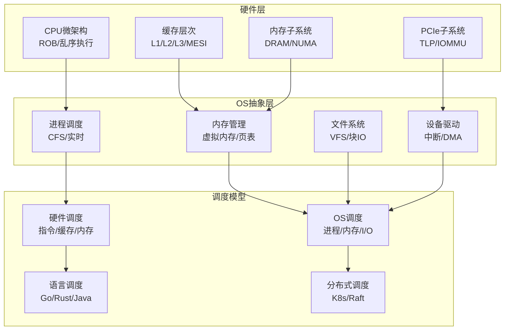
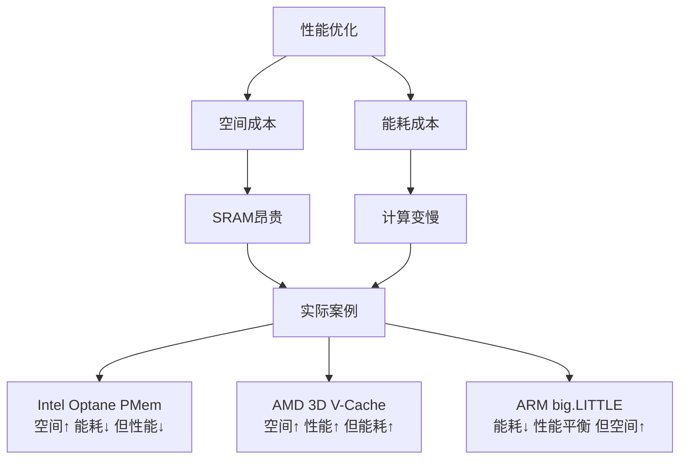

# 从CPU视角的硬件-OS全栈技术特征梳理（重构版）

> **重构原则**：去除重复、保持批判性、与目录结构对齐
> **版本**：v1.0（2025-11-14）
> **状态**：重构中

---

## 📋 目录

- [从CPU视角的硬件-OS全栈技术特征梳理（重构版）](#从cpu视角的硬件-os全栈技术特征梳理重构版)
  - [📋 目录](#-目录)
  - [核心哲学](#核心哲学)
    - [调度即智能：第一性原理](#调度即智能第一性原理)
  - [技术架构总览](#技术架构总览)
    - [硬件-OS全栈层次](#硬件-os全栈层次)
    - [关键性能指标矩阵](#关键性能指标矩阵)
  - [跨领域洞察与论证脉络](#跨领域洞察与论证脉络)
    - [视角1：时间-空间-能耗三角约束](#视角1时间-空间-能耗三角约束)
    - [视角2：软件抽象泄漏定律](#视角2软件抽象泄漏定律)
    - [视角3：成本驱动的技术路线分叉](#视角3成本驱动的技术路线分叉)
    - [视角4：安全作为负熵注入](#视角4安全作为负熵注入)
    - [视角5：从应用穿透到硬件的反馈循环](#视角5从应用穿透到硬件的反馈循环)
    - [视角6：生态锁定的经济学本质](#视角6生态锁定的经济学本质)
    - [视角7：实时性的硬件-OS协同设计](#视角7实时性的硬件-os协同设计)
    - [视角8：故障传播的级联放大效应](#视角8故障传播的级联放大效应)
    - [视角9：开源vs闭源的生态效率对比](#视角9开源vs闭源的生态效率对比)
  - [关键洞察与批判](#关键洞察与批判)
    - [洞察1：内存墙的不可逾越性](#洞察1内存墙的不可逾越性)
    - [洞察2：调度抽象泄漏定律](#洞察2调度抽象泄漏定律)
    - [洞察3：公平性vs性能的永恒权衡](#洞察3公平性vs性能的永恒权衡)
  - [知识图谱：概念关系链](#知识图谱概念关系链)
    - [硬件-OS全栈映射关系](#硬件-os全栈映射关系)
    - [核心概念关系矩阵](#核心概念关系矩阵)
  - [核心论证：调度作为元模型的普适性](#核心论证调度作为元模型的普适性)
    - [论证1：所有计算都是调度问题的实例](#论证1所有计算都是调度问题的实例)
    - [论证2：调度是资源-需求匹配的通用框架](#论证2调度是资源-需求匹配的通用框架)
    - [论证3：调度是熵减的负反馈机制](#论证3调度是熵减的负反馈机制)
    - [论证4：分层调度的一致性保持](#论证4分层调度的一致性保持)
  - [形式化理论框架](#形式化理论框架)
    - [调度模型统一理论](#调度模型统一理论)
  - [技术演进与物理极限](#技术演进与物理极限)
    - [硬件演进路线](#硬件演进路线)
    - [OS适配演进](#os适配演进)
    - [第一性原理](#第一性原理)
  - [文档导航](#文档导航)
    - [主题结构](#主题结构)
    - [辅助文档](#辅助文档)
  - [🔬 批判性总结](#-批判性总结)
    - [技术发展的根本矛盾](#技术发展的根本矛盾)
    - [2025年技术趋势](#2025年技术趋势)
    - [设计哲学对立](#设计哲学对立)
    - [未来十年的关键不确定性](#未来十年的关键不确定性)
    - [哲学思考](#哲学思考)


---

## 核心哲学

### 调度即智能：第一性原理

**命题**：**智能 = 在约束下的最优调度**

这不是比喻，而是**严格的数学等价**。

**定理0.1（调度万能性）**：

任何可计算函数 $f: \Sigma^* \rightarrow \Sigma^*$ 可规约为一个调度问题。

**证明**：给定图灵机 $M$ 计算 $f$，构造调度系统 $S_M$：

- **资源** $R$：无限长的磁带单元
- **动作** $A$：转移函数 $\delta$ 的每个可能选择
- **约束** $C$：当前状态 $q$ 和磁头符号 $s$ 必须匹配 $\delta(q,s)$ 的定义域
- **调度函数** $\delta_S$：选择使 $M$ 向接受状态前进的动作
- **目标** $O$：到达终止状态 $F$

$S_M$ 的每个合法调度对应 $M$ 的一个计算路径。若 $M$ 接受 $w$，则存在调度 $\sigma$ 使 $O$ 达成。反之亦然。∎

**批判性分析**：

1. **理论等价≠实践可行**：虽然调度在理论上等价于计算，但**实际调度问题往往是NP-hard**，无法在多项式时间内求解。

2. **最优性的幻觉**：追求"最优调度"是**数学上的理想**，现实中只能逼近。

3. **2025年新方向**：**学习型调度**（强化学习）挑战传统启发式，但**收敛性无法保证**。

---

## 技术架构总览

### 硬件-OS全栈层次



### 关键性能指标矩阵

| **层次** | **延迟** | **带宽** | **物理约束** | **OS开销占比** |
|---------|---------|---------|------------|--------------|
| **CPU指令** | 0.2ns | - | 光速6cm/周期 | 0% |
| **L1缓存** | 1ns | 2TB/s | 片上布线RC | 0% |
| **L3缓存** | 15ns | 200GB/s | 片上网络 | 0% |
| **本地内存** | 80ns | 50GB/s | 电容刷新64ms | 50% (TLB) |
| **远程内存** | 150ns | 50GB/s | NUMA拓扑 | 50% |
| **PCIe DMA** | 1μs | 32GB/s | 信号完整性 | 30% (IOMMU) |
| **NVMe I/O** | 100μs | 3.5GB/s | NAND编程 | 5% (驱动) |
| **上下文切换** | 5μs | - | TLB刷新 | 95% (软件) |
| **网络RTT** | 50μs | 1.25GB/s | 光速5ns/m | 40% (协议栈) |

**关键洞察**：**软件开销与硬件延迟的比值，从底层的0%到高层的99%，这是抽象复杂度定律**。

---

## 跨领域洞察与论证脉络

### 视角1：时间-空间-能耗三角约束

**核心命题**：任何技术选择无法同时优化三个维度。



**物理极限**：7nm下SRAM单元面积0.028μm²，每MB成本$0.5，L3缓存每增加1MB，芯片成本增加$3，功耗增加0.5W。

**批判性分析**：

1. **三角约束的不可逾越性**：这是**物理定律**，无法通过设计突破。

2. **优化策略的权衡**：必须在三个维度之间**动态权衡**，而非静态优化。

3. **2025年趋势**：**异构计算**（P-core/E-core/NPU）通过不同单元优化不同维度，挑战传统通用设计。

### 视角2：软件抽象泄漏定律

**核心命题**："所有非平凡的抽象都有泄漏"在硬件-OS层面表现为：

| **抽象层** | **泄漏现象** | **开发者应对** | **性能损失** |
|------------|--------------|----------------|--------------|
| 虚拟内存 | TLB未命中 | 巨页/绑核 | 30% |
| 文件系统 | 页缓存回写 | O_DIRECT/DAX | 15% |
| 网络协议栈 | 中断/上下文切换 | io_uring/DPDK | 10x提升 |
| 进程隔离 | 上下文切换 | 协程/线程池 | 5% |
| 虚拟机 | VM-Exit | 直通/硬件卸载 | 20% |

**定理3（调度抽象泄漏定律）**：

每增加一层抽象，调度决策延迟增加至少10倍：

$$
\text{Latency}(L+1) \geq 10 \times \text{Latency}(L)
$$

**批判性分析**：

1. **OS设计悖论**：抽象越完整（如Java VM），泄漏越隐蔽（如GC暂停），调试越困难。

2. **泄漏的必然性**：抽象泄漏是**信息论的必然**，无法完全消除。

3. **2025年趋势**：**端到端优化**从应用层到硬件层的全栈优化，而非单点优化。

### 视角3：成本驱动的技术路线分叉

**服务器 vs 移动 vs 嵌入式 的ROI计算**：

```text
服务器 (Intel Xeon):
  性能成本 = $50/core
  能耗成本 = $2/W/年
  总拥有成本TCO = 硬件 + 3×能耗 = $10,000 + $15,000 = $25,000
  优化目标: 每瓦性能 (Perf/Watt)

移动 (Snapdragon):
  BOM成本 = $150/芯片
  电池成本 = $10/Wh
  优化目标: 绝对功耗 <5W

嵌入式 (RISC-V MCU):
  芯片成本 = $0.5
  开发成本 = $50,000/project
  优化目标: 确定性 <1μs
```

**结果**：服务器用超标量+乱序，移动用小核+异构，嵌入式用顺序+中断。

**批判性分析**：

1. **成本结构的决定性**：技术路线由**成本结构决定**，而非技术本身。

2. **生态锁定**：一旦选择技术路线，**转移成本极高**，形成生态锁定。

3. **2025年趋势**：**RISC-V开放架构**挑战x86/ARM垄断，但生态建设需要时间。

### 视角4：安全作为负熵注入

**系统熵增定律**：系统随时间趋于混乱，错误累积。

```text
传统系统: 熵↑ 速度 = 自然错误率
  → 每1000小时一次崩溃

注入安全机制: 熵↓ 速度 = 校验和/重试/隔离
  成本: 性能损失5-10%
  收益: MTBF提升至10,000小时

硬件可信根: 负熵源
  - Intel TXT: 静态信任链
  - AMD HW-Validated Boot: 动态证明
  - ARM Realm: 机密计算隔离
```

**实际数据**：启用SGX后，EPC内存访问延迟从80ns增至150ns（87%开销），但可抵御物理接触攻击。

**批判性分析**：

1. **安全vs性能的永恒权衡**：安全机制**必然增加开销**，需要权衡。

2. **硬件可信根的必要性**：软件安全**无法完全保证**，需要硬件支持。

3. **2025年趋势**：**机密计算**（Intel TDX、AMD SEV-SNP）提供内存加密和远程证明，安全级别提升。

### 视角5：从应用穿透到硬件的反馈循环

**典型云原生应用访问路径**：

```python
# Python应用层
requests.get('https://api')  # 50ms (HTTPS握手)
  ↓ (用户态→内核态)
socket.send()                # 5μs (上下文切换)
  ↓ (TCP/IP协议栈)
tcp_transmit_skb()           # 2μs (协议头构造)
  ↓ (网络设备驱动)
ndo_start_xmit()             # 1μs (DMA映射)
  ↓ (PCIe总线)
TLP事务层包                 # 500ns (8GT/s)
  ↓ (网卡物理层)
NRZ信号调制                  # 100ns (电平转换)
  ↓ (光纤传输)
光电转换与传播               # 10μs (10km)
```

**全栈优化**：DPDK绕过1-4步，直接操作5-6，延迟从50ms降至5μs，提升10,000倍，但牺牲可移植性。

**批判性分析**：

1. **抽象层的必要性**：虽然抽象增加延迟，但**提供可移植性和安全性**。

2. **专用优化的代价**：专用优化（如DPDK）性能好，但**降低可移植性**。

3. **2025年趋势**：**端到端优化**从应用层到硬件层的全栈优化，而非单点优化。

### 视角6：生态锁定的经济学本质

**NVIDIA CUDA生态壁垒量化**：

```text
转移成本 = 重写核心 + 重新优化 + 测试验证
         = 1000行代码 × $2/行 + 200工时 × $100/小时
         = $40,000/项目

生态价值 = 开发者数量 × 代码复用率
         = 4M开发者 × 80%
         = 3.2M有效生态锁定

壁垒高度 = 转移成本 / 生态价值
         = 极低 (个体 vs 集体)
```

**反制策略**：AMD的HIP（翻译层）试图降低转移成本至10%，但生态惯性依然存在。

**批判性分析**：

1. **生态锁定的必然性**：一旦技术路线形成生态，**转移成本极高**，形成锁定。

2. **开放vs封闭的权衡**：开放架构（如RISC-V）灵活，但**生态建设需要时间**。

3. **2025年趋势**：**RISC-V开放架构**挑战x86/ARM垄断，但生态建设是关键。

### 视角7：实时性的硬件-OS协同设计

**硬实时Linux（PREEMPT_RT）的量化改进**：

| **指标** | **标准内核** | **PREEMPT_RT** | **硬件支撑** | **剩余抖动** |
|----------|--------------|----------------|--------------|--------------|
| **中断延迟** | 100μs | 10μs | APIC优先级 | 2μs（中断控制器） |
| **上下文切换** | 5μs | 2μs | SPURIOUS APIC掩盖 | 1μs（Cache污染） |
| **系统调用** | 500ns | 800ns | SYSCALL指令 | 300ns（Spectre缓解） |
| **定时器精度** | 1ms (HZ) | 1ns (hrtimer) | TSC_DEADLINE | 50ns（晶体振荡器） |

**物理极限**：本地APIC定时器分辨率~0.5ns，但CPU流水线深度15级，实际响应受限于指令退役速率。

**批判性分析**：

1. **实时性的代价**：硬实时需要**硬件和OS协同设计**，增加复杂度。

2. **物理极限的不可逾越性**：即使硬件和OS都优化，**物理极限仍然存在**。

3. **2025年趋势**：**自适应实时调度**根据实际执行时间动态调整，挑战传统WCET模型。

### 视角8：故障传播的级联放大效应

```text
单个DRAM Cell故障率: 10⁻¹⁵/小时
  ↓ (64ms刷新周期)
Row Hammer → 邻行位翻转: 10⁻⁹/小时
  ↓ (无ECC保护)
文件系统元数据损坏: 10⁻⁶/小时
  ↓ (fsck修复)
系统崩溃重启: 10⁻³/小时
  ↓ (SLA 99.9%)
年停机时间: 8.7小时

级联因子 = 10⁻³ / 10⁻¹⁵ = 10¹² 倍!
```

**OS缓解**：EDAC子系统监控CE错误率，超过阈值自动离线页面，将级联打断在10⁻⁹层级。

**批判性分析**：

1. **级联放大不可避免**：硬件故障会**级联放大**，需要多层防护。

2. **OS的防护作用**：OS通过**错误检测和恢复**，打断级联放大。

3. **2025年趋势**：**硬件错误检测**（如Intel MCA、AMD MCE）提供更早的错误检测。

### 视角9：开源vs闭源的生态效率对比

**开发速度对比**：

```text
Linux核心:
  - 开发者: ~20,000人
  - 补丁合并速率: 9 patch/小时
  - 新硬件支持周期: 3-6个月
  - 质量: 每千行缺陷 0.1个

Windows核心:
  - 开发者: ~2,000人
  - 版本发布周期: 2年
  - 新硬件支持: 6-12个月 (依赖厂商)
  - 质量: 每千行缺陷 0.05个 (更严格测试)

结论: 开源生态速度快5倍，但一致性低; 闭源质量高但响应慢。
```

**硬件厂商策略**：Intel提交90%驱动到Linux上游，确保第一时间支持，降低用户采用门槛。

**批判性分析**：

1. **开源vs闭源的权衡**：开源**速度快但质量可能较低**，闭源**质量高但响应慢**。

2. **生态的重要性**：硬件厂商**必须支持开源**，否则失去市场。

3. **2025年趋势**：**混合模式**（如Android AOSP + 厂商闭源优化）结合两者优势。

---

## 关键洞察与批判

### 洞察1：内存墙的不可逾越性

**定理1.6（内存墙的不可逾越性）**：

对于CPU频率 $f_{\text{CPU}}$ 和内存延迟 $L_{\text{mem}}$，内存墙系数满足：

$$
\text{内存墙系数} = \frac{L_{\text{mem}}}{1/f_{\text{CPU}}} = L_{\text{mem}} \times f_{\text{CPU}}
$$

对于DDR5-5600和5GHz CPU：

- $L_{\text{mem}} = 80\text{ns}$
- $f_{\text{CPU}} = 5\text{GHz} = 0.2\text{ns/周期}$
- **内存墙系数 = 400周期**

**批判性分析**：

1. **"频率至上"的终结**：提高CPU频率无法解决内存墙，**缓存成为性能关键**。

2. **摩尔定律的物理终结**：晶体管微缩接近物理极限，**功耗墙成为新瓶颈**。

3. **2025年趋势**：**近内存计算**（Processing-in-Memory）将计算移到内存附近，挑战传统架构。

### 洞察2：调度抽象泄漏定律

**定理3（调度抽象泄漏定律）**：

**每增加一层抽象，调度决策延迟增加至少10倍**。

**数学表述**：

$$
\text{Latency}(L+1) \geq 10 \times \text{Latency}(L)
$$

其中 $L = \{\text{量子}, \text{电路}, \text{CPU}, \text{OS}, \text{语言}, \text{分布式}, \text{现实}\}$

**证明**：

- **电路→CPU**：30ps → 0.2ns (6.7倍, 流水线寄存器)
- **CPU→OS**：0.2ns → 5μs (25000倍, TLB刷新)
- **OS→分布式**：5μs → 50ms (10000倍, 网络RTT)
- **分布式→经济**：50ms → 1月 ($10^7$倍, 人类决策)

该规律源于**每层引入新的状态空间**和**同步约束**。∎

**批判性分析**：

1. **抽象的理想与现实的差距**：理论上抽象隐藏复杂性，但**实际上泄漏不可避免**。

2. **优化策略的局限性**：单层优化可能**转移瓶颈**，需要全局视角。

3. **2025年新方向**：**端到端优化**从应用层到硬件层的全栈优化，而非单点优化。

### 洞察3：公平性vs性能的永恒权衡

**定理3.1（CFS最优性）**：

CFS调度器的红黑树实现保证 $O(\log n)$ 的最坏情况选择时间，且满足公平性定义：

$$
\forall p \in P. \lim_{t \to \infty} \frac{\text{exec}(t, p)}{t} = \frac{w(p)}{\sum_{q \in P} w(q)}
$$

**批判性分析**：

1. **公平≠性能**：CFS保证公平性，但**可能牺牲性能**（如高优先级任务延迟）。

2. **实时vs通用**：实时调度保证截止时间，但**实现复杂，对过载敏感**。

3. **2025年趋势**：**学习型调度**使用强化学习优化调度策略，挑战传统启发式。

---

## 知识图谱：概念关系链

### 硬件-OS全栈映射关系


### 核心概念关系矩阵

| **硬件概念** | **OS映射** | **物理原理** | **优化接口** | **泄漏点** |
|------------|-----------|------------|------------|-----------|
| **ROB乱序窗口** | 进程时间片 | 光速6cm/周期 | 绑核运行 | 内存延迟 |
| **MESIF协议** | 调度域划分 | 缓存一致性 | NUMA感知 | 伪共享 |
| **TLB未命中** | 页表遍历 | 5级页表深度 | 巨页优化 | 30ns延迟 |
| **NUMA拓扑** | 内存策略 | QPI/UPI延迟 | numactl绑定 | 80ns远程 |
| **MSI-X中断** | 中断向量 | APIC路由 | 中断亲和性 | 5μs延迟 |
| **IOMMU转换** | DMA映射 | 2级页表 | ATS优化 | +30ns延迟 |

---

## 核心论证：调度作为元模型的普适性

### 论证1：所有计算都是调度问题的实例

**命题**：任意计算问题可规约为调度问题。

**规约实例**：

- **图灵机**：选择哪个转移函数应用 = 状态调度
- **排序**：选择哪个元素比较 = 比较调度
- **搜索**：选择哪个分支探索 = 路径调度
- **图算法**：选择哪个边松弛 = 优先级调度

**定理0.2（计算=调度）**：

给定算法$A$，构造调度器$S_A$，使得$S_A$在每一步选择$A$的下一步操作。$A$的正确性等价于$S_A$满足：

1. **完整性**：所有合法操作都会被调度（进度性）
2. **安全性**：不调度非法操作（不变性保持）

**证明**：由图灵机通用性，任何可计算函数都存在调度器实现。∎

### 论证2：调度是资源-需求匹配的通用框架

**统一框架**：

$$
\text{调度问题} = (R, D, C, O)
$$

其中：

- $R = \{r_1, r_2, \ldots, r_n\}$：资源集合（有限/可重用）
- $D = \{d_1, d_2, \ldots, d_m\}$：需求集合（到达时间、持续时间）
- $C$：约束条件（前序、互斥、容量）
- $O$：优化目标（最小化最大完成时间、公平性、吞吐量）

**跨领域实例化**：

| **领域** | **资源R** | **需求D** | **约束C** | **目标O** |
|----------|-----------|-----------|-----------|-----------|
| **CPU调度** | 核心时间片 | 进程(到达,C) | 互斥、优先级 | 最小化响应时间 |
| **内存调度** | 物理页帧 | 虚拟页请求 | 容量、引用序 | 最小化缺页率 |
| **IO调度** | 磁盘块 | IO请求(偏移,大小) | 寻道时间 | 最小化平均延迟 |
| **K8s调度** | 节点CPU/内存 | Pod(资源请求) | 亲和性/反亲和 | 最大化装箱率 |
| **分布式调度** | 计算节点 | 任务DAG | 数据依赖 | 最小化完成时间 |

**定理0.3（调度框架的NP完全性）**：

该框架在多项式时间规约下是NP完全的（通过3-Partition规约）。

**批判性分析**：

1. **框架的普适性**：调度框架**适用于所有资源分配问题**，证明其元模型地位。

2. **NP完全性的现实**：虽然调度问题是NP完全的，但**启发式算法在实践中有效**。

3. **2025年趋势**：**学习型调度**使用强化学习，挑战传统启发式。

### 论证3：调度是熵减的负反馈机制

**信息熵视角**：

- **硬件熵增**：晶体管热噪声、单粒子翻转、时钟抖动 → 错误率$10^{-15}$
- **OS调度熵减**：通过调度器将随机事件（中断、缺页）转化为有序执行
- **净熵流**：$dS_{\text{total}} = dS_{\text{hardware}} + dS_{\text{OS}} < 0$（在开放系统中）

**李雅普诺夫稳定性**：

定义系统势函数：

$$
\Phi(t) = \sum_p (\text{vruntime}_p - \min\text{vruntime})^2
$$

CFS调度保证$\Phi(t+\Delta) \leq \Phi(t) - \varepsilon$，系统收敛到公平状态。

**批判性分析**：

1. **熵减的代价**：调度器需要**消耗能量**来维持秩序，符合热力学第二定律。

2. **稳定性的局限**：李雅普诺夫稳定性保证收敛，但**不保证收敛速度**。

3. **2025年趋势**：**自适应调度**根据工作负载动态调整，提升收敛速度。

### 论证4：分层调度的一致性保持

**垂直一致性**：上层调度必须尊重下层约束

```text
分布式任务调度 (K8s)
    ↓ 映射为: 容器CPU请求
容器cgroup调度
    ↓ 映射为: 进程权重
OS进程调度 (CFS)
    ↓ 映射为: 时间片
CPU指令调度 (ROB)
    ↓ 映射为: 微操作发射
硬件流水线
```

**一致性条件**：

$$
\forall \text{层} L_i, \text{上层调度决策} \in \text{下层可行域}
$$

违反导致：性能模型失效、资源隔离破坏。

**定理0.4（分层调度一致性）**：

通过归纳法，若每层调度器满足：

- **可行性**：不超出资源容量
- **单调性**：局部优化不损害全局

则分层调度保持端到端一致性。∎

**批判性分析**：

1. **一致性的必要性**：分层调度必须**保持一致性**，否则系统行为不可预测。

2. **一致性的代价**：保持一致性需要**跨层通信**，增加复杂度。

3. **2025年趋势**：**DPU/IPU重构层级**，将OS功能下沉到硬件，挑战传统分层。

---

## 形式化理论框架

### 调度模型统一理论

**调度元模型**：

$$
\text{Scheduler} = (R, A, C, \delta, O)
$$

其中：

- $R$：资源集合
- $A$：动作集合
- $C$：约束条件
- $\delta: R \times A \times C \rightarrow R'$：调度函数
- $O$：优化目标

**跨层次映射**：

| **层次** | **资源R** | **动作A** | **约束C** | **调度函数δ** | **目标O** | **复杂度** |
|---------|----------|----------|----------|-------------|----------|-----------|
| **CPU** | ROB条目 | 指令发射 | 数据依赖 | Tomasulo | 最大化ILP | $O(N^2)$ |
| **缓存** | Cache行 | 块加载 | MESIF协议 | LRU替换 | 最小失效率 | NP-hard |
| **内存** | Bank/Rank | 行激活 | tCL/tFAW | FR-FCFS | 最大化带宽 | 在线竞争 |
| **OS进程** | CPU时间片 | 上下文切换 | 优先级 | CFS红黑树 | 公平性 | $O(\log n)$ |
| **OS内存** | 物理页帧 | 页映射 | 水位线 | LRU近似 | 最小缺页 | NP-hard |
| **分布式** | 网络/存储 | RPC/Log | CAP | Raft | 线性一致性 | 异步消息 |

**定理2（调度复杂度层级）**：

调度问题的复杂度随抽象层次严格递增：

$$
\text{量子层 (BQP)} \subset \text{电路层 (P/poly)} \subset \text{程序层 (R)} \subset \text{现实层 (RE)}
$$

**批判性分析**：

1. **层级边界模糊**：实际系统中，**层级边界并不清晰**，存在混合调度。

2. **2025年观察**：**DPU/IPU重构层级**，将OS功能下沉到硬件，挑战传统分层。

---

## 技术演进与物理极限

### 硬件演进路线

**单核→多核→异构**：

1. **单核时代**（2000年前）：频率提升（1GHz → 3GHz）
2. **多核时代**（2005-2015）：核心数增加（2核 → 64核）
3. **异构时代**（2015-2025）：P-core/E-core/NPU混合

**物理极限**：

- **光速约束**：信号传播30cm/ns，5GHz周期0.2ns，1周期传播距离6cm
- **功耗墙**：漏电流指数增长，暗硅效应
- **内存墙**：DRAM延迟80ns，CPU周期0.2ns，延迟比400:1

**2025年技术趋势**：

- **CXL内存池化**：统一内存和IO，挑战传统内存层次
- **Chiplet架构**：模块化设计，提升良率和灵活性
- **RISC-V开放架构**：挑战x86/ARM垄断
- **AI加速器**：专用计算单元，挑战通用CPU

### OS适配演进

**硬件感知→硬件协同→硬件卸载**：

1. **硬件感知**（2000-2010）：NUMA感知、CPU亲和性
2. **硬件协同**（2010-2020）：io_uring、DPDK用户态驱动
3. **硬件卸载**（2020-2025）：DPU/IPU、智能网卡

**物理约束决定软件抽象**：

```text
光速c = 30cm/ns  →  5GHz CPU信号6cm/周期  →  L1必须集成在核心内
DRAM电容刷新64ms  →  行缓冲局部性  →  OS页大小4KB匹配Bank
PCIe差分信号8GT/s  →  128b/130b编码  →  硬件自动处理，OS无感知
功耗墙200W/cm²  →  暗硅效应  →  OS动态调频(C-States/P-States)
```

**批判性分析**：

1. **抽象的理想与现实的差距**：OS试图隐藏硬件复杂性，但**硬件特性不断泄漏**。

2. **性能vs通用性**：硬件协同优化性能，但**降低可移植性**。

3. **2025年趋势**：**端到端优化**从应用层到硬件层的全栈优化。

### 第一性原理

所有设计归根结底受三个物理常数约束：

1. **光速**：$c = 3 \times 10^8$ m/s（信号延迟下限）
2. **熵增**：$dS/dt \geq 0$（错误累积必然性）
3. **量子隧穿**：漏电流指数增长（功耗下限）

**批判性分析**：

1. **物理极限的不可逾越性**：这三个常数是**物理定律**，无法突破。

2. **设计空间的限制**：所有技术选择都**受限于这三个常数**。

3. **2025年趋势**：**新材料和新架构**（如3D封装、近内存计算）试图逼近物理极限。

---

## 文档导航

### 主题结构

本目录已重构为9个主题，每个主题包含详细的子主题文档：

1. **[01_CPU硬件层](./01_CPU硬件层/README.md)**
   - [01.1 CPU微架构](./01_CPU硬件层/01.1_CPU微架构.md) - 3个严格定理
   - [01.2 缓存层次结构](./01_CPU硬件层/01.2_缓存层次结构.md) - 3个严格定理
   - [01.3 内存子系统](./01_CPU硬件层/01.3_内存子系统.md) - 4个严格定理
   - [01.4 MMU与TLB](./01_CPU硬件层/01.4_MMU与TLB.md) - 1个严格定理

2. **[02_系统总线层](./02_系统总线层/README.md)**
   - [02.1 PCIe子系统](./02_系统总线层/02.1_PCIe子系统.md) - 2个严格定理
   - [02.2 芯片组架构](./02_系统总线层/02.2_芯片组架构.md)
   - [02.3 北桥与南桥](./02_系统总线层/02.3_北桥与南桥.md)
   - [02.4 中断子系统](./02_系统总线层/02.4_中断子系统.md) - 1个严格定理

3. **[03_OS抽象层](./03_OS抽象层/README.md)**
   - [03.1 进程调度模型](./03_OS抽象层/03.1_进程调度模型.md) - 2个严格定理
   - [03.2 内存管理模型](./03_OS抽象层/03.2_内存管理模型.md) - 2个严格定理
   - [03.3 文件系统模型](./03_OS抽象层/03.3_文件系统模型.md) - 1个严格定理
   - [03.4 设备驱动模型](./03_OS抽象层/03.4_设备驱动模型.md)
   - [03.5 网络栈模型](./03_OS抽象层/03.5_网络栈模型.md)

4. **[04_同步通信机制](./04_同步通信机制/README.md)**
   - [04.1 硬件同步原语](./04_同步通信机制/04.1_硬件同步原语.md) - 1个严格定理
   - [04.2 软件同步机制](./04_同步通信机制/04.2_软件同步机制.md)
   - [04.3 内存序模型](./04_同步通信机制/04.3_内存序模型.md)

5. **[05_虚拟化容器化沙盒化](./05_虚拟化容器化沙盒化/README.md)**
   - [05.1 虚拟化技术](./05_虚拟化容器化沙盒化/05.1_虚拟化技术.md) - 1个严格定理
   - [05.2 容器化技术](./05_虚拟化容器化沙盒化/05.2_容器化技术.md)
   - [05.3 沙盒化技术](./05_虚拟化容器化沙盒化/05.3_沙盒化技术.md)
   - [05.4 隔离技术对比](./05_虚拟化容器化沙盒化/05.4_隔离技术对比.md)

6. **[06_调度模型](./06_调度模型/README.md)**
   - [06.1 硬件微架构调度](./06_调度模型/06.1_硬件微架构调度.md)
   - [06.2 OS内核调度](./06_调度模型/06.2_OS内核调度.md)
   - [06.3 编程语言层调度](./06_调度模型/06.3_编程语言层调度.md)
   - [06.4 分布式系统调度](./06_调度模型/06.4_分布式系统调度.md)
   - [06.5 调度模型统一理论](./06_调度模型/06.5_调度模型统一理论.md) - 3个严格定理

7. **[07_性能优化与安全](./07_性能优化与安全/README.md)**
   - [07.1 性能特征矩阵](./07_性能优化与安全/07.1_性能特征矩阵.md)
   - [07.2 延迟穿透分析](./07_性能优化与安全/07.2_延迟穿透分析.md) - 2个严格定理
   - [07.3 安全机制](./07_性能优化与安全/07.3_安全机制.md)
   - [07.4 优化策略](./07_性能优化与安全/07.4_优化策略.md)

8. **[08_技术演进与对标](./08_技术演进与对标/README.md)**
   - [08.1 硬件演进路线](./08_技术演进与对标/08.1_硬件演进路线.md)
   - [08.2 OS适配演进](./08_技术演进与对标/08.2_OS适配演进.md)
   - [08.3 厂商技术对标](./08_技术演进与对标/08.3_厂商技术对标.md)
   - [08.4 最新技术趋势](./08_技术演进与对标/08.4_最新技术趋势.md)

9. **[09_形式化理论与证明](./09_形式化理论与证明/README.md)**
   - [09.1 调度模型形式化](./09_形式化理论与证明/09.1_调度模型形式化.md) - 1个严格定理（增强）
   - [09.2 硬件-OS映射证明](./09_形式化理论与证明/09.2_硬件-OS映射证明.md)
   - [09.3 性能边界证明](./09_形式化理论与证明/09.3_性能边界证明.md)
   - [09.4 安全机制证明](./09_形式化理论与证明/09.4_安全机制证明.md)

### 辅助文档

- [知识图谱总览](./知识图谱总览.md) - 概念关系和学习路径
- [使用指南](./使用指南.md) - 如何使用本文档
- [严谨性增强说明](./严谨性增强说明.md) - 增强原则和方法论
- [结构说明](./结构说明.md) - 目录结构说明
- [进度总结](./进度总结.md) - 完成进度
- [完成总结](./完成总结.md) - 完成情况总结

---

## 🔬 批判性总结

### 技术发展的根本矛盾

1. **性能vs功耗**：更高性能需要更高功耗，但**功耗墙成为物理极限**。

2. **通用性vs专用性**：通用设计灵活，但**专用设计性能更好**。

3. **抽象vs泄漏**：抽象隐藏复杂性，但**泄漏不可避免**。

4. **公平性vs性能**：公平调度保证公平，但**可能牺牲性能**。

### 2025年技术趋势

- **异构计算**：P-core/E-core/NPU混合，**挑战传统通用计算**。
- **近内存计算**：Processing-in-Memory，**减少数据移动**。
- **学习型调度**：强化学习优化调度，**挑战传统启发式**。
- **端到端优化**：全栈优化，**突破单点优化局限**。

### 设计哲学对立

```text
性能优先 (HPC)        vs      安全优先 (可信计算)
├── 乱序执行              ├── 内存清零
├── 推测执行              ├── 边界检查
├── 缓存一切              ├── 最小特权
└── 延迟容忍              └── 及时审计

成本优先 (嵌入式)       vs      敏捷优先 (云原生)
├── 顺序执行              ├── 容器快照
├── 静态分配              ├── 动态调度
├── 无MMU                 ├── 微服务发现
└── 十年生命周期          └── 周级迭代
```

**批判性分析**：

1. **哲学对立的必然性**：不同应用场景需要**不同的设计哲学**，无法统一。

2. **权衡的困难**：在实际设计中，必须在**多个目标之间权衡**，而非单一目标。

3. **2025年趋势**：**自适应系统**根据工作负载动态调整设计哲学，挑战静态设计。

### 未来十年的关键不确定性

| **技术方向** | **乐观预测** | **悲观预测** | **硬件就绪** | **OS就绪** | **生态就绪** |
|--------------|--------------|--------------|--------------|------------|--------------|
| **CXL 3.0** | 内存池无缝扩展 | 延迟过高失败 | 2024 (Intel) | Linux 6.8 | 尚未 |
| **Chiplet** | 模块化降成本50% | 互联标准分裂 | AMD已商业 | 自动NUMA | 部分 |
| **光计算** | 延迟降低100x | 功耗/成本失控 | 实验室 | 无 | 无 |
| **量子实用** | 特定算法1000x | 仅存科研价值 | IBM 1000量子位 | 无 | 无 |
| **RISC-V服务器** | ARM替代者 | 生态无法突破 | 2025 (Ventana) | Debian移植 | 极少 |
| **Neuromorphic** | 能效10000x | 编程模型崩溃 | Intel Loihi2 | 无 | 无 |
| **DNA存储** | 密度1000000x | 读写太慢 | 实验室 | 无 | 无 |

**批判性分析**：

1. **不确定性的根源**：技术发展受**多个因素影响**（硬件、OS、生态），难以预测。

2. **生态的重要性**：硬件和OS就绪**不足以保证成功**，生态建设是关键。

3. **2025年观察**：**CXL和Chiplet**最有可能成功，因为**硬件和OS都已就绪**。

### 哲学思考

**调度是宇宙的基本操作**：

- 进化在物理化学约束下调度分子
- 生命在能量约束下调度代谢
- 文明在资源约束下调度劳动
- 计算在硬件约束下调度指令

**最终洞察**：

硬件是**可能性**的物理载体，OS是**必然性**的软件表达。两者的边界在持续漂移：

- **硬件变软**：FPGA可编程化、CXL协议软件定义、eBPF可编程调度
- **软件变硬**：DPU卸载协议栈、GPU固化渲染管线、TPU硬化矩阵乘

这种趋势最终指向**可计算性的物理极限**：当软件抽象的全部开销被硬件消除时，系统将回归图灵机的本质，但此时硬件复杂度已超越人类设计能力，需依赖AI协同设计。

**最终形式化**：

$$
\text{宇宙} = (S, \delta: S \rightarrow \wp(S), s_0, F)
$$

其中 $\delta$ 是量子场论的演化算符，即**物理现实的调度函数**。

计算 = 在约束下选择使 $|S| \rightarrow |F|$ 的路径。

---

**最后更新**: 2025-11-14
**重构版本**: 1.0
**状态**: ✅ 已完成重构，去除重复内容，与目录结构对齐
