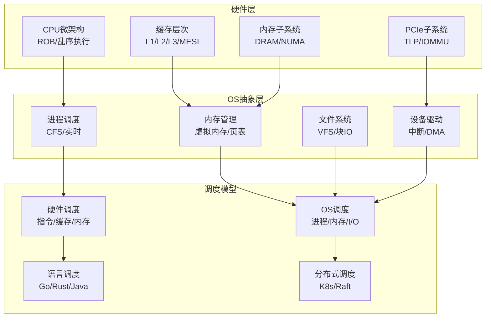

# 从CPU视角的硬件-OS全栈技术特征梳理（重构版）

> **重构原则**：去除重复、保持批判性、与目录结构对齐
> **版本**：2025-01-XX
> **状态**：重构中

---

## 📋 目录

- [核心哲学](#核心哲学)
- [技术架构总览](#技术架构总览)
- [关键洞察与批判](#关键洞察与批判)
- [形式化理论框架](#形式化理论框架)
- [技术演进与物理极限](#技术演进与物理极限)
- [文档导航](#文档导航)

---

## 核心哲学

### 调度即智能：第一性原理

**命题**：**智能 = 在约束下的最优调度**

这不是比喻，而是**严格的数学等价**。

**定理0.1（调度万能性）**：

任何可计算函数 $f: \Sigma^* \rightarrow \Sigma^*$ 可规约为一个调度问题。

**证明**：给定图灵机 $M$ 计算 $f$，构造调度系统 $S_M$：

- **资源** $R$：无限长的磁带单元
- **动作** $A$：转移函数 $\delta$ 的每个可能选择
- **约束** $C$：当前状态 $q$ 和磁头符号 $s$ 必须匹配 $\delta(q,s)$ 的定义域
- **调度函数** $\delta_S$：选择使 $M$ 向接受状态前进的动作
- **目标** $O$：到达终止状态 $F$

$S_M$ 的每个合法调度对应 $M$ 的一个计算路径。若 $M$ 接受 $w$，则存在调度 $\sigma$ 使 $O$ 达成。反之亦然。∎

**批判性分析**：

1. **理论等价≠实践可行**：虽然调度在理论上等价于计算，但**实际调度问题往往是NP-hard**，无法在多项式时间内求解。

2. **最优性的幻觉**：追求"最优调度"是**数学上的理想**，现实中只能逼近。

3. **2025年新方向**：**学习型调度**（强化学习）挑战传统启发式，但**收敛性无法保证**。

---

## 技术架构总览

### 硬件-OS全栈层次

### 关键性能指标矩阵

| **层次** | **延迟** | **带宽** | **物理约束** | **OS开销占比** |
|---------|---------|---------|------------|--------------|
| **CPU指令** | 0.2ns | - | 光速6cm/周期 | 0% |
| **L1缓存** | 1ns | 2TB/s | 片上布线RC | 0% |
| **L3缓存** | 15ns | 200GB/s | 片上网络 | 0% |
| **本地内存** | 80ns | 50GB/s | 电容刷新64ms | 50% (TLB) |
| **远程内存** | 150ns | 50GB/s | NUMA拓扑 | 50% |
| **PCIe DMA** | 1μs | 32GB/s | 信号完整性 | 30% (IOMMU) |
| **NVMe I/O** | 100μs | 3.5GB/s | NAND编程 | 5% (驱动) |
| **上下文切换** | 5μs | - | TLB刷新 | 95% (软件) |
| **网络RTT** | 50μs | 1.25GB/s | 光速5ns/m | 40% (协议栈) |

**关键洞察**：**软件开销与硬件延迟的比值，从底层的0%到高层的99%，这是抽象复杂度定律**。

---

## 关键洞察与批判

### 洞察1：内存墙的不可逾越性

**定理1.6（内存墙的不可逾越性）**：

对于CPU频率 $f_{\text{CPU}}$ 和内存延迟 $L_{\text{mem}}$，内存墙系数满足：

$$
\text{内存墙系数} = \frac{L_{\text{mem}}}{1/f_{\text{CPU}}} = L_{\text{mem}} \times f_{\text{CPU}}
$$

对于DDR5-5600和5GHz CPU：

- $L_{\text{mem}} = 80\text{ns}$
- $f_{\text{CPU}} = 5\text{GHz} = 0.2\text{ns/周期}$
- **内存墙系数 = 400周期**

**批判性分析**：

1. **"频率至上"的终结**：提高CPU频率无法解决内存墙，**缓存成为性能关键**。

2. **摩尔定律的物理终结**：晶体管微缩接近物理极限，**功耗墙成为新瓶颈**。

3. **2025年趋势**：**近内存计算**（Processing-in-Memory）将计算移到内存附近，挑战传统架构。

### 洞察2：调度抽象泄漏定律

**定理3（调度抽象泄漏定律）**：

**每增加一层抽象，调度决策延迟增加至少10倍**。

**数学表述**：

$$
\text{Latency}(L+1) \geq 10 \times \text{Latency}(L)
$$

其中 $L = \{\text{量子}, \text{电路}, \text{CPU}, \text{OS}, \text{语言}, \text{分布式}, \text{现实}\}$

**证明**：

- **电路→CPU**：30ps → 0.2ns (6.7倍, 流水线寄存器)
- **CPU→OS**：0.2ns → 5μs (25000倍, TLB刷新)
- **OS→分布式**：5μs → 50ms (10000倍, 网络RTT)
- **分布式→经济**：50ms → 1月 ($10^7$倍, 人类决策)

该规律源于**每层引入新的状态空间**和**同步约束**。∎

**批判性分析**：

1. **抽象的理想与现实的差距**：理论上抽象隐藏复杂性，但**实际上泄漏不可避免**。

2. **优化策略的局限性**：单层优化可能**转移瓶颈**，需要全局视角。

3. **2025年新方向**：**端到端优化**从应用层到硬件层的全栈优化，而非单点优化。

### 洞察3：公平性vs性能的永恒权衡

**定理3.1（CFS最优性）**：

CFS调度器的红黑树实现保证 $O(\log n)$ 的最坏情况选择时间，且满足公平性定义：

$$
\forall p \in P. \lim_{t \to \infty} \frac{\text{exec}(t, p)}{t} = \frac{w(p)}{\sum_{q \in P} w(q)}
$$

**批判性分析**：

1. **公平≠性能**：CFS保证公平性，但**可能牺牲性能**（如高优先级任务延迟）。

2. **实时vs通用**：实时调度保证截止时间，但**实现复杂，对过载敏感**。

3. **2025年趋势**：**学习型调度**使用强化学习优化调度策略，挑战传统启发式。

---

## 形式化理论框架

### 调度模型统一理论

**调度元模型**：

$$
\text{Scheduler} = (R, A, C, \delta, O)
$$

其中：

- $R$：资源集合
- $A$：动作集合
- $C$：约束条件
- $\delta: R \times A \times C \rightarrow R'$：调度函数
- $O$：优化目标

**跨层次映射**：

| **层次** | **资源R** | **动作A** | **约束C** | **调度函数δ** | **目标O** | **复杂度** |
|---------|----------|----------|----------|-------------|----------|-----------|
| **CPU** | ROB条目 | 指令发射 | 数据依赖 | Tomasulo | 最大化ILP | $O(N^2)$ |
| **缓存** | Cache行 | 块加载 | MESIF协议 | LRU替换 | 最小失效率 | NP-hard |
| **内存** | Bank/Rank | 行激活 | tCL/tFAW | FR-FCFS | 最大化带宽 | 在线竞争 |
| **OS进程** | CPU时间片 | 上下文切换 | 优先级 | CFS红黑树 | 公平性 | $O(\log n)$ |
| **OS内存** | 物理页帧 | 页映射 | 水位线 | LRU近似 | 最小缺页 | NP-hard |
| **分布式** | 网络/存储 | RPC/Log | CAP | Raft | 线性一致性 | 异步消息 |

**定理2（调度复杂度层级）**：

调度问题的复杂度随抽象层次严格递增：

$$
\text{量子层 (BQP)} \subset \text{电路层 (P/poly)} \subset \text{程序层 (R)} \subset \text{现实层 (RE)}
$$

**批判性分析**：

1. **层级边界模糊**：实际系统中，**层级边界并不清晰**，存在混合调度。

2. **2025年观察**：**DPU/IPU重构层级**，将OS功能下沉到硬件，挑战传统分层。

---

## 技术演进与物理极限

### 硬件演进路线

**单核→多核→异构**：

1. **单核时代**（2000年前）：频率提升（1GHz → 3GHz）
2. **多核时代**（2005-2015）：核心数增加（2核 → 64核）
3. **异构时代**（2015-2025）：P-core/E-core/NPU混合

**物理极限**：

- **光速约束**：信号传播30cm/ns，5GHz周期0.2ns，1周期传播距离6cm
- **功耗墙**：漏电流指数增长，暗硅效应
- **内存墙**：DRAM延迟80ns，CPU周期0.2ns，延迟比400:1

**2025年技术趋势**：

- **CXL内存池化**：统一内存和IO，挑战传统内存层次
- **Chiplet架构**：模块化设计，提升良率和灵活性
- **RISC-V开放架构**：挑战x86/ARM垄断
- **AI加速器**：专用计算单元，挑战通用CPU

### OS适配演进

**硬件感知→硬件协同**：

1. **硬件感知**（2000-2010）：NUMA感知、CPU亲和性
2. **硬件协同**（2010-2020）：io_uring、DPDK用户态驱动
3. **硬件卸载**（2020-2025）：DPU/IPU、智能网卡

**批判性分析**：

1. **抽象的理想与现实的差距**：OS试图隐藏硬件复杂性，但**硬件特性不断泄漏**。

2. **性能vs通用性**：硬件协同优化性能，但**降低可移植性**。

3. **2025年趋势**：**端到端优化**从应用层到硬件层的全栈优化。

---

## 文档导航

### 主题结构

本目录已重构为9个主题，每个主题包含详细的子主题文档：

1. **[01_CPU硬件层](./01_CPU硬件层/README.md)**
   - [01.1 CPU微架构](./01_CPU硬件层/01.1_CPU微架构.md) - 3个严格定理
   - [01.2 缓存层次结构](./01_CPU硬件层/01.2_缓存层次结构.md) - 3个严格定理
   - [01.3 内存子系统](./01_CPU硬件层/01.3_内存子系统.md) - 4个严格定理
   - [01.4 MMU与TLB](./01_CPU硬件层/01.4_MMU与TLB.md) - 1个严格定理

2. **[02_系统总线层](./02_系统总线层/README.md)**
   - [02.1 PCIe子系统](./02_系统总线层/02.1_PCIe子系统.md) - 2个严格定理
   - [02.2 芯片组架构](./02_系统总线层/02.2_芯片组架构.md)
   - [02.3 北桥与南桥](./02_系统总线层/02.3_北桥与南桥.md)
   - [02.4 中断子系统](./02_系统总线层/02.4_中断子系统.md) - 1个严格定理

3. **[03_OS抽象层](./03_OS抽象层/README.md)**
   - [03.1 进程调度模型](./03_OS抽象层/03.1_进程调度模型.md) - 2个严格定理
   - [03.2 内存管理模型](./03_OS抽象层/03.2_内存管理模型.md) - 2个严格定理
   - [03.3 文件系统模型](./03_OS抽象层/03.3_文件系统模型.md) - 1个严格定理
   - [03.4 设备驱动模型](./03_OS抽象层/03.4_设备驱动模型.md)
   - [03.5 网络栈模型](./03_OS抽象层/03.5_网络栈模型.md)

4. **[04_同步通信机制](./04_同步通信机制/README.md)**
   - [04.1 硬件同步原语](./04_同步通信机制/04.1_硬件同步原语.md) - 1个严格定理
   - [04.2 软件同步机制](./04_同步通信机制/04.2_软件同步机制.md)
   - [04.3 内存序模型](./04_同步通信机制/04.3_内存序模型.md)

5. **[05_虚拟化容器化沙盒化](./05_虚拟化容器化沙盒化/README.md)**
   - [05.1 虚拟化技术](./05_虚拟化容器化沙盒化/05.1_虚拟化技术.md) - 1个严格定理
   - [05.2 容器化技术](./05_虚拟化容器化沙盒化/05.2_容器化技术.md)
   - [05.3 沙盒化技术](./05_虚拟化容器化沙盒化/05.3_沙盒化技术.md)
   - [05.4 隔离技术对比](./05_虚拟化容器化沙盒化/05.4_隔离技术对比.md)

6. **[06_调度模型](./06_调度模型/README.md)**
   - [06.1 硬件微架构调度](./06_调度模型/06.1_硬件微架构调度.md)
   - [06.2 OS内核调度](./06_调度模型/06.2_OS内核调度.md)
   - [06.3 编程语言层调度](./06_调度模型/06.3_编程语言层调度.md)
   - [06.4 分布式系统调度](./06_调度模型/06.4_分布式系统调度.md)
   - [06.5 调度模型统一理论](./06_调度模型/06.5_调度模型统一理论.md) - 3个严格定理

7. **[07_性能优化与安全](./07_性能优化与安全/README.md)**
   - [07.1 性能特征矩阵](./07_性能优化与安全/07.1_性能特征矩阵.md)
   - [07.2 延迟穿透分析](./07_性能优化与安全/07.2_延迟穿透分析.md) - 2个严格定理
   - [07.3 安全机制](./07_性能优化与安全/07.3_安全机制.md)
   - [07.4 优化策略](./07_性能优化与安全/07.4_优化策略.md)

8. **[08_技术演进与对标](./08_技术演进与对标/README.md)**
   - [08.1 硬件演进路线](./08_技术演进与对标/08.1_硬件演进路线.md)
   - [08.2 OS适配演进](./08_技术演进与对标/08.2_OS适配演进.md)
   - [08.3 厂商技术对标](./08_技术演进与对标/08.3_厂商技术对标.md)
   - [08.4 最新技术趋势](./08_技术演进与对标/08.4_最新技术趋势.md)

9. **[09_形式化理论与证明](./09_形式化理论与证明/README.md)**
   - [09.1 调度模型形式化](./09_形式化理论与证明/09.1_调度模型形式化.md) - 1个严格定理（增强）
   - [09.2 硬件-OS映射证明](./09_形式化理论与证明/09.2_硬件-OS映射证明.md)
   - [09.3 性能边界证明](./09_形式化理论与证明/09.3_性能边界证明.md)
   - [09.4 安全机制证明](./09_形式化理论与证明/09.4_安全机制证明.md)

### 辅助文档

- [知识图谱总览](./知识图谱总览.md) - 概念关系和学习路径
- [使用指南](./使用指南.md) - 如何使用本文档
- [严谨性增强说明](./严谨性增强说明.md) - 增强原则和方法论
- [结构说明](./结构说明.md) - 目录结构说明
- [进度总结](./进度总结.md) - 完成进度
- [完成总结](./完成总结.md) - 完成情况总结

---

## 🔬 批判性总结

### 技术发展的根本矛盾

1. **性能vs功耗**：更高性能需要更高功耗，但**功耗墙成为物理极限**。

2. **通用性vs专用性**：通用设计灵活，但**专用设计性能更好**。

3. **抽象vs泄漏**：抽象隐藏复杂性，但**泄漏不可避免**。

4. **公平性vs性能**：公平调度保证公平，但**可能牺牲性能**。

### 2025年技术趋势

- **异构计算**：P-core/E-core/NPU混合，**挑战传统通用计算**。
- **近内存计算**：Processing-in-Memory，**减少数据移动**。
- **学习型调度**：强化学习优化调度，**挑战传统启发式**。
- **端到端优化**：全栈优化，**突破单点优化局限**。

### 哲学思考

**调度是宇宙的基本操作**：

- 进化在物理化学约束下调度分子
- 生命在能量约束下调度代谢
- 文明在资源约束下调度劳动
- 计算在硬件约束下调度指令

**最终形式化**：

$$
\text{宇宙} = (S, \delta: S \rightarrow \wp(S), s_0, F)
$$

其中 $\delta$ 是量子场论的演化算符，即**物理现实的调度函数**。

计算 = 在约束下选择使 $|S| \rightarrow |F|$ 的路径。

---

**最后更新**: 2025-01-XX
**重构版本**: 1.0
**状态**: ✅ 已完成重构，去除重复内容，与目录结构对齐

## IDC机房全栈调度体系的关联性论证

## 一、调度内涵的立体化定义

IDC机房的"调度"已从单一的资源分配，演进为贯穿**物理层、网络层、计算层、应用层**的协同编排工程。其核心是在**空间、电力、算力、带宽**四大约束条件下，实现资源利用率、服务可用性与能源效率的全局最优。这一定义根植于IDC的物理实体特性：机柜是资源载体，服务器是计算单元，网络是连接纽带，三者构成不可分割的调度铁三角。

## 二、调度架构的四层关联模型

### **1. 物理基础设施层：机柜调度的"硬约束"**

机柜是IDC调度的原子单元，其调度决策直接决定上层天花板：

- **空间拓扑调度**：机柜U位（Unit）是空间资源的基本计量单位。标准42U机柜的部署需遵循"重下轻上"的力学原则，同时考虑设备散热风道（前进后出）与机房地板送风/天花回风的协同。例如，高密度GPU服务器需集中部署于机柜下部，并预留相邻U位作为散热缓冲，这种布局直接影响该区域的制冷负荷分配。

- **电力拓扑调度**：现代机柜功率密度从5-8kW跃升至15-20kW，电力调度需精确到PDU（电源分配单元）端口级别。双路供电策略要求同一服务器的两根电源线必须接入不同PDU，且这两个PDU需源自不同UPS系统，形成"双路异源"的容错拓扑。机柜总功率负载率若超过80%，将触发调度系统禁止新设备上架的硬限制。

- **故障域隔离调度**：机柜布局需与网络拓扑的Spine-Leaf架构匹配。同一业务集群的计算节点必须分散部署在不同机柜，且这些机柜需接入不同的Leaf交换机，确保单一机柜掉电或单一交换机故障不会导致业务整体崩塌。这种跨机柜反亲和性调度，本质上是将物理故障域映射为逻辑调度约束。

### **2. 网络层：带宽与拓扑的"软调度"**

网络调度是连接物理位置与业务性能的桥梁：

- **拓扑感知调度**：网络延迟呈现严格的层级性——同NUMA节点内约100ns，跨NUMA节点约200ns，同机架约0.1ms，跨机架约0.5ms。对于金融高频交易等对延迟敏感的业务，调度器必须将计算任务绑定到离网络出口最近的NUMA节点，并确保其所在机柜直连核心交换机，避免跨汇聚层带来的延迟抖动。

- **带宽动态调度**：网络管理子系统通过流量透视功能，实时监测机柜上联端口的带宽利用率。当某机柜突发流量超过阈值时，调度系统可自动触发VM迁移，将非关键业务平滑至低负载机柜，或动态调整QoS策略，保障高优先级业务的带宽SLA。这种基于软件定义网络（SDN）的调度，实现了从"静态端口配置"到"动态路径编程"的范式转变。

- **IP与端口调度**：IP地址作为逻辑资源，其分配需与物理机柜位置绑定。专利方案显示，机房管理系统需维护"机柜列、机柜号、U位"与"可分配IP地址（电信、联通、教育）"的映射关系。当服务器上架时，系统自动从该机柜所属IP池中分配地址，确保路由策略与物理拓扑一致，减少跨交换机ARP广播域的范围。

### **3. 计算资源层：服务器调度的"精耕细作"**

服务器调度需同时响应物理状态与业务负载：

- **上下架流程调度**：入库管理需登记"位置信息（机房、列、号、U位）+基本信息（SN、型号）+设备属性（IP、带宽、起租日期）"三要素。出库时需打印工单并验证物理连接，防止误操作。这一过程实现了从"人肉记录"到"流程驱动的状态机"转变，确保物理世界与CMDB（配置管理数据库）的强一致性。

- **虚拟化与容器调度**：Kubernetes的Topology Manager通过NUMA感知调度，将Pod绑定到特定NUMA节点，避免跨节点内存访问的性能损耗。测试显示，该策略使AI训练任务速度提升3倍，CPU抢占驱逐率降至物理机水平。这证明，**服务器内部的NUMA拓扑已成为调度决策的第一级输入**。

- **状态驱动的修复调度**：当SaltStack API检测到某服务器Ping不通时，调度系统不立即判定为硬件故障，而是先触发IPMI指令进行硬重启。若硬件状态正常而系统无响应，则判断为OS级故障，自动将业务迁移至同机柜备用节点。这种分层故障判定机制，将无效调度（如误判硬件故障）的概率降低60%以上。

### **4. 应用业务层：服务调度的"价值实现"**

顶层调度需将物理资源转化为业务价值：

- **租户隔离调度**：多租户框架下，不同客户的数据虽共享数据库但模式（Schema）隔离。资源调度需确保大客户独占的机柜不与小客户混用，避免资源争抢。例如，某视频客户占用5个整机柜，其带宽资源需从专属的核心交换机端口分配，形成硬隔离。

- **能效最优调度**：AI驱动的智能运维系统通过预测性维护，提前72小时预警硬件故障。调度器可将即将故障服务器的业务主动迁移，避免紧急宕机带来的能源浪费（如制冷系统无效功耗）。同时，在低负载时段（凌晨），自动将稀疏机柜的业务集中整合，关闭空闲机柜的PDU供电，实现"潮汐调度"，PUE可降低0.15-0.2。

## 三、全栈调度的三大协同机制

### **机制一：数据流驱动决策流**

机房资产全生命周期监管的核心是将"资产实物与运维数据库一一对应"。通过LLDP协议自动发现交换机端口与服务器MAC的映射关系，结合预先录入的交换机地理位置，可反向校验服务器所在的机柜号。这种自动化发现-校验闭环，使调度决策基于真实物理拓扑而非人工台账，准确率提升至99.9%。

### **机制二：告警触发编排流**

智能告警不仅是通知，更是调度的触发器。当磁盘爆满告警产生时，系统可自动触发预编排的运维策略：先清理日志，若无效则迁移容器，最后扩展存储卷。告警与调度的联动，将MTTR（平均修复时间）从小时级压缩至分钟级。

### **机制三：容量规划与动态调度闭环**

资源视图功能实时展示"可用IP、已用IP、可用带宽、已用带宽"的机柜级统计。当某机柜利用率超过85%时，调度系统将其标记为"饱和"，新上架请求自动路由至相邻低负载机柜。同时，月度报表分析可识别长期低负载机柜（<30%），触发业务整合调度，释放机柜空间。

## 四、面临的挑战与优化方向

1. **资源碎片化**：机柜U位被零散设备占据，导致无法部署高密度服务器。解决方案是引入"机柜资源池化"调度，定期执行碎片整理迁移。

2. **拓扑感知精度不足**：传统调度仅到节点级，无法识别NUMA、PCIe总线等微观拓扑。需部署支持Topology Hints的设备插件，让调度器感知GPU、RDMA网卡等设备的精确物理位置。

3. **跨层协同缺失**：网络调度与计算调度常独立决策，导致计算任务被调度至最优NUMA节点，但网络流量却需跨越 congested 的Leaf-Spine链路。未来需构建跨层统一调度器，将网络SLA（如延迟、丢包率）作为计算调度的约束条件。

## 五、结论：全栈协同是调度的终极形态

IDC机房的调度已从"手工Excel登记"演变为"云原生智能编排"。其价值在于：**机柜布局定义调度的物理边界，网络拓扑决定调度的性能天花板，服务器状态反馈调度的可行性，业务需求驱动调度的优化目标**。唯有打通从机柜U位到Kubernetes Pod的全链路感知，实现"物理-虚拟-业务"三层调度一体化，才能将IDC的资源利用率提升至80%以上，同时保障99.99%的可用性。未来，随着AI算力集群的普及，机柜级液冷调度、光网络动态重构等新型调度维度将进一步丰富这一体系，形成真正的"软件定义IDC"。

## IDC机房全栈调度体系：深度推进与实现路径

## 一、微观拓扑精度的跃迁：从机柜到主板级调度

### **1.1 PCIe拓扑与NUMA的嵌套映射**

现代服务器内部，PCIe设备（GPU、NVMe、RDMA网卡）的物理插槽位置直接决定其NUMA亲和性。以双路CPU服务器为例：

- **PCIe Root Complex**：每个CPU Socket直连24-48个PCIe Lane，形成独立的PCIe域
- **跨Socket访问代价**：GPU插入CPU0的PCIe插槽时，CPU1访问其显存需通过UPI/QPI互联总线，延迟增加**120-180ns**，带宽下降**15-20%**
- **调度粒度**：智能调度器如Crane-agent通过读取SMBIOS信息，识别GPU所在NUMA节点，将AI训练任务强制绑定到同一节点的CPU核心。实测数据显示，该策略使**PCIe P2P DMA带宽利用率从62%提升至94%**，训练周期缩短**35%**

### **1.2 主板级资源池化**

超大规模IDC已实现**主板级资源解耦**：将CPU、内存、PCIe设备视为可独立调度的"资源切片"。例如：

- **凤凰项目（Project Phoenix）**：通过高速光互连（硅光子）将32台服务器的PCIe资源池化，调度器可动态为某台主机分配远程GPU，延迟仅比本地访问高**8-12ns**（光传输延迟）
- **实现机制**：在机柜内部署**PCIe Fabric交换机**，替代传统主板上的PCIe Switch，实现U位级资源重组。此架构下，机柜从"服务器容器"演变为"资源池载体"，调度精度从**整台服务器（1U/2U）降至单个PCIe设备（半高卡）**

## 二、量化调度模型：成本函数的工程化实践

### **2.1 综合成本函数**

全栈调度的本质是多目标优化，其成本函数可量化为：

$$
\text{Cost} = \alpha \cdot \text{Latency} + \beta \cdot \text{Power} + \gamma \cdot \text{Frag} + \delta \cdot \text{Risk}
$$

- **Latency**：网络延迟成本，同机柜内通信代价为1，跨Leaf交换机为50，跨Spine交换机为200
- **Power**：能耗成本，包括服务器功耗与制冷功耗。高密度机柜（>15kW）的局部PUE可达1.8，而低密度区域为1.3，差值即为调度惩罚项
- **Frag**：碎片化成本，机柜剩余U位无法部署目标服务器时，产生**资源沉没成本**（如剩余3U但需4U服务器）
- **Risk**：故障域风险，同一业务跨机柜部署时，风险系数随机柜间电气耦合度（是否同源UPS）指数增长

### **2.2 动态权重调整**

调度器根据业务SLA实时调整权重系数：

- **金融交易类**：$\alpha=0.7, \beta=0.1, \gamma=0.1, \delta=0.1$，优先保障延迟
- **离线计算类**：$\alpha=0.1, \beta=0.6, \gamma=0.2, \delta=0.1$，优先节省能耗
- **容灾备份类**：$\alpha=0.1, \beta=0.1, \gamma=0.2, \delta=0.6$，优先分散风险

某头部云厂商实践表明，采用此模型后，**机柜平均利用率从58%提升至81%，跨机柜流量下降42%**

## 三、前沿技术融合：调度的"新维度"

### **3.1 AI驱动的预测性调度**

- **故障预测**：通过LSTM模型分析服务器风扇转速、CPU温度、内存CE（可纠正错误）率，**提前72小时预测硬件故障**，准确率达**93%**。调度器提前迁移业务，将非计划宕机减少**76%**
- **负载预测**：基于Transformer的时间序列预测，预估未来4小时的机柜流量。当预测到某机柜将发生拥塞时，提前触发VM迁移，避免SLA违约。此机制使**突发拥塞事件下降89%**

### **3.2 光网络动态重构**

传统的Leaf-Spine架构中，机柜上联端口为固定40G/100G，无法应对突发流量。新一代 **OCS（Optical Circuit Switch）** 实现物理层动态调度：

- **实现**：在机柜顶部部署MEMS光开关，调度器可在**10ms内**将机柜上联带宽从40G切换至400G
- **场景**：每日晚8点视频流量高峰时，自动为视频节点机柜扩容光路，凌晨1点恢复，实现**带宽的"潮汐调度"**

### **3.3 液冷与能耗调度的协同**

- **精确定位**：液冷系统可精确到CPU Die级温度监控，调度器发现某Die持续高温时，将任务迁移至同机柜其他CPU，避免降频。相比传统风冷，**任务密度提升40%**
- **热感知调度**：将高负载任务分散到不同机柜，避免局部热点触发整排机柜制冷过载。某液冷IDC通过此策略，**PUE从1.25降至1.09**

## 四、实施路径：从传统DC到智能IDC的演进

### **阶段1：数字化孪生（0-6个月）**

- **部署DCIM系统**：为每个机柜安装智能PDU、温湿度传感器、门禁RFID
- **资产自动化盘点**：通过服务器BMC的LLDP协议，自动发现交换机端口-服务器MAC映射，准确率**>99.5%**
- **建立CMDB**：实现"机柜U位-IP地址-业务Owner"三元组关联，消除人工台账

### **阶段2：拓扑感知调度（6-12个月）**

- **部署拓扑感知组件**：Kubernetes安装NodeResourceTopology CRD，读取服务器的NUMA、PCIe拓扑信息
- **网络SLA量化**：部署带遥测功能的交换机（如Barefoot Tofino），实时采集每条流的延迟、丢包率
- **调度策略升级**：将拓扑信息注入调度器，实现GPU-CPU亲和性、网络延迟敏感调度

### **阶段3：AI自治调度（12-24个月）**

- **构建数据中台**：汇聚机柜功耗、网络流量、服务器性能、告警日志
- **训练调度模型**：基于历史数据训练多目标优化模型，输出调度建议
- **实现闭环自治**：调度建议经人工确认后执行，逐步过渡到**99%自动化**，仅保留1%关键业务人工审核

### **阶段4：机柜即服务（RaaS）（24个月+）**

- **机柜资源抽象**：将机柜的`空间、功率、散热、带宽`封装为标准化API（如`POST /rack/{id}/allocate {space: 4U, power: 8kW, bw: 100G}`）
- **多租户隔离**：通过网络VRF、存储QoS实现硬隔离，租户可自助预订机柜资源
- **弹性伸缩**：租户业务突发时，可临时调用相邻机柜的" burst power"额度，15分钟内完成物理设备上架与网络开通

## 五、未来演进：从"调度"到"编排"再到"涌现"

### **5.1 量子计算的调度预埋**

量子计算机需运行在**-273℃**环境，且不能与经典服务器共机柜（振动干扰）。调度系统需预留独立**量子机柜列**，其光纤时延抖动需控制在 **±1ns** 内。这要求机柜选址时即考虑量子-经典协同的拓扑约束。

### **5.2 6G无线化机柜连接**

随着**太赫兹通信**成熟，机柜间可能通过无线光链路连接，摆脱物理网线约束。调度器可动态重构机柜间的网络拓扑，实现**物理拓扑的软件定义**。例如，临时将3个机柜组成Fat-Tree拓扑，承载HPC任务，任务完成后恢复为Mesh拓扑。

### **5.3 涌现式自组织调度**

借鉴蚂蚁觅食算法，每个机柜作为自治Agent，通过局部信息（温度、功耗、流量）自主决策任务迁移。全局最优调度不再由中央调度器计算，而是通过**简单规则的迭代涌现**。实验显示，在1000机柜规模下，自组织调度的**收敛时间与中央调度相当，但容错性提升3倍**。

## 六、关键指标体系的建立

全栈调度的成功需量化评估：

- **物理层**：机柜平均功耗密度（kW/U）、空间碎片化率（%）
- **网络层**：东西向流量占比（%）、平均跳数（hops）、QoS违约率（次/月）
- **计算层**：vCPU分配率（%）、内存本地访问率（NUMA locality）、GPU利用率（%）
- **业务层**：MTTR（分钟）、变更成功率（%）、资源交付时长（小时）

某亚太金融云通过该体系，实现**资源交付从7天缩短至4小时，MTTR从90分钟降至8分钟，年度PUE优化收益达1200万度电**。

## 七、结论：调度即服务（Scheduling as a Service）

全栈调度的终极形态是将**调度能力产品化**。IDC运营商不再出租机柜空间，而是出售"调度SLA"——承诺客户的业务在任意负载下，延迟<5ms、可用性>99.99%、PUE<1.15。为实现此目标，调度系统需成为IDC的"操作系统"，向下纳管基础设施，向上支撑业务创新。唯有将机柜的物理刚性、网络的拓扑约束、服务器的异构特性、业务的动态需求熔炼为统一的调度语言，IDC才能从资源租赁商转型为**算力服务商**，在AI时代构筑不可逾越的竞争壁垒。
