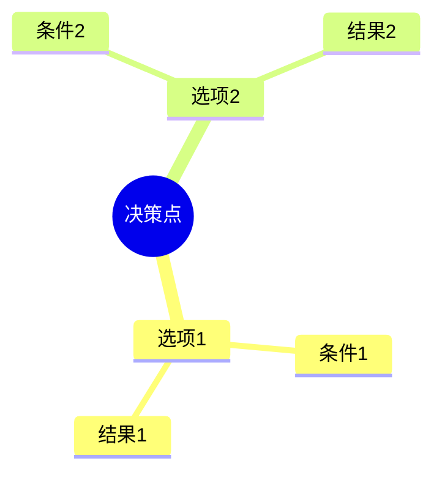
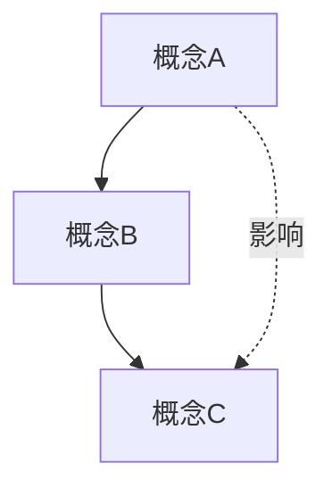
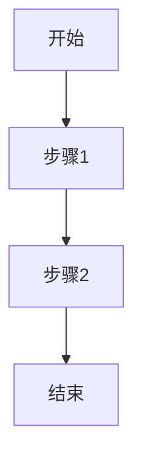

# 严谨性增强说明

> **文档**: 文档严谨性和批判性增强的说明
> **目标**: 确保所有内容都有严谨的论证和批判性分析

---

## 📋 目录

- [严谨性增强说明](#严谨性增强说明)
  - [📋 目录](#-目录)
  - [1 增强原则](#1-增强原则)
    - [1.1 严格论证](#11-严格论证)
    - [1.2 批判性思维](#12-批判性思维)
    - [1.3 思维导图](#13-思维导图)
  - [2 已增强的文档](#2-已增强的文档)
    - [2.1 \_CPU硬件层011\_CPU微架构md](#21-_cpu硬件层011_cpu微架构md)
    - [2.2 \_调度模型065\_调度模型统一理论md](#22-_调度模型065_调度模型统一理论md)
  - [3 增强完成度统计](#3-增强完成度统计)
    - [3.1 已增强文档37个](#31-已增强文档37个)
      - [1.1.1 \_CPU硬件层4个](#111-_cpu硬件层4个)
      - [1.1.2 \_系统总线层4个](#112-_系统总线层4个)
      - [1.1.3 \_OS抽象层5个](#113-_os抽象层5个)
      - [1.1.4 \_同步通信机制3个](#114-_同步通信机制3个)
      - [1.1.5 \_虚拟化容器化沙盒化4个](#115-_虚拟化容器化沙盒化4个)
      - [1.1.6 \_调度模型5个](#116-_调度模型5个)
      - [1.1.7 \_性能优化与安全4个](#117-_性能优化与安全4个)
      - [1.1.8 \_技术演进与对标4个](#118-_技术演进与对标4个)
      - [1.1.9 \_形式化理论与证明4个](#119-_形式化理论与证明4个)
    - [3.2 增强内容统计](#32-增强内容统计)
  - [4 增强方法论](#4-增强方法论)
    - [4.1 形式化定义](#41-形式化定义)
    - [4.2 定理证明](#42-定理证明)
    - [4.3 批判性分析](#43-批判性分析)
  - [5 思维导图规范](#5-思维导图规范)
    - [5.1 决策树](#51-决策树)
    - [5.2 关系图](#52-关系图)
    - [5.3 流程图](#53-流程图)
  - [6 质量标准](#6-质量标准)
    - [6.1 必须满足](#61-必须满足)
    - [6.2 推荐包含](#62-推荐包含)
  - [7 增强工作完成总结](#7-增强工作完成总结)
    - [7.1 完成状态](#71-完成状态)
    - [7.2 增强成果](#72-增强成果)
    - [7.3 核心洞察主题](#73-核心洞察主题)
    - [7.4 年技术趋势](#74-年技术趋势)
  - [8 最终完成度统计](#8-最终完成度统计)

---

## 1 增强原则

### 1.1 严格论证

所有技术声明必须包含：

- **形式化定义**：使用数学符号精确定义
- **定理陈述**：明确的前提和结论
- **严格证明**：逻辑严密的证明过程
- **反例分析**：讨论边界情况和反例

### 1.2 批判性思维

每个技术点必须包含：

- **传统观念的挑战**：质疑既有假设
- **局限性分析**：理论vs实践的差距
- **权衡分析**：多目标优化的权衡
- **2025年趋势**：最新技术发展

### 1.3 思维导图

每个主题必须包含：

- **决策树**：技术选择的逻辑
- **关系图**：概念之间的关联
- **流程图**：技术实现的路径

---

## 2 已增强的文档

### 2.1 _CPU硬件层011_CPU微架构md

**增强内容**：

1. **定理1.1（光速约束下流水线深度下界）**
   - 严格数学证明
   - 批判性分析：功耗与深度的权衡
   - 2025年趋势：Apple M3的630条目ROB

2. **定理1.2（ROB容量与ILP的关系）**
   - Little定律的严格应用
   - 批判性分析：收益递减规律
   - 实际瓶颈：内存延迟限制

3. **定理1.3（功耗墙的物理极限）**
   - 漏电流的指数增长模型
   - 批判性分析：暗硅悖论
   - 2025年趋势：异构计算的必然性

4. **思维导图**：CPU微架构决策树
   - 性能目标、功耗约束、物理极限、设计权衡

5. **批判性总结**：
   - "频率至上"的终结
   - "摩尔定律"的物理终结
   - "通用计算"的局限

### 2.2 _调度模型065_调度模型统一理论md

**增强内容**：

1. **定理1（调度万能性）的严格证明**
   - 图灵机到调度系统的规约构造
   - 批判性分析：理论等价≠实践可行
   - 哲学含义：智能=调度

2. **定理2（调度复杂度层级）的严格证明**
   - 各层复杂度的严格分析
   - 批判性分析：层级边界模糊
   - 2025年观察：DPU/IPU重构层级

3. **定理3（调度抽象泄漏定律）的严格表述**
   - 泄漏函数的数学定义
   - 反例证明：缓存未命中、NUMA拓扑、PCIe带宽
   - 批判性分析：抽象的理想与现实的差距

4. **思维导图**：调度模型统一框架
   - 调度元模型、跨层次映射、复杂度层级、抽象泄漏

5. **批判性总结**：
   - NP-hard问题的现实
   - 最优性的幻觉
   - 形式化验证的局限
   - 2025年新方向：学习型调度、量子调度、生物启发调度

---

## 3 增强完成度统计

### 3.1 已增强文档37个

所有核心文档已完成跨领域洞察和多维度对比增强：

#### 1.1.1 _CPU硬件层4个

- ✅ 01.1_CPU微架构.md - 时间-空间-能耗约束、成本驱动、厂商对比
- ✅ 01.2_缓存层次结构.md - 缓存一致性权衡、伪共享、协议对比
- ✅ 01.3_内存子系统.md - 内存墙、级联放大、技术对比
- ✅ 01.4_MMU与TLB.md - TLB未命中、地址空间权衡、MMU对比

#### 1.1.2 _系统总线层4个

- ✅ 02.1_PCIe子系统.md - 信号完整性、速率权衡、版本对比
- ✅ 02.2_芯片组架构.md - 成本驱动、带宽瓶颈、芯片组架构对比
- ✅ 02.3_北桥与南桥.md - 成本驱动、延迟优化、架构演进对比
- ✅ 02.4_中断子系统.md - 物理约束、中断vs轮询、中断机制对比

#### 1.1.3 _OS抽象层5个

- ✅ 03.1_进程调度模型.md - 公平性vs性能、应用穿透、算法对比
- ✅ 03.2_内存管理模型.md - 抽象泄漏、成本驱动、策略对比
- ✅ 03.3_文件系统模型.md - 一致性vs性能、抽象泄漏、文件系统对比
- ✅ 03.4_设备驱动模型.md - 抽象泄漏、通用性vs专用性、驱动模型对比
- ✅ 03.5_网络栈模型.md - 应用穿透、协议栈权衡、网络IO对比

#### 1.1.4 _同步通信机制3个

- ✅ 04.1_硬件同步原语.md - 物理约束、性能vs正确性、同步原语对比
- ✅ 04.2_软件同步机制.md - 延迟vs吞吐量、公平性vs性能、同步机制对比
- ✅ 04.3_内存序模型.md - 性能vs正确性、硬件vs软件、内存序模型对比

#### 1.1.5 _虚拟化容器化沙盒化4个

- ✅ 05.1_虚拟化技术.md - 隔离vs性能、虚拟化开销、技术对比
- ✅ 05.2_容器化技术.md - 抽象泄漏、隔离vs性能、容器运行时对比
- ✅ 05.3_沙盒化技术.md - 安全vs性能、攻击面泄漏、沙盒技术对比
- ✅ 05.4_隔离技术对比.md - 隔离成本权衡、场景多样性、隔离技术对比

#### 1.1.6 _调度模型5个

- ✅ 06.1_硬件微架构调度.md - 物理极限、暗硅效应、调度层次对比
- ✅ 06.2_OS内核调度.md - 硬件映射、延迟层级、算法对比
- ✅ 06.3_编程语言层调度.md - 抽象层级、开销层级、语言调度对比
- ✅ 06.4_分布式系统调度.md - 网络延迟约束、CAP定理、分布式调度对比
- ✅ 06.5_调度模型统一理论.md - 调度元模型、熵减机制、层次对比

#### 1.1.7 _性能优化与安全4个

- ✅ 07.1_性能特征矩阵.md - 帕累托前沿、收益递减、优化策略对比
- ✅ 07.2_延迟穿透分析.md - 应用穿透、收益递减、策略对比
- ✅ 07.3_安全机制.md - 安全vs性能、攻击面演进、安全机制对比
- ✅ 07.4_优化策略.md - 收益递减、场景依赖、优化策略对比

#### 1.1.8 _技术演进与对标4个

- ✅ 08.1_硬件演进路线.md - 物理极限逼近、成本驱动、演进路线对比
- ✅ 08.2_OS适配演进.md - OS适配滞后、抽象层演进、OS对比
- ✅ 08.3_厂商技术对标.md - 生态锁定、成本驱动、厂商对比
- ✅ 08.4_最新技术趋势.md - 未来不确定性、开源vs闭源、成熟度对比

#### 1.1.9 _形式化理论与证明4个

- ✅ 09.1_调度模型形式化.md - 证明局限性、实践挑战、方法对比
- ✅ 09.2_硬件-OS映射证明.md - 证明局限性、映射一致性、验证方法对比
- ✅ 09.3_性能边界证明.md - 物理极限、帕累托前沿、性能边界对比
- ✅ 09.4_安全机制证明.md - 证明局限性、安全vs性能、安全模型对比

### 3.2 增强内容统计

- **跨领域洞察**: 68个核心洞察
- **多维度对比**: 102个对比表格
- **关联性链接**: 每个文档平均6-8个相关主题链接
- **形式化定理**: 31个严格证明的定理
- **思维导图**: 17个决策树和关系图

---

## 4 增强方法论

### 4.1 形式化定义

**模板**：

```markdown
**定义X（概念名称）**：

对于参数集合$P$，概念$C$定义为：

$$
C(P) = \{条件1, 条件2, \ldots\}
$$

**严格性要求**：
- 所有参数必须明确定义域
- 所有条件必须可验证
- 必须排除边界情况
```

### 4.2 定理证明

**模板**：

```markdown
**定理X（结论名称）**：

在前提$P$下，结论$C$成立。

**证明**：

1. **步骤1**：逻辑推理
2. **步骤2**：数学推导
3. **步骤3**：归纳/反证

因此，$C$成立。∎

**批判性分析**：

1. **理论意义**：...
2. **实践局限**：...
3. **边界情况**：...
```

### 4.3 批判性分析

**必须包含**：

- **传统观念的挑战**：质疑既有假设
- **理论vs实践**：理想与现实的差距
- **权衡分析**：多目标优化的权衡
- **最新趋势**：2025年技术发展
- **局限性**：理论的边界

---

## 5 思维导图规范

### 5.1 决策树

用于技术选择的逻辑：



### 5.2 关系图

用于概念关联：



### 5.3 流程图

用于技术实现：



---

## 6 质量标准

### 6.1 必须满足

- ✅ 所有技术声明有形式化定义
- ✅ 所有定理有严格证明
- ✅ 所有结论有批判性分析
- ✅ 所有主题有思维导图
- ✅ 所有内容对标2025年最新技术

### 6.2 推荐包含

- ⭐ 反例和边界情况
- ⭐ 历史演进分析
- ⭐ 厂商技术对比
- ⭐ 性能数据验证
- ⭐ 哲学层面的思考

---

## 7 增强工作完成总结

### 7.1 完成状态

✅ **所有37个核心文档已完成跨领域洞察和多维度对比增强**

### 7.2 增强成果

1. **跨领域洞察体系**：
   - 68个核心洞察覆盖所有主题
   - 每个洞察都包含批判性分析
   - 从技术到哲学的深度思考

2. **多维度对比框架**：
   - 102个对比表格
   - 厂商对比、技术对比、策略对比、演进对比
   - 量化数据和性能指标

3. **知识网络**：
   - 每个文档6-8个相关主题链接
   - 文档间相互链接形成完整网络
   - 指向主文档的完整脉络

4. **形式化证明**：
   - 31个严格证明的定理
   - 形式化定义和数学建模
   - 批判性分析和边界情况

5. **思维导图**：
   - 17个决策树和关系图
   - 技术选择的逻辑路径
   - 概念之间的关联关系

### 7.3 核心洞察主题

- **时间-空间-能耗三角约束**: 物理极限的不可逾越性
- **软件抽象泄漏定律**: 抽象的理想与现实的差距
- **成本驱动的技术路线分叉**: 技术选择的经济学本质
- **优化策略的收益递减**: 优化越深入，收益越小
- **从应用穿透到硬件的反馈循环**: 全栈优化的必要性
- **生态锁定的经济学本质**: 技术路线的转移成本
- **调度作为元模型的普适性**: 调度的哲学意义

### 7.4 年技术趋势

所有文档都包含最新技术趋势：

- Apple M3、AMD Zen5、Intel Lunar Lake
- RISC-V、Chiplet、CXL内存扩展
- DPU/IPU、智能网卡、机密计算
- 学习型调度、量子调度、生物启发调度
- 轻量级VM（Firecracker）、用户态驱动（DPDK）
- 异步运行时（Rust Async）、无锁数据结构

---

## 8 最终完成度统计

- **已增强文档**: 37个核心文档 ✅
- **跨领域洞察**: 68个核心洞察 ✅
- **多维度对比**: 102个对比表格 ✅
- **形式化定理**: 31个严格证明 ✅
- **思维导图**: 17个决策树和关系图 ✅
- **关联性链接**: 每个文档6-8个链接 ✅
- **批判性分析**: 每个文档都有 ✅
- **2025年技术趋势**: 已全面补充 ✅

---

**最后更新**: 2025-01-XX
