# 调度视角：思维导图与多维知识矩阵

> **文档版本**: v1.0
> **创建日期**: 2025-01-XX
> **文档性质**: [可视化] - 调度视角的思维导图和多维知识矩阵
> **目的**: 提供直观的知识结构可视化和多维度对比分析

---

## 📋 目录

- [调度视角：思维导图与多维知识矩阵](#调度视角思维导图与多维知识矩阵)
  - [📋 目录](#-目录)
  - [1 概述](#1-概述)
  - [2 核心概念思维导图](#2-核心概念思维导图)
    - [2.1 调度系统全景图](#21-调度系统全景图)
    - [2.2 调度层次结构](#22-调度层次结构)
    - [2.3 硬件-OS-应用调度架构](#23-硬件-os-应用调度架构)
  - [3 主题模块思维导图](#3-主题模块思维导图)
    - [3.1 01 CPU硬件层](#31-01-cpu硬件层)
    - [3.2 02 系统总线层](#32-02-系统总线层)
    - [3.3 03 OS抽象层](#33-03-os抽象层)
    - [3.4 04 同步通信机制](#34-04-同步通信机制)
    - [3.5 05 虚拟化容器化沙盒化](#35-05-虚拟化容器化沙盒化)
    - [3.6 06 调度模型](#36-06-调度模型)
    - [3.7 07 性能优化与安全](#37-07-性能优化与安全)
    - [3.8 08 技术演进与对标](#38-08-技术演进与对标)
    - [3.9 09 形式化理论与证明](#39-09-形式化理论与证明)
    - [3.10 10-24 扩展主题](#310-10-24-扩展主题)
  - [4 多维知识矩阵](#4-多维知识矩阵)
    - [4.1 调度层次对比矩阵](#41-调度层次对比矩阵)
    - [4.2 调度算法对比矩阵](#42-调度算法对比矩阵)
    - [4.3 性能特征矩阵](#43-性能特征矩阵)
    - [4.4 技术演进时间线矩阵](#44-技术演进时间线矩阵)
    - [4.5 厂商技术对标矩阵](#45-厂商技术对标矩阵)
  - [5 跨层次调度协同网络](#5-跨层次调度协同网络)
  - [6 学习路径思维导图](#6-学习路径思维导图)
  - [7 实践应用决策树](#7-实践应用决策树)
  - [8 总结](#8-总结)

---

## 1 概述

本文档提供调度视角的**系统化思维导图**和**多维知识矩阵**，帮助理解：

- **硬件-OS-应用**全栈调度体系
- **24个主题模块**之间的关联
- **调度算法**的性能特征
- **技术演进**的时间维度
- **实践应用**的决策路径

---

## 2 核心概念思维导图

### 2.1 调度系统全景图

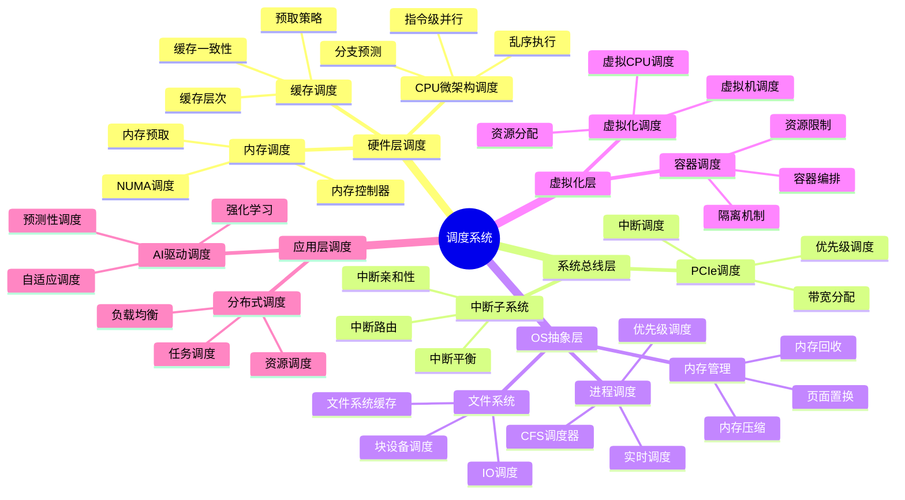

### 2.2 调度层次结构

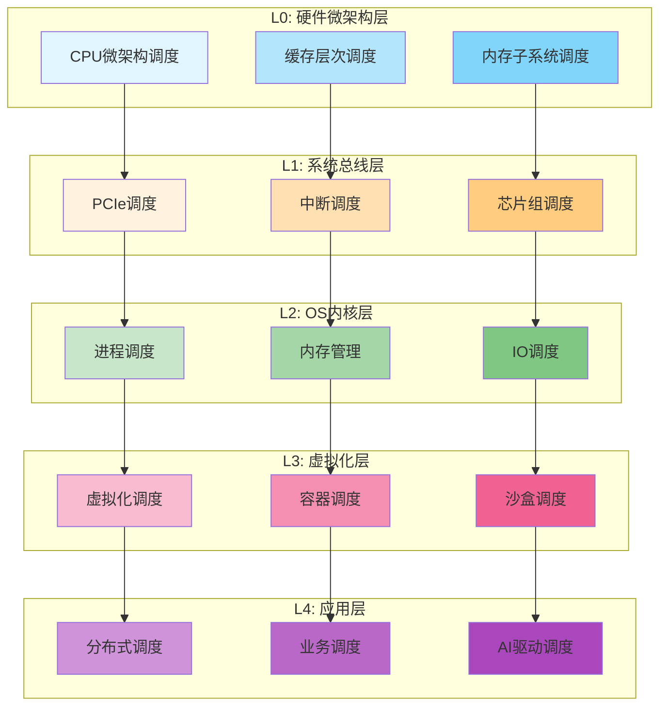

### 2.3 硬件-OS-应用调度架构

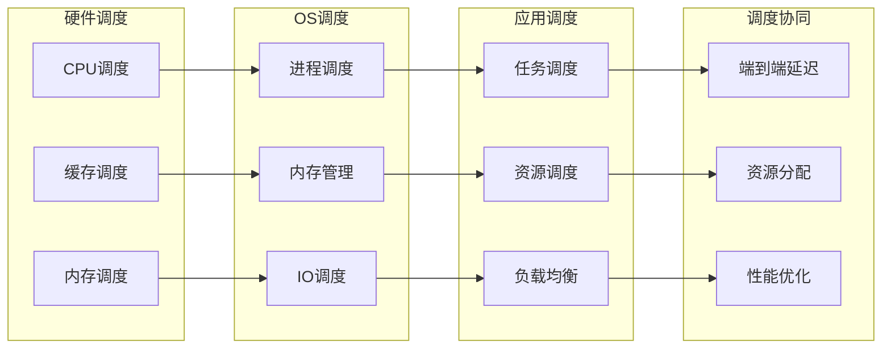

---

## 3 主题模块思维导图

### 3.1 01 CPU硬件层

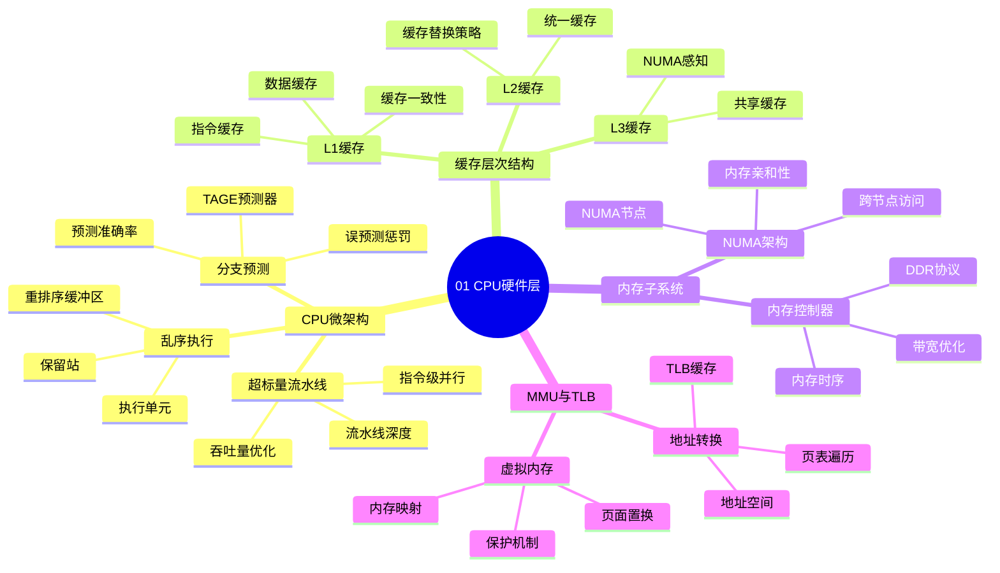

### 3.2 02 系统总线层

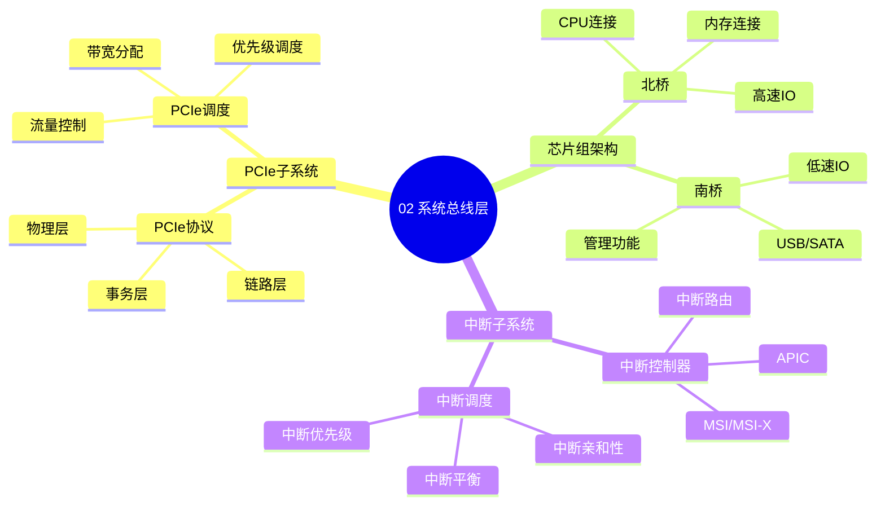

### 3.3 03 OS抽象层

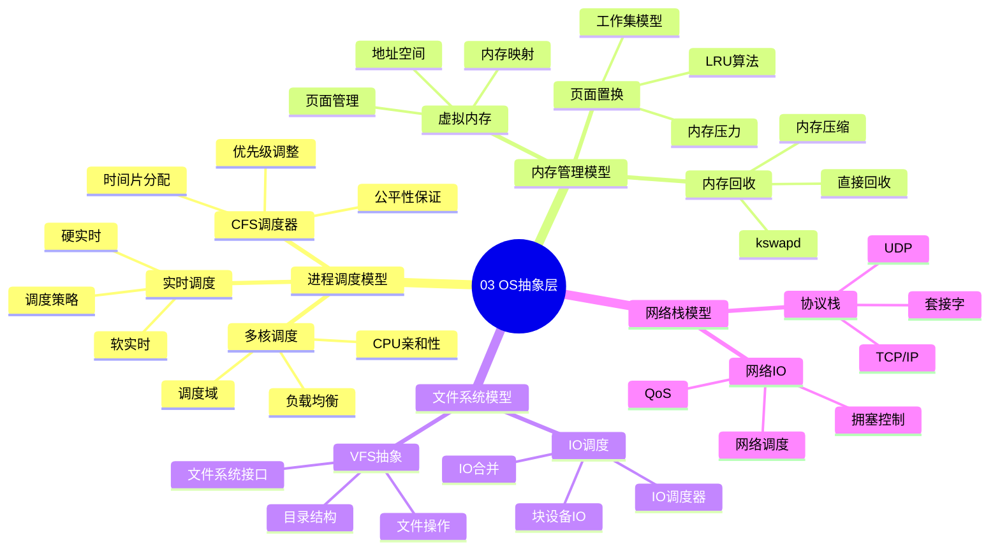

### 3.4 04 同步通信机制

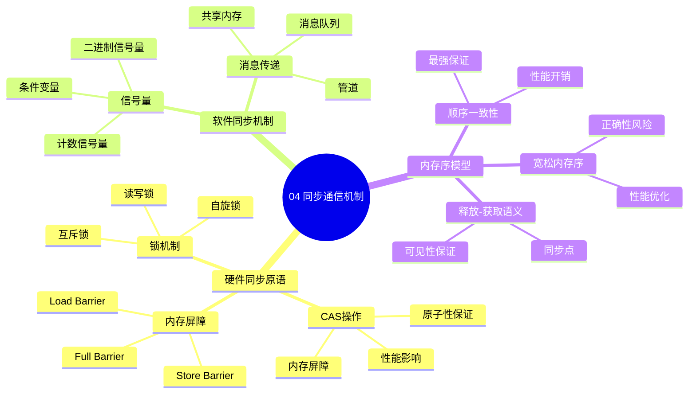

### 3.5 05 虚拟化容器化沙盒化

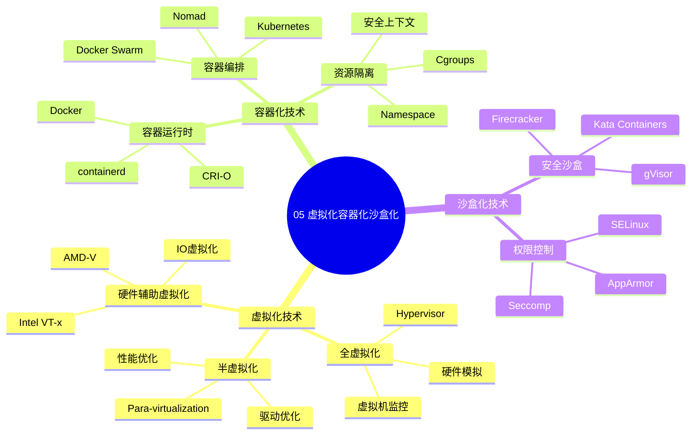

### 3.6 06 调度模型

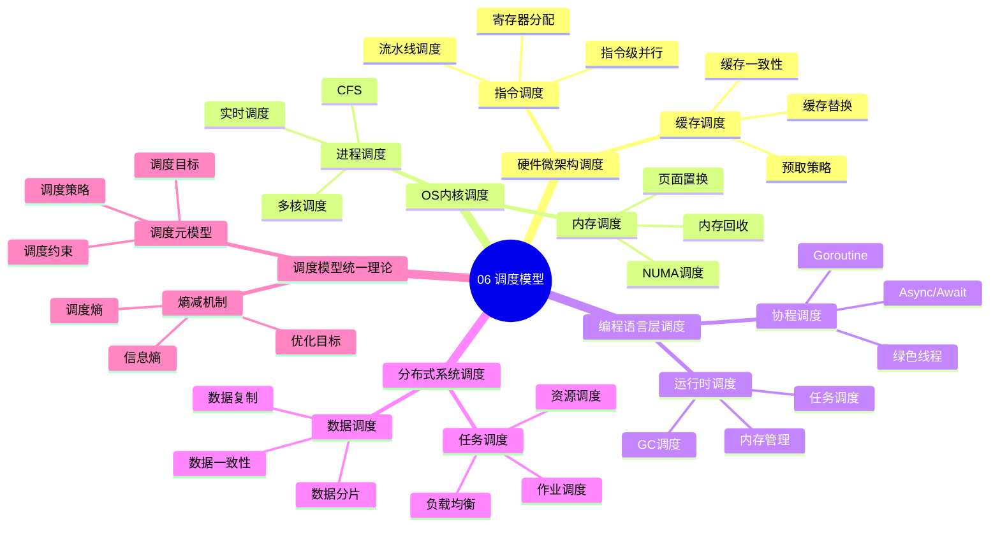

### 3.7 07 性能优化与安全

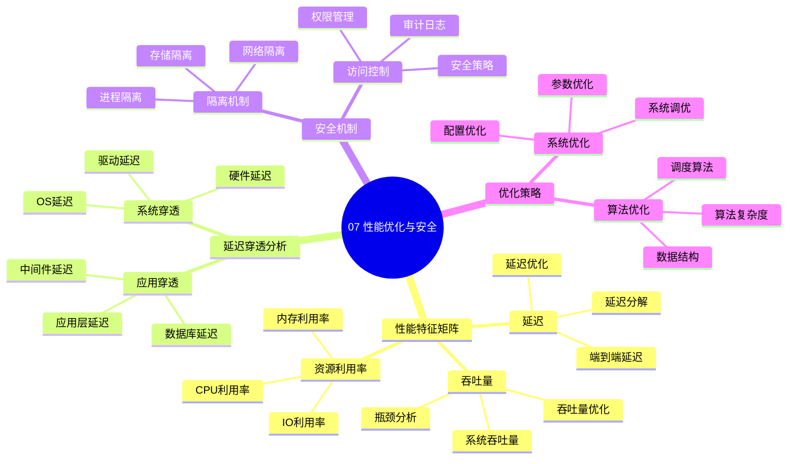

### 3.8 08 技术演进与对标

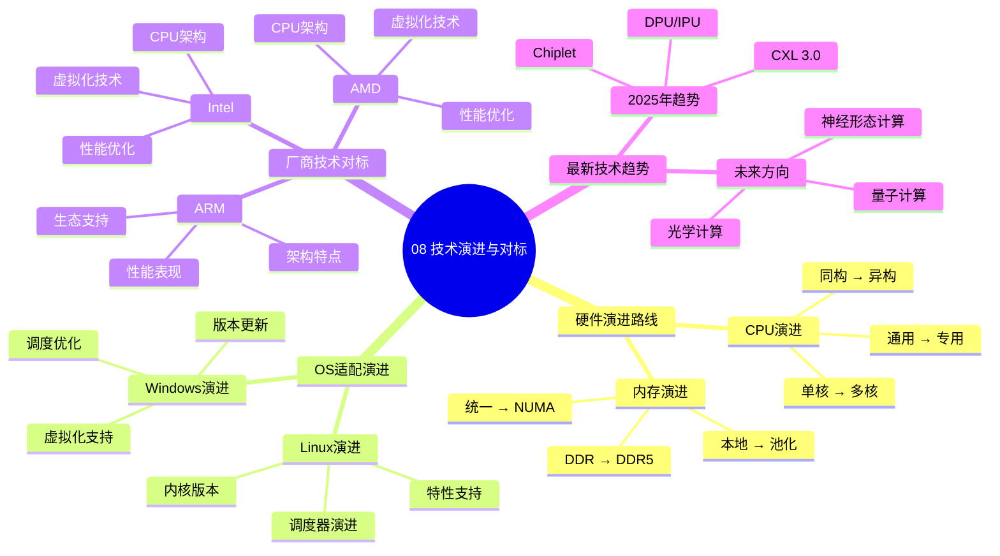

### 3.9 09 形式化理论与证明

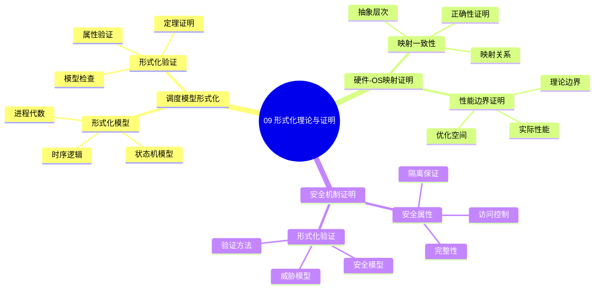

### 3.10 10-24 扩展主题

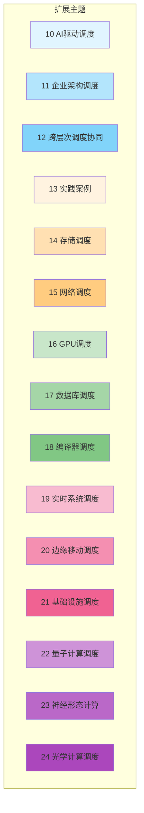

---

## 4 多维知识矩阵

### 4.1 调度层次对比矩阵

| 调度层次 | 调度对象 | 时间粒度 | 空间粒度 | 调度目标 | 典型算法 |
|---------|---------|---------|---------|---------|---------|
| **L0: 硬件微架构** | 指令 | 纳秒级 | 缓存行 | 指令级并行 | 乱序执行 |
| **L1: 系统总线** | 事务 | 微秒级 | 数据包 | 带宽利用 | 优先级调度 |
| **L2: OS内核** | 进程/线程 | 毫秒级 | 进程 | 公平性/实时性 | CFS/RT |
| **L3: 虚拟化** | 虚拟机/容器 | 秒级 | 资源组 | 资源隔离 | 资源分配 |
| **L4: 应用层** | 任务/作业 | 分钟级 | 服务 | 负载均衡 | 分布式调度 |

### 4.2 调度算法对比矩阵

| 调度算法 | 适用层次 | 调度目标 | 时间复杂度 | 公平性 | 实时性 | 适用场景 |
|---------|---------|---------|-----------|--------|--------|---------|
| **CFS** | OS内核 | 公平性 | O(log n) | ⭐⭐⭐⭐⭐ | ⭐⭐ | 通用计算 |
| **实时调度** | OS内核 | 实时性 | O(n) | ⭐⭐ | ⭐⭐⭐⭐⭐ | 实时系统 |
| **优先级调度** | 多层次 | 优先级 | O(1) | ⭐⭐ | ⭐⭐⭐⭐ | 多优先级 |
| **轮询调度** | 应用层 | 公平性 | O(1) | ⭐⭐⭐⭐ | ⭐⭐ | 简单场景 |
| **最短作业优先** | 应用层 | 吞吐量 | O(n log n) | ⭐⭐ | ⭐⭐ | 批处理 |
| **负载均衡** | 分布式 | 负载均衡 | O(n) | ⭐⭐⭐⭐ | ⭐⭐⭐ | 分布式系统 |
| **强化学习调度** | AI驱动 | 自适应 | 训练+推理 | ⭐⭐⭐ | ⭐⭐⭐⭐ | 复杂场景 |

### 4.3 性能特征矩阵

| 性能指标 | 硬件层 | OS层 | 虚拟化层 | 应用层 | 优化策略 |
|---------|--------|------|---------|--------|---------|
| **延迟** | 纳秒级 | 微秒级 | 毫秒级 | 秒级 | 减少层次 |
| **吞吐量** | 极高 | 高 | 中 | 低 | 并行化 |
| **资源利用率** | 高 | 中高 | 中 | 低 | 资源共享 |
| **可扩展性** | 低 | 中 | 高 | 极高 | 分布式 |
| **可预测性** | 高 | 中高 | 中 | 低 | 确定性调度 |

### 4.4 技术演进时间线矩阵

| 年代 | 硬件发展 | OS发展 | 虚拟化发展 | 应用发展 | 关键突破 |
|------|---------|--------|-----------|---------|---------|
| **1970s** | 单核CPU | Unix | 无 | 批处理 | 多任务 |
| **1980s** | 多核萌芽 | Linux | 无 | 分时系统 | 进程调度 |
| **1990s** | 多核SMP | 现代OS | 虚拟化 | 客户端-服务器 | 多核调度 |
| **2000s** | 多核普及 | 现代内核 | 硬件辅助 | Web应用 | 虚拟化 |
| **2010s** | NUMA | 云原生 | 容器化 | 微服务 | 容器编排 |
| **2020s** | 异构计算 | 云原生OS | 轻量级 | Serverless | 边缘计算 |
| **2025** | Chiplet/CXL | 统一调度 | WASM | AI驱动 | 智能调度 |

### 4.5 厂商技术对标矩阵

| 厂商 | CPU架构 | 虚拟化 | 调度优化 | 生态支持 | 性能表现 |
|------|---------|--------|---------|---------|---------|
| **Intel** | x86-64 | VT-x | 深度优化 | ⭐⭐⭐⭐⭐ | ⭐⭐⭐⭐⭐ |
| **AMD** | x86-64 | AMD-V | 良好优化 | ⭐⭐⭐⭐ | ⭐⭐⭐⭐⭐ |
| **ARM** | ARM64 | ARM虚拟化 | 基础优化 | ⭐⭐⭐ | ⭐⭐⭐⭐ |
| **Apple** | M系列 | 统一内存 | 深度优化 | ⭐⭐⭐⭐ | ⭐⭐⭐⭐⭐ |
| **NVIDIA** | GPU | CUDA | 专用优化 | ⭐⭐⭐⭐ | ⭐⭐⭐⭐⭐ |

---

## 5 跨层次调度协同网络

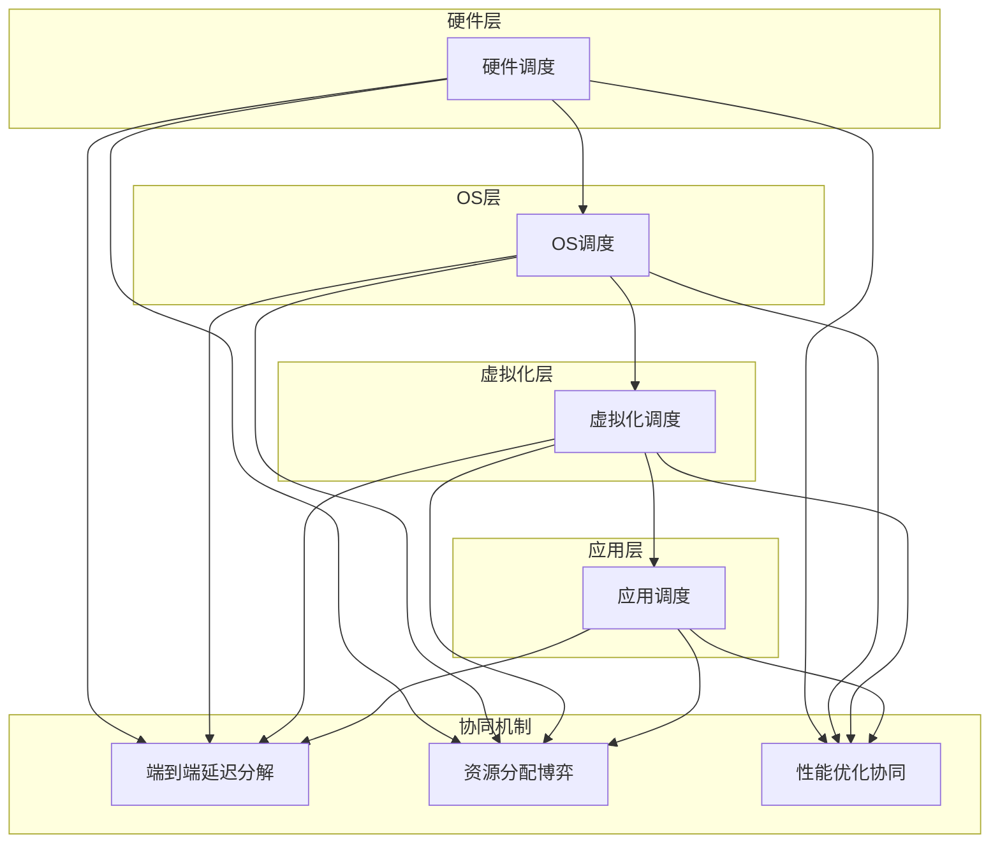

---

## 6 学习路径思维导图

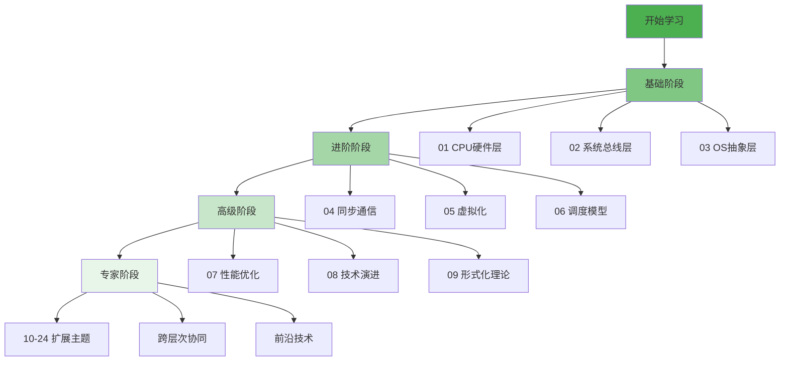

---

## 7 实践应用决策树

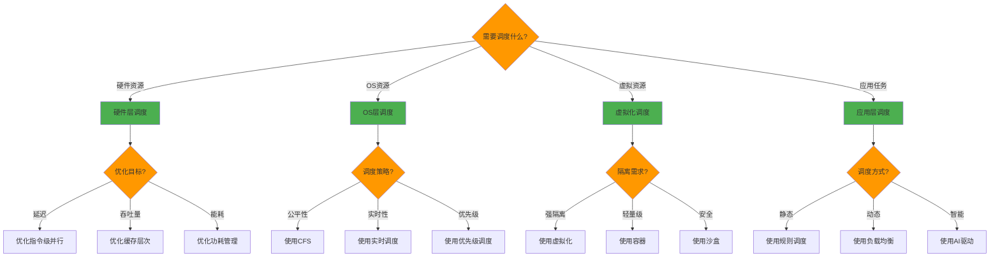

---

## 8 总结

本文档提供了调度视角的**系统化思维导图**和**多维知识矩阵**，包括：

✅ **24个主题模块**的思维导图
✅ **5个多维知识矩阵**的对比分析
✅ **跨层次调度协同网络**的可视化
✅ **学习路径**和**实践应用决策树**

**下一步**：

- 查看 [知识图谱总览](./知识图谱总览.md) 获取更详细的分析
- 参考各主题模块的具体文档获取技术细节
- 使用思维导图快速定位知识点

---

**返回**: [README](./README.md) | [主题索引](../README.md)
