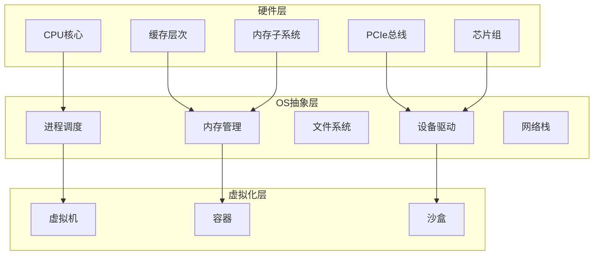
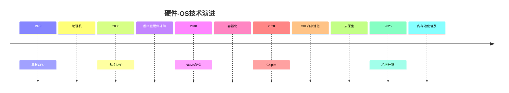

# 知识图谱总览

> **文档**: 硬件-OS全栈技术知识图谱
> **覆盖**: 从CPU硬件到OS软件的全维度概念关系

---

## 📊 核心概念关系图谱

### 硬件-OS映射关系



---

## 🔗 概念关系矩阵

### 硬件-OS映射矩阵

| **硬件组件** | **OS抽象** | **映射机制** | **延迟开销** |
|-------------|-----------|-------------|-------------|
| **CPU流水线** | 进程上下文 | 寄存器保存 | 5μs |
| **L1缓存** | 内存屏障 | 硬件透明 | 0ns |
| **L3缓存** | 调度域 | 拓扑感知 | 0ns |
| **DRAM** | 虚拟内存 | 页表映射 | 30ns |
| **PCIe设备** | 设备文件 | VFIO/驱动 | 1μs |
| **IOMMU** | DMA隔离 | 地址重映射 | 30ns |

---

## 📈 技术演进时间线



---

## 🎯 多维概念矩阵

### 延迟-带宽-功耗三角

| **组件** | **延迟** | **带宽** | **功耗** | **优化方向** |
|---------|----------|----------|----------|-------------|
| **L1缓存** | 1ns | 2TB/s | 0.5nJ | 对齐优化 |
| **L3缓存** | 15ns | 200GB/s | 10nJ | 局部性 |
| **DRAM** | 80ns | 50GB/s | 2nJ | NUMA绑定 |
| **PCIe** | 1μs | 64GB/s | 50pJ/bit | 直通优化 |
| **NVMe** | 100μs | 7GB/s | 5W | 多队列 |

---

## 🔄 概念流转关系

### 数据流转路径

```text
CPU指令
  ↓ [虚拟地址]
MMU/TLB
  ↓ [物理地址]
内存控制器
  ↓ [DRAM命令]
DDR5总线
  ↓ [数据返回]
L3缓存
  ↓ [MESIF协议]
L1缓存
  ↓ [寄存器]
CPU执行
```

---

## 📚 主题关联网络

### 跨主题关系

- **01_CPU硬件层** ↔ **03_OS抽象层**：硬件特性暴露
- **02_系统总线层** ↔ **03_OS抽象层**：设备驱动映射
- **04_同步通信机制** ↔ **01_CPU硬件层**：缓存一致性
- **05_虚拟化容器化沙盒化** ↔ **02_系统总线层**：IOMMU隔离
- **06_调度模型** ↔ **03_OS抽象层**：调度器实现
- **07_性能优化与安全** ↔ **所有主题**：优化策略
- **08_技术演进与对标** ↔ **所有主题**：历史演进
- **09_形式化理论与证明** ↔ **06_调度模型**：形式化证明

---

## 📐 调度模型统一框架

### 调度元模型

所有调度系统都可以表示为：

$$
\text{Schedule}: \mathbb{N} \times \mathcal{P}(T) \rightarrow T
$$

其中：

- $T$：任务集合
- $\mathbb{N}$：时间步
- $\mathcal{P}(T)$：就绪任务集合

### 跨层次调度映射

| **层次** | **调度单元** | **调度器** | **约束** | **延迟** |
|---------|-------------|-----------|---------|----------|
| **硬件** | 微指令 | ROB | 数据依赖 | 0.2ns |
| **OS** | 进程/线程 | CFS | 公平性 | 5μs |
| **语言** | 协程 | Go调度器 | 工作窃取 | 100ns |
| **分布式** | 任务 | K8s | 资源约束 | 100ms |

---

## 🎓 学习路径推荐

### 入门路径

1. **硬件基础** → [01_CPU硬件层](./01_CPU硬件层/README.md)
2. **OS抽象** → [03_OS抽象层](./03_OS抽象层/README.md)
3. **虚拟化** → [05_虚拟化容器化沙盒化](./05_虚拟化容器化沙盒化/README.md)

### 进阶路径

1. **调度理论** → [06_调度模型](./06_调度模型/README.md)
2. **性能优化** → [07_性能优化与安全](./07_性能优化与安全/README.md)
3. **形式化证明** → [09_形式化理论与证明](./09_形式化理论与证明/README.md)

### 专家路径

1. **技术演进** → [08_技术演进与对标](./08_技术演进与对标/README.md)
2. **形式化验证** → [09_形式化理论与证明](./09_形式化理论与证明/README.md)
3. **跨层次映射** → 本知识图谱

---

## 🌐 跨领域洞察网络

### 核心洞察主题

文档系统包含68个跨领域核心洞察，覆盖以下主题：

1. **时间-空间-能耗三角约束**: 物理极限的不可逾越性
2. **软件抽象泄漏定律**: 抽象的理想与现实的差距
3. **成本驱动的技术路线分叉**: 技术选择的经济学本质
4. **优化策略的收益递减**: 优化越深入，收益越小
5. **从应用穿透到硬件的反馈循环**: 全栈优化的必要性
6. **生态锁定的经济学本质**: 技术路线的转移成本
7. **调度作为元模型的普适性**: 调度的哲学意义
8. **通信同步复杂度层级递增**: 通信复杂度往往高于算法复杂度

### 通信同步复杂度分析

文档系统包含完整的通信同步复杂度分析：

- **硬件层**: $O(n)$通信复杂度（MESI协议），20-40周期同步开销
- **OS层**: $O(n)$通信复杂度（TLB shootdown），5-10μs同步开销
- **语言层**: $O(n)$通信复杂度（工作窃取），100ns同步开销
- **分布式层**: $O(n^2)$通信复杂度（多数派协议），50-300ms同步开销

**关键洞察**：通信复杂度往往高于算法复杂度，通信延迟成为分布式调度的主要瓶颈。

### 论证脉络体系

文档系统包含6大核心论证脉络：

1. **调度作为元模型的普适性**: 智能=在约束下的最优调度
2. **调度抽象泄漏定律与通信同步复杂度**: 延迟递增+通信复杂度指数级增长
3. **时间-空间-能耗三角约束**: 物理极限的不可逾越性
4. **软件抽象泄漏定律**: 抽象的理想与现实的差距
5. **成本驱动的技术路线分叉**: 技术选择的经济学本质
6. **优化策略的收益递减**: 优化越深入，收益越小

### 多维度对比框架

文档系统包含102个多维度对比表格，包括：

- **厂商对比**: Intel、AMD、Apple、ARM、RISC-V等
- **技术对比**: 不同技术方案的性能、成本、复杂度对比
- **策略对比**: 不同优化策略的权衡分析
- **演进对比**: 技术演进路线的历史对比

### 知识网络结构

- **37个核心文档**: 每个文档包含6-8个相关主题链接
- **31个形式化定理**: 严格证明的数学定理
- **17个思维导图**: 决策树和关系图（含通信同步复杂度关系）
- **完整的跨领域洞察体系**: 从技术到哲学的深度思考
- **通信同步复杂度分析**: 完整的各层次通信同步复杂度分析
- **论证脉络体系**: 6大核心论证脉络的完整梳理

### 新增总览文档

- [通信同步复杂度总览](./通信同步复杂度总览.md) - 通信同步复杂度详细分析
- [论证脉络总览](./论证脉络总览.md) - 核心论证脉络与跨领域洞察的完整梳理

---

**最后更新**: 2025-01-XX
