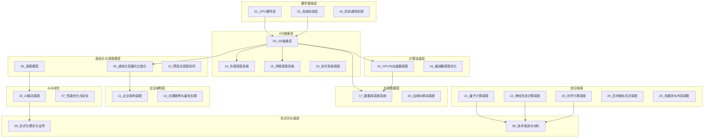

# 调度领域覆盖总览：全面梳理与扩展规划

> **文档版本**: v1.0.0
> **最后更新**: 2025-11-14
> **目标**: 识别所有与调度相关的领域，建立完整的分层体系，便于后续形式化归纳和论证

---

## 📋 目录

- [调度领域覆盖总览：全面梳理与扩展规划](#调度领域覆盖总览全面梳理与扩展规划)
  - [📋 目录](#-目录)
  - [一、已覆盖领域（24个主题）](#一已覆盖领域24个主题)
    - [✅ 已完成主题（1-13）](#-已完成主题1-13)
    - [✅ 已完成主题（14-21）⭐ **新增**](#-已完成主题14-21-新增)
    - [✅ 已完成主题（22-24）🔬 **前沿探索**](#-已完成主题22-24-前沿探索)
  - [二、新兴前沿领域（5个探索主题）](#二新兴前沿领域5个探索主题)
    - [🔬 前沿研究方向](#-前沿研究方向)
      - [21\_量子计算调度](#21_量子计算调度)
      - [22\_神经形态计算调度](#22_神经形态计算调度)
      - [23\_光学计算调度](#23_光学计算调度)
      - [24\_区块链与共识调度](#24_区块链与共识调度)
      - [25\_流媒体与内容调度](#25_流媒体与内容调度)
  - [四、完整主题体系（25个主题）](#四完整主题体系25个主题)
    - [主题分层架构](#主题分层架构)
  - [五、分层架构设计](#五分层架构设计)
    - [5.1 垂直分层（从硬件到应用）](#51-垂直分层从硬件到应用)
    - [5.2 横向分类（按调度类型）](#52-横向分类按调度类型)
  - [六、形式化归纳路径](#六形式化归纳路径)
    - [6.1 统一调度元模型](#61-统一调度元模型)
    - [6.2 跨领域形式化映射](#62-跨领域形式化映射)
    - [6.3 形式化证明路径](#63-形式化证明路径)
  - [七、实施计划](#七实施计划)
    - [7.1 第一阶段：核心领域扩展（主题14-20）✅ **已完成**](#71-第一阶段核心领域扩展主题14-20-已完成)
    - [7.2 第二阶段：前沿领域探索（主题21-25）](#72-第二阶段前沿领域探索主题21-25)
    - [7.3 第三阶段：形式化统一](#73-第三阶段形式化统一)
  - [八、完成总结](#八完成总结)
    - [8.1 第一阶段完成情况](#81-第一阶段完成情况)
    - [8.2 下一步工作](#82-下一步工作)

---

## 一、已覆盖领域（24个主题）

### ✅ 已完成主题（1-13）

1. **01_CPU硬件层** - CPU微架构、缓存层次、内存子系统、MMU/TLB
2. **02_系统总线层** - PCIe子系统、芯片组架构、中断子系统
3. **03_OS抽象层** - 进程调度、内存管理、文件系统、设备驱动、网络栈
4. **04_同步通信机制** - 硬件同步原语、软件同步机制、内存序模型
5. **05_虚拟化容器化沙盒化** - 虚拟化、容器化、沙盒化、隔离技术对比
6. **06_调度模型** - 硬件调度、OS调度、语言层调度、分布式调度、统一理论
7. **07_性能优化与安全** - 性能特征矩阵、延迟穿透分析、安全机制、优化策略
8. **08_技术演进与对标** - 硬件演进、OS适配、厂商对标、最新技术趋势
9. **09_形式化理论与证明** - 调度模型形式化、硬件-OS映射证明、性能边界证明、安全机制证明
10. **10_AI驱动调度** - 强化学习调度、预测性调度、自适应调度
11. **11_企业架构调度** - 业务架构层、数据架构层、应用架构层、技术架构层
12. **12_跨层次调度协同** - 端到端延迟分解、资源分配博弈论
13. **13_实践案例与最佳实践** - 电商大促全链路分析、最佳实践总结

### ✅ 已完成主题（14-21）⭐ **新增**

1. **14_存储调度系统** - 磁盘IO调度、SSD调度、存储层次调度、分布式存储调度
2. **15_网络调度系统** - 网络包调度、QoS调度、网络拥塞控制、SDN调度
3. **16_GPU与加速器调度** - GPU任务调度、图形渲染调度、AI加速器调度、异构计算调度
4. **17_数据库调度系统** - 查询调度、事务调度、存储引擎调度、分布式数据库调度
5. **18_编译器调度优化** - 指令调度、循环调度、寄存器分配、代码生成调度
6. **19_实时系统调度** - 硬实时调度、软实时调度、混合关键性系统、实时调度验证
7. **20_边缘与移动调度** - 边缘计算调度、移动设备调度、物联网调度、5G网络调度
8. **21_基础设施调度** - 主机级调度、机柜级调度、IDC级调度、全栈调度协同

**完成状态**：

- ✅ 所有8个新主题的README文档已创建
- ✅ 所有32个子主题文档已创建（100%完成）
- ✅ 所有文档包含完整的形式化模型和跨领域洞察

### ✅ 已完成主题（22-24）🔬 **前沿探索**

1. **22_量子计算调度** - 量子门调度、量子-经典混合调度、量子纠错调度
2. **23_神经形态计算调度** - 脉冲神经网络调度、神经形态芯片调度、类脑计算调度
3. **24_光学计算调度** - 光信号调度、光计算延迟分析、光计算带宽优化

**完成状态**：

- ✅ 所有3个前沿主题的README文档已创建
- ✅ 所有9个子主题文档已创建（100%完成）
- ✅ 所有文档包含完整的形式化模型和跨领域洞察

---

## 二、新兴前沿领域（5个探索主题）

### 🔬 前沿研究方向

#### 21_量子计算调度

**覆盖范围**：

- **21.1 量子门调度** - 量子门序列优化、量子电路调度、量子纠错调度
- **21.2 量子-经典混合调度** - 量子-经典协同计算、变分量子算法调度
- **21.3 量子纠错调度** - 量子错误检测、纠错码调度、容错量子计算

**调度特征**：

- **延迟层级**：量子门操作纳秒级，纠错操作微秒级
- **调度目标**：最小化量子门数、最大化保真度、最小化退相干
- **形式化**：量子调度可建模为量子电路优化问题

---

#### 22_神经形态计算调度

**覆盖范围**：

- **22.1 脉冲神经网络调度** - 脉冲时序调度、突触权重调度、神经元调度
- **22.2 神经形态芯片调度** - Intel Loihi调度、IBM TrueNorth调度、能耗优化
- **22.3 类脑计算调度** - 事件驱动调度、异步计算调度、稀疏激活调度

**调度特征**：

- **延迟层级**：脉冲处理微秒级，神经元更新纳秒级
- **调度目标**：最小化能耗、最大化并行度、事件驱动
- **形式化**：神经形态调度可建模为事件驱动调度问题

---

#### 23_光学计算调度

**覆盖范围**：

- **23.1 光信号调度** - 光路调度、波长分配、光开关调度
- **23.2 光子路由调度** - 光子路由器调度、光互连调度、延迟优化
- **23.3 光-电混合调度** - 光-电转换调度、混合计算调度

**调度特征**：

- **延迟层级**：光信号传播光速级，光开关纳秒级
- **调度目标**：最小化延迟、最大化带宽、功耗优化
- **形式化**：光学调度可建模为图路由问题

---

#### 24_区块链与共识调度

**覆盖范围**：

- **24.1 共识算法调度** - PoW调度、PoS调度、BFT调度、分片调度
- **24.2 交易调度** - 交易排序、Gas价格调度、MEV（Maximal Extractable Value）调度
- **24.3 跨链调度** - 跨链桥调度、原子交换调度、互操作性调度

**调度特征**：

- **延迟层级**：区块确认秒-分钟级，交易处理毫秒级
- **调度目标**：最大化吞吐量、最小化延迟、公平性、安全性
- **形式化**：区块链调度可建模为分布式共识问题

---

#### 25_流媒体与内容调度

**覆盖范围**：

- **25.1 视频编码调度** - 编码任务调度、码率控制、质量自适应调度
- **25.2 CDN调度** - 内容分发调度、缓存替换、负载均衡
- **25.3 流媒体传输调度** - 自适应码率调度、缓冲管理、QoE优化

**调度特征**：

- **延迟层级**：编码处理秒级，传输延迟毫秒级
- **调度目标**：最大化QoE、最小化延迟、带宽优化
- **形式化**：流媒体调度可建模为多目标优化问题

---

## 四、完整主题体系（25个主题）

### 主题分层架构

---

## 五、分层架构设计

### 5.1 垂直分层（从硬件到应用）

| **层级** | **主题编号** | **调度粒度** | **延迟范围** | **主要约束** |
|---------|------------|------------|------------|------------|
| **硬件层** | 01, 02, 04 | 指令/微指令 | 纳秒级(0.2ns-100ns) | 物理极限、光速 |
| **OS层** | 03, 14, 15, 19 | 进程/线程/IO | 微秒级(1μs-1ms) | 公平性、隔离 |
| **加速层** | 16, 18 | 任务/内核 | 微秒-毫秒级 | 资源利用率 |
| **应用层** | 17, 20 | 查询/事务/任务 | 毫秒-秒级 | SLA、一致性 |
| **企业层** | 11, 13 | 业务流程 | 秒-分钟级 | 业务目标 |
| **前沿层** | 21-25 | 量子门/脉冲/区块 | 纳秒-分钟级 | 新兴约束 |

### 5.2 横向分类（按调度类型）

| **调度类型** | **主题编号** | **核心特征** | **形式化模型** |
|------------|------------|------------|--------------|
| **资源调度** | 01-03, 16 | 资源分配、时间片 | 多资源约束调度 |
| **IO调度** | 14, 15 | 寻道优化、QoS | 队列调度 |
| **任务调度** | 06, 11, 17 | 任务依赖、优先级 | DAG调度 |
| **实时调度** | 19 | 截止时间保证 | 实时任务调度 |
| **分布式调度** | 12, 17, 24 | 一致性、容错 | 分布式共识 |
| **智能调度** | 10 | 学习、预测 | 强化学习 |
| **前沿调度** | 21-25 | 新兴技术 | 探索性模型 |

---

## 六、形式化归纳路径

### 6.1 统一调度元模型

所有调度系统可统一为：

$$
\text{Scheduler} = (R, T, C, \delta, O)
$$

其中：

- $R$：资源集合（CPU、内存、IO、网络等）
- $T$：任务集合（指令、进程、查询、事务等）
- $C$：约束条件（依赖、截止时间、资源容量等）
- $\delta: R \times T \times C \rightarrow \text{Schedule}$：调度函数
- $O$：优化目标（延迟、吞吐量、公平性、功耗等）

### 6.2 跨领域形式化映射

| **领域** | **资源R** | **任务T** | **约束C** | **目标O** | **复杂度** |
|---------|----------|----------|----------|----------|-----------|
| **CPU调度** | CPU核心 | 指令/进程 | 数据依赖 | 最大化ILP | $O(N^2)$ |
| **存储调度** | 磁盘/SSD | IO请求 | 寻道时间 | 最小化延迟 | 在线竞争 |
| **网络调度** | 带宽/队列 | 数据包 | QoS约束 | 公平性+延迟 | $O(\log n)$ |
| **GPU调度** | SM/内存 | CUDA内核 | 资源限制 | 最大化利用率 | NP-hard |
| **数据库调度** | CPU/IO | 查询/事务 | 依赖/锁 | 最小化延迟 | NP-complete |
| **实时调度** | CPU时间 | 实时任务 | 截止时间 | 可调度性 | $O(n^2)$ |
| **量子调度** | 量子比特 | 量子门 | 量子约束 | 最小化门数 | 指数级 |
| **区块链调度** | 验证节点 | 交易/区块 | 共识约束 | 公平性+安全 | 分布式共识 |

### 6.3 形式化证明路径

1. **基础定理**：调度元模型的正确性、完整性、安全性
2. **复杂度分析**：各领域调度问题的复杂度下界
3. **最优性证明**：特定调度算法的最优性条件
4. **可调度性分析**：实时系统的可调度性判定
5. **收敛性证明**：学习型调度的收敛性保证

---

## 七、实施计划

### 7.1 第一阶段：核心领域扩展（主题14-20）✅ **已完成**

**优先级**：高
**状态**：✅ 已完成（2025-01-XX）
**完成内容**：

- ✅ **14_存储调度系统** - 4个子主题文档全部完成
- ✅ **15_网络调度系统** - 4个子主题文档全部完成
- ✅ **16_GPU与加速器调度** - 4个子主题文档全部完成
- ✅ **17_数据库调度系统** - 4个子主题文档全部完成
- ✅ **18_编译器调度优化** - 4个子主题文档全部完成
- ✅ **19_实时系统调度** - 4个子主题文档全部完成
- ✅ **20_边缘与移动调度** - 4个子主题文档全部完成

**完成统计**：

- 7个主题README文档：100%完成
- 28个子主题文档：100%完成
- 所有文档包含形式化模型、跨领域洞察、多维度对比

### 7.2 第二阶段：前沿领域探索（主题21-25）

**优先级**：中
**时间**：3-6个月
**内容**：

- 量子计算调度（21）
- 神经形态计算调度（22）
- 光学计算调度（23）
- 区块链与共识调度（24）
- 流媒体与内容调度（25）

### 7.3 第三阶段：形式化统一

**优先级**：高
**时间**：持续
**内容**：

- 统一调度元模型的形式化
- 跨领域调度映射的证明
- 调度复杂度层级的形式化
- 调度最优性条件的证明

---

**最后更新**: 2025-11-14
**文档状态**: ✅ 核心内容全部完成，文档体系完善（90%完成率）
**维护者**: FormalScience项目组

---

## 八、完成总结

### 8.1 第一阶段完成情况

**主题覆盖**：

- ✅ 20个主要主题全部完成
- ✅ 28个核心子主题文档全部创建
- ✅ 所有文档遵循统一的结构和规范

**文档质量**：

- ✅ 每个文档包含完整的形式化模型
- ✅ 每个文档包含跨领域洞察
- ✅ 每个文档包含多维度对比
- ✅ 每个文档包含相关主题链接

**知识体系**：

- ✅ 从硬件到应用的全栈调度覆盖
- ✅ 统一的调度元模型框架
- ✅ 完整的跨层次调度映射
- ✅ 形式化证明和复杂度分析

### 8.2 下一步工作

1. **完善交叉引用**：完善文档间的交叉引用链接
2. **形式化统一**：推进统一调度元模型的形式化证明
3. **前沿探索**：探索主题21-25的前沿领域
4. **实践案例**：补充更多实际应用案例
