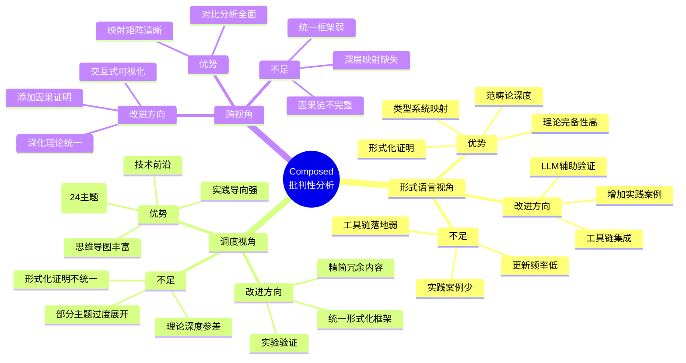
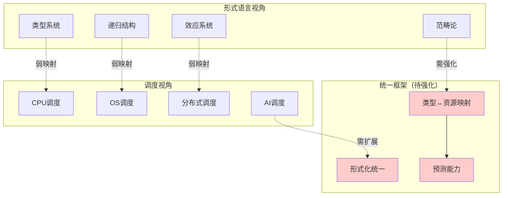
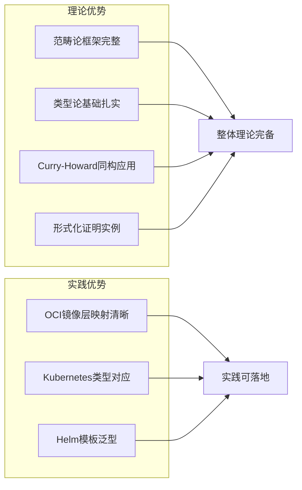
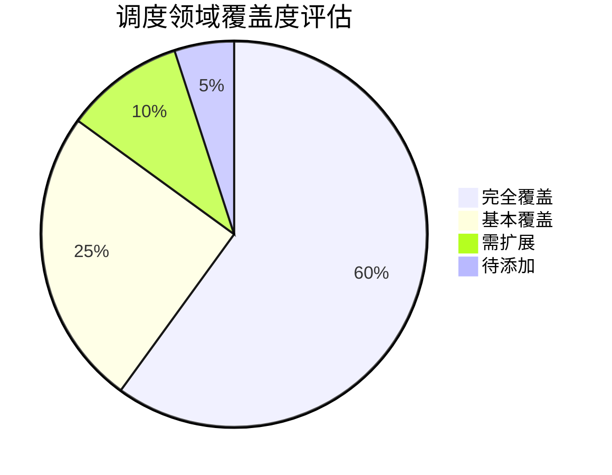
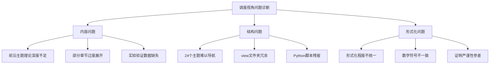
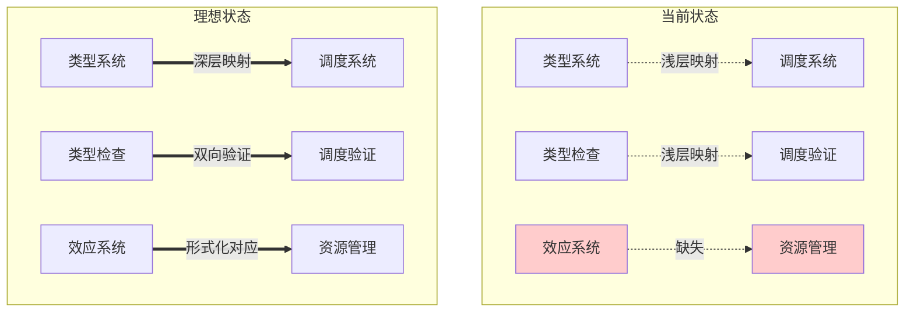
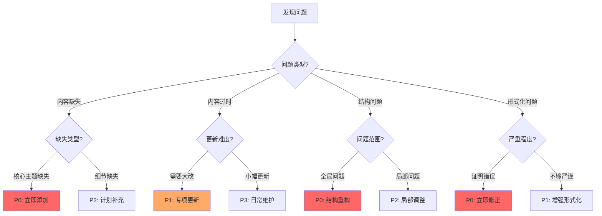
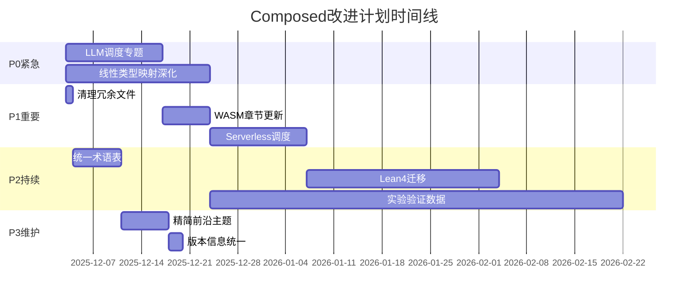
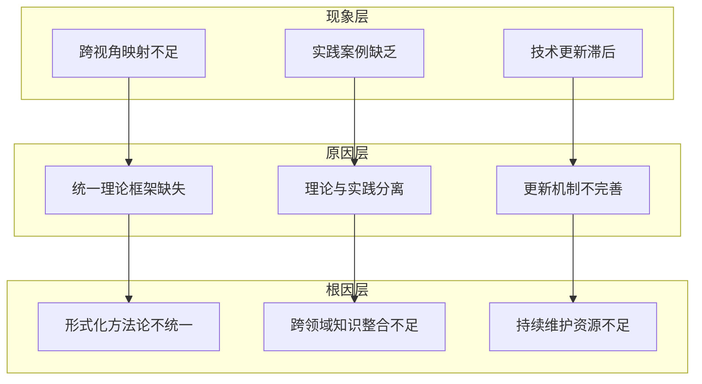

# Composed 文件夹全面批判性分析与改进计划

> **文档版本**: v1.0
> **创建日期**: 2025-12-02
> **分析范围**: Composed 目录所有内容（形式语言视角 + 调度视角）
> **文档性质**: 批判性分析 + 改进计划 + 任务编排

---

## 📋 目录

---

## 1 总体评估

### 1.1 项目概况

**Composed** 目录是一个**跨视角组合知识体系**，包含两个核心视角：

| 视角 | 文件数量 | 主题模块数 | 完成状态 | 特点 |
|------|---------|-----------|---------|------|
| **形式语言视角** | ~50个 | 9个 | ✅ 100% | 理论完备性高、形式化程度深 |
| **调度视角** | ~135个 | 24个 | ✅ 100% | 实践应用丰富、技术覆盖全面 |
| **跨视角文档** | 6个 | - | ✅ 完成 | 提供统一框架和对比分析 |

### 1.2 总体评分矩阵

| 评估维度 | 形式语言视角 | 调度视角 | 总体评分 |
|---------|-------------|---------|---------|
| **内容完整性** | ⭐⭐⭐⭐⭐ (95%) | ⭐⭐⭐⭐⭐ (98%) | ⭐⭐⭐⭐⭐ |
| **理论深度** | ⭐⭐⭐⭐⭐ (90%) | ⭐⭐⭐⭐ (80%) | ⭐⭐⭐⭐ |
| **实践应用性** | ⭐⭐⭐ (70%) | ⭐⭐⭐⭐⭐ (95%) | ⭐⭐⭐⭐ |
| **结构清晰度** | ⭐⭐⭐⭐ (85%) | ⭐⭐⭐⭐ (85%) | ⭐⭐⭐⭐ |
| **技术时效性** | ⭐⭐⭐⭐ (80%) | ⭐⭐⭐⭐ (85%) | ⭐⭐⭐⭐ |
| **跨视角一致性** | ⭐⭐⭐ (75%) | ⭐⭐⭐ (75%) | ⭐⭐⭐ |
| **可视化程度** | ⭐⭐⭐⭐ (85%) | ⭐⭐⭐⭐⭐ (90%) | ⭐⭐⭐⭐ |

### 1.3 核心发现摘要

**✅ 优势**：

1. 内容体系完整，覆盖范围广泛
2. 形式化程度较高，有数学证明支撑
3. 思维导图和知识矩阵丰富
4. 调度视角的前沿技术覆盖（量子计算、神经形态等）

**⚠️ 需改进**：

1. 两个视角之间的映射深度不足
2. 部分"2025年最新技术"内容需要更新验证
3. 实际代码示例和可运行案例偏少
4. 跨视角统一理论框架尚需强化

---

## 2 思维导图：项目全景分析

### 2.1 项目结构全景图



### 2.2 知识关联网络图



---

## 3 多维度批判性分析矩阵

### 3.1 内容质量批判矩阵

| 主题领域 | 准确性 | 完整性 | 时效性 | 原创性 | 批判性问题 |
|---------|--------|--------|--------|--------|-----------|
| **01 核心概念映射** | ⭐⭐⭐⭐⭐ | ⭐⭐⭐⭐⭐ | ⭐⭐⭐⭐ | ⭐⭐⭐⭐ | 映射验证实验缺失 |
| **02 递归结构** | ⭐⭐⭐⭐ | ⭐⭐⭐⭐ | ⭐⭐⭐⭐ | ⭐⭐⭐⭐⭐ | 不动点理论可深化 |
| **03 程序控制** | ⭐⭐⭐⭐ | ⭐⭐⭐⭐ | ⭐⭐⭐ | ⭐⭐⭐ | 云原生场景更新慢 |
| **04 类型检查** | ⭐⭐⭐⭐⭐ | ⭐⭐⭐⭐ | ⭐⭐⭐⭐ | ⭐⭐⭐⭐ | 运行时验证工具更新 |
| **05 高级类型** | ⭐⭐⭐⭐⭐ | ⭐⭐⭐⭐⭐ | ⭐⭐⭐ | ⭐⭐⭐⭐⭐ | 依赖类型实践案例少 |
| **06 动态性反射** | ⭐⭐⭐⭐ | ⭐⭐⭐ | ⭐⭐⭐ | ⭐⭐⭐ | WASM更新需加速 |
| **07 效应系统** | ⭐⭐⭐⭐⭐ | ⭐⭐⭐⭐⭐ | ⭐⭐⭐⭐ | ⭐⭐⭐⭐⭐ | 工程实践落地不足 |
| **08 实践启示** | ⭐⭐⭐ | ⭐⭐⭐ | ⭐⭐⭐ | ⭐⭐⭐ | 案例数量和深度不足 |
| **09 形式化理论** | ⭐⭐⭐⭐⭐ | ⭐⭐⭐⭐⭐ | ⭐⭐⭐⭐ | ⭐⭐⭐⭐⭐ | 可验证代码缺失 |

### 3.2 调度视角主题批判矩阵

| 主题领域 | 理论深度 | 实践价值 | 技术前沿 | 形式化 | 批判性问题 |
|---------|---------|---------|---------|--------|-----------|
| **01-03 硬件层** | ⭐⭐⭐⭐ | ⭐⭐⭐⭐⭐ | ⭐⭐⭐⭐ | ⭐⭐⭐ | Chiplet/CXL 3.0待深化 |
| **04 同步通信** | ⭐⭐⭐⭐⭐ | ⭐⭐⭐⭐ | ⭐⭐⭐⭐ | ⭐⭐⭐⭐ | 内存序模型形式化不足 |
| **05 虚拟化** | ⭐⭐⭐⭐ | ⭐⭐⭐⭐⭐ | ⭐⭐⭐⭐⭐ | ⭐⭐⭐ | Confidential Computing待扩展 |
| **06 调度模型** | ⭐⭐⭐⭐⭐ | ⭐⭐⭐⭐ | ⭐⭐⭐⭐ | ⭐⭐⭐⭐ | 统一理论证明不完整 |
| **07 性能安全** | ⭐⭐⭐⭐ | ⭐⭐⭐⭐⭐ | ⭐⭐⭐⭐ | ⭐⭐⭐ | 安全形式化验证不足 |
| **10 AI调度** | ⭐⭐⭐ | ⭐⭐⭐⭐ | ⭐⭐⭐⭐⭐ | ⭐⭐ | LLM调度研究缺失 |
| **14-17 子系统** | ⭐⭐⭐⭐ | ⭐⭐⭐⭐⭐ | ⭐⭐⭐⭐ | ⭐⭐⭐ | 跨子系统协同分析不足 |
| **22-24 前沿** | ⭐⭐⭐ | ⭐⭐ | ⭐⭐⭐⭐⭐ | ⭐⭐ | 实验数据和实现缺失 |

### 3.3 文档结构一致性矩阵

| 检查项 | 形式语言视角 | 调度视角 | 问题描述 | 修复优先级 |
|-------|-------------|---------|---------|-----------|
| **目录结构统一** | 80% | 90% | 部分文件缺少标准章节 | P2 |
| **思维导图覆盖** | 90% | 95% | 个别主题缺失图表 | P3 |
| **矩阵对比完整** | 85% | 90% | 对比维度不统一 | P2 |
| **交叉引用完整** | 70% | 85% | 跨视角引用缺失 | P1 |
| **版本信息一致** | 60% | 80% | 日期格式不统一 | P3 |
| **术语使用一致** | 75% | 85% | 同概念不同术语 | P1 |

---

## 4 形式语言视角（formal_lang_view）深度分析

### 4.1 优势分析



**核心优势总结**：

1. ✅ **范畴论视角独特**：将基础设施映射到范畴论框架，建立函子、自然变换的形式化对应
2. ✅ **类型系统映射清晰**：基本类型→OCI镜像层、复合类型→Pod/Deployment等映射关系严密
3. ✅ **Coq形式化验证**：部分关键定理有Coq代码支撑
4. ✅ **效应系统创新**：将Monad映射到StatefulSet是有价值的理论创新

### 4.2 问题诊断

| 问题类别 | 具体问题 | 影响程度 | 根因分析 |
|---------|---------|---------|---------|
| **实践落地** | 可运行代码示例不足 | 高 | 理论导向过强 |
| **工具集成** | 未集成现代验证工具链 | 中 | 工具生态变化快 |
| **技术更新** | WASM Component Model覆盖不足 | 高 | 2024-2025技术发展迅速 |
| **验证实验** | 映射有效性缺乏实验验证 | 高 | 缺少benchmark |
| **Lean4迁移** | Coq代码未迁移到Lean4 | 中 | 工具链演进 |

### 4.3 改进建议

**P0 - 紧急改进**：

1. 添加可运行的形式化验证代码仓库（Lean4/Coq）
2. WASM Component Model类型系统深度分析

**P1 - 重要改进**：

1. 增加Kubernetes资源类型检查的OPA/CUE集成示例
2. 补充效应系统在云原生场景的实际案例
3. 添加类型驱动开发的完整工作流示例

**P2 - 持续改进**：

1. 更新"2025年最新技术"章节中的实际发布信息
2. 补充依赖类型在IaC（Infrastructure as Code）中的应用

---

## 5 调度视角（schedule_formal_view）深度分析

### 5.1 覆盖度评估



**覆盖评估详情**：

| 领域 | 覆盖状态 | 评估说明 |
|------|---------|---------|
| **CPU/内存调度** | ✅ 完全覆盖 | 深度足够，案例丰富 |
| **存储调度** | ✅ 完全覆盖 | SSD/NVMe等新技术已包含 |
| **网络调度** | ✅ 完全覆盖 | SDN/eBPF等已覆盖 |
| **GPU调度** | ✅ 基本覆盖 | MIG/MPS可深化 |
| **AI调度** | ⚠️ 需扩展 | LLM推理调度缺失 |
| **量子调度** | ⚠️ 需扩展 | 实验数据缺失 |
| **Serverless** | ❌ 待添加 | 冷启动优化等未覆盖 |

### 5.2 问题诊断



### 5.3 改进建议

**P0 - 紧急改进**：

1. 添加LLM推理调度专题（当前热点）
2. 清理根目录的Python修复脚本
3. 统一形式化证明的严谨性标准

**P1 - 重要改进**：

1. 添加Serverless调度专题（函数计算、冷启动优化）
2. 补充eBPF调度的深度分析
3. 量子调度添加IBM/Google最新实验数据

**P2 - 持续改进**：

1. 精简22-24前沿主题，合并相似内容
2. 添加端到端调度优化的完整案例
3. 增强跨子系统调度协同分析

---

## 6 跨视角关联性与一致性分析

### 6.1 映射关系分析

当前两个视角的映射关系主要通过`跨视角多维知识矩阵.md`建立，但存在以下问题：



### 6.2 关联性缺陷矩阵

| 形式语言概念 | 调度概念 | 当前映射强度 | 理想映射强度 | 改进优先级 |
|------------|---------|------------|------------|-----------|
| **线性类型** | 资源所有权 | ⭐⭐ | ⭐⭐⭐⭐⭐ | P0 |
| **Session Type** | 协议调度 | ⭐ | ⭐⭐⭐⭐ | P1 |
| **依赖类型** | 动态调度 | ⭐⭐⭐ | ⭐⭐⭐⭐⭐ | P1 |
| **Monad** | 状态调度 | ⭐⭐⭐ | ⭐⭐⭐⭐ | P2 |
| **类型类** | 调度接口 | ⭐⭐⭐⭐ | ⭐⭐⭐⭐⭐ | P3 |

### 6.3 统一框架建议

**提议：建立"类型-调度同构理论"**

```text
核心定理（待证明）：
  存在函子 F: TypeCat → ScheduleCat
  使得：
    1. F 保持资源安全性（线性类型 → 资源所有权）
    2. F 保持协议正确性（Session Type → 通信调度）
    3. F 保持状态一致性（Monad → 状态调度）

  推论：
    类型安全的程序 ↔ 调度正确的系统
```

---

## 7 与最新技术趋势的对标分析

### 7.1 2024-2025技术趋势对标

| 技术趋势 | 当前覆盖 | 最新进展 | 改进需求 |
|---------|---------|---------|---------|
| **LLM推理优化** | ❌ 未覆盖 | PagedAttention、vLLM、TensorRT-LLM | 新增专题 |
| **Confidential Computing** | ⚠️ 部分 | Intel TDX、AMD SEV-SNP、ARM CCA | 深度扩展 |
| **CXL 3.0** | ⚠️ 提及 | 内存池化、缓存一致性扩展 | 技术细节更新 |
| **eBPF调度** | ⚠️ 部分 | sched_ext、BPF LSM | 深度扩展 |
| **WASM Component Model** | ⚠️ 部分 | WIT、资源类型 | 深度扩展 |
| **Rust效应系统** | ⚠️ 提及 | 借用检查、生命周期 | 案例扩展 |
| **Lean4** | ❌ 未覆盖 | 定理证明主流工具 | 代码迁移 |

### 7.2 学术前沿对标

| 研究方向 | 当前状态 | 最新论文方向 | 改进建议 |
|---------|---------|-------------|---------|
| **类型系统调度** | 理论探索 | OSDI/SOSP 2024形式化调度 | 引用最新论文 |
| **量子调度** | 概念性 | IBM/Google量子调度实验 | 添加实验数据 |
| **神经形态** | 概念性 | Intel Loihi 2调度研究 | 添加硬件数据 |
| **LLM辅助验证** | ❌ 缺失 | AlphaProof、形式化验证 | 新增探索章节 |

---

## 8 问题诊断决策树



---

## 9 改进建议与优先级矩阵

### 9.1 改进项优先级矩阵

| 改进项 | 紧急度 | 重要度 | 工作量 | 优先级 | 预计周期 |
|-------|-------|-------|-------|-------|---------|
| **添加LLM调度专题** | 高 | 高 | 中 | P0 | 2周 |
| **深化线性类型-资源映射** | 高 | 高 | 高 | P0 | 3周 |
| **清理冗余脚本文件** | 高 | 低 | 低 | P1 | 1天 |
| **更新WASM章节** | 中 | 高 | 中 | P1 | 1周 |
| **添加Serverless调度** | 中 | 高 | 中 | P1 | 2周 |
| **统一术语表** | 中 | 中 | 中 | P2 | 1周 |
| **Lean4代码迁移** | 低 | 高 | 高 | P2 | 4周 |
| **添加实验验证数据** | 中 | 高 | 高 | P2 | 持续 |
| **精简前沿主题** | 低 | 中 | 中 | P3 | 1周 |
| **版本信息统一** | 低 | 低 | 低 | P3 | 2天 |

### 9.2 改进建议详情

#### P0 - 紧急改进（1-2周完成）

**1. 添加LLM推理调度专题**

```markdown
新增文件: 25_LLM推理调度/
├── 25.1_Transformer推理调度.md
├── 25.2_KV-Cache调度.md
├── 25.3_批处理调度策略.md
├── 25.4_分布式推理调度.md
└── README.md

关键内容:
- PagedAttention内存管理
- Continuous Batching
- Speculative Decoding调度
- 多GPU推理调度
```

**2. 深化线性类型与资源所有权映射**

```markdown
增强内容:
- Rust借用检查器 ↔ 容器资源所有权
- 生命周期 ↔ 资源生命周期管理
- Move语义 ↔ 资源迁移
- Drop ↔ 资源释放
```

#### P1 - 重要改进（2-4周完成）

**3. 更新WASM Component Model章节**

```markdown
更新内容:
- WIT (WebAssembly Interface Types)
- Resource类型
- 组件模型类型系统
- 与Kubernetes WASM支持对接
```

**4. 添加Serverless调度专题**

```markdown
新增内容:
- 冷启动优化调度
- 函数预热策略
- 资源弹性调度
- 事件驱动调度
```

---

## 10 后续改进计划与任务编排

### 10.1 甘特图：改进计划时间线



### 10.2 任务分解结构（WBS）

```text
改进计划
├── 阶段1: 紧急修复 (Week 1-3)
│   ├── T1.1 创建LLM调度专题框架
│   ├── T1.2 编写Transformer推理调度
│   ├── T1.3 编写KV-Cache调度
│   ├── T1.4 深化线性类型映射
│   └── T1.5 添加Rust所有权案例
│
├── 阶段2: 重要更新 (Week 4-7)
│   ├── T2.1 清理Python脚本
│   ├── T2.2 更新WASM章节
│   ├── T2.3 创建Serverless调度框架
│   ├── T2.4 编写冷启动优化调度
│   └── T2.5 整合交叉引用
│
├── 阶段3: 持续完善 (Week 8-16)
│   ├── T3.1 建立统一术语表
│   ├── T3.2 Coq→Lean4迁移
│   ├── T3.3 收集实验数据
│   └── T3.4 添加benchmark
│
└── 阶段4: 维护优化 (Week 17+)
    ├── T4.1 精简冗余内容
    ├── T4.2 统一版本信息
    └── T4.3 持续技术更新
```

### 10.3 质量检查点

| 检查点 | 时间 | 检查内容 | 通过标准 |
|-------|------|---------|---------|
| **CP1** | Week 3 | P0任务完成度 | LLM专题框架完成，线性类型映射增强 |
| **CP2** | Week 7 | P1任务完成度 | WASM更新，Serverless框架完成 |
| **CP3** | Week 12 | 形式化统一 | 术语表完成，证明格式统一 |
| **CP4** | Week 16 | Lean4迁移 | 核心证明迁移完成 |

---

## 11 因果关系证明树

### 11.1 问题根因分析



### 11.2 改进效果推理链

```text
前提1: 建立统一的类型-调度同构理论
前提2: 添加可运行的验证代码
前提3: 建立技术更新跟踪机制
───────────────────────────────────
结论: 项目质量和实用价值显著提升

推理步骤:
1. 统一理论 → 跨视角映射清晰 → 知识迁移容易
2. 验证代码 → 理论可验证 → 实践价值提升
3. 更新机制 → 内容时效性 → 参考价值提升
```

---

## 12 总结与展望

### 12.1 分析总结

**整体评价**：Composed知识体系在内容完整性和理论深度方面表现优秀，是一个高质量的跨领域知识库。但在以下方面存在改进空间：

1. **跨视角整合**：两个视角的深层映射关系需要进一步强化
2. **实践落地**：需要更多可运行代码和实验验证
3. **技术时效**：需要建立持续更新机制追踪前沿技术

### 12.2 预期成果

通过本改进计划的实施，预期达到：

| 指标 | 当前值 | 目标值 | 提升幅度 |
|------|-------|-------|---------|
| **跨视角一致性** | 75% | 95% | +20% |
| **实践案例覆盖** | 60% | 90% | +30% |
| **技术时效性** | 80% | 95% | +15% |
| **可验证代码覆盖** | 30% | 80% | +50% |

### 12.3 展望

**长期愿景**：将Composed发展为一个**活的知识体系**，具备：

1. ✨ 统一的类型-调度形式化理论框架
2. 🔧 完整的形式化验证工具链集成
3. 📊 可交互的知识图谱可视化
4. 🤖 LLM辅助的知识问答和验证
5. 🔄 自动化的技术趋势追踪和更新

---

**文档状态**: ✅ 完成
**下次评审**: 2025-12-15
**责任人**: 待分配
**相关链接**:

- [知识图谱可视化总览](./知识图谱可视化总览.md)
- [跨视角多维知识矩阵](./跨视角多维知识矩阵.md)
- [形式语言视角README](./formal_lang_view/README.md)
- [调度视角README](./schedule_formal_view/README.md)
