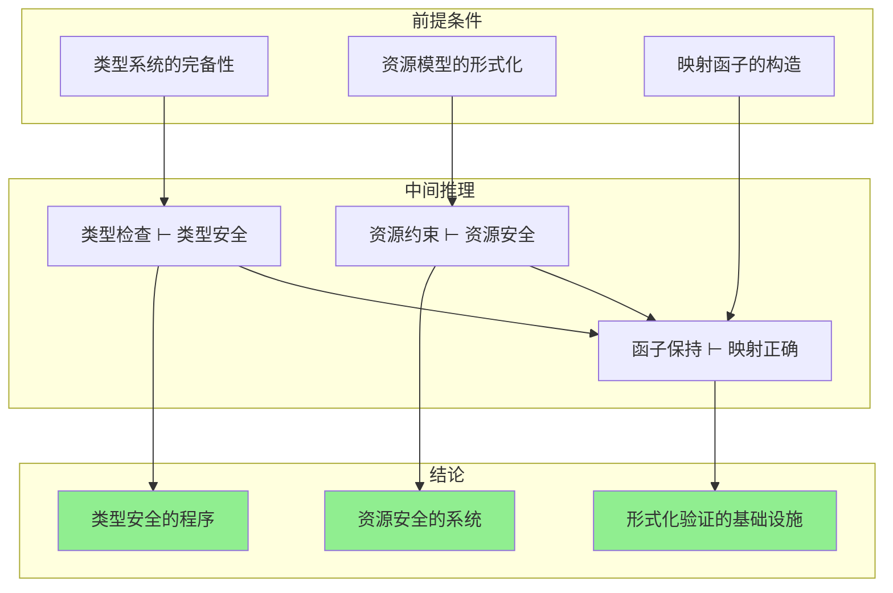
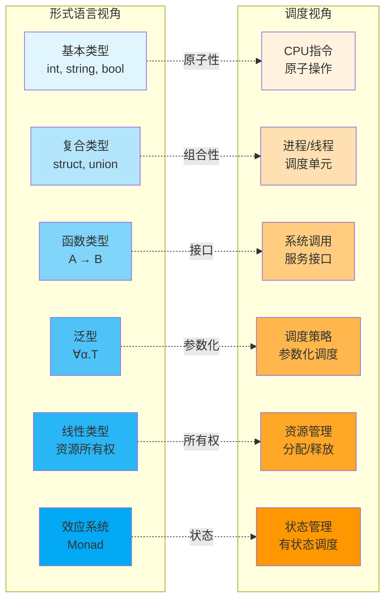
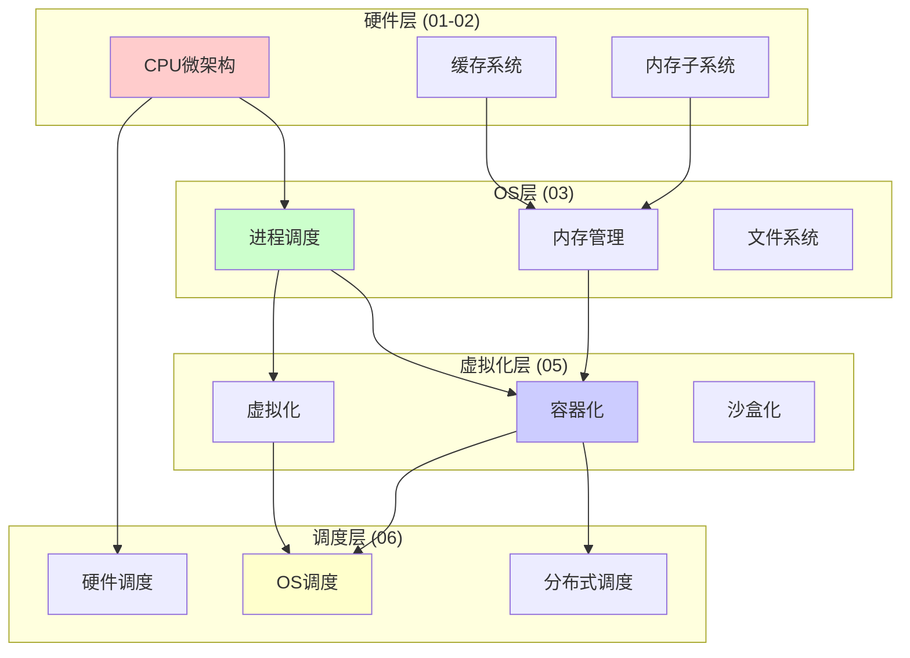
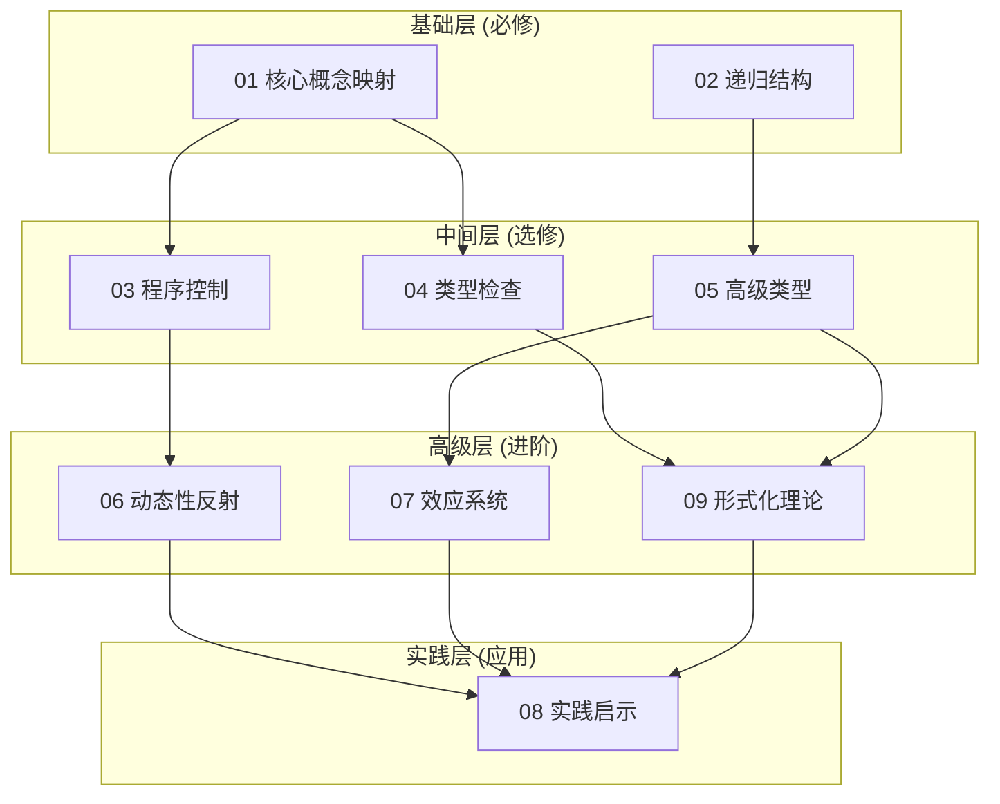
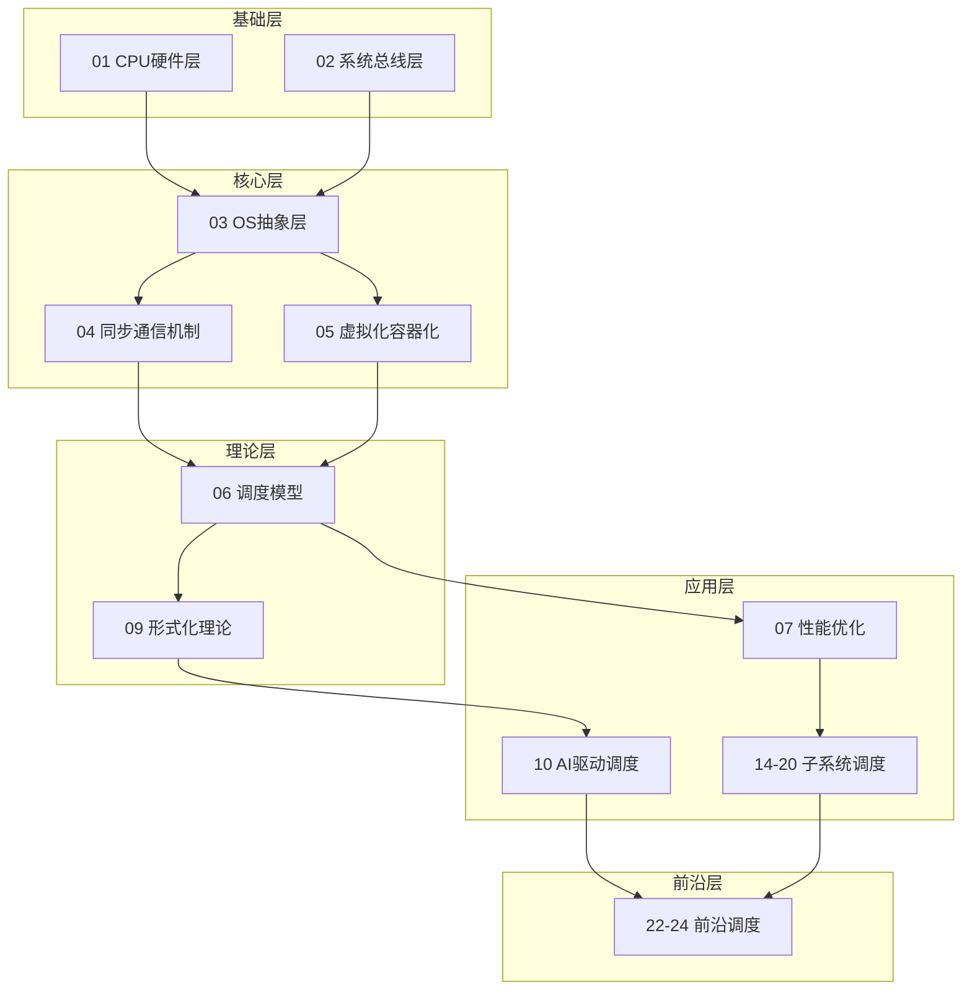
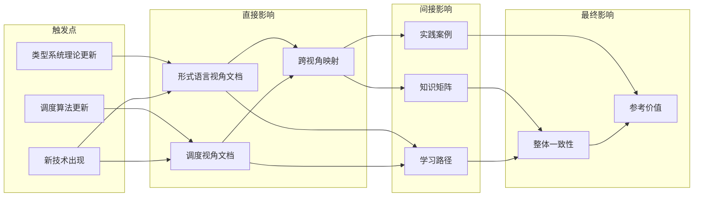
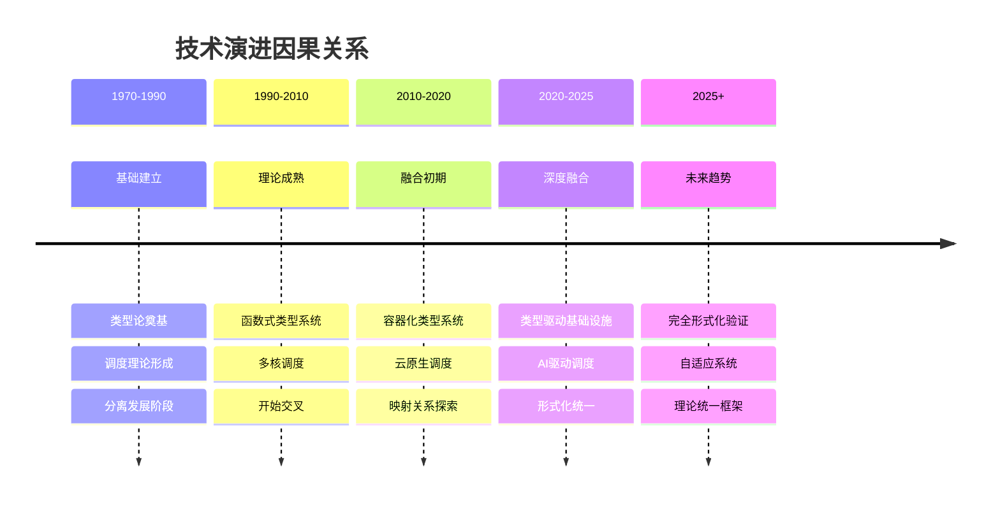
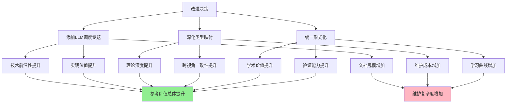

# 跨视角因果关系与关联分析图

> **文档版本**: v1.0
> **创建日期**: 2025-12-02
> **文档性质**: 可视化分析 - 因果关系与关联网络

---

## 1 核心因果关系证明树

### 1.1 类型系统→资源安全 因果链



### 1.2 证明树形式化

```text
                    ┌─────────────────────────────────────┐
                    │      类型-资源安全同构定理            │
                    │  ∀T∈Type. Safe(T) ⟺ Safe(F(T))     │
                    └─────────────────────────────────────┘
                                    ▲
                    ┌───────────────┴───────────────┐
                    │                               │
        ┌───────────┴───────────┐   ┌───────────────┴───────────┐
        │   类型安全保持定理      │   │    资源安全保持定理        │
        │  TypeSafe(T) → ...     │   │   ResourceSafe(R) → ...   │
        └───────────────────────┘   └───────────────────────────┘
                    ▲                               ▲
            ┌───────┴───────┐               ┌──────┴──────┐
            │               │               │             │
    ┌───────┴───┐   ┌───────┴───┐   ┌───────┴───┐   ┌─────┴─────┐
    │ 类型检查   │   │ 类型推断   │   │ 资源分配   │   │ 资源释放   │
    │ 完备性     │   │ 健全性     │   │ 安全性     │   │ 正确性     │
    └───────────┘   └───────────┘   └───────────┘   └───────────┘
```

---

## 2 跨视角概念映射网络

### 2.1 核心概念对应图



### 2.2 详细映射矩阵

```text
形式语言视角           映射关系              调度视角
═══════════════════════════════════════════════════════════

基本类型 (int/string)  ──────▶  CPU指令/原子操作
    │                                │
    │ 类型签名 ↔ 指令编码            │
    │ 类型实例化 ↔ 指令执行          │
    ▼                                ▼

复合类型 (struct)      ──────▶  进程/容器
    │                                │
    │ 乘积类型 ↔ Pod多容器           │
    │ 和类型 ↔ 部署策略              │
    ▼                                ▼

函数类型 (A → B)       ──────▶  系统调用/API
    │                                │
    │ 函数签名 ↔ 接口定义            │
    │ 函数调用 ↔ 服务调用            │
    ▼                                ▼

泛型 (∀α.T)            ──────▶  调度策略
    │                                │
    │ 类型参数 ↔ 策略参数            │
    │ 实例化 ↔ 策略应用              │
    ▼                                ▼

线性类型               ──────▶  资源管理
    │                                │
    │ 所有权 ↔ 资源所有权            │
    │ 借用 ↔ 资源共享                │
    ▼                                ▼

效应系统 (Monad)       ──────▶  状态管理
    │                                │
    │ 纯函数 ↔ 无状态服务            │
    │ 副作用 ↔ 有状态服务            │
```

---

## 3 主题关联强度矩阵

### 3.1 形式语言视角内部关联

```text
          01   02   03   04   05   06   07   08   09
    ┌────────────────────────────────────────────────┐
01  │  ■   ████ ████ ████ ███  ██   ███  ███  ████  │
02  │████   ■   ███  ███  ████ ██   ███  ██   ████  │
03  │████ ███   ■   ████ ███  ████ ███  ████ ███   │
04  │████ ███  ████  ■   ████ ███  ████ ████ █████ │
05  │███  ████ ███  ████  ■   ████ ████ ███  █████ │
06  │██   ██   ████ ███  ████  ■   ████ ███  ███   │
07  │███  ███  ███  ████ ████ ████  ■   ████ ████  │
08  │███  ██   ████ ████ ███  ███  ████  ■   ███   │
09  │████ ████ ███  █████ █████ ███ ████ ███   ■   │
    └────────────────────────────────────────────────┘

    图例: █████ 强关联  ████ 中强  ███ 中等  ██ 弱  ■ 自身
```

### 3.2 调度视角核心主题关联



---

## 4 知识依赖图（学习路径基础）

### 4.1 形式语言视角学习依赖



### 4.2 调度视角学习依赖



---

## 5 因果影响传播图

### 5.1 理论变更影响分析



### 5.2 问题影响范围分析

```text
问题: 跨视角映射深度不足
                    │
    ┌───────────────┼───────────────┐
    │               │               │
    ▼               ▼               ▼
形式语言视角     调度视角      统一框架
影响范围:20%    影响范围:15%  影响范围:60%
    │               │               │
    │               │               │
    ▼               ▼               ▼
需补充:          需补充:        需补充:
- 资源映射       - 类型对应     - 同构定理
- 实例验证       - 验证关联     - 证明完善
```

---

## 6 技术演进因果图

### 6.1 技术演进时间线因果



### 6.2 技术因果链

```text
类型论发展 ──→ 函数式编程 ──→ 容器类型化
    │              │              │
    │              │              ▼
    │              │        Kubernetes类型
    │              │              │
    ▼              ▼              ▼
调度理论 ──→ 操作系统调度 ──→ 云原生调度
    │              │              │
    │              │              ▼
    │              │        AI驱动调度
    │              │              │
    ▼              ▼              ▼
           ╔═══════════════════╗
           ║  类型-调度统一     ║
           ║  形式化框架        ║
           ╚═══════════════════╝
```

---

## 7 决策影响树

### 7.1 改进决策影响分析



---

## 8 总结：核心关联关系

### 8.1 最重要的5个因果关系

| 序号 | 因果关系 | 重要性 | 当前状态 | 改进优先级 |
|-----|---------|--------|---------|-----------|
| 1 | 类型安全 → 资源安全 | ⭐⭐⭐⭐⭐ | 弱映射 | P0 |
| 2 | 函子保持 → 结构一致 | ⭐⭐⭐⭐⭐ | 部分证明 | P1 |
| 3 | 效应系统 → 状态调度 | ⭐⭐⭐⭐ | 概念映射 | P1 |
| 4 | 线性类型 → 资源所有权 | ⭐⭐⭐⭐⭐ | 缺失 | P0 |
| 5 | 依赖类型 → 动态调度 | ⭐⭐⭐⭐ | 浅层 | P2 |

### 8.2 改进后的目标状态

```text
目标：建立完整的类型-调度同构理论

           类型系统
              │
              ▼
    ┌─────────────────┐
    │   满忠实函子 F   │
    │  (完全形式化)    │
    └─────────────────┘
              │
              ▼
         调度系统

定理：
  ∀程序P. TypeSafe(P) ⟺ ScheduleSafe(F(P))

证明：（待完成）
```

---

**文档状态**: ✅ 完成
**相关链接**:

- [全面批判性分析与改进计划](./全面批判性分析与改进计划_2025-12.md)
- [改进任务清单与实施方案](./改进任务清单与实施方案_2025-12.md)
