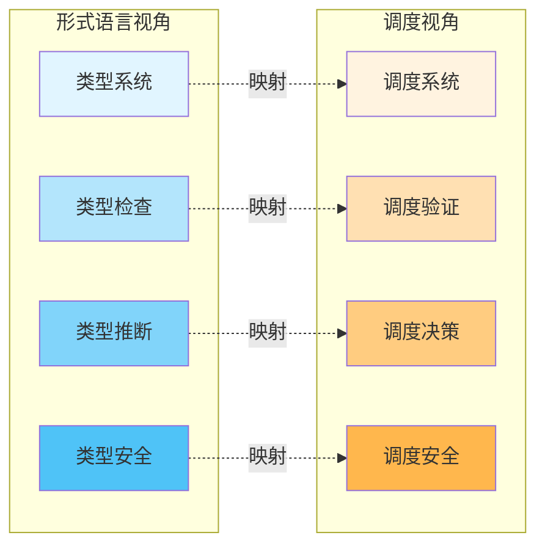
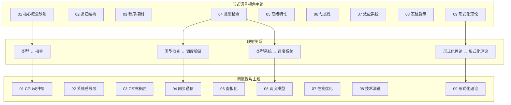
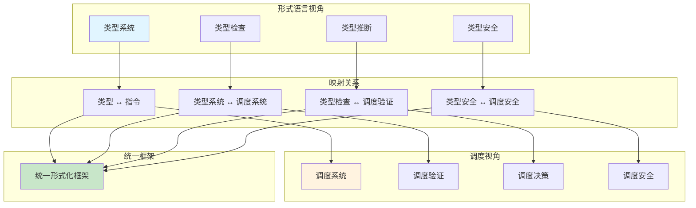
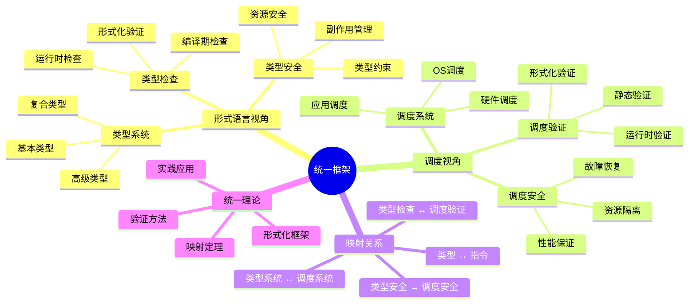

# 跨视角多维知识矩阵：形式语言 vs 调度

> **文档版本**: v1.0
> **创建日期**: 2025-01-XX
> **文档性质**: [可视化] - 跨视角的多维知识矩阵对比
> **目的**: 提供形式语言视角与调度视角的系统化对比分析

---

## 📋 目录

- [跨视角多维知识矩阵：形式语言 vs 调度](#跨视角多维知识矩阵形式语言-vs-调度)
  - [📋 目录](#-目录)
  - [1 概述](#1-概述)
  - [2 核心概念映射矩阵](#2-核心概念映射矩阵)
    - [2.1 类型系统 ↔ 调度系统映射](#21-类型系统--调度系统映射)
    - [2.2 抽象层次对比](#22-抽象层次对比)
    - [2.3 概念对应关系](#23-概念对应关系)
  - [3 主题模块对比矩阵](#3-主题模块对比矩阵)
    - [3.1 主题覆盖范围对比](#31-主题覆盖范围对比)
    - [3.2 主题深度对比](#32-主题深度对比)
    - [3.3 主题关联度对比](#33-主题关联度对比)
  - [4 技术栈映射矩阵](#4-技术栈映射矩阵)
    - [4.1 编程语言 ↔ 硬件架构映射](#41-编程语言--硬件架构映射)
    - [4.2 基础设施 ↔ 操作系统映射](#42-基础设施--操作系统映射)
    - [4.3 工具链对比](#43-工具链对比)
  - [5 形式化程度对比矩阵](#5-形式化程度对比矩阵)
    - [5.1 理论完备性对比](#51-理论完备性对比)
    - [5.2 形式化验证工具对比](#52-形式化验证工具对比)
    - [5.3 数学建模程度对比](#53-数学建模程度对比)
  - [6 实践应用对比矩阵](#6-实践应用对比矩阵)
    - [6.1 应用场景对比](#61-应用场景对比)
    - [6.2 技术成熟度对比](#62-技术成熟度对比)
    - [6.3 学习曲线对比](#63-学习曲线对比)
  - [7 时间维度对比矩阵](#7-时间维度对比矩阵)
    - [7.1 技术演进时间线对比](#71-技术演进时间线对比)
    - [7.2 未来发展趋势对比](#72-未来发展趋势对比)
  - [8 跨视角关联网络](#8-跨视角关联网络)
  - [9 统一框架思维导图](#9-统一框架思维导图)
  - [10 总结](#10-总结)

---

## 1 概述

本文档提供**形式语言视角**与**调度视角**的系统化对比分析，帮助理解：

- **类型系统**与**调度系统**的映射关系
- **两个视角**的互补性和差异性
- **技术栈**的对应关系
- **形式化程度**的对比
- **实践应用**的适用场景

---

## 2 核心概念映射矩阵

### 2.1 类型系统 ↔ 调度系统映射

| 形式语言视角 | 调度视角 | 映射关系 | 映射强度 | 说明 |
|------------|---------|---------|---------|------|
| **基本类型** | CPU指令 | 类型 ↔ 指令 | ⭐⭐⭐ | 原子操作单元 |
| **复合类型** | 指令序列 | 类型组合 ↔ 指令流 | ⭐⭐⭐⭐ | 结构化组合 |
| **类型继承** | 调度层次 | 继承链 ↔ 调度层次 | ⭐⭐⭐⭐⭐ | 层次化抽象 |
| **类型检查** | 调度验证 | 编译期检查 ↔ 调度验证 | ⭐⭐⭐⭐ | 静态验证 |
| **类型推断** | 调度决策 | 类型推导 ↔ 调度算法 | ⭐⭐⭐ | 自动决策 |
| **泛型** | 通用调度 | 类型参数 ↔ 调度策略 | ⭐⭐⭐⭐ | 参数化 |
| **类型类** | 调度接口 | 接口定义 ↔ 调度接口 | ⭐⭐⭐⭐ | 接口抽象 |
| **依赖类型** | 动态调度 | 值依赖 ↔ 动态调整 | ⭐⭐⭐ | 动态性 |
| **线性类型** | 资源管理 | 所有权 ↔ 资源分配 | ⭐⭐⭐⭐⭐ | 资源安全 |
| **效应系统** | 副作用管理 | Monad ↔ 状态管理 | ⭐⭐⭐⭐ | 状态隔离 |
| **反射** | 运行时调度 | 动态类型 ↔ 动态调度 | ⭐⭐⭐ | 动态性 |

### 2.2 抽象层次对比

| 抽象层次 | 形式语言视角 | 调度视角 | 对应关系 |
|---------|------------|---------|---------|
| **L0: 基础层** | 基本类型 | CPU硬件 | 类型 ↔ 指令 |
| **L1: 组合层** | 复合类型 | 指令序列 | 类型组合 ↔ 指令流 |
| **L2: 抽象层** | 类型系统 | OS抽象 | 类型系统 ↔ 调度系统 |
| **L3: 虚拟化层** | 容器类型 | 虚拟化调度 | 容器 ↔ 虚拟机 |
| **L4: 应用层** | 应用类型 | 应用调度 | 应用类型 ↔ 任务调度 |

### 2.3 概念对应关系

---

## 3 主题模块对比矩阵

### 3.1 主题覆盖范围对比

| 主题类别 | 形式语言视角 | 调度视角 | 覆盖范围对比 |
|---------|------------|---------|------------|
| **核心概念** | 3个主题 | 3个主题 | 形式语言更抽象 |
| **系统结构** | 2个主题 | 6个主题 | 调度更详细 |
| **控制机制** | 1个主题 | 1个主题 | 相当 |
| **验证机制** | 1个主题 | 1个主题 | 相当 |
| **高级特性** | 3个主题 | 3个主题 | 相当 |
| **实践应用** | 1个主题 | 13个主题 | 调度更丰富 |
| **形式化理论** | 1个主题 | 1个主题 | 相当 |
| **扩展主题** | 0个主题 | 15个主题 | 调度更全面 |

**总计**: 形式语言视角 9个主题，调度视角 24个主题

### 3.2 主题深度对比

| 主题 | 形式语言视角深度 | 调度视角深度 | 深度对比 |
|------|----------------|------------|---------|
| **核心概念** | ⭐⭐⭐⭐ | ⭐⭐⭐⭐⭐ | 调度更深 |
| **系统结构** | ⭐⭐⭐ | ⭐⭐⭐⭐⭐ | 调度更深 |
| **控制机制** | ⭐⭐⭐⭐ | ⭐⭐⭐⭐ | 相当 |
| **验证机制** | ⭐⭐⭐⭐⭐ | ⭐⭐⭐⭐ | 形式语言更深 |
| **高级特性** | ⭐⭐⭐⭐⭐ | ⭐⭐⭐ | 形式语言更深 |
| **实践应用** | ⭐⭐⭐ | ⭐⭐⭐⭐⭐ | 调度更深 |
| **形式化理论** | ⭐⭐⭐⭐⭐ | ⭐⭐⭐⭐ | 形式语言更深 |

### 3.3 主题关联度对比

---

## 4 技术栈映射矩阵

### 4.1 编程语言 ↔ 硬件架构映射

| 编程语言特性 | 硬件架构特性 | 映射关系 | 映射强度 |
|------------|------------|---------|---------|
| **静态类型** | 指令格式 | 类型约束 ↔ 指令格式 | ⭐⭐⭐⭐ |
| **类型检查** | 指令验证 | 编译期检查 ↔ 硬件验证 | ⭐⭐⭐⭐ |
| **类型推断** | 指令调度 | 自动推导 ↔ 自动调度 | ⭐⭐⭐ |
| **泛型** | 指令模板 | 类型参数 ↔ 指令参数 | ⭐⭐⭐ |
| **类型类** | 指令接口 | 接口定义 ↔ 指令接口 | ⭐⭐⭐⭐ |
| **依赖类型** | 动态指令 | 值依赖 ↔ 动态指令 | ⭐⭐⭐ |
| **线性类型** | 资源管理 | 所有权 ↔ 资源分配 | ⭐⭐⭐⭐⭐ |
| **效应系统** | 状态管理 | Monad ↔ 状态机 | ⭐⭐⭐⭐ |

### 4.2 基础设施 ↔ 操作系统映射

| 基础设施概念 | 操作系统概念 | 映射关系 | 映射强度 |
|------------|------------|---------|---------|
| **容器镜像** | 进程镜像 | 镜像 ↔ 进程 | ⭐⭐⭐⭐ |
| **容器运行时** | 进程调度 | 运行时 ↔ 调度器 | ⭐⭐⭐⭐⭐ |
| **Pod** | 进程组 | Pod ↔ 进程组 | ⭐⭐⭐⭐⭐ |
| **Deployment** | 进程管理 | Deployment ↔ 进程管理 | ⭐⭐⭐⭐ |
| **Service** | 网络服务 | Service ↔ 网络服务 | ⭐⭐⭐⭐⭐ |
| **Namespace** | 命名空间 | Namespace ↔ 命名空间 | ⭐⭐⭐⭐⭐ |
| **ResourceQuota** | 资源限制 | Quota ↔ 资源限制 | ⭐⭐⭐⭐⭐ |
| **HPA** | 动态调整 | HPA ↔ 动态调度 | ⭐⭐⭐⭐ |

### 4.3 工具链对比

| 工具类型 | 形式语言视角工具 | 调度视角工具 | 对应关系 |
|---------|----------------|------------|---------|
| **类型检查** | CUE, OPA | 静态分析工具 | 类型检查 ↔ 静态分析 |
| **形式化验证** | TLA+, Coq | 模型检查工具 | 形式化验证 ↔ 模型检查 |
| **运行时验证** | K8s API | 运行时监控 | 运行时验证 ↔ 运行时监控 |
| **可视化** | Mermaid, Graphviz | 性能分析工具 | 可视化 ↔ 性能分析 |
| **配置管理** | Helm, Kustomize | 系统配置工具 | 配置管理 ↔ 系统配置 |

---

## 5 形式化程度对比矩阵

### 5.1 理论完备性对比

| 理论维度 | 形式语言视角 | 调度视角 | 完备性对比 |
|---------|------------|---------|-----------|
| **基础理论** | ⭐⭐⭐⭐⭐ | ⭐⭐⭐⭐ | 形式语言更完备 |
| **映射理论** | ⭐⭐⭐⭐⭐ | ⭐⭐⭐⭐ | 形式语言更完备 |
| **验证理论** | ⭐⭐⭐⭐⭐ | ⭐⭐⭐⭐ | 形式语言更完备 |
| **实践理论** | ⭐⭐⭐ | ⭐⭐⭐⭐⭐ | 调度更完备 |
| **形式化证明** | ⭐⭐⭐⭐⭐ | ⭐⭐⭐⭐ | 形式语言更完备 |

### 5.2 形式化验证工具对比

| 验证工具 | 形式语言视角应用 | 调度视角应用 | 适用性对比 |
|---------|----------------|------------|-----------|
| **CUE** | ⭐⭐⭐⭐⭐ | ⭐⭐⭐ | 形式语言更适用 |
| **OPA** | ⭐⭐⭐⭐ | ⭐⭐⭐⭐ | 相当 |
| **TLA+** | ⭐⭐⭐⭐ | ⭐⭐⭐⭐⭐ | 调度更适用 |
| **Coq** | ⭐⭐⭐⭐⭐ | ⭐⭐⭐ | 形式语言更适用 |
| **Agda** | ⭐⭐⭐⭐⭐ | ⭐⭐ | 形式语言更适用 |
| **Lean4** | ⭐⭐⭐⭐⭐ | ⭐⭐⭐ | 形式语言更适用 |

### 5.3 数学建模程度对比

| 数学工具 | 形式语言视角 | 调度视角 | 建模深度 |
|---------|------------|---------|---------|
| **范畴论** | ⭐⭐⭐⭐⭐ | ⭐⭐⭐ | 形式语言更深 |
| **类型论** | ⭐⭐⭐⭐⭐ | ⭐⭐ | 形式语言更深 |
| **逻辑学** | ⭐⭐⭐⭐⭐ | ⭐⭐⭐⭐ | 形式语言更深 |
| **图论** | ⭐⭐⭐ | ⭐⭐⭐⭐⭐ | 调度更深 |
| **优化理论** | ⭐⭐⭐ | ⭐⭐⭐⭐⭐ | 调度更深 |
| **博弈论** | ⭐⭐ | ⭐⭐⭐⭐ | 调度更深 |

---

## 6 实践应用对比矩阵

### 6.1 应用场景对比

| 应用场景 | 形式语言视角适用性 | 调度视角适用性 | 推荐视角 |
|---------|------------------|--------------|---------|
| **系统设计** | ⭐⭐⭐⭐⭐ | ⭐⭐⭐⭐ | 形式语言 |
| **配置管理** | ⭐⭐⭐⭐⭐ | ⭐⭐⭐ | 形式语言 |
| **类型安全** | ⭐⭐⭐⭐⭐ | ⭐⭐ | 形式语言 |
| **性能优化** | ⭐⭐⭐ | ⭐⭐⭐⭐⭐ | 调度 |
| **资源管理** | ⭐⭐⭐⭐ | ⭐⭐⭐⭐⭐ | 调度 |
| **系统调优** | ⭐⭐ | ⭐⭐⭐⭐⭐ | 调度 |
| **故障诊断** | ⭐⭐⭐ | ⭐⭐⭐⭐⭐ | 调度 |
| **容量规划** | ⭐⭐⭐ | ⭐⭐⭐⭐⭐ | 调度 |

### 6.2 技术成熟度对比

| 技术领域 | 形式语言视角成熟度 | 调度视角成熟度 | 成熟度对比 |
|---------|------------------|--------------|-----------|
| **类型系统** | ⭐⭐⭐⭐⭐ | ⭐⭐⭐ | 形式语言更成熟 |
| **容器技术** | ⭐⭐⭐⭐⭐ | ⭐⭐⭐⭐⭐ | 相当 |
| **编排系统** | ⭐⭐⭐⭐ | ⭐⭐⭐⭐⭐ | 调度更成熟 |
| **形式化验证** | ⭐⭐⭐⭐ | ⭐⭐⭐ | 形式语言更成熟 |
| **性能优化** | ⭐⭐⭐ | ⭐⭐⭐⭐⭐ | 调度更成熟 |
| **系统监控** | ⭐⭐⭐ | ⭐⭐⭐⭐⭐ | 调度更成熟 |

### 6.3 学习曲线对比

| 学习阶段 | 形式语言视角难度 | 调度视角难度 | 难度对比 |
|---------|----------------|------------|---------|
| **入门** | ⭐⭐⭐ | ⭐⭐⭐⭐ | 调度更难 |
| **进阶** | ⭐⭐⭐⭐ | ⭐⭐⭐⭐ | 相当 |
| **高级** | ⭐⭐⭐⭐⭐ | ⭐⭐⭐⭐ | 形式语言更难 |
| **专家** | ⭐⭐⭐⭐⭐ | ⭐⭐⭐⭐⭐ | 相当 |

---

## 7 时间维度对比矩阵

### 7.1 技术演进时间线对比

| 年代 | 形式语言视角发展 | 调度视角发展 | 对应关系 |
|------|----------------|------------|---------|
| **1970s** | C语言基本类型 | 单核CPU调度 | 基础映射 |
| **1980s** | 面向对象类型 | 多任务调度 | 抽象层次 |
| **1990s** | 泛型编程 | 多核调度 | 参数化 |
| **2000s** | 函数式类型 | 虚拟化调度 | 高阶抽象 |
| **2010s** | 依赖类型 | 容器调度 | 动态性 |
| **2020s** | 线性类型 | 云原生调度 | 资源安全 |
| **2025** | WASM Component | AI驱动调度 | 智能系统 |

### 7.2 未来发展趋势对比

| 趋势 | 形式语言视角 | 调度视角 | 趋势对比 |
|------|------------|---------|---------|
| **智能化** | ⭐⭐⭐ | ⭐⭐⭐⭐⭐ | 调度更智能 |
| **形式化** | ⭐⭐⭐⭐⭐ | ⭐⭐⭐⭐ | 形式语言更形式化 |
| **自动化** | ⭐⭐⭐⭐ | ⭐⭐⭐⭐⭐ | 调度更自动化 |
| **统一化** | ⭐⭐⭐⭐⭐ | ⭐⭐⭐⭐ | 形式语言更统一 |
| **性能优化** | ⭐⭐⭐ | ⭐⭐⭐⭐⭐ | 调度更优化 |

---

## 8 跨视角关联网络

---

## 9 统一框架思维导图

---

## 10 总结

本文档提供了**形式语言视角**与**调度视角**的系统化对比分析，包括：

✅ **核心概念映射矩阵** - 类型系统与调度系统的对应关系
✅ **主题模块对比矩阵** - 两个视角的主题覆盖和深度对比
✅ **技术栈映射矩阵** - 编程语言与硬件架构的映射关系
✅ **形式化程度对比矩阵** - 理论完备性和形式化验证工具对比
✅ **实践应用对比矩阵** - 应用场景和技术成熟度对比
✅ **时间维度对比矩阵** - 技术演进和未来发展趋势对比
✅ **跨视角关联网络** - 两个视角的统一框架

**关键洞察**：

1. **互补性**: 形式语言视角更注重**理论完备性**和**类型安全**，调度视角更注重**实践应用**和**性能优化**
2. **映射关系**: 类型系统与调度系统存在**深层次的映射关系**，可以统一在形式化框架下
3. **应用场景**: 系统设计适合形式语言视角，性能优化适合调度视角
4. **发展趋势**: 两个视角都在向**智能化**和**自动化**方向发展

**下一步**：

- 查看 [形式语言视角思维导图](../formal_lang_view/思维导图与知识矩阵.md)
- 查看 [调度视角思维导图](../schedule_formal_view/思维导图与知识矩阵.md)
- 探索两个视角的统一框架

---

**返回**: [Composed目录](../README.md) | [Concept目录](../../Concept/README.md)
