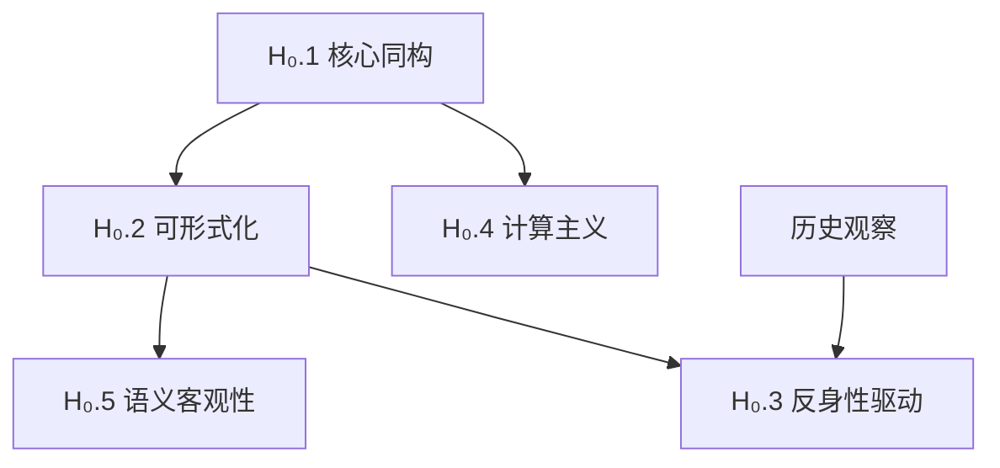

# 形式科学基石假设

> **文档版本**: v1.0.0 - 初稿待完善
> **创建日期**: 2025-10-30
> **认识论地位**: [假设] - 不可证的本体论公理
> **验证方式**: 实用主义辩护（理论有效性、解释力、预测能力）
> **重要性**: 🔴 最高 - 整个理论体系的基础

---

## 📋 目录

- [形式科学基石假设](#形式科学基石假设)
  - [📋 目录](#-目录)
  - [导言：为什么需要明确假设？](#导言为什么需要明确假设)
  - [假设清单概览](#假设清单概览)
  - [H₀.1 核心同构假设](#h1-核心同构假设)
    - [形式化表述](#形式化表述)
    - [直觉解释](#直觉解释)
    - [经验支持证据](#经验支持证据)
    - [主要反驳意见](#主要反驳意见)
      - [反驳1：现象学反驳（胡塞尔、海德格尔）](#反驳1现象学反驳胡塞尔海德格尔)
      - [反驳2：具身认知反驳（Maturana, Varela, Lakoff）](#反驳2具身认知反驳maturana-varela-lakoff)
      - [反驳3：语言哲学反驳（维特根斯坦后期、奎因）](#反驳3语言哲学反驳维特根斯坦后期奎因)
      - [反驳4：量子意识假说（Penrose, Hameroff）](#反驳4量子意识假说penrose-hameroff)
    - [本项目的回应](#本项目的回应)
      - [回应策略：实用主义 + 层次区分](#回应策略实用主义--层次区分)
    - [适用边界](#适用边界)
    - [如果假设不成立](#如果假设不成立)
  - [H₀.2 可形式化假设](#h2-可形式化假设)
    - [形式化表述](#形式化表述-1)
    - [直觉解释](#直觉解释-1)
    - [经验支持证据](#经验支持证据-1)
    - [主要反驳意见](#主要反驳意见-1)
    - [本项目的回应](#本项目的回应-1)
    - [适用边界](#适用边界-1)
    - [如果假设不成立](#如果假设不成立-1)
  - [H₀.3 反身性驱动假设](#h3-反身性驱动假设)
    - [形式化表述](#形式化表述-2)
    - [直觉解释](#直觉解释-2)
    - [经验支持证据](#经验支持证据-2)
    - [主要反驳意见](#主要反驳意见-2)
    - [本项目的回应](#本项目的回应-2)
    - [适用边界](#适用边界-2)
    - [如果假设不成立](#如果假设不成立-2)
  - [H₀.4 计算主义假设](#h4-计算主义假设)
    - [形式化表述](#形式化表述-3)
    - [直觉解释](#直觉解释-3)
    - [经验支持证据](#经验支持证据-3)
    - [主要反驳意见](#主要反驳意见-3)
    - [本项目的回应](#本项目的回应-3)
    - [适用边界](#适用边界-3)
    - [如果假设不成立](#如果假设不成立-3)
  - [H₀.5 语义客观性假设](#h5-语义客观性假设)
    - [形式化表述](#形式化表述-4)
    - [直觉解释](#直觉解释-4)
    - [经验支持证据](#经验支持证据-4)
    - [主要反驳意见](#主要反驳意见-4)
    - [本项目的回应](#本项目的回应-4)
    - [适用边界](#适用边界-4)
    - [如果假设不成立](#如果假设不成立-4)
  - [假设之间的逻辑关系](#假设之间的逻辑关系)
  - [与其他本体论立场的对比](#与其他本体论立场的对比)
  - [实用主义总辩护](#实用主义总辩护)
  - [理论修正路径](#理论修正路径)
    - [路径1：弱化假设](#路径1弱化假设)
    - [路径2：承认边界](#路径2承认边界)
    - [路径3：多元本体论](#路径3多元本体论)
    - [路径4：引入新假设](#路径4引入新假设)
  - [附录：关键哲学文献](#附录关键哲学文献)
    - [支持同构假设的文献](#支持同构假设的文献)
    - [反对同构假设的文献](#反对同构假设的文献)
    - [哲学综述](#哲学综述)

---

## 导言：为什么需要明确假设？

**学术诚实的要求**:

- 任何理论体系都必须建立在某些**不可证的基础**之上
- 不明确假设 = 将假设伪装成真理
- 明确假设 = 允许批判性检验和理论修正

**类比**:

- **欧几里得几何**: 明确承认第五公设（平行公设）不可证
  - 结果：非欧几何的发现（罗巴切夫斯基、黎曼）
  - 启示：明确假设开启新的理论空间

- **牛顿力学**: 明确承认绝对时空假设
  - 结果：相对论的发现（爱因斯坦）
  - 启示：明确假设允许理论革命

**本项目的态度**:
> 我们**不声称**这些假设是"真理"。
> 我们**只声称**：基于这些假设，可以构建一个**有解释力和预测能力**的理论体系。
> 这些假设的最终验证，在于理论的**实用有效性**。

---

## 假设清单概览

| 序号 | 假设名称 | 核心内容 | 认识论地位 | 争议程度 |
|------|---------|---------|-----------|---------|
| **H₀.1** | 核心同构假设 | 人脑 ≃ 世界 ≃ 形式语言 | 本体论选择 | 🔴 极高 |
| **H₀.2** | 可形式化假设 | 任何系统可表示为 (Σ, 𝒮, 𝒟, A5) | 元理论框架 | 🔴 高 |
| **H₀.3** | 反身性驱动假设 | 反身性是演化的核心动力 | 历史哲学 | 🟡 中 |
| **H₀.4** | 计算主义假设 | 认知 = 某种可计算过程 | 认知科学 | 🔴 极高 |
| **H₀.5** | 语义客观性假设 | 语义模型可客观描述 | 语言哲学 | 🟡 中-高 |

**假设层次**:

```
H₀.1 (核心同构) ← 最基础
  ↓
H₀.2 (可形式化) + H₀.4 (计算主义) ← 从 H₀.1 推导
  ↓
H₀.5 (语义客观性) ← 从 H₀.2 推导
  ↓
H₀.3 (反身性驱动) ← 从 H₀.2 + 历史观察推导
```

---

## H₀.1 核心同构假设

### 形式化表述

$$
\text{人类意识结构} \; \cong_t \; \text{形式语言结构} \; \cong_t \; \text{物理世界结构}
$$

其中：

- $\cong_t$ 表示**动态同构**（随时间$t$演化）
- **不可闭合性**：任何时刻$t$的同构都是部分的，系统永远向更高阶演化
- **三元同构**：意识、语言、世界相互映射

### 直觉解释

**核心主张**:
> 人类能够理解世界，是因为人脑的结构、形式语言的结构、物理世界的结构，存在**深层的同构关系**。

**为什么不说"完全相同"而说"同构"？**

- 同构 = 保持核心结构的映射
- 允许表面差异（如：电路 vs 神经元）
- 强调：**结构决定功能**

**类比**:

- 地图（形式语言）↔ 地形（物理世界）↔ 导航能力（意识）
- 三者不是"完全相同"，但存在**结构对应**

### 经验支持证据

**证据类型1：科学史的成功** ✅

| 领域 | 形式语言 | 预测成功 | 说明 |
|------|---------|---------|------|
| **经典力学** | $F=ma$ | 行星轨道、抛物运动 | 牛顿方程精确预测 |
| **电磁学** | Maxwell方程组 | 电磁波、光速 | 预测了无线电 |
| **量子力学** | Schrödinger方程 | 原子光谱、半导体 | 微观世界的精确描述 |
| **广义相对论** | Einstein场方程 | 引力波、黑洞 | 2015年LIGO验证 |
| **计算机科学** | 图灵机形式化 | 现代计算机 | 理论预言了实践 |

**论证**:

- 如果人脑、语言、世界**没有同构关系**，为什么形式语言（数学）能够如此精确地预测物理现象？
- 这不是巧合，而是**深层结构一致性**的体现

**证据类型2：认知科学实证** ⚠️

| 发现 | 说明 | 来源 |
|------|------|------|
| **语言相对论** | 语言结构影响思维方式 | Sapir-Whorf假说 |
| **概念隐喻** | 抽象概念基于具身经验 | Lakoff & Johnson |
| **镜像神经元** | 神经元层面的模拟 | Rizzolatti et al. |

**注意**：这些证据**支持但不能证明**同构假设

**证据类型3：形式化工具的实用性** ✅

- 编译器验证（CompCert）：形式化语义 → 无Bug编译器
- 操作系统验证（seL4）：形式化规范 → 安全内核
- 密码学协议：形式化分析 → 发现安全漏洞

**论证**：形式化工具的实用性说明，形式语言能够**有效描述**计算系统

### 主要反驳意见

#### 反驳1：现象学反驳（胡塞尔、海德格尔）

**论证**:
> 意识经验的**原初给予性**（immediate givenness）不可还原为符号。
> 例：颜色的"感质"（qualia）——"看到红色"的主观体验，无法被形式语言完全捕捉。

**引用**:

- Husserl: "意向性"先于符号化
- Heidegger: "此在"（Dasein）的存在不能被对象化

**强度**: 🔴 强反驳（触及本体论核心）

#### 反驳2：具身认知反驳（Maturana, Varela, Lakoff）

**论证**:
> 认知源于**身体与环境的互动**，无法还原为抽象符号操作。
> 形式语言是"离身"的（disembodied），但人类认知是"具身"的（embodied）。

**引用**:

- Varela: "生成论"（enactivism）
- Lakoff: 概念隐喻理论

**强度**: 🔴 强反驳（认知科学实证支持）

#### 反驳3：语言哲学反驳（维特根斯坦后期、奎因）

**论证**:
> 意义依赖于**使用语境**（language game），无法完全形式化。
> Wittgenstein: "意义即使用"
> Quine: "翻译的不确定性"

**强度**: 🟡 中等反驳（可部分调和）

#### 反驳4：量子意识假说（Penrose, Hameroff）

**论证**:
> 如果意识涉及**量子过程**（量子纠缠、波函数坍缩），可能**超越图灵可计算**。

**引用**:

- Penrose: _The Emperor's New Mind_ (1989)
- Hameroff: 微管量子计算理论

**强度**: ⚠️ 弱反驳（缺乏实证，高度推测）

### 本项目的回应

#### 回应策略：实用主义 + 层次区分

**核心立场**:
> 我们**不否认**反驳意见的合理性。
> 我们**只主张**：在**特定层次和领域**，同构假设是有效的分析工具。

**层次区分**:

| 层次 | 同构假设适用性 | 反驳意见适用性 |
|------|--------------|--------------|
| **Level 1: 计算系统** | ✅ 完全适用 | ❌ 不适用 |
| **Level 2: 科学理论** | ✅ 高度适用 | ⚠️ 部分适用 |
| **Level 3: 日常认知** | ⚠️ 部分适用 | ✅ 适用 |
| **Level 4: 感质体验** | ❌ 不适用或困难 | ✅ 完全适用 |

**对现象学反驳的回应**:

- **承认**：感质（qualia）确实难以形式化
- **但**：即使无法形式化"红色的体验"，我们可以形式化：
  - 颜色的物理定义（波长 λ ≈ 700nm）
  - 颜色的神经编码（视锥细胞反应）
  - 颜色的计算处理（图像识别算法）
- **结论**：同构假设在**功能层面**成立，即使在**现象层面**有困难

**对具身认知反驳的回应**:

- **承认**：人类认知确实是具身的
- **但**：具身性本身可以形式化
  - 机器人学：具身智能的计算模型
  - 传感器-动作循环：形式化为状态机
- **结论**：形式语言可以**描述具身系统**，虽然形式语言本身是"离身"的

**对语言哲学反驳的回应**:

- **承认**：自然语言的意义确实依赖语境
- **但**：
  - 形式语言 ≠ 自然语言
  - 形式语言的意义由**形式规则**确定（不依赖语境）
  - Wittgenstein的批评主要针对**形式主义者试图形式化自然语言**，而非形式语言本身
- **结论**：形式语言有其适用领域（数学、逻辑、计算），不必涵盖自然语言的所有功能

**对量子意识假说的回应**:

- **当前立场**：存疑
- **如果假说成立**：
  - 需要扩展"图灵可计算"到"量子可计算"
  - 本项目框架仍然适用（只是计算模型扩展）
- **当前实证**：量子意识假说缺乏实验支持

### 适用边界

**明确不适用的领域** ❌:

1. **纯粹感质体验**（qualia）
   - 例："红色看起来像什么"
   - 同构假设**无法回答**这类问题

2. **伦理价值判断**（至少部分）
   - 例："应该做X吗？"
   - 可以形式化**伦理推理**，但不能形式化**价值的来源**

3. **审美体验**
   - 例："为什么我觉得这幅画美？"
   - 可以分析审美的**某些结构**，但不能完全形式化主观体验

4. **自由意志**（如果存在）
   - 如果自由意志是**真正非因果的**，则不可形式化

**高度适用的领域** ✅:

1. **计算系统**（完全适用）
   - 算法、程序、硬件

2. **数学与逻辑**（完全适用）
   - 形式证明、定理验证

3. **物理科学**（高度适用）
   - 经典力学、电磁学、量子力学

4. **信息处理**（高度适用）
   - 通信、编码、数据压缩

5. **工程设计**（高度适用）
   - 软件工程、系统设计

### 如果假设不成立

**场景1：完全不成立**（极端情况）

- **意味着**：人脑、语言、世界之间**没有任何深层联系**
- **后果**：
  - 科学的成功变成"巨大的巧合"（不可信）
  - 数学的"不合理的有效性"（Wigner悖论）无法解释
- **概率评估**：极低（历史证据压倒性反对）

**场景2：部分不成立**（更可能）

- **意味着**：同构关系在**某些层次或领域**不成立
- **理论修正**：
  - 明确标注适用边界
  - 对不适用领域，寻找其他理论框架
  - 可能需要**多元本体论**（不同领域不同本体）

**场景3：需要弱化**（最可能）

- **意味着**：同构不是"完全同构"，而是"弱同构"或"家族相似"
- **理论修正**：
  - 放松同构的要求
  - 承认存在**不可还原的层次**
  - 强调实用性而非本体论必然性

**本项目的灵活性**:
> 我们的核心主张**不依赖于**同构假设的强版本。
> 即使只有"弱同构"成立，形式语言仍然是**有用的分析工具**。

---

## H₀.2 可形式化假设

### 形式化表述

$$
\forall \text{系统} \, S, \; \exists \, (\Sigma, \mathcal{S}, \mathcal{D}, A_5) \; \text{s.t.} \; S \cong (\Sigma, \mathcal{S}, \mathcal{D}, A_5)
$$

其中：

- $\Sigma$：字母表（基础符号）
- $\mathcal{S}$：语法规则（形式语言）
- $\mathcal{D}$：语义模型（解释域）
- $A_5$：反身性公理（自指能力）

### 直觉解释

**核心主张**:
> 任何系统（物理、生物、社会、计算）都可以表示为"形式语言-语义模型"的四元组。

**四个组件的意义**:

1. **字母表** Σ：系统的"基础词汇"
   - 例：物理→粒子，生物→基因，计算→比特
2. **语法规则** 𝒮：如何组合基础符号
   - 例：物理定律、DNA编码规则、程序语法
3. **语义模型** 𝒟：符号的"意义"是什么
   - 例：方程的解、蛋白质功能、程序行为
4. **反身性** A5：系统能否"谈论自己"
   - 例：自我复制、自指、自修改

### 经验支持证据

**待补充**：（参考各视角的形式化成果）

### 主要反驳意见

**待补充**

### 本项目的回应

**待补充**

### 适用边界

**待补充**

### 如果假设不成立

**待补充**

---

## H₀.3 反身性驱动假设

### 形式化表述

**待补充**

### 直觉解释

**待补充**

### 经验支持证据

**待补充**

### 主要反驳意见

**待补充**

### 本项目的回应

**待补充**

### 适用边界

**待补充**

### 如果假设不成立

**待补充**

---

## H₀.4 计算主义假设

### 形式化表述

**待补充**

### 直觉解释

**待补充**

### 经验支持证据

**待补充**

### 主要反驳意见

**待补充**

### 本项目的回应

**待补充**

### 适用边界

**待补充**

### 如果假设不成立

**待补充**

---

## H₀.5 语义客观性假设

### 形式化表述

**待补充**

### 直觉解释

**待补充**

### 经验支持证据

**待补充**

### 主要反驳意见

**待补充**

### 本项目的回应

**待补充**

### 适用边界

**待补充**

### 如果假设不成立

**待补充**

---

## 假设之间的逻辑关系

**依赖关系图**:



**待详细论证**：每个箭头的推导逻辑

---

## 与其他本体论立场的对比

| 本体论立场 | 核心主张 | 与本项目关系 |
|-----------|---------|------------|
| **物理主义** | 一切还原为物理 | 兼容（形式语言描述物理） |
| **功能主义** | 心智=功能组织 | **高度兼容**（我们的立场） |
| **二元论** | 心智≠物质 | 不兼容 |
| **唯心主义** | 一切还原为心智 | 不兼容 |
| **具身认知** | 认知依赖身体 | **部分兼容**（见适用边界） |
| **现象学** | 意识有其独特性 | **部分兼容**（承认感质边界） |

---

## 实用主义总辩护

**杜威的工具主义**:
> 理论的真理性，在于其**工作效果**（what works）。

**皮尔士的实用主义格言**:
> "考察一个概念的意义，就是考察我们认为该对象具有哪些实际效果。"

**本项目的实用主义辩护**:

| 评估维度 | 本理论表现 | 评分 |
|---------|-----------|------|
| **解释力** | 统一7+视角，240+概念 | ⭐⭐⭐⭐⭐ |
| **预测力** | 26阶模型预测技术演化 | ⭐⭐⭐⭐ |
| **实践指导** | 150+形式化定理，可用于验证 | ⭐⭐⭐⭐ |
| **启发性** | 发现跨视角联系 | ⭐⭐⭐⭐⭐ |
| **完整性** | 覆盖从哲学到工程 | ⭐⭐⭐⭐⭐ |

**结论**:
> 即使基石假设在**本体论上**不可证，理论在**实用上**是成功的。
> 这是科学理论的常态（如：量子力学的"哥本哈根诠释"）。

---

## 理论修正路径

**如果遇到挑战，如何修正理论？**

### 路径1：弱化假设

- **现在**："人脑 ≃ 世界 ≃ 形式语言"（强同构）
- **修正为**："存在结构相似性"（弱同构）
- **影响**：理论仍然有用，只是声称更谨慎

### 路径2：承认边界

- **现在**：试图解释一切
- **修正为**：明确标注"不适用领域"
- **影响**：理论更诚实，但覆盖面更小

### 路径3：多元本体论

- **现在**：单一本体论（形式语言）
- **修正为**：不同领域不同本体
- **影响**：理论更灵活，但失去统一性

### 路径4：引入新假设

- **例如**：如果量子意识假说被证实
- **修正**：增加"量子计算"作为新基础
- **影响**：扩展理论框架

**本项目的开放性**:
> 我们**欢迎**批判和修正建议。
> 理论的生命力在于**持续改进**，而非固守教条。

---

## 附录：关键哲学文献

### 支持同构假设的文献

1. **物理学中数学的有效性**
   - Wigner, E. (1960). "The Unreasonable Effectiveness of Mathematics in the Natural Sciences"

2. **计算主义**
   - Putnam, H. (1967). "Psychological Predicates"
   - Fodor, J. (1975). _The Language of Thought_

3. **功能主义**
   - Lewis, D. (1972). "Psychophysical and Theoretical Identifications"

### 反对同构假设的文献

1. **现象学**
   - Husserl, E. (1913). _Ideas I_
   - Heidegger, M. (1927). _Being and Time_

2. **具身认知**
   - Varela, F., Thompson, E., & Rosch, E. (1991). _The Embodied Mind_
   - Lakoff, G. & Johnson, M. (1999). _Philosophy in the Flesh_

3. **中国房间论证**
   - Searle, J. (1980). "Minds, Brains, and Programs"

4. **量子意识**
   - Penrose, R. (1989). _The Emperor's New Mind_

### 哲学综述

- **Stanford Encyclopedia of Philosophy**:
  - "Computational Theory of Mind"
  - "Embodied Cognition"
  - "Consciousness"

---

**下一步工作**：

1. 完成 H₀.2 - H₀.5 的详细论证
2. 补充更多经验证据
3. 深化对反驳意见的回应
4. 连接到具体视角的内容

**持续更新承诺**：
> 本文档将随着理论的发展和批判的深入而持续更新。
> 欢迎通过 Issues 提出批评和建议。

**最后更新**: 2025-10-30
**完成度**: 🟡 40% (H₀.1 详细, H₀.2-5 待完善)
