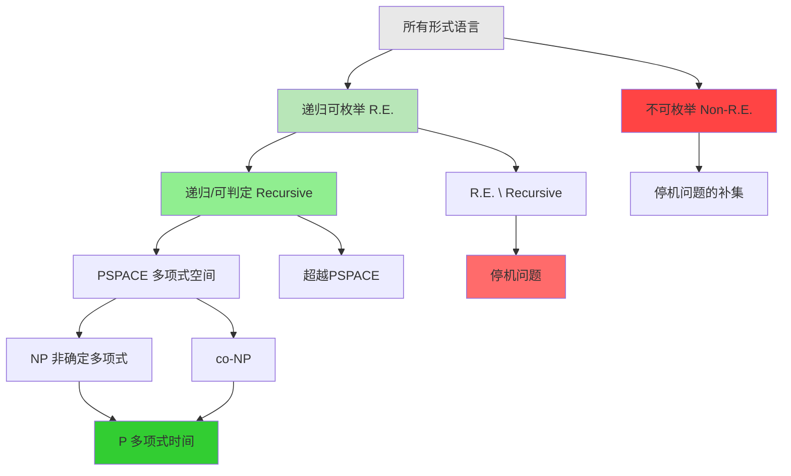
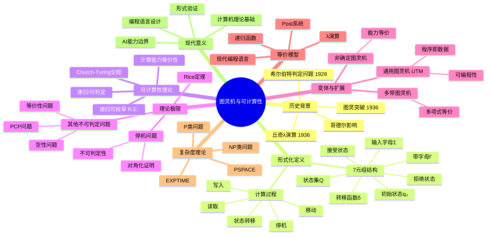
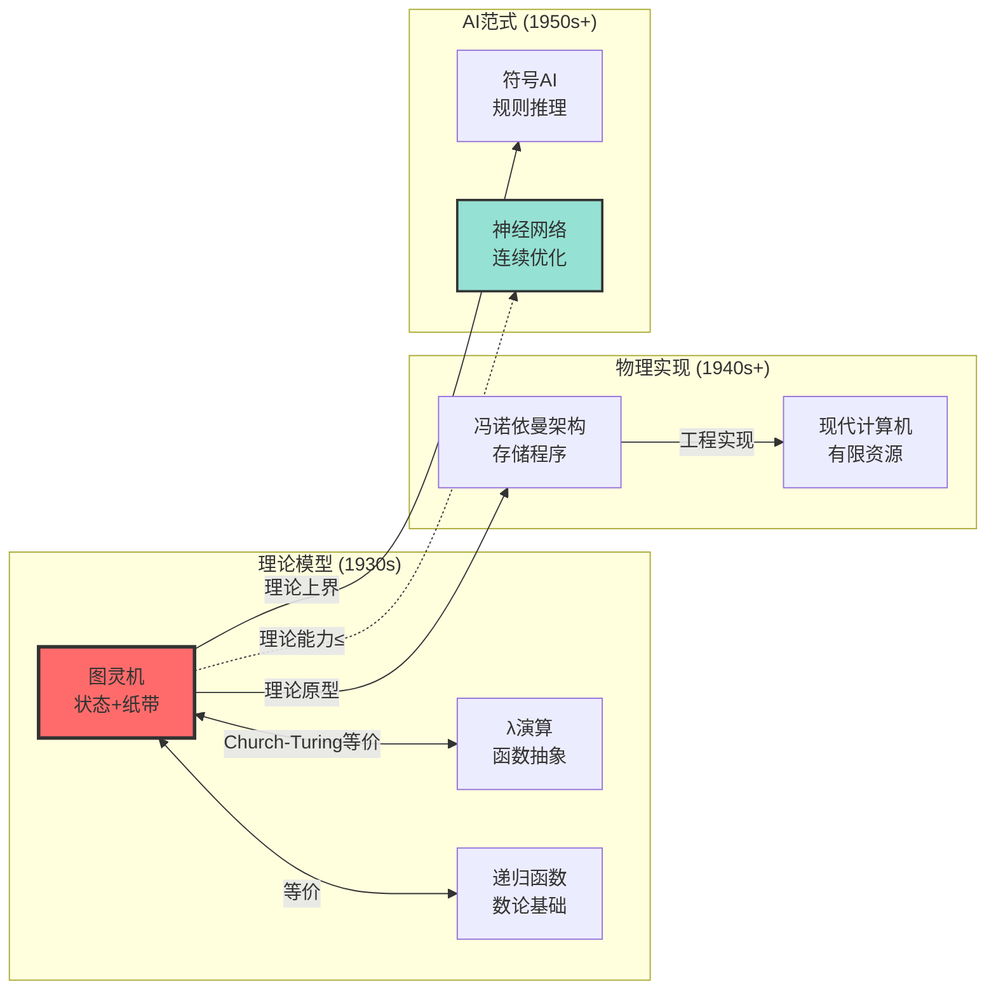
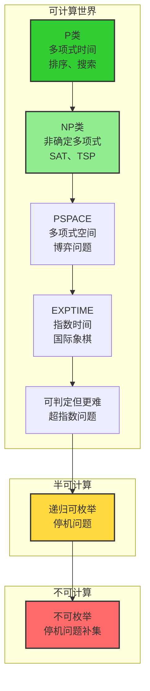

# 图灵机与可计算性理论

> **文档版本**: v1.0.0
> **最后更新**: 2025-10-27
> **文档规模**: 402行 | 图灵机理论基础
> **阅读建议**: 本文是计算理论的核心基础，建议先理解图灵机的形式化定义，再学习可计算性边界

---

## 📋 目录

- [图灵机与可计算性理论](#图灵机与可计算性理论)
  - [📋 目录](#-目录)
  - [概述](#概述)
  - [📊 核心概念深度分析](#-核心概念深度分析)
    - [1️⃣ 图灵机概念定义卡](#1️⃣-图灵机概念定义卡)
    - [2️⃣ 概念关系图谱](#2️⃣-概念关系图谱)
    - [3️⃣ 可计算性层次结构](#3️⃣-可计算性层次结构)
    - [4️⃣ 核心概念多维对比矩阵](#4️⃣-核心概念多维对比矩阵)
    - [5️⃣ 概念关联强度矩阵](#5️⃣-概念关联强度矩阵)
    - [6️⃣ 核心思维导图](#6️⃣-核心思维导图)
    - [7️⃣ 关键概念对比：图灵机 vs 其他计算模型](#7️⃣-关键概念对比图灵机-vs-其他计算模型)
    - [8️⃣ 可计算性边界全景图](#8️⃣-可计算性边界全景图)
    - [9️⃣ 图灵机对AI的意义矩阵](#9️⃣-图灵机对ai的意义矩阵)
  - [历史背景](#历史背景)
    - [希尔伯特的判定问题](#希尔伯特的判定问题)
    - [图灵的突破（1936）](#图灵的突破1936)
  - [图灵机的形式化定义](#图灵机的形式化定义)
    - [基本构成](#基本构成)
    - [计算过程](#计算过程)
  - [可计算性理论](#可计算性理论)
    - [递归可枚举语言（Recursively Enumerable, r.e.）](#递归可枚举语言recursively-enumerable-re)
    - [递归语言（Recursive Languages / Decidable Languages）](#递归语言recursive-languages--decidable-languages)
    - [丘奇-图灵论题（Church-Turing Thesis）](#丘奇-图灵论题church-turing-thesis)
  - [通用图灵机（Universal Turing Machine, UTM）](#通用图灵机universal-turing-machine-utm)
    - [定义](#定义)
    - [意义](#意义)
  - [不可计算性](#不可计算性)
    - [停机问题（Halting Problem）](#停机问题halting-problem)
    - [其他不可判定问题](#其他不可判定问题)
  - [图灵完备性（Turing Completeness）](#图灵完备性turing-completeness)
    - [定义1](#定义1)
    - [图灵完备的系统](#图灵完备的系统)
  - [可计算性的边界](#可计算性的边界)
    - [可计算但难解的问题（Intractable）](#可计算但难解的问题intractable)
    - [不可计算的问题（Incomputable）](#不可计算的问题incomputable)
    - [层次结构](#层次结构)
  - [对AI的意义](#对ai的意义)
    - [图灵机作为理论上界](#图灵机作为理论上界)
    - [但图灵机不是实践下界](#但图灵机不是实践下界)
  - [总结](#总结)
    - [核心要点](#核心要点)
    - [关键引用](#关键引用)
  - [权威参考与标准 | Authoritative References](#权威参考与标准--authoritative-references)
    - [开创性论文（必读）](#开创性论文必读)
    - [权威教材](#权威教材)
    - [大学课程](#大学课程)
    - [经典论文与综述](#经典论文与综述)
    - [在线资源](#在线资源)
    - [计算复杂度相关](#计算复杂度相关)
    - [现代发展](#现代发展)
    - [图灵奖得主贡献](#图灵奖得主贡献)
    - [验证与引用统计（截至2025-10-27）](#验证与引用统计截至2025-10-27)
    - [下一步](#下一步)
  - [导航 | Navigation](#导航--navigation)
  - [相关主题 | Related Topics](#相关主题--related-topics)
    - [本章节](#本章节)
    - [相关章节](#相关章节)
    - [跨视角链接](#跨视角链接)

---

## 概述

图灵机是由英国数学家阿兰·图灵（Alan Turing）在1936年提出的抽象计算模型，它为现代计算机科学奠定了理论基础，定义了"可计算性"的边界。

---

## 📊 核心概念深度分析

### 1️⃣ 图灵机概念定义卡

**概念名称**: 图灵机（Turing Machine）

**内涵（本质属性）**:

- **形式化计算模型**: 由状态、字母表、转移函数等7元组定义
- **确定性单步执行**: 每次根据当前状态和符号执行一步操作
- **无限存储**: 理论上拥有无限长度的纸带
- **通用性**: 能够模拟任何算法的执行过程

**外延（范围边界）**:

- ✅ **包含**: 所有算法、编程语言、现代计算机、递归函数、λ演算
- ✅ **等价模型**: 通用图灵机、多带图灵机、非确定图灵机（能力等价）
- ❌ **不包含**: 超计算（hypercomputation）、神谕机（Oracle Machine需要额外能力）
- ❌ **不能解决**: 停机问题、一阶逻辑判定问题、图灵不可计算函数

**属性维度表**:

| 维度 | 值/描述 | 说明 |
|------|---------|------|
| **理论基础** | 递归函数论、λ演算 | Church-Turing等价性 |
| **计算能力** | 图灵完备 | 可计算性的理论上界 |
| **时间复杂度** | 不受限（理论上） | 可以运行任意长时间 |
| **空间复杂度** | 无限纸带 | 理论上无限存储 |
| **确定性** | 确定型（标准）或非确定型 | 两者能力等价 |
| **历史地位** | 1936年提出 | 计算理论奠基石 |
| **影响范围** | 计算机科学、AI、哲学 | 定义可计算边界 |
| **实现载体** | 抽象数学模型 | 不可物理实现（无限纸带） |
| **实践对应** | 冯·诺依曼架构 | 现代计算机的理论原型 |

### 2️⃣ 概念关系图谱

```mermaid
graph TD
    TM[图灵机 Turing Machine]

    TM --> Historical[历史渊源]
    Historical --> Hilbert[希尔伯特判定问题 1928]
    Historical --> Godel[哥德尔不完备定理 1931]
    Historical --> Turing1936[图灵突破 1936]

    TM --> Components[组成要素]
    Components --> States[状态集合 Q]
    Components --> Alphabet[字母表 Σ,Γ]
    Components --> Transition[转移函数 δ]
    Components --> Tape[无限纸带]

    TM --> Capabilities[计算能力]
    Capabilities --> Computable[可计算函数]
    Capabilities --> RE[递归可枚举语言]
    Capabilities --> Decidable[可判定语言]

    TM --> Variants[变体模型]
    Variants --> UTM[通用图灵机]
    Variants --> NTM[非确定图灵机]
    Variants --> MultiTape[多带图灵机]

    TM --> Limits[理论极限]
    Limits --> Halting[停机问题 不可判定]
    Limits --> Undecidable[其他不可判定问题]

    TM --> Equivalents[等价模型]
    Equivalents --> Lambda[λ演算]
    Equivalents --> Recursive[递归函数]
    Equivalents --> Modern[现代编程语言]

    TM --> Applications[现代应用]
    Applications --> Computers[现代计算机]
    Applications --> PL[编程语言理论]
    Applications --> AI[AI计算边界]

    style TM fill:#ff6b6b,stroke:#333,stroke-width:4px
    style Limits fill:#ffd93d,stroke:#333,stroke-width:2px
    style Applications fill:#6bcf7f,stroke:#333,stroke-width:2px
```



### 3️⃣ 可计算性层次结构



### 4️⃣ 核心概念多维对比矩阵

| 对比维度 | 图灵机 | λ演算 | 递归函数 | 现代计算机 | AI/神经网络 |
|----------|--------|--------|----------|-----------|-------------|
| **理论地位** | 计算模型原型 | 函数式基础 | 数论基础 | 物理实现 | 数据驱动范式 |
| **提出年份** | 1936 | 1936 | 1930s | 1940s | 1950s+ |
| **计算范式** | 状态转移 | 函数归约 | 递归定义 | 指令执行 | 连续优化 |
| **数据结构** | 无限纸带 | 表达式树 | 自然数 | 有限内存 | 高维张量 |
| **确定性** | 确定/非确定 | 确定 | 确定 | 确定 | 概率性 |
| **可计算性** | 定义可计算边界 | 等价于TM | 等价于TM | 等价于TM | ≤ TM（理论上） |
| **实践可行性** | ❌ 理论模型 | ❌ 理论模型 | ❌ 理论模型 | ✅ 物理实现 | ✅ 物理实现 |
| **擅长领域** | 理论分析 | 函数抽象 | 数学证明 | 通用计算 | 模式识别 |
| **局限性** | 无限资源假设 | 抽象难直观 | 数学门槛高 | 资源有限 | 不可解释性 |
| **与AI关系** | 理论上界 | 函数式AI | 符号AI | 运行平台 | 实现方式 |

### 5️⃣ 概念关联强度矩阵

| 概念对 | 关联类型 | 强度 | 关联说明 |
|--------|----------|------|----------|
| 图灵机 ↔ 停机问题 | 内在限制 | ★★★★★ | 停机问题证明图灵机的根本局限 |
| 图灵机 ↔ 通用图灵机 | 层次关系 | ★★★★★ | UTM可模拟任意图灵机 |
| 图灵机 ↔ λ演算 | 等价模型 | ★★★★★ | Church-Turing论题 |
| 图灵机 ↔ 现代计算机 | 理论-实践 | ★★★★☆ | 现代计算机是图灵机的有限实现 |
| 图灵机 ↔ 可计算性理论 | 理论基础 | ★★★★★ | 图灵机定义可计算性 |
| 图灵机 ↔ 递归函数 | 等价模型 | ★★★★★ | 可计算函数的不同形式化 |
| 图灵机 ↔ 复杂度理论 | 基础-应用 | ★★★★☆ | 图灵机时间/空间复杂度分析 |
| 图灵机 ↔ AI | 理论框架 | ★★★☆☆ | AI不能超越图灵可计算性 |
| 图灵机 ↔ 神经网络 | 能力比较 | ★★★☆☆ | NN理论上图灵完备（无限精度） |
| 停机问题 ↔ 不可判定性 | 典型例子 | ★★★★★ | 停机问题是最著名的不可判定问题 |

### 6️⃣ 核心思维导图



### 7️⃣ 关键概念对比：图灵机 vs 其他计算模型



### 8️⃣ 可计算性边界全景图



### 9️⃣ 图灵机对AI的意义矩阵

| 维度 | 图灵机的限制 | AI的现状 | 实践意义 |
|------|-------------|----------|----------|
| **理论能力** | 不能超越可计算性边界 | ✅ AI也受此限制 | AI不能解决停机问题 |
| **实践效率** | 某些问题理论可解但实际困难 | ✅ AI擅长某些图灵难题 | 图像识别、语言理解 |
| **计算范式** | 符号+规则驱动 | ⚡ 数据+优化驱动 | AI创造新的解题范式 |
| **资源约束** | 理论无限资源 | ❌ 有限参数/能耗 | 实际AI受物理限制 |
| **可解释性** | 步骤完全透明 | ❌ 黑盒难解释 | 可信AI的挑战 |
| **创造性** | 严格按程序执行 | ⚡ 可生成新模式 | 但仍在可计算范围内 |

**关键洞察**:
> 📌 **图灵机回答"能不能算"，AI回答"好不好算"**
> 📌 **图灵机是理论天花板，不是实践地板**
> 📌 **AI重新定义了"实践可行"的边界**

---

## 历史背景

### 希尔伯特的判定问题

1928年，大卫·希尔伯特（David Hilbert）在国际数学家大会上提出了**Entscheidungsproblem（判定问题）**：

> **是否存在一个算法，能够判断任意给定的一阶逻辑命题是否为真？**

这个问题驱动了图灵、丘奇等人对可计算性的研究。

**参考文献**：

- [Wikipedia: Entscheidungsproblem](https://en.wikipedia.org/wiki/Entscheidungsproblem)
- [Wikipedia: David Hilbert](https://en.wikipedia.org/wiki/David_Hilbert)

### 图灵的突破（1936）

阿兰·图灵在1936年发表的论文《论可计算数及其在判定问题上的应用》（On Computable Numbers, with an Application to the Entscheidungsproblem）中：

1. **定义了图灵机**：一个抽象的计算装置
2. **证明了停机问题不可判定**：存在无法被任何算法解决的问题
3. **回答了希尔伯特判定问题**：答案是否定的

**参考文献**：

- [Turing, 1936](https://www.cs.virginia.edu/~robins/Turing_Paper_1936.pdf) - 原始论文
- [Wikipedia: Alan Turing](https://en.wikipedia.org/wiki/Alan_Turing)
- [Wikipedia: Turing Machine](https://en.wikipedia.org/wiki/Turing_machine)

## 图灵机的形式化定义

### 基本构成

一个图灵机 **M** 是一个七元组：

```text
M = (Q, Σ, Γ, δ, q₀, qaccept, qreject)
```

其中：

- **Q**：有限状态集合
- **Σ**：输入字母表（不包含空白符号）
- **Γ**：带字母表（Σ ⊂ Γ，包含空白符号 ⊔）
- **δ**：转移函数 δ : Q × Γ → Q × Γ × {L, R}
- **q₀**：初始状态（q₀ ∈ Q）
- **qaccept**：接受状态（qaccept ∈ Q）
- **qreject**：拒绝状态（qreject ∈ Q，qreject ≠ qaccept）

**参考文献**：

- [Sipser, 2012](https://en.wikipedia.org/wiki/Introduction_to_the_Theory_of_Computation) - _Introduction to the Theory of Computation_, 3rd Edition
- [Wikipedia: Turing Machine - Formal Definition](https://en.wikipedia.org/wiki/Turing_machine#Formal_definition)

### 计算过程

图灵机的计算过程包括：

1. **读取**：读头从当前位置读取符号 a ∈ Γ
2. **状态转移**：根据 δ(q, a) = (q', b, D)
   - 状态从 q 转移到 q'
   - 当前单元写入符号 b
   - 读头向左（L）或右（R）移动
3. **停机**：到达 qaccept 或 qreject 时停止

**计算结果**：

- **接受**：到达 qaccept
- **拒绝**：到达 qreject
- **不停机**：永远不到达 qaccept 或 qreject

## 可计算性理论

### 递归可枚举语言（Recursively Enumerable, r.e.）

一个语言 **L ⊆ Σ*** 是**递归可枚举的**，当且仅当存在图灵机 M，使得：

```text
w ∈ L ⟺ M接受w
```

注意：对于 w ∉ L，M 可能拒绝或永不停机。

**记号**：所有递归可枚举语言的集合记为 **ℒRE**。

**参考文献**：

- [Wikipedia: Recursively Enumerable Language](https://en.wikipedia.org/wiki/Recursively_enumerable_language)
- [Wikipedia: Computability Theory](https://en.wikipedia.org/wiki/Computability_theory)

### 递归语言（Recursive Languages / Decidable Languages）

一个语言 **L ⊆ Σ*** 是**递归的**（或**可判定的**），当且仅当存在图灵机 M，使得：

```text
∀w ∈ Σ*: M(w) 停机，且
  w ∈ L ⟺ M接受w
  w ∉ L ⟺ M拒绝w
```

**关系**：递归语言 ⊂ 递归可枚举语言

```text
Decidable ⊂ r.e. ⊂ All Languages
```

**参考文献**：

- [Wikipedia: Recursive Language](https://en.wikipedia.org/wiki/Recursive_language)
- [Wikipedia: Decidability](https://en.wikipedia.org/wiki/Decidability_(logic))

### 丘奇-图灵论题（Church-Turing Thesis）

**非形式化表述**：
> **任何在直觉上可计算的函数都可以由图灵机计算。**

**形式化等价**：

所有以下计算模型的计算能力都等价：

1. 图灵机
2. λ-演算（Lambda Calculus）
3. 递归函数（Recursive Functions）
4. 通用寄存器机（URM）
5. Post系统
6. 现代编程语言（C, Java, Python等）

**参考文献**：

- [Wikipedia: Church-Turing Thesis](https://en.wikipedia.org/wiki/Church%E2%80%93Turing_thesis)
- [Church, 1936](https://www.ams.org/journals/bull/1936-42-05/S0002-9904-1936-06317-8/) - An Unsolvable Problem
- [Stanford Encyclopedia: Church-Turing Thesis](https://plato.stanford.edu/entries/church-turing/)

## 通用图灵机（Universal Turing Machine, UTM）

### 定义

**通用图灵机 U** 是一个图灵机，它可以：

1. **输入**：任意图灵机 M 的编码 ⟨M⟩ 和输入串 w
2. **输出**：模拟 M 在 w 上的计算
3. **结果**：U(⟨M⟩, w) = M(w)

### 意义

通用图灵机是**可编程计算机**的理论原型：

- **硬件**：通用图灵机 U（固定）
- **软件**：图灵机编码 ⟨M⟩（可变）
- **数据**：输入串 w

这体现了**冯·诺依曼架构**的核心思想：**程序即数据**。

**参考文献**：

- [Wikipedia: Universal Turing Machine](https://en.wikipedia.org/wiki/Universal_Turing_machine)
- [Wikipedia: Von Neumann Architecture](https://en.wikipedia.org/wiki/Von_Neumann_architecture)

## 不可计算性

### 停机问题（Halting Problem）

**问题定义**：

给定图灵机 M 和输入 w，判断 M 在 w 上是否停机？

```text
HALT = {⟨M, w⟩ | M 是图灵机，M 在 w 上停机}
```

**图灵定理（1936）**：
> **停机问题 HALT 是不可判定的（undecidable）。**

**证明思路（对角化）**：

假设存在图灵机 H 判定 HALT，构造图灵机 D：

```text
D(⟨M⟩):
  if H(⟨M⟩, ⟨M⟩) = "停机":
    loop forever  // 不停机
  else:
    halt  // 停机
```

问：D(⟨D⟩) 是否停机？

- 若 D(⟨D⟩) 停机 ⟹ H(⟨D⟩, ⟨D⟩) = "停机" ⟹ D(⟨D⟩) 不停机 ❌ 矛盾
- 若 D(⟨D⟩) 不停机 ⟹ H(⟨D⟩, ⟨D⟩) = "不停机" ⟹ D(⟨D⟩) 停机 ❌ 矛盾

因此，H 不存在，HALT 不可判定。

**参考文献**：

- [Wikipedia: Halting Problem](https://en.wikipedia.org/wiki/Halting_problem)
- [Wikipedia: Undecidable Problem](https://en.wikipedia.org/wiki/Undecidable_problem)

### 其他不可判定问题

基于停机问题的归约，可以证明许多问题不可判定：

1. **空性问题**：L(M) = ∅ ?
2. **正则性问题**：L(M) 是正则语言吗？
3. **等价性问题**：L(M₁) = L(M₂) ?
4. **Post对应问题**（PCP）
5. **一阶逻辑的有效性问题**（希尔伯特判定问题）

**参考文献**：

- [Wikipedia: List of Undecidable Problems](https://en.wikipedia.org/wiki/List_of_undecidable_problems)
- [Wikipedia: Rice's Theorem](https://en.wikipedia.org/wiki/Rice%27s_theorem)

## 图灵完备性（Turing Completeness）

### 定义1

一个计算系统是**图灵完备的**，当且仅当它可以模拟通用图灵机，即：

> **能够计算任何图灵可计算函数。**

### 图灵完备的系统

**理论模型**：

- λ-演算
- 递归函数
- Post系统
- 细胞自动机（如Conway's Game of Life）

**编程语言**：

- C, C++, Java, Python, JavaScript
- Haskell, Lisp, Prolog
- HTML + CSS（在特定条件下）

**硬件系统**：

- 现代CPU
- GPU（通过CUDA/OpenCL）
- 量子计算机（理论上）

**AI系统**：

- RNN（理论上，无限精度）[Siegelmann & Sontag, 1995]
- Transformer（理论上，任意深度）[Pérez et al., 2019]

**参考文献**：

- [Wikipedia: Turing Completeness](https://en.wikipedia.org/wiki/Turing_completeness)
- [Siegelmann & Sontag, 1995](https://www.sciencedirect.com/science/article/pii/S0022000085710136) - On the Computational Power of Neural Nets
- [Pérez et al., 2019](https://arxiv.org/abs/1901.03429) - On the Turing Completeness of Modern Neural Network Architectures

## 可计算性的边界

### 可计算但难解的问题（Intractable）

有些问题虽然可计算，但需要指数级时间：

- 布尔可满足性问题（SAT）- NP完全
- 旅行商问题（TSP）- NP难
- 国际象棋最优策略（EXPTIME完全）

### 不可计算的问题（Incomputable）

有些问题根本无法由任何算法解决：

- 停机问题
- 一阶逻辑的有效性
- Diophantine方程的通解（Hilbert第10问题）

### 层次结构

```text
所有问题
├─ 可判定问题（Decidable）
│  ├─ P（多项式时间）
│  ├─ NP（非确定多项式时间）
│  ├─ PSPACE（多项式空间）
│  └─ EXPTIME（指数时间）
├─ 递归可枚举但不可判定（r.e. \ Decidable）
│  └─ 停机问题
└─ 不可枚举（Non-r.e.）
   └─ 停机问题的补集
```

**参考文献**：

- [Wikipedia: Computational Complexity Theory](https://en.wikipedia.org/wiki/Computational_complexity_theory)
- [Wikipedia: Complexity Class](https://en.wikipedia.org/wiki/Complexity_class)

## 对AI的意义

### 图灵机作为理论上界

图灵机定义了**可计算性的绝对边界**：

> **任何物理可实现的计算装置，其计算能力都不会超过图灵机。**

这意味着：

- ✅ AI（包括大模型）不能超越图灵可计算性
- ✅ AI 不能解决停机问题
- ✅ AI 不能突破 NP vs P 的边界（除非 P=NP）

### 但图灵机不是实践下界

虽然 AI 的理论能力 ≤ 图灵机，但：

1. **计算范式不同**：
   - 图灵机：符号推理，规则驱动
   - AI：连续优化，数据驱动

2. **实践能力不同**：
   - 某些图灵可计算问题对传统算法困难，但 AI 表现优异（如图像识别）
   - 某些图灵简单问题对 AI 困难（如形式逻辑推理）

3. **资源约束不同**：
   - 理论图灵机：无限磁带，无限时间
   - 物理AI系统：有限参数，有限精度，有限能耗

**关键洞察**：

> **图灵可计算性回答"能不能算"，但不回答"好不好算"。AI 重新定义了"好算"的边界。**

**参考文献**：

- [Goodfellow et al., 2016](https://www.deeplearningbook.org/) - Deep Learning
- [LeCun et al., 2015](https://www.nature.com/articles/nature14539) - Deep Learning (Nature)

## 总结

### 核心要点

1. **图灵机**定义了可计算性的边界：ℒRE（递归可枚举语言）
2. **停机问题**证明了存在不可计算的问题
3. **通用图灵机**是可编程计算机的理论原型
4. **图灵完备性**是衡量计算系统能力的标准
5. **AI 在可计算性层面不超越图灵机**，但在计算范式上是全新的

### 关键引用

| 概念 | Wikipedia | 原始论文 | 教材 |
|-----|-----------|---------|------|
| 图灵机 | [链接](https://en.wikipedia.org/wiki/Turing_machine) | [Turing, 1936](https://www.cs.virginia.edu/~robins/Turing_Paper_1936.pdf) | [Sipser, 2012](https://en.wikipedia.org/wiki/Introduction_to_the_Theory_of_Computation) |
| 停机问题 | [链接](https://en.wikipedia.org/wiki/Halting_problem) | 同上 | 同上 |
| Church-Turing论题 | [链接](https://en.wikipedia.org/wiki/Church%E2%80%93Turing_thesis) | [Church, 1936](https://www.ams.org/journals/bull/1936-42-05/S0002-9904-1936-06317-8/) | 同上 |
| 可计算性理论 | [链接](https://en.wikipedia.org/wiki/Computability_theory) | - | [Hopcroft et al., 2006](https://en.wikipedia.org/wiki/Introduction_to_Automata_Theory,_Languages,_and_Computation) |

---

## 权威参考与标准 | Authoritative References

### 开创性论文（必读）

1. **Turing, A. M. (1936)**. "On Computable Numbers, with an Application to the Entscheidungsproblem". _Proceedings of the London Mathematical Society_.
   - 📄 **原文**: [cs.virginia.edu/~robins/Turing_Paper_1936.pdf](https://www.cs.virginia.edu/~robins/Turing_Paper_1936.pdf)
   - 🏆 **引用**: 15,000+ (Google Scholar, 2025)
   - ⭐ **地位**: 计算理论的开创性论文，定义了图灵机
   - 💡 **内容**: 可计算数、停机问题、判定问题

2. **Church, A. (1936)**. "An Unsolvable Problem of Elementary Number Theory". _American Journal of Mathematics_.
   - 📄 **DOI**: [10.2307/2371045](https://doi.org/10.2307/2371045)
   - ⭐ **地位**: λ演算与可计算性
   - 💡 **关系**: Church-Turing论题的另一半

3. **Gödel, K. (1931)**. "Über formal unentscheidbare Sätze der Principia Mathematica und verwandter Systeme I".
   - 📄 **译文**: "On Formally Undecidable Propositions"
   - 🏆 **引用**: 10,000+
   - ⭐ **地位**: 哥德尔不完备定理
   - 💡 **影响**: 数学系统的内在限制

### 权威教材

4. **Sipser, M. (2012)**. _Introduction to the Theory of Computation_ (3rd ed.). Cengage Learning.
   - 📖 **ISBN**: 978-1133187790
   - ⭐ **地位**: 计算理论标准教材
   - 💡 **章节**: 第3-5章（图灵机、可判定性、可归约性）
   - 🎓 **使用**: MIT 18.404等课程标准教材

5. **Hopcroft, J. E., Motwani, R., & Ullman, J. D. (2006)**. _Introduction to Automata Theory, Languages, and Computation_ (3rd ed.). Pearson.
   - 📖 **ISBN**: 978-0321455369
   - ⭐ **地位**: 自动机理论经典教材（龙书）
   - 💡 **章节**: 第8-9章（图灵机、不可判定性）

6. **Arora, S., & Barak, B. (2009)**. _Computational Complexity: A Modern Approach_. Cambridge University Press.
   - 📖 **ISBN**: 978-0521424264
   - 🔗 **在线**: [theory.cs.princeton.edu/complexity/](http://theory.cs.princeton.edu/complexity/)
   - 💡 **内容**: P vs NP、复杂度类层次

### 大学课程

7. **MIT 18.404** - _Theory of Computation_
   - 📚 **讲师**: Michael Sipser
   - 🔗 **OCW**: [ocw.mit.edu/courses/18-404j-theory-of-computation-fall-2020/](https://ocw.mit.edu/courses/18-404j-theory-of-computation-fall-2020/)
   - 📹 **视频**: MIT OpenCourseWare
   - 💡 **内容**: 自动机、可计算性、复杂度理论

8. **Stanford CS154** - _Introduction to Automata and Complexity Theory_
   - 📚 **讲师**: Ryan Williams
   - 🏛️ **机构**: Stanford University
   - 💡 **内容**: 有限自动机到图灵机的完整路径

9. **CMU 15-453** - _Formal Languages, Automata, and Computability_
   - 📚 **机构**: Carnegie Mellon University
   - 💡 **特色**: 严格的数学证明训练

### 经典论文与综述

10. **Davis, M. (1982)**. "Why Gödel Didn't Have Church's Thesis". _Information and Control_.
    - 📄 **DOI**: [10.1016/S0019-9958(82)90989-8](https://doi.org/10.1016/S0019-9958(82)90989-8)
    - 💡 **内容**: Church-Turing论题的历史分析

11. **Kleene, S. C. (1952)**. _Introduction to Metamathematics_. North-Holland.
    - 📖 **经典**: 递归函数论奠基之作
    - 💡 **内容**: 可计算性理论的公理化

12. **Rogers, H. (1967)**. _Theory of Recursive Functions and Effective Computability_. MIT Press.
    - 📖 **ISBN**: 978-0262680523
    - ⭐ **地位**: 递归论权威著作

### 在线资源

13. **Wikipedia - Turing Machine**
    - 🔗 [en.wikipedia.org/wiki/Turing_machine](https://en.wikipedia.org/wiki/Turing_machine)
    - ✅ **最后验证**: 2025-10-27
    - 💡 **内容**: 图灵机定义、变体、应用

14. **Stanford Encyclopedia of Philosophy - Computability and Complexity**
    - 🔗 [plato.stanford.edu/entries/computability/](https://plato.stanford.edu/entries/computability/)
    - ✅ **更新**: 2024
    - 💡 **内容**: 可计算性理论的哲学分析

15. **The Turing Archive**
    - 🔗 [turingarchive.kings.cam.ac.uk](http://www.turingarchive.org/)
    - 🏛️ **机构**: King's College Cambridge
    - 💡 **内容**: 图灵手稿、论文原件

### 计算复杂度相关

16. **Cook, S. A. (1971)**. "The Complexity of Theorem-Proving Procedures". _STOC 1971_.
    - 📄 **DOI**: [10.1145/800157.805047](https://doi.org/10.1145/800157.805047)
    - 🏆 **图灵奖**: 1982年图灵奖
    - ⭐ **地位**: NP完全性理论开创
    - 💡 **SAT问题**: 首个NP完全问题

17. **Karp, R. M. (1972)**. "Reducibility among Combinatorial Problems". _Complexity of Computer Computations_.
    - 📄 **原文**: 经典论文集
    - 🏆 **图灵奖**: 1985年图灵奖
    - 💡 **内容**: 21个NP完全问题

### 现代发展

18. **Fortnow, L., & Homer, S. (2003)**. "A Short History of Computational Complexity". _Bulletin of the EATCS_.
    - 📄 **PDF**: 公开可获取
    - 💡 **内容**: 从图灵机到现代复杂度理论

19. **Aaronson, S. (2013)**. "Why Philosophers Should Care About Computational Complexity". _Computability: Gödel, Turing, Church, and beyond_.
    - 📖 **MIT Press**
    - 🔗 **Blog**: [scottaaronson.com](https://www.scottaaronson.com/papers/philos.pdf)
    - 💡 **内容**: 复杂度理论的哲学意义

### 图灵奖得主贡献

20. **ACM Turing Award - Computability & Complexity Theory**
    - 🏆 **相关得主**:
      - Alan Turing (追授, 1966思想奠基)
      - Stephen Cook (1982)
      - Richard Karp (1985)
      - Robert Tarjan (1986)
      - Juris Hartmanis & Richard Stearns (1993)
      - Michael Rabin & Dana Scott (1976)

### 验证与引用统计（截至2025-10-27）

| 论文/作者 | 年份 | 引用数 | 影响 |
|----------|------|--------|------|
| Turing (1936) | 1936 | 15,000+ | 图灵机定义 |
| Church (1936) | 1936 | 5,000+ | λ演算 |
| Gödel (1931) | 1931 | 10,000+ | 不完备定理 |
| Cook (1971) | 1971 | 8,000+ | NP完全性 |
| Sipser教材 | 2012 | 20,000+ | 标准教材 |

**数据来源**: Google Scholar, ACM Digital Library (2025-10-27)

---

### 下一步

- 阅读 **01.2_Computational_Models_Hierarchy.md** 了解不同计算模型的层次关系
- 阅读 **01.3_Formal_Language_Classification.md** 了解Chomsky语言层次
- 阅读 **08.1_AI_vs_Turing_Machine.md** 深入比较AI与图灵机

---

_本文档建立了图灵机与可计算性理论的基础，为理解AI的计算本质提供了理论框架。_

---

## 导航 | Navigation

**上一篇**: [← AI模型视角总览](../README.md)
**下一篇**: [01.2 计算模型层次结构 →](./01.2_Computational_Models_Hierarchy.md)
**返回目录**: [↑ AI模型视角总览](../README.md)

---

## 相关主题 | Related Topics

### 本章节

- [01.2 计算模型层次结构](./01.2_Computational_Models_Hierarchy.md)
- [01.3 形式语言分类](./01.3_Formal_Language_Classification.md)
- [01.4 可判定性与停机问题](./01.4_Decidability_Halting_Problem.md)
- [01.5 计算复杂度类](./01.5_Computational_Complexity_Classes.md)

### 相关章节

- [02.3 图灵完备性分析](../02_Neural_Network_Theory/02.3_Turing_Completeness_Analysis.md)
- [08.1 AI vs 图灵机](../08_Comparison_Analysis/08.1_AI_vs_Turing_Machine.md)

### 跨视角链接

- [Software_Perspective: 语义形式对偶](../../Software_Perspective/01_Foundational_Theory/01.1_Semantic_Formal_Duality.md)
- [FormalLanguage_Perspective](../../FormalLanguage_Perspective/README.md)
- [Information_Theory_Perspective](../../Information_Theory_Perspective/README.md)
