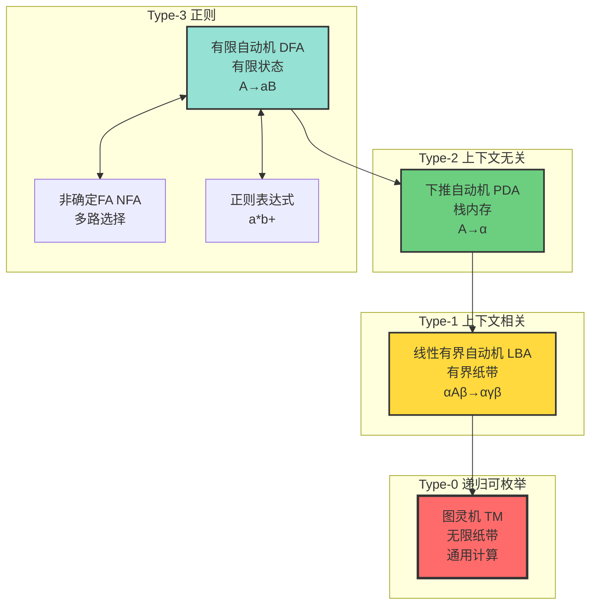
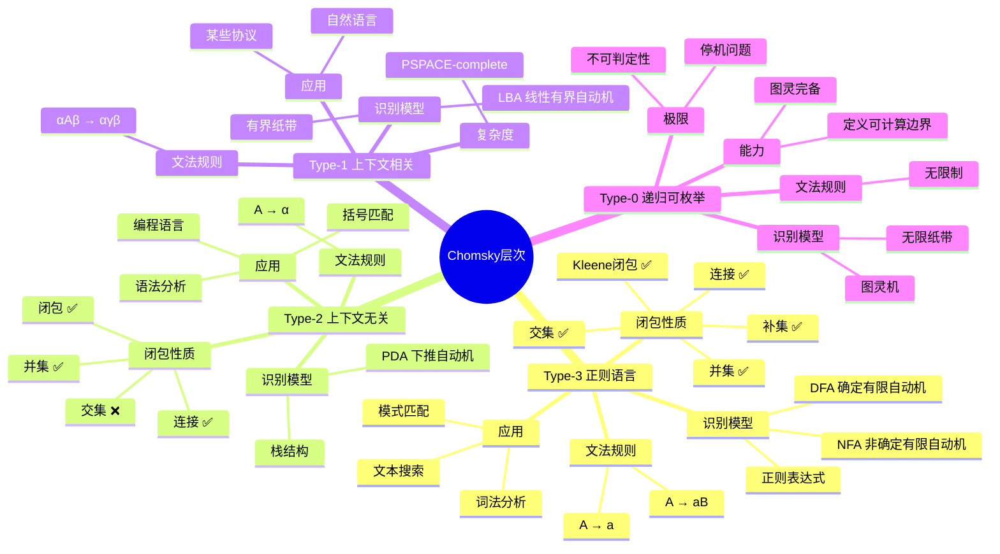
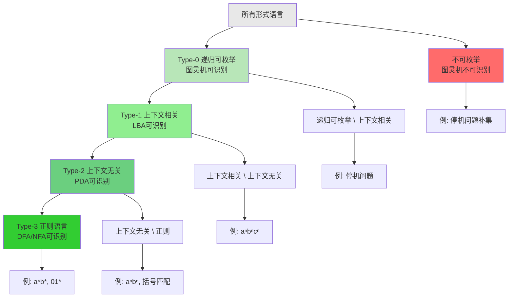
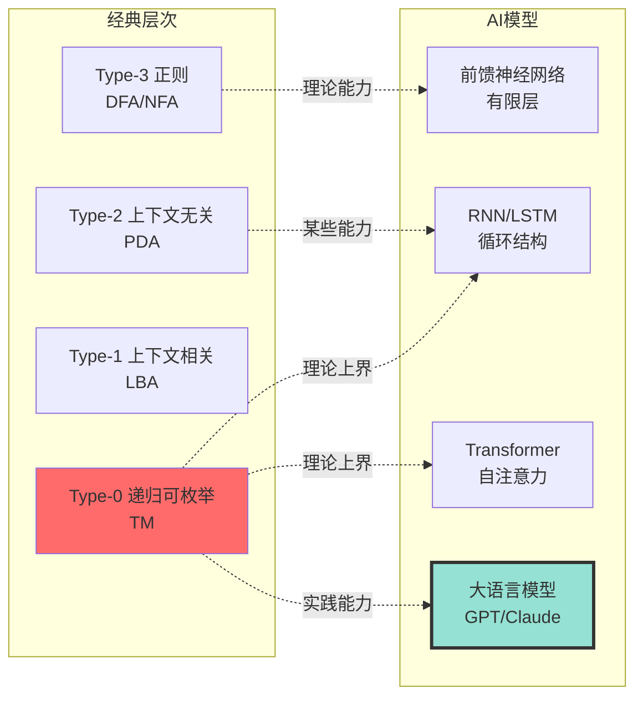
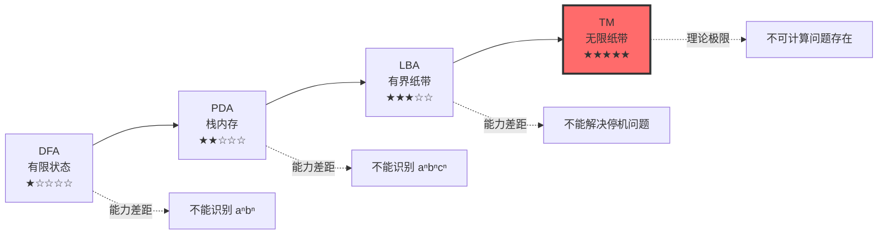

# 计算模型层次结构 | Computational Models Hierarchy

> **文档版本**: v1.0.0  
> **最后更新**: 2025-10-27  
> **文档规模**: 508行 | 计算模型层次与自动机理论  
> **阅读建议**: 本文系统介绍Chomsky层次结构，建议结合形式语言理论和自动机理论学习

---

## 📋 目录

- [概述 | Overview](#概述-overview)
- [📊 核心概念深度分析](#核心概念深度分析)
  - [1️⃣ Chomsky层次概念定义卡](#1-chomsky层次概念定义卡)
  - [2️⃣ 计算模型层次全景图](#2-计算模型层次全景图)
  - [3️⃣ 自动机能力对比矩阵](#3-自动机能力对比矩阵)
  - [4️⃣ Chomsky层次思维导图](#4-chomsky层次思维导图)
  - [5️⃣ 语言识别能力层次](#5-语言识别能力层次)
  - [6️⃣ 自动机关联强度矩阵](#6-自动机关联强度矩阵)
  - [7️⃣ AI模型在Chomsky层次中的定位](#7-ai模型在chomsky层次中的定位)
  - [8️⃣ 典型语言分类示例](#8-典型语言分类示例)
  - [9️⃣ 计算能力递增示意图](#9-计算能力递增示意图)
- [1. Chomsky 层次与自动机对应 | Chomsky Hierarchy and Automata Correspondence](#1-chomsky-层次与自动机对应-chomsky-hierarchy-and-automata-correspondence)
  - [1.1 四层结构 | Four-Level Structure](#11-四层结构-four-level-structure)
  - [1.2 包含关系 | Containment Relations](#12-包含关系-containment-relations)
- [2. 有限自动机 (FA) | Finite Automata](#2-有限自动机-fa-finite-automata)
  - [2.1 确定性有限自动机 (DFA)](#21-确定性有限自动机-dfa)
  - [2.2 非确定性有限自动机 (NFA)](#22-非确定性有限自动机-nfa)
  - [2.3 正则表达式等价性](#23-正则表达式等价性)
- [3. 下推自动机 (PDA) | Pushdown Automata](#3-下推自动机-pda-pushdown-automata)
  - [3.1 形式化定义](#31-形式化定义)
  - [3.2 关键特性](#32-关键特性)
  - [3.3 DPDA vs NPDA](#33-dpda-vs-npda)
- [4. 线性有界自动机 (LBA) | Linear Bounded Automaton](#4-线性有界自动机-lba-linear-bounded-automaton)
  - [4.1 形式化定义](#41-形式化定义)
  - [4.2 识别能力](#42-识别能力)
  - [4.3 计算复杂性](#43-计算复杂性)
- [5. 图灵机 (TM) | Turing Machine](#5-图灵机-tm-turing-machine)
  - [5.1 标准图灵机](#51-标准图灵机)
  - [5.2 图灵机变体](#52-图灵机变体)
- [6. 计算能力层次对比 | Computational Power Comparison](#6-计算能力层次对比-computational-power-comparison)
  - [6.1 内存能力](#61-内存能力)
  - [6.2 判定能力](#62-判定能力)
  - [6.3 闭包性质](#63-闭包性质)
- [7. AI 模型在层次中的定位 | AI Models in the Hierarchy](#7-ai-模型在层次中的定位-ai-models-in-the-hierarchy)
  - [7.1 神经网络的形式化定位](#71-神经网络的形式化定位)
  - [7.2 RNN 的图灵完备性](#72-rnn-的图灵完备性)
  - [7.3 Transformer 的计算能力](#73-transformer-的计算能力)
  - [7.4 大语言模型的特殊性](#74-大语言模型的特殊性)
- [8. 计算模型的哲学思考 | Philosophical Reflections](#8-计算模型的哲学思考-philosophical-reflections)
  - [8.1 Church-Turing 论题](#81-church-turing-论题)
  - [8.2 超图灵计算？](#82-超图灵计算)
  - [8.3 AI 作为新计算范式](#83-ai-作为新计算范式)
- [9. 权威参考文献 | Authoritative References](#9-权威参考文献-authoritative-references)
  - [Wikipedia 条目](#wikipedia-条目)
  - [学术论文](#学术论文)
  - [标准教材](#标准教材)
- [10. 关键要点总结 | Key Takeaways](#10-关键要点总结-key-takeaways)
- [导航 | Navigation](#导航-navigation)
- [相关主题 | Related Topics](#相关主题-related-topics)
  - [本章节](#本章节)
  - [相关章节](#相关章节)
  - [跨视角链接](#跨视角链接)

---

## 概述 | Overview

计算模型层次结构描述了不同计算能力的抽象机器及其关系。本文档系统阐述从有限自动机到图灵机的层次，以及这些模型与形式语言类的对应关系。

---

## 📊 核心概念深度分析

### 1️⃣ Chomsky层次概念定义卡

**概念名称**: Chomsky层次结构（Chomsky Hierarchy）

**内涵（本质属性）**:

- **形式语言分类**: 将形式语言按生成能力分为4个层次
- **语法-自动机对应**: 每层文法对应特定类型的识别自动机
- **严格包含关系**: Type-3 ⊂ Type-2 ⊂ Type-1 ⊂ Type-0
- **计算能力递增**: 从有限状态到图灵完备

**外延（范围边界）**:

- ✅ **Type-3（正则）**: DFA/NFA可识别，正则表达式可描述
- ✅ **Type-2（上下文无关）**: PDA可识别，编程语言语法
- ✅ **Type-1（上下文相关）**: LBA可识别，自然语言某些特性
- ✅ **Type-0（递归可枚举）**: 图灵机可识别，所有可计算语言
- ❌ **不包含**: 不可计算语言（如停机问题）

**属性维度表**:

| 维度 | Type-3 正则 | Type-2 上下文无关 | Type-1 上下文相关 | Type-0 递归可枚举 |
|------|------------|-----------------|-----------------|-----------------|
| **识别自动机** | DFA/NFA | PDA | LBA | 图灵机 |
| **内存结构** | 有限状态 | 栈（LIFO） | 有界纸带 | 无限纸带 |
| **文法规则** | A→aB 或 A→a | A→α | αAβ→αγβ | 无限制 |
| **闭包性质** | ∪∩补+连接 | ∪连接+闭包 | ∪连接+ | ∪连接+ |
| **判定问题** | 全可判定 | 部分可判定 | 大部分不可判定 | 停机不可判定 |
| **典型应用** | 词法分析 | 语法分析 | 自然语言 | 通用计算 |
| **历史地位** | 1956 Kleene | 1957 Chomsky | 1959 Chomsky | 1936 Turing |

### 2️⃣ 计算模型层次全景图



### 3️⃣ 自动机能力对比矩阵

| 对比维度 | DFA | NFA | PDA | LBA | TM |
|---------|-----|-----|-----|-----|-----|
| **状态集** | 有限 | 有限 | 有限 | 有限 | 有限 |
| **输入** | 字符串 | 字符串 | 字符串 | 字符串 | 字符串 |
| **辅助存储** | 无 | 无 | 栈（无限） | 纸带（O(n)） | 纸带（无限） |
| **确定性** | 确定 | 非确定 | 可非确定 | 可非确定 | 可非确定 |
| **能力等价** | DFA≡NFA≡REG | - | DPDA⊂NPDA | DLBA⊂NLBA | DTM≡NTM |
| **识别语言** | 正则 L₃ | 正则 L₃ | 上下文无关 L₂ | 上下文相关 L₁ | 递归可枚举 L₀ |
| **时间复杂度** | O(n) | O(n) | O(n³) | 指数级 | 不受限 |
| **空间复杂度** | O(1) | O(1) | O(n) | O(n) | 无限 |
| **判定问题** | 全可判定 | 全可判定 | 空性可判定 | 大部分不可判定 | 停机不可判定 |
| **典型例子** | aⁿbⁿ？❌ | aⁿbⁿ？❌ | aⁿbⁿ✅ | aⁿbⁿcⁿ✅ | 停机问题 |

### 4️⃣ Chomsky层次思维导图



### 5️⃣ 语言识别能力层次



### 6️⃣ 自动机关联强度矩阵

| 概念对 | 关联类型 | 强度 | 关联说明 |
|--------|----------|------|----------|
| DFA ↔ NFA | 能力等价 | ★★★★★ | 可相互转换，识别相同语言类 |
| DFA ↔ 正则表达式 | 描述等价 | ★★★★★ | Kleene定理保证等价性 |
| PDA ↔ CFG | 定义对应 | ★★★★★ | 上下文无关文法↔下推自动机 |
| LBA ↔ CSG | 定义对应 | ★★★★★ | 上下文相关文法↔线性有界自动机 |
| TM ↔ Type-0 | 定义对应 | ★★★★★ | 无限制文法↔图灵机 |
| DFA ↔ PDA | 能力包含 | ★★★★☆ | 正则语言是上下文无关的真子集 |
| PDA ↔ LBA | 能力包含 | ★★★★☆ | 上下文无关是上下文相关的真子集 |
| LBA ↔ TM | 能力包含 | ★★★★☆ | 上下文相关是递归可枚举的真子集 |
| DPDA ↔ NPDA | 能力不等价 | ★★★☆☆ | 非确定PDA能力严格大于确定PDA |
| Chomsky层次 ↔ AI | 理论框架 | ★★★☆☆ | AI模型的形式化能力定位 |

### 7️⃣ AI模型在Chomsky层次中的定位



### 8️⃣ 典型语言分类示例

| 语言 | 描述 | 分类 | 识别自动机 | 说明 |
|------|------|------|-----------|------|
| `a*b*` | 任意个a后跟任意个b | Type-3 | DFA | 简单正则模式 |
| `aⁿbⁿ` | n个a后跟n个b | Type-2 | PDA | 需要计数，用栈 |
| `aⁿbⁿcⁿ` | n个a、b、c | Type-1 | LBA | 需要两次计数 |
| `{⟨M,w⟩\|M接受w}` | 停机问题 | Type-0 | TM | 递归可枚举但不可判定 |
| `{⟨M,w⟩\|M不接受w}` | 停机问题补集 | 不可枚举 | 无 | 图灵机也无法识别 |

### 9️⃣ 计算能力递增示意图



---

## 1. Chomsky 层次与自动机对应 | Chomsky Hierarchy and Automata Correspondence

### 1.1 四层结构 | Four-Level Structure

| 类型 | 语言类 | 自动机 | 文法 | 识别能力 |
|------|--------|--------|------|----------|
| **Type 0** | 递归可枚举语言 (RE) | 图灵机 (TM) | 无限制文法 | 最强 |
| **Type 1** | 上下文相关语言 (CSL) | 线性有界自动机 (LBA) | 上下文相关文法 | 强 |
| **Type 2** | 上下文无关语言 (CFL) | 下推自动机 (PDA) | 上下文无关文法 | 中等 |
| **Type 3** | 正则语言 (REG) | 有限自动机 (FA) | 正则文法 | 基础 |

### 1.2 包含关系 | Containment Relations

```text
REG ⊂ CFL ⊂ CSL ⊂ RE ⊂ 所有形式语言
```

**严格包含证明**：

1. **REG ⊂ CFL**：
   - 反例：`{aⁿbⁿ | n ≥ 0}` 是CFL但不是REG
   - 证明：泵引理证明其不是正则语言

2. **CFL ⊂ CSL**：
   - 反例：`{aⁿbⁿcⁿ | n ≥ 0}` 是CSL但不是CFL
   - 证明：下推自动机只有一个栈，无法同时记录三个计数

3. **CSL ⊂ RE**：
   - 反例：停机问题的语言 H 是RE但不是CSL
   - 证明：LBA有内存限制，无法模拟任意TM

## 2. 有限自动机 (FA) | Finite Automata

### 2.1 确定性有限自动机 (DFA)

**形式化定义**：

```text
DFA = (Q, Σ, δ, q₀, F)
```

其中：

- `Q`：有限状态集合
- `Σ`：输入字母表
- `δ: Q × Σ → Q`：转移函数（完全确定）
- `q₀ ∈ Q`：初始状态
- `F ⊆ Q`：接受状态集合

**计算特性**：

- 无记忆能力（只有当前状态）
- 单向只读输入
- 确定性：每个状态对每个输入有唯一转移

**识别能力**：正则语言（REG）

**例子**：

```text
识别语言 L = {w ∈ {a,b}* | w 包含偶数个 a}
```

### 2.2 非确定性有限自动机 (NFA)

**形式化定义**：

```text
NFA = (Q, Σ, δ, q₀, F)
```

其中：

- `δ: Q × Σ → 2^Q`：转移函数返回状态集合
- 允许ε-转移（不消耗输入的转移）

**关键定理**：
> **定理**：对于任意NFA，存在等价的DFA识别同样的语言。

**证明思路**：子集构造（Subset Construction）

- DFA的每个状态对应NFA状态的一个子集
- 最多需要 2^|Q| 个状态

### 2.3 正则表达式等价性

**克莱尼定理 (Kleene's Theorem)**：

> 以下三者等价：
>
> 1. 可被DFA识别的语言
> 2. 可被NFA识别的语言
> 3. 可用正则表达式描述的语言

**正则表达式运算**：

- 连接：`r₁r₂`
- 并：`r₁|r₂`
- 克莱尼闭包：`r*`

## 3. 下推自动机 (PDA) | Pushdown Automata

### 3.1 形式化定义

**PDA = (Q, Σ, Γ, δ, q₀, Z₀, F)**:

其中：

- `Q`：有限状态集合
- `Σ`：输入字母表
- `Γ`：栈字母表
- `δ: Q × (Σ ∪ {ε}) × Γ → 2^(Q × Γ*)`：转移函数
- `q₀ ∈ Q`：初始状态
- `Z₀ ∈ Γ`：初始栈符号
- `F ⊆ Q`：接受状态集合

### 3.2 关键特性

**栈作为无限内存**：

- 可以记忆嵌套结构
- 最近的信息最先访问（LIFO）
- 理论上无界

**识别能力**：上下文无关语言（CFL）

**经典例子**：

```text
L = {aⁿbⁿ | n ≥ 0}
```

**PDA实现**：

1. 读入每个a，压栈
2. 读入每个b，出栈
3. 输入结束且栈空：接受

### 3.3 DPDA vs NPDA

**确定性PDA (DPDA)**：

- 每个配置最多一个转移选择
- 识别确定性上下文无关语言

**非确定性PDA (NPDA)**：

- 可有多个转移选择
- 识别所有上下文无关语言

**关键差异**：
> **定理**：DPDA识别的语言类 ⊂ NPDA识别的语言类

**例子**：

- 回文语言 `{wwᴿ | w ∈ Σ*}` 需要NPDA
- 括号匹配语言可用DPDA

## 4. 线性有界自动机 (LBA) | Linear Bounded Automaton

### 4.1 形式化定义

**LBA**：带有有界磁带的图灵机

**磁带限制**：

```text
磁带长度 ≤ c × |输入|，c 为常数
```

**关键约束**：

- 磁带不能无限增长
- 空间线性受限于输入长度
- 仍可读写和双向移动

### 4.2 识别能力

**LBA识别的语言类 = 上下文相关语言 (CSL)**:

**经典例子**：

```text
L = {aⁿbⁿcⁿ | n ≥ 1}
```

**为什么PDA不行？**

- 需要同时记录三个计数
- 单个栈只能验证两个

**LBA如何处理？**

- 用磁带记录三个计数的关系
- 磁带长度 = O(输入长度)

### 4.3 计算复杂性

**判定问题状态**：

- **成员判定**：可判定（LBA总会停机）
- **空性问题**：不可判定
- **等价性问题**：不可判定

## 5. 图灵机 (TM) | Turing Machine

### 5.1 标准图灵机

**TM = (Q, Σ, Γ, δ, q₀, qₐ, qᵣ)**:

其中：

- `Q`：有限状态集合
- `Σ`：输入字母表
- `Γ`：磁带字母表，Σ ⊂ Γ
- `δ: Q × Γ → Q × Γ × {L,R}`：转移函数
- `q₀, qₐ, qᵣ`：初始、接受、拒绝状态

**无限磁带**：

- 理论上无限长
- 可读可写
- 双向移动

**识别能力**：递归可枚举语言（RE）

### 5.2 图灵机变体

**多带图灵机**：

- 多条磁带，多个读写头
- **等价性**：与单带TM等价

**非确定性图灵机 (NTM)**：

- 允许多个转移选择
- **等价性**：与确定性TM等价（识别能力相同）

**双向无限磁带TM**：

- 磁带两端无限
- **等价性**：与单向无限TM等价

**关键结论**：
> 所有合理的图灵机变体都与标准TM等价（Church-Turing论题）

## 6. 计算能力层次对比 | Computational Power Comparison

### 6.1 内存能力

| 模型 | 内存类型 | 内存大小 | 访问模式 |
|------|---------|---------|---------|
| **FA** | 状态 | O(1) | 当前状态 |
| **PDA** | 栈 | 无界 | LIFO |
| **LBA** | 磁带 | O(n) | 随机访问 |
| **TM** | 磁带 | 无界 | 随机访问 |

### 6.2 判定能力

| 模型 | 成员判定 | 空性问题 | 等价性问题 |
|------|---------|---------|-----------|
| **DFA** | 可判定 | 可判定 | 可判定 |
| **PDA** | 可判定 | 可判定 | 不可判定 |
| **LBA** | 可判定 | 不可判定 | 不可判定 |
| **TM** | 半可判定 | 不可判定 | 不可判定 |

### 6.3 闭包性质

| 语言类 | 并 | 交 | 补 | 连接 | 克莱尼闭包 |
|-------|----|----|----|----|-----------|
| **REG** | ✅ | ✅ | ✅ | ✅ | ✅ |
| **CFL** | ✅ | ❌ | ❌ | ✅ | ✅ |
| **CSL** | ✅ | ✅ | ✅ | ✅ | ✅ |
| **RE** | ✅ | ✅ | ❌ | ✅ | ✅ |

**关键观察**：

- 正则语言和上下文相关语言对所有运算封闭
- 上下文无关语言不对交和补封闭
- 递归可枚举语言不对补封闭

## 7. AI 模型在层次中的定位 | AI Models in the Hierarchy

### 7.1 神经网络的形式化定位

**实际神经网络**：

```text
有限参数 + 有限精度 + 有限步骤 → 有限自动机
```

**理论能力**：

```text
无限精度 + 无限步骤 → 图灵完备
```

### 7.2 RNN 的图灵完备性

**Siegelmann & Sontag (1995) 定理**：
> 实数权重RNN可以模拟任意图灵机

**但实践中**：

- 浮点精度有限
- 时间步数有限
- 梯度消失/爆炸

**结论**：

```text
理论RNN ∈ 图灵完备
实际RNN ≈ 正则语言 + 噪声容忍
```

### 7.3 Transformer 的计算能力

**理论结果**（Pérez et al., 2019）：
> 无限深度Transformer可模拟图灵机

**实际约束**：

- 有限层数（通常几十层）
- 有限上下文窗口
- 注意力计算复杂度 O(n²)

**实际能力**：

```text
实际Transformer ≈ 增强的有限自动机
```

### 7.4 大语言模型的特殊性

**不是语言识别器，而是生成器**：

- 图灵机：`w ∈ L?` → `{接受, 拒绝, 永不停机}`
- LLM：`prompt` → `概率分布 over 下一token`

**能力定位**：

```text
LLM ∈ 随机有限自动机 + 大规模参数 + 统计学习
```

## 8. 计算模型的哲学思考 | Philosophical Reflections

### 8.1 Church-Turing 论题

**强形式**：
> 任何物理可实现的计算过程都可由图灵机模拟

**意义**：

- 图灵机是计算能力的上限
- 量子计算、DNA计算、神经网络都不超越此界

### 8.2 超图灵计算？

**可能的超图灵模型**：

1. **超任务 (Supertasks)**：无限步骤有限时间
2. **预言机 (Oracles)**：可解决停机问题的外挂
3. **量子计算**：某些问题更快，但能力不超越

**当前共识**：
> 没有物理可实现的超图灵计算模型

### 8.3 AI 作为新计算范式

**AI不是超图灵**：

- 计算能力 ≤ 图灵可计算
- 遵守Church-Turing论题

**AI是新范式**：

- 从符号 → 向量
- 从规则 → 统计
- 从演绎 → 归纳

## 9. 权威参考文献 | Authoritative References

### Wikipedia 条目

1. [Automata Theory](https://en.wikipedia.org/wiki/Automata_theory)
2. [Finite Automaton](https://en.wikipedia.org/wiki/Finite-state_machine)
3. [Pushdown Automaton](https://en.wikipedia.org/wiki/Pushdown_automaton)
4. [Linear Bounded Automaton](https://en.wikipedia.org/wiki/Linear_bounded_automaton)
5. [Turing Machine](https://en.wikipedia.org/wiki/Turing_machine)
6. [Chomsky Hierarchy](https://en.wikipedia.org/wiki/Chomsky_hierarchy)
7. [Regular Language](https://en.wikipedia.org/wiki/Regular_language)
8. [Context-free Language](https://en.wikipedia.org/wiki/Context-free_language)
9. [Context-sensitive Language](https://en.wikipedia.org/wiki/Context-sensitive_language)
10. [Recursively Enumerable Language](https://en.wikipedia.org/wiki/Recursively_enumerable_language)

### 学术论文

1. **Chomsky, N. (1956)**. "Three models for the description of language". *IRE Transactions on Information Theory*.
   - 提出形式语言层次结构

2. **Kleene, S. C. (1956)**. "Representation of events in nerve nets and finite automata". *Automata Studies*.
   - 证明正则表达式与有限自动机等价

3. **Rabin, M. O., & Scott, D. (1959)**. "Finite automata and their decision problems". *IBM Journal*.
   - 非确定性有限自动机的奠基性工作

4. **Siegelmann, H. T., & Sontag, E. D. (1995)**. "On the computational power of neural nets". *Journal of Computer and System Sciences*.
   - 证明RNN的图灵完备性

5. **Pérez, J., Marinković, J., & Barceló, P. (2019)**. "On the Turing Completeness of Modern Neural Network Architectures". *ICLR*.
   - 分析Transformer的计算能力

### 标准教材

1. **Sipser, M. (2012)**. *Introduction to the Theory of Computation* (3rd ed.). Cengage Learning.
   - 第1章：正则语言
   - 第2章：上下文无关语言
   - 第3章：图灵机与可计算性

2. **Hopcroft, J. E., Motwani, R., & Ullman, J. D. (2006)**. *Introduction to Automata Theory, Languages, and Computation* (3rd ed.). Pearson.
   - 自动机理论的经典教材

3. **Papadimitriou, C. H. (1994)**. *Computational Complexity*. Addison-Wesley.
   - 计算复杂性与自动机模型

## 10. 关键要点总结 | Key Takeaways

1. **层次结构**：
   - FA < PDA < LBA < TM
   - REG ⊂ CFL ⊂ CSL ⊂ RE

2. **内存是关键**：
   - 内存能力决定计算能力
   - FA(O(1)) → PDA(栈) → LBA(线性) → TM(无界)

3. **判定能力递减**：
   - 模型越强，判定问题越难
   - TM的许多问题不可判定

4. **AI的定位**：
   - 理论：图灵完备
   - 实践：近似有限自动机
   - 本质：新计算范式

5. **Church-Turing边界**：
   - 图灵机是物理可实现计算的上限
   - AI不超越，但提供新视角

---

**下一步阅读**：

- [01.1 图灵机与可计算性](01.1_Turing_Machine_Computability.md)
- [01.3 形式语言分类](01.3_Formal_Language_Classification.md)
- [01.4 可判定性与停机问题](01.4_Decidability_Halting_Problem.md)
- [02.2 RNN与图灵完备性](../02_Neural_Network_Theory/02.2_RNN_Transformer_Architecture.md)

---

## 导航 | Navigation

**上一篇**: [← 01.1 图灵机与可计算性](./01.1_Turing_Machine_Computability.md)  
**下一篇**: [01.3 形式语言分类 →](./01.3_Formal_Language_Classification.md)  
**返回目录**: [↑ AI模型视角总览](../README.md)

---

## 相关主题 | Related Topics

### 本章节

- [01.1 图灵机与可计算性](./01.1_Turing_Machine_Computability.md)
- [01.3 形式语言分类](./01.3_Formal_Language_Classification.md)
- [01.4 可判定性与停机问题](./01.4_Decidability_Halting_Problem.md)
- [01.5 计算复杂度类](./01.5_Computational_Complexity_Classes.md)

### 相关章节

- [02.2 RNN与Transformer架构](../02_Neural_Network_Theory/02.2_RNN_Transformer_Architecture.md)
- [02.3 图灵完备性分析](../02_Neural_Network_Theory/02.3_Turing_Completeness_Analysis.md)

### 跨视角链接

- [Software_Perspective: 计算抽象层次](../../Software_Perspective/01_Foundational_Theory/01.2_Computational_Abstraction_Layers.md)
- [FormalLanguage_Perspective](../../FormalLanguage_Perspective/README.md)
- [Information_Theory_Perspective](../../Information_Theory_Perspective/README.md)
