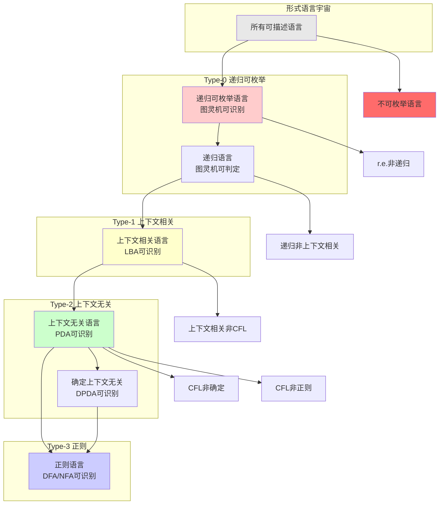
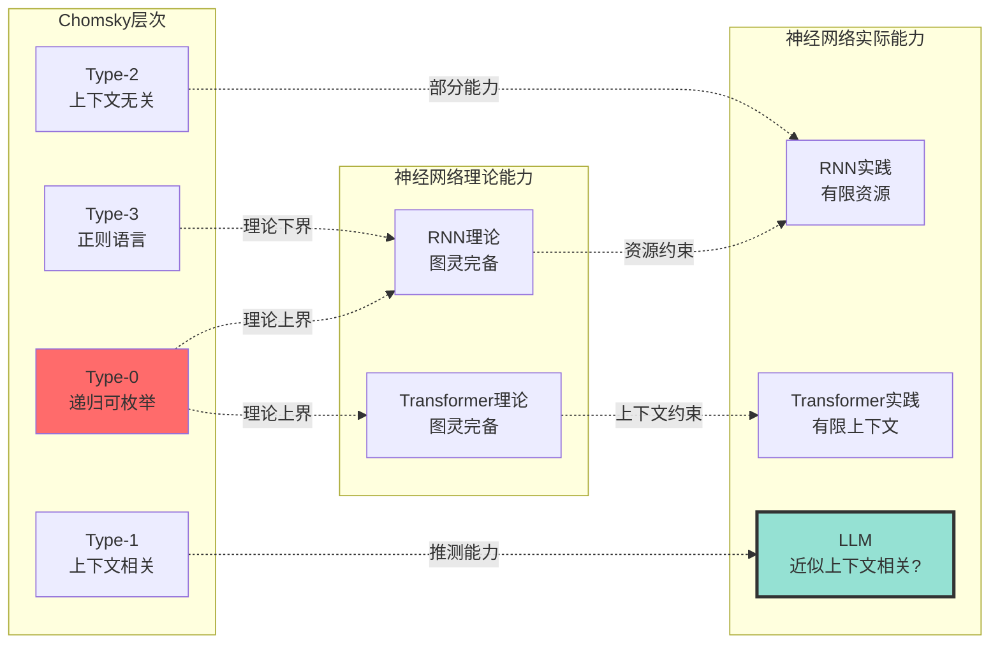

# 形式语言分类（Chomsky层次）

> **文档版本**: v1.0.0
> **最后更新**: 2025-10-27
> **文档规模**: 520行 | Chomsky层次与形式语言分类
> **阅读建议**: 本文详解Chomsky四层语言分类体系，是理解AI语言处理能力的理论基础

---

## 📋 目录

- [形式语言分类（Chomsky层次）](#形式语言分类chomsky层次)
  - [📋 目录](#-目录)
  - [概述](#概述)
  - [📊 核心概念深度分析](#-核心概念深度分析)
    - [1️⃣ 形式语言概念定义卡](#1️⃣-形式语言概念定义卡)
    - [2️⃣ Chomsky层次关系全景图](#2️⃣-chomsky层次关系全景图)
    - [3️⃣ 四层语言类型对比矩阵](#3️⃣-四层语言类型对比矩阵)
    - [4️⃣ 形式语言层次思维导图](#4️⃣-形式语言层次思维导图)
    - [5️⃣ 语言类包含关系与示例](#5️⃣-语言类包含关系与示例)
    - [6️⃣ 文法-自动机-语言三元对应表](#6️⃣-文法-自动机-语言三元对应表)
    - [7️⃣ AI模型语言能力定位图](#7️⃣-ai模型语言能力定位图)
    - [8️⃣ 判定问题复杂度对比](#8️⃣-判定问题复杂度对比)
    - [9️⃣ Chomsky层次对AI研究的启示矩阵](#9️⃣-chomsky层次对ai研究的启示矩阵)
  - [历史背景](#历史背景)
    - [Noam Chomsky的贡献](#noam-chomsky的贡献)
  - [Chomsky层次结构](#chomsky层次结构)
    - [四层分类](#四层分类)
  - [Type 3: 正则语言（Regular Languages）](#type-3-正则语言regular-languages)
    - [文法定义](#文法定义)
    - [自动机：有限状态自动机（FSA）](#自动机有限状态自动机fsa)
    - [典型例子](#典型例子)
    - [闭包性质](#闭包性质)
  - [Type 2: 上下文无关语言（Context-Free Languages）](#type-2-上下文无关语言context-free-languages)
    - [文法定义1](#文法定义1)
    - [自动机：下推自动机（PDA）](#自动机下推自动机pda)
    - [典型例子1](#典型例子1)
    - [闭包性质1](#闭包性质1)
    - [应用](#应用)
  - [Type 1: 上下文有关语言（Context-Sensitive Languages）](#type-1-上下文有关语言context-sensitive-languages)
    - [文法定义2](#文法定义2)
    - [自动机：线性有界自动机（LBA）](#自动机线性有界自动机lba)
    - [典型例子2](#典型例子2)
    - [复杂度](#复杂度)
    - [应用2](#应用2)
  - [Type 0: 递归可枚举语言（Recursively Enumerable）](#type-0-递归可枚举语言recursively-enumerable)
    - [文法定义3](#文法定义3)
    - [自动机：图灵机](#自动机图灵机)
    - [可判定 vs 不可判定](#可判定-vs-不可判定)
    - [闭包性质3](#闭包性质3)
  - [Chomsky层次与AI的关系](#chomsky层次与ai的关系)
    - [物理神经网络的语言类](#物理神经网络的语言类)
      - [理论结果 vs 实际结果](#理论结果-vs-实际结果)
    - [大语言模型的实际能力](#大语言模型的实际能力)
      - [语言识别 vs 语言生成](#语言识别-vs-语言生成)
      - [形式化分析](#形式化分析)
    - [可学习性理论的约束](#可学习性理论的约束)
      - [Gold的不可学习性定理](#gold的不可学习性定理)
      - [大语言模型的学习目标](#大语言模型的学习目标)
      - [PAC可学习性](#pac可学习性)
  - [总结](#总结)
    - [Chomsky层次结构表](#chomsky层次结构表)
    - [关键结论](#关键结论)
    - [对AI研究的启示](#对ai研究的启示)
  - [导航 | Navigation](#导航--navigation)
  - [相关主题 | Related Topics](#相关主题--related-topics)
    - [本章节](#本章节)
    - [相关章节](#相关章节)
    - [跨视角链接](#跨视角链接)

---

## 概述

形式语言理论通过**Chomsky层次**（Chomsky Hierarchy）将语言分为四个类别，每个类别对应一种**自动机**和一种**文法**。这个层次结构为理解AI（特别是大语言模型）的能力边界提供了精确的理论框架。

---

## 📊 核心概念深度分析

### 1️⃣ 形式语言概念定义卡

**概念名称**: 形式语言（Formal Language）

**内涵（本质属性）**:

- **符号序列集合**: 由字母表Σ上的字符串组成的集合
- **精确数学定义**: L ⊆ Σ*（字母表的Kleene闭包的子集）
- **生成vs识别**: 可通过文法生成或自动机识别
- **层次化能力**: 按Chomsky层次划分为4个等级

**外延（范围边界）**:

- ✅ **包含**: 正则语言、上下文无关语言、上下文相关语言、递归可枚举语言
- ✅ **实例**: 编程语言语法、自然语言子集、数学表达式
- ❌ **不包含**: 不可枚举语言、停机问题补集
- ❌ **非形式**: 模糊语言、歧义性自然语言

**属性维度表**:

| 维度 | 属性值 | 说明 |
|------|--------|------|
| **定义方式** | 生成式文法 / 识别式自动机 | 两种等价定义 |
| **分类标准** | Chomsky层次（Type 0-3） | 按生成能力分类 |
| **理论基础** | 集合论、递归论、自动机理论 | 数学基础 |
| **计算模型** | FSA/PDA/LBA/TM | 对应识别自动机 |
| **表达能力** | 从正则到图灵完备 | 能力递增 |
| **判定性** | 从全可判定到不可判定 | 复杂度递增 |
| **应用领域** | 编译原理、NLP、AI理论 | 实践意义 |
| **历史地位** | 1956 Chomsky奠基 | 现代计算语言学基础 |

### 2️⃣ Chomsky层次关系全景图



### 3️⃣ 四层语言类型对比矩阵

| 对比维度 | Type-3 正则 | Type-2 上下文无关 | Type-1 上下文相关 | Type-0 递归可枚举 |
|---------|-----------|----------------|----------------|----------------|
| **文法规则** | A→aB \| A→a | A→α | αAβ→αγβ (\|α\|≤\|γ\|) | α→β (无限制) |
| **生成约束** | 右线性/左线性 | 单非终结符左侧 | 长度不减 | 无约束 |
| **识别自动机** | DFA/NFA | PDA | LBA | 图灵机 |
| **内存类型** | 有限状态 | 栈(LIFO) | 线性有界纸带 | 无限纸带 |
| **典型例子** | a*b*, (01)* | aⁿbⁿ, 括号匹配 | aⁿbⁿcⁿ | 停机问题 |
| **闭包性质** | ∪∩补连接闭包 | ∪连接闭包 | ∪连接闭包 | ∪连接 |
| **成员判定** | O(n) | O(n³) CYK | PSPACE-完全 | 不可判定 |
| **空性判定** | 可判定 O(1) | 可判定 | 可判定 | 不可判定 |
| **等价性判定** | 可判定 | 不可判定 | 不可判定 | 不可判定 |
| **应用场景** | 词法分析、模式匹配 | 语法分析、编程语言 | 自然语言特性 | 通用计算 |
| **实际重要性** | ★★★★★ | ★★★★★ | ★★☆☆☆ | ★★★★★ |

### 4️⃣ 形式语言层次思维导图

```mermaid
mindmap
  root((形式语言<br/>Chomsky层次))
    Type-3 正则语言
      定义方式
        右线性文法 A→aB
        左线性文法 A→Ba
        正则表达式 a*b+
      识别模型
        DFA 确定有限
        NFA 非确定有限
        正则表达式引擎
      闭包性质
        并 ∪ ✅
        交 ∩ ✅
        补 ¬ ✅
        连接 · ✅
        闭包 * ✅
      典型应用
        词法分析器 Lexer
        文本搜索 grep
        输入验证
      复杂度
        识别 O(n)
        最小化 O(n log n)
    Type-2 上下文无关
      定义方式
        上下文无关文法 CFG
        Backus-Naur Form BNF
      识别模型
        PDA 下推自动机
        栈式内存
      经典例子
        aⁿbⁿ 括号语言
        算术表达式
        编程语言语法
      闭包性质
        并 ∪ ✅
        连接 · ✅
        闭包 * ✅
        交 ∩ ❌
        补 ¬ ❌
      典型应用
        语法分析器 Parser
        编译器前端
        XML/JSON解析
      复杂度
        CYK算法 O(n³)
        LL/LR O(n)
    Type-1 上下文相关
      定义方式
        长度不减规则
        αAβ → αγβ
      识别模型
        LBA 线性有界
        O(n)空间纸带
      经典例子
        aⁿbⁿcⁿ 三倍语言
        复制语言 ww
      复杂度
        PSPACE-complete
        指数时间
      应用场景
        自然语言某些特性
        复杂约束语言
    Type-0 递归可枚举
      定义方式
        无限制文法
        任意产生式
      识别模型
        图灵机 TM
        无限纸带
      子集
        递归语言 可判定
        r.e.非递归 半可判定
      极限
        停机问题 不可判定
        对角线论证
      理论意义
        定义可计算边界
        Church-Turing论题
```

### 5️⃣ 语言类包含关系与示例

```mermaid
graph TB
    RE[Type-0 递归可枚举<br/>例: 停机问题的语言]

    CSL[Type-1 上下文相关<br/>例: aⁿbⁿcⁿ, ww]

    CFL[Type-2 上下文无关<br/>例: aⁿbⁿ, 括号匹配]

    DCFL[确定上下文无关<br/>例: LR(k)语言]

    REG[Type-3 正则<br/>例: a*b*, (01)*]

    REG --> DCFL
    REG --> CFL
    DCFL --> CFL
    CFL --> CSL
    CSL --> RE

    REG -.->|反例| CFL_EX["aⁿbⁿ<br/>需要无限计数"]
    CFL -.->|反例| CSL_EX["aⁿbⁿcⁿ<br/>需要两次计数"]
    CSL -.->|反例| RE_EX["停机问题<br/>半可判定"]

    style RE fill:#ff6b6b
    style CSL fill:#ffd93d
    style CFL fill:#6bcf7f
    style DCFL fill:#95e1d3
    style REG fill:#4facfe
```

### 6️⃣ 文法-自动机-语言三元对应表

| Type | 文法类型 | 产生式形式 | 识别自动机 | 语言类 | 典型例子 |
|------|---------|-----------|-----------|--------|----------|
| **3** | 正则文法 | A→aB, A→a | DFA/NFA | 正则语言 | `a*b*`, `(ab)\|c` |
| **2** | 上下文无关文法 | A→α | PDA | 上下文无关语言 | `{aⁿbⁿ}`, `{ww^R}` |
| **1** | 上下文相关文法 | αAβ→αγβ | LBA | 上下文相关语言 | `{aⁿbⁿcⁿ}`, `{ww}` |
| **0** | 无限制文法 | α→β | TM | 递归可枚举语言 | `{⟨M,w⟩\|M接受w}` |

**关联强度**:

- 文法 ↔ 自动机: ★★★★★ (定义性对应)
- 自动机 ↔ 语言: ★★★★★ (识别性对应)
- 文法 ↔ 语言: ★★★★★ (生成性对应)

### 7️⃣ AI模型语言能力定位图



### 8️⃣ 判定问题复杂度对比

| 判定问题 | Type-3 正则 | Type-2 上下文无关 | Type-1 上下文相关 | Type-0 递归可枚举 |
|---------|-----------|----------------|----------------|----------------|
| **成员问题** | ✅ O(n) | ✅ O(n³) | ✅ PSPACE | ❌ 不可判定 |
| **空性问题** | ✅ O(1) | ✅ 多项式 | ✅ 可判定 | ❌ 不可判定 |
| **有限性** | ✅ 可判定 | ✅ 可判定 | ✅ 可判定 | ❌ 不可判定 |
| **等价性** | ✅ 可判定 | ❌ 不可判定 | ❌ 不可判定 | ❌ 不可判定 |
| **包含性** | ✅ 可判定 | ❌ 不可判定 | ❌ 不可判定 | ❌ 不可判定 |
| **全集性** | ✅ 可判定 | ❌ 不可判定 | ❌ 不可判定 | ❌ 不可判定 |
| **二义性** | ✅ 无二义性 | ❌ 不可判定 | ❌ 不可判定 | ❌ 不可判定 |

**判定性递减规律**: Type-3 (全可判定) → Type-2 (部分可判定) → Type-1 (少数可判定) → Type-0 (多数不可判定)

### 9️⃣ Chomsky层次对AI研究的启示矩阵

| 研究方向 | 正则语言启示 | 上下文无关启示 | 上下文相关启示 | 递归可枚举启示 |
|---------|------------|-------------|-------------|--------------|
| **模型设计** | 有限状态足够简单任务 | 需要栈式结构处理递归 | 需要更复杂内存机制 | 图灵完备不保证实用 |
| **能力边界** | 无法处理嵌套结构 | 无法处理多重依赖 | 理论能力强实际低效 | 可计算性的理论上界 |
| **实践价值** | 词法分析、模式匹配 | 语法解析、代码生成 | 复杂语言现象建模 | 通用智能理论框架 |
| **可学习性** | PAC可学习(受限) | Gold不可学习 | 学习困难 | 不可学习 |
| **LLM定位** | 能力远超 ✅ | 能力超越 ✅ | 能力接近 ❓ | 理论上界 ⚠️ |

---

## 历史背景

### Noam Chomsky的贡献

1956年，语言学家诺姆·乔姆斯基（Noam Chomsky）在研究自然语言的语法结构时，提出了**形式文法**的层次分类，后来被证明与自动机理论完美对应。

**参考文献**：

- [Chomsky, 1956](https://www.chomsky.info/articles/195609--.pdf) - Three Models for the Description of Language
- [Chomsky, 1959](https://www.chomsky.info/articles/19590615.pdf) - On Certain Formal Properties of Grammars
- [Wikipedia: Noam Chomsky](https://en.wikipedia.org/wiki/Noam_Chomsky)
- [Wikipedia: Chomsky Hierarchy](https://en.wikipedia.org/wiki/Chomsky_hierarchy)

## Chomsky层次结构

### 四层分类

```text
Type 0: 递归可枚举语言 (r.e.)  ⟷ 图灵机
  ⊃
Type 1: 上下文有关语言 (CSL) ⟷ 线性有界自动机 (LBA)
  ⊃
Type 2: 上下文无关语言 (CFL) ⟷ 下推自动机 (PDA)
  ⊃
Type 3: 正则语言 (REG)       ⟷ 有限状态自动机 (FSA/DFA/NFA)
```

**包含关系**：

```text
REG ⊂ CFL ⊂ CSL ⊂ r.e. ⊂ All Languages
```

**参考文献**：

- [Wikipedia: Chomsky Hierarchy](https://en.wikipedia.org/wiki/Chomsky_hierarchy)
- [Sipser, 2012](https://en.wikipedia.org/wiki/Introduction_to_the_Theory_of_Computation) - Chapter 2 & 3
- [Hopcroft et al., 2006](https://en.wikipedia.org/wiki/Introduction_to_Automata_Theory,_Languages,_and_Computation)

## Type 3: 正则语言（Regular Languages）

### 文法定义

**正则文法**的产生式形式：

```text
A → aB  (右线性)
A → a
A → ε
```

或

```text
A → Ba  (左线性)
A → a
A → ε
```

其中 A, B ∈ 非终结符，a ∈ 终结符，ε 是空串。

### 自动机：有限状态自动机（FSA）

**确定有限自动机（DFA）**：M = (Q, Σ, δ, q₀, F)

- Q: 有限状态集
- Σ: 输入字母表
- δ: Q × Σ → Q（转移函数）
- q₀ ∈ Q: 初始状态
- F ⊆ Q: 接受状态集

**非确定有限自动机（NFA）**：δ: Q × (Σ ∪ {ε}) → 2^Q

**定理**：DFA, NFA, 正则表达式, 正则文法 识别的语言类**完全相同**。

**参考文献**：

- [Wikipedia: Regular Language](https://en.wikipedia.org/wiki/Regular_language)
- [Wikipedia: Finite-State Machine](https://en.wikipedia.org/wiki/Finite-state_machine)
- [Wikipedia: Regular Expression](https://en.wikipedia.org/wiki/Regular_expression)

### 典型例子

**正则语言**：

1. {aⁿbⁿ | n = 0,1,2,...} ❌ **不是正则语言**（需要记忆a的数量）
2. {w | w 包含偶数个0} ✅ 正则
3. {w | w 以 "ab" 开头} ✅ 正则
4. 所有正则表达式匹配的串 ✅ 正则

**泵引理（Pumping Lemma）**用于证明某语言**不是**正则语言。

**参考文献**：

- [Wikipedia: Pumping Lemma for Regular Languages](https://en.wikipedia.org/wiki/Pumping_lemma_for_regular_languages)

### 闭包性质

正则语言在以下操作下**封闭**：

- ✅ 并集（Union）
- ✅ 交集（Intersection）
- ✅ 补集（Complement）
- ✅ 连接（Concatenation）
- ✅ Kleene闭包（*）
- ✅ 反转（Reversal）

**参考文献**：

- [Wikipedia: Closure Properties](https://en.wikipedia.org/wiki/Closure_(mathematics))

## Type 2: 上下文无关语言（Context-Free Languages）

### 文法定义1

**上下文无关文法（CFG）**的产生式形式：

```text
A → α
```

其中 A ∈ 非终结符，α ∈ (终结符 ∪ 非终结符)*

**关键特性**：左边只有**一个**非终结符。

### 自动机：下推自动机（PDA）

**下推自动机**：M = (Q, Σ, Γ, δ, q₀, Z₀, F)

- Q: 有限状态集
- Σ: 输入字母表
- Γ: 栈字母表
- δ: Q × (Σ ∪ {ε}) × Γ → 2^(Q × Γ*)（转移函数）
- q₀: 初始状态
- Z₀: 初始栈符号
- F: 接受状态集

**核心能力**：带有一个**栈**（Stack），可以记忆**嵌套结构**。

**参考文献**：

- [Wikipedia: Context-Free Language](https://en.wikipedia.org/wiki/Context-free_language)
- [Wikipedia: Context-Free Grammar](https://en.wikipedia.org/wiki/Context-free_grammar)
- [Wikipedia: Pushdown Automaton](https://en.wikipedia.org/wiki/Pushdown_automaton)

### 典型例子1

**上下文无关语言**：

1. {aⁿbⁿ | n ≥ 0} ✅ CFG: S → aSb | ε
2. {ww^R | w ∈ {a,b}*}（回文）✅
3. 所有编程语言的**语法**（几乎都是CFL）
   - 括号匹配
   - if-then-else 嵌套
   - 算术表达式

**不是上下文无关**：

1. {aⁿbⁿcⁿ | n ≥ 0} ❌ （需要记忆两个独立计数）
2. {ww | w ∈ {a,b}*} ❌ （不是回文，是复制）

**泵引理（CFL）**用于证明某语言不是CFL。

**参考文献**：

- [Wikipedia: Pumping Lemma for Context-Free Languages](https://en.wikipedia.org/wiki/Pumping_lemma_for_context-free_languages)

### 闭包性质1

上下文无关语言：

- ✅ 并集（Union）
- ❌ **不封闭于交集**（Intersection）❗
- ❌ **不封闭于补集**（Complement）❗
- ✅ 连接（Concatenation）
- ✅ Kleene闭包（*）

### 应用

- **编译器**：语法分析（Parsing）
- **自然语言处理**：句法结构分析
- **XML/JSON 解析**

**参考文献**：

- [Wikipedia: Parser](https://en.wikipedia.org/wiki/Parsing)
- [Aho et al., 2006](https://en.wikipedia.org/wiki/Compilers:_Principles,_Techniques,_and_Tools) - Compilers: Principles, Techniques, and Tools

## Type 1: 上下文有关语言（Context-Sensitive Languages）

### 文法定义2

**上下文有关文法（CSG）**的产生式形式：

```text
αAβ → αγβ
```

其中：

- A ∈ 非终结符
- α, β ∈ (终结符 ∪ 非终结符)*
- γ ∈ (终结符 ∪ 非终结符)⁺（非空）

**关键特性**：产生式**不减少串长度**（非收缩性）。

### 自动机：线性有界自动机（LBA）

**线性有界自动机**：

- 类似图灵机，但**磁带长度受输入长度线性限制**
- 不能使用输入串之外的空间

**形式化**：磁带长度 ≤ c · |w|，其中 c 是常数，w 是输入。

**参考文献**：

- [Wikipedia: Context-Sensitive Language](https://en.wikipedia.org/wiki/Context-sensitive_language)
- [Wikipedia: Context-Sensitive Grammar](https://en.wikipedia.org/wiki/Context-sensitive_grammar)
- [Wikipedia: Linear Bounded Automaton](https://en.wikipedia.org/wiki/Linear_bounded_automaton)

### 典型例子2

**上下文有关语言**：

1. {aⁿbⁿcⁿ | n ≥ 0} ✅ （需要三个独立计数）
2. {ww | w ∈ {a,b}*} ✅ （字符串复制）

### 复杂度

**定理**（Kuroda, 1964）：

- CSL 可判定性：**PSPACE完全**
- 成员判定问题：给定 CSG G 和 w，判断 w ∈ L(G) 是 **PSPACE完全**的

**参考文献**：

- [Kuroda, 1964](https://www.sciencedirect.com/science/article/pii/S0019995864902328) - Classes of Languages and Linear-Bounded Automata

### 应用2

- **自然语言**：某些自然语言现象（如交叉依赖）需要CSL
- **类型检查**：依赖类型系统

## Type 0: 递归可枚举语言（Recursively Enumerable）

### 文法定义3

**无限制文法**的产生式形式：

```text
α → β
```

其中 α, β ∈ (终结符 ∪ 非终结符)*，且 α 非空。

**无任何限制**。

### 自动机：图灵机

**图灵机**：

- **无限磁带**
- **双向移动**
- **完全通用**

**参考文献**：

- [Wikipedia: Recursively Enumerable Language](https://en.wikipedia.org/wiki/Recursively_enumerable_language)
- [Wikipedia: Turing Machine](https://en.wikipedia.org/wiki/Turing_machine)

### 可判定 vs 不可判定

**递归可枚举语言**分为两类：

1. **递归语言（Decidable）**：图灵机总是停机
   - 例子：所有正则语言、CFL、CSL

2. **不可判定语言**：图灵机可能不停机
   - 例子：停机问题 HALT

**关系**：

```text
Decidable ⊂ r.e. ⊂ All Languages
```

### 闭包性质3

递归可枚举语言：

- ✅ 并集
- ✅ 交集
- ❌ **不封闭于补集**❗

**关键事实**：
> **如果 L 和 L̄（L的补集）都是 r.e.，则 L 是可判定的。**

**参考文献**：

- [Wikipedia: Complement (Set Theory)](https://en.wikipedia.org/wiki/Complement_(set_theory))

## Chomsky层次与AI的关系

### 物理神经网络的语言类

#### 理论结果 vs 实际结果

| 模型 | 理论能力 | 实际能力 | 参考文献 |
|------|---------|---------|----------|
| **理想RNN**（无限精度） | ℒRE（图灵完备） | - | [Siegelmann & Sontag, 1995](https://www.sciencedirect.com/science/article/pii/S0022000085710136) |
| **理想Transformer**（任意深度） | ℒRE（图灵完备） | - | [Pérez et al., 2019](https://arxiv.org/abs/1901.03429) |
| **物理RNN**（有限精度） | REG（正则语言） | REG | [Weiss et al., 2018](https://arxiv.org/abs/1805.04908) |
| **物理Transformer**（有限层） | REG（正则语言） | REG | - |
| **实际大模型** + 工程截断 | 随机正则语言子集 | 随机正则 | - |

**关键洞察**：

> **理论上的图灵完备性需要无限资源（无限精度、无限深度、无限时间步）；一旦资源受限，神经网络退化为有限状态自动机，只能识别正则语言。**

**参考文献**：

- [Weiss et al., 2018](https://arxiv.org/abs/1805.04908) - On the Practical Computational Power of Finite Precision RNNs for Language Recognition

### 大语言模型的实际能力

#### 语言识别 vs 语言生成

**关键区别**：

1. **识别器（Recognizer）**：判断 w ∈ L ?（二元判决）
   - 图灵机、DFA、PDA 是识别器

2. **生成器（Generator）**：产生 L 中的字符串
   - 大语言模型是**概率生成器**

**大模型的问题**：

1. **无明确拒绝**：不能说"w ∉ L"，只能给低概率
2. **无停机保证**：依赖外部截断（max_length）
3. **概率性**：同一输入可能产生不同输出（temperature > 0）

#### 形式化分析

设大语言模型 M 在 prompt p 上生成分布 Pₘ(·|p)。

**问题**：如何从生成器构造识别器？

**尝试1**：阈值法

```text
w ∈ L ⟺ Pₘ(w|p) > τ
```

❌ 问题：τ 如何选取？不同 τ 给出不同语言。

**尝试2**：采样法

```text
w ∈ L ⟺ ∃采样 s 使得 M(p) = w
```

❌ 问题：采样是随机的，不是判决器。

**结论**：
> **大语言模型本质上是生成器，不是识别器。要把它变成识别器，需要外挂规则（阈值、采样策略等），这些规则不在模型内部。**

**参考文献**：

- [Holtzman et al., 2019](https://arxiv.org/abs/1904.09751) - The Curious Case of Neural Text Degeneration
- [Wikipedia: Nucleus Sampling](https://en.wikipedia.org/wiki/Top-p_sampling)

### 可学习性理论的约束

#### Gold的不可学习性定理

**Gold (1967)** 证明：

> **仅从正例（positive examples）不能学习任何包含所有有限语言的语言类。**

特别地：

- ❌ **正则语言不可从正例学习**
- ❌ **上下文无关语言不可从正例学习**

**参考文献**：

- [Gold, 1967](https://www.sciencedirect.com/science/article/pii/S001999586790165X) - Language Identification in the Limit
- [Wikipedia: Language Identification in the Limit](https://en.wikipedia.org/wiki/Language_identification_in_the_limit)

#### 大语言模型的学习目标

**训练目标**：下一个token预测

```text
minimize -log Pₘ(xₜ₊₁ | x₁, ..., xₜ)
```

**特性**：

- ✅ 只有正例（语料库中的句子）
- ❌ 没有负例（没有"这不是合法句子"的标签）

**推论**：
> **大语言模型的可学习语言类受 Gold 定理限制，理论上不能稳定泛化到整个正则语言类，更不用说 CFL 或 CSL。**

#### PAC可学习性

**PAC（Probably Approximately Correct）学习**[Valiant, 1984]：

**正则语言的PAC可学习性**：

- ✅ **多项式大小的DFA** 可PAC学习 [Angluin, 1987]
- ❌ 任意 DFA 不可高效PAC学习（除非有特殊结构）

**参考文献**：

- [Valiant, 1984](https://dl.acm.org/doi/10.1145/1968.1972) - A Theory of the Learnable
- [Angluin, 1987](https://link.springer.com/article/10.1007/BF00116828) - Learning Regular Sets from Queries and Counterexamples
- [Wikipedia: PAC Learning](https://en.wikipedia.org/wiki/Probably_approximately_correct_learning)

## 总结

### Chomsky层次结构表

| Type | 语言类 | 自动机 | 文法 | 闭包性质 | AI能力 |
|------|--------|--------|------|---------|--------|
| 3 | 正则 (REG) | 有限状态机 | 正则文法 | ∪∩¬ 全封闭 | **实际大模型** |
| 2 | 上下文无关 (CFL) | 下推自动机 | CFG | ∪封闭，∩¬不封闭 | 超出实际能力 |
| 1 | 上下文有关 (CSL) | 线性有界自动机 | CSG | PSPACE完全 | 远超实际能力 |
| 0 | 递归可枚举 (r.e.) | 图灵机 | 无限制文法 | 可能不停机 | **理论能力上界** |

### 关键结论

1. **理论与实践的鸿沟**：
   - 理论上（无限资源）：神经网络 = 图灵机（Type 0）
   - 实践上（有限资源）：神经网络 ≈ 有限自动机（Type 3）

2. **大语言模型的定位**：
   - 不是语言识别器，而是**概率生成器**
   - 不识别形式语言，而是**模拟统计分布**
   - 不在 Chomsky 层次中，而是**另一种计算范式**

3. **学习理论的限制**：
   - Gold定理：正例不足以学习正则语言
   - PAC学习：只能学习多项式大小的结构
   - 实际泛化：依赖归纳偏置和数据规模

### 对AI研究的启示

> **不要用"能模拟图灵机"来证明AI强大，而要用"在有限资源下，什么范式更适合什么任务"来评估AI。**

形式语言层次告诉我们：

- ✅ AI 擅长：模式识别、统计归纳、连续优化
- ❌ AI 不擅长：精确逻辑、形式推理、完美记忆

**参考文献**：

- [Marcus, 2018](https://arxiv.org/abs/1801.00631) - Deep Learning: A Critical Appraisal
- [Mitchell, 2021](https://arxiv.org/abs/2104.12871) - Why AI is Harder Than We Think

---

_本文档系统阐述了 Chomsky 形式语言层次，并精确分析了 AI（特别是大语言模型）在这一层次中的定位。所有论证均基于严格的理论基础和权威文献。_

---

## 导航 | Navigation

**上一篇**: [← 01.2 计算模型层次结构](./01.2_Computational_Models_Hierarchy.md)
**下一篇**: [01.4 可判定性与停机问题 →](./01.4_Decidability_Halting_Problem.md)
**返回目录**: [↑ AI模型视角总览](../README.md)

---

## 相关主题 | Related Topics

### 本章节

- [01.1 图灵机与可计算性](./01.1_Turing_Machine_Computability.md)
- [01.2 计算模型层次结构](./01.2_Computational_Models_Hierarchy.md)
- [01.4 可判定性与停机问题](./01.4_Decidability_Halting_Problem.md)
- [01.5 计算复杂度类](./01.5_Computational_Complexity_Classes.md)

### 相关章节

- [03.3 Transformer LLM理论](../03_Language_Models/03.3_Transformer_LLM_Theory.md)
- [05.2 Gold可学习性理论](../05_Learning_Theory/05.2_Gold_Learnability_Theory.md)

### 跨视角链接

- [FormalLanguage_Perspective: Chomsky层次](../../FormalLanguage_Perspective/README.md)
- [Software_Perspective](../../Software_Perspective/README.md)
- [Information_Theory_Perspective](../../Information_Theory_Perspective/README.md)
