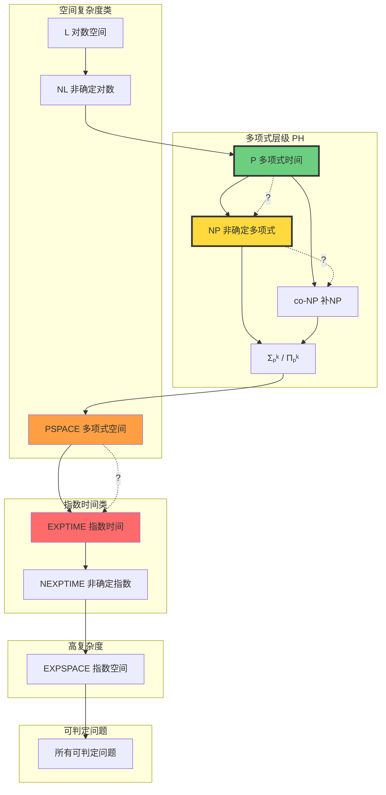
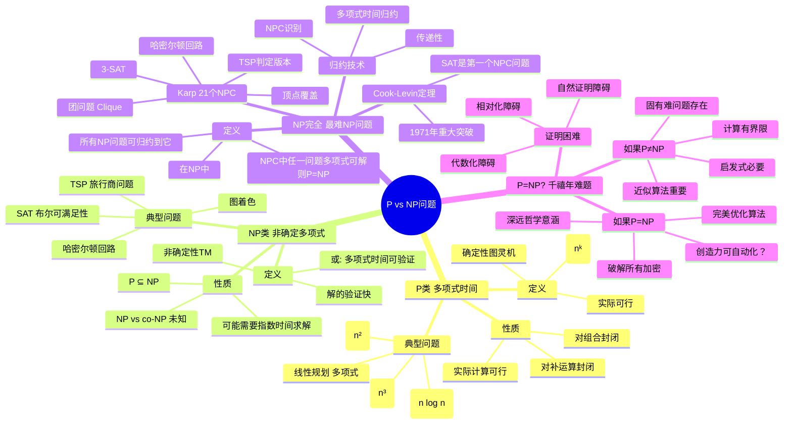
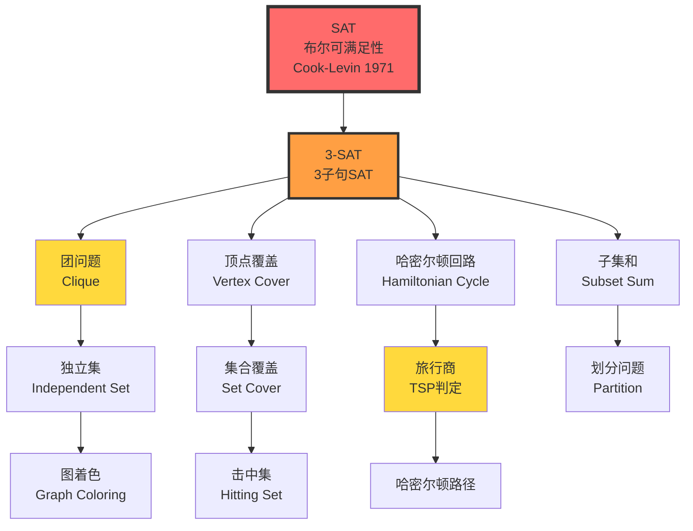
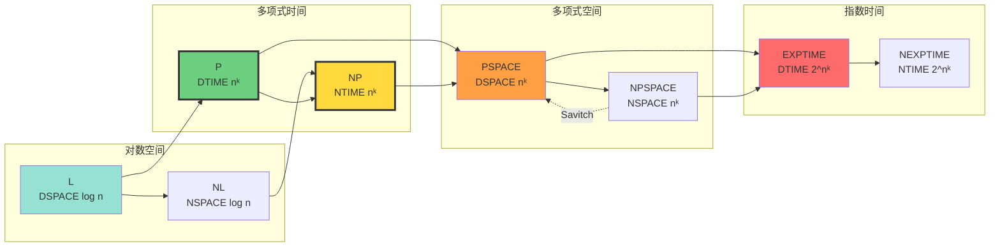

# 计算复杂度类 | Computational Complexity Classes

> **文档版本**: v1.0.0  
> **最后更新**: 2025-10-27  
> **文档规模**: 771行 | P/NP/PSPACE等复杂度类  
> **阅读建议**: 本文详解P vs NP等核心问题，建议先掌握算法复杂度分析基础

---

## 目录 | Table of Contents

- [计算复杂度类 | Computational Complexity Classes](#)

## 概述 | Overview

计算复杂度理论研究问题的**计算资源需求**（时间、空间），区分"理论可解"与"实际可行"。
本文档系统阐述主要复杂度类及其关系，并探讨对AI系统的意义。

---

## 📊 核心概念深度分析

### 1️⃣ P vs NP概念定义卡

**概念名称**: P vs NP问题

**内涵（本质属性）**:
- **P类**: 多项式时间可判定问题（确定性图灵机）
- **NP类**: 多项式时间可验证问题（非确定性图灵机）
- **核心问题**: P = NP ? 是千禧年七大数学难题之一
- **实践意义**: 区分"实际可行"与"理论可解"

**外延（范围边界）**:
- ✅ **P类例子**: 排序、最短路径、线性规划
- ✅ **NP类例子**: SAT、TSP、图着色、哈密尔顿回路
- ✅ **NP完全**: 最难的NP问题，所有NP问题可归约到它们
- ❌ **不在NP**: EXPTIME问题（需要指数时间验证）

**属性维度表**:

| 维度 | P类 | NP类 | NP完全 | NP困难 |
|------|-----|------|--------|--------|
| **定义** | 多项式时间可解 | 多项式时间可验证 | 最难的NP问题 | ≥NP完全难度 |
| **图灵机** | 确定性TM | 非确定性TM | NTM | 任意 |
| **关系** | P ⊆ NP | NP包含P | NPC ⊆ NP | NPH可能不在NP |
| **验证复杂度** | O(nᵏ) | O(nᵏ) | O(nᵏ) | 可能>多项式 |
| **求解复杂度** | O(nᵏ) | 未知 | 未知（猜测指数） | ≥指数 |
| **实际可行性** | ✅ 可行 | ❓ 未知 | ❌ 通常不可行 | ❌ 不可行 |
| **典型例子** | 排序、BFS | SAT、TSP | SAT、团问题 | 停机问题 |
| **历史地位** | 1965 Cobham | 1971 Cook | 1971 Cook-Levin | 1971 Karp |

### 2️⃣ 复杂度类层次全景图



### 3️⃣ 主要复杂度类对比矩阵

| 复杂度类 | 定义 | 典型问题 | 已知关系 | 实际可行性 |
|---------|------|---------|---------|-----------|
| **L** | 对数空间 DSPACE(log n) | 可达性、二分图匹配 | L ⊆ NL ⊆ P | ✅ 高效 |
| **NL** | 非确定对数空间 | 图可达性 | NL ⊆ P | ✅ 高效 |
| **P** | 多项式时间 ∪ₖTIME(nᵏ) | 排序、最短路、线性规划 | P ⊆ NP ∩ co-NP | ✅ 可行 |
| **NP** | 非确定多项式时间 | SAT、TSP、图着色 | NP ⊆ PSPACE | ❓ 未知 |
| **co-NP** | NP的补类 | 非满足性、非哈密尔顿 | co-NP ⊆ PSPACE | ❓ 未知 |
| **NP完全** | NP中最难问题 | SAT、3-SAT、团问题 | NPC ⊆ NP | ❌ 困难 |
| **PSPACE** | 多项式空间 | 量化布尔公式QBF | PSPACE ⊆ EXPTIME | ⚠️ 极困难 |
| **EXPTIME** | 指数时间 | 国际象棋（n×n棋盘） | EXPTIME ⊆ EXPSPACE | ❌ 不可行 |

### 4️⃣ P vs NP思维导图



### 5️⃣ NP完全问题归约关系图



### 6️⃣ 时间vs空间复杂度关系



### 7️⃣ 复杂度类包含关系

| 包含关系 | 是否严格 | 证明状态 | 说明 |
|---------|---------|---------|------|
| L ⊆ NL | 未知 | Open | 猜测L ⊂ NL |
| NL ⊆ P | 已证 | ✅ | 严格性未知 |
| P ⊆ NP | 已证 | ✅ | **P vs NP开放问题** |
| NP ⊆ PSPACE | 已证 | ✅ | 严格性未知 |
| PSPACE ⊆ EXPTIME | 已证 | ✅ | 严格性未知 |
| EXPTIME ⊂ EXPSPACE | **已证严格** | ✅ | 时间层次定理 |
| P ⊆ co-NP | 未知 | Open | P封闭于补运算 |
| NP ⊆ co-NP | 未知 | Open | 猜测NP ≠ co-NP |
| NPSPACE = PSPACE | **已证** | ✅ | Savitch定理 |

### 8️⃣ AI问题的复杂度定位

| AI任务 | 问题类型 | 理论复杂度 | 实践策略 | 说明 |
|--------|---------|-----------|---------|------|
| **图像识别** | 分类问题 | P (给定模型) | 深度学习 | 推理是P，训练是NP困难 |
| **自然语言理解** | 语义分析 | NP困难 | Transformer近似 | 完全理解可能需要推理 |
| **规划问题** | 搜索问题 | PSPACE完全 | 启发式搜索A* | 状态空间指数级 |
| **游戏树搜索** | 博弈问题 | EXPTIME | Alpha-Beta剪枝 | 国际象棋(n×n)是EXPTIME完全 |
| **定理证明** | 逻辑推理 | 不可判定(一阶逻辑) | 交互式证明 | 命题逻辑是NP完全 |
| **机器学习训练** | 优化问题 | NP困难 | 梯度下降近似 | 全局最优NP困难 |
| **强化学习** | MDP求解 | P (有限MDP) | Q-learning近似 | 部分可观察PSPACE完全 |
| **神经架构搜索** | 组合优化 | NP困难 | 进化算法、RL | 搜索空间巨大 |

### 9️⃣ 复杂度理论对AI的启示矩阵

| 研究方向 | 复杂度启示 | 理论限制 | 实践应对 |
|---------|-----------|---------|---------|
| **算法设计** | 区分P与NP问题 | 某些问题无多项式算法 | 近似算法、启发式 |
| **模型训练** | 训练是NP困难 | 全局最优不可达 | 局部优化、随机初始化 |
| **推理效率** | 推理需实时(P类) | 精确推理可能NP完全 | 神经网络近似推理 |
| **可解释性** | 某些解释NP困难 | 完全解释计算困难 | 局部解释、近似方法 |
| **安全性验证** | 验证可能PSPACE | 完全验证不可行 | 测试+形式化部分验证 |
| **AGI哲学** | 智能本质复杂度 | 人类可能使用近似 | 认知捷径、启发式 |

---

## 1. 基本概念 | Fundamental Concepts

### 1.1 复杂度度量

**时间复杂度**：

```text
TIME(t(n)) = { L | L可被O(t(n))时间的图灵机判定 }
```

**空间复杂度**：

```text
SPACE(s(n)) = { L | L可被O(s(n))空间的图灵机判定 }
```

**非确定性复杂度**：

```text
NTIME(t(n)) = { L | L可被O(t(n))时间的NTM判定 }
NSPACE(s(n)) = { L | L可被O(s(n))空间的NTM判定 }
```

### 1.2 渐进记号

**大O记号**：

```text
f(n) = O(g(n)) ⟺ ∃c, n₀: ∀n ≥ n₀, f(n) ≤ c·g(n)
```

**Ω记号**：

```text
f(n) = Ω(g(n)) ⟺ g(n) = O(f(n))
```

**Θ记号**：

```text
f(n) = Θ(g(n)) ⟺ f(n) = O(g(n)) 且 f(n) = Ω(g(n))
```

**小o记号**：

```text
f(n) = o(g(n)) ⟺ lim(n→∞) f(n)/g(n) = 0
```

### 1.3 问题类型

**判定问题 (Decision Problem)**：

- 输入：问题实例
- 输出：是/否
- 例：图是否有哈密尔顿回路？

**搜索问题 (Search Problem)**：

- 输入：问题实例
- 输出：解（如果存在）
- 例：找到哈密尔顿回路

**优化问题 (Optimization Problem)**：

- 输入：问题实例
- 输出：最优解
- 例：找最短哈密尔顿回路

**函数问题 (Function Problem)**：

- 输入：x
- 输出：f(x)
- 例：计算 n!

## 2. 主要复杂度类 | Major Complexity Classes

### 2.1 P 类 - 多项式时间

**定义**：

```text
P = ⋃ₖ TIME(nᵏ)
```

**特性**：

- 确定性图灵机
- 多项式时间可判定
- 被认为是"高效可解"的

**经典 P 类问题**：

1. **路径问题**：图中是否存在从s到t的路径？
   - 算法：BFS/DFS
   - 复杂度：O(V + E)

2. **最大流**：网络最大流量是多少？
   - 算法：Ford-Fulkerson
   - 复杂度：O(VE²)

3. **线性规划**：最优线性目标？
   - 算法：单纯形法、椭球法
   - 复杂度：多项式（椭球法）

4. **质数测试**：n是质数吗？
   - 算法：AKS算法（2002）
   - 复杂度：O((log n)¹²)

5. **匹配问题**：二分图最大匹配
   - 算法：匈牙利算法
   - 复杂度：O(V³)

### 2.2 NP 类 - 非确定性多项式时间

**定义**：

```text
NP = ⋃ₖ NTIME(nᵏ)
```

**等价刻画**：

```text
L ∈ NP ⟺ ∃ 多项式时间验证器 V 使得：
x ∈ L ⟺ ∃ 证书 c: V(x, c) 接受
```

**关键洞察**：

- **猜测并验证**：非确定性猜测答案，多项式时间验证
- **证书**：解的简短证明
- **验证容易**：即使找解困难

**经典 NP 问题**：

1. **SAT（布尔可满足性）**：

   ```text
   φ = (x₁ ∨ ¬x₂) ∧ (x₂ ∨ x₃) ∧ ...
   是否存在赋值使 φ 为真？
   ```

   - 证书：满足的赋值
   - 验证：O(n)

2. **哈密尔顿回路**：

   ```text
   图 G 是否有访问每个顶点恰好一次的回路？
   ```

   - 证书：回路
   - 验证：O(V)

3. **旅行商问题（判定版）**：

   ```text
   是否存在长度 ≤ k 的路线？
   ```

   - 证书：路线
   - 验证：O(n)

4. **背包问题**：

   ```text
   是否能选物品总价值 ≥ v 且总重量 ≤ w？
   ```

   - 证书：选择的物品集合
   - 验证：O(n)

5. **图着色**：

   ```text
   图 G 能否用 k 种颜色着色？
   ```

   - 证书：着色方案
   - 验证：O(E)

### 2.3 NP完全问题

**Cook-Levin 定理 (1971)**：
> SAT 是 NP-完全的

**NP-完全的定义**：

```text
L 是 NP-完全的 ⟺
1. L ∈ NP
2. ∀ L' ∈ NP: L' ≤ₚ L  (多项式时间归约)
```

**意义**：

- 最难的 NP 问题
- 若任一 NP-完全问题 ∈ P，则 P = NP

**21个NP-完全问题（Karp, 1972）**：

1. SAT
2. 3-SAT
3. 团问题 (Clique)
4. 顶点覆盖 (Vertex Cover)
5. 独立集 (Independent Set)
6. 哈密尔顿回路
7. 旅行商问题
8. 背包问题
9. 图着色
10. 子集和问题
... 等等

**归约链示例**：

```text
SAT ≤ₚ 3-SAT ≤ₚ 独立集 ≤ₚ 顶点覆盖 ≤ₚ 哈密尔顿回路
```

### 2.4 co-NP 类

**定义**：

```text
co-NP = { L | L̄ ∈ NP }
```

**特性**：

- L ∈ co-NP ⟺ 不在L中有简短证书

**co-NP完全问题**：

1. **重言式 (Tautology)**：

   ```text
   φ 是否在所有赋值下都为真？
   ```

   - 补问题：¬φ 可满足？（SAT）

2. **图不可着色性**：

   ```text
   图 G 不能用 k 种颜色着色？
   ```

**关系**：

```text
P ⊆ NP ∩ co-NP
```

**未解问题**：

- NP = co-NP ? （未知）
- 若 P = NP，则 NP = co-NP

### 2.5 PSPACE 类

**定义**：

```text
PSPACE = ⋃ₖ SPACE(nᵏ)
```

**特性**：

- 多项式空间
- 可能需要指数时间

**PSPACE-完全问题**：

1. **量化布尔公式 (QBF)**：

   ```text
   ∀x₁ ∃x₂ ∀x₃ ... φ(x₁, x₂, x₃, ...)
   是否为真？
   ```

2. **地理游戏**：二人博弈，是否先手必胜？

3. **围棋/象棋（广义版）**：n×n棋盘博弈

**Savitch 定理**：

```text
PSPACE = NPSPACE
```

### 2.6 EXPTIME 和 EXPSPACE

**定义**：

```text
EXPTIME = ⋃ₖ TIME(2^(nᵏ))
EXPSPACE = ⋃ₖ SPACE(2^(nᵏ))
```

**已知包含关系**：

```text
P ⊆ NP ⊆ PSPACE ⊆ EXPTIME ⊆ EXPSPACE
```

**严格包含（已证明）**：

- **P ⊂ EXPTIME** （时间层次定理）
- **PSPACE ⊂ EXPSPACE** （空间层次定理）

**EXPTIME-完全问题**：

- 广义国际象棋（n×n）
- 广义跳棋

## 3. 复杂度类关系图 | Complexity Class Relationships

### 3.1 已知关系

```text
P ⊆ NP ⊆ PSPACE ⊆ EXPTIME ⊆ EXPSPACE
  ⊆ co-NP ⊆
```

**已证明的严格包含**：

```text
P ⊂ EXPTIME
PSPACE ⊂ EXPSPACE
```

### 3.2 未解问题

**P vs NP**：

- **问题**：P = NP ?
- **意义**：找解 vs 验证解
- **悬赏**：克雷数学研究所百万美元奖

**NP vs co-NP**：

- NP = co-NP ?
- 若 P = NP，则必然相等

**NP vs PSPACE**：

- NP = PSPACE ?
- 或 NP ⊂ PSPACE ？

### 3.3 多项式层次 (Polynomial Hierarchy)

**定义**：

```text
Σ₀ᵖ = Π₀ᵖ = Δ₀ᵖ = P
Σ₁ᵖ = NP
Π₁ᵖ = co-NP
Δᵢ₊₁ᵖ = Pᶻⁱᵖ  (用 Σᵢᵖ 预言机的 P)
Σᵢ₊₁ᵖ = NPᶻⁱᵖ
Πᵢ₊₁ᵖ = co-Σᵢ₊₁ᵖ
```

**多项式层次**：

```text
PH = ⋃ᵢ Σᵢᵖ
```

**关系**：

```text
PH ⊆ PSPACE
```

**坍塌**：
若 Σᵢᵖ = Πᵢᵖ，则 PH = Σᵢᵖ

## 4. 其他重要复杂度类 | Other Important Classes

### 4.1 BPP - 有界概率多项式时间

**定义**：

```text
L ∈ BPP ⟺ ∃ 概率图灵机 M 使得：
- x ∈ L ⟹ P[M接受x] ≥ 2/3
- x ∉ L ⟹ P[M接受x] ≤ 1/3
```

**特性**：

- 随机算法
- 错误可放大缩小：重复运行

**关系**：

```text
P ⊆ BPP ⊆ PSPACE
```

**猜想**：P = BPP（大多数人相信）

**BPP 算法例子**：

- 质数测试（Miller-Rabin）
- 多项式恒等验证

### 4.2 RP 和 co-RP

**RP（单侧错误）**：

```text
x ∈ L ⟹ P[接受] ≥ 1/2
x ∉ L ⟹ P[接受] = 0
```

**关系**：

```text
P ⊆ RP ⊆ NP
P ⊆ co-RP ⊆ co-NP
RP ∩ co-RP ⊆ BPP
```

### 4.3 L 和 NL - 对数空间

**L (DLOGSPACE)**：

```text
L = SPACE(log n)
```

**NL (NLOGSPACE)**：

```text
NL = NSPACE(log n)
```

**NL-完全问题**：

- 图可达性：s到t是否有路径？

**Savitch定理的推论**：

```text
NL ⊆ SPACE(log² n)
```

**Immerman-Szelepcsényi 定理**：

```text
NL = co-NL
```

### 4.4 NC 类 - 高效并行

**定义**：

```text
NCⁱ = DSPACE(logⁱ n) ∩ TIME(poly log n) 在并行RAM上
NC = ⋃ᵢ NCⁱ
```

**P-完全问题**：

- 很可能不在 NC 中
- 本质上串行

**NC算法例子**：

- 矩阵乘法
- 排序
- 最大流（开放问题）

## 5. 复杂度理论的基本定理 | Fundamental Theorems

### 5.1 时间层次定理

**定理**：

```text
若 f(n) log f(n) = o(g(n))，则：
TIME(f(n)) ⊂ TIME(g(n))  （严格包含）
```

**推论**：

```text
P ⊂ EXPTIME
```

### 5.2 空间层次定理

**定理**：

```text
若 f(n) = o(g(n)) 且 g(n) = Ω(log n)，则：
SPACE(f(n)) ⊂ SPACE(g(n))
```

**推论**：

```text
L ⊂ PSPACE ⊂ EXPSPACE
```

### 5.3 空间重用定理

**定理**：

```text
TIME(f(n)) ⊆ SPACE(f(n))
SPACE(f(n)) ⊆ TIME(2^O(f(n)))
```

### 5.4 Savitch 定理

**定理**：

```text
NSPACE(f(n)) ⊆ SPACE(f²(n))
```

**特例**：

```text
PSPACE = NPSPACE
```

## 6. 近似与启发式 | Approximation and Heuristics

### 6.1 近似算法

对于 NP-难优化问题，寻求**近似解**。

**近似比**：

```text
ρ-近似算法：
OPT/ALG ≤ ρ  （最小化）
ALG/OPT ≤ ρ  （最大化）
```

**例子**：

- 顶点覆盖：2-近似（容易）
- 旅行商问题（度量TSP）：1.5-近似
- 集合覆盖：O(log n)-近似

**APX 类**：存在常数近似算法的问题

### 6.2 参数复杂度

**固定参数可解 (FPT)**：

```text
问题可在 f(k) · poly(n) 时间解决
```

其中 k 是参数（通常很小）

**例子**：

- k-顶点覆盖：O(2^k · n)
- k-路径：O(k! · n)

### 6.3 启发式方法

对于NP-难问题的实践方法：

1. **贪心算法**：局部最优选择
2. **动态规划**：伪多项式算法
3. **分支限界**：剪枝搜索树
4. **局部搜索**：模拟退火、遗传算法
5. **线性松弛**：整数规划 → 线性规划

## 7. 对 AI 的意义 | Implications for AI

### 7.1 AI 任务的复杂度

**机器学习问题**：

1. **训练神经网络**：
   - 一般情况：NP-难（甚至更难）
   - 实践：梯度下降（局部搜索）
   - 不保证全局最优

2. **PAC 学习**：
   - 学习某些概念类：多项式时间
   - 学习一般概念：NP-难

3. **超参数优化**：
   - 搜索空间指数级
   - 使用贝叶斯优化、网格搜索

**推理任务**：

1. **逻辑推理**：
   - 命题逻辑满足性：NP-完全
   - 一阶逻辑：半可判定

2. **贝叶斯推理**：
   - 精确推理：NP-难
   - 近似推理：采样方法

3. **规划**：
   - 一般规划：PSPACE-完全
   - 限制版本：多项式

### 7.2 深度学习的复杂度

**训练复杂度**：

```text
前向传播：O(总连接数)
反向传播：O(总连接数)
每个epoch：O(数据量 × 连接数)
```

**推理复杂度**：

```text
Transformer推理：O(L · d² · n + L · d · n²)
```

其中：

- L = 层数
- d = 模型维度
- n = 序列长度

**问题**：

- n² 的注意力：长序列困难
- 解决：稀疏注意力、线性注意力

### 7.3 AI 不能高效解决的问题

**NP-完全问题**：

- AI 可以学习启发式
- 但不能保证多项式时间
- 不能证明 P = NP

**例子**：

- SAT求解：AI可学习变量选择策略
- TSP：AI可学习好的路线构造
- 但最坏情况仍然指数级

### 7.4 AI 作为启发式

**AI的价值**：

- 学习问题特定的模式
- 提供快速近似解
- 在平均情况表现好

**限制**：

- 不保证最优
- 不保证多项式时间
- 可能在某些实例失败

**哲学思考**：
> 人类智能也是启发式的：
>
> - 不解决NP-完全问题
> - 使用经验和直觉
> - AI模仿这种方式

## 8. 权威参考文献 | Authoritative References

### Wikipedia 条目

1. [Computational Complexity Theory](https://en.wikipedia.org/wiki/Computational_complexity_theory)
2. [P (complexity)](https://en.wikipedia.org/wiki/P_(complexity))
3. [NP (complexity)](https://en.wikipedia.org/wiki/NP_(complexity))
4. [P versus NP problem](https://en.wikipedia.org/wiki/P_versus_NP_problem)
5. [NP-completeness](https://en.wikipedia.org/wiki/NP-completeness)
6. [PSPACE](https://en.wikipedia.org/wiki/PSPACE)
7. [EXPTIME](https://en.wikipedia.org/wiki/EXPTIME)
8. [BPP (complexity)](https://en.wikipedia.org/wiki/BPP_(complexity))
9. [Polynomial hierarchy](https://en.wikipedia.org/wiki/Polynomial_hierarchy)
10. [Approximation algorithm](https://en.wikipedia.org/wiki/Approximation_algorithm)

### 学术论文

1. **Cook, S. A. (1971)**. "The complexity of theorem-proving procedures". *Proceedings of STOC*.
   - 证明 SAT 是 NP-完全的

2. **Karp, R. M. (1972)**. "Reducibility among combinatorial problems". *Complexity of Computer Computations*.
   - 21个NP-完全问题

3. **Savitch, W. J. (1970)**. "Relationships between nondeterministic and deterministic tape complexities". *Journal of Computer and System Sciences*.
   - Savitch定理

4. **Immerman, N. (1988)**. "Nondeterministic space is closed under complementation". *SIAM Journal on Computing*.
   - NL = co-NL

5. **Arora, S., & Safra, S. (1998)**. "Probabilistic checking of proofs: a new characterization of NP". *Journal of the ACM*.
   - PCP定理

### 标准教材

1. **Sipser, M. (2012)**. *Introduction to the Theory of Computation* (3rd ed.). Cengage Learning.
   - 第7章：时间复杂度
   - 第8章：空间复杂度
   - 第9章：难解性

2. **Arora, S., & Barak, B. (2009)**. *Computational Complexity: A Modern Approach*. Cambridge University Press.
   - 复杂度理论的现代教材

3. **Papadimitriou, C. H. (1994)**. *Computational Complexity*. Addison-Wesley.
   - 经典复杂度理论教材

4. **Goldreich, O. (2008)**. *Computational Complexity: A Conceptual Perspective*. Cambridge University Press.
   - 概念导向的复杂度理论

## 9. 关键要点总结 | Key Takeaways

1. **可计算 ≠ 可高效计算**：
   - 图灵机可计算不意味着实际可行
   - 复杂度理论区分"理论"与"实践"

2. **P vs NP**：
   - 最重要的未解问题
   - 找解 vs 验证解
   - 百万美元奖

3. **NP-完全问题无处不在**：
   - 组合优化
   - 调度、路由、资源分配
   - 实践中仍需解决

4. **近似与启发式**：
   - 完美解不可得时，寻求好解
   - 实践中足够

5. **AI 的复杂度地位**：
   - 训练：NP-难（最坏情况）
   - 推理：多项式（给定模型）
   - 作用：学习启发式

6. **哲学意义**：
   - 计算资源的本质限制
   - 人类智能也受限于复杂度
   - 完美主义 vs 实用主义

---

**下一步阅读**：

- [01.1 图灵机与可计算性](01.1_Turing_Machine_Computability.md)
- [01.2 计算模型层次结构](01.2_Computational_Models_Hierarchy.md)
- [01.3 形式语言分类](01.3_Formal_Language_Classification.md)
- [01.4 可判定性与停机问题](01.4_Decidability_Halting_Problem.md)
- [05.1 PAC学习框架](../05_Learning_Theory/05.1_PAC_Learning_Framework.md)
