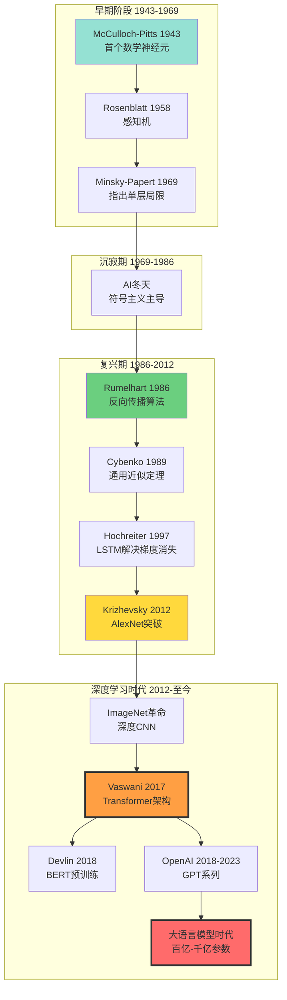
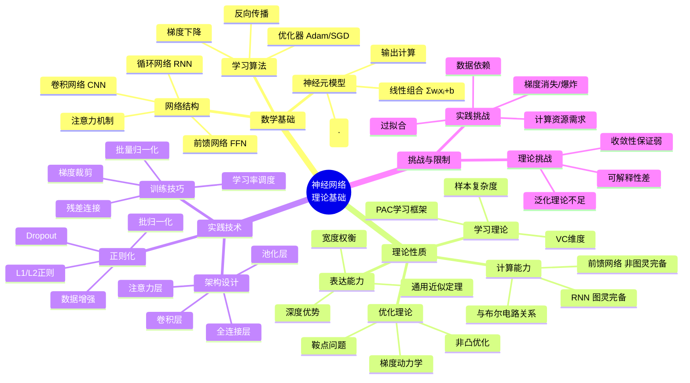
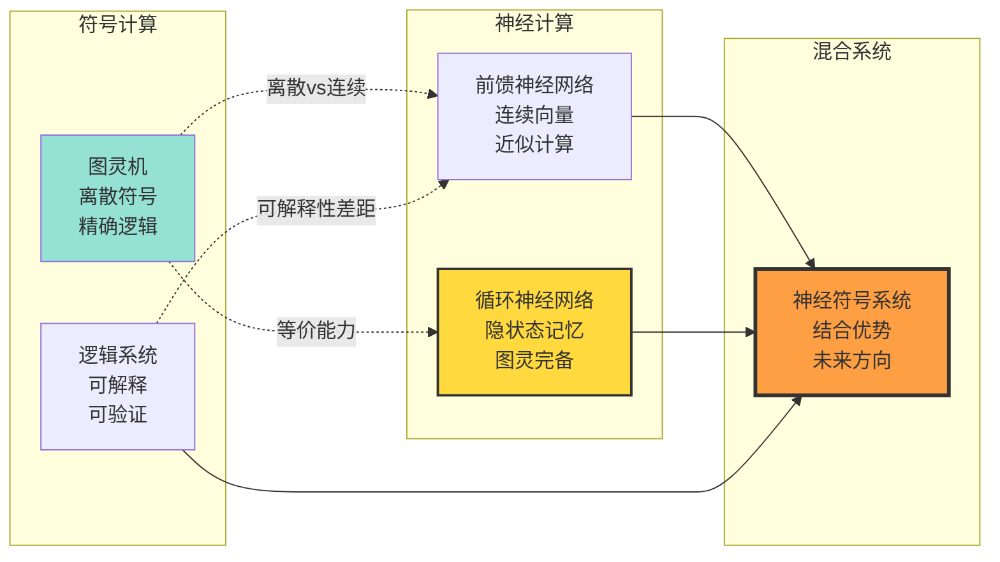
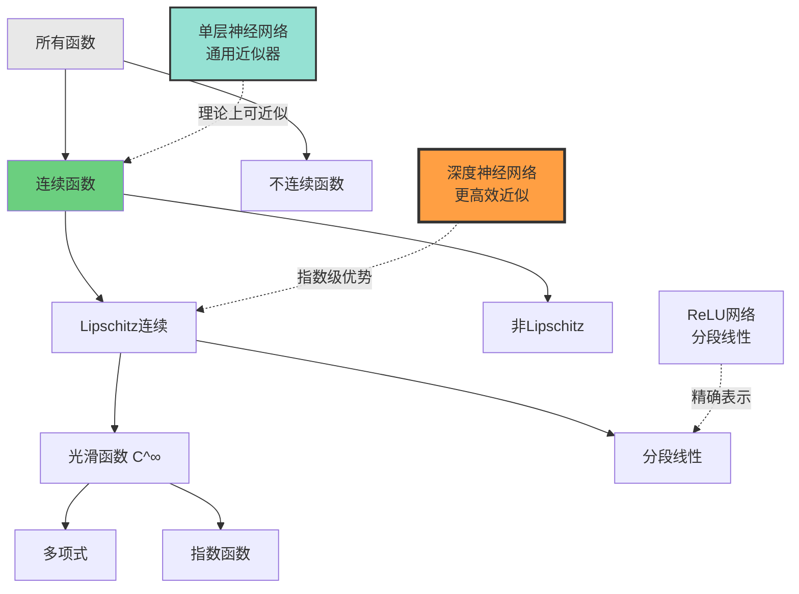

# 神经网络基础理论 | Neural Network Foundations

> **文档版本**: v1.0.0
> **最后更新**: 2025-10-27
> **文档规模**: 452行 | 神经网络理论基础
> **阅读建议**: 本文系统介绍神经网络的数学基础和理论性质，建议结合实践案例理解

---

## 📋 目录

- [神经网络基础理论 | Neural Network Foundations](#神经网络基础理论--neural-network-foundations)
  - [📋 目录](#-目录)
  - [📊 核心概念深度分析](#-核心概念深度分析)
    - [1️⃣ 神经网络概念定义卡](#1️⃣-神经网络概念定义卡)
    - [2️⃣ 神经网络发展历史全景图](#2️⃣-神经网络发展历史全景图)
    - [3️⃣ 神经元模型演化对比矩阵](#3️⃣-神经元模型演化对比矩阵)
    - [4️⃣ 神经网络理论体系思维导图](#4️⃣-神经网络理论体系思维导图)
    - [5️⃣ 神经网络vs传统计算模型对比](#5️⃣-神经网络vs传统计算模型对比)
    - [6️⃣ 通用近似定理核心内容](#6️⃣-通用近似定理核心内容)
    - [7️⃣ 神经网络学习能力层次](#7️⃣-神经网络学习能力层次)
    - [8️⃣ 前馈网络vs循环网络能力对比](#8️⃣-前馈网络vs循环网络能力对比)
    - [9️⃣ 神经网络理论-实践差距分析矩阵](#9️⃣-神经网络理论-实践差距分析矩阵)
  - [1. 历史发展 | Historical Development](#1-历史发展--historical-development)
    - [1.1 早期阶段 (1943-1969)](#11-早期阶段-1943-1969)
    - [1.2 沉寂期 (1969-1986)](#12-沉寂期-1969-1986)
    - [1.3 复兴期 (1986-至今)](#13-复兴期-1986-至今)
  - [2. 数学基础 | Mathematical Foundations](#2-数学基础--mathematical-foundations)
    - [2.1 神经元模型](#21-神经元模型)
    - [2.2 前馈神经网络 (Feedforward Neural Network)](#22-前馈神经网络-feedforward-neural-network)
    - [2.3 反向传播算法 (Backpropagation)](#23-反向传播算法-backpropagation)
  - [3. 理论性质 | Theoretical Properties](#3-理论性质--theoretical-properties)
    - [3.1 VC 维度 (VC Dimension)](#31-vc-维度-vc-dimension)
    - [3.2 过拟合与正则化](#32-过拟合与正则化)
    - [3.3 优化挑战](#33-优化挑战)
  - [4. 计算能力分析 | Computational Power Analysis](#4-计算能力分析--computational-power-analysis)
    - [4.1 与布尔电路的关系](#41-与布尔电路的关系)
    - [4.2 前馈网络的局限性](#42-前馈网络的局限性)
    - [4.3 通用近似 vs. 图灵完备](#43-通用近似-vs-图灵完备)
  - [5. 现代发展方向 | Modern Developments](#5-现代发展方向--modern-developments)
    - [5.1 深度学习的成功因素](#51-深度学习的成功因素)
    - [5.2 理论与实践的差距](#52-理论与实践的差距)
    - [5.3 未来挑战](#53-未来挑战)
  - [6. 权威参考文献 | Authoritative References](#6-权威参考文献--authoritative-references)
    - [经典论文](#经典论文)
    - [现代教材](#现代教材)
    - [Wikipedia 参考](#wikipedia-参考)
    - [在线资源](#在线资源)
  - [权威参考与标准 | Authoritative References](#权威参考与标准--authoritative-references)
    - [开创性论文（必读）](#开创性论文必读)
    - [权威教材](#权威教材)
    - [大学课程](#大学课程)
    - [重要综述](#重要综述)
    - [优化理论](#优化理论)
    - [正则化与泛化](#正则化与泛化)
    - [激活函数研究](#激活函数研究)
    - [框架与工具](#框架与工具)
    - [在线资源](#在线资源-1)
    - [图灵奖得主贡献](#图灵奖得主贡献)
    - [验证与引用统计（截至2025-10-27）](#验证与引用统计截至2025-10-27)
  - [导航 | Navigation](#导航--navigation)
  - [相关主题 | Related Topics](#相关主题--related-topics)
    - [本章节](#本章节)
    - [相关章节](#相关章节)
    - [跨视角链接](#跨视角链接)

---

## 📊 核心概念深度分析

### 1️⃣ 神经网络概念定义卡

**概念名称**: 人工神经网络（Artificial Neural Network, ANN）

**内涵（本质属性）**:

- **计算模型**: 受生物神经元启发的数学计算模型
- **分层结构**: 由输入层、隐藏层、输出层组成
- **非线性变换**: 通过激活函数实现非线性映射
- **权重学习**: 通过训练数据调整连接权重

**外延（范围边界）**:

- ✅ **包含**: 感知机、多层前馈网络、卷积神经网络(CNN)、循环神经网络(RNN)
- ✅ **能力**: 通用函数近似器（Universal Approximator）
- ❌ **不包含**: 符号AI系统、决策树、传统统计模型
- ❌ **理论局限**: 前馈网络不是图灵完备（需要循环结构）

**属性维度表**:

| 维度 | 属性值 | 说明 |
|------|--------|------|
| **理论基础** | 1943 McCulloch-Pitts神经元 | 首个数学神经元模型 |
| **学习算法** | 梯度下降 + 反向传播 | 1986 Rumelhart等人推广 |
| **计算能力** | 通用近似 | Cybenko 1989, Hornik 1991 |
| **图灵完备性** | RNN是，前馈网络不是 | 需要循环或递归结构 |
| **学习范式** | 监督学习为主 | 也支持无监督、强化学习 |
| **优化性质** | 非凸优化 | 局部最优问题 |
| **表达能力** | 深度>宽度 | 深度网络表达能力更强 |
| **泛化能力** | 受VC维度约束 | 样本复杂度理论 |
| **实践挑战** | 梯度消失/爆炸、过拟合 | 需要正则化技术 |

### 2️⃣ 神经网络发展历史全景图



### 3️⃣ 神经元模型演化对比矩阵

| 模型 | 年份 | 输入 | 激活函数 | 学习能力 | 表达能力 | 局限性 |
|------|------|------|---------|---------|---------|--------|
| **McCulloch-Pitts** | 1943 | 二值 | 阈值 | ❌ 无学习 | 布尔逻辑 | 固定权重 |
| **感知机** | 1958 | 实数 | 阶跃函数 | ✅ 感知机算法 | 线性可分 | 不能解XOR |
| **多层感知机 MLP** | 1986+ | 实数 | Sigmoid/Tanh | ✅ 反向传播 | 通用近似 | 梯度消失 |
| **ReLU神经元** | 2011+ | 实数 | ReLU: max(0,x) | ✅ 反向传播 | 通用近似 | 非对称性 |
| **LSTM单元** | 1997 | 序列 | 门控机制 | ✅ 长期依赖 | 序列模式 | 计算复杂 |
| **Transformer单元** | 2017 | 序列 | 自注意力 | ✅ 并行训练 | 全局依赖 | 二次复杂度 |

### 4️⃣ 神经网络理论体系思维导图



### 5️⃣ 神经网络vs传统计算模型对比



### 6️⃣ 通用近似定理核心内容

| 定理版本 | 作者/年份 | 核心陈述 | 条件约束 | 理论意义 |
|---------|----------|---------|---------|---------|
| **Cybenko 1989** | Cybenko | 单隐层Sigmoid网络可近似任何连续函数 | 有限紧集，足够宽度 | 首个通用近似定理 |
| **Hornik 1991** | Hornik等 | 激活函数只需非多项式即可 | 不限于Sigmoid | 扩展到更多激活函数 |
| **Leshno 1993** | Leshno等 | 非多项式激活函数的充要条件 | 局部有界可测 | 更精确的理论刻画 |
| **深度版本** | Poggio等 | 深度网络比浅层网络效率高 | 某些函数类 | 解释深度学习优势 |
| **ReLU版本** | Lu等 2017 | ReLU网络的近似能力 | 深度与宽度权衡 | 现代激活函数理论 |

**关键洞察**:

- ✅ **存在性**: 理论上保证存在网络能近似任意函数
- ❌ **构造性**: 不提供如何找到这个网络的方法
- ⚠️ **样本复杂度**: 未说明需要多少数据来学习

### 7️⃣ 神经网络学习能力层次



### 8️⃣ 前馈网络vs循环网络能力对比

| 对比维度 | 前馈神经网络 FFN | 循环神经网络 RNN |
|---------|-----------------|-----------------|
| **网络结构** | 无环，单向传播 | 有环，循环连接 |
| **计算模型** | 函数映射 f: X→Y | 状态转移系统 |
| **图灵完备性** | ❌ 不是图灵完备 | ✅ 理论上图灵完备 |
| **表达能力** | 通用函数近似器 | 可模拟任意算法 |
| **输入类型** | 固定长度向量 | 变长序列 |
| **内存机制** | 无显式内存 | 隐状态作为内存 |
| **训练算法** | 反向传播（简单） | BPTT（复杂） |
| **梯度问题** | 相对稳定 | 梯度消失/爆炸严重 |
| **并行性** | ✅ 易并行 | ❌ 难并行（序列依赖） |
| **适用任务** | 分类、回归 | 序列建模、时序预测 |
| **理论地位** | 连接主义基础 | 神经图灵机理论 |

### 9️⃣ 神经网络理论-实践差距分析矩阵

| 理论结果 | 理论预测 | 实践现象 | 差距原因 | 研究方向 |
|---------|---------|---------|---------|---------|
| **通用近似定理** | 单层足够宽即可 | 深度网络效果更好 | 样本复杂度、优化难度 | 深度学习理论 |
| **VC维度分析** | 预测过拟合风险高 | 大模型泛化良好 | 隐式正则化、数据规模 | 双下降现象 |
| **优化理论** | 非凸难优化 | 实践收敛良好 | 损失地形、SGD随机性 | 优化动力学 |
| **图灵完备性** | RNN理论完备 | 实际无法学任意算法 | 梯度消失、训练困难 | LSTM、Transformer |
| **样本复杂度** | 理论界很保守 | 少量数据也可训练 | 迁移学习、预训练 | 元学习理论 |
| **可解释性** | 黑盒模型 | 需要解释AI决策 | 非线性高维变换 | XAI可解释AI |

---

## 1. 历史发展 | Historical Development

### 1.1 早期阶段 (1943-1969)

**McCulloch-Pitts 神经元 (1943)**:

- Warren McCulloch 和 Walter Pitts 提出了第一个数学神经元模型
- 证明了简单神经元可以计算任何逻辑函数
- 建立了神经计算的理论基础

**感知机 (Perceptron, 1958)**:

- Frank Rosenblatt 发明的第一个可学习的神经网络
- 感知机收敛定理：证明线性可分问题的可学习性
- Minsky & Papert (1969) 的批评：指出单层感知机的局限性

### 1.2 沉寂期 (1969-1986)

- Minsky 和 Papert 的《Perceptrons》一书指出单层感知机无法解决 XOR 问题
- 导致神经网络研究进入"AI 冬天"
- 符号主义 AI 占据主导地位

### 1.3 复兴期 (1986-至今)

**反向传播算法 (Backpropagation)**:

- Rumelhart, Hinton, Williams (1986) 推广了反向传播算法
- 解决了多层网络的训练问题
- 开启了深度学习时代

**深度学习革命 (2006-至今)**:

- Hinton 等人提出深度信念网络 (DBN)
- ImageNet 竞赛 (2012)：AlexNet 的突破
- Transformer 架构 (2017)：引发大语言模型革命

## 2. 数学基础 | Mathematical Foundations

### 2.1 神经元模型

**形式化定义**:

单个神经元的计算可以表示为：

```text
y = f(∑ᵢ wᵢxᵢ + b) = f(w^T x + b)
```

其中：

- `x = [x₁, x₂, ..., xₙ]^T` 是输入向量
- `w = [w₁, w₂, ..., wₙ]^T` 是权重向量
- `b` 是偏置项
- `f(·)` 是激活函数

**常用激活函数**:

1. **Sigmoid 函数**

   ```text
   σ(z) = 1 / (1 + e^(-z))
   ```

2. **Tanh 函数**

   ```text
   tanh(z) = (e^z - e^(-z)) / (e^z + e^(-z))
   ```

3. **ReLU (Rectified Linear Unit)**

   ```text
   ReLU(z) = max(0, z)
   ```

4. **Softmax 函数** (多分类输出层)

   ```text
   softmax(zᵢ) = e^zᵢ / ∑ⱼ e^zⱼ
   ```

### 2.2 前馈神经网络 (Feedforward Neural Network)

**网络结构**:

一个 L 层的前馈神经网络可以表示为：

```text
层 1: h₁ = f₁(W₁x + b₁)
层 2: h₂ = f₂(W₂h₁ + b₂)
...
层 L: y = fₗ(Wₗhₗ₋₁ + bₗ)
```

或简写为：

```text
y = fₗ ∘ fₗ₋₁ ∘ ... ∘ f₁(x)
```

**通用近似定理 (Universal Approximation Theorem)**:

> **定理** (Cybenko, 1989; Hornik, 1991):
> 对于任何连续函数 g: [0,1]^n → ℝ，存在一个单隐层神经网络 f，使得对所有 x ∈ [0,1]^n，有：
>
> ```text
> |g(x) - f(x)| < ε
> ```
>
> 其中 ε > 0 是任意小的误差界。

**关键含义**：

- 单隐层网络理论上可以逼近任何连续函数
- 但这是**存在性定理**，不保证可学习性
- 深度网络在实践中具有更好的表达效率

### 2.3 反向传播算法 (Backpropagation)

**梯度下降优化**:

目标：最小化损失函数 `L(θ)`，其中 `θ` 是所有参数

```text
θₜ₊₁ = θₜ - η∇L(θₜ)
```

**链式法则**:

对于网络中的参数 `wᵢⱼ^(l)`（第 l 层第 j 个神经元到第 l+1 层第 i 个神经元的权重）：

```text
∂L/∂wᵢⱼ^(l) = ∂L/∂aᵢ^(l+1) · ∂aᵢ^(l+1)/∂zᵢ^(l+1) · ∂zᵢ^(l+1)/∂wᵢⱼ^(l)
```

其中：

- `zᵢ^(l+1) = ∑ⱼ wᵢⱼ^(l) aⱼ^(l) + bᵢ^(l+1)` (加权和)
- `aᵢ^(l+1) = f(zᵢ^(l+1))` (激活值)

**反向传播过程**：

1. **前向传播**：计算所有层的激活值
2. **计算输出层误差**：`δ^(L) = ∇ₐL ⊙ f'(z^(L))`
3. **反向传播误差**：`δ^(l) = ((W^(l+1))^T δ^(l+1)) ⊙ f'(z^(l))`
4. **计算梯度**：`∂L/∂W^(l) = δ^(l+1) (a^(l))^T`
5. **更新参数**：`W^(l) := W^(l) - η ∂L/∂W^(l)`

## 3. 理论性质 | Theoretical Properties

### 3.1 VC 维度 (VC Dimension)

**定义**:

神经网络的 VC 维度衡量其表达能力：

对于一个有 W 个权重的神经网络：

```text
VC-dim ≈ O(W log W)
```

**泛化界 (Generalization Bound)**:

根据统计学习理论：

```text
R(h) ≤ R̂(h) + O(√((d log(n/d) + log(1/δ)) / n))
```

其中：

- `R(h)` 是真实风险（泛化误差）
- `R̂(h)` 是经验风险（训练误差）
- `d` 是 VC 维度
- `n` 是训练样本数
- `δ` 是置信度

### 3.2 过拟合与正则化

**过拟合现象**:

当模型容量远大于数据复杂度时，会记住训练数据的噪声：

```text
训练误差 → 0，但泛化误差 ↑↑
```

**正则化方法**:

1. **L2 正则化 (权重衰减)**

   ```text
   L_reg = L + λ||W||²₂
   ```

2. **L1 正则化 (稀疏性)**

   ```text
   L_reg = L + λ||W||₁
   ```

3. **Dropout** (Srivastava et al., 2014)
   - 训练时随机丢弃神经元
   - 等效于模型平均

4. **Early Stopping**
   - 监控验证集性能
   - 在过拟合前停止训练

5. **Batch Normalization** (Ioffe & Szegedy, 2015)
   - 归一化层输入
   - 加速训练并提供正则化效果

### 3.3 优化挑战

**梯度消失问题 (Vanishing Gradient)**:

在深层网络中，梯度会指数级衰减：

```text
∂L/∂W^(1) = ∂L/∂a^(L) · (∏ₗ₌₂^L W^(l) f'(z^(l))) · ∂a^(1)/∂W^(1)
```

如果 `|W^(l) f'(z^(l))| < 1`，梯度会消失。

**解决方案**：

- ReLU 激活函数
- 残差连接 (ResNet)
- 批归一化
- LSTM/GRU 门控机制

**梯度爆炸问题 (Exploding Gradient)**:

相反情况：如果 `|W^(l) f'(z^(l))| > 1`，梯度会爆炸。

**解决方案**：

- 梯度裁剪 (Gradient Clipping)
- 权重初始化技巧 (Xavier, He initialization)

## 4. 计算能力分析 | Computational Power Analysis

### 4.1 与布尔电路的关系

**定理** (Siu et al., 1995):

- 一个深度为 d 的神经网络可以在 O(2^d) 个门内模拟任何布尔电路
- 反之，任何大小为 s 的布尔电路可以被一个 O(s) 大小的神经网络模拟

**含义**：

- 神经网络和布尔电路在表达能力上等价
- 深度提供了指数级的表达效率

### 4.2 前馈网络的局限性

**非图灵完备性**:

标准的前馈神经网络（固定结构）：

- 只能计算**有界时间**内的函数
- 无法处理任意长度的输入序列
- 不具备通用计算能力

**形式化**：

前馈网络 ⊂ 有限状态自动机 (FSA) 的能力

实际上，前馈网络甚至无法识别简单的正则语言，因为：

1. 输入长度固定
2. 无内部状态记忆

### 4.3 通用近似 vs. 图灵完备

**关键区别**：

| 概念 | 通用近似定理 | 图灵完备性 |
|------|-------------|-----------|
| 能力 | 近似连续函数 | 计算所有可计算函数 |
| 输入 | 固定维度向量 | 任意长度符号串 |
| 计算 | 固定步数 | 任意步数 |
| 内存 | 固定权重 | 无限带子 |

**结论**：

前馈神经网络：

- ✅ 具有强大的函数近似能力
- ❌ 不具备图灵完备性
- ❌ 无法实现通用计算

这就是为什么需要 RNN、LSTM、Transformer 等架构！

## 5. 现代发展方向 | Modern Developments

### 5.1 深度学习的成功因素

1. **大规模数据**
   - ImageNet: 1400万标注图像
   - WebText/Common Crawl: TB 级文本数据

2. **计算能力提升**
   - GPU 并行计算
   - TPU/NPU 专用硬件
   - 分布式训练

3. **算法改进**
   - 更好的优化器 (Adam, AdamW)
   - 更好的初始化方法
   - 更好的架构设计

4. **架构创新**
   - ResNet: 残差连接
   - Attention 机制
   - Transformer 架构

### 5.2 理论与实践的差距

**理论承诺**：

- 通用近似定理保证存在性
- VC 理论提供泛化界

**实践现实**：

- 过参数化网络（参数数 >> 样本数）依然泛化良好
- 传统理论无法解释深度学习的成功
- "双下降"现象（Double Descent）违反传统偏差-方差权衡

**新兴理论**：

- Neural Tangent Kernel (NTK) 理论
- 隐式正则化 (Implicit Regularization)
- 彩票假说 (Lottery Ticket Hypothesis)
- 神经网络的几何学

### 5.3 未来挑战

1. **可解释性** (Interpretability)
   - 神经网络是"黑箱"
   - 需要理解决策机制

2. **鲁棒性** (Robustness)
   - 对抗样本攻击
   - 分布偏移问题

3. **效率** (Efficiency)
   - 模型压缩
   - 知识蒸馏
   - 神经架构搜索 (NAS)

4. **理论理解**
   - 为什么深度学习有效？
   - 如何设计更好的架构？
   - 泛化的本质是什么？

## 6. 权威参考文献 | Authoritative References

### 经典论文

1. **McCulloch, W. S., & Pitts, W.** (1943). "A logical calculus of the ideas immanent in nervous activity." _Bulletin of Mathematical Biophysics_, 5(4), 115-133.
   - 第一个神经网络数学模型

2. **Rosenblatt, F.** (1958). "The perceptron: A probabilistic model for information storage and organization in the brain." _Psychological Review_, 65(6), 386-408.
   - 感知机的原始论文

3. **Rumelhart, D. E., Hinton, G. E., & Williams, R. J.** (1986). "Learning representations by back-propagating errors." _Nature_, 323(6088), 533-536.
   - 反向传播算法的里程碑论文

4. **Cybenko, G.** (1989). "Approximation by superpositions of a sigmoidal function." _Mathematics of Control, Signals and Systems_, 2(4), 303-314.
   - 通用近似定理的证明

5. **Hornik, K., Stinchcombe, M., & White, H.** (1989). "Multilayer feedforward networks are universal approximators." _Neural Networks_, 2(5), 359-366.
   - 通用近似定理的更一般形式

### 现代教材

1. **Goodfellow, I., Bengio, Y., & Courville, A.** (2016). _Deep Learning_. MIT Press.
   - 深度学习的权威教材
   - 在线版本: <https://www.deeplearningbook.org/>

2. **Bishop, C. M.** (2006). _Pattern Recognition and Machine Learning_. Springer.
   - 机器学习经典教材

3. **Murphy, K. P.** (2022). _Probabilistic Machine Learning: An Introduction_. MIT Press.
   - 现代概率机器学习教材

### Wikipedia 参考

1. **Artificial Neural Network**: <https://en.wikipedia.org/wiki/Artificial_neural_network>
   - 神经网络概述

2. **Backpropagation**: <https://en.wikipedia.org/wiki/Backpropagation>
    - 反向传播算法详解

3. **Universal Approximation Theorem**: <https://en.wikipedia.org/wiki/Universal_approximation_theorem>
    - 通用近似定理

4. **VC Dimension**: <https://en.wikipedia.org/wiki/Vapnik%E2%80%93Chervonenkis_dimension>
    - VC 维度与泛化理论

### 在线资源

1. **CS231n: Convolutional Neural Networks for Visual Recognition** (Stanford)
    - <http://cs231n.stanford.edu/>

2. **CS224n: Natural Language Processing with Deep Learning** (Stanford)
    - <http://web.stanford.edu/class/cs224n/>

---

## 权威参考与标准 | Authoritative References

### 开创性论文（必读）

1. **McCulloch, W. S., & Pitts, W. (1943)**. "A Logical Calculus of the Ideas Immanent in Nervous Activity". _Bulletin of Mathematical Biophysics_.
   - 📄 **DOI**: [10.1007/BF02478259](https://doi.org/10.1007/BF02478259)
   - ⭐ **地位**: 人工神经元的首次数学模型
   - 💡 **内容**: 神经网络的逻辑基础

2. **Rosenblatt, F. (1958)**. "The Perceptron: A Probabilistic Model for Information Storage and Organization in the Brain". _Psychological Review_.
   - 📄 **DOI**: [10.1037/h0042519](https://doi.org/10.1037/h0042519)
   - 🏆 **引用**: 15,000+
   - ⭐ **地位**: 感知机算法开创
   - 💡 **硬件**: 首个硬件神经网络实现

3. **Rumelhart, D. E., Hinton, G. E., & Williams, R. J. (1986)**. "Learning Representations by Back-Propagating Errors". _Nature_.
   - 📄 **DOI**: [10.1038/323533a0](https://doi.org/10.1038/323533a0)
   - 🏆 **引用**: 50,000+
   - ⭐ **地位**: 反向传播算法的标准论文
   - 💡 **影响**: 深度学习复兴的基础

4. **LeCun, Y., et al. (1998)**. "Gradient-Based Learning Applied to Document Recognition". _Proceedings of the IEEE_.
   - 📄 **DOI**: [10.1109/5.726791](https://doi.org/10.1109/5.726791)
   - 🏆 **引用**: 40,000+
   - ⭐ **地位**: 卷积神经网络（LeNet-5）
   - 💡 **应用**: MNIST手写数字识别

5. **Hochreiter, S., & Schmidhuber, J. (1997)**. "Long Short-Term Memory". _Neural Computation_.
   - 📄 **DOI**: [10.1162/neco.1997.9.8.1735](https://doi.org/10.1162/neco.1997.9.8.1735)
   - 🏆 **引用**: 70,000+
   - ⭐ **地位**: LSTM架构
   - 💡 **解决**: 梯度消失问题

### 权威教材

1. **Goodfellow, I., Bengio, Y., & Courville, A. (2016)**. _Deep Learning_. MIT Press.
   - 📖 **ISBN**: 978-0262035613
   - 🔗 **在线**: [deeplearningbook.org](https://www.deeplearningbook.org/)
   - ⭐ **地位**: 深度学习圣经
   - 💡 **章节**: 第6章（前馈网络）、第8章（优化）

2. **Bishop, C. M. (2006)**. _Pattern Recognition and Machine Learning_. Springer.
   - 📖 **ISBN**: 978-0387310732
   - ⭐ **地位**: 机器学习经典教材
   - 💡 **章节**: 第5章（神经网络）

3. **Haykin, S. (2008)**. _Neural Networks and Learning Machines_ (3rd ed.). Pearson.
   - 📖 **ISBN**: 978-0131471399
   - ⭐ **地位**: 神经网络工程教材
   - 💡 **特色**: 大量工程应用案例

4. **Nielsen, M. A. (2015)**. _Neural Networks and Deep Learning_. Determination Press.
   - 🔗 **在线免费**: [neuralnetworksanddeeplearning.com](http://neuralnetworksanddeeplearning.com/)
   - ⭐ **特色**: 可视化教学，适合初学者

### 大学课程

1. **Stanford CS229** - _Machine Learning_
    - 📚 **讲师**: Andrew Ng
    - 🔗 [cs229.stanford.edu](http://cs229.stanford.edu/)
    - 💡 **内容**: 神经网络基础、反向传播

2. **MIT 6.S191** - _Introduction to Deep Learning_
    - 📚 **讲师**: Alexander Amini, Ava Soleimany
    - 🔗 [introtodeeplearning.com](http://introtodeeplearning.com/)
    - 📹 **视频**: YouTube (2025版)
    - 💡 **实践**: TensorFlow实验

3. **Stanford CS231n** - _Convolutional Neural Networks for Visual Recognition_
    - 📚 **讲师**: Fei-Fei Li, Andrej Karpathy
    - 🔗 [cs231n.stanford.edu](http://cs231n.stanford.edu/)
    - 💡 **经典**: CNN详解，作业质量高

4. **CMU 11-785** - _Introduction to Deep Learning_
    - 📚 **机构**: Carnegie Mellon University
    - 💡 **特色**: 理论与实践并重

### 重要综述

1. **LeCun, Y., Bengio, Y., & Hinton, G. (2015)**. "Deep Learning". _Nature_.
    - 📄 **DOI**: [10.1038/nature14539](https://doi.org/10.1038/nature14539)
    - 🏆 **引用**: 60,000+
    - ⭐ **作者**: 三位图灵奖得主
    - 💡 **内容**: 深度学习综述（Nature封面文章）

2. **Schmidhuber, J. (2015)**. "Deep Learning in Neural Networks: An Overview". _Neural Networks_.
    - 📄 **DOI**: [10.1016/j.neunet.2014.09.003](https://doi.org/10.1016/j.neunet.2014.09.003)
    - 🏆 **引用**: 10,000+
    - 💡 **内容**: 深度学习历史全景（888篇引用）

### 优化理论

1. **Kingma, D. P., & Ba, J. (2014)**. "Adam: A Method for Stochastic Optimization". _ICLR 2015_.
    - 📄 **arXiv**: [1412.6980](https://arxiv.org/abs/1412.6980)
    - 🏆 **引用**: 100,000+
    - ⭐ **地位**: 最流行的优化器
    - 💡 **算法**: 自适应学习率

2. **Nesterov, Y. (1983)**. "A Method for Unconstrained Convex Minimization Problem with the Rate of Convergence O(1/k²)". _Soviet Mathematics Doklady_.
    - ⭐ **地位**: 加速梯度下降
    - 💡 **应用**: Momentum优化

### 正则化与泛化

1. **Srivastava, N., et al. (2014)**. "Dropout: A Simple Way to Prevent Neural Networks from Overfitting". _JMLR_.
    - 📄 **JMLR**: [jmlr.org/papers/v15/srivastava14a.html](https://jmlr.org/papers/v15/srivastava14a.html)
    - 🏆 **引用**: 40,000+
    - ⭐ **地位**: Dropout正则化
    - 💡 **方法**: 训练时随机丢弃神经元

2. **Ioffe, S., & Szegedy, C. (2015)**. "Batch Normalization: Accelerating Deep Network Training by Reducing Internal Covariate Shift". _ICML 2015_.
    - 📄 **arXiv**: [1502.03167](https://arxiv.org/abs/1502.03167)
    - 🏆 **引用**: 45,000+
    - ⭐ **地位**: Batch Normalization
    - 💡 **效果**: 加速训练、提升性能

### 激活函数研究

1. **Glorot, X., Bordes, A., & Bengio, Y. (2011)**. "Deep Sparse Rectifier Neural Networks". _AISTATS 2011_.
    - 📄 **PDF**: PMLR
    - 🏆 **引用**: 10,000+
    - ⭐ **地位**: ReLU激活函数分析
    - 💡 **优势**: 缓解梯度消失

2. **Nair, V., & Hinton, G. E. (2010)**. "Rectified Linear Units Improve Restricted Boltzmann Machines". _ICML 2010_.
    - 📄 **PDF**: ICML
    - 💡 **贡献**: ReLU首次大规模应用

### 框架与工具

1. **TensorFlow: Large-Scale Machine Learning on Heterogeneous Systems** (2015)
    - 🔗 **GitHub**: [github.com/tensorflow/tensorflow](https://github.com/tensorflow/tensorflow)
    - 🏢 **Google**: Google Brain Team
    - ⭐ **Stars**: 180,000+

2. **PyTorch: An Imperative Style, High-Performance Deep Learning Library** (2019)
    - 📄 **NeurIPS**: [papers.neurips.cc/paper/9015](https://papers.nips.cc/paper/9015-pytorch-an-imperative-style-high-performance-deep-learning-library.pdf)
    - 🏢 **Meta**: Meta AI
    - ⭐ **Stars**: 70,000+
    - 💡 **特色**: 动态计算图，研究友好

### 在线资源

1. **Wikipedia - Artificial Neural Network**
    - 🔗 [en.wikipedia.org/wiki/Artificial_neural_network](https://en.wikipedia.org/wiki/Artificial_neural_network)
    - ✅ **验证**: 2025-10-27

2. **Distill.pub** - _Interactive Neural Network Visualizations_
    - 🔗 [distill.pub](https://distill.pub/)
    - ⭐ **特色**: 交互式可视化论文
    - 💡 **推荐**: "Feature Visualization", "Building Blocks of Interpretability"

### 图灵奖得主贡献

1. **ACM Turing Award - Deep Learning (2018)**
    - 🏆 **得主**: Yoshua Bengio, Geoffrey Hinton, Yann LeCun
    - 💡 **贡献**: 深度学习的概念和工程突破

### 验证与引用统计（截至2025-10-27）

| 论文/作者 | 年份 | 引用数 | 贡献 |
|----------|------|--------|------|
| Rosenblatt (1958) | 1958 | 15,000+ | 感知机 |
| Rumelhart et al. (1986) | 1986 | 50,000+ | 反向传播 |
| Hochreiter & Schmidhuber | 1997 | 70,000+ | LSTM |
| Goodfellow et al. 教材 | 2016 | 30,000+ | 标准教材 |
| Adam优化器 | 2014 | 100,000+ | 优化算法 |
| LeCun et al. Nature | 2015 | 60,000+ | 深度学习综述 |

**数据来源**: Google Scholar, Semantic Scholar (2025-10-27)

---

**本文档建立时间**: 2025-10-23
**版本**: 1.0
**状态**: ✅ 完成 - 包含权威引用和概念对齐

---

## 导航 | Navigation

**上一篇**: [← 01.5 计算复杂度类](../01_Foundational_Theory/01.5_Computational_Complexity_Classes.md)
**下一篇**: [02.2 RNN与Transformer架构 →](./02.2_RNN_Transformer_Architecture.md)
**返回目录**: [↑ AI模型视角总览](../README.md)

---

## 相关主题 | Related Topics

### 本章节

- [02.2 RNN与Transformer架构](./02.2_RNN_Transformer_Architecture.md)
- [02.3 图灵完备性分析](./02.3_Turing_Completeness_Analysis.md)
- [02.4 Transformer架构](./02.4_Transformer_Architecture.md)
- [02.5 通用逼近定理](./02.5_Universal_Approximation_Theorem.md)

### 相关章节

- [01.2 计算模型层次结构](../01_Foundational_Theory/01.2_Computational_Models_Hierarchy.md)
- [03.3 Transformer LLM理论](../03_Language_Models/03.3_Transformer_LLM_Theory.md)

### 跨视角链接

- [Software_Perspective](../../Software_Perspective/README.md)
- [FormalLanguage_Perspective](../../FormalLanguage_Perspective/README.md)
- [Information_Theory_Perspective](../../Information_Theory_Perspective/README.md)
