# 2.2 RNN Transformer Architecture

> **子主题编号**: 02.2
> **主题**: AI模型视角

> **最后更新**: 2025-10-27
> **文档规模**: 657行 | RNN与Transformer架构详解
> **阅读建议**: 本文对比分析RNN和Transformer架构，建议先了解基本神经网络和注意力机制

---

## 📋 目录

- [2.2 RNN Transformer Architecture](#22-rnn-transformer-architecture)
  - [📋 目录](#-目录)
  - [1 核心概念深度分析](#1-核心概念深度分析)
    - [1.1 RNN vs Transformer 概念定义卡](#11-rnn-vs-transformer-概念定义卡)
    - [1.2 RNN到Transformer演进全景图谱](#12-rnn到transformer演进全景图谱)
    - [1.3 RNN vs LSTM vs Transformer 十五维深度对比](#13-rnn-vs-lstm-vs-transformer-十五维深度对比)
    - [1.4 注意力机制演进与数学原理](#14-注意力机制演进与数学原理)
    - [1.5 Transformer架构三大变体对比](#15-transformer架构三大变体对比)
    - [1.6 核心洞察与终极评估](#16-核心洞察与终极评估)
  - [相关主题 | Related Topics](#相关主题--related-topics)
    - [1.7 本章节](#17-本章节)
    - [1.8 相关章节](#18-相关章节)
    - [1.9 跨视角链接](#19-跨视角链接)

---

## 1 核心概念深度分析

<details>
<summary><b>🔄🔀 点击展开：RNN到Transformer革命全景解析</b></summary>

本节深入剖析从RNN到Transformer的架构演进、注意力机制革命、理论能力与实践权衡。

### 1.1 RNN vs Transformer 概念定义卡

**概念名称**: RNN to Transformer Evolution（从循环到注意力的范式转变）

**内涵（本质属性）**:

**🔹 核心定义**:
RNN通过隐状态的循环传递处理序列，Transformer通过自注意力机制并行建模全局依赖关系，实现了序列建模的范式革命。

$$
\begin{align}
\text{RNN} &: h_t = f(h_{t-1}, x_t) \quad \text{（顺序、递归）} \\
\text{Transformer} &: \text{Attention}(Q, K, V) = \text{softmax}(\frac{QK^T}{\sqrt{d}})V \quad \text{（并行、全局）}
\end{align}
$$

**🔹 架构演进时间线**:

| 时期 | 架构 | 核心机制 | 代表模型 | 突破 | 局限 |
|------|------|---------|---------|------|------|
| **1986-1990** | 简单RNN | 隐状态递归 | Elman网络 | 首次序列建模 | 梯度消失 |
| **1997** | LSTM | 门控机制 | LSTM | 长期依赖 | 仍然顺序 |
| **2014** | GRU | 简化门控 | GRU | 更快训练 | 仍然顺序 |
| **2014-2015** | 注意力 | 动态加权 | Seq2Seq+Attn | 突破瓶颈 | 仍依赖RNN |
| **2017** | **Transformer** | 自注意力 | Transformer | 完全并行 | O(n²)复杂度 |
| **2018-2024** | Transformer变体 | 高效注意力 | GPT/BERT/Mamba | 100B+参数 | 上下文受限 |

**外延（范围边界）**:

| 维度 | RNN包含 ✅ | Transformer包含 ✅ | 不包含 ❌ |
|------|----------|------------------|----------|
| **架构** | RNN、LSTM、GRU | 编码器、解码器、自注意力 | CNN、MLP |
| **机制** | 隐状态递归、门控 | 多头注意力、位置编码 | 卷积、池化 |
| **应用** | 时序、文本、语音 | NLP、CV、多模态 | 非序列数据 |

**属性维度表**:

| 维度 | RNN/LSTM | Transformer | 说明 |
|------|---------|------------|------|
| **并行性** | ❌ 顺序 | ✅✅✅ 完全并行 | Transformer革命性优势 |
| **长距离依赖** | ⚠️ LSTM改进但仍受限 | ✅✅✅ 全局注意力 | Transformer无距离衰减 |
| **训练速度** | 慢（顺序） | 快（并行+GPU） | 10-100× |
| **理论能力** | 图灵完备（无限精度） | 图灵完备（编码） | 两者等价 |
| **实际性能** | 中等 | SOTA | Transformer主导 |
| **内存** | O(1)隐状态 | O(n²)注意力 | Transformer内存瓶颈 |
| **可解释性** | 低（隐状态黑盒） | 中（注意力权重） | Transformer略好 |

---

### 1.2 RNN到Transformer演进全景图谱

```mermaid
graph TB
    RNN[简单RNN<br/>1986-1990]
    LSTM[LSTM<br/>1997]
    GRU[GRU<br/>2014]
    Attention[注意力机制<br/>2014-2015]
    Transformer[Transformer<br/>2017]
    Modern[现代LLM<br/>2018-2024]

    RNN --> Problem1[梯度消失<br/>长期依赖困难]
    Problem1 --> LSTM

    LSTM --> LSTM_Features[门控机制:<br/>输入门、遗忘门、输出门]
    LSTM --> Problem2[仍然顺序计算<br/>并行化困难]

    Problem2 --> GRU
    GRU --> GRU_Features[简化门控:<br/>更新门、重置门]

    LSTM --> Problem3[编码器瓶颈<br/>固定长度向量]
    Problem3 --> Attention

    Attention --> Attn_Features[动态加权求和<br/>关注重要部分]
    Attention --> Problem4[仍依赖RNN基础]

    Problem4 --> Transformer

    Transformer --> Trans_Core[自注意力:<br/>完全并行]
    Transformer --> Trans_Feat1[多头注意力]
    Transformer --> Trans_Feat2[位置编码]
    Transformer --> Trans_Feat3[前馈网络]

    Transformer --> Modern
    Modern --> GPT[GPT系列<br/>仅解码器]
    Modern --> BERT[BERT系列<br/>仅编码器]
    Modern --> T5[T5系列<br/>编码器-解码器]

    Trans_Core --> Breakthrough[革命性突破:<br/>O&#40;1&#41;序列操作]

    Trans_Feat1 --> Challenge1[挑战1:<br/>O&#40;n²&#41;复杂度]
    Challenge1 --> Solutions[高效Transformer:<br/>Linformer/Performer/Mamba]

    style RNN fill:#e74c3c,stroke:#333,stroke-width:4px
    style Transformer fill:#2ecc71,stroke:#333,stroke-width:4px,color:#fff
    style Modern fill:#9b59b6,stroke:#333,stroke-width:4px
    style Breakthrough fill:#f39c12,stroke:#333,stroke-width:4px
```



---

### 1.3 RNN vs LSTM vs Transformer 十五维深度对比

| 维度 | 简单RNN | LSTM | Transformer | 关键洞察 |
|------|---------|------|------------|---------|
| **1. 并行性** | ❌ 完全顺序 | ❌ 完全顺序 | ✅✅✅ 完全并行 | **范式革命** |
| **2. 训练速度** | 慢 | 慢 | **10-100×快** | GPU利用率 |
| **3. 长期依赖** | ❌ 梯度消失 | ✅ 门控缓解 | ✅✅✅ 全局注意力 | Transformer无距离限制 |
| **4. 参数效率** | 高（参数少） | 中（4×RNN） | 低（巨大） | Transformer需更多参数 |
| **5. 内存占用** | O(1)隐状态 | O(1)状态 | O(n²)注意力 | **Transformer瓶颈** |
| **6. 推理速度** | 快（小模型） | 快（小模型） | 慢（大模型） | Transformer部署难 |
| **7. 可解释性** | 低（隐状态） | 低（门控复杂） | 中（注意力图） | 略有改善 |
| **8. 归纳偏置** | ✅ 时序偏置 | ✅ 时序偏置 | ❌ 无（需位置编码） | Transformer更通用 |
| **9. 泛化能力** | 中 | 中 | ✅✅ 强（大规模） | 数据+规模优势 |
| **10. 理论能力** | 图灵完备* | 图灵完备* | 图灵完备* | 理论等价 |
| **11. 实际性能** | ⚠️⚠️ 差 | ⚠️⚠️⚠️ 中 | ✅✅✅✅ SOTA | 实践主导 |
| **12. 上下文长度** | 数百 | 数千 | **数百万**（现代） | Transformer可扩展 |
| **13. 双向建模** | 需特殊设计 | BiLSTM | ✅ 天然双向 | Transformer优势 |
| **14. 应用广度** | 窄（时序） | 中（NLP） | **广**（NLP/CV/多模态） | 通用架构 |
| **15. 工业采用** | 已淘汰 | 遗留系统 | **主流**（2017-现在） | Transformer统治 |

**关键公式对比**:

$$
\begin{align}
\text{RNN} &: h_t = \tanh(W_{hh}h_{t-1} + W_{xh}x_t) \quad O(1) \text{并行度} \\
\text{LSTM} &: \begin{cases}
f_t = \sigma(W_f \cdot [h_{t-1}, x_t]) \\
i_t = \sigma(W_i \cdot [h_{t-1}, x_t]) \\
\tilde{C}_t = \tanh(W_C \cdot [h_{t-1}, x_t]) \\
C_t = f_t \odot C_{t-1} + i_t \odot \tilde{C}_t
\end{cases} \quad O(1) \text{并行度} \\
\text{Transformer} &: \text{Attention}(Q,K,V) = \text{softmax}(\frac{QK^T}{\sqrt{d_k}})V \quad O(n) \text{并行度}
\end{align}
$$

**深度分析**:

```yaml
RNN的致命缺陷:
  1. 梯度消失/爆炸:
     - 反向传播通过时间（BPTT）
     - 梯度衰减: ∏(∂h_t/∂h_{t-1}) → 0或∞
     - 结果: 无法学习长期依赖（>20步）

  2. 顺序瓶颈:
     - h_t依赖h_{t-1} → 无法并行
     - GPU利用率低（<10%）
     - 训练时间: 天→周

  3. 信息瓶颈:
     - 所有历史信息压缩到固定维度h_t
     - 长序列信息丢失

LSTM的改进与局限:
  改进:
    - 门控机制缓解梯度消失
    - 细胞状态C_t作为"高速公路"
    - 可学习100-1000步依赖

  局限:
    - 仍然顺序计算（瓶颈未解决）
    - 门控机制复杂（4倍参数）
    - 仍有长程衰减（虽然更慢）

Transformer的革命:
  核心突破:
    1. 自注意力（Self-Attention）:
       - 每个位置直接连接所有位置
       - O(1)路径长度（vs RNN的O(n)）
       - 无距离衰减

    2. 完全并行:
       - 所有位置同时计算
       - GPU利用率>90%
       - 训练加速10-100×

    3. 多头注意力:
       - 不同子空间捕获不同关系
       - 类似CNN的多通道

    4. 位置编码:
       - 补偿无归纳偏置
       - 正弦/可学习编码

  代价:
    - O(n²)复杂度（内存+计算）
    - 上下文长度受限（2K→128K演进）
    - 需大量数据（百GB→TB）

当前状态（2024）:
  - Transformer完全主导NLP
  - RNN/LSTM仅遗留系统
  - 研究焦点: 高效Transformer（Mamba, Linear Attn）
```

---

### 1.4 注意力机制演进与数学原理

**注意力三部曲**:

| 阶段 | 年份 | 类型 | 公式 | 突破 |
|------|------|------|------|------|
| **阶段1** | 2014 | Bahdanau注意力 | $\alpha_{ij} = \frac{\exp(e_{ij})}{\sum_k \exp(e_{ik})}$ | 打破编码器瓶颈 |
| **阶段2** | 2015 | Luong注意力 | 点积/通用/拼接 | 更简单高效 |
| **阶段3** | 2017 | 自注意力 | $\text{Attention}(Q,K,V)$ | 抛弃RNN |

**自注意力深度解析**:

$$
\begin{align}
Q &= X W^Q, \quad K = X W^K, \quad V = X W^V \\
\text{Attention}(Q, K, V) &= \text{softmax}(\frac{QK^T}{\sqrt{d_k}})V \\
\text{MultiHead}(Q,K,V) &= \text{Concat}(\text{head}_1, ..., \text{head}_h)W^O \\
\text{where } \text{head}_i &= \text{Attention}(QW_i^Q, KW_i^K, VW_i^V)
\end{align}
$$

**为什么缩放 $\sqrt{d_k}$？**

```yaml
问题: 点积QK^T的方差随维度d_k增长
  - Q, K ~ N(0,1) → QK^T ~ N(0, d_k)
  - 高维度→大方差→softmax饱和→梯度消失

解决: 除以√d_k
  - QK^T/√d_k ~ N(0,1)
  - 稳定梯度
```

**多头注意力的意义**:

| 维度 | 单头注意力 | 多头注意力（h=8） |
|------|-----------|----------------|
| **子空间** | 1个表示空间 | 8个不同子空间 |
| **捕获关系** | 单一模式 | 多种关系（语法、语义、位置...） |
| **类比** | 单通道图像 | RGB多通道 |
| **鲁棒性** | 低 | 高（冗余） |

---

### 1.5 Transformer架构三大变体对比

| 架构类型 | 结构 | 因果掩码 | 代表模型 | 应用 | 优势 | 局限 |
|---------|------|---------|---------|------|------|------|
| **仅编码器<br/>Encoder-Only** | N×编码器层 | ❌ 双向 | BERT, RoBERTa | 理解任务（分类、NER） | 双向上下文 | 不能生成 |
| **仅解码器<br/>Decoder-Only** | N×解码器层 | ✅ 单向 | GPT, LLaMA | 生成任务（文本生成） | 简单、可扩展 | 单向限制 |
| **编码器-解码器<br/>Enc-Dec** | N×编码+N×解码 | 编码器双向<br/>解码器单向 | T5, BART | Seq2Seq（翻译、摘要） | 最强大 | 复杂、慢 |

**深度分析**:

```yaml
仅编码器（BERT）:
  优势:
    - 双向上下文（MLM预训练）
    - 理解任务SOTA
    - [CLS] token全局表示

  应用:
    - 情感分类
    - 命名实体识别（NER）
    - 问答系统（抽取式）

  局限:
    - 不能自回归生成
    - 需要fine-tune

仅解码器（GPT）:
  优势:
    - 自回归生成
    - 架构简单
    - 易扩展到100B+参数
    - Zero-shot/Few-shot能力

  应用:
    - 文本生成
    - 对话系统
    - 代码生成

  局限:
    - 单向（看不到未来）
    - 理解任务不如BERT

  主导地位:
    - 2020+: GPT-3/GPT-4/LLaMA
    - "缩放定律"驱动
    - 当前主流

编码器-解码器（T5）:
  优势:
    - 编码器双向（理解）
    - 解码器单向（生成）
    - Seq2Seq任务最强

  应用:
    - 机器翻译
    - 文本摘要
    - 数据增强

  局限:
    - 架构复杂（2N层）
    - 训练/推理慢
    - 缩放困难

  现状: 部分场景仍用（翻译）
```

---

### 1.6 核心洞察与终极评估

**五大核心定律**:

1. **并行化革命定律**
   $$
   \text{RNN并行度} = O(1), \quad \text{Transformer并行度} = O(n)
   $$
   - Transformer实现完全并行，训练加速10-100×

2. **注意力全局性定律**
   $$
   \text{RNN路径长度} = O(n), \quad \text{Transformer路径长度} = O(1)
   $$
   - 任意两个位置直接连接，无距离衰减

3. **复杂度权衡定律**
   $$
   \text{RNN}: O(n) \text{时间} + O(1) \text{空间} \quad vs \quad \text{Transformer}: O(n^2) \text{时间+空间}
   $$
   - Transformer以二次复杂度换取并行性和全局性

4. **缩放定律**（Kaplan et al. 2020）
   $$
   \text{Loss} \propto \text{Compute}^{-\alpha}, \quad \alpha \approx 0.05-0.1
   $$
   - 性能随计算量幂律增长（仅Transformer有效）

5. **架构简化定律**
   - 2017-2024: 架构趋向简单（仅解码器）
   - 复杂度转移到规模（100B+参数）

**终极洞察**:

> **"Transformer代表了深度学习史上最重大的架构革命之一。2017年'Attention Is All You Need'论文彻底抛弃RNN的顺序计算，通过自注意力机制实现完全并行和全局建模。核心突破：①O(1)路径长度（vs RNN的O(n)）②完全并行（GPU利用率>90%）③多头注意力（多子空间表示）。代价是O(n²)复杂度，导致上下文长度瓶颈（2K→128K演进）。Transformer统治了2017-2024的NLP/CV/多模态领域，催生了GPT/BERT/LLaMA等里程碑模型。仅解码器架构（GPT）因简单性和可扩展性成为主流，验证了'Scaling Laws'——性能随计算量幂律增长。RNN/LSTM已被彻底淘汰（除遗留系统）。当前挑战：①上下文长度（n²瓶颈）②推理效率③高效Transformer（Linear Attention, Mamba）。预测：Transformer将继续主导至少到2030年，但会出现更高效的变体。这不仅是架构创新，更是范式转变——从归纳偏置（RNN的时序假设）到数据驱动（Transformer的通用性）。"**

**元认知**:

- **核心革命**: 顺序→并行（范式转变）
- **关键机制**: 自注意力（全局建模）
- **性能突破**: 10-100×训练加速
- **理论能力**: 图灵完备（理论）+ SOTA（实践）
- **主导架构**: 仅解码器（GPT风格）
- **当前挑战**: O(n²)复杂度、上下文长度
- **未来方向**: 高效Transformer（Linear Attn, Mamba, RWKV）

</details>

---


- [RNN 与 Transformer 架构 | RNN and Transformer Architectures](#rnn-与-transformer-架构--rnn-and-transformer-architectures)
  - [📋 目录](#-目录)
  - [1 核心概念深度分析](#1-核心概念深度分析)
    - [1.1 RNN vs Transformer 概念定义卡](#11-rnn-vs-transformer-概念定义卡)
    - [1.2 RNN到Transformer演进全景图谱](#12-rnn到transformer演进全景图谱)
    - [1.3 RNN vs LSTM vs Transformer 十五维深度对比](#13-rnn-vs-lstm-vs-transformer-十五维深度对比)
    - [1.4 注意力机制演进与数学原理](#14-注意力机制演进与数学原理)
    - [1.5 Transformer架构三大变体对比](#15-transformer架构三大变体对比)
    - [1.6 核心洞察与终极评估](#16-核心洞察与终极评估)
  - [相关主题 | Related Topics](#相关主题--related-topics)
    - [1.7 本章节](#17-本章节)
    - [1.8 相关章节](#18-相关章节)
    - [1.9 跨视角链接](#19-跨视角链接)


## 相关主题 | Related Topics

### 1.7 本章节

- [02.1 神经网络基础](./02.1_Neural_Network_Foundations.md)
- [02.3 图灵完备性分析](./02.3_Turing_Completeness_Analysis.md)
- [02.4 Transformer架构](./02.4_Transformer_Architecture.md)
- [02.5 通用逼近定理](./02.5_Universal_Approximation_Theorem.md)

### 1.8 相关章节

- [03.3 Transformer LLM理论](../03_Language_Models/03.3_Transformer_LLM_Theory.md)
- [04.2 连续表示理论](../04_Semantic_Models/04.2_Continuous_Representation_Theory.md)

### 1.9 跨视角链接

- [Software_Perspective: 架构演进](../../Software_Perspective/02_Architecture_Sink/02.5_Sink_Stage_Model.md)
- [FormalLanguage_Perspective](../../FormalLanguage_Perspective/README.md)
- [Information_Theory_Perspective](../../Information_Theory_Perspective/README.md)
- [概念交叉索引（七视角版）](../../CONCEPT_CROSS_INDEX.md) - 查看相关概念的七视角分析：
  - [图灵完备性](../../CONCEPT_CROSS_INDEX.md#191-图灵完备性-turing-completeness-七视角) - RNN和Transformer的计算能力
  - [Chomsky层级](../../CONCEPT_CROSS_INDEX.md#51-chomsky层级-chomsky-hierarchy-七视角) - 序列模型能处理的语言类型
  - [通信复杂度](../../CONCEPT_CROSS_INDEX.md#56-通信复杂度-communication-complexity-七视角) - 注意力机制的信息传输
