```mermaid
graph TB
    RNN[简单RNN<br/>1986-1990]
    LSTM[LSTM<br/>1997]
    GRU[GRU<br/>2014]
    Attention[注意力机制<br/>2014-2015]
    Transformer[Transformer<br/>2017]
    Modern[现代LLM<br/>2018-2024]

    RNN --> Problem1[梯度消失<br/>长期依赖困难]
    Problem1 --> LSTM

    LSTM --> LSTM_Features[门控机制:<br/>输入门、遗忘门、输出门]
    LSTM --> Problem2[仍然顺序计算<br/>并行化困难]

    Problem2 --> GRU
    GRU --> GRU_Features[简化门控:<br/>更新门、重置门]

    LSTM --> Problem3[编码器瓶颈<br/>固定长度向量]
    Problem3 --> Attention

    Attention --> Attn_Features[动态加权求和<br/>关注重要部分]
    Attention --> Problem4[仍依赖RNN基础]

    Problem4 --> Transformer

    Transformer --> Trans_Core[自注意力:<br/>完全并行]
    Transformer --> Trans_Feat1[多头注意力]
    Transformer --> Trans_Feat2[位置编码]
    Transformer --> Trans_Feat3[前馈网络]

    Transformer --> Modern
    Modern --> GPT[GPT系列<br/>仅解码器]
    Modern --> BERT[BERT系列<br/>仅编码器]
    Modern --> T5[T5系列<br/>编码器-解码器]

    Trans_Core --> Breakthrough[革命性突破:<br/>O&#40;1&#41;序列操作]

    Trans_Feat1 --> Challenge1[挑战1:<br/>O&#40;n²&#41;复杂度]
    Challenge1 --> Solutions[高效Transformer:<br/>Linformer/Performer/Mamba]

    style RNN fill:#e74c3c,stroke:#333,stroke-width:4px
    style Transformer fill:#2ecc71,stroke:#333,stroke-width:4px,color:#fff
    style Modern fill:#9b59b6,stroke:#333,stroke-width:4px
    style Breakthrough fill:#f39c12,stroke:#333,stroke-width:4px
```

# RNN 与 Transformer 架构 | RNN and Transformer Architectures

> **文档版本**: v1.0.0  
> **最后更新**: 2025-10-27  
> **文档规模**: 657行 | RNN与Transformer架构详解  
> **阅读建议**: 本文对比分析RNN和Transformer架构，建议先了解基本神经网络和注意力机制

---

## 核心概念深度分析

<details>
<summary><b>🔄🔀 点击展开：RNN到Transformer革命全景解析</b></summary>

本节深入剖析从RNN到Transformer的架构演进、注意力机制革命、理论能力与实践权衡。

### 1️⃣ RNN vs Transformer 概念定义卡

**概念名称**: RNN to Transformer Evolution（从循环到注意力的范式转变）

**内涵（本质属性）**:

**🔹 核心定义**:
RNN通过隐状态的循环传递处理序列，Transformer通过自注意力机制并行建模全局依赖关系，实现了序列建模的范式革命。

$$
\begin{align}
\text{RNN} &: h_t = f(h_{t-1}, x_t) \quad \text{（顺序、递归）} \\
\text{Transformer} &: \text{Attention}(Q, K, V) = \text{softmax}(\frac{QK^T}{\sqrt{d}})V \quad \text{（并行、全局）}
\end{align}
$$

**🔹 架构演进时间线**:

| 时期 | 架构 | 核心机制 | 代表模型 | 突破 | 局限 |
|------|------|---------|---------|------|------|
| **1986-1990** | 简单RNN | 隐状态递归 | Elman网络 | 首次序列建模 | 梯度消失 |
| **1997** | LSTM | 门控机制 | LSTM | 长期依赖 | 仍然顺序 |
| **2014** | GRU | 简化门控 | GRU | 更快训练 | 仍然顺序 |
| **2014-2015** | 注意力 | 动态加权 | Seq2Seq+Attn | 突破瓶颈 | 仍依赖RNN |
| **2017** | **Transformer** | 自注意力 | Transformer | 完全并行 | O(n²)复杂度 |
| **2018-2024** | Transformer变体 | 高效注意力 | GPT/BERT/Mamba | 100B+参数 | 上下文受限 |

**外延（范围边界）**:

| 维度 | RNN包含 ✅ | Transformer包含 ✅ | 不包含 ❌ |
|------|----------|------------------|----------|
| **架构** | RNN、LSTM、GRU | 编码器、解码器、自注意力 | CNN、MLP |
| **机制** | 隐状态递归、门控 | 多头注意力、位置编码 | 卷积、池化 |
| **应用** | 时序、文本、语音 | NLP、CV、多模态 | 非序列数据 |

**属性维度表**:

| 维度 | RNN/LSTM | Transformer | 说明 |
|------|---------|------------|------|
| **并行性** | ❌ 顺序 | ✅✅✅ 完全并行 | Transformer革命性优势 |
| **长距离依赖** | ⚠️ LSTM改进但仍受限 | ✅✅✅ 全局注意力 | Transformer无距离衰减 |
| **训练速度** | 慢（顺序） | 快（并行+GPU） | 10-100× |
| **理论能力** | 图灵完备（无限精度） | 图灵完备（编码） | 两者等价 |
| **实际性能** | 中等 | SOTA | Transformer主导 |
| **内存** | O(1)隐状态 | O(n²)注意力 | Transformer内存瓶颈 |
| **可解释性** | 低（隐状态黑盒） | 中（注意力权重） | Transformer略好 |

---

### 2️⃣ RNN到Transformer演进全景图谱



---

### 3️⃣ RNN vs LSTM vs Transformer 十五维深度对比

| 维度 | 简单RNN | LSTM | Transformer | 关键洞察 |
|------|---------|------|------------|---------|
| **1. 并行性** | ❌ 完全顺序 | ❌ 完全顺序 | ✅✅✅ 完全并行 | **范式革命** |
| **2. 训练速度** | 慢 | 慢 | **10-100×快** | GPU利用率 |
| **3. 长期依赖** | ❌ 梯度消失 | ✅ 门控缓解 | ✅✅✅ 全局注意力 | Transformer无距离限制 |
| **4. 参数效率** | 高（参数少） | 中（4×RNN） | 低（巨大） | Transformer需更多参数 |
| **5. 内存占用** | O(1)隐状态 | O(1)状态 | O(n²)注意力 | **Transformer瓶颈** |
| **6. 推理速度** | 快（小模型） | 快（小模型） | 慢（大模型） | Transformer部署难 |
| **7. 可解释性** | 低（隐状态） | 低（门控复杂） | 中（注意力图） | 略有改善 |
| **8. 归纳偏置** | ✅ 时序偏置 | ✅ 时序偏置 | ❌ 无（需位置编码） | Transformer更通用 |
| **9. 泛化能力** | 中 | 中 | ✅✅ 强（大规模） | 数据+规模优势 |
| **10. 理论能力** | 图灵完备* | 图灵完备* | 图灵完备* | 理论等价 |
| **11. 实际性能** | ⚠️⚠️ 差 | ⚠️⚠️⚠️ 中 | ✅✅✅✅ SOTA | 实践主导 |
| **12. 上下文长度** | 数百 | 数千 | **数百万**（现代） | Transformer可扩展 |
| **13. 双向建模** | 需特殊设计 | BiLSTM | ✅ 天然双向 | Transformer优势 |
| **14. 应用广度** | 窄（时序） | 中（NLP） | **广**（NLP/CV/多模态） | 通用架构 |
| **15. 工业采用** | 已淘汰 | 遗留系统 | **主流**（2017-现在） | Transformer统治 |

**关键公式对比**:

$$
\begin{align}
\text{RNN} &: h_t = \tanh(W_{hh}h_{t-1} + W_{xh}x_t) \quad O(1) \text{并行度} \\
\text{LSTM} &: \begin{cases}
f_t = \sigma(W_f \cdot [h_{t-1}, x_t]) \\
i_t = \sigma(W_i \cdot [h_{t-1}, x_t]) \\
\tilde{C}_t = \tanh(W_C \cdot [h_{t-1}, x_t]) \\
C_t = f_t \odot C_{t-1} + i_t \odot \tilde{C}_t
\end{cases} \quad O(1) \text{并行度} \\
\text{Transformer} &: \text{Attention}(Q,K,V) = \text{softmax}(\frac{QK^T}{\sqrt{d_k}})V \quad O(n) \text{并行度}
\end{align}
$$

**深度分析**:

```yaml
RNN的致命缺陷:
  1. 梯度消失/爆炸:
     - 反向传播通过时间（BPTT）
     - 梯度衰减: ∏(∂h_t/∂h_{t-1}) → 0或∞
     - 结果: 无法学习长期依赖（>20步）
  
  2. 顺序瓶颈:
     - h_t依赖h_{t-1} → 无法并行
     - GPU利用率低（<10%）
     - 训练时间: 天→周
  
  3. 信息瓶颈:
     - 所有历史信息压缩到固定维度h_t
     - 长序列信息丢失

LSTM的改进与局限:
  改进:
    - 门控机制缓解梯度消失
    - 细胞状态C_t作为"高速公路"
    - 可学习100-1000步依赖
  
  局限:
    - 仍然顺序计算（瓶颈未解决）
    - 门控机制复杂（4倍参数）
    - 仍有长程衰减（虽然更慢）

Transformer的革命:
  核心突破:
    1. 自注意力（Self-Attention）:
       - 每个位置直接连接所有位置
       - O(1)路径长度（vs RNN的O(n)）
       - 无距离衰减
    
    2. 完全并行:
       - 所有位置同时计算
       - GPU利用率>90%
       - 训练加速10-100×
    
    3. 多头注意力:
       - 不同子空间捕获不同关系
       - 类似CNN的多通道
    
    4. 位置编码:
       - 补偿无归纳偏置
       - 正弦/可学习编码
  
  代价:
    - O(n²)复杂度（内存+计算）
    - 上下文长度受限（2K→128K演进）
    - 需大量数据（百GB→TB）

当前状态（2024）:
  - Transformer完全主导NLP
  - RNN/LSTM仅遗留系统
  - 研究焦点: 高效Transformer（Mamba, Linear Attn）
```

---

### 4️⃣ 注意力机制演进与数学原理

**注意力三部曲**:

| 阶段 | 年份 | 类型 | 公式 | 突破 |
|------|------|------|------|------|
| **阶段1** | 2014 | Bahdanau注意力 | $\alpha_{ij} = \frac{\exp(e_{ij})}{\sum_k \exp(e_{ik})}$ | 打破编码器瓶颈 |
| **阶段2** | 2015 | Luong注意力 | 点积/通用/拼接 | 更简单高效 |
| **阶段3** | 2017 | 自注意力 | $\text{Attention}(Q,K,V)$ | 抛弃RNN |

**自注意力深度解析**:

$$
\begin{align}
Q &= X W^Q, \quad K = X W^K, \quad V = X W^V \\
\text{Attention}(Q, K, V) &= \text{softmax}(\frac{QK^T}{\sqrt{d_k}})V \\
\text{MultiHead}(Q,K,V) &= \text{Concat}(\text{head}_1, ..., \text{head}_h)W^O \\
\text{where } \text{head}_i &= \text{Attention}(QW_i^Q, KW_i^K, VW_i^V)
\end{align}
$$

**为什么缩放 $\sqrt{d_k}$？**

```yaml
问题: 点积QK^T的方差随维度d_k增长
  - Q, K ~ N(0,1) → QK^T ~ N(0, d_k)
  - 高维度→大方差→softmax饱和→梯度消失

解决: 除以√d_k
  - QK^T/√d_k ~ N(0,1)
  - 稳定梯度
```

**多头注意力的意义**:

| 维度 | 单头注意力 | 多头注意力（h=8） |
|------|-----------|----------------|
| **子空间** | 1个表示空间 | 8个不同子空间 |
| **捕获关系** | 单一模式 | 多种关系（语法、语义、位置...） |
| **类比** | 单通道图像 | RGB多通道 |
| **鲁棒性** | 低 | 高（冗余） |

---

### 5️⃣ Transformer架构三大变体对比

| 架构类型 | 结构 | 因果掩码 | 代表模型 | 应用 | 优势 | 局限 |
|---------|------|---------|---------|------|------|------|
| **仅编码器<br/>Encoder-Only** | N×编码器层 | ❌ 双向 | BERT, RoBERTa | 理解任务（分类、NER） | 双向上下文 | 不能生成 |
| **仅解码器<br/>Decoder-Only** | N×解码器层 | ✅ 单向 | GPT, LLaMA | 生成任务（文本生成） | 简单、可扩展 | 单向限制 |
| **编码器-解码器<br/>Enc-Dec** | N×编码+N×解码 | 编码器双向<br/>解码器单向 | T5, BART | Seq2Seq（翻译、摘要） | 最强大 | 复杂、慢 |

**深度分析**:

```yaml
仅编码器（BERT）:
  优势:
    - 双向上下文（MLM预训练）
    - 理解任务SOTA
    - [CLS] token全局表示
  
  应用:
    - 情感分类
    - 命名实体识别（NER）
    - 问答系统（抽取式）
  
  局限:
    - 不能自回归生成
    - 需要fine-tune

仅解码器（GPT）:
  优势:
    - 自回归生成
    - 架构简单
    - 易扩展到100B+参数
    - Zero-shot/Few-shot能力
  
  应用:
    - 文本生成
    - 对话系统
    - 代码生成
  
  局限:
    - 单向（看不到未来）
    - 理解任务不如BERT
  
  主导地位:
    - 2020+: GPT-3/GPT-4/LLaMA
    - "缩放定律"驱动
    - 当前主流

编码器-解码器（T5）:
  优势:
    - 编码器双向（理解）
    - 解码器单向（生成）
    - Seq2Seq任务最强
  
  应用:
    - 机器翻译
    - 文本摘要
    - 数据增强
  
  局限:
    - 架构复杂（2N层）
    - 训练/推理慢
    - 缩放困难
  
  现状: 部分场景仍用（翻译）
```

---

### 🔟 核心洞察与终极评估

**五大核心定律**:

1. **并行化革命定律**
   $$
   \text{RNN并行度} = O(1), \quad \text{Transformer并行度} = O(n)
   $$
   - Transformer实现完全并行，训练加速10-100×

2. **注意力全局性定律**
   $$
   \text{RNN路径长度} = O(n), \quad \text{Transformer路径长度} = O(1)
   $$
   - 任意两个位置直接连接，无距离衰减

3. **复杂度权衡定律**
   $$
   \text{RNN}: O(n) \text{时间} + O(1) \text{空间} \quad vs \quad \text{Transformer}: O(n^2) \text{时间+空间}
   $$
   - Transformer以二次复杂度换取并行性和全局性

4. **缩放定律**（Kaplan et al. 2020）
   $$
   \text{Loss} \propto \text{Compute}^{-\alpha}, \quad \alpha \approx 0.05-0.1
   $$
   - 性能随计算量幂律增长（仅Transformer有效）

5. **架构简化定律**
   - 2017-2024: 架构趋向简单（仅解码器）
   - 复杂度转移到规模（100B+参数）

**终极洞察**:

> **"Transformer代表了深度学习史上最重大的架构革命之一。2017年'Attention Is All You Need'论文彻底抛弃RNN的顺序计算，通过自注意力机制实现完全并行和全局建模。核心突破：①O(1)路径长度（vs RNN的O(n)）②完全并行（GPU利用率>90%）③多头注意力（多子空间表示）。代价是O(n²)复杂度，导致上下文长度瓶颈（2K→128K演进）。Transformer统治了2017-2024的NLP/CV/多模态领域，催生了GPT/BERT/LLaMA等里程碑模型。仅解码器架构（GPT）因简单性和可扩展性成为主流，验证了'Scaling Laws'——性能随计算量幂律增长。RNN/LSTM已被彻底淘汰（除遗留系统）。当前挑战：①上下文长度（n²瓶颈）②推理效率③高效Transformer（Linear Attention, Mamba）。预测：Transformer将继续主导至少到2030年，但会出现更高效的变体。这不仅是架构创新，更是范式转变——从归纳偏置（RNN的时序假设）到数据驱动（Transformer的通用性）。"**

**元认知**:
- **核心革命**: 顺序→并行（范式转变）
- **关键机制**: 自注意力（全局建模）
- **性能突破**: 10-100×训练加速
- **理论能力**: 图灵完备（理论）+ SOTA（实践）
- **主导架构**: 仅解码器（GPT风格）
- **当前挑战**: O(n²)复杂度、上下文长度
- **未来方向**: 高效Transformer（Linear Attn, Mamba, RWKV）

</details>

---

## 目录 | Table of Contents

- [RNN 与 Transformer 架构 | RNN and Transformer Architectures](#rnn-与-transformer-架构--rnn-and-transformer-architectures)
  - [目录 | Table of Contents](#目录--table-of-contents)
  - [1. 循环神经网络 (RNN) | Recurrent Neural Networks](#1-循环神经网络-rnn--recurrent-neural-networks)
    - [1.1 动机与基本原理](#11-动机与基本原理)
    - [1.2 RNN 基本架构](#12-rnn-基本架构)
    - [1.3 RNN 的理论能力](#13-rnn-的理论能力)
    - [1.4 RNN 的实践问题](#14-rnn-的实践问题)
  - [2. LSTM 与 GRU | Long Short-Term Memory and Gated Recurrent Units](#2-lstm-与-gru--long-short-term-memory-and-gated-recurrent-units)
    - [2.1 LSTM 架构](#21-lstm-架构)
    - [2.2 GRU 架构](#22-gru-架构)
    - [2.3 双向 RNN (Bidirectional RNN)](#23-双向-rnn-bidirectional-rnn)
  - [3. 注意力机制 | Attention Mechanism](#3-注意力机制--attention-mechanism)
    - [3.1 注意力的动机](#31-注意力的动机)
    - [3.2 Bahdanau 注意力](#32-bahdanau-注意力)
    - [3.3 自注意力 (Self-Attention)](#33-自注意力-self-attention)
  - [4. Transformer 架构 | Transformer Architecture](#4-transformer-架构--transformer-architecture)
    - [4.1 Transformer 的革命性突破](#41-transformer-的革命性突破)
    - [4.2 Transformer 详细架构](#42-transformer-详细架构)
    - [4.3 Transformer 的计算复杂度](#43-transformer-的计算复杂度)
    - [4.4 Transformer 变体](#44-transformer-变体)
  - [5. Transformer 的理论能力 | Theoretical Capabilities](#5-transformer-的理论能力--theoretical-capabilities)
    - [5.1 图灵完备性分析](#51-图灵完备性分析)
    - [5.2 形式语言识别能力](#52-形式语言识别能力)
    - [5.3 通用近似能力](#53-通用近似能力)
  - [6. 大语言模型中的应用 | Applications in Large Language Models](#6-大语言模型中的应用--applications-in-large-language-models)
    - [6.1 仅解码器架构 (Decoder-Only)](#61-仅解码器架构-decoder-only)
    - [6.2 仅编码器架构 (Encoder-Only)](#62-仅编码器架构-encoder-only)
    - [6.3 编码器-解码器架构 (Encoder-Decoder)](#63-编码器-解码器架构-encoder-decoder)
    - [6.4 缩放定律 (Scaling Laws)](#64-缩放定律-scaling-laws)
  - [7. 权威参考文献 | Authoritative References](#7-权威参考文献--authoritative-references)
    - [循环神经网络](#循环神经网络)
    - [注意力机制](#注意力机制)
    - [Transformer](#transformer)
    - [理论分析](#理论分析)
    - [缩放定律](#缩放定律)
    - [Wikipedia 参考](#wikipedia-参考)

---

## 1. 循环神经网络 (RNN) | Recurrent Neural Networks

### 1.1 动机与基本原理

**为什么需要 RNN？**

前馈神经网络的局限：

- 固定输入维度
- 无法处理序列数据
- 无内部状态记忆

**序列数据的特点**：

- 可变长度：句子、时间序列
- 时间依赖性：当前输出依赖历史信息
- 位置敏感：顺序很重要

### 1.2 RNN 基本架构

**标准 RNN 公式**:

```text
hₜ = σ(Wₕₕ hₜ₋₁ + Wₓₕ xₜ + bₕ)
yₜ = Wₕᵧ hₜ + bᵧ
```

其中：

- `xₜ` 是 t 时刻的输入
- `hₜ` 是 t 时刻的隐状态
- `yₜ` 是 t 时刻的输出
- `Wₕₕ, Wₓₕ, Wₕᵧ` 是权重矩阵
- `σ` 是激活函数（通常是 tanh）

**关键特性**：

- 权重共享：所有时间步使用相同的参数
- 隐状态 `hₜ` 作为"内存"累积历史信息
- 可以展开为时间步的前馈网络

**RNN 的类型**：

1. **多对一** (Many-to-One): 情感分类
   - 输入：句子（多个词）
   - 输出：单个标签

2. **一对多** (One-to-Many): 图像描述生成
   - 输入：单张图像
   - 输出：描述句子

3. **多对多** (Many-to-Many): 机器翻译
   - 输入：源语言句子
   - 输出：目标语言句子

4. **同步多对多** (Synced Many-to-Many): 视频帧标注
   - 每个时间步都有输入和输出

### 1.3 RNN 的理论能力

**定理** (Siegelmann & Sontag, 1992):
> 具有有理数权重的 RNN 可以模拟任意图灵机，因此是**图灵完备的**。

**证明思路**：

1. 隐状态 `hₜ` 可以编码图灵机的带子内容
2. 循环连接提供"无限"时间步
3. 非线性激活函数实现条件转移

**重要限制**：

- 需要**无限精度**的实数运算
- 需要**任意长度**的计算时间
- 实际 RNN 使用有限精度浮点数（不图灵完备）

### 1.4 RNN 的实践问题

**梯度消失/爆炸问题**:

通过时间反向传播 (BPTT, Backpropagation Through Time)：

```text
∂L/∂hₜ = ∂L/∂hₜ₊₁ · ∂hₜ₊₁/∂hₜ
       = ∂L/∂hₜ₊₁ · Wₕₕ · diag(σ'(zₜ))
```

经过 T 个时间步：

```text
∂L/∂h₀ = ∂L/∂hₜ · (∏ₖ₌₁ᵀ Wₕₕ · diag(σ'(zₖ)))
```

如果 `||Wₕₕ|| < 1`：梯度消失 → 无法学习长程依赖  
如果 `||Wₕₕ|| > 1`：梯度爆炸 → 训练不稳定

**长程依赖问题**:

理论上 RNN 可以记住任意长的历史，但实际训练中：

- 难以学习跨越 >10 个时间步的依赖
- "遗忘"早期信息

## 2. LSTM 与 GRU | Long Short-Term Memory and Gated Recurrent Units

### 2.1 LSTM 架构

**LSTM** (Hochreiter & Schmidhuber, 1997) 通过**门控机制**解决梯度消失问题。

**LSTM 公式**:

```text
遗忘门: fₜ = σ(Wf · [hₜ₋₁, xₜ] + bf)
输入门: iₜ = σ(Wi · [hₜ₋₁, xₜ] + bi)
候选值: C̃ₜ = tanh(Wc · [hₜ₋₁, xₜ] + bc)
细胞状态更新: Cₜ = fₜ ⊙ Cₜ₋₁ + iₜ ⊙ C̃ₜ
输出门: oₜ = σ(Wo · [hₜ₋₁, xₜ] + bo)
隐状态: hₜ = oₜ ⊙ tanh(Cₜ)
```

**关键组件**：

1. **细胞状态 (Cell State)** `Cₜ`：
   - 信息高速公路
   - 通过加法而非乘法更新（避免梯度消失）

2. **遗忘门 (Forget Gate)** `fₜ`：
   - 决定丢弃多少旧信息
   - 0 = 完全遗忘，1 = 完全保留

3. **输入门 (Input Gate)** `iₜ`：
   - 决定写入多少新信息

4. **输出门 (Output Gate)** `oₜ`：
   - 决定输出多少细胞状态信息

**为什么 LSTM 有效？**

梯度流动：

```text
∂Cₜ/∂Cₜ₋₁ = fₜ
```

由于 `fₜ` 是通过 sigmoid 门控的，梯度可以较好地传播，不会像标准 RNN 那样快速消失。

### 2.2 GRU 架构

**GRU** (Cho et al., 2014) 是 LSTM 的简化版本，性能相当但参数更少。

**GRU 公式**:

```text
重置门: rₜ = σ(Wr · [hₜ₋₁, xₜ])
更新门: zₜ = σ(Wz · [hₜ₋₁, xₜ])
候选隐状态: h̃ₜ = tanh(W · [rₜ ⊙ hₜ₋₁, xₜ])
隐状态: hₜ = (1 - zₜ) ⊙ hₜ₋₁ + zₜ ⊙ h̃ₜ
```

**与 LSTM 的对比**：

- 只有 2 个门（vs. LSTM 的 3 个）
- 没有独立的细胞状态
- 参数数量减少约 25%
- 训练速度更快

### 2.3 双向 RNN (Bidirectional RNN)

**动机**：未来信息也可能有用（例如，句子理解）

**架构**：

```text
前向: h⃗ₜ = RNN_forward(xₜ, h⃗ₜ₋₁)
后向: h⃖ₜ = RNN_backward(xₜ, h⃖ₜ₊₁)
输出: yₜ = f([h⃗ₜ; h⃖ₜ])
```

**应用**：

- BERT 使用双向编码
- 命名实体识别 (NER)
- 词性标注 (POS Tagging)

## 3. 注意力机制 | Attention Mechanism

### 3.1 注意力的动机

**Seq2Seq 模型的瓶颈**:

传统 Encoder-Decoder 架构：

```text
Encoder: h₁, h₂, ..., hₙ → c (固定长度的上下文向量)
Decoder: c → y₁, y₂, ..., yₘ
```

**问题**：

- 所有源信息压缩到固定长度向量 `c`
- 信息瓶颈：长句子性能下降
- 无法对齐源和目标的不同部分

### 3.2 Bahdanau 注意力

**Bahdanau Attention** (Bahdanau et al., 2014)

在每个解码步骤 t，计算对所有编码器隐状态的加权和：

```text
1. 计算对齐分数:
   eₜᵢ = a(sₜ₋₁, hᵢ)  # 评分函数

2. 计算注意力权重:
   αₜᵢ = exp(eₜᵢ) / ∑ⱼ exp(eₜⱼ)  # softmax

3. 计算上下文向量:
   cₜ = ∑ᵢ αₜᵢ hᵢ

4. 生成输出:
   sₜ = f(sₜ₋₁, yₜ₋₁, cₜ)
```

**评分函数** (Alignment Function):

1. **加法注意力** (Bahdanau):

   ```text
   a(s, h) = vᵃ^T tanh(Wₐs + Uₐh)
   ```

2. **点积注意力** (Luong):

   ```text
   a(s, h) = s^T h
   ```

3. **缩放点积注意力** (Scaled Dot-Product):

   ```text
   a(s, h) = (s^T h) / √dₖ
   ```

**注意力的可解释性**：

- 注意力权重 `αₜᵢ` 显示模型"关注"源序列的哪些部分
- 可视化注意力热图 (Attention Heatmap)

### 3.3 自注意力 (Self-Attention)

**自注意力**：序列对自身的注意力

对于输入序列 `X = [x₁, x₂, ..., xₙ]`：

```text
1. 生成 Query, Key, Value:
   Q = XWQ,  K = XWK,  V = XWV

2. 计算注意力得分:
   Attention(Q, K, V) = softmax(QK^T / √dₖ) V
```

**含义**：

- 每个位置可以关注所有其他位置
- 捕获序列内部的依赖关系
- 不依赖循环结构，可并行计算

## 4. Transformer 架构 | Transformer Architecture

### 4.1 Transformer 的革命性突破

**Transformer** (Vaswani et al., 2017) 彻底抛弃了循环结构。

**核心创新**：

1. **完全基于注意力**：无 RNN/CNN
2. **并行化**：所有位置同时处理
3. **位置编码**：显式注入位置信息
4. **多头注意力**：多个注意力子空间

**论文标题**："Attention Is All You Need"

### 4.2 Transformer 详细架构

**整体结构**:

```text
Encoder (× N 层):
  Multi-Head Self-Attention
  → Add & Norm
  → Feed-Forward Network
  → Add & Norm

Decoder (× N 层):
  Masked Multi-Head Self-Attention
  → Add & Norm
  → Multi-Head Cross-Attention (over encoder output)
  → Add & Norm
  → Feed-Forward Network
  → Add & Norm
```

**多头注意力 (Multi-Head Attention)**:

```text
MultiHead(Q, K, V) = Concat(head₁, ..., headₕ) WO

其中: headᵢ = Attention(QWᵢQ, KWᵢK, VWᵢV)
```

**参数**：

- `h` 个头（通常 h = 8 或 16）
- 每个头的维度 `dₖ = d_model / h`

**优势**：

- 不同的头可以关注不同的模式
- 提升模型表达能力

**位置编码 (Positional Encoding)**:

由于 Transformer 无循环结构，需要显式编码位置信息：

```text
PE(pos, 2i) = sin(pos / 10000^(2i/d_model))
PE(pos, 2i+1) = cos(pos / 10000^(2i/d_model))
```

**特性**：

- 相对位置信息：`PE(pos+k)` 可以表示为 `PE(pos)` 的线性函数
- 可外推到更长序列（理论上）

**前馈网络 (Feed-Forward Network)**:

```text
FFN(x) = ReLU(xW₁ + b₁)W₂ + b₂
```

- 每个位置独立应用
- 通常第一层扩展维度（例如，512 → 2048）
- 第二层恢复维度（2048 → 512）

**残差连接与层归一化**:

```text
x' = LayerNorm(x + Sublayer(x))
```

- 残差连接缓解梯度消失
- Layer Normalization 稳定训练

### 4.3 Transformer 的计算复杂度

**自注意力复杂度分析**:

| 层类型 | 每层复杂度 | 顺序操作数 | 最大路径长度 |
|--------|-----------|-----------|-------------|
| Self-Attention | O(n²·d) | O(1) | O(1) |
| RNN | O(n·d²) | O(n) | O(n) |
| CNN | O(k·n·d²) | O(1) | O(log_k(n)) |

其中：

- `n` = 序列长度
- `d` = 表示维度
- `k` = 卷积核大小

**Transformer 的优势**：

- ✅ 最大路径长度为 O(1)（任意两位置直接相连）
- ✅ 可并行化（顺序操作数 O(1)）
- ❌ 对于长序列，复杂度为 O(n²)，内存占用大

### 4.4 Transformer 变体

为解决 O(n²) 复杂度问题，提出了多种高效 Transformer：

1. **Sparse Transformer** (Child et al., 2019)
   - 稀疏注意力模式
   - 复杂度：O(n√n)

2. **Linformer** (Wang et al., 2020)
   - 低秩分解注意力矩阵
   - 复杂度：O(n)

3. **Performer** (Choromanski et al., 2020)
   - 使用核方法近似注意力
   - 复杂度：O(n)

4. **FlashAttention** (Dao et al., 2022)
   - IO 感知的注意力算法
   - 保持 O(n²) 但大幅加速实际运行

## 5. Transformer 的理论能力 | Theoretical Capabilities

### 5.1 图灵完备性分析

**问题**：Transformer 是图灵完备的吗？

**研究结果**：

1. **Pérez et al. (2019)**:
   - 标准 Transformer（硬注意力）**不是**图灵完备的
   - 无法实现通用图灵机

2. **Dehghani et al. (2018) - Universal Transformers**:
   - 添加循环深度（动态层数）
   - **是**图灵完备的

3. **Bhattamishra et al. (2020)**:
   - 分析了 Transformer 对形式语言的识别能力
   - PARITY, DYCK 等任务的理论界限

**关键限制**：

- 固定深度 Transformer = 固定时间计算
- 位置编码的有限性限制了序列长度
- 浮点精度限制了状态空间

### 5.2 形式语言识别能力

**实验结果** (Bhattamishra et al., 2020):

| 语言类型 | Transformer 性能 |
|---------|-----------------|
| Regular (PARITY, EVEN PAIRS) | ✅ 可学习 |
| Counter (aⁿbⁿ) | ✅ 可学习（有深度限制） |
| Context-Free (DYCK) | ⚠️ 部分成功 |
| Context-Sensitive | ❌ 失败 |

**理论解释**：

- Transformer 的自注意力机制类似于 Counter Automaton
- 深度 d 的 Transformer 可以模拟 O(d) 个计数器
- 但计数器精度受限于浮点数精度

### 5.3 通用近似能力

**定理** (Yun et al., 2020):
> Transformer 可以近似任何连续序列到序列函数（在紧集上）。

**含义**：

- Transformer 具有序列函数的通用近似能力
- 但这仍然是存在性定理，不保证可学习性

## 6. 大语言模型中的应用 | Applications in Large Language Models

### 6.1 仅解码器架构 (Decoder-Only)

**GPT 系列** (Radford et al., 2018/2019; Brown et al., 2020)

```text
架构: 
  Masked Multi-Head Self-Attention (因果掩码)
  → Add & Norm
  → Feed-Forward
  → Add & Norm

训练目标: 下一个 token 预测 (Next Token Prediction)
  P(x_t | x_1, x_2, ..., x_{t-1})
```

**特点**：

- 自回归生成
- 因果掩码确保单向注意力
- 适合文本生成任务

**规模演进**：

- GPT-1: 117M 参数
- GPT-2: 1.5B 参数
- GPT-3: 175B 参数
- GPT-4: 估计 1.76T 参数（混合专家模型）

### 6.2 仅编码器架构 (Encoder-Only)

**BERT** (Devlin et al., 2018)

```text
架构: 
  Multi-Head Self-Attention (双向)
  → Add & Norm
  → Feed-Forward
  → Add & Norm

训练目标:
  1. Masked Language Modeling (MLM)
     预测被掩码的 token
  2. Next Sentence Prediction (NSP)
     判断两个句子是否连续
```

**特点**：

- 双向编码
- 适合理解任务（分类、NER、QA）
- 需要 fine-tuning

### 6.3 编码器-解码器架构 (Encoder-Decoder)

**T5** (Raffel et al., 2020), **BART** (Lewis et al., 2020)

```text
Encoder: 双向自注意力（理解输入）
Decoder: 因果自注意力（生成输出）+ 交叉注意力（编码器-解码器注意力）
```

**统一框架**：

- 所有任务都视为 Seq2Seq
- "翻译英语到法语：[输入]" → [输出]

### 6.4 缩放定律 (Scaling Laws)

**Kaplan et al. (2020)**: OpenAI 的缩放定律

```text
Loss ~ N^(-α)
```

其中：

- `N` = 参数数量、数据集大小或计算量
- `α ≈ 0.076`（参数）

**关键发现**：

1. 更大的模型表现更好（幂律关系）
2. 最优配置：模型大小与数据量应成比例
3. 过度训练（多轮）不如增大数据集

**Hoffmann et al. (2022)**: Chinchilla 缩放定律

修正了 Kaplan 的结论：

- 对于给定计算预算，数据量应与模型大小相匹配
- Chinchilla (70B) 优于 Gopher (280B)，但训练数据 4× 更多

## 7. 权威参考文献 | Authoritative References

### 循环神经网络

1. **Elman, J. L.** (1990). "Finding structure in time." *Cognitive Science*, 14(2), 179-211.
   - 简单 RNN 的早期论文

2. **Hochreiter, S., & Schmidhuber, J.** (1997). "Long short-term memory." *Neural Computation*, 9(8), 1735-1780.
   - LSTM 的原始论文

3. **Cho, K., et al.** (2014). "Learning phrase representations using RNN encoder-decoder for statistical machine translation." *EMNLP*.
   - GRU 的提出

4. **Siegelmann, H. T., & Sontag, E. D.** (1992). "On the computational power of neural nets." *COLT*.
   - RNN 图灵完备性证明

### 注意力机制

1. **Bahdanau, D., Cho, K., & Bengio, Y.** (2014). "Neural machine translation by jointly learning to align and translate." *ICLR 2015*.
   - 第一个注意力机制

2. **Luong, M. T., Pham, H., & Manning, C. D.** (2015). "Effective approaches to attention-based neural machine translation." *EMNLP*.
   - Luong 注意力

### Transformer

1. **Vaswani, A., et al.** (2017). "Attention is all you need." *NeurIPS*.
   - Transformer 的原始论文

2. **Devlin, J., et al.** (2018). "BERT: Pre-training of deep bidirectional transformers for language understanding." *NAACL 2019*.
   - BERT 模型

3. **Radford, A., et al.** (2018). "Improving language understanding by generative pre-training."
   - GPT-1

4. **Brown, T. B., et al.** (2020). "Language models are few-shot learners." *NeurIPS*.
    - GPT-3

### 理论分析

1. **Pérez, J., et al.** (2019). "On the Turing completeness of modern neural network architectures." *ICLR 2019*.
    - Transformer 计算能力分析

2. **Bhattamishra, S., et al.** (2020). "On the ability and limitations of transformers to recognize formal languages." *EMNLP 2020*.
    - Transformer 的形式语言识别能力

3. **Yun, C., et al.** (2020). "Are transformers universal approximators of sequence-to-sequence functions?" *ICLR 2020*.
    - Transformer 的通用近似定理

### 缩放定律

1. **Kaplan, J., et al.** (2020). "Scaling laws for neural language models." *arXiv:2001.08361*.
    - OpenAI 缩放定律

2. **Hoffmann, J., et al.** (2022). "Training compute-optimal large language models." *arXiv:2203.15556*.
    - Chinchilla 缩放定律

### Wikipedia 参考

1. **Recurrent Neural Network**: <https://en.wikipedia.org/wiki/Recurrent_neural_network>
2. **Long Short-Term Memory**: <https://en.wikipedia.org/wiki/Long_short-term_memory>
3. **Attention (machine learning)**: <https://en.wikipedia.org/wiki/Attention_(machine_learning)>
4. **Transformer (machine learning model)**: <https://en.wikipedia.org/wiki/Transformer_(machine_learning_model)>
5. **BERT (language model)**: <https://en.wikipedia.org/wiki/BERT_(language_model)>
6. **GPT-3**: <https://en.wikipedia.org/wiki/GPT-3>

---

**本文档建立时间**: 2025-10-23  
**版本**: 1.0  
**状态**: ✅ 完成 - 包含权威引用和概念对齐
