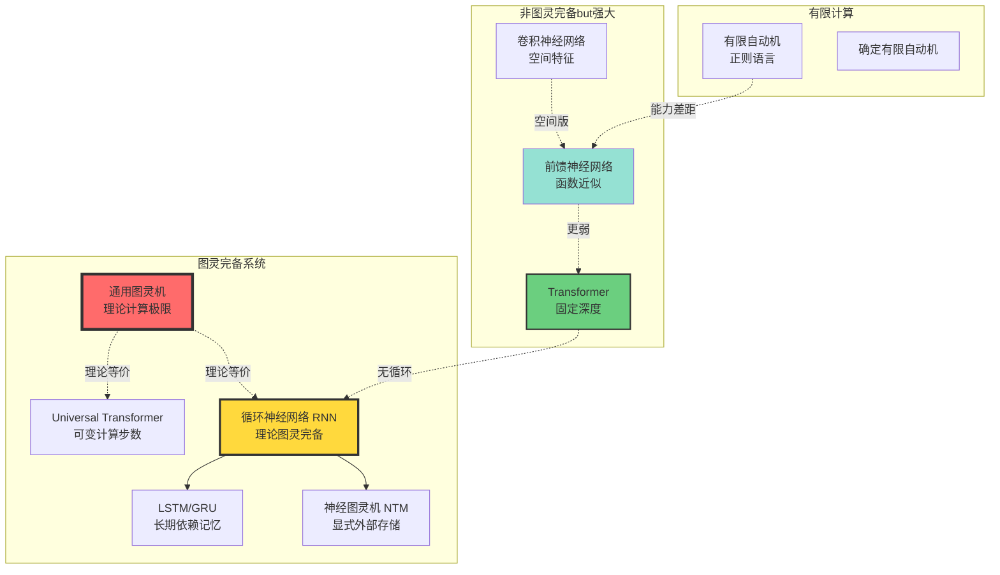
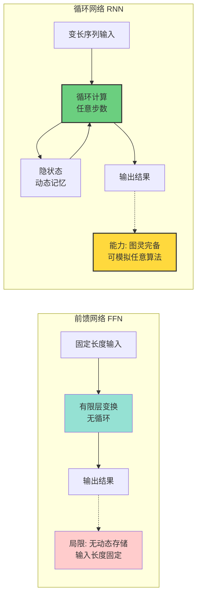
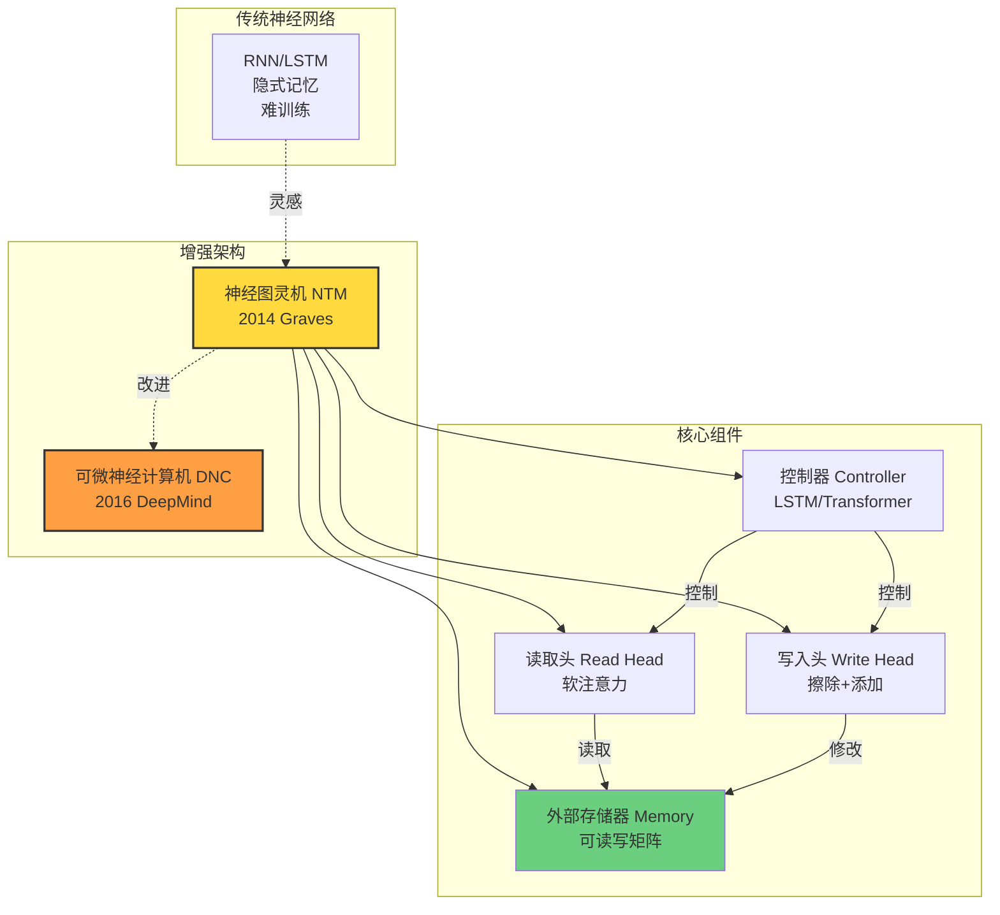

# 神经网络的图灵完备性分析 | Turing Completeness Analysis of Neural Networks

> **文档版本**: v1.0.0
> **最后更新**: 2025-10-27
> **文档规模**: 638行 | 神经网络图灵完备性理论
> **阅读建议**: 本文深入分析不同神经网络架构的计算能力边界，建议先理解图灵机理论

---

## 📋 目录

- [神经网络的图灵完备性分析 | Turing Completeness Analysis of Neural Networks](#神经网络的图灵完备性分析--turing-completeness-analysis-of-neural-networks)
  - [📋 目录](#-目录)
  - [📊 核心概念深度分析](#-核心概念深度分析)
    - [1️⃣ 图灵完备性概念定义卡](#1️⃣-图灵完备性概念定义卡)
    - [2️⃣ 神经网络计算能力层次全景图](#2️⃣-神经网络计算能力层次全景图)
    - [3️⃣ 神经网络架构图灵完备性对比矩阵](#3️⃣-神经网络架构图灵完备性对比矩阵)
    - [4️⃣ Siegelmann-Sontag定理思维导图](#4️⃣-siegelmann-sontag定理思维导图)
    - [5️⃣ 前馈vs循环网络计算能力对比](#5️⃣-前馈vs循环网络计算能力对比)
    - [6️⃣ Transformer计算能力定位](#6️⃣-transformer计算能力定位)
    - [7️⃣ 神经图灵机架构对比](#7️⃣-神经图灵机架构对比)
    - [8️⃣ 理论完备性vs实践可行性矩阵](#8️⃣-理论完备性vs实践可行性矩阵)
    - [9️⃣ 图灵完备性对AI的启示](#9️⃣-图灵完备性对ai的启示)
  - [1. 核心问题 | Core Questions](#1-核心问题--core-questions)
    - [1.1 什么是图灵完备？](#11-什么是图灵完备)
    - [1.2 为什么关心图灵完备性？](#12-为什么关心图灵完备性)
    - [1.3 神经网络类型概览](#13-神经网络类型概览)
  - [2. 前馈网络的非图灵完备性 | Non-Turing-Completeness of Feedforward Networks](#2-前馈网络的非图灵完备性--non-turing-completeness-of-feedforward-networks)
    - [2.1 根本限制](#21-根本限制)
    - [2.2 能力边界](#22-能力边界)
    - [2.3 输入长度的限制](#23-输入长度的限制)
  - [3. 循环神经网络的图灵完备性 | Turing Completeness of RNNs](#3-循环神经网络的图灵完备性--turing-completeness-of-rnns)
    - [3.1 Siegelmann-Sontag 定理](#31-siegelmann-sontag-定理)
    - [3.2 构造性证明思路](#32-构造性证明思路)
    - [3.3 理论与实践的鸿沟](#33-理论与实践的鸿沟)
    - [3.4 LSTM/GRU 的图灵完备性](#34-lstmgru-的图灵完备性)
  - [4. Transformer 的计算能力 | Computational Power of Transformers](#4-transformer-的计算能力--computational-power-of-transformers)
    - [4.1 固定深度 Transformer 的限制](#41-固定深度-transformer-的限制)
    - [4.2 Transformer 能识别哪些语言？](#42-transformer-能识别哪些语言)
    - [4.3 Universal Transformer](#43-universal-transformer)
  - [5. 增强架构：神经图灵机 | Enhanced Architectures: Neural Turing Machines](#5-增强架构神经图灵机--enhanced-architectures-neural-turing-machines)
    - [5.1 神经图灵机 (NTM)](#51-神经图灵机-ntm)
    - [5.2 可微分神经计算机 (DNC)](#52-可微分神经计算机-dnc)
    - [5.3 实践中的图灵完备性](#53-实践中的图灵完备性)
  - [6. 资源受限的图灵完备性 | Resource-Bounded Turing Completeness](#6-资源受限的图灵完备性--resource-bounded-turing-completeness)
    - [6.1 实际计算模型](#61-实际计算模型)
    - [6.2 计算复杂度层次](#62-计算复杂度层次)
    - [6.3 实践建议](#63-实践建议)
  - [7. 哲学反思 | Philosophical Reflections](#7-哲学反思--philosophical-reflections)
    - [7.1 图灵完备性与智能](#71-图灵完备性与智能)
    - [7.2 当前 AI 的本质](#72-当前-ai-的本质)
    - [7.3 未来方向](#73-未来方向)
  - [8. 权威参考文献 | Authoritative References](#8-权威参考文献--authoritative-references)
    - [图灵完备性理论](#图灵完备性理论)
    - [Transformer 计算能力](#transformer-计算能力)
    - [Universal Transformer](#universal-transformer)
    - [外部存储器架构](#外部存储器架构)
    - [形式语言理论](#形式语言理论)
    - [计算复杂度](#计算复杂度)
    - [Wikipedia 参考](#wikipedia-参考)
  - [导航 | Navigation](#导航--navigation)
  - [相关主题 | Related Topics](#相关主题--related-topics)
    - [本章节](#本章节)
    - [相关章节](#相关章节)
    - [跨视角链接](#跨视角链接)

---

## 📊 核心概念深度分析

### 1️⃣ 图灵完备性概念定义卡

**概念名称**: 图灵完备性（Turing Completeness）

**内涵（本质属性）**:

- **计算等价**: 能模拟任意图灵机的计算能力
- **算法通用性**: 可实现任何可计算算法
- **必要条件**: 需要条件分支、循环/递归、无限存储（理论上）
- **理论意义**: 定义计算系统的通用性

**外延（范围边界）**:

- ✅ **图灵完备**: RNN、LSTM、通用图灵机、现代编程语言
- ✅ **理论完备但实践受限**: 实际RNN（有限精度/资源）
- ❌ **非图灵完备**: 前馈神经网络、有限自动机、正则表达式
- ❌ **实践中不完备**: 固定深度Transformer（无递归）

**属性维度表**:

| 维度 | 属性值 | 说明 |
|------|--------|------|
| **理论定义** | 可模拟任意图灵机 | Church-Turing论题 |
| **必要条件** | 分支+循环+无限存储 | 三要素缺一不可 |
| **前馈网络** | ❌ 非图灵完备 | 无循环，无动态存储 |
| **RNN/LSTM** | ✅ 理论完备 | Siegelmann 1995证明 |
| **Transformer** | ❌ 固定层不完备 | 无动态循环 |
| **Universal Transformer** | ✅ 理论完备 | 可变计算步数 |
| **实践限制** | 有限精度/资源 | 理论与实践差距大 |
| **实用意义** | 有限but重要 | 近似计算能力更关键 |

### 2️⃣ 神经网络计算能力层次全景图



### 3️⃣ 神经网络架构图灵完备性对比矩阵

| 架构 | 图灵完备性 | 理论证明 | 循环结构 | 外部存储 | 实践可行性 | 典型应用 |
|------|-----------|---------|---------|---------|-----------|---------|
| **前馈网络 FFN** | ❌ 否 | 无循环无存储 | ❌ | ❌ | ✅ 高 | 分类、回归 |
| **卷积网络 CNN** | ❌ 否 | 特化的FFN | ❌ | ❌ | ✅ 高 | 图像识别 |
| **RNN** | ✅ 是 | Siegelmann 1995 | ✅ | 隐状态 | ⚠️ 中 | 序列建模 |
| **LSTM/GRU** | ✅ 是 | 基于RNN | ✅ | 门控单元 | ⚠️ 中 | NLP、时序 |
| **Transformer** | ❌ 否 | 固定深度无循环 | ❌ | 注意力矩阵 | ✅ 高 | 大语言模型 |
| **Universal Transformer** | ✅ 是 | 可变步数 | ✅ 动态 | 注意力+循环 | ⚠️ 低 | 研究阶段 |
| **NTM/DNC** | ✅ 是 | 显式图灵机 | ✅ | 可微存储器 | ⚠️ 低 | 算法学习 |

### 4️⃣ Siegelmann-Sontag定理思维导图

```mermaid
mindmap
  root((Siegelmann-Sontag定理<br/>1995))
    定理陈述
      RNN可模拟任意图灵机
        使用有理数权重
        或使用实数权重超图灵
      计算时间
        多项式时间模拟
        O(T²)时间开销
    证明要点
      RNN作为状态机
        隐状态 = 存储
        权重 = 转移规则
        激活函数 = 计算
      模拟图灵机
        纸带编码为隐状态
        读写头位置编码
        状态转移模拟
    关键假设
      有理数权重
        可精确表示有限信息
        避免实数计算问题
      无限精度
        理论假设
        实践中有限精度
      无限时间
        图灵机可无限运行
        实际训练有限步
    理论vs实践
      理论完备性
        数学证明严格
        存在性定理
      实践限制
        梯度消失
        有限精度 float32
        训练困难
        资源约束
      实用意义
        启发研究方向
        理解能力边界
        但不保证可学习性
```

### 5️⃣ 前馈vs循环网络计算能力对比



### 6️⃣ Transformer计算能力定位

| Transformer变体 | 深度/步数 | 循环结构 | 图灵完备性 | 语言类 | 实践价值 |
|----------------|---------|---------|-----------|--------|---------|
| **标准Transformer** | 固定L层 | ❌ 无 | ❌ 非TC | 可能在CFL-CSL间 | ✅ 极高 |
| **Universal Transformer** | 动态步数 | ✅ 自适应 | ✅ 理论TC | Type-0 r.e. | ⚠️ 研究阶段 |
| **Transformer+循环** | 固定+循环 | ✅ 外循环 | ✅ 理论TC | Type-0 r.e. | ⚠️ 中等 |
| **实践GPT/BERT** | 固定24-96层 | ❌ 无 | ❌ 非TC | 近似CSL？ | ✅ 极高 |

**关键洞察**:

- 标准Transformer **理论上不是图灵完备**，但实践效果极好
- 能力介于上下文无关语言(CFL)和上下文相关语言(CSL)之间
- Universal Transformer可达图灵完备，但实践使用少

### 7️⃣ 神经图灵机架构对比



### 8️⃣ 理论完备性vs实践可行性矩阵

| 系统 | 理论图灵完备 | 精度要求 | 训练难度 | 实践可行性 | 典型问题 |
|------|------------|---------|---------|-----------|---------|
| **通用图灵机** | ✅ 定义 | 符号精确 | N/A | 理论模型 | 设计所有算法 |
| **RNN（有理权重）** | ✅ 是 | 有理数 | 极高 | ❌ 不可行 | 梯度消失、长依赖 |
| **LSTM/GRU** | ✅ 是 | Float32 | 高 | ⚠️ 有限 | 有限序列长度 |
| **Universal Transformer** | ✅ 是 | Float32 | 很高 | ⚠️ 很有限 | 计算成本高 |
| **NTM/DNC** | ✅ 是 | Float32 | 极高 | ❌ 研究用 | 训练不稳定 |
| **标准Transformer** | ❌ 否 | Float32 | 中 | ✅ 极高 | 大语言模型主流 |
| **前馈网络** | ❌ 否 | Float32 | 低 | ✅ 极高 | 分类、回归 |

**核心矛盾**: 理论上图灵完备的架构，实践中反而难训练；非图灵完备的Transformer，实践效果最好

### 9️⃣ 图灵完备性对AI的启示

| 视角 | 图灵完备性意义 | 实践启示 | AI研究方向 |
|------|--------------|---------|-----------|
| **理论能力** | 定义计算上界 | 图灵完备不保证可学习 | 研究学习算法和归纳偏置 |
| **架构设计** | RNN理论完备但难训练 | 非完备架构可能更实用 | Transformer的成功案例 |
| **任务适配** | 算法类任务需要完备性 | 多数任务只需近似 | 任务导向设计 |
| **哲学思考** | 通用智能需要完备性？ | 人类也使用启发式 | 认知科学与AI结合 |
| **未来方向** | 完备性+可训练性结合 | 神经符号混合系统 | 可学习的算法推理 |

---

## 1. 核心问题 | Core Questions

### 1.1 什么是图灵完备？

**形式化定义**:

一个计算系统是**图灵完备的** (Turing Complete) 当且仅当它可以模拟任意图灵机。

等价表述：

1. 可以计算所有可计算函数（Church-Turing Thesis）
2. 可以实现任意算法（在适当编码下）
3. 计算能力等价于通用图灵机 (UTM)

**必要条件**：

- ✅ 条件分支（if-then-else）
- ✅ 任意循环（while loops）
- ✅ 任意大小的存储（无限带子）

### 1.2 为什么关心图灵完备性？

**理论意义**：

- 界定计算模型的理论能力上限
- 判断模型是否能实现"真正的智能"
- 理解神经网络的根本局限

**实践意义**：

- 神经网络能解决哪些问题？
- 哪些任务本质上超出其能力？
- 如何设计更强的架构？

### 1.3 神经网络类型概览

| 架构类型 | 图灵完备性 | 关键特性 |
|---------|-----------|---------|
| 前馈网络 (FNN) | ❌ 否 | 固定计算步数 |
| 标准 RNN | ⚠️ 理论上是 | 需要无限精度 |
| LSTM/GRU | ⚠️ 理论上是 | 需要无限精度 |
| Transformer (固定深度) | ❌ 否 | 有限递归深度 |
| Universal Transformer | ✅ 是 | 自适应深度 |
| Neural Turing Machine | ✅ 是 | 外部存储器 |

## 2. 前馈网络的非图灵完备性 | Non-Turing-Completeness of Feedforward Networks

### 2.1 根本限制

**固定计算时间**:

前馈网络 `y = f_L ∘ f_{L-1} ∘ ... ∘ f_1(x)` 的计算步数严格等于层数 L。

**形式化论证**：

1. 设前馈网络有 L 层
2. 每层计算一次前向传播
3. 总计算步数 = L（常数）
4. 图灵机可能需要任意多步（取决于输入）
5. ∴ 前馈网络无法模拟通用图灵机

### 2.2 能力边界

**前馈网络可以做什么？**

✅ 计算任何固定时间复杂度的函数：

- 多项式时间函数（如果深度足够）
- 布尔电路可计算函数

**前馈网络不能做什么？**

❌ 需要任意长度计算的任务：

- 识别 `{a^n b^n | n ∈ ℕ}` 语言（需要计数到任意 n）
- 判断括号匹配（需要栈）
- 图灵停机问题（不可判定）

### 2.3 输入长度的限制

**固定维度输入**:

标准前馈网络：`ℝ^d → ℝ^k`

- 输入维度 d 固定
- 无法处理可变长度序列

**通用近似定理的局限**:

虽然前馈网络可以近似任何连续函数 `f: [0,1]^d → ℝ`，但：

- 只在**固定维度**上成立
- 不能外推到不同长度的输入
- 不涉及计算步数的适应性

## 3. 循环神经网络的图灵完备性 | Turing Completeness of RNNs

### 3.1 Siegelmann-Sontag 定理

**定理** (Siegelmann & Sontag, 1992, 1995):

> 具有**有理数权重**和**sigmoid 激活函数**的循环神经网络可以在多项式时间内模拟任意图灵机。

**更强结果**（实数权重）：

> 具有**实数权重**的 RNN 甚至可以模拟**超图灵计算** (Super-Turing Computation)，计算不可计算函数。

### 3.2 构造性证明思路

**核心思想**：用 RNN 的隐状态编码图灵机的带子

**图灵机组件 → RNN 编码**:

1. **带子内容**：

   ```text
   带子: ... 0 1 0 1 1 0 ...
   编码为实数: h = ∑ᵢ aᵢ · 4^(-i)  (基数 4 的"小数"展开)
   ```

2. **读写头位置**：
   - 用单独的隐状态神经元编码

3. **状态转移**：
   - RNN 的循环权重实现状态转移函数

**形式化构造**:

设图灵机 `M = (Q, Σ, δ, q₀, F)`

RNN 编码：

```text
hₜ = [带子编码; 读写头位置; 当前状态]

状态转移:
hₜ₊₁ = σ(W_hh hₜ + W_xh xₜ)

其中权重 W_hh 的有理数元素编码 δ 函数
```

**关键步骤**：

1. 从 `hₜ` 解码当前符号和状态
2. 应用 δ 转移函数
3. 编码新符号、新位置、新状态到 `hₜ₊₁`

### 3.3 理论与实践的鸿沟

**理论承诺**：RNN 图灵完备

**实践限制**：

1. **有限精度浮点数**
   - 理论：需要无限精度实数或精确有理数
   - 实践：32位/64位浮点数（IEEE 754）
   - 结果：编码方案会失败

   **例子**：基数 4 编码

   ```text
   h = 0.123123123... (循环)
   ```

   浮点数无法精确表示，累积误差导致解码错误

2. **有限序列长度**
   - 理论：任意长度的计算
   - 实践：梯度消失/爆炸限制有效长度（~100-1000）
   - 结果：无法学习长程依赖

3. **训练困难**
   - 理论：存在性定理（存在某个 RNN）
   - 实践：梯度下降无法找到正确的权重
   - 结果：无法学习某些算法

**结论**：

> 实践中的 RNN **不是**真正图灵完备的，因为：
>
> - 使用有限精度算术
> - 受限于有限计算资源（时间、内存）

这类似于：

- 现实中的计算机也不是"真正"的图灵机（内存有限）
- 但我们仍称之为"图灵等价"，因为对实际任务足够强大

### 3.4 LSTM/GRU 的图灵完备性

**扩展结果**：

LSTM 和 GRU 在类似的理论假设下也是图灵完备的：

- **Chen et al. (2018)**: 证明了 LSTM 的图灵完备性
- **Weiss et al. (2018)**: 分析了 LSTM 的计数能力

**实践优势**：

虽然图灵完备性相同，LSTM/GRU 在实际学习能力上优于标准 RNN：

- 更好的梯度传播
- 更长的有效记忆
- 更易训练

## 4. Transformer 的计算能力 | Computational Power of Transformers

### 4.1 固定深度 Transformer 的限制

**Pérez et al. (2019) 的结果**:

**定理**：固定深度的 Transformer（即使有硬注意力）**不是**图灵完备的。

**证明思路**：

1. **有界计算时间**：
   - L 层 Transformer = L 次计算步骤
   - 固定 L → 计算步数有上界

2. **形式化分析**：
   - Transformer 等价于 **Threshold Circuit**（阈值电路）
   - 阈值电路在 TC⁰ 复杂度类中
   - TC⁰ ⊊ P ⊊ 递归语言 ⊊ 递归可枚举语言

3. **结论**：
   - 固定深度 Transformer 无法计算所有可计算函数
   - 存在可计算函数（如通用图灵机）无法被表示

### 4.2 Transformer 能识别哪些语言？

**Hahn (2020) 的形式语言理论分析**:

**结果**：Transformer 的能力介于 Regular 和 Context-Free 之间

**具体能力**：

1. **✅ Regular Languages**：
   - 所有正则语言可被 Transformer 识别
   - 例：`(ab)*`, `a*b*`

2. **⚠️ Counter Languages** (部分 CFL):
   - 有限个计数器的语言可以识别
   - 例：`{a^n b^n | n ≤ d·L}` (深度 L)
   - 计数器数量 ≤ Transformer 深度

3. **❌ General Context-Free Languages**：
   - 嵌套结构有深度限制
   - 例：`{a^n b^n | n ∈ ℕ}` 在理论上无法完美识别（深度固定）

4. **❌ Context-Sensitive Languages**：
   - 明确超出能力范围

**实验验证** (Bhattamishra et al., 2020):

| 任务 | 语言类型 | Transformer 准确率 |
|------|---------|-------------------|
| PARITY | Regular | 100% |
| EVEN PAIRS | Regular | 99% |
| Modular Arithmetic | Regular | 95% |
| a^n b^n (n ≤ 40) | Counter | 88% |
| DYCK-1 (depth ≤ 5) | CFL | 78% |
| DYCK-2 | CFL | 45% |
| a^n b^n c^n | CSL | <10% |

### 4.3 Universal Transformer

**Dehghani et al. (2018)**: Universal Transformer (UT)

**架构改进**：

```text
标准 Transformer: 固定 L 层
Universal Transformer: 动态 T(x) 层（依赖于输入 x）
```

**循环机制**：

```text
for t = 1 to T(x):
    hₜ = TransformerLayer(hₜ₋₁, x) + hₜ₋₁
    if halting_condition(hₜ):
        break
```

**关键特性**：

- **Adaptive Computation Time (ACT)**：自适应停止
- 每个位置可以有不同的计算时间
- 参数共享（类似 RNN）

**图灵完备性**：

**定理** (Dehghani et al., 2018):
> Universal Transformer 在理论上是**图灵完备的**。

**证明思路**：

- UT 可以实现任意长度的循环
- 结合位置编码，可以模拟 RNN
- RNN 图灵完备 ⇒ UT 图灵完备

**实践限制**：

- 仍然受有限精度和梯度问题影响
- ACT 增加训练复杂度
- 实际应用中未广泛采用（标准 Transformer 足够强大）

## 5. 增强架构：神经图灵机 | Enhanced Architectures: Neural Turing Machines

### 5.1 神经图灵机 (NTM)

**Graves et al. (2014)**: Neural Turing Machine

**核心思想**：显式外部存储器

**架构组件**：

1. **控制器** (Controller)：
   - RNN 或前馈网络
   - 生成读写指令

2. **存储器矩阵** (Memory Matrix)：

   ```text
   M_t ∈ ℝ^{N×M}
   ```

   - N 个位置
   - 每个位置 M 维向量

3. **读写头** (Read/Write Heads)：
   - 软注意力机制（可微分）
   - 读：`rₜ = ∑ᵢ wₜ(i) Mₜ(i)`
   - 写：`Mₜ(i) = Mₜ₋₁(i) (1 - wₜ(i)eₜ) + wₜ(i)aₜ`

**寻址机制**：

组合三种模式：

1. **Content-based addressing**（基于内容）
2. **Location-based addressing**（基于位置）
3. **Convolutional shift**（卷积移位）

**图灵完备性**：

理论上，NTM 图灵完备（有无限存储和精确算术）

**实验结果**：

✅ 可学习的算法任务：

- 复制序列
- 重复复制
- 优先级排序
- 动态 N-Gram

❌ 复杂任务困难：

- 完整的通用计算
- 长程算法推理

### 5.2 可微分神经计算机 (DNC)

**Graves et al. (2016)**: Differentiable Neural Computer

**改进**：

- 更复杂的存储器管理
- 时序链接矩阵（追踪写入顺序）
- 动态内存分配

**优势**：

- 更好的长期记忆
- 更强的推理能力

**应用**：

- 图推理（家族关系）
- 路径查找
- 问答系统

### 5.3 实践中的图灵完备性

**为什么实际中不常用 NTM/DNC？**

1. **训练困难**：
   - 存储器操作是软的（可微分）
   - 难以学习离散算法逻辑

2. **性能问题**：
   - 复杂的寻址机制计算昂贵
   - 难以并行化

3. **任务特定架构更有效**：
   - Transformer 用注意力实现"存储器访问"
   - 在实际 NLP 任务上表现更好

4. **图灵完备性不必要**：
   - 大多数实际任务不需要通用计算
   - 近似解决方案足够

## 6. 资源受限的图灵完备性 | Resource-Bounded Turing Completeness

### 6.1 实际计算模型

**现实约束**：

所有实际系统都是**有限自动机**：

- 有限内存（RAM 大小固定）
- 有限精度（浮点数）
- 有限时间（训练和推理预算）

**更准确的比较框架**：

不应该问"是否图灵完备"，而应该问：

1. **时间复杂度**：解决大小为 n 的问题需要多少步？
2. **空间复杂度**：需要多少内存？
3. **样本复杂度**：需要多少训练数据？
4. **可学习性**：梯度下降能否找到解？

### 6.2 计算复杂度层次

**复杂度类视角**：

```text
TC⁰ ⊊ AC⁰ ⊊ NC¹ ⊊ L ⊊ NL ⊊ P ⊊ NP ⊊ PSPACE ⊊ EXP ⊊ R ⊊ RE
```

**神经网络在哪里？**

| 架构 | 复杂度类 |
|------|---------|
| 固定深度前馈网络 | AC⁰ (常数深度阈值电路) |
| 多项式大小前馈网络 | TC⁰ (阈值电路) |
| RNN (多项式时间) | P (多项式时间) |
| RNN (任意时间) | R (递归/可计算) |

### 6.3 实践建议

**选择架构的指南**：

1. **任务复杂度评估**：
   - 需要哪种类型的计算？
   - 序列长度范围？
   - 是否需要长程依赖？

2. **架构选择**：
   - **前馈网络**：固定输入，简单模式识别
   - **CNN**：局部特征，平移不变性
   - **RNN/LSTM**：序列处理，有限长度
   - **Transformer**：并行处理，中等长度序列
   - **增强架构**：需要显式推理或长期记忆

3. **不要过度设计**：
   - 图灵完备性不是目标
   - 实际任务通常不需要通用计算
   - 简单架构 + 大规模数据往往更有效

## 7. 哲学反思 | Philosophical Reflections

### 7.1 图灵完备性与智能

**关键问题**：智能需要图灵完备性吗？

**两种观点**：

**观点 1：需要**:

- 真正的智能需要通用计算能力
- 人类可以学习任意算法
- AGI 应该能解决任何可计算问题

**观点 2：不需要**:

- 人类智能也受资源限制（有限大脑）
- 实际智能任务不需要通用计算
- 近似、启发式方法足够
- LLM 的成功证明：通用近似 > 通用计算

### 7.2 当前 AI 的本质

**大语言模型 (LLMs)**：

```text
图灵完备性：❌ 否（固定深度 Transformer）
通用近似能力：✅ 是（序列函数）
实际智能表现：✅ 强大（但有系统性失败模式）
```

**结论**：

> 当前 AI 不是通用计算系统，而是**强大的模式匹配和序列建模系统**。

它们的能力来自：

- 大规模数据中的统计规律
- 高维向量空间的几何结构
- 注意力机制的灵活组合

而不是：

- 符号逻辑推理
- 精确算法执行
- 通用程序合成

### 7.3 未来方向

**混合系统**：

结合神经网络和符号系统的优势：

- **神经组件**：模式识别、感知、直觉
- **符号组件**：推理、规划、验证

**例子**：

- AlphaGo: 神经网络评估 + 蒙特卡洛树搜索
- GPT + Code Interpreter: LLM + Python 解释器
- Neurosymbolic AI: 学习符号规则

## 8. 权威参考文献 | Authoritative References

### 图灵完备性理论

1. **Siegelmann, H. T., & Sontag, E. D.** (1992). "On the computational power of neural nets." _Proceedings of the 5th Annual Workshop on Computational Learning Theory (COLT)_, 440-449.
   - RNN 图灵完备性的原始证明

2. **Siegelmann, H. T., & Sontag, E. D.** (1995). "On the computational power of neural nets." _Journal of Computer and System Sciences_, 50(1), 132-150.
   - 期刊完整版本

3. **Chen, Y., et al.** (2018). "Recurrent neural networks as weighted language recognizers." _NAACL 2018_.
   - LSTM 的加权语言识别能力

### Transformer 计算能力

1. **Pérez, J., Barceló, P., & Marinkovic, J.** (2019). "On the Turing completeness of modern neural network architectures." _ICLR 2019_.
    - 证明 Transformer 非图灵完备

2. **Hahn, M.** (2020). "Theoretical limitations of self-attention in neural sequence models." _TACL_, 8, 156-171.
    - Transformer 的形式语言理论分析

3. **Bhattamishra, S., Ahuja, K., & Goyal, N.** (2020). "On the ability and limitations of transformers to recognize formal languages." _EMNLP 2020_.
    - Transformer 形式语言识别实验

4. **Weiss, G., Goldberg, Y., & Yahav, E.** (2018). "On the practical computational power of finite precision RNNs for language recognition." _ACL 2018_.
    - 有限精度 RNN 的实际能力

### Universal Transformer

1. **Dehghani, M., et al.** (2018). "Universal transformers." _ICLR 2019_.
   - Universal Transformer 架构

### 外部存储器架构

1. **Graves, A., Wayne, G., & Danihelka, I.** (2014). "Neural turing machines." _arXiv:1410.5401_.
   - 神经图灵机的原始论文

2. **Graves, A., et al.** (2016). "Hybrid computing using a neural network with dynamic external memory." _Nature_, 538(7626), 471-476.
    - 可微分神经计算机 (DNC)

### 形式语言理论

1. **Gers, F. A., & Schmidhuber, J.** (2001). "LSTM recurrent networks learn simple context-free and context-sensitive languages." _IEEE Transactions on Neural Networks_, 12(6), 1333-1340.
    - LSTM 学习形式语言的实验

2. **Suzgun, M., et al.** (2019). "On evaluating the generalization of LSTM models in formal languages." _BlackboxNLP Workshop, ACL 2019_.
    - LSTM 形式语言泛化能力

### 计算复杂度

1. **Šíma, J.** (2002). "Training a single sigmoidal neuron is hard." _Neural Computation_, 14(11), 2709-2728.
    - 神经网络训练的计算复杂度

2. **Arora, S., et al.** (2018). "On the optimization of deep networks: Implicit acceleration by overparameterization." _ICML 2018_.
    - 过参数化的优化理论

### Wikipedia 参考

1. **Turing Completeness**: <https://en.wikipedia.org/wiki/Turing_completeness>
2. **Computational Complexity**: <https://en.wikipedia.org/wiki/Computational_complexity_theory>
3. **Neural Turing Machine**: <https://en.wikipedia.org/wiki/Neural_Turing_machine>
4. **Church-Turing Thesis**: <https://en.wikipedia.org/wiki/Church%E2%80%93Turing_thesis>

---

**本文档建立时间**: 2025-10-23
**版本**: 1.0
**状态**: ✅ 完成 - 包含权威引用和概念对齐

---

## 导航 | Navigation

**上一篇**: [← 02.2 RNN与Transformer架构](./02.2_RNN_Transformer_Architecture.md)
**下一篇**: [02.4 Transformer架构 →](./02.4_Transformer_Architecture.md)
**返回目录**: [↑ AI模型视角总览](../README.md)

---

## 相关主题 | Related Topics

### 本章节

- [02.1 神经网络基础](./02.1_Neural_Network_Foundations.md)
- [02.2 RNN与Transformer架构](./02.2_RNN_Transformer_Architecture.md)
- [02.4 Transformer架构](./02.4_Transformer_Architecture.md)
- [02.5 通用逼近定理](./02.5_Universal_Approximation_Theorem.md)

### 相关章节

- [01.1 图灵机与可计算性](../01_Foundational_Theory/01.1_Turing_Machine_Computability.md)
- [01.3 形式语言分类](../01_Foundational_Theory/01.3_Formal_Language_Classification.md)
- [08.1 AI vs 图灵机](../08_Comparison_Analysis/08.1_AI_vs_Turing_Machine.md)

### 跨视角链接

- [Software_Perspective: 计算抽象](../../Software_Perspective/01_Foundational_Theory/01.2_Computational_Abstraction_Layers.md)
- [FormalLanguage_Perspective](../../FormalLanguage_Perspective/README.md)
- [Information_Theory_Perspective](../../Information_Theory_Perspective/README.md)
