# 2.4 Transformer Architecture

> **子主题编号**: 02.4
> **主题**: AI模型视角
> **子主题编号**: 02.4
> **主题**: AI模型视角
> **最后更新**: 2025-10-27
> **文档规模**: 821行 | Transformer架构详解与注意力机制
> **阅读建议**: 本文详细解析Transformer的核心机制，是理解现代大语言模型的关键基础

---

## 📋 目录

- [2.4 Transformer Architecture](#24-transformer-architecture)
  - [📋 目录](#-目录)
  - [1 核心概念深度分析](#1-核心概念深度分析)
    - [1.1 Transformer架构概念定义卡](#11-transformer架构概念定义卡)
    - [1.2 Transformer架构全景图谱](#12-transformer架构全景图谱)
    - [1.3 三种注意力机制深度对比](#13-三种注意力机制深度对比)
    - [1.4 位置编码详解与四种方案对比](#14-位置编码详解与四种方案对比)
    - [1.5 Transformer vs RNNCNN 全维度对比](#15-transformer-vs-rnncnn-全维度对比)
    - [1.6 核心洞察与终极评估](#16-核心洞察与终极评估)
  - [相关主题 | Related Topics](#相关主题--related-topics)
    - [1.7 本章节](#17-本章节)
    - [1.8 相关章节](#18-相关章节)
    - [1.9 跨视角链接](#19-跨视角链接)

## 1 核心概念深度分析

<details>
<summary><b>⚡🔷 点击展开：Transformer架构全景深度解析</b></summary>

本节深入剖析Transformer架构设计哲学、自注意力数学原理、六大关键组件与高效变体。

### 1.1 Transformer架构概念定义卡

**概念名称**: Transformer Architecture（注意力即一切）

**内涵（本质属性）**:

**🔹 核心定义**:
Transformer是完全基于注意力机制的序列到序列架构，通过自注意力实现全局并行建模，彻底抛弃RNN/CNN，成为2017-2024年AI的主导架构。

$$
\text{Transformer} = \underbrace{\text{多头自注意力}}_{\text{全局依赖}} + \underbrace{\text{位置编码}}_{\text{序列信息}} + \underbrace{\text{前馈网络}}_{\text{非线性}}
$$

**🔹 架构六大核心组件**:

| 组件 | 作用 | 复杂度 | 关键参数 | 创新点 |
|------|------|--------|---------|--------|
| **1. 多头自注意力** | 全局依赖建模 | O(n²d) | h=8头 | **核心创新** |
| **2. 位置编码** | 注入序列顺序 | O(nd) | 正弦/可学习 | 补偿无归纳偏置 |
| **3. 前馈网络** | 非线性变换 | O(nd²) | d_ff=4d | 位置独立 |
| **4. 残差连接** | 梯度流动 | O(nd) | - | 训练深层网络 |
| **5. 层归一化** | 稳定训练 | O(nd) | - | Post-Norm/Pre-Norm |
| **6. Dropout** | 正则化 | O(1) | p=0.1 | 防止过拟合 |

**外延（范围边界）**:

| 维度 | Transformer包含 ✅ | 不包含 ❌ |
|------|-----------------|----------|
| **架构** | 编码器、解码器、自注意力 | RNN、LSTM、CNN卷积 |
| **变体** | BERT、GPT、T5、ViT | AlexNet、ResNet |
| **应用** | NLP、CV、音频、多模态 | 强化学习纯策略网络 |

**属性维度表**:

| 维度 | 值/描述 | 说明 |
|------|---------|------|
| **论文** | "Attention Is All You Need" (2017) | Vaswani et al. |
| **参数量** | 原始: 65M（base）, 213M（large） | 现代: 1B-1T+ |
| **层数** | 原始: N=6 | 现代: 12-96+ |
| **注意力头数** | 原始: h=8 | 现代: 8-128 |
| **隐藏维度** | 原始: d=512（base）, 1024（large） | 现代: 768-12288+ |
| **复杂度** | O(n²d) | n²瓶颈 |
| **主导期** | 2017-现在 | 仍在主导 |

---

### 1.2 Transformer架构全景图谱

```mermaid
graph TB
    Input[输入序列<br/>x₁, x₂, ..., xₙ]

    Input --> Embed[嵌入层<br/>Embedding]
    Embed --> PosEnc[位置编码<br/>Positional Encoding]

    PosEnc --> Encoder[编码器<br/>N=6层]

    Encoder --> EncLayer1[编码器层 1]
    EncLayer1 --> EncLayer2[编码器层 2-6]

    EncLayer1 --> SelfAttn[多头自注意力<br/>Multi-Head Self-Attention]
    SelfAttn --> Add1[残差+归一化<br/>Add & Norm]
    Add1 --> FFN[前馈网络<br/>Feed-Forward]
    FFN --> Add2[残差+归一化<br/>Add & Norm]

    EncLayer2 --> Memory[编码器输出<br/>Memory]

    Memory --> Decoder[解码器<br/>N=6层]

    Decoder --> DecLayer1[解码器层 1]
    DecLayer1 --> DecLayer2[解码器层 2-6]

    DecLayer1 --> MaskedAttn[掩码自注意力<br/>Masked Self-Attention]
    MaskedAttn --> Add3[残差+归一化]
    Add3 --> CrossAttn[交叉注意力<br/>Cross-Attention]
    CrossAttn --> Add4[残差+归一化]
    Add4 --> FFN2[前馈网络]
    FFN2 --> Add5[残差+归一化]

    DecLayer2 --> Output[线性+Softmax<br/>Output]

    SelfAttn --> Formula1[Attention&#40;Q,K,V&#41; =<br/>softmax&#40;QKᵀ/√dₖ&#41;V]

    CrossAttn --> Formula2[Q from Decoder<br/>K,V from Encoder]

    Components[六大关键组件]
    Components --> C1[多头注意力<br/>h=8头并行]
    Components --> C2[位置编码<br/>PE&#40;pos,2i&#41;=sin&#40;...&#41;]
    Components --> C3[前馈网络<br/>ReLU&#40;xW₁+b₁&#41;W₂+b₂]
    Components --> C4[残差连接<br/>x + Sublayer&#40;x&#41;]
    Components --> C5[层归一化<br/>LayerNorm&#40;x&#41;]
    Components --> C6[Dropout<br/>p=0.1]

    Complexity[复杂度分析]
    Complexity --> Comp1[自注意力: O&#40;n²d&#41;]
    Complexity --> Comp2[前馈: O&#40;nd²&#41;]
    Complexity --> Comp3[总计: O&#40;n²d + nd²&#41;]
    Complexity --> Comp4[瓶颈: n²项]

    style Input fill:#3498db,stroke:#333,stroke-width:4px
    style Encoder fill:#2ecc71,stroke:#333,stroke-width:4px
    style Decoder fill:#9b59b6,stroke:#333,stroke-width:4px
    style Components fill:#e67e22,stroke:#333,stroke-width:4px
    style Complexity fill:#e74c3c,stroke:#333,stroke-width:4px
```



---

### 1.3 三种注意力机制深度对比

| 注意力类型 | Q来源 | K来源 | V来源 | 掩码 | 位置 | 作用 |
|-----------|------|------|------|------|------|------|
| **自注意力<br/>Self-Attention** | 输入 | 输入 | 输入 | ❌ 无 | 编码器 | 全局依赖建模 |
| **掩码自注意力<br/>Masked Self-Attn** | 输出 | 输出 | 输出 | ✅ 因果掩码 | 解码器 | 防止看到未来 |
| **交叉注意力<br/>Cross-Attention** | 解码器 | 编码器 | 编码器 | ❌ 无 | 解码器 | 对齐源与目标 |

**数学公式详解**:

$$
\begin{align}
\text{1. 缩放点积注意力} &: \\
\text{Attention}(Q, K, V) &= \text{softmax}(\frac{QK^T}{\sqrt{d_k}})V \\
\\
\text{2. 多头注意力} &: \\
\text{MultiHead}(Q,K,V) &= \text{Concat}(\text{head}_1, ..., \text{head}_h)W^O \\
\text{where } \text{head}_i &= \text{Attention}(QW_i^Q, KW_i^K, VW_i^V) \\
\\
\text{3. 掩码自注意力} &: \\
\text{Attention}_{\text{masked}}(Q, K, V) &= \text{softmax}(\frac{QK^T}{\sqrt{d_k}} + M)V \\
M_{ij} &= \begin{cases} 0 & i \leq j \\ -\infty & i > j \end{cases}
\end{align}
$$

**深度分析**:

```yaml
自注意力（Self-Attention）:
  Q=K=V: 同一序列

  计算步骤:
    1. 线性变换: Q=XW^Q, K=XW^K, V=XW^V
    2. 点积相似度: S = QK^T / √d_k
    3. Softmax权重: A = softmax(S)
    4. 加权求和: Output = AV

  几何意义:
    - Q·K^T: 每对位置的相似度
    - Softmax: 归一化为概率分布
    - A·V: 根据相关性聚合信息

  为什么缩放√d_k?
    - 高维空间点积方差大
    - QK^T ~ N(0, d_k) → 方差爆炸
    - 除以√d_k → 稳定方差
    - 防止softmax饱和、梯度消失

多头注意力（Multi-Head）:
  动机: 单头注意力只能捕获一种关系

  多头优势:
    - 不同子空间捕获不同模式
    - head_1: 语法依赖（主谓宾）
    - head_2: 语义关系（同义、反义）
    - head_3: 位置关系（相邻、远程）
    - ...

  类比: CNN多通道（RGB分别处理）

  参数量:
    - 单头: d×d (Q,K,V)
    - h头: h×(d/h)×d = d×d (相同！)
    - 多头不增参数，增多样性

掩码自注意力（Masked）:
  动机: 解码器自回归生成

  因果掩码:
    - 位置i只能看到≤i的位置
    - 防止"看到未来"
    - 训练时并行，推理时顺序

  实现:
    - 上三角矩阵设为-∞
    - Softmax后权重为0
    → 未来位置不影响当前

交叉注意力（Cross-Attention）:
  动机: 对齐源序列（编码器）与目标序列（解码器）

  机制:
    - Q from 解码器
    - K, V from 编码器
    - 解码器查询编码器内容

  类比: 机器翻译
    - 生成每个目标词时
    - 动态关注相关源词
    - 实现软对齐
```

---

### 1.4 位置编码详解与四种方案对比

| 方案 | 类型 | 公式 | 优势 | 劣势 | 采用 |
|------|------|------|------|------|------|
| **正弦位置编码** | 固定 | $PE_{(pos,2i)}=\sin(\frac{pos}{10000^{2i/d}})$ | 外推性好 | 不可学习 | 原始Transformer |
| **可学习位置编码** | 可学习 | 嵌入层 | 灵活 | 不能外推 | BERT, GPT |
| **相对位置编码** | 相对 | $a_{ij}^K = x_iW^Q(x_jW^K + r_{i-j})^T$ | 长度无关 | 复杂 | Transformer-XL |
| **旋转位置编码(RoPE)** | 旋转 | $f(q, m) = q e^{im\theta}$ | 外推+相对 | 需重新实现 | LLaMA, GPT-NeoX |

**正弦位置编码数学**:

$$
\begin{align}
PE_{(pos, 2i)} &= \sin(\frac{pos}{10000^{2i/d_{model}}}) \\
PE_{(pos, 2i+1)} &= \cos(\frac{pos}{10000^{2i/d_{model}}})
\end{align}
$$

**为什么用正弦？**

```yaml
动机: Transformer无归纳偏置（位置无关）
  → 需显式注入位置信息

正弦编码优势:
  1. 外推性:
     - 训练长度512 → 推理1024
     - 正弦函数周期性
     - 新位置可计算

  2. 相对位置:
     - PE(pos+k) = f(PE(pos))
     - 线性变换可表达相对距离
     - 帮助学习位置依赖

  3. 固定参数:
     - 不占参数量
     - 不需学习

  4. 唯一性:
     - 每个位置编码唯一
     - 高维空间分散

缺点:
  - 不如可学习编码灵活
  - 现代LLM多用可学习
  - GPT/BERT: 可学习绝对位置
  - LLaMA: RoPE（旋转编码）
```

---

### 1.5 Transformer vs RNNCNN 全维度对比

| 维度 | RNN/LSTM | CNN | Transformer | 最优 |
|------|---------|-----|------------|------|
| **并行性** | ❌ 顺序 | ✅✅✅ 完全 | ✅✅✅ 完全 | CNN/Trans |
| **长程依赖** | ⚠️ 受限（梯度衰减） | ❌ 固定窗口 | ✅✅✅ 全局 | **Trans** |
| **归纳偏置** | ✅ 时序 | ✅ 局部性 | ❌ 无（需位置编码） | RNN/CNN |
| **参数效率** | ✅✅ 高 | ✅✅ 高（共享） | ⚠️ 低（大） | RNN/CNN |
| **计算复杂度** | O(n) | O(n) | ⚠️ O(n²) | RNN/CNN |
| **内存占用** | O(1) | O(1) | ⚠️ O(n²) | RNN/CNN |
| **可解释性** | ❌ 低 | ⚠️ 中（卷积核） | ✅ 中高（注意力图） | **Trans** |
| **训练速度** | ❌ 慢 | ✅✅ 快 | ✅✅ 快 | CNN/Trans |
| **泛化能力** | ⚠️ 中 | ⚠️ 中 | ✅✅✅ 强（大规模） | **Trans** |
| **实际性能（NLP）** | ⚠️ 已淘汰 | ⚠️ 特定任务 | ✅✅✅ SOTA | **Trans** |
| **实际性能（CV）** | ❌ 不适用 | ✅✅✅ 强（CNN仍主流） | ✅✅ 强（ViT崛起） | CNN/ViT |

**关键洞察**:

$$
\begin{align}
\text{RNN} &: \text{时序归纳偏置} + \text{顺序瓶颈} \Rightarrow \text{已淘汰} \\
\text{CNN} &: \text{局部归纳偏置} + \text{并行高效} \Rightarrow \text{CV仍强} \\
\text{Transformer} &: \text{无偏置通用性} + \text{n²瓶颈} \Rightarrow \text{NLP主导}
\end{align}
$$

---

### 1.6 核心洞察与终极评估

**五大核心定律**:

1. **注意力即一切定律**（Vaswani et al. 2017）
   - 完全抛弃RNN/CNN
   - 仅用注意力+前馈实现SOTA
   - 证明：归纳偏置非必须

2. **O(1)路径定律**
   $$
   \text{RNN路径长度} = O(n), \quad \text{Transformer路径长度} = O(1)
   $$
   - 任意两位置直接连接
   - 无梯度衰减

3. **n²瓶颈定律**
   $$
   \text{复杂度} = O(n^2 d), \quad \text{内存} = O(n^2)
   $$
   - 上下文长度受限
   - 2K→128K演进艰难

4. **多头多样性定律**
   - h个头 → h个子空间
   - 捕获多种关系（语法、语义、位置）
   - 类似CNN多通道

5. **架构简化-规模扩大定律**
   - 2017-2024: 架构趋简（仅解码器）
   - 复杂度→规模（1B→1T参数）
   - Scaling Laws驱动

**终极洞察**:

> **"Transformer是2017年以来最重要的架构创新，彻底改变了深度学习。'Attention Is All You Need'论文的核心洞见：归纳偏置（RNN的时序、CNN的局部性）非必须，通用的注意力机制足以建模任何序列关系。六大组件：①多头自注意力（全局依赖、O(1)路径）②位置编码（补偿无偏置）③前馈网络（位置独立非线性）④残差连接（深层训练）⑤层归一化（稳定性）⑥Dropout（正则化）。核心突破是完全并行（GPU利用率>90%）和全局建模（无距离衰减）。代价是O(n²)复杂度，导致上下文长度瓶颈（2K→128K演进）。Transformer主导了NLP（GPT/BERT/T5）、CV（ViT）、多模态（CLIP/Flamingo），催生了LLM革命。仅解码器架构（GPT）因简单性成为主流。理论上图灵完备，实践上SOTA。当前挑战：①高效注意力（Linear/Flash Attention）②超长上下文（Mamba/RWKV）③推理优化（KV cache）。预测：Transformer将主导到2030年，但会出现更高效变体。这是范式转变：从手工归纳偏置到数据驱动的通用架构。"**

**元认知**:

- **核心创新**: 注意力即一切（无RNN/CNN）
- **关键机制**: 多头自注意力（全局并行）
- **理论能力**: 图灵完备 + 通用逼近
- **实践主导**: NLP/CV/多模态SOTA
- **核心瓶颈**: O(n²)复杂度
- **未来方向**: 高效Transformer（Mamba, Linear Attn）
- **哲学意义**: 通用性胜过归纳偏置

</details>

## 相关主题 | Related Topics

### 1.7 本章节

- [02.1 神经网络基础](./02.1_Neural_Network_Foundations.md)
- [02.2 RNN与Transformer架构](./02.2_RNN_Transformer_Architecture.md)
- [02.3 图灵完备性分析](./02.3_Turing_Completeness_Analysis.md)
- [02.5 通用逼近定理](./02.5_Universal_Approximation_Theorem.md)

### 1.8 相关章节

- [03.3 Transformer LLM理论](../03_Language_Models/03.3_Transformer_LLM_Theory.md)

### 1.9 跨视角链接

- [Software_Perspective: 架构演进](../../Software_Perspective/02_Architecture_Sink/02.5_Sink_Stage_Model.md)
- [FormalLanguage_Perspective](../../FormalLanguage_Perspective/README.md)
- [Information_Theory_Perspective](../../Information_Theory_Perspective/README.md)
- [概念交叉索引（七视角版）](../../CONCEPT_CROSS_INDEX.md) - 查看相关概念的七视角分析：
  - [图灵完备性](../../CONCEPT_CROSS_INDEX.md#191-图灵完备性-turing-completeness-七视角) - Transformer的计算能力分析
  - [互信息](../../CONCEPT_CROSS_INDEX.md#111-互信息-mutual-information-七视角) - 注意力机制的信息论解释
  - [通信复杂度](../../CONCEPT_CROSS_INDEX.md#56-通信复杂度-communication-complexity-七视角) - 自注意力机制的通信模式
