# Transformer 架构与注意力机制 | Transformer Architecture and Attention Mechanism

> **文档版本**: v1.0.0  
> **最后更新**: 2025-10-27  
> **文档规模**: 821行 | Transformer架构详解与注意力机制  
> **阅读建议**: 本文详细解析Transformer的核心机制，是理解现代大语言模型的关键基础

---

## 核心概念深度分析

<details>
<summary><b>⚡🔷 点击展开：Transformer架构全景深度解析</b></summary>

本节深入剖析Transformer架构设计哲学、自注意力数学原理、六大关键组件与高效变体。

### 1️⃣ Transformer架构概念定义卡

**概念名称**: Transformer Architecture（注意力即一切）

**内涵（本质属性）**:

**🔹 核心定义**:
Transformer是完全基于注意力机制的序列到序列架构，通过自注意力实现全局并行建模，彻底抛弃RNN/CNN，成为2017-2024年AI的主导架构。

$$
\text{Transformer} = \underbrace{\text{多头自注意力}}_{\text{全局依赖}} + \underbrace{\text{位置编码}}_{\text{序列信息}} + \underbrace{\text{前馈网络}}_{\text{非线性}}
$$

**🔹 架构六大核心组件**:

| 组件 | 作用 | 复杂度 | 关键参数 | 创新点 |
|------|------|--------|---------|--------|
| **1. 多头自注意力** | 全局依赖建模 | O(n²d) | h=8头 | **核心创新** |
| **2. 位置编码** | 注入序列顺序 | O(nd) | 正弦/可学习 | 补偿无归纳偏置 |
| **3. 前馈网络** | 非线性变换 | O(nd²) | d_ff=4d | 位置独立 |
| **4. 残差连接** | 梯度流动 | O(nd) | - | 训练深层网络 |
| **5. 层归一化** | 稳定训练 | O(nd) | - | Post-Norm/Pre-Norm |
| **6. Dropout** | 正则化 | O(1) | p=0.1 | 防止过拟合 |

**外延（范围边界）**:

| 维度 | Transformer包含 ✅ | 不包含 ❌ |
|------|-----------------|----------|
| **架构** | 编码器、解码器、自注意力 | RNN、LSTM、CNN卷积 |
| **变体** | BERT、GPT、T5、ViT | AlexNet、ResNet |
| **应用** | NLP、CV、音频、多模态 | 强化学习纯策略网络 |

**属性维度表**:

| 维度 | 值/描述 | 说明 |
|------|---------|------|
| **论文** | "Attention Is All You Need" (2017) | Vaswani et al. |
| **参数量** | 原始: 65M（base）, 213M（large） | 现代: 1B-1T+ |
| **层数** | 原始: N=6 | 现代: 12-96+ |
| **注意力头数** | 原始: h=8 | 现代: 8-128 |
| **隐藏维度** | 原始: d=512（base）, 1024（large） | 现代: 768-12288+ |
| **复杂度** | O(n²d) | n²瓶颈 |
| **主导期** | 2017-现在 | 仍在主导 |

---

### 2️⃣ Transformer架构全景图谱

```mermaid
graph TB
    Input[输入序列<br/>x₁, x₂, ..., xₙ]
    
    Input --> Embed[嵌入层<br/>Embedding]
    Embed --> PosEnc[位置编码<br/>Positional Encoding]
    
    PosEnc --> Encoder[编码器<br/>N=6层]
    
    Encoder --> EncLayer1[编码器层 1]
    EncLayer1 --> EncLayer2[编码器层 2-6]
    
    EncLayer1 --> SelfAttn[多头自注意力<br/>Multi-Head Self-Attention]
    SelfAttn --> Add1[残差+归一化<br/>Add & Norm]
    Add1 --> FFN[前馈网络<br/>Feed-Forward]
    FFN --> Add2[残差+归一化<br/>Add & Norm]
    
    EncLayer2 --> Memory[编码器输出<br/>Memory]
    
    Memory --> Decoder[解码器<br/>N=6层]
    
    Decoder --> DecLayer1[解码器层 1]
    DecLayer1 --> DecLayer2[解码器层 2-6]
    
    DecLayer1 --> MaskedAttn[掩码自注意力<br/>Masked Self-Attention]
    MaskedAttn --> Add3[残差+归一化]
    Add3 --> CrossAttn[交叉注意力<br/>Cross-Attention]
    CrossAttn --> Add4[残差+归一化]
    Add4 --> FFN2[前馈网络]
    FFN2 --> Add5[残差+归一化]
    
    DecLayer2 --> Output[线性+Softmax<br/>Output]
    
    SelfAttn --> Formula1[Attention&#40;Q,K,V&#41; =<br/>softmax&#40;QKᵀ/√dₖ&#41;V]
    
    CrossAttn --> Formula2[Q from Decoder<br/>K,V from Encoder]
    
    Components[六大关键组件]
    Components --> C1[多头注意力<br/>h=8头并行]
    Components --> C2[位置编码<br/>PE&#40;pos,2i&#41;=sin&#40;...&#41;]
    Components --> C3[前馈网络<br/>ReLU&#40;xW₁+b₁&#41;W₂+b₂]
    Components --> C4[残差连接<br/>x + Sublayer&#40;x&#41;]
    Components --> C5[层归一化<br/>LayerNorm&#40;x&#41;]
    Components --> C6[Dropout<br/>p=0.1]
    
    Complexity[复杂度分析]
    Complexity --> Comp1[自注意力: O&#40;n²d&#41;]
    Complexity --> Comp2[前馈: O&#40;nd²&#41;]
    Complexity --> Comp3[总计: O&#40;n²d + nd²&#41;]
    Complexity --> Comp4[瓶颈: n²项]
    
    style Input fill:#3498db,stroke:#333,stroke-width:4px
    style Encoder fill:#2ecc71,stroke:#333,stroke-width:4px
    style Decoder fill:#9b59b6,stroke:#333,stroke-width:4px
    style Components fill:#e67e22,stroke:#333,stroke-width:4px
    style Complexity fill:#e74c3c,stroke:#333,stroke-width:4px
```



---

### 3️⃣ 三种注意力机制深度对比

| 注意力类型 | Q来源 | K来源 | V来源 | 掩码 | 位置 | 作用 |
|-----------|------|------|------|------|------|------|
| **自注意力<br/>Self-Attention** | 输入 | 输入 | 输入 | ❌ 无 | 编码器 | 全局依赖建模 |
| **掩码自注意力<br/>Masked Self-Attn** | 输出 | 输出 | 输出 | ✅ 因果掩码 | 解码器 | 防止看到未来 |
| **交叉注意力<br/>Cross-Attention** | 解码器 | 编码器 | 编码器 | ❌ 无 | 解码器 | 对齐源与目标 |

**数学公式详解**:

$$
\begin{align}
\text{1. 缩放点积注意力} &: \\
\text{Attention}(Q, K, V) &= \text{softmax}(\frac{QK^T}{\sqrt{d_k}})V \\
\\
\text{2. 多头注意力} &: \\
\text{MultiHead}(Q,K,V) &= \text{Concat}(\text{head}_1, ..., \text{head}_h)W^O \\
\text{where } \text{head}_i &= \text{Attention}(QW_i^Q, KW_i^K, VW_i^V) \\
\\
\text{3. 掩码自注意力} &: \\
\text{Attention}_{\text{masked}}(Q, K, V) &= \text{softmax}(\frac{QK^T}{\sqrt{d_k}} + M)V \\
M_{ij} &= \begin{cases} 0 & i \leq j \\ -\infty & i > j \end{cases}
\end{align}
$$

**深度分析**:

```yaml
自注意力（Self-Attention）:
  Q=K=V: 同一序列
  
  计算步骤:
    1. 线性变换: Q=XW^Q, K=XW^K, V=XW^V
    2. 点积相似度: S = QK^T / √d_k
    3. Softmax权重: A = softmax(S)
    4. 加权求和: Output = AV
  
  几何意义:
    - Q·K^T: 每对位置的相似度
    - Softmax: 归一化为概率分布
    - A·V: 根据相关性聚合信息
  
  为什么缩放√d_k?
    - 高维空间点积方差大
    - QK^T ~ N(0, d_k) → 方差爆炸
    - 除以√d_k → 稳定方差
    - 防止softmax饱和、梯度消失

多头注意力（Multi-Head）:
  动机: 单头注意力只能捕获一种关系
  
  多头优势:
    - 不同子空间捕获不同模式
    - head_1: 语法依赖（主谓宾）
    - head_2: 语义关系（同义、反义）
    - head_3: 位置关系（相邻、远程）
    - ...
  
  类比: CNN多通道（RGB分别处理）
  
  参数量:
    - 单头: d×d (Q,K,V)
    - h头: h×(d/h)×d = d×d (相同！)
    - 多头不增参数，增多样性

掩码自注意力（Masked）:
  动机: 解码器自回归生成
  
  因果掩码:
    - 位置i只能看到≤i的位置
    - 防止"看到未来"
    - 训练时并行，推理时顺序
  
  实现:
    - 上三角矩阵设为-∞
    - Softmax后权重为0
    → 未来位置不影响当前

交叉注意力（Cross-Attention）:
  动机: 对齐源序列（编码器）与目标序列（解码器）
  
  机制:
    - Q from 解码器
    - K, V from 编码器
    - 解码器查询编码器内容
  
  类比: 机器翻译
    - 生成每个目标词时
    - 动态关注相关源词
    - 实现软对齐
```

---

### 4️⃣ 位置编码详解与四种方案对比

| 方案 | 类型 | 公式 | 优势 | 劣势 | 采用 |
|------|------|------|------|------|------|
| **正弦位置编码** | 固定 | $PE_{(pos,2i)}=\sin(\frac{pos}{10000^{2i/d}})$ | 外推性好 | 不可学习 | 原始Transformer |
| **可学习位置编码** | 可学习 | 嵌入层 | 灵活 | 不能外推 | BERT, GPT |
| **相对位置编码** | 相对 | $a_{ij}^K = x_iW^Q(x_jW^K + r_{i-j})^T$ | 长度无关 | 复杂 | Transformer-XL |
| **旋转位置编码(RoPE)** | 旋转 | $f(q, m) = q e^{im\theta}$ | 外推+相对 | 需重新实现 | LLaMA, GPT-NeoX |

**正弦位置编码数学**:

$$
\begin{align}
PE_{(pos, 2i)} &= \sin(\frac{pos}{10000^{2i/d_{model}}}) \\
PE_{(pos, 2i+1)} &= \cos(\frac{pos}{10000^{2i/d_{model}}})
\end{align}
$$

**为什么用正弦？**

```yaml
动机: Transformer无归纳偏置（位置无关）
  → 需显式注入位置信息

正弦编码优势:
  1. 外推性:
     - 训练长度512 → 推理1024
     - 正弦函数周期性
     - 新位置可计算
  
  2. 相对位置:
     - PE(pos+k) = f(PE(pos))
     - 线性变换可表达相对距离
     - 帮助学习位置依赖
  
  3. 固定参数:
     - 不占参数量
     - 不需学习
  
  4. 唯一性:
     - 每个位置编码唯一
     - 高维空间分散

缺点:
  - 不如可学习编码灵活
  - 现代LLM多用可学习
  - GPT/BERT: 可学习绝对位置
  - LLaMA: RoPE（旋转编码）
```

---

### 5️⃣ Transformer vs RNN/CNN 全维度对比

| 维度 | RNN/LSTM | CNN | Transformer | 最优 |
|------|---------|-----|------------|------|
| **并行性** | ❌ 顺序 | ✅✅✅ 完全 | ✅✅✅ 完全 | CNN/Trans |
| **长程依赖** | ⚠️ 受限（梯度衰减） | ❌ 固定窗口 | ✅✅✅ 全局 | **Trans** |
| **归纳偏置** | ✅ 时序 | ✅ 局部性 | ❌ 无（需位置编码） | RNN/CNN |
| **参数效率** | ✅✅ 高 | ✅✅ 高（共享） | ⚠️ 低（大） | RNN/CNN |
| **计算复杂度** | O(n) | O(n) | ⚠️ O(n²) | RNN/CNN |
| **内存占用** | O(1) | O(1) | ⚠️ O(n²) | RNN/CNN |
| **可解释性** | ❌ 低 | ⚠️ 中（卷积核） | ✅ 中高（注意力图） | **Trans** |
| **训练速度** | ❌ 慢 | ✅✅ 快 | ✅✅ 快 | CNN/Trans |
| **泛化能力** | ⚠️ 中 | ⚠️ 中 | ✅✅✅ 强（大规模） | **Trans** |
| **实际性能（NLP）** | ⚠️ 已淘汰 | ⚠️ 特定任务 | ✅✅✅ SOTA | **Trans** |
| **实际性能（CV）** | ❌ 不适用 | ✅✅✅ 强（CNN仍主流） | ✅✅ 强（ViT崛起） | CNN/ViT |

**关键洞察**:

$$
\begin{align}
\text{RNN} &: \text{时序归纳偏置} + \text{顺序瓶颈} \Rightarrow \text{已淘汰} \\
\text{CNN} &: \text{局部归纳偏置} + \text{并行高效} \Rightarrow \text{CV仍强} \\
\text{Transformer} &: \text{无偏置通用性} + \text{n²瓶颈} \Rightarrow \text{NLP主导}
\end{align}
$$

---

### 🔟 核心洞察与终极评估

**五大核心定律**:

1. **注意力即一切定律**（Vaswani et al. 2017）
   - 完全抛弃RNN/CNN
   - 仅用注意力+前馈实现SOTA
   - 证明：归纳偏置非必须

2. **O(1)路径定律**
   $$
   \text{RNN路径长度} = O(n), \quad \text{Transformer路径长度} = O(1)
   $$
   - 任意两位置直接连接
   - 无梯度衰减

3. **n²瓶颈定律**
   $$
   \text{复杂度} = O(n^2 d), \quad \text{内存} = O(n^2)
   $$
   - 上下文长度受限
   - 2K→128K演进艰难

4. **多头多样性定律**
   - h个头 → h个子空间
   - 捕获多种关系（语法、语义、位置）
   - 类似CNN多通道

5. **架构简化-规模扩大定律**
   - 2017-2024: 架构趋简（仅解码器）
   - 复杂度→规模（1B→1T参数）
   - Scaling Laws驱动

**终极洞察**:

> **"Transformer是2017年以来最重要的架构创新，彻底改变了深度学习。'Attention Is All You Need'论文的核心洞见：归纳偏置（RNN的时序、CNN的局部性）非必须，通用的注意力机制足以建模任何序列关系。六大组件：①多头自注意力（全局依赖、O(1)路径）②位置编码（补偿无偏置）③前馈网络（位置独立非线性）④残差连接（深层训练）⑤层归一化（稳定性）⑥Dropout（正则化）。核心突破是完全并行（GPU利用率>90%）和全局建模（无距离衰减）。代价是O(n²)复杂度，导致上下文长度瓶颈（2K→128K演进）。Transformer主导了NLP（GPT/BERT/T5）、CV（ViT）、多模态（CLIP/Flamingo），催生了LLM革命。仅解码器架构（GPT）因简单性成为主流。理论上图灵完备，实践上SOTA。当前挑战：①高效注意力（Linear/Flash Attention）②超长上下文（Mamba/RWKV）③推理优化（KV cache）。预测：Transformer将主导到2030年，但会出现更高效变体。这是范式转变：从手工归纳偏置到数据驱动的通用架构。"**

**元认知**:
- **核心创新**: 注意力即一切（无RNN/CNN）
- **关键机制**: 多头自注意力（全局并行）
- **理论能力**: 图灵完备 + 通用逼近
- **实践主导**: NLP/CV/多模态SOTA
- **核心瓶颈**: O(n²)复杂度
- **未来方向**: 高效Transformer（Mamba, Linear Attn）
- **哲学意义**: 通用性胜过归纳偏置

</details>

---

## 目录 | Table of Contents

- [Transformer 架构与注意力机制 | Transformer Architecture and Attention Mechanism](#transformer-架构与注意力机制--transformer-architecture-and-attention-mechanism)
  - [目录 | Table of Contents](#目录--table-of-contents)
  - [概述 | Overview](#概述--overview)
  - [1. 历史背景与动机 | Historical Background and Motivation](#1-历史背景与动机--historical-background-and-motivation)
    - [1.1 RNN 的局限性](#11-rnn-的局限性)
    - [1.2 注意力机制的起源](#12-注意力机制的起源)
    - [1.3 "Attention Is All You Need" (2017)](#13-attention-is-all-you-need-2017)
  - [2. Transformer 架构 | Transformer Architecture](#2-transformer-架构--transformer-architecture)
    - [2.1 总体架构](#21-总体架构)
    - [2.2 编码器层详解](#22-编码器层详解)
    - [2.3 解码器层详解](#23-解码器层详解)
  - [3. 注意力机制 | Attention Mechanism](#3-注意力机制--attention-mechanism)
    - [3.1 缩放点积注意力 (Scaled Dot-Product Attention)](#31-缩放点积注意力-scaled-dot-product-attention)
    - [3.2 多头注意力 (Multi-Head Attention)](#32-多头注意力-multi-head-attention)
    - [3.3 三种注意力类型](#33-三种注意力类型)
    - [3.4 注意力的直观理解](#34-注意力的直观理解)
  - [4. 位置编码 | Positional Encoding](#4-位置编码--positional-encoding)
    - [4.1 问题](#41-问题)
    - [4.2 正弦位置编码](#42-正弦位置编码)
    - [4.3 可学习位置编码](#43-可学习位置编码)
    - [4.4 相对位置编码](#44-相对位置编码)
  - [5. 其他关键组件 | Other Key Components](#5-其他关键组件--other-key-components)
    - [5.1 残差连接 (Residual Connection)](#51-残差连接-residual-connection)
    - [5.2 层归一化 (Layer Normalization)](#52-层归一化-layer-normalization)
    - [5.3 前馈网络 (Feed-Forward Network)](#53-前馈网络-feed-forward-network)
    - [5.4 Dropout](#54-dropout)
  - [6. 计算复杂度分析 | Computational Complexity Analysis](#6-计算复杂度分析--computational-complexity-analysis)
    - [6.1 自注意力的复杂度](#61-自注意力的复杂度)
    - [6.2 与 RNN 的对比](#62-与-rnn-的对比)
    - [6.3 长序列优化](#63-长序列优化)
  - [7. Transformer 变体 | Transformer Variants](#7-transformer-变体--transformer-variants)
    - [7.1 BERT (2018)](#71-bert-2018)
    - [7.2 GPT 系列 (2018-)](#72-gpt-系列-2018-)
    - [7.3 T5 (2019)](#73-t5-2019)
    - [7.4 Vision Transformer (ViT, 2020)](#74-vision-transformer-vit-2020)
  - [8. 理论性质 | Theoretical Properties](#8-理论性质--theoretical-properties)
    - [8.1 通用逼近能力](#81-通用逼近能力)
    - [8.2 图灵完备性](#82-图灵完备性)
    - [8.3 长程依赖能力](#83-长程依赖能力)
    - [8.4 归纳偏置](#84-归纳偏置)
  - [9. 训练技巧 | Training Techniques](#9-训练技巧--training-techniques)
    - [9.1 学习率调度](#91-学习率调度)
    - [9.2 标签平滑 (Label Smoothing)](#92-标签平滑-label-smoothing)
    - [9.3 混合精度训练](#93-混合精度训练)
    - [9.4 梯度累积](#94-梯度累积)
  - [10. 权威参考文献 | Authoritative References](#10-权威参考文献--authoritative-references)
    - [Wikipedia 条目](#wikipedia-条目)
    - [学术论文](#学术论文)
    - [标准教材与教程](#标准教材与教程)
  - [11. 关键要点总结 | Key Takeaways](#11-关键要点总结--key-takeaways)

---

## 概述 | Overview

Transformer架构（Vaswani et al., 2017）彻底改变了深度学习，成为现代大语言模型的基础。本文档深入分析其架构、注意力机制、理论性质及计算能力。

## 1. 历史背景与动机 | Historical Background and Motivation

### 1.1 RNN 的局限性

**顺序依赖**：

- 必须按顺序处理序列
- 无法并行化训练
- 训练速度慢

**长程依赖问题**：

- 梯度消失/爆炸
- 难以捕捉远距离依赖
- LSTM/GRU 部分缓解但未根本解决

**计算效率**：

```text
RNN 时间复杂度：O(n) 顺序步骤
无法利用现代GPU并行计算能力
```

### 1.2 注意力机制的起源

**Bahdanau 注意力 (2014)**：

- 用于机器翻译
- 允许解码器"看"编码器所有隐状态
- 动态加权组合

**关键思想**：
> 不需要将所有信息压缩到固定向量，而是让模型自己学习"注意"什么

### 1.3 "Attention Is All You Need" (2017)

**Vaswani et al. 的突破**：

- 完全去除递归和卷积
- 纯基于注意力机制
- 大规模并行化
- 性能超越所有序列模型

**影响**：

- BERT (2018)：预训练语言模型
- GPT 系列：生成式语言模型
- 扩展到视觉（ViT）、多模态等

## 2. Transformer 架构 | Transformer Architecture

### 2.1 总体架构

**编码器-解码器结构**：

```text
输入序列 → Encoder → 中间表示 → Decoder → 输出序列
```

**编码器 (Encoder)**：

- N = 6 层（原始论文）
- 每层包含：
  1. 多头自注意力（Multi-Head Self-Attention）
  2. 前馈神经网络（Feed-Forward Network）

**解码器 (Decoder)**：

- N = 6 层
- 每层包含：
  1. 掩码多头自注意力
  2. 编码器-解码器注意力
  3. 前馈神经网络

### 2.2 编码器层详解

**单个编码器层**：

```text
输入 x
↓
多头自注意力
↓
残差连接 + 层归一化
↓
前馈网络
↓
残差连接 + 层归一化
↓
输出
```

**形式化**：

```text
# 多头注意力子层
x₁ = LayerNorm(x + MultiHeadAttention(x, x, x))

# 前馈子层
x₂ = LayerNorm(x₁ + FFN(x₁))
```

其中：

```text
FFN(x) = max(0, xW₁ + b₁)W₂ + b₂
```

### 2.3 解码器层详解

**单个解码器层**：

```text
输入 y
↓
掩码多头自注意力
↓
残差连接 + 层归一化
↓
编码器-解码器注意力（Query=y, Key/Value=encoder输出）
↓
残差连接 + 层归一化
↓
前馈网络
↓
残差连接 + 层归一化
↓
输出
```

**自回归掩码**：

- 位置 i 只能看到位置 < i 的信息
- 防止"作弊"（看到未来）

## 3. 注意力机制 | Attention Mechanism

### 3.1 缩放点积注意力 (Scaled Dot-Product Attention)

**核心公式**：

```text
Attention(Q, K, V) = softmax(QK^T / √d_k) V
```

其中：

- **Q**（Query）：查询向量，形状 (n, d_k)
- **K**（Key）：键向量，形状 (m, d_k)
- **V**（Value）：值向量，形状 (m, d_v)
- **d_k**：键的维度
- **√d_k**：缩放因子

**计算步骤**：

1. **计算相似度**：

   ```text
   S = QK^T / √d_k  # 形状 (n, m)
   ```

2. **归一化**：

   ```text
   A = softmax(S)  # 每行和为1
   ```

3. **加权求和**：

   ```text
   Output = AV  # 形状 (n, d_v)
   ```

**为什么缩放？**

当 d_k 很大时：

```text
QK^T 的方差 ≈ d_k
```

如果不缩放：

- 点积值很大
- softmax 梯度很小（饱和）
- 训练困难

缩放后：

```text
(QK^T / √d_k) 的方差 ≈ 1
```

### 3.2 多头注意力 (Multi-Head Attention)

**动机**：

- 单个注意力头可能只关注一种模式
- 多头允许模型关注不同方面

**形式化**：

```text
MultiHead(Q, K, V) = Concat(head₁, ..., head_h) W^O
```

其中每个头：

```text
head_i = Attention(QW_i^Q, KW_i^K, VW_i^V)
```

**参数矩阵**：

- W_i^Q ∈ ℝ^(d_model × d_k)
- W_i^K ∈ ℝ^(d_model × d_k)
- W_i^V ∈ ℝ^(d_model × d_v)
- W^O ∈ ℝ^(hd_v × d_model)

**典型配置**（原始论文）：

- h = 8 个头
- d_model = 512
- d_k = d_v = d_model / h = 64

**计算复杂度**：

```text
时间：O(n² · d)
空间：O(n² + n · d)
```

其中：

- n = 序列长度
- d = 模型维度

### 3.3 三种注意力类型

**1. 编码器自注意力 (Encoder Self-Attention)**：

```text
Q = K = V = 编码器输入
```

- 每个位置关注所有位置
- 双向：可以看到整个序列

**2. 解码器自注意力 (Decoder Self-Attention)**：

```text
Q = K = V = 解码器输入
+ 掩码（防止看到未来）
```

- 位置 i 只能关注位置 ≤ i
- 自回归：保持因果性

**3. 编码器-解码器注意力 (Cross-Attention)**：

```text
Q = 解码器层输出
K = V = 编码器最终输出
```

- 解码器查询编码器信息
- 类似传统 seq2seq 的注意力

### 3.4 注意力的直观理解

**注意力权重矩阵**：

```text
A[i, j] = 位置 i 对位置 j 的注意力权重
```

**例子**（英译中："The cat sat on the mat"）：

```text
翻译"猫"时：
- 高度关注 "cat"
- 中度关注 "The"
- 低度关注其他词
```

**可视化**：

- 注意力矩阵呈现学到的语言结构
- 不同头学习不同模式：句法、语义等

## 4. 位置编码 | Positional Encoding

### 4.1 问题

**Transformer 无固有位置信息**：

- 注意力是置换不变的
- 需要显式编码位置

### 4.2 正弦位置编码

**原始论文方法**：

```text
PE(pos, 2i) = sin(pos / 10000^(2i/d_model))
PE(pos, 2i+1) = cos(pos / 10000^(2i/d_model))
```

其中：

- pos：位置 (0, 1, 2, ...)
- i：维度索引 (0, 1, ..., d_model/2 - 1)

**性质**：

1. **唯一性**：每个位置有唯一编码
2. **相对位置**：PE(pos+k) 可表示为 PE(pos) 的线性函数
3. **外推性**：可处理训练时未见的长度

**为什么正弦？**

```text
PE(pos+k) = M_k · PE(pos)
```

其中 M_k 是只依赖于 k 的矩阵，允许模型学习相对位置。

### 4.3 可学习位置编码

**替代方案**：

```text
PE(pos) = Embedding_table[pos]
```

- 每个位置有可学习的向量
- 更灵活但需要训练数据
- 不能外推到更长序列

**实践中**：

- BERT：可学习位置编码
- GPT：可学习位置编码
- T5：相对位置偏置

### 4.4 相对位置编码

**Transformer-XL, T5 等使用**：

不编码绝对位置，而是位置差：

```text
Attention_ij = Query_i · Key_j + Bias(i - j)
```

**优势**：

- 更好的长度外推
- 更符合直觉（相对距离更重要）

## 5. 其他关键组件 | Other Key Components

### 5.1 残差连接 (Residual Connection)

**公式**：

```text
输出 = LayerNorm(x + Sublayer(x))
```

**作用**：

- 梯度直接流动
- 缓解梯度消失
- 允许更深的网络

**与 ResNet 的关系**：

- 借鉴图像领域的成功经验
- 使训练深层 Transformer 成为可能

### 5.2 层归一化 (Layer Normalization)

**公式**：

```text
LayerNorm(x) = γ ⊙ (x - μ) / σ + β
```

其中：

- μ, σ：该层的均值和标准差
- γ, β：可学习的缩放和偏移

**为什么不用 Batch Normalization？**

- Batch Norm 对批次依赖敏感
- 序列长度不一致时有问题
- Layer Norm 对每个样本独立归一化

### 5.3 前馈网络 (Feed-Forward Network)

**结构**：

```text
FFN(x) = ReLU(xW₁ + b₁)W₂ + b₂
```

或使用 GeLU：

```text
FFN(x) = GeLU(xW₁ + b₁)W₂ + b₂
```

**维度**：

- 输入/输出：d_model = 512
- 中间层：d_ff = 2048（扩展4倍）

**作用**：

- 非线性变换
- 位置独立（每个位置单独处理）
- 增加模型容量

### 5.4 Dropout

**应用位置**：

1. 注意力权重后
2. 残差连接前
3. 位置编码加到输入后

**典型值**：p_drop = 0.1

## 6. 计算复杂度分析 | Computational Complexity Analysis

### 6.1 自注意力的复杂度

**时间复杂度**：

```text
计算 QK^T：O(n² · d)
Softmax：O(n²)
乘以 V：O(n² · d)
总计：O(n² · d)
```

**空间复杂度**：

```text
存储注意力矩阵：O(n²)
```

**问题**：

- 序列长度 n 的平方
- 长序列（n > 10,000）时不可行

### 6.2 与 RNN 的对比

| 维度 | 自注意力 | RNN |
|------|---------|-----|
| **顺序计算** | O(1) | O(n) |
| **总计算量** | O(n² · d) | O(n · d²) |
| **最大路径长度** | O(1) | O(n) |
| **并行化** | 完全并行 | 串行 |

**权衡**：

- n < d：自注意力更快（通常）
- n > d：RNN 更快（理论，但实践中并行化优势更重要）

### 6.3 长序列优化

**问题的严重性**：

```text
序列长度 n = 10,000
注意力矩阵：n² = 100,000,000 个元素
内存：~400 MB（float32）× 层数 × 头数
```

**解决方案**：

1. **稀疏注意力**：只关注部分位置
2. **局部注意力**：只关注窗口内
3. **Linformer**：低秩近似
4. **Reformer**：LSH注意力
5. **Longformer**：滑动窗口 + 全局注意力
6. **BigBird**：随机 + 窗口 + 全局

## 7. Transformer 变体 | Transformer Variants

### 7.1 BERT (2018)

**结构**：

- 只使用编码器
- 双向上下文

**预训练任务**：

- 掩码语言模型（MLM）
- 下一句预测（NSP）

**应用**：

- 文本分类
- 问答
- 命名实体识别

### 7.2 GPT 系列 (2018-)

**结构**：

- 只使用解码器
- 自回归（单向）

**训练目标**：

- 下一token预测

**规模发展**：

- GPT-1：117M 参数
- GPT-2：1.5B 参数
- GPT-3：175B 参数
- GPT-4：推测 1.7T 参数

### 7.3 T5 (2019)

**统一框架**：

- 所有NLP任务 → 文本到文本
- 编码器-解码器架构

**创新**：

- 相对位置偏置
- 系统化超参数研究

### 7.4 Vision Transformer (ViT, 2020)

**将 Transformer 用于视觉**：

1. 图像分割为 patch
2. Patch embedding
3. 标准 Transformer 编码器
4. 分类头

**发现**：

- 在大数据集上超越 CNN
- 归纳偏置更少

## 8. 理论性质 | Theoretical Properties

### 8.1 通用逼近能力

**定理（Yun et al., 2019）**：
> 单层自注意力 + 前馈网络可以近似任何序列到序列的连续函数

**意义**：

- Transformer 理论上足够表达
- 类似神经网络的通用逼近定理

### 8.2 图灵完备性

**Pérez et al. (2019)**：
> 无限深度的 Transformer 是图灵完备的

**构造思路**：

- 将图灵机状态编码到序列
- 用注意力模拟读写头
- 用前馈网络模拟状态转移

**实际意义有限**：

- 需要无限深度
- 实际模型深度有限（通常 < 100层）

### 8.3 长程依赖能力

**理论优势**：

```text
任意两位置的路径长度 = 1（直接注意）
vs RNN 的 O(n)
```

**实践考虑**：

- 注意力 O(n²) 限制序列长度
- 位置编码的有效性
- 梯度流动性

### 8.4 归纳偏置

**Transformer 的归纳偏置更少**：

| 模型 | 归纳偏置 |
|------|---------|
| **CNN** | 局部性、平移不变性 |
| **RNN** | 顺序性、马尔可夫性 |
| **Transformer** | 几乎没有（需要数据） |

**结果**：

- 需要更多数据
- 更灵活、更通用
- 更依赖预训练

## 9. 训练技巧 | Training Techniques

### 9.1 学习率调度

**Warmup + Decay**：

```text
lr(step) = d_model^(-0.5) · min(step^(-0.5), step · warmup_steps^(-1.5))
```

- 前期线性增长（warmup）
- 后期逐渐衰减

**为什么 warmup？**

- 初期梯度不稳定
- 层归一化需要适应

### 9.2 标签平滑 (Label Smoothing)

```text
y_smooth = (1 - ε) · y_true + ε / K
```

其中 K 是类别数，ε ≈ 0.1

**作用**：

- 防止过拟合
- 提高泛化能力
- 鼓励模型不过于自信

### 9.3 混合精度训练

**使用 FP16 加速**：

- 前向/反向传播：FP16
- 参数更新：FP32
- 梯度缩放防止下溢

**加速比**：2-3x

### 9.4 梯度累积

**处理大批量**：

```text
for mini_batch in batches:
    loss = forward(mini_batch)
    loss.backward()
    if step % accumulation_steps == 0:
        optimizer.step()
        optimizer.zero_grad()
```

## 10. 权威参考文献 | Authoritative References

### Wikipedia 条目

1. [Transformer (machine learning model)](https://en.wikipedia.org/wiki/Transformer_(machine_learning_model))
2. [Attention mechanism](https://en.wikipedia.org/wiki/Attention_(machine_learning))
3. [BERT (language model)](https://en.wikipedia.org/wiki/BERT_(language_model))
4. [GPT-3](https://en.wikipedia.org/wiki/GPT-3)
5. [Multi-head attention](https://en.wikipedia.org/wiki/Multi-head_attention)

### 学术论文

1. **Vaswani, A., et al. (2017)**. "Attention Is All You Need". *NeurIPS*.
   - Transformer 原始论文

2. **Devlin, J., et al. (2018)**. "BERT: Pre-training of Deep Bidirectional Transformers". *NAACL*.
   - BERT 模型

3. **Radford, A., et al. (2018)**. "Improving Language Understanding by Generative Pre-Training".
   - GPT-1

4. **Brown, T. B., et al. (2020)**. "Language Models are Few-Shot Learners". *NeurIPS*.
   - GPT-3

5. **Dosovitskiy, A., et al. (2020)**. "An Image is Worth 16x16 Words: Transformers for Image Recognition". *ICLR*.
   - Vision Transformer

6. **Pérez, J., et al. (2019)**. "On the Turing Completeness of Modern Neural Network Architectures". *ICLR*.
   - Transformer 的图灵完备性

7. **Yun, C., et al. (2019)**. "Are Transformers universal approximators of sequence-to-sequence functions?". *ICLR*.
   - 通用逼近定理

### 标准教材与教程

1. **The Illustrated Transformer** by Jay Alammar
   - 可视化讲解 Transformer

2. **The Annotated Transformer** by Harvard NLP
   - 逐行代码实现

3. **Jurafsky, D., & Martin, J. H. (2023)**. *Speech and Language Processing* (3rd ed.).
   - 第10章：Transformer 和预训练

## 11. 关键要点总结 | Key Takeaways

1. **Transformer = 纯注意力**：
   - 去除递归和卷积
   - 完全基于注意力机制
   - 大规模并行化

2. **自注意力的威力**：
   - 捕捉长程依赖
   - 任意两位置路径长度 O(1)
   - 灵活的关系建模

3. **O(n²) 的代价**：
   - 长序列时内存和计算瓶颈
   - 需要各种优化技巧
   - 大量研究关注高效 Transformer

4. **位置编码必不可少**：
   - 注意力无固有顺序
   - 正弦、可学习、相对位置等方案

5. **残差 + 层归一化**：
   - 训练深层网络的关键
   - 梯度流动通畅

6. **理论性质**：
   - 通用逼近能力
   - 图灵完备（无限深度）
   - 归纳偏置少，需要数据

7. **影响深远**：
   - NLP：BERT, GPT, T5
   - 视觉：ViT, DALL-E
   - 多模态：CLIP, Flamingo
   - 成为深度学习的基础架构

---

## 权威参考与标准 | Authoritative References

### 原创论文（必读）

1. **Vaswani, A., et al. (2017)**. "Attention Is All You Need". *NeurIPS 2017*.
   - 📄 **arXiv**: [1706.03762](https://arxiv.org/abs/1706.03762)
   - 🏆 **引用**: 100,000+ (Google Scholar, 2025)
   - ⭐ **地位**: Transformer架构的开创性论文

2. **Devlin, J., et al. (2019)**. "BERT: Pre-training of Deep Bidirectional Transformers for Language Understanding". *NAACL 2019*.
   - 📄 **arXiv**: [1810.04805](https://arxiv.org/abs/1810.04805)
   - 🏆 **引用**: 60,000+
   - ⭐ **地位**: 双向Transformer预训练范式

3. **Radford, A., et al. (2018-2019)**. "Language Models are Unsupervised Multitask Learners" (GPT-2).
   - 📄 **OpenAI Blog**: [GPT-2](https://openai.com/research/better-language-models)
   - ⭐ **地位**: 自回归语言模型

4. **Brown, T. B., et al. (2020)**. "Language Models are Few-Shot Learners" (GPT-3). *NeurIPS 2020*.
   - 📄 **arXiv**: [2005.14165](https://arxiv.org/abs/2005.14165)
   - 🏆 **引用**: 15,000+
   - ⭐ **地位**: 大规模预训练的里程碑

### 理论分析论文

5. **Yun, C., et al. (2020)**. "Are Transformers Universal Approximators of Sequence-to-Sequence Functions?". *ICLR 2020*.
   - 📄 **arXiv**: [1912.10077](https://arxiv.org/abs/1912.10077)
   - 💡 **内容**: Transformer的通用逼近能力证明

6. **Pérez, J., et al. (2021)**. "Attention is Turing Complete". *JMLR 2021*.
   - 📄 **arXiv**: [1901.03429](https://arxiv.org/abs/1901.03429)
   - 💡 **内容**: 注意力机制的图灵完备性

7. **Tay, Y., et al. (2022)**. "Efficient Transformers: A Survey". *ACM Computing Surveys*.
   - 📄 **arXiv**: [2009.06732](https://arxiv.org/abs/2009.06732)
   - 💡 **内容**: Transformer优化方法综述（50+变体）

### 视觉Transformer

8. **Dosovitskiy, A., et al. (2021)**. "An Image is Worth 16x16 Words: Transformers for Image Recognition at Scale" (ViT). *ICLR 2021*.
   - 📄 **arXiv**: [2010.11929](https://arxiv.org/abs/2010.11929)
   - 🏆 **引用**: 20,000+
   - ⭐ **地位**: 视觉Transformer开创

9. **Liu, Z., et al. (2021)**. "Swin Transformer: Hierarchical Vision Transformer using Shifted Windows". *ICCV 2021*.
   - 📄 **arXiv**: [2103.14030](https://arxiv.org/abs/2103.14030)
   - 🏆 **Best Paper Award (ICCV 2021)**

### 权威教材与课程

10. **Stanford CS224N** - *Natural Language Processing with Deep Learning*
    - 📚 **讲师**: Christopher Manning
    - 🔗 **课程**: [cs224n.stanford.edu](http://web.stanford.edu/class/cs224n/)
    - 📹 **视频**: YouTube (2024 版)

11. **MIT 6.S191** - *Introduction to Deep Learning*
    - 📚 **MIT官方课程**
    - 🔗 **网站**: [introtodeeplearning.com](http://introtodeeplearning.com/)
    - 📹 **Transformer专题讲座** (2025)

12. **Goodfellow, I., Bengio, Y., & Courville, A. (2016)**. *Deep Learning*. MIT Press.
    - 📖 **ISBN**: 978-0262035613
    - 🔗 **在线**: [deeplearningbook.org](https://www.deeplearningbook.org/)
    - ⭐ **地位**: 深度学习圣经（第10-12章涵盖序列模型）

### 工业界实践与白皮书

13. **Google Research (2023)**. "PaLM: Scaling Language Modeling with Pathways".
    - 📄 **arXiv**: [2204.02311](https://arxiv.org/abs/2204.02311)
    - 🏢 **来源**: Google Research
    - 💡 **540B参数模型的训练经验**

14. **OpenAI (2023)**. "GPT-4 Technical Report".
    - 📄 **arXiv**: [2303.08774](https://arxiv.org/abs/2303.08774)
    - 🏢 **来源**: OpenAI
    - 💡 **多模态Transformer的工业实践**

15. **Hugging Face Transformers Library (2025)**
    - 🔗 **GitHub**: [huggingface/transformers](https://github.com/huggingface/transformers)
    - ⭐ **Stars**: 120,000+ (2025)
    - 💡 **事实标准的Transformer实现库**

### 标准与规范

16. **ONNX (Open Neural Network Exchange)**
    - 📋 **标准**: [onnx.ai](https://onnx.ai/)
    - 🏢 **组织**: Linux Foundation AI & Data
    - 💡 **神经网络模型交换格式标准**

17. **MLPerf Training Benchmark**
    - 📋 **基准**: [mlcommons.org](https://mlcommons.org/en/training-normal-20/)
    - 🏢 **组织**: MLCommons
    - 💡 **Transformer训练性能的行业基准**

### 在线资源

18. **Wikipedia - Transformer (machine learning model)**
    - 🔗 [en.wikipedia.org/wiki/Transformer_(machine_learning_model)](https://en.wikipedia.org/wiki/Transformer_(machine_learning_model))
    - ✅ **最后验证**: 2025-10-27
    - 💡 **基础概念与历史发展**

19. **The Illustrated Transformer**
    - ✍️ **作者**: Jay Alammar
    - 🔗 [jalammar.github.io/illustrated-transformer/](http://jalammar.github.io/illustrated-transformer/)
    - ⭐ **地位**: 最受欢迎的Transformer可视化教程

20. **Annotated Transformer**
    - ✍️ **作者**: Harvard NLP
    - 🔗 [nlp.seas.harvard.edu/annotated-transformer/](http://nlp.seas.harvard.edu/annotated-transformer/)
    - 💻 **内容**: 带注释的PyTorch实现（逐行解释）

### 最新综述（2024-2025）

21. **Lin, T., et al. (2024)**. "A Survey of Transformers". *AI Open*.
    - 📄 **arXiv**: [2106.04554](https://arxiv.org/abs/2106.04554)
    - 📅 **更新**: 2024年版
    - 💡 **300+ Transformer变体的系统分类**

22. **Khan, S., et al. (2024)**. "Transformers in Vision: A Survey". *ACM Computing Surveys*.
    - 📄 **arXiv**: [2101.01169](https://arxiv.org/abs/2101.01169)
    - 💡 **视觉Transformer的全面综述**

### 验证与引用统计（截至2025-10-27）

| 论文 | 年份 | 引用数 | h-index作者 |
|-----|------|--------|------------|
| Attention Is All You Need | 2017 | 100,000+ | Vaswani (h>50) |
| BERT | 2019 | 60,000+ | Devlin (h>40) |
| GPT-3 | 2020 | 15,000+ | Brown (h>30) |
| ViT | 2021 | 20,000+ | Dosovitskiy (h>35) |

**数据来源**: Google Scholar, Semantic Scholar (2025-10-27)

---

**下一步阅读**：

- [02.1 神经网络基础理论](02.1_Neural_Network_Foundations.md)
- [02.2 RNN与Transformer架构](02.2_RNN_Transformer_Architecture.md)
- [02.3 图灵完备性分析](02.3_Turing_Completeness_Analysis.md)
- [02.5 通用逼近定理](02.5_Universal_Approximation_Theorem.md)
- [03.3 Transformer大语言模型理论](../03_Language_Models/03.3_Transformer_LLM_Theory.md)

---

## 导航 | Navigation

**上一篇**: [← 02.3 图灵完备性分析](./02.3_Turing_Completeness_Analysis.md)  
**下一篇**: [02.5 通用逼近定理 →](./02.5_Universal_Approximation_Theorem.md)  
**返回目录**: [↑ AI模型视角总览](../README.md)

---

## 相关主题 | Related Topics

### 本章节
- [02.1 神经网络基础](./02.1_Neural_Network_Foundations.md)
- [02.2 RNN与Transformer架构](./02.2_RNN_Transformer_Architecture.md)
- [02.3 图灵完备性分析](./02.3_Turing_Completeness_Analysis.md)
- [02.5 通用逼近定理](./02.5_Universal_Approximation_Theorem.md)

### 相关章节
- [03.3 Transformer LLM理论](../03_Language_Models/03.3_Transformer_LLM_Theory.md)

### 跨视角链接
- [Software_Perspective: 架构演进](../../Software_Perspective/02_Architecture_Sink/02.5_Sink_Stage_Model.md)
- [FormalLanguage_Perspective](../../FormalLanguage_Perspective/README.md)
- [Information_Theory_Perspective](../../Information_Theory_Perspective/README.md)