# 通用逼近定理 | Universal Approximation Theorem

> **文档版本**: v1.0.0
> **最后更新**: 2025-10-27
> **文档规模**: 697行 | 通用逼近定理与神经网络表达能力
> **阅读建议**: 本文阐述神经网络的理论逼近能力，建议结合函数逼近理论和优化理论学习

---

## 1 核心概念深度分析

<details>
<summary><b>∞📊 点击展开：通用逼近定理全景深度解析</b></summary>

本节深入剖析通用逼近定理的数学本质、宽度vs深度权衡、维度诅咒与理论-实践鸿沟。

### 1.1 通用逼近定理概念定义卡

**概念名称**: 通用逼近定理（Universal Approximation Theorem, UAT）

**内涵（本质属性）**:

**🔹 核心定义**:
通用逼近定理证明神经网络（至少单隐层）可以任意精度逼近任何连续函数（在紧集上），奠定了神经网络的理论基础。

$$
\forall f \in C(K), \forall \epsilon > 0, \exists F_{\text{NN}}: \sup_{x \in K} |F_{\text{NN}}(x) - f(x)| < \epsilon
$$

**🔹 定理三大版本对比**:

| 版本 | 作者年份 | 激活函数要求 | 网络结构 | 逼近空间 | 意义 |
|------|---------|------------|---------|---------|------|
| **Cybenko** | 1989 | Sigmoid（单调、有界） | 单隐层 | $C(K)$紧集连续 | **首个证明** |
| **Hornik** | 1989 | 非多项式 | 单隐层 | $C(K)$紧集连续 | 更一般条件 |
| **Leshno** | 1993 | 非多项式（更宽松） | 单隐层 | $C(K)$紧集连续 | 最一般形式 |
| **深度版本** | 2010s+ | ReLU等 | 深度网络 | 各种函数类 | 深度优势 |

**外延（范围边界）**:

| 维度 | 通用逼近包含 ✅ | 不包含 ❌ |
|------|--------------|----------|
| **函数类** | 连续函数$C(K)$ | 不连续函数 |
| **空间** | 紧集K（有界闭集） | 无界空间 |
| **保证** | 存在性（理论） | 可学习性（实践）❌ |
| **架构** | 前馈、RNN、Transformer | - |

**属性维度表**:

| 维度 | 值/描述 | 说明 |
|------|---------|------|
| **首次证明** | Cybenko 1989, Hornik 1989 | 同年独立 |
| **理论能力** | 任意连续函数 | 在紧集上 |
| **实践能力** | 取决于训练 | 理论≠实践 |
| **宽度需求** | O(指数)（浅网络） | 维度诅咒 |
| **深度需求** | O(多项式)（深网络） | 深度优势 |
| **关键假设** | 紧集、无限宽度 | 实践中有限 |

---

### 1.2 通用逼近定理全景图谱

```mermaid
graph TB
    UAT[通用逼近定理<br/>Universal Approximation Theorem]

    UAT --> Classic[经典版本<br/>1989]
    UAT --> Modern[现代发展<br/>2010s+]

    Classic --> Cybenko[Cybenko 1989<br/>Sigmoid单隐层]
    Classic --> Hornik[Hornik 1989<br/>非多项式激活]
    Classic --> Leshno[Leshno 1993<br/>最一般形式]

    Cybenko --> Proof1[证明思路:<br/>Riesz表示定理]
    Hornik --> Proof2[证明思路:<br/>Stone-Weierstrass]

    Modern --> Deep[深度网络理论<br/>2010s+]
    Modern --> Architectures[不同架构]

    Deep --> DepthAdv[深度优势定理]
    DepthAdv --> Exp1[浅网络: 宽度O&#40;指数&#41;]
    DepthAdv --> Poly1[深网络: 宽度O&#40;多项式&#41;]

    Architectures --> CNN[CNN: 平移不变性]
    Architectures --> RNN[RNN: 序列建模]
    Architectures --> Trans[Transformer: 图灵完备]

    Limitations[关键局限]

    Limitations --> L1[存在≠可学习<br/>优化困难]
    Limitations --> L2[维度诅咒<br/>样本复杂度指数]
    Limitations --> L3[有限宽度<br/>实践中受限]
    Limitations --> L4[非紧集<br/>无界空间不适用]

    Practical[实践意义]

    Practical --> P1[理论保证:<br/>网络够大即可表示]
    Practical --> P2[架构选择:<br/>深>浅]
    Practical --> P3[归纳偏置:<br/>CNN/Trans更高效]
    Practical --> P4[训练策略:<br/>过参数化]

    Gap[理论-实践鸿沟]
    Gap --> G1[无限宽度 vs 有限宽度]
    Gap --> G2[存在性 vs 可学习性]
    Gap --> G3[紧集 vs 实际分布]
    Gap --> G4[L∞范数 vs 泛化误差]

    style UAT fill:#9b59b6,stroke:#333,stroke-width:4px
    style Classic fill:#3498db,stroke:#333,stroke-width:4px
    style Modern fill:#2ecc71,stroke:#333,stroke-width:4px
    style Limitations fill:#e74c3c,stroke:#333,stroke-width:4px
    style Gap fill:#e67e22,stroke:#333,stroke-width:4px
```



---

### 1.3 宽度vs深度：逼近效率对比

| 维度 | 浅网络（1隐层） | 深网络（L层） | 差距 |
|------|---------------|-------------|------|
| **宽度需求** | O(指数) $2^{d}$ | O(多项式) $d^2$ | **指数vs多项式** |
| **参数总量** | $O(2^d \cdot d)$ | $O(L \cdot d^2)$ | 深网络更高效 |
| **逼近速率** | $O(N^{-1/d})$ | $O(N^{-2/d})$ | 深网络快√N倍 |
| **维度诅咒** | ✅✅✅ 严重 | ⚠️ 缓解 | 深度打破诅咒 |
| **实际表现** | ❌ 差 | ✅✅✅ SOTA | 深度主导 |
| **理论保证** | ✅ 强（经典UAT） | ✅ 强（现代理论） | 两者都有 |

**数学表达**:

$$
\begin{align}
\text{浅网络宽度} &: N = O(2^d), \quad \text{逼近$\epsilon$精度} \\
\text{深网络宽度} &: N = O(d^2), \quad \text{逼近$\epsilon$精度（同样深度）} \\
\\
\text{逼近速率} &: \\
\text{浅}: \epsilon &\approx N^{-1/d} \quad \text{（维度诅咒）} \\
\text{深}: \epsilon &\approx N^{-2/d} \quad \text{（改进√N倍）}
\end{align}
$$

**深度分析**:

```yaml
经典UAT（浅网络，1989）:
  结论: 单隐层可逼近任意连续函数

  代价:
    - 宽度需求: N ~ 2^d（指数）
    - 参数量爆炸
    - 示例: d=100维 → N ~ 10^30神经元（不可行）

  原因:
    - 浅网络通过"平铺"逼近
    - 每个神经元覆盖输入空间一小块
    - 高维空间体积指数增长 → 需指数个神经元

深度网络理论（2010s+）:
  结论: 深网络比浅网络指数级更高效

  优势:
    - 宽度需求: N ~ d²（多项式）
    - 分层表示: 低层→高层抽象
    - 组合性: 指数多函数用多项式参数表示

  直观:
    - 深网络通过"层次构造"逼近
    - 低层: 简单特征（边缘、纹理）
    - 高层: 复杂特征（对象、概念）
    - 组合爆炸产生指数表达力

  数学:
    Telgarsky 2016: 证明深度d网络可表示需要宽度2^d的浅网络才能表示的函数

实践验证:
  - ResNet (2015): 152层深度网络
  - 浅网络（宽但浅）: 失败
  - 深网络（窄但深）: SOTA
  → 证实深度的关键作用

关键权衡:
  浅网络: 理论优雅 + 实践失败
  深网络: 理论复杂 + 实践成功
  → 深度主导现代AI
```

---

### 1.4 存在性vs可学习性：理论-实践鸿沟

| 维度 | 存在性（理论） | 可学习性（实践） | 鸿沟 |
|------|-------------|---------------|------|
| **保证内容** | 存在能逼近的网络 | 梯度下降能找到 | **UAT不保证可学习** |
| **优化** | ❌ 不涉及 | ✅ 核心问题 | 非凸优化困难 |
| **样本复杂度** | ❌ 不涉及 | ✅ 需O($d^k$)样本 | 维度诅咒 |
| **泛化** | ❌ 不涉及 | ✅ 核心目标 | 过拟合风险 |
| **有限资源** | ❌ 假设无限宽度 | ✅ 有限计算/内存 | 实际受限 |

**关键洞察**:

$$
\underbrace{\text{UAT}}_{\text{存在性}} \not\Rightarrow \underbrace{\text{SGD收敛}}_{\text{可学习性}} \not\Rightarrow \underbrace{\text{泛化}}_{\text{实用性}}
$$

**深度分析**:

```yaml
存在性（理论保证）:
  UAT证明: ∃F_NN, ||F_NN - f|| < ε

  但不告诉你:
    - 如何找到F_NN? （优化）
    - 需要多少样本? （样本复杂度）
    - 是否泛化? （泛化理论）
    - 训练多久? （收敛速率）

  类比: 证明珠穆朗玛峰存在 ≠ 告诉你如何登顶

可学习性（实践挑战）:
  1. 非凸优化:
     - 损失函数L(θ)非凸
     - 局部极小、鞍点无数
     - SGD可能卡住
     - 但实践中常收敛（为什么?）

  2. 样本复杂度:
     - 需O(d^k)样本（维度诅咒）
     - 高维空间稀疏
     - 泛化需更多数据

  3. 过参数化:
     - 实践: 参数>>样本（GPT: 175B参数）
     - 理论不适用（有限宽度）
     - 但仍泛化（Rethinking Generalization, 2017）

  4. 隐式偏置:
     - SGD有偏好（implicit bias）
     - 倾向简单解（低频、低秩）
     - 解释泛化（但理论不完整）

当前理解（2024）:
  - UAT: 理论基础（必要但不充分）
  - 优化: NTK、mean-field理论（部分理解）
  - 泛化: 仍是开放问题
  - 实践: 经验驱动（试错+缩放定律）

  理论滞后实践:
    - 理论: 浅网络1989 → 深网络2010s
    - 实践: 深度学习2012（AlexNet）早已成功
    - 鸿沟: 理论追赶实践（仍在进行）
```

---

### 1.5 维度诅咒详解

**定义**: 高维空间中样本稀疏，逼近所需资源随维度指数增长。

$$
\begin{align}
\text{样本复杂度} &: N = O(\epsilon^{-d}), \quad \text{逼近$\epsilon$精度} \\
\text{体积集中} &: \text{高维球体积几乎全在表面}（d→∞） \\
\text{距离集中} &: \text{所有点距离趋同}（d→∞）
\end{align}
$$

**表现形式**:

| 维度d | ε=0.1逼近需要神经元数N | 1GB内存能容纳? |
|------|---------------------|--------------|
| 2 | ~100 | ✅ 轻松 |
| 10 | ~10,000 | ✅ 可以 |
| 50 | ~10^50 | ❌ 宇宙原子数~10^80 |
| 100 | ~10^100 | ❌ **不可能** |

**缓解策略**:

```yaml
1. 深度网络（理论）:
   - 分层表示打破指数墙
   - 宽度O(d²)而非O(2^d)
   - 但仍需深度L ~ d

2. 归纳偏置（实践）:
   - CNN: 局部性、平移不变
   - Transformer: 注意力机制
   - 减少有效维度

3. 低维流形假设:
   - 高维数据实际在低维流形上
   - 自然图像: d=10^6像素，实际~100维流形
   - 网络学习流形结构

4. 正则化:
   - Dropout、权重衰减
   - 限制模型复杂度
   - 防止过拟合

5. 数据增强:
   - 人工扩充样本
   - 增加覆盖率
   - 缓解样本稀疏

当前共识:
  - 维度诅咒理论上存在
  - 实践中可缓解（但未消除）
  - 深度学习成功部分归因于数据的低维结构
```

---

### 1.6 核心洞察与终极评估

**五大核心定律**:

1. **存在性定律**（Cybenko/Hornik 1989）
   $$
   \forall f \in C(K), \exists F_{\text{NN}}: ||F_{\text{NN}} - f|| < \epsilon
   $$
   - 理论保证：神经网络表达力充分

2. **深度优势定律**（Telgarsky 2016+）
   $$
   \text{深度d} \Rightarrow \text{宽度}O(d^2) \quad \text{vs浅网络}O(2^d)
   $$
   - 深度>宽度（指数级差异）

3. **维度诅咒定律**
   $$
   N = O(\epsilon^{-d})
   $$
   - 高维逼近需指数资源

4. **理论-实践鸿沟定律**
   $$
   \text{存在性} \not\Rightarrow \text{可学习性} \not\Rightarrow \text{泛化}
   $$
   - UAT不保证实践成功

5. **归纳偏置加速定律**
   - 正确的归纳偏置（CNN局部性、Transformer注意力）可指数加速学习

**终极洞察**:

> **"通用逼近定理是神经网络理论的基石，证明了单隐层网络可逼近任意连续函数（Cybenko/Hornik 1989）。这是理论保证，但有重大局限：①仅保证存在性，不保证可学习性（SGD能否找到）②需无限宽度（实践有限）③维度诅咒（样本复杂度指数）④仅适用紧集（有界）。现代理论（2010s+）证明深度优势：深网络用多项式宽度(O(d²))即可逼近需浅网络指数宽度(O(2^d))的函数——深度打破维度诅咒。但理论-实践鸿沟仍巨大：UAT不解释①非凸优化为何常收敛②过参数化网络为何泛化③SGD的隐式偏置。实践中，归纳偏置（CNN局部性、Transformer注意力）比通用性更重要——这与UAT的'任意函数'哲学矛盾。当前共识（2024）：UAT是必要理论基础，但不充分解释深度学习成功。理论滞后实践10+年（AlexNet 2012 vs深度理论2016+）。未来需统一理论框架连接存在性-优化-泛化。UAT的哲学意义：神经网络是通用计算/逼近装置，与图灵完备性平行（计算vs函数逼近）。"**

**元认知**:

- **核心定理**: UAT（存在性）
- **深度优势**: O(d²) vs O(2^d)（指数差异）
- **关键局限**: 不保证可学习性、维度诅咒、有限宽度
- **理论-实践**: 巨大鸿沟（存在≠可学习≠泛化）
- **实践关键**: 归纳偏置>通用性
- **未来方向**: 统一优化-泛化理论
- **哲学意义**: 通用计算/逼近装置（vs图灵机）

</details>

---

## 📋 目录

- [通用逼近定理 | Universal Approximation Theorem](#通用逼近定理--universal-approximation-theorem)
  - [1 核心概念深度分析](#1-核心概念深度分析)
    - [1.1 通用逼近定理概念定义卡](#11-通用逼近定理概念定义卡)
    - [1.2 通用逼近定理全景图谱](#12-通用逼近定理全景图谱)
    - [1.3 宽度vs深度：逼近效率对比](#13-宽度vs深度逼近效率对比)
    - [1.4 存在性vs可学习性：理论-实践鸿沟](#14-存在性vs可学习性理论-实践鸿沟)
    - [1.5 维度诅咒详解](#15-维度诅咒详解)
    - [1.6 核心洞察与终极评估](#16-核心洞察与终极评估)
  - [📋 目录](#-目录)
  - [相关主题 | Related Topics](#相关主题--related-topics)
    - [1.7 本章节](#17-本章节)
    - [1.8 相关章节](#18-相关章节)
    - [1.9 跨视角链接](#19-跨视角链接)

---


## 相关主题 | Related Topics

### 1.7 本章节

- [02.1 神经网络基础](./02.1_Neural_Network_Foundations.md)
- [02.2 RNN与Transformer架构](./02.2_RNN_Transformer_Architecture.md)
- [02.3 图灵完备性分析](./02.3_Turing_Completeness_Analysis.md)
- [02.4 Transformer架构](./02.4_Transformer_Architecture.md)

### 1.8 相关章节

- [05.4 泛化理论](../05_Learning_Theory/05.4_Generalization_Theory.md)
- [01.5 计算复杂度类](../01_Foundational_Theory/01.5_Computational_Complexity_Classes.md)

### 1.9 跨视角链接

- [Software_Perspective: 复杂度守恒](../../Software_Perspective/01_Foundational_Theory/01.3_Software_Complexity_Conservation.md)
- [FormalLanguage_Perspective](../../FormalLanguage_Perspective/README.md)
- [Information_Theory_Perspective](../../Information_Theory_Perspective/README.md)
