```mermaid
graph TB
    UAT[通用逼近定理<br/>Universal Approximation Theorem]

    UAT --> Classic[经典版本<br/>1989]
    UAT --> Modern[现代发展<br/>2010s+]

    Classic --> Cybenko[Cybenko 1989<br/>Sigmoid单隐层]
    Classic --> Hornik[Hornik 1989<br/>非多项式激活]
    Classic --> Leshno[Leshno 1993<br/>最一般形式]

    Cybenko --> Proof1[证明思路:<br/>Riesz表示定理]
    Hornik --> Proof2[证明思路:<br/>Stone-Weierstrass]

    Modern --> Deep[深度网络理论<br/>2010s+]
    Modern --> Architectures[不同架构]

    Deep --> DepthAdv[深度优势定理]
    DepthAdv --> Exp1[浅网络: 宽度O&#40;指数&#41;]
    DepthAdv --> Poly1[深网络: 宽度O&#40;多项式&#41;]

    Architectures --> CNN[CNN: 平移不变性]
    Architectures --> RNN[RNN: 序列建模]
    Architectures --> Trans[Transformer: 图灵完备]

    Limitations[关键局限]

    Limitations --> L1[存在≠可学习<br/>优化困难]
    Limitations --> L2[维度诅咒<br/>样本复杂度指数]
    Limitations --> L3[有限宽度<br/>实践中受限]
    Limitations --> L4[非紧集<br/>无界空间不适用]

    Practical[实践意义]

    Practical --> P1[理论保证:<br/>网络够大即可表示]
    Practical --> P2[架构选择:<br/>深>浅]
    Practical --> P3[归纳偏置:<br/>CNN/Trans更高效]
    Practical --> P4[训练策略:<br/>过参数化]

    Gap[理论-实践鸿沟]
    Gap --> G1[无限宽度 vs 有限宽度]
    Gap --> G2[存在性 vs 可学习性]
    Gap --> G3[紧集 vs 实际分布]
    Gap --> G4[L∞范数 vs 泛化误差]

    style UAT fill:#9b59b6,stroke:#333,stroke-width:4px
    style Classic fill:#3498db,stroke:#333,stroke-width:4px
    style Modern fill:#2ecc71,stroke:#333,stroke-width:4px
    style Limitations fill:#e74c3c,stroke:#333,stroke-width:4px
    style Gap fill:#e67e22,stroke:#333,stroke-width:4px
```

# 通用逼近定理 | Universal Approximation Theorem

> **文档版本**: v1.0.0
> **最后更新**: 2025-10-27
> **文档规模**: 697行 | 通用逼近定理与神经网络表达能力
> **阅读建议**: 本文阐述神经网络的理论逼近能力，建议结合函数逼近理论和优化理论学习

---

## 核心概念深度分析

<details>
<summary><b>∞📊 点击展开：通用逼近定理全景深度解析</b></summary>

本节深入剖析通用逼近定理的数学本质、宽度vs深度权衡、维度诅咒与理论-实践鸿沟。

### 1️⃣ 通用逼近定理概念定义卡

**概念名称**: 通用逼近定理（Universal Approximation Theorem, UAT）

**内涵（本质属性）**:

**🔹 核心定义**:
通用逼近定理证明神经网络（至少单隐层）可以任意精度逼近任何连续函数（在紧集上），奠定了神经网络的理论基础。

$$
\forall f \in C(K), \forall \epsilon > 0, \exists F_{\text{NN}}: \sup_{x \in K} |F_{\text{NN}}(x) - f(x)| < \epsilon
$$

**🔹 定理三大版本对比**:

| 版本 | 作者年份 | 激活函数要求 | 网络结构 | 逼近空间 | 意义 |
|------|---------|------------|---------|---------|------|
| **Cybenko** | 1989 | Sigmoid（单调、有界） | 单隐层 | $C(K)$紧集连续 | **首个证明** |
| **Hornik** | 1989 | 非多项式 | 单隐层 | $C(K)$紧集连续 | 更一般条件 |
| **Leshno** | 1993 | 非多项式（更宽松） | 单隐层 | $C(K)$紧集连续 | 最一般形式 |
| **深度版本** | 2010s+ | ReLU等 | 深度网络 | 各种函数类 | 深度优势 |

**外延（范围边界）**:

| 维度 | 通用逼近包含 ✅ | 不包含 ❌ |
|------|--------------|----------|
| **函数类** | 连续函数$C(K)$ | 不连续函数 |
| **空间** | 紧集K（有界闭集） | 无界空间 |
| **保证** | 存在性（理论） | 可学习性（实践）❌ |
| **架构** | 前馈、RNN、Transformer | - |

**属性维度表**:

| 维度 | 值/描述 | 说明 |
|------|---------|------|
| **首次证明** | Cybenko 1989, Hornik 1989 | 同年独立 |
| **理论能力** | 任意连续函数 | 在紧集上 |
| **实践能力** | 取决于训练 | 理论≠实践 |
| **宽度需求** | O(指数)（浅网络） | 维度诅咒 |
| **深度需求** | O(多项式)（深网络） | 深度优势 |
| **关键假设** | 紧集、无限宽度 | 实践中有限 |

---

### 2️⃣ 通用逼近定理全景图谱



---

### 3️⃣ 宽度vs深度：逼近效率对比

| 维度 | 浅网络（1隐层） | 深网络（L层） | 差距 |
|------|---------------|-------------|------|
| **宽度需求** | O(指数) $2^{d}$ | O(多项式) $d^2$ | **指数vs多项式** |
| **参数总量** | $O(2^d \cdot d)$ | $O(L \cdot d^2)$ | 深网络更高效 |
| **逼近速率** | $O(N^{-1/d})$ | $O(N^{-2/d})$ | 深网络快√N倍 |
| **维度诅咒** | ✅✅✅ 严重 | ⚠️ 缓解 | 深度打破诅咒 |
| **实际表现** | ❌ 差 | ✅✅✅ SOTA | 深度主导 |
| **理论保证** | ✅ 强（经典UAT） | ✅ 强（现代理论） | 两者都有 |

**数学表达**:

$$
\begin{align}
\text{浅网络宽度} &: N = O(2^d), \quad \text{逼近$\epsilon$精度} \\
\text{深网络宽度} &: N = O(d^2), \quad \text{逼近$\epsilon$精度（同样深度）} \\
\\
\text{逼近速率} &: \\
\text{浅}: \epsilon &\approx N^{-1/d} \quad \text{（维度诅咒）} \\
\text{深}: \epsilon &\approx N^{-2/d} \quad \text{（改进√N倍）}
\end{align}
$$

**深度分析**:

```yaml
经典UAT（浅网络，1989）:
  结论: 单隐层可逼近任意连续函数

  代价:
    - 宽度需求: N ~ 2^d（指数）
    - 参数量爆炸
    - 示例: d=100维 → N ~ 10^30神经元（不可行）

  原因:
    - 浅网络通过"平铺"逼近
    - 每个神经元覆盖输入空间一小块
    - 高维空间体积指数增长 → 需指数个神经元

深度网络理论（2010s+）:
  结论: 深网络比浅网络指数级更高效

  优势:
    - 宽度需求: N ~ d²（多项式）
    - 分层表示: 低层→高层抽象
    - 组合性: 指数多函数用多项式参数表示

  直观:
    - 深网络通过"层次构造"逼近
    - 低层: 简单特征（边缘、纹理）
    - 高层: 复杂特征（对象、概念）
    - 组合爆炸产生指数表达力

  数学:
    Telgarsky 2016: 证明深度d网络可表示需要宽度2^d的浅网络才能表示的函数

实践验证:
  - ResNet (2015): 152层深度网络
  - 浅网络（宽但浅）: 失败
  - 深网络（窄但深）: SOTA
  → 证实深度的关键作用

关键权衡:
  浅网络: 理论优雅 + 实践失败
  深网络: 理论复杂 + 实践成功
  → 深度主导现代AI
```

---

### 4️⃣ 存在性vs可学习性：理论-实践鸿沟

| 维度 | 存在性（理论） | 可学习性（实践） | 鸿沟 |
|------|-------------|---------------|------|
| **保证内容** | 存在能逼近的网络 | 梯度下降能找到 | **UAT不保证可学习** |
| **优化** | ❌ 不涉及 | ✅ 核心问题 | 非凸优化困难 |
| **样本复杂度** | ❌ 不涉及 | ✅ 需O($d^k$)样本 | 维度诅咒 |
| **泛化** | ❌ 不涉及 | ✅ 核心目标 | 过拟合风险 |
| **有限资源** | ❌ 假设无限宽度 | ✅ 有限计算/内存 | 实际受限 |

**关键洞察**:

$$
\underbrace{\text{UAT}}_{\text{存在性}} \not\Rightarrow \underbrace{\text{SGD收敛}}_{\text{可学习性}} \not\Rightarrow \underbrace{\text{泛化}}_{\text{实用性}}
$$

**深度分析**:

```yaml
存在性（理论保证）:
  UAT证明: ∃F_NN, ||F_NN - f|| < ε

  但不告诉你:
    - 如何找到F_NN? （优化）
    - 需要多少样本? （样本复杂度）
    - 是否泛化? （泛化理论）
    - 训练多久? （收敛速率）

  类比: 证明珠穆朗玛峰存在 ≠ 告诉你如何登顶

可学习性（实践挑战）:
  1. 非凸优化:
     - 损失函数L(θ)非凸
     - 局部极小、鞍点无数
     - SGD可能卡住
     - 但实践中常收敛（为什么?）

  2. 样本复杂度:
     - 需O(d^k)样本（维度诅咒）
     - 高维空间稀疏
     - 泛化需更多数据

  3. 过参数化:
     - 实践: 参数>>样本（GPT: 175B参数）
     - 理论不适用（有限宽度）
     - 但仍泛化（Rethinking Generalization, 2017）

  4. 隐式偏置:
     - SGD有偏好（implicit bias）
     - 倾向简单解（低频、低秩）
     - 解释泛化（但理论不完整）

当前理解（2024）:
  - UAT: 理论基础（必要但不充分）
  - 优化: NTK、mean-field理论（部分理解）
  - 泛化: 仍是开放问题
  - 实践: 经验驱动（试错+缩放定律）

  理论滞后实践:
    - 理论: 浅网络1989 → 深网络2010s
    - 实践: 深度学习2012（AlexNet）早已成功
    - 鸿沟: 理论追赶实践（仍在进行）
```

---

### 5️⃣ 维度诅咒详解

**定义**: 高维空间中样本稀疏，逼近所需资源随维度指数增长。

$$
\begin{align}
\text{样本复杂度} &: N = O(\epsilon^{-d}), \quad \text{逼近$\epsilon$精度} \\
\text{体积集中} &: \text{高维球体积几乎全在表面}（d→∞） \\
\text{距离集中} &: \text{所有点距离趋同}（d→∞）
\end{align}
$$

**表现形式**:

| 维度d | ε=0.1逼近需要神经元数N | 1GB内存能容纳? |
|------|---------------------|--------------|
| 2 | ~100 | ✅ 轻松 |
| 10 | ~10,000 | ✅ 可以 |
| 50 | ~10^50 | ❌ 宇宙原子数~10^80 |
| 100 | ~10^100 | ❌ **不可能** |

**缓解策略**:

```yaml
1. 深度网络（理论）:
   - 分层表示打破指数墙
   - 宽度O(d²)而非O(2^d)
   - 但仍需深度L ~ d

2. 归纳偏置（实践）:
   - CNN: 局部性、平移不变
   - Transformer: 注意力机制
   - 减少有效维度

3. 低维流形假设:
   - 高维数据实际在低维流形上
   - 自然图像: d=10^6像素，实际~100维流形
   - 网络学习流形结构

4. 正则化:
   - Dropout、权重衰减
   - 限制模型复杂度
   - 防止过拟合

5. 数据增强:
   - 人工扩充样本
   - 增加覆盖率
   - 缓解样本稀疏

当前共识:
  - 维度诅咒理论上存在
  - 实践中可缓解（但未消除）
  - 深度学习成功部分归因于数据的低维结构
```

---

### 🔟 核心洞察与终极评估

**五大核心定律**:

1. **存在性定律**（Cybenko/Hornik 1989）
   $$
   \forall f \in C(K), \exists F_{\text{NN}}: ||F_{\text{NN}} - f|| < \epsilon
   $$
   - 理论保证：神经网络表达力充分

2. **深度优势定律**（Telgarsky 2016+）
   $$
   \text{深度d} \Rightarrow \text{宽度}O(d^2) \quad \text{vs浅网络}O(2^d)
   $$
   - 深度>宽度（指数级差异）

3. **维度诅咒定律**
   $$
   N = O(\epsilon^{-d})
   $$
   - 高维逼近需指数资源

4. **理论-实践鸿沟定律**
   $$
   \text{存在性} \not\Rightarrow \text{可学习性} \not\Rightarrow \text{泛化}
   $$
   - UAT不保证实践成功

5. **归纳偏置加速定律**
   - 正确的归纳偏置（CNN局部性、Transformer注意力）可指数加速学习

**终极洞察**:

> **"通用逼近定理是神经网络理论的基石，证明了单隐层网络可逼近任意连续函数（Cybenko/Hornik 1989）。这是理论保证，但有重大局限：①仅保证存在性，不保证可学习性（SGD能否找到）②需无限宽度（实践有限）③维度诅咒（样本复杂度指数）④仅适用紧集（有界）。现代理论（2010s+）证明深度优势：深网络用多项式宽度(O(d²))即可逼近需浅网络指数宽度(O(2^d))的函数——深度打破维度诅咒。但理论-实践鸿沟仍巨大：UAT不解释①非凸优化为何常收敛②过参数化网络为何泛化③SGD的隐式偏置。实践中，归纳偏置（CNN局部性、Transformer注意力）比通用性更重要——这与UAT的'任意函数'哲学矛盾。当前共识（2024）：UAT是必要理论基础，但不充分解释深度学习成功。理论滞后实践10+年（AlexNet 2012 vs深度理论2016+）。未来需统一理论框架连接存在性-优化-泛化。UAT的哲学意义：神经网络是通用计算/逼近装置，与图灵完备性平行（计算vs函数逼近）。"**

**元认知**:

- **核心定理**: UAT（存在性）
- **深度优势**: O(d²) vs O(2^d)（指数差异）
- **关键局限**: 不保证可学习性、维度诅咒、有限宽度
- **理论-实践**: 巨大鸿沟（存在≠可学习≠泛化）
- **实践关键**: 归纳偏置>通用性
- **未来方向**: 统一优化-泛化理论
- **哲学意义**: 通用计算/逼近装置（vs图灵机）

</details>

---

## 📋 目录

- [通用逼近定理 | Universal Approximation Theorem](#通用逼近定理--universal-approximation-theorem)
  - [核心概念深度分析](#核心概念深度分析)
    - [1️⃣ 通用逼近定理概念定义卡](#1️⃣-通用逼近定理概念定义卡)
    - [2️⃣ 通用逼近定理全景图谱](#2️⃣-通用逼近定理全景图谱)
    - [3️⃣ 宽度vs深度：逼近效率对比](#3️⃣-宽度vs深度逼近效率对比)
    - [4️⃣ 存在性vs可学习性：理论-实践鸿沟](#4️⃣-存在性vs可学习性理论-实践鸿沟)
    - [5️⃣ 维度诅咒详解](#5️⃣-维度诅咒详解)
    - [🔟 核心洞察与终极评估](#-核心洞察与终极评估)
  - [📋 目录](#-目录)
  - [概述 | Overview](#概述--overview)
  - [1. 经典通用逼近定理 | Classical Universal Approximation Theorem](#1-经典通用逼近定理--classical-universal-approximation-theorem)
    - [1.1 基本形式 (Cybenko, 1989)](#11-基本形式-cybenko-1989)
    - [1.2 Hornik 版本 (1989)](#12-hornik-版本-1989)
    - [1.3 精确陈述的关键点](#13-精确陈述的关键点)
  - [2. 深度网络的逼近理论 | Approximation Theory for Deep Networks](#2-深度网络的逼近理论--approximation-theory-for-deep-networks)
    - [2.1 深度的优势](#21-深度的优势)
    - [2.2 ReLU 网络的逼近能力](#22-relu-网络的逼近能力)
    - [2.3 分段常值/线性函数](#23-分段常值线性函数)
    - [2.4 逼近速率](#24-逼近速率)
  - [3. 不同架构的通用逼近 | Universal Approximation for Different Architectures](#3-不同架构的通用逼近--universal-approximation-for-different-architectures)
    - [3.1 卷积神经网络 (CNN)](#31-卷积神经网络-cnn)
    - [3.2 循环神经网络 (RNN)](#32-循环神经网络-rnn)
    - [3.3 Transformer](#33-transformer)
    - [3.4 图神经网络 (GNN)](#34-图神经网络-gnn)
  - [4. 测度论视角 | Measure-Theoretic Perspective](#4-测度论视角--measure-theoretic-perspective)
    - [4.1 L^p 空间中的逼近](#41-lp-空间中的逼近)
    - [4.2 概率分布的逼近](#42-概率分布的逼近)
    - [4.3 Barron 空间](#43-barron-空间)
  - [5. 优化视角 | Optimization Perspective](#5-优化视角--optimization-perspective)
    - [5.1 存在 vs 可学习](#51-存在-vs-可学习)
    - [5.2 过参数化理论](#52-过参数化理论)
    - [5.3 神经正切核 (NTK)](#53-神经正切核-ntk)
  - [6. 维度诅咒 | Curse of Dimensionality](#6-维度诅咒--curse-of-dimensionality)
    - [6.1 问题陈述](#61-问题陈述)
    - [6.2 实践中的缓解](#62-实践中的缓解)
    - [6.3 理论 vs 实践差距](#63-理论-vs-实践差距)
  - [7. 局限性与误解 | Limitations and Misconceptions](#7-局限性与误解--limitations-and-misconceptions)
    - [7.1 常见误解](#71-常见误解)
    - [7.2 理论假设 vs 实践](#72-理论假设-vs-实践)
    - [7.3 不可逼近的情况](#73-不可逼近的情况)
  - [8. 实际意义 | Practical Implications](#8-实际意义--practical-implications)
    - [8.1 架构选择](#81-架构选择)
    - [8.2 训练策略](#82-训练策略)
    - [8.3 调试指南](#83-调试指南)
  - [9. 最新进展 | Recent Developments](#9-最新进展--recent-developments)
    - [9.1 无限宽度极限](#91-无限宽度极限)
    - [9.2 Deep Bootstrap Framework](#92-deep-bootstrap-framework)
    - [9.3 Tensor Decomposition 视角](#93-tensor-decomposition-视角)
    - [9.4 信息论视角](#94-信息论视角)
  - [10. 权威参考文献 | Authoritative References](#10-权威参考文献--authoritative-references)
    - [Wikipedia 条目](#wikipedia-条目)
    - [学术论文](#学术论文)
    - [标准教材](#标准教材)
  - [11. 关键要点总结 | Key Takeaways](#11-关键要点总结--key-takeaways)
  - [权威参考与标准 | Authoritative References](#权威参考与标准--authoritative-references)
    - [开创性论文（必读）](#开创性论文必读)
    - [深度网络理论](#深度网络理论)
    - [ReLU网络逼近理论](#relu网络逼近理论)
    - [权威教材](#权威教材)
    - [函数逼近理论基础](#函数逼近理论基础)
    - [构造性逼近](#构造性逼近)
    - [大学课程](#大学课程)
    - [在线资源](#在线资源)
    - [现代发展与挑战](#现代发展与挑战)
    - [验证与引用统计（截至2025-10-27）](#验证与引用统计截至2025-10-27)
  - [导航 | Navigation](#导航--navigation)
  - [相关主题 | Related Topics](#相关主题--related-topics)
    - [本章节](#本章节)
    - [相关章节](#相关章节)
    - [跨视角链接](#跨视角链接)

---

## 概述 | Overview

通用逼近定理是神经网络理论的基石，证明了神经网络在理论上可以逼近任意连续函数。
本文档系统阐述各种形式的通用逼近定理、证明思路、实际意义及局限性。

## 1. 经典通用逼近定理 | Classical Universal Approximation Theorem

### 1.1 基本形式 (Cybenko, 1989)

**定理 1.1 (Cybenko, 1989)**：

设 σ 是非常值、有界、单调递增的连续函数（如 sigmoid），则对于：

- 任意紧集 K ⊂ ℝⁿ
- 任意连续函数 f: K → ℝ
- 任意 ε > 0

存在形如下式的单隐层神经网络：

```text
F(x) = ∑ᵢ₌₁ᴺ αᵢ σ(wᵢᵀx + bᵢ)
```

使得：

```text
sup_{x ∈ K} |F(x) - f(x)| < ε
```

**意义**：
> 单隐层神经网络可以任意精度逼近任何连续函数（在紧集上）

### 1.2 Hornik 版本 (1989)

**定理 1.2 (Hornik et al., 1989)**：

更一般的结果，激活函数只需满足：

- 非多项式
- 有界

**放宽条件**：

- 不需要单调性
- tanh, ReLU 等都适用

### 1.3 精确陈述的关键点

**1. 紧集条件**：

- 不是整个 ℝⁿ
- 必须是有界闭集
- 实践中通常合理（输入有界）

**2. 连续性**：

- f 必须连续
- 不能逼近所有可测函数
- 但实践中连续性通常满足

**3. 存在性 vs 构造性**：

- 定理保证存在这样的网络
- **不**给出如何找到它
- **不**给出需要多少神经元

**4. 逼近 vs 学习**：

- 存在逼近 ≠ 可从数据学习
- 训练算法可能找不到最优参数

## 2. 深度网络的逼近理论 | Approximation Theory for Deep Networks

### 2.1 深度的优势

**宽度 vs 深度权衡**：

**Eldan & Shamir (2016)**：
> 存在函数需要：
>
> - 深度 3：O(n) 个神经元
> - 深度 2：Ω(2ⁿ) 个神经元

**意义**：深度指数级减少神经元需求

### 2.2 ReLU 网络的逼近能力

**ReLU 的特殊性**：

```text
ReLU(x) = max(0, x)
```

- 非有界（与 sigmoid 不同）
- 分段线性
- 计算高效

**定理 2.1 (Liang & Srikant, 2017)**：

深度为 k 的 ReLU 网络可以用：

```text
O(n^(d/k))
```

个神经元逼近 d 维输入的光滑函数。

**推论**：

- k 越大（更深），所需神经元越少
- 指数级优势

### 2.3 分段常值/线性函数

**ReLU 网络表示的函数**：

- 输入空间的分段线性划分
- 每个区域是线性函数

**区域数量**：

深度 L，每层 n 个神经元的 ReLU 网络：

```text
最多 O(n^L) 个线性区域
```

**意义**：

- 深度增加表达能力指数级增长
- 可逼近更复杂的函数

### 2.4 逼近速率

**定义逼近误差**：

```text
E_n(f) = inf_{F ∈ ℱ_n} sup_{x ∈ K} |F(x) - f(x)|
```

其中 ℱ_n 是最多 n 个参数的网络类

**典型结果**：

对于 Lipschitz 函数：

```text
E_n(f) = O(n^(-1/d))  （浅网络）
E_n(f) = O(n^(-2/d))  （深网络）
```

**维度诅咒**：

- 误差随维度 d 指数级增长
- 深度缓解但不消除

## 3. 不同架构的通用逼近 | Universal Approximation for Different Architectures

### 3.1 卷积神经网络 (CNN)

**定理 3.1 (Zhou, 2020)**：

> CNN（带足够多通道和层）可以逼近连续平移不变函数

**条件**：

- 平移不变性（或近似）
- 局部性

**优势**：

- 参数共享
- 利用图像结构
- 更高效的逼近

### 3.2 循环神经网络 (RNN)

**定理 3.2 (Schäfer & Zimmermann, 2007)**：

> 单隐层 RNN 可以逼近任意连续序列到序列函数

**条件**：

- 有界长度序列
- 紧集输入

**LSTM/GRU**：

- 更强的实际表现
- 理论上不增加表达能力（静态分析）
- 但训练动态不同

### 3.3 Transformer

**定理 3.3 (Yun et al., 2019)**：

> 单层自注意力 + 前馈网络可以近似任意序列到序列连续函数

**关键**：

- 需要足够多的头
- 需要足够大的前馈维度

**实践**：

- 多层 Transformer 更强
- 深度允许更高效的逼近

### 3.4 图神经网络 (GNN)

**定理 3.4 (Xu et al., 2019)**：

> 对于图同构测试能力：
>
> - GCN、GraphSAGE：受限
> - GIN (Graph Isomorphism Network)：与 WL 测试等价

**逼近能力**：

- 取决于聚合函数
- 深度 vs 过平滑权衡

## 4. 测度论视角 | Measure-Theoretic Perspective

### 4.1 L^p 空间中的逼近

**L^p 范数**：

```text
‖f - F‖_p = (∫|f(x) - F(x)|^p dμ(x))^(1/p)
```

**定理 4.1 (Hornik, 1991)**：

> 单隐层网络在 L^p(μ) 中稠密（对于任意有限 Borel 测度 μ）

**意义**：

- 不仅在最大范数下
- 在积分范数下也可以逼近
- 更贴近机器学习（期望风险）

### 4.2 概率分布的逼近

**生成模型的理论**：

**定理 4.2**：

> 神经网络可以逼近任意概率分布（在弱收敛意义下）

**应用**：

- VAE
- GAN
- Flow-based models

### 4.3 Barron 空间

**Barron (1993)**：

定义 Barron 空间 B：

```text
B = {f | ∫‖ω‖|f̂(ω)|dω < ∞}
```

其中 f̂ 是傅里叶变换

**定理 4.3**：

> 对于 f ∈ B，单隐层网络的逼近误差：

```text
E_n(f) = O(1/√n)
```

**重要性**：

- 逼近速率**不依赖维度 d**
- 解释为何高维问题可处理
- 但 Barron 空间条件强

## 5. 优化视角 | Optimization Perspective

### 5.1 存在 vs 可学习

**两个不同问题**：

1. **逼近理论**：存在参数 θ_使得 F(·; θ_) ≈ f
2. **学习理论**：能否从数据找到 θ ≈ θ*

**挑战**：

- 非凸优化
- 局部最优
- 鞍点

### 5.2 过参数化理论

**现代发现**：

**定理 5.1 (Du et al., 2019)**：

> 对于足够宽的神经网络（宽度 m ≥ poly(n, 1/ε)），梯度下降可以找到全局最优（在可实现情况下）

**条件**：

- 过参数化（m >> n）
- 随机初始化
- 小学习率

**Lazy Training**：

- 网络几乎不移动
- 行为类似核方法
- Neural Tangent Kernel (NTK)

### 5.3 神经正切核 (NTK)

**Jacot et al. (2018)**：

无限宽网络的训练动态：

```text
dθ/dt = -∇_θL
```

在极限宽度下等价于：

```text
df/dt = -Θ(x, x') ∇_f L
```

其中 Θ 是 NTK

**意义**：

- 无限宽：核方法
- 有限宽：更复杂（特征学习）

## 6. 维度诅咒 | Curse of Dimensionality

### 6.1 问题陈述

**基本困境**：

逼近 d 维函数需要的样本/参数：

```text
n = Ω(ε^(-d))
```

**例子**：

- d = 10, ε = 0.1：需要 10^10 个参数
- 高维逼近本质上困难

### 6.2 实践中的缓解

**为什么深度学习仍然有效？**

1. **流形假设**：
   - 数据在低维流形上
   - 有效维度 << 名义维度

2. **组合结构**：
   - 自然函数有结构
   - 深度网络利用层次组合

3. **平滑性**：
   - 不是任意函数
   - 利用正则性

4. **Barron 空间**：
   - 某些函数类不受维度诅咒
   - 高频成分衰减快

### 6.3 理论 vs 实践差距

**理论最坏情况**：

```text
需要 2^d 个神经元
```

**实践**：

```text
poly(d) 个神经元就够
```

**原因**：

- 实际问题不是最坏情况
- 归纳偏置匹配问题结构
- 数据分布不均匀

## 7. 局限性与误解 | Limitations and Misconceptions

### 7.1 常见误解

**误解 1**：神经网络可以学习任何函数

- ❌ 通用逼近 ≠ 可学习
- ✅ 存在逼近 ≠ 找到逼近

**误解 2**：更大网络总是更好

- ❌ 过拟合风险
- ❌ 计算成本
- ✅ 需要正则化

**误解 3**：深度无限增加总是有益

- ❌ 梯度消失/爆炸
- ❌ 训练困难
- ✅ 需要技巧（残差连接等）

### 7.2 理论假设 vs 实践

**理论假设**：

1. 函数在紧集上连续
2. 无噪声数据
3. 无限数据
4. 完美优化

**实践现实**：

1. 函数可能不连续
2. 数据有噪声
3. 有限样本
4. 局部最优

### 7.3 不可逼近的情况

**间断函数**：

- 神经网络难以精确逼近
- Gibbs 现象

**高频函数**：

- 需要大量神经元
- 谱偏差（spectral bias）

**对抗样本**：

- 微小扰动改变输出
- 鲁棒性问题

## 8. 实际意义 | Practical Implications

### 8.1 架构选择

**指导原则**：

1. **深度优于宽度**：
   - 指数级参数效率
   - 层次特征学习

2. **归纳偏置匹配**：
   - 图像：CNN（局部性、平移不变）
   - 序列：RNN/Transformer（时间结构）
   - 图：GNN（排列不变）

3. **过参数化有益**：
   - 更易优化
   - 更好泛化（令人惊讶）

### 8.2 训练策略

**基于通用逼近理论**：

1. **足够容量**：
   - 确保模型能表示目标
   - 但不要太过（过拟合）

2. **正则化**：
   - Dropout
   - 权重衰减
   - Early stopping

3. **初始化**：
   - 好的初始化接近最优
   - Xavier, He 初始化

### 8.3 调试指南

**欠拟合**（训练误差高）：

- 增加容量（层数、宽度）
- 训练更久
- 降低正则化

**过拟合**（测试误差高）：

- 增加数据
- 增加正则化
- 减少模型复杂度
- 数据增强

## 9. 最新进展 | Recent Developments

### 9.1 无限宽度极限

**Lee et al. (2018)**：

无限宽度时：

- 初始化：高斯过程
- 训练：确定性核

**实践影响**：

- 理解优化动态
- 指导架构设计

### 9.2 Deep Bootstrap Framework

**Hanin & Sellke (2018)**：

分析深度网络的逼近：

- 每层作为随机变换
- 深度增加多样性

### 9.3 Tensor Decomposition 视角

**Cohen et al. (2016)**：

深度网络 ≈ 张量分解

- 指数级参数效率
- 解释深度的力量

### 9.4 信息论视角

**Tishby & Zaslavsky (2015)**：

信息瓶颈理论：

- 网络压缩输入（相关信息）
- 丢弃噪声
- 与通用逼近互补

## 10. 权威参考文献 | Authoritative References

### Wikipedia 条目

1. [Universal approximation theorem](https://en.wikipedia.org/wiki/Universal_approximation_theorem)
2. [Neural network](https://en.wikipedia.org/wiki/Neural_network)
3. [Approximation theory](https://en.wikipedia.org/wiki/Approximation_theory)
4. [Curse of dimensionality](https://en.wikipedia.org/wiki/Curse_of_dimensionality)
5. [Neural tangent kernel](https://en.wikipedia.org/wiki/Neural_tangent_kernel)

### 学术论文

1. **Cybenko, G. (1989)**. "Approximation by superpositions of a sigmoidal function". _Mathematics of Control, Signals, and Systems_.
   - 最早的通用逼近定理

2. **Hornik, K., Stinchcombe, M., & White, H. (1989)**. "Multilayer feedforward networks are universal approximators". _Neural Networks_.
   - 更一般的通用逼近定理

3. **Barron, A. R. (1993)**. "Universal approximation bounds for superpositions of a sigmoidal function". _IEEE Transactions on Information Theory_.
   - Barron 空间与维度独立逼近

4. **Liang, S., & Srikant, R. (2017)**. "Why deep neural networks for function approximation?". _ICLR_.
   - 深度优势的理论分析

5. **Jacot, A., Gabriel, F., & Hongler, C. (2018)**. "Neural tangent kernel: Convergence and generalization in neural networks". _NeurIPS_.
   - NTK 理论

6. **Du, S. S., et al. (2019)**. "Gradient descent finds global minima of deep neural networks". _ICML_.
   - 过参数化理论

7. **Yun, C., et al. (2019)**. "Are Transformers universal approximators of sequence-to-sequence functions?". _ICLR_.
   - Transformer 的通用逼近

8. **Eldan, R., & Shamir, O. (2016)**. "The power of depth for feedforward neural networks". _COLT_.
   - 深度 vs 宽度的分离

### 标准教材

1. **Goodfellow, I., Bengio, Y., & Courville, A. (2016)**. _Deep Learning_. MIT Press.
   - 第6.4节：通用逼近

2. **Bishop, C. M. (2006)**. _Pattern Recognition and Machine Learning_. Springer.
   - 第5章：神经网络

3. **Pinkus, A. (1999)**. "Approximation theory of the MLP model in neural networks". _Acta Numerica_.
   - 逼近理论的全面综述

## 11. 关键要点总结 | Key Takeaways

1. **理论保证**：
   - 单隐层网络可以逼近任意连续函数
   - 在紧集上，任意精度

2. **存在 ≠ 可学习**：
   - 通用逼近是存在性结果
   - 不保证可从数据学习到
   - 优化困难

3. **深度的优势**：
   - 指数级减少参数需求
   - 更高效的逼近
   - 层次特征学习

4. **维度诅咒**：
   - 最坏情况需要指数级参数
   - 实践中通过结构假设缓解
   - 流形假设、平滑性、Barron 空间

5. **架构归纳偏置**：
   - CNN、RNN、Transformer 各有优势
   - 匹配问题结构最重要

6. **过参数化有益**：
   - 更易优化
   - 可能更好泛化
   - Neural Tangent Kernel

7. **理论 vs 实践**：
   - 理论是最坏情况
   - 实践中问题有结构
   - 深度学习利用这些结构

8. **哲学启示**：
   - 神经网络是通用函数逼近器
   - 但不是万能的
   - 成功依赖于多种因素的配合

---

## 权威参考与标准 | Authoritative References

### 开创性论文（必读）

1. **Cybenko, G. (1989)**. "Approximation by Superpositions of a Sigmoidal Function". _Mathematics of Control, Signals, and Systems_.
   - 📄 **DOI**: [10.1007/BF02551274](https://doi.org/10.1007/BF02551274)
   - 🏆 **引用**: 15,000+ (Google Scholar, 2025)
   - ⭐ **地位**: 通用逼近定理的首次证明（单隐层前馈网络）
   - 💡 **内容**: Sigmoid激活函数的逼近能力

2. **Hornik, K., Stinchcombe, M., & White, H. (1989)**. "Multilayer Feedforward Networks are Universal Approximators". _Neural Networks_.
   - 📄 **DOI**: [10.1016/0893-6080(89)90020-8](https://doi.org/10.1016/0893-6080(89)90020-8)
   - 🏆 **引用**: 30,000+
   - ⭐ **地位**: 更一般的通用逼近定理
   - 💡 **内容**: 任意Sigmoid型激活函数的逼近性质

3. **Hornik, K. (1991)**. "Approximation Capabilities of Multilayer Feedforward Networks". _Neural Networks_.
   - 📄 **DOI**: [10.1016/0893-6080(91)90009-T](https://doi.org/10.1016/0893-6080(91)90009-T)
   - 🏆 **引用**: 12,000+
   - 💡 **内容**: 定理的扩展与深化分析

4. **Leshno, M., et al. (1993)**. "Multilayer Feedforward Networks With a Nonpolynomial Activation Function Can Approximate Any Function". _Neural Networks_.
   - 📄 **DOI**: [10.1016/S0893-6080(05)80131-5](https://doi.org/10.1016/S0893-6080(05)80131-5)
   - 🏆 **引用**: 3,000+
   - 💡 **充要条件**: 激活函数非多项式即可

### 深度网络理论

5. **Telgarsky, M. (2016)**. "Benefits of Depth in Neural Networks". _COLT 2016_.
   - 📄 **arXiv**: [1602.04485](https://arxiv.org/abs/1602.04485)
   - 💡 **内容**: 深度网络相比浅层网络的指数优势
   - ⭐ **贡献**: 量化深度的价值

6. **Eldan, R., & Shamir, O. (2016)**. "The Power of Depth for Feedforward Neural Networks". _COLT 2016_.
   - 📄 **arXiv**: [1512.03965](https://arxiv.org/abs/1512.03965)
   - 💡 **内容**: 存在仅3层网络能高效表示但2层网络需指数级宽度的函数

7. **Hanin, B., & Sellke, M. (2017)**. "Approximating Continuous Functions by ReLU Nets of Minimal Width". _arXiv_.
   - 📄 **arXiv**: [1710.11278](https://arxiv.org/abs/1710.11278)
   - 💡 **内容**: ReLU网络最小宽度分析

### ReLU网络逼近理论

8. **Arora, R., et al. (2018)**. "Understanding Deep Neural Networks with Rectified Linear Units". _ICLR 2018_.
   - 📄 **arXiv**: [1611.01491](https://arxiv.org/abs/1611.01491)
   - 💡 **内容**: ReLU网络的表示能力

9. **Lu, Z., et al. (2017)**. "The Expressive Power of Neural Networks: A View from the Width". _NeurIPS 2017_.
   - 📄 **arXiv**: [1709.02540](https://arxiv.org/abs/1709.02540)
   - 💡 **内容**: 宽度vs深度的权衡

### 权威教材

10. **Goodfellow, I., Bengio, Y., & Courville, A. (2016)**. _Deep Learning_. MIT Press.
    - 📖 **章节**: 第6.4节（通用逼近性质）
    - 🔗 **在线**: [deeplearningbook.org](https://www.deeplearningbook.org/)
    - ⭐ **地位**: 深度学习标准教材

11. **Bishop, C. M. (2006)**. _Pattern Recognition and Machine Learning_. Springer.
    - 📖 **章节**: 第5.1节（前馈网络函数）
    - 💡 **内容**: 从贝叶斯视角看逼近理论

12. **Anthony, M., & Bartlett, P. L. (1999)**. _Neural Network Learning: Theoretical Foundations_. Cambridge University Press.
    - 📖 **ISBN**: 978-0521573535
    - ⭐ **专著**: 神经网络理论基础
    - 💡 **章节**: 第8章（逼近能力）

### 函数逼近理论基础

13. **Stone, M. H. (1948)**. "The Generalized Weierstrass Approximation Theorem". _Mathematics Magazine_.
    - 📄 **JSTOR**: [jstor.org/stable/3029750](https://www.jstor.org/stable/3029750)
    - ⭐ **经典**: Stone-Weierstrass定理
    - 💡 **基础**: 通用逼近定理的数学基础

14. **Pinkus, A. (1999)**. "Approximation Theory of the MLP Model in Neural Networks". _Acta Numerica_.
    - 📄 **DOI**: [10.1017/S0962492900002919](https://doi.org/10.1017/S0962492900002919)
    - 💡 **综述**: MLP逼近理论的全面回顾

### 构造性逼近

15. **Barron, A. R. (1993)**. "Universal Approximation Bounds for Superpositions of a Sigmoidal Function". _IEEE Transactions on Information Theory_.
    - 📄 **DOI**: [10.1109/18.256500](https://doi.org/10.1109/18.256500)
    - 🏆 **引用**: 3,000+
    - 💡 **贡献**: 给出明确的逼近速率界

16. **Jones, L. K. (1992)**. "A Simple Lemma on Greedy Approximation in Hilbert Space and Convergence Rates for Projection Pursuit Regression and Neural Network Training". _The Annals of Statistics_.
    - 📄 **JSTOR**: jstor.org
    - 💡 **内容**: 构造性逼近与收敛速率

### 大学课程

17. **MIT 9.520** - _Statistical Learning Theory and Applications_
    - 📚 **讲师**: Tomaso Poggio, Lorenzo Rosasco
    - 🔗 **OCW**: cbmm.mit.edu
    - 💡 **内容**: 逼近理论与泛化

18. **Princeton ORF 523** - _Convex and Conic Optimization_
    - 📚 **机构**: Princeton University
    - 💡 **相关**: 函数逼近的优化视角

### 在线资源

19. **Wikipedia - Universal Approximation Theorem**
    - 🔗 [en.wikipedia.org/wiki/Universal_approximation_theorem](https://en.wikipedia.org/wiki/Universal_approximation_theorem)
    - ✅ **验证**: 2025-10-27
    - 💡 **内容**: 定理陈述、历史、变体

20. **Distill.pub - Neural Network Approximation**
    - 🔗 [distill.pub](https://distill.pub/)
    - 💡 **可视化**: 交互式逼近演示

### 现代发展与挑战

21. **Zhang, C., et al. (2017)**. "Understanding Deep Learning Requires Rethinking Generalization". _ICLR 2017_.
    - 📄 **arXiv**: [1611.03530](https://arxiv.org/abs/1611.03530)
    - 🏆 **引用**: 5,000+
    - 💡 **挑战**: 逼近能力不等于泛化能力

22. **Poggio, T., et al. (2017)**. "Why and When Can Deep Networks Avoid the Curse of Dimensionality: A Theory". _arXiv_.
    - 📄 **arXiv**: [1611.00740](https://arxiv.org/abs/1611.00740)
    - 🏛️ **机构**: MIT CBMM
    - 💡 **内容**: 深度学习如何克服维度诅咒

### 验证与引用统计（截至2025-10-27）

| 论文/作者 | 年份 | 引用数 | 贡献 |
|----------|------|--------|------|
| Cybenko (1989) | 1989 | 15,000+ | 首次证明 |
| Hornik et al. (1989) | 1989 | 30,000+ | 一般化版本 |
| Hornik (1991) | 1991 | 12,000+ | 深化分析 |
| Leshno et al. (1993) | 1993 | 3,000+ | 充要条件 |
| Barron (1993) | 1993 | 3,000+ | 逼近速率 |
| Zhang et al. (2017) | 2017 | 5,000+ | 泛化挑战 |

**数据来源**: Google Scholar, Semantic Scholar (2025-10-27)

---

**下一步阅读**：

- [02.1 神经网络基础理论](02.1_Neural_Network_Foundations.md)
- [02.2 RNN与Transformer架构](02.2_RNN_Transformer_Architecture.md)
- [02.3 图灵完备性分析](02.3_Turing_Completeness_Analysis.md)
- [02.4 Transformer架构](02.4_Transformer_Architecture.md)
- [05.4 泛化理论](../05_Learning_Theory/05.4_Generalization_Theory.md)

---

## 导航 | Navigation

**上一篇**: [← 02.4 Transformer架构](./02.4_Transformer_Architecture.md)
**返回目录**: [↑ AI模型视角总览](../README.md)

---

## 相关主题 | Related Topics

### 本章节

- [02.1 神经网络基础](./02.1_Neural_Network_Foundations.md)
- [02.2 RNN与Transformer架构](./02.2_RNN_Transformer_Architecture.md)
- [02.3 图灵完备性分析](./02.3_Turing_Completeness_Analysis.md)
- [02.4 Transformer架构](./02.4_Transformer_Architecture.md)

### 相关章节

- [05.4 泛化理论](../05_Learning_Theory/05.4_Generalization_Theory.md)
- [01.5 计算复杂度类](../01_Foundational_Theory/01.5_Computational_Complexity_Classes.md)

### 跨视角链接

- [Software_Perspective: 复杂度守恒](../../Software_Perspective/01_Foundational_Theory/01.3_Software_Complexity_Conservation.md)
- [FormalLanguage_Perspective](../../FormalLanguage_Perspective/README.md)
- [Information_Theory_Perspective](../../Information_Theory_Perspective/README.md)
