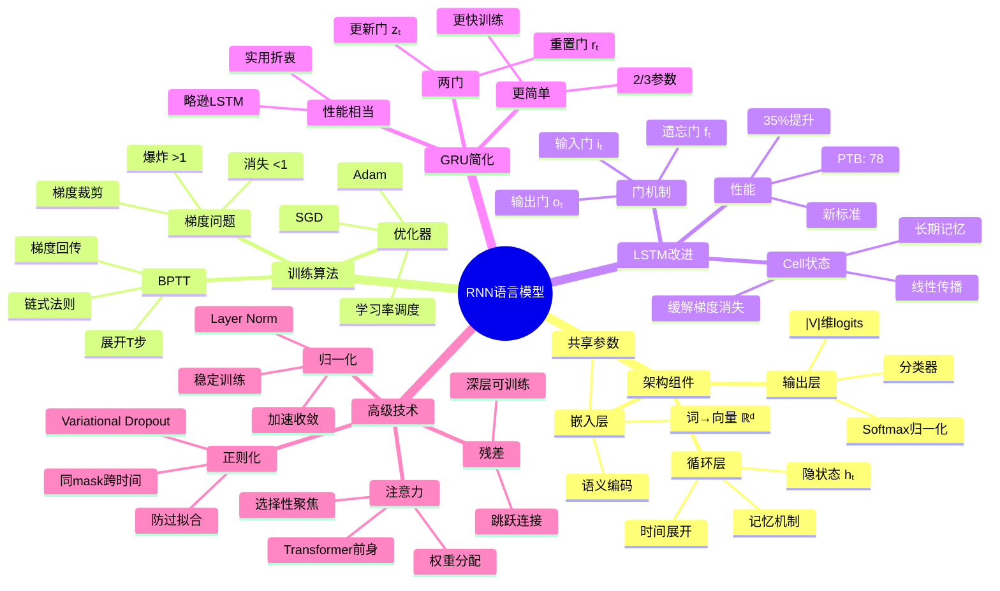

# 3.2 Neural Language Models

> **子主题编号**: 03.2
> **主题**: AI模型视角
> **最后更新**: 2025-10-27
> **文档规模**: 675行 | 神经语言模型理论与实践
> **阅读建议**: 本文系统介绍RNN/LSTM等神经语言模型，连接统计模型与现代大模型

---

## 📋 目录

- [3.2 Neural Language Models](#32-neural-language-models)
  - [📋 目录](#-目录)
    - [1.2 RNN架构深度解析思维导图](#12-rnn架构深度解析思维导图)
    - [1.3 从符号到向量的范式转变](#13-从符号到向量的范式转变)
    - [1.4 LSTM门机制详细分析](#14-lstm门机制详细分析)
    - [1.5 预训练语言模型演进路径](#15-预训练语言模型演进路径)
    - [1.6 理论能力分析](#16-理论能力分析)
    - [1.7 性能对比与未来方向](#17-性能对比与未来方向)
    - [1.8 核心洞察与设计原则](#18-核心洞察与设计原则)
  - [导航 | Navigation](#导航--navigation)
  - [相关主题 | Related Topics](#相关主题--related-topics)
    - [1.9 本章节](#19-本章节)
    - [1.10 相关章节](#110-相关章节)
    - [1.11 跨视角链接](#111-跨视角链接)

---


### 1.2 RNN架构深度解析思维导图



---

### 1.3 从符号到向量的范式转变

| 维度 | 符号范式（n-gram） | 向量范式（Neural LM） | 革命性意义 |
|------|-------------------|---------------------|-----------|
| **表示空间** | 离散one-hot $\{0,1\}^{\|V\|}$ | 连续dense $\mathbb{R}^d$ | 编码语义 |
| **相似性** | $\delta_{ij}$ (完全独立) | $\cos(\mathbf{v}_i, \mathbf{v}_j)$ | 平滑泛化 |
| **维度** | $\|V\|$ (10K-100K) | $d$ (50-1000) | 降维 |
| **稀疏性** | 极度稀疏 | 稠密 | 信息密度 |
| **组合性** | ❌ 无 | ✅ 向量运算 | king-man+woman≈queen |
| **学习方式** | 统计计数 | 反向传播 | 端到端优化 |

**分布假设的数学形式化**:

$$
\begin{align}
\text{Context}(w) &= \{w' : P(w' \mid w) > \epsilon\} \\
\text{sim}_{\text{context}}(w_i, w_j) &= \frac{|\text{Context}(w_i) \cap \text{Context}(w_j)|}{|\text{Context}(w_i) \cup \text{Context}(w_j)|} \\
\text{sim}_{\text{vector}}(w_i, w_j) &= \cos(\mathbf{v}_i, \mathbf{v}_j) = \frac{\mathbf{v}_i \cdot \mathbf{v}_j}{\|\mathbf{v}_i\| \|\mathbf{v}_j\|}
\end{align}
$$

**目标**: $\text{sim}_{\text{vector}} \approx \text{sim}_{\text{context}}$

---

### 1.4 LSTM门机制详细分析

**LSTM解决梯度消失的数学原理**:

**标准RNN梯度**:
$$
\frac{\partial h_t}{\partial h_{t-k}} = \prod_{i=1}^{k} \frac{\partial h_{t-i+1}}{\partial h_{t-i}} = \prod_{i=1}^{k} W^T \cdot \text{diag}(\sigma'(z_{t-i}))
$$

当 $k$ 大时，若 $\|W\| < 1 \land \sigma' < 1 \Rightarrow$ 梯度指数级消失。

**LSTM Cell状态梯度**:
$$
\frac{\partial C_t}{\partial C_{t-k}} = \prod_{i=1}^{k} f_{t-i+1}
$$

关键：**线性依赖**，遗忘门$f \approx 1$时梯度保持！

**门机制对比**:

| 门 | 公式 | 作用 | 数学直觉 |
|---|------|------|---------|
| **遗忘门** | $f_t = \sigma(W_f [h_{t-1}, x_t])$ | 保留多少历史 | 控制梯度衰减速率 |
| **输入门** | $i_t = \sigma(W_i [h_{t-1}, x_t])$ | 接受多少新信息 | 选择性更新 |
| **输出门** | $o_t = \sigma(W_o [h_{t-1}, x_t])$ | 输出多少到隐藏层 | 控制信息流出 |

**Cell更新公式**:
$$
C_t = f_t \odot C_{t-1} + i_t \odot \tilde{C}_t
$$

**加法操作**是关键：梯度可以"跳过"多个时间步传播！

---

### 1.5 预训练语言模型演进路径

| 模型 | 年份 | 架构 | 训练任务 | 关键创新 | 影响 |
|------|------|------|---------|---------|------|
| **Word2Vec** | 2013 | 浅层FFNN | Skip-gram/CBOW | 静态词向量 | ⚠️⚠️⚠️ 奠基 |
| **GloVe** | 2014 | 矩阵分解 | 共现矩阵 | 全局统计 | ⚠️⚠️ 补充 |
| **ULMFiT** | 2018 | LSTM | 语言建模 | 迁移学习三步 | ⚠️⚠️⚠️⚠️ 范式转移 |
| **ELMo** | 2018 | 双向LSTM | 双向LM | 上下文化embedding | ⚠️⚠️⚠️⚠️ 突破 |
| **BERT** | 2018 | Transformer | Masked LM | 双向Transformer | ⚠️⚠️⚠️⚠️⚠️ 革命 |

**ULMFiT三步迁移学习**:

1. **通用域预训练**: 大规模语料语言建模
2. **目标域微调**: 目标领域继续语言建模
3. **分类器微调**: 下游任务有监督训练

**ELMo上下文化embedding**:
$$
\text{ELMo}(w_k) = \gamma \sum_{j=0}^{L} s_j \mathbf{h}_{k,j}^{LM}
$$
其中 $\mathbf{h}_{k,j}^{LM}$ 是第$j$层的隐藏状态，$s_j$是学习的权重。

**关键洞察**: 不同层编码不同信息

- **底层**: 语法（POS tagging好）
- **高层**: 语义（WSD好）

---

### 1.6 理论能力分析

**表达能力（Chomsky层次）**:

| 模型类型 | 理论能力 | 实际能力 | 差距原因 |
|---------|---------|---------|---------|
| **前馈FFNN** | 正则语言REG | REG | 固定窗口限制 |
| **RNN（理论）** | 图灵完备RE | - | 无限精度实数 |
| **RNN（实际）** | - | REG到简单CFL | 有限精度、梯度消失 |
| **LSTM（实际）** | - | 简单CFL | 缓解但未解决 |

**泛化能力**:

$$
\begin{align}
\text{泛化误差} &= \mathbb{E}_{(x,y) \sim \mathcal{D}}[\mathcal{L}(f_\theta(x), y)] \\
&\leq \text{训练误差} + \mathcal{O}\left(\sqrt{\frac{d}{m}}\right)
\end{align}
$$

其中 $d$ 是参数量，$m$ 是训练样本数。

**长程依赖理论限制**:

**Bengio et al. (1994)**: 梯度消失是根本限制
$$
\left\|\frac{\partial \mathcal{L}_t}{\partial h_{t-\tau}}\right\| \leq \eta^{\tau}
$$
其中 $\eta < 1$ 是衰减因子，$\tau$ 是距离。

**LSTM缓解但未解决**: 实际有效距离~100 tokens

---

### 1.7 性能对比与未来方向

**Penn Treebank困惑度历史**:

| 年份 | 模型 | 困惑度 | 提升 | 关键技术 |
|------|------|--------|------|---------|
| ~2000 | 5-gram+KN | ~140 | baseline | 统计平滑 |
| 2003 | Bengio FFNN | ~110 | 21% | 神经网络 |
| 2010 | RNN-LM | ~120 | -9% | 循环结构 |
| 2012 | LSTM-LM | ~78 | 35% | 门机制 |
| 2016 | LSTM+Dropout | ~73 | 6% | 正则化 |
| 2018 | ELMo | ~60 | 18% | 预训练 |
| 2018+ | Transformer | ~20-30 | 50-67% | 注意力+大规模 |

**未来方向**:

```yaml
短期（2025-2027）:
  - 长上下文RNN: 改进LSTM门机制
  - 混合架构: RNN+Transformer优势结合
  - 高效训练: 稀疏激活、量化

中期（2027-2030）:
  - 神经符号LM: 结合符号规则
  - 可解释LM: 理解内部表示
  - 持续学习: 在线更新无灾难性遗忘

长期（2030+）:
  - 类人语言习得: 少样本学习
  - 因果语言模型: 超越关联到因果
  - 意识语言模型: 自我反思能力
```

---

### 1.8 核心洞察与设计原则

**五大核心定律**:

1. **分布假设定律**
   $$
   \text{语义相似性} \propto \text{上下文相似性}
   $$
   - 神经LM的理论基础
   - 从共现学习意义

2. **参数共享定律**
   $$
   \text{泛化能力} \propto \frac{1}{\text{独立参数数}}
   $$
   - 嵌入层关键：$|V|d \ll |V|^2$
   - 打破稀疏性诅咒

3. **梯度衰减定律**
   $$
   \left\|\frac{\partial \mathcal{L}}{\partial h_{t-\tau}}\right\| \sim e^{-\tau/\lambda}
   $$
   - RNN根本限制
   - LSTM缓解但未解决

4. **门控保护定律**
   $$
   \frac{\partial C_t}{\partial C_{t-k}} = \prod f_i \approx 1 \quad \text{当} \; f_i \approx 1
   $$
   - LSTM核心机制
   - 线性传播保持梯度

5. **预训练迁移定律**
   $$
   \text{下游性能} = f(\text{预训练数据量}, \text{模型容量})
   $$
   - 2018年范式转移
   - 数据和规模是王道

**实践设计原则**:

```yaml
原则1_嵌入优先:
  认知: 分布式表示是基础
  行动: 投资高质量词嵌入
  例子: 预训练Word2Vec/GloVe

原则2_门控机制:
  认知: 长程依赖需要线性路径
  行动: 优先使用LSTM/GRU而非RNN
  例子: 默认LSTM for序列建模

原则3_正则化必须:
  认知: 神经LM易过拟合
  行动: Dropout+LayerNorm标配
  例子: Variational Dropout for RNN

原则4_预训练为王:
  认知: 无监督预训练提供强先验
  行动: 尽可能使用预训练模型
  例子: ELMo → BERT → GPT

原则5_困惑度非终点:
  认知: 困惑度是手段非目的
  行动: 关注下游任务实际性能
  例子: 低困惑度≠好翻译/问答
```

**终极洞察**:

> **"神经语言模型的核心不是模仿n-gram，而是学习语言的连续几何结构。从离散符号到连续向量，从局部统计到全局语义，这是深度学习对NLP的根本贡献。LSTM时代解决了'如何记忆'，Transformer时代解决了'如何注意'，下一个时代将解决'如何理解'。"**

**元认知**:

- **嵌入是桥梁**: 连接离散语言和连续优化
- **循环是记忆**: RNN引入时间概念
- **门控是智慧**: LSTM选择性记忆/遗忘
- **预训练是捷径**: 站在巨人肩膀上
- **Transformer是未来**: 但RNN思想永存

</details>

---

---

## 导航 | Navigation

**上一篇**: [← 03.1 统计语言模型](./03.1_Statistical_Language_Models.md)
**下一篇**: [03.3 Transformer LLM理论 →](./03.3_Transformer_LLM_Theory.md)
**返回目录**: [↑ AI模型视角总览](../README.md)

---

## 相关主题 | Related Topics

### 1.9 本章节

- [03.1 统计语言模型](./03.1_Statistical_Language_Models.md)
- [03.3 Transformer LLM理论](./03.3_Transformer_LLM_Theory.md)
- [03.4 Token生成机制](./03.4_Token_Generation_Mechanisms.md)
- [03.5 嵌入向量空间](./03.5_Embedding_Vector_Spaces.md)
- [03.6 上下文窗口与记忆](./03.6_Context_Window_Memory.md)

### 1.10 相关章节

- [02.2 RNN与Transformer架构](../02_Neural_Network_Theory/02.2_RNN_Transformer_Architecture.md)
- [04.2 连续表示理论](../04_Semantic_Models/04.2_Continuous_Representation_Theory.md)

### 1.11 跨视角链接

- [FormalLanguage_Perspective](../../FormalLanguage_Perspective/README.md)
- [Information_Theory_Perspective](../../Information_Theory_Perspective/README.md)
- [概念交叉索引（七视角版）](../../CONCEPT_CROSS_INDEX.md) - 查看相关概念的七视角分析：
  - [熵](../../CONCEPT_CROSS_INDEX.md#71-熵-entropy-七视角) - 神经语言模型的熵与不确定性
  - [互信息](../../CONCEPT_CROSS_INDEX.md#111-互信息-mutual-information-七视角) - 词嵌入的信息关联
  - [VC维](../../CONCEPT_CROSS_INDEX.md#211-vc维-vapnik-chervonenkis-dimension-七视角) - 神经语言模型的容量
