# 神经语言模型 | Neural Language Models

> **文档版本**: v1.0.0  
> **最后更新**: 2025-10-27  
> **文档规模**: 675行 | 神经语言模型理论与实践  
> **阅读建议**: 本文系统介绍RNN/LSTM等神经语言模型，连接统计模型与现代大模型

---

## 目录 | Table of Contents

- [神经语言模型 | Neural Language Models](#神经语言模型--neural-language-models)

## 核心概念深度分析

<details>
<summary><b>🧠🔄 点击展开：神经语言模型演进全景深度分析</b></summary>

本节深入剖析神经语言模型从前馈网络到循环网络再到预训练模型的完整演进，揭示从符号到向量、从统计到神经的深刻变革。

### 1️⃣ 神经语言模型概念定义卡

**概念名称**: 神经语言模型（Neural Language Model, NLM）

**内涵（本质属性）**:

**🔹 核心定义**:
使用神经网络参数化的概率模型，建模自然语言序列的分布：
$$
P(w_1, w_2, \ldots, w_T) = \prod_{t=1}^{T} P_\theta(w_t \mid w_1, \ldots, w_{t-1})
$$
其中 $\theta$ 是神经网络参数。

**🔹 三大革命性突破**:

| 维度 | 统计n-gram | 神经语言模型 | 突破意义 |
|------|-----------|-------------|---------|
| **词表示** | one-hot离散 | 分布式向量embedding | 编码语义相似性 |
| **上下文** | 固定窗口n-1词 | 理论上无限（RNN） | 长程依赖 |
| **泛化** | 未见n-gram = 0 | 平滑泛化 | 组合性 |

**🔹 分布假设（理论基础）**:
- **Harris (1954)**: "Words in similar contexts have similar meanings"
- **Firth (1957)**: "You shall know a word by the company it keeps"
- **数学形式化**: $\text{sim}(w_i, w_j) \propto \text{sim}(\text{context}(w_i), \text{context}(w_j))$

**外延（范围边界）**:

| 维度 | 包含 ✅ | 不包含 ❌ |
|------|---------|----------|
| **模型类型** | 前馈、RNN、LSTM、GRU | Transformer（独立章节） |
| **训练范式** | 预训练语言模型 | 监督微调（下游任务） |
| **粒度** | 词级、字符级、子词级 | 句子级、文档级（专门模型） |
| **方向性** | 单向、双向 | 多模态（非纯文本） |

**属性维度表**:

| 维度 | 值/描述 | 说明 |
|------|---------|------|
| **奠基论文** | Bengio et al. 2003 | FFNN-LM，首个神经LM |
| **突破时刻** | LSTM-LM (2012) | 困惑度提升35% |
| **预训练元年** | 2018 (ELMo, ULMFiT) | 迁移学习范式 |
| **参数量** | 百万-数亿（预Transformer） | 比n-gram多，比LLM少 |
| **训练时间** | GPU天-周 | 比n-gram慢，比LLM快 |
| **典型困惑度** | PTB: 78 (LSTM) → 60 (预训练) | 持续改进 |
| **长程依赖** | ⚠️ 有限（几十tokens） | LSTM核心优势 |
| **可解释性** | ⚠️ 黑盒 | vs n-gram透明规则 |

---

### 2️⃣ 神经语言模型演进全景图

```mermaid
graph TB
    Traditional[统计n-gram<br/>1980-2000s]
    
    Traditional --> T1[稀疏性]
    Traditional --> T2[维度灾难]
    Traditional --> T3[无语义]
    
    T1 --> Breakthrough[革命性突破<br/>2003]
    T2 --> Breakthrough
    T3 --> Breakthrough
    
    Breakthrough --> Bengio[Bengio FFNN-LM<br/>2003]
    Bengio --> B1[分布式词表示]
    Bengio --> B2[参数共享]
    Bengio --> B3[平滑泛化]
    
    B1 --> RNN_Era[RNN时代<br/>2010-2015]
    B2 --> RNN_Era
    B3 --> RNN_Era
    
    RNN_Era --> R1[标准RNN<br/>梯度消失]
    RNN_Era --> R2[LSTM 2012<br/>35%提升]
    RNN_Era --> R3[GRU 2014<br/>更简单]
    
    R2 --> Advanced[高级技术<br/>2015-2017]
    R3 --> Advanced
    
    Advanced --> A1[Variational Dropout<br/>2016]
    Advanced --> A2[Layer Norm<br/>2016]
    Advanced --> A3[残差连接<br/>ResNet风格]
    Advanced --> A4[注意力机制<br/>2014-2017]
    
    A1 --> PreTrain[预训练时代<br/>2018]
    A2 --> PreTrain
    A3 --> PreTrain
    A4 --> PreTrain
    
    PreTrain --> P1[ULMFiT 2018<br/>迁移学习]
    PreTrain --> P2[ELMo 2018<br/>双向上下文]
    
    P1 --> Transformer[Transformer时代<br/>2018+]
    P2 --> Transformer
    
    Transformer --> Tr1[BERT 2018]
    Transformer --> Tr2[GPT-2/3 2019/20]
    Transformer --> Tr3[LLM时代]
    
    style Traditional fill:#ffd93d,stroke:#333,stroke-width:2px
    style Breakthrough fill:#ff6b6b,stroke:#333,stroke-width:4px
    style RNN_Era fill:#6bcf7f,stroke:#333,stroke-width:3px
    style PreTrain fill:#a29bfe,stroke:#333,stroke-width:3px
```



---

### 3️⃣ 模型架构详细对比矩阵

| 模型 | 上下文长度 | 梯度问题 | 参数量 | 困惑度(PTB) | 训练速度 | 主要优势 | 主要局限 |
|------|-----------|---------|--------|------------|---------|---------|---------|
| **n-gram** | 固定n-1 | N/A | 极大 | ~140 | ✅✅✅ 快 | 透明、快速 | 稀疏、无泛化 |
| **Bengio FFNN** | 固定n-1 | ✅ 无 | 中等 | ~110 | ✅✅ 较快 | 首个神经LM | 固定窗口 |
| **标准RNN** | 理论∞ | ❌❌ 严重 | 小 | ~120 | ✅ 中等 | 任意长度 | 梯度消失 |
| **LSTM** | 实际~100 | ⚠️ 缓解 | 中等 | ~78 | ⚠️ 较慢 | 长程依赖 | 复杂、慢 |
| **GRU** | 实际~100 | ⚠️ 缓解 | 较小 | ~80 | ✅ 中等 | 简单高效 | 略逊LSTM |
| **ELMo** | 实际~200 | ⚠️ 缓解 | 大 | ~60 | ❌ 慢 | 上下文化embedding | 计算密集 |

**关键洞察**:
- **LSTM是RNN时代的巅峰**: 35%困惑度提升，解锁长程依赖
- **参数量-性能trade-off**: 更大模型性能更好，但收益递减
- **预训练改变游戏规则**: 2018年后范式转移

---

### 4️⃣ RNN架构深度解析思维导图

```mermaid
mindmap
  root((RNN语言模型))
    架构组件
      嵌入层
        词→向量 ℝᵈ
        共享参数
        语义编码
      循环层
        隐状态 hₜ
        时间展开
        记忆机制
      输出层
        分类器
        |V|维logits
        Softmax归一化
    训练算法
      BPTT
        展开T步
        链式法则
        梯度回传
      梯度问题
        消失 <1
        爆炸 >1
        梯度裁剪
      优化器
        SGD
        Adam
        学习率调度
    LSTM改进
      门机制
        遗忘门 fₜ
        输入门 iₜ
        输出门 oₜ
      Cell状态
        长期记忆
        线性传播
        缓解梯度消失
      性能
        PTB: 78
        35%提升
        新标准
    GRU简化
      两门
        更新门 zₜ
        重置门 rₜ
      更简单
        2/3参数
        更快训练
      性能相当
        略逊LSTM
        实用折衷
    高级技术
      正则化
        Variational Dropout
        同mask跨时间
        防过拟合
      归一化
        Layer Norm
        稳定训练
        加速收敛
      残差
        跳跃连接
        深层可训练
      注意力
        选择性聚焦
        权重分配
        Transformer前身
```



---

### 5️⃣ 从符号到向量的范式转变

| 维度 | 符号范式（n-gram） | 向量范式（Neural LM） | 革命性意义 |
|------|-------------------|---------------------|-----------|
| **表示空间** | 离散one-hot $\{0,1\}^{\|V\|}$ | 连续dense $\mathbb{R}^d$ | 编码语义 |
| **相似性** | $\delta_{ij}$ (完全独立) | $\cos(\mathbf{v}_i, \mathbf{v}_j)$ | 平滑泛化 |
| **维度** | $\|V\|$ (10K-100K) | $d$ (50-1000) | 降维 |
| **稀疏性** | 极度稀疏 | 稠密 | 信息密度 |
| **组合性** | ❌ 无 | ✅ 向量运算 | king-man+woman≈queen |
| **学习方式** | 统计计数 | 反向传播 | 端到端优化 |

**分布假设的数学形式化**:

$$
\begin{align}
\text{Context}(w) &= \{w' : P(w' \mid w) > \epsilon\} \\
\text{sim}_{\text{context}}(w_i, w_j) &= \frac{|\text{Context}(w_i) \cap \text{Context}(w_j)|}{|\text{Context}(w_i) \cup \text{Context}(w_j)|} \\
\text{sim}_{\text{vector}}(w_i, w_j) &= \cos(\mathbf{v}_i, \mathbf{v}_j) = \frac{\mathbf{v}_i \cdot \mathbf{v}_j}{\|\mathbf{v}_i\| \|\mathbf{v}_j\|}
\end{align}
$$

**目标**: $\text{sim}_{\text{vector}} \approx \text{sim}_{\text{context}}$

---

### 6️⃣ LSTM门机制详细分析

**LSTM解决梯度消失的数学原理**:

**标准RNN梯度**:
$$
\frac{\partial h_t}{\partial h_{t-k}} = \prod_{i=1}^{k} \frac{\partial h_{t-i+1}}{\partial h_{t-i}} = \prod_{i=1}^{k} W^T \cdot \text{diag}(\sigma'(z_{t-i}))
$$

当 $k$ 大时，若 $\|W\| < 1 \land \sigma' < 1 \Rightarrow$ 梯度指数级消失。

**LSTM Cell状态梯度**:
$$
\frac{\partial C_t}{\partial C_{t-k}} = \prod_{i=1}^{k} f_{t-i+1}
$$

关键：**线性依赖**，遗忘门$f \approx 1$时梯度保持！

**门机制对比**:

| 门 | 公式 | 作用 | 数学直觉 |
|---|------|------|---------|
| **遗忘门** | $f_t = \sigma(W_f [h_{t-1}, x_t])$ | 保留多少历史 | 控制梯度衰减速率 |
| **输入门** | $i_t = \sigma(W_i [h_{t-1}, x_t])$ | 接受多少新信息 | 选择性更新 |
| **输出门** | $o_t = \sigma(W_o [h_{t-1}, x_t])$ | 输出多少到隐藏层 | 控制信息流出 |

**Cell更新公式**:
$$
C_t = f_t \odot C_{t-1} + i_t \odot \tilde{C}_t
$$

**加法操作**是关键：梯度可以"跳过"多个时间步传播！

---

### 7️⃣ 预训练语言模型演进路径

| 模型 | 年份 | 架构 | 训练任务 | 关键创新 | 影响 |
|------|------|------|---------|---------|------|
| **Word2Vec** | 2013 | 浅层FFNN | Skip-gram/CBOW | 静态词向量 | ⚠️⚠️⚠️ 奠基 |
| **GloVe** | 2014 | 矩阵分解 | 共现矩阵 | 全局统计 | ⚠️⚠️ 补充 |
| **ULMFiT** | 2018 | LSTM | 语言建模 | 迁移学习三步 | ⚠️⚠️⚠️⚠️ 范式转移 |
| **ELMo** | 2018 | 双向LSTM | 双向LM | 上下文化embedding | ⚠️⚠️⚠️⚠️ 突破 |
| **BERT** | 2018 | Transformer | Masked LM | 双向Transformer | ⚠️⚠️⚠️⚠️⚠️ 革命 |

**ULMFiT三步迁移学习**:
1. **通用域预训练**: 大规模语料语言建模
2. **目标域微调**: 目标领域继续语言建模
3. **分类器微调**: 下游任务有监督训练

**ELMo上下文化embedding**:
$$
\text{ELMo}(w_k) = \gamma \sum_{j=0}^{L} s_j \mathbf{h}_{k,j}^{LM}
$$
其中 $\mathbf{h}_{k,j}^{LM}$ 是第$j$层的隐藏状态，$s_j$是学习的权重。

**关键洞察**: 不同层编码不同信息
- **底层**: 语法（POS tagging好）
- **高层**: 语义（WSD好）

---

### 8️⃣ 理论能力分析

**表达能力（Chomsky层次）**:

| 模型类型 | 理论能力 | 实际能力 | 差距原因 |
|---------|---------|---------|---------|
| **前馈FFNN** | 正则语言REG | REG | 固定窗口限制 |
| **RNN（理论）** | 图灵完备RE | - | 无限精度实数 |
| **RNN（实际）** | - | REG到简单CFL | 有限精度、梯度消失 |
| **LSTM（实际）** | - | 简单CFL | 缓解但未解决 |

**泛化能力**:

$$
\begin{align}
\text{泛化误差} &= \mathbb{E}_{(x,y) \sim \mathcal{D}}[\mathcal{L}(f_\theta(x), y)] \\
&\leq \text{训练误差} + \mathcal{O}\left(\sqrt{\frac{d}{m}}\right)
\end{align}
$$

其中 $d$ 是参数量，$m$ 是训练样本数。

**长程依赖理论限制**:

**Bengio et al. (1994)**: 梯度消失是根本限制
$$
\left\|\frac{\partial \mathcal{L}_t}{\partial h_{t-\tau}}\right\| \leq \eta^{\tau}
$$
其中 $\eta < 1$ 是衰减因子，$\tau$ 是距离。

**LSTM缓解但未解决**: 实际有效距离~100 tokens

---

### 9️⃣ 性能对比与未来方向

**Penn Treebank困惑度历史**:

| 年份 | 模型 | 困惑度 | 提升 | 关键技术 |
|------|------|--------|------|---------|
| ~2000 | 5-gram+KN | ~140 | baseline | 统计平滑 |
| 2003 | Bengio FFNN | ~110 | 21% | 神经网络 |
| 2010 | RNN-LM | ~120 | -9% | 循环结构 |
| 2012 | LSTM-LM | ~78 | 35% | 门机制 |
| 2016 | LSTM+Dropout | ~73 | 6% | 正则化 |
| 2018 | ELMo | ~60 | 18% | 预训练 |
| 2018+ | Transformer | ~20-30 | 50-67% | 注意力+大规模 |

**未来方向**:

```yaml
短期（2025-2027）:
  - 长上下文RNN: 改进LSTM门机制
  - 混合架构: RNN+Transformer优势结合
  - 高效训练: 稀疏激活、量化

中期（2027-2030）:
  - 神经符号LM: 结合符号规则
  - 可解释LM: 理解内部表示
  - 持续学习: 在线更新无灾难性遗忘

长期（2030+）:
  - 类人语言习得: 少样本学习
  - 因果语言模型: 超越关联到因果
  - 意识语言模型: 自我反思能力
```

---

### 🔟 核心洞察与设计原则

**五大核心定律**:

1. **分布假设定律**
   $$
   \text{语义相似性} \propto \text{上下文相似性}
   $$
   - 神经LM的理论基础
   - 从共现学习意义

2. **参数共享定律**
   $$
   \text{泛化能力} \propto \frac{1}{\text{独立参数数}}
   $$
   - 嵌入层关键：$|V|d \ll |V|^2$
   - 打破稀疏性诅咒

3. **梯度衰减定律**
   $$
   \left\|\frac{\partial \mathcal{L}}{\partial h_{t-\tau}}\right\| \sim e^{-\tau/\lambda}
   $$
   - RNN根本限制
   - LSTM缓解但未解决

4. **门控保护定律**
   $$
   \frac{\partial C_t}{\partial C_{t-k}} = \prod f_i \approx 1 \quad \text{当} \; f_i \approx 1
   $$
   - LSTM核心机制
   - 线性传播保持梯度

5. **预训练迁移定律**
   $$
   \text{下游性能} = f(\text{预训练数据量}, \text{模型容量})
   $$
   - 2018年范式转移
   - 数据和规模是王道

**实践设计原则**:

```yaml
原则1_嵌入优先:
  认知: 分布式表示是基础
  行动: 投资高质量词嵌入
  例子: 预训练Word2Vec/GloVe

原则2_门控机制:
  认知: 长程依赖需要线性路径
  行动: 优先使用LSTM/GRU而非RNN
  例子: 默认LSTM for序列建模

原则3_正则化必须:
  认知: 神经LM易过拟合
  行动: Dropout+LayerNorm标配
  例子: Variational Dropout for RNN

原则4_预训练为王:
  认知: 无监督预训练提供强先验
  行动: 尽可能使用预训练模型
  例子: ELMo → BERT → GPT

原则5_困惑度非终点:
  认知: 困惑度是手段非目的
  行动: 关注下游任务实际性能
  例子: 低困惑度≠好翻译/问答
```

**终极洞察**:

> **"神经语言模型的核心不是模仿n-gram，而是学习语言的连续几何结构。从离散符号到连续向量，从局部统计到全局语义，这是深度学习对NLP的根本贡献。LSTM时代解决了'如何记忆'，Transformer时代解决了'如何注意'，下一个时代将解决'如何理解'。"**

**元认知**:
- **嵌入是桥梁**: 连接离散语言和连续优化
- **循环是记忆**: RNN引入时间概念
- **门控是智慧**: LSTM选择性记忆/遗忘
- **预训练是捷径**: 站在巨人肩膀上
- **Transformer是未来**: 但RNN思想永存

</details>

---

## 目录 | Table of Contents

- [神经语言模型 | Neural Language Models](#神经语言模型--neural-language-models)
  - [目录 | Table of Contents](#目录--table-of-contents)
  - [概述 | Overview](#概述--overview)
  - [1. 从符号到向量 | From Symbols to Vectors](#1-从符号到向量--from-symbols-to-vectors)
    - [1.1 词表示的演进](#11-词表示的演进)
    - [1.2 分布假设 (Distributional Hypothesis)](#12-分布假设-distributional-hypothesis)
    - [1.3 词嵌入的性质](#13-词嵌入的性质)
  - [2. 前馈神经语言模型 | Feed-Forward Neural Language Models](#2-前馈神经语言模型--feed-forward-neural-language-models)
    - [2.1 Bengio 模型 (2003)](#21-bengio-模型-2003)
    - [2.2 训练目标](#22-训练目标)
    - [2.3 Softmax 瓶颈](#23-softmax-瓶颈)
    - [2.4 优势与局限](#24-优势与局限)
  - [3. 循环神经语言模型 | Recurrent Neural Language Models](#3-循环神经语言模型--recurrent-neural-language-models)
    - [3.1 标准RNN语言模型](#31-标准rnn语言模型)
    - [3.2 BPTT 算法](#32-bptt-算法)
    - [3.3 梯度问题](#33-梯度问题)
    - [3.4 LSTM语言模型](#34-lstm语言模型)
    - [3.5 GRU语言模型](#35-gru语言模型)
  - [4. 高级技术 | Advanced Techniques](#4-高级技术--advanced-techniques)
    - [4.1 Dropout for RNN](#41-dropout-for-rnn)
    - [4.2 Layer Normalization](#42-layer-normalization)
    - [4.3 残差连接](#43-残差连接)
    - [4.4 注意力机制](#44-注意力机制)
  - [5. 特殊架构 | Special Architectures](#5-特殊架构--special-architectures)
    - [5.1 双向语言模型](#51-双向语言模型)
    - [5.2 字符级语言模型](#52-字符级语言模型)
    - [5.3 子词级语言模型](#53-子词级语言模型)
  - [6. 预训练语言模型 | Pre-trained Language Models](#6-预训练语言模型--pre-trained-language-models)
    - [6.1 ULMFiT (2018)](#61-ulmfit-2018)
    - [6.2 ELMo (2018)](#62-elmo-2018)
    - [6.3 从LM到预训练的演进](#63-从lm到预训练的演进)
  - [7. 性能对比 | Performance Comparison](#7-性能对比--performance-comparison)
    - [7.1 Penn Treebank](#71-penn-treebank)
    - [7.2 One Billion Word Benchmark](#72-one-billion-word-benchmark)
    - [7.3 观察](#73-观察)
  - [8. 理论分析 | Theoretical Analysis](#8-理论分析--theoretical-analysis)
    - [8.1 表达能力](#81-表达能力)
    - [8.2 泛化能力](#82-泛化能力)
    - [8.3 长程依赖的理论限制](#83-长程依赖的理论限制)
  - [9. 权威参考文献 | Authoritative References](#9-权威参考文献--authoritative-references)
    - [Wikipedia 条目](#wikipedia-条目)
    - [学术论文](#学术论文)
    - [标准教材](#标准教材)
  - [10. 关键要点总结 | Key Takeaways](#10-关键要点总结--key-takeaways)

---

## 概述 | Overview

神经语言模型使用神经网络建模语言序列，克服了传统n-gram模型的诸多局限。本文档深入分析从前馈网络到循环网络的神经语言模型演进。

## 1. 从符号到向量 | From Symbols to Vectors

### 1.1 词表示的演进

**One-Hot 编码**：

```text
"cat" → [0, 0, ..., 1, ..., 0]  (维度 = |V|)
```

**问题**：

- 维度灾难
- 无语义信息
- 词之间完全独立

**分布式表示**：

```text
"cat" → [0.2, -0.5, 0.8, 0.1]  (维度 = d << |V|)
"dog" → [0.3, -0.4, 0.7, 0.2]  (相近！)
```

**优势**：

- 低维稠密
- 编码语义相似性
- 参数共享

### 1.2 分布假设 (Distributional Hypothesis)

**Harris (1954)**：
> "Words that occur in similar contexts tend to have similar meanings"
> 出现在相似上下文中的词倾向于有相似含义

**Firth (1957)**：
> "You shall know a word by the company it keeps"
> 词的意义由其伴随词决定

**意义**：

- 从共现统计学习语义
- 神经语言模型的理论基础

### 1.3 词嵌入的性质

**几何性质**：

```text
vec("king") - vec("man") + vec("woman") ≈ vec("queen")
```

**语义聚类**：

- 相似词在空间中靠近
- 语义关系表示为向量运算

**维度解释**：

- 某些维度可能对应语义特征
- 但通常是分布式的（难以解释）

## 2. 前馈神经语言模型 | Feed-Forward Neural Language Models

### 2.1 Bengio 模型 (2003)

**架构**：

```text
输入：前 n-1 个词 (wᵢ₋ₙ₊₁, ..., wᵢ₋₁)
  ↓
嵌入层：每个词 → d 维向量
  ↓
拼接：(n-1) × d 维向量
  ↓
隐藏层：h = tanh(W_hidden · concat + b)
  ↓
输出层：scores = W_output · h + b
  ↓
Softmax：P(wᵢ | 前文) = softmax(scores)
```

**形式化**：

```text
C(w) ∈ ℝᵈ          # 词 w 的嵌入
x = [C(wᵢ₋ₙ₊₁); ...; C(wᵢ₋₁)]  # 拼接
h = tanh(Hx + d)   # 隐藏层
y = Uh + b         # 输出分数
P(wᵢ | 前文) = softmax(y)
```

**参数**：

- C：|V| × d（嵌入矩阵）
- H：h × ((n-1)d)（隐藏层权重）
- U：|V| × h（输出权重）

**总参数**：O(|V|d + hd·n + |V|h)

### 2.2 训练目标

**最大似然估计**：

```text
max ∑ log P(wᵢ | wᵢ₋ₙ₊₁, ..., wᵢ₋₁)
```

**交叉熵损失**：

```text
L = -∑ log P(wᵢ | wᵢ₋ₙ₊₁, ..., wᵢ₋₁)
```

**随机梯度下降**：

- 小批量
- 反向传播
- 学习率调度

### 2.3 Softmax 瓶颈

**计算复杂度**：

```text
Softmax(scores) = exp(scoreᵢ) / ∑ⱼ exp(scoreⱼ)
```

分母求和：O(|V|)，每个词每次预测都需要

**问题**：|V| 通常很大（10K - 1M）

**解决方案**：

1. **分层Softmax (Hierarchical Softmax)**
2. **负采样 (Negative Sampling)**
3. **重要性采样 (Importance Sampling)**
4. **自适应Softmax (Adaptive Softmax)**

### 2.4 优势与局限

**优势**：

- ✅ 自动学习词表示
- ✅ 泛化到相似词
- ✅ 参数共享
- ✅ 性能优于n-gram

**局限**：

- ❌ 上下文窗口仍固定（n）
- ❌ 无法捕捉长程依赖
- ❌ 词袋语义（位置不敏感）

## 3. 循环神经语言模型 | Recurrent Neural Language Models

### 3.1 标准RNN语言模型

**Mikolov et al. (2010)**:

**架构**：

```text
输入：wₜ
  ↓
嵌入：eₜ = E[wₜ]
  ↓
循环：hₜ = σ(W_hh hₜ₋₁ + W_xe eₜ)
  ↓
输出：yₜ = W_yh hₜ
  ↓
Softmax：P(wₜ₊₁) = softmax(yₜ)
```

**关键特性**：

- 隐状态 hₜ 累积历史信息
- 理论上无限上下文
- 参数不依赖于序列长度

**训练**：

```text
损失：L = -∑ₜ log P(wₜ | w₁, ..., wₜ₋₁)
算法：BPTT (Backpropagation Through Time)
```

### 3.2 BPTT 算法

**展开RNN**：

```text
w₁ → h₁ → y₁
w₂ → h₂ → y₂
...
wₜ → hₜ → yₜ
```

**梯度计算**：

```text
∂L/∂W = ∑ₜ ∂Lₜ/∂W
```

需要从 t 反向传播到 1

**截断BPTT (Truncated BPTT)**：

- 只回传 k 步
- 减少计算成本
- 牺牲一些长程信息

### 3.3 梯度问题

**梯度消失**：

```text
∂hₜ/∂h₁ = ∏ᵢ₌₂ᵗ ∂hᵢ/∂hᵢ₋₁
```

若 ||∂hᵢ/∂hᵢ₋₁|| < 1，则乘积指数衰减

**梯度爆炸**：

若 ||∂hᵢ/∂hᵢ₋₁|| > 1，则乘积指数增长

**解决方法**：

1. **梯度裁剪 (Gradient Clipping)**：

   ```text
   if ||g|| > threshold:
       g = threshold · g / ||g||
   ```

2. **更好的激活函数**：ReLU

3. **更好的初始化**：Xavier, He

4. **架构改进**：LSTM, GRU

### 3.4 LSTM语言模型

**Sundermeyer et al. (2012)**:

**LSTM单元**：

```text
fₜ = σ(W_f · [hₜ₋₁, xₜ] + b_f)  # 遗忘门
iₜ = σ(W_i · [hₜ₋₁, xₜ] + b_i)  # 输入门
C̃ₜ = tanh(W_C · [hₜ₋₁, xₜ] + b_C)  # 候选cell
Cₜ = fₜ ⊙ Cₜ₋₁ + iₜ ⊙ C̃ₜ  # 更新cell
oₜ = σ(W_o · [hₜ₋₁, xₜ] + b_o)  # 输出门
hₜ = oₜ ⊙ tanh(Cₜ)  # 隐状态
```

**优势**：

- 缓解梯度消失
- 学习长程依赖
- 性能显著提升

**困惑度改进**：

```text
Penn Treebank:
RNN-LM: ~120
LSTM-LM: ~78  (35%提升！)
```

### 3.5 GRU语言模型

**Cho et al. (2014)**:

**GRU单元**（更简单）：

```text
zₜ = σ(W_z · [hₜ₋₁, xₜ])  # 更新门
rₜ = σ(W_r · [hₜ₋₁, xₜ])  # 重置门
h̃ₜ = tanh(W · [rₜ ⊙ hₜ₋₁, xₜ])  # 候选隐状态
hₜ = (1 - zₜ) ⊙ hₜ₋₁ + zₜ ⊙ h̃ₜ  # 更新隐状态
```

**vs LSTM**：

- 参数更少（2/3的门）
- 计算更快
- 性能相当

## 4. 高级技术 | Advanced Techniques

### 4.1 Dropout for RNN

**标准Dropout问题**：

- 在时间步之间dropout：破坏循环结构
- 不在时间步之间dropout：过拟合

**Variational Dropout (Gal & Ghahramani, 2016)**：

```text
同一个dropout mask在所有时间步重复使用
```

**效果**：

- 防止过拟合
- 困惑度进一步降低

### 4.2 Layer Normalization

**Batch Normalization 问题**：

- RNN序列长度不一
- 小批量统计不稳定

**Layer Normalization (Ba et al., 2016)**：

```text
对每个样本的隐藏单元归一化（而非批次）
```

**效果**：

- 训练稳定
- 收敛更快

### 4.3 残差连接

**深层RNN问题**：

- 多层叠加时梯度消失
- 训练困难

**残差连接**：

```text
hₜ^(l) = hₜ^(l-1) + RNN_layer(hₜ^(l-1))
```

**允许训练更深的网络**（如8-16层）

### 4.4 注意力机制

**Bahdanau et al. (2014)**:

**动机**：

- RNN把所有信息压缩到固定维度隐状态
- 长序列信息损失

**注意力**：

```text
cₜ = ∑ᵢ αₜᵢ hᵢ  # 加权和所有编码器隐状态
αₜᵢ = softmax(score(hₜ, hᵢ))  # 注意力权重
```

**在语言模型中**：

- 生成时关注前文的不同位置
- 性能提升
- 为Transformer铺路

## 5. 特殊架构 | Special Architectures

### 5.1 双向语言模型

**ELMo (Peters et al., 2018)**:

**动机**：

- 前向LM：只看左侧
- 后向LM：只看右侧
- 结合：完整上下文

**架构**：

```text
前向LSTM：P(wₜ | w₁, ..., wₜ₋₁)
后向LSTM：P(wₜ | wₜ₊₁, ..., wₙ)
结合：用于下游任务的表示
```

**注意**：

- 不是真正的语言模型（无法生成）
- 用于表示学习

### 5.2 字符级语言模型

**Sutskever et al. (2011)**:

**动机**：

- 词级：OOV问题
- 字符级：无OOV

**实现**：

```text
输入：字符序列
h₁ → h₂ → ... → hₙ
输出：下一个字符的概率
```

**优势**：

- 开放词汇
- 学习形态学

**挑战**：

- 序列更长
- 训练更慢
- 长程依赖更难

### 5.3 子词级语言模型

**BPE, WordPiece, SentencePiece**:

**动机**：

- 词级：OOV，大词汇表
- 字符级：太长
- 子词：平衡

**例子**：

```text
"unbelievable" → ["un", "believ", "able"]
```

**优势**：

- 固定大小词汇表（如32K）
- 无OOV
- 学习词缀

**现代标准**：

- GPT系列：BPE
- BERT：WordPiece
- T5：SentencePiece

## 6. 预训练语言模型 | Pre-trained Language Models

### 6.1 ULMFiT (2018)

**Howard & Ruder (2018)**:

**三阶段**：

1. **预训练LM**：大规模通用文本
2. **微调LM**：目标域文本
3. **微调分类器**：标注数据

**技术**：

- 判别式微调
- 倾斜三角学习率
- 逐层解冻

### 6.2 ELMo (2018)

**双向LSTM语言模型**:

**创新**：

- 深层双向
- 上下文相关表示
- 各层表示的加权组合

**使用**：

```text
固定ELMo嵌入 + 下游模型
```

**影响**：

- 多个NLP任务SOTA
- 证明预训练的威力

### 6.3 从LM到预训练的演进

**趋势**：

```text
n-gram (1980s-2000s)
  ↓
神经LM (2000s-2010s)
  ↓
RNN/LSTM-LM (2010-2017)
  ↓
预训练LM (2018-)
  ↓
Transformer-LM (2018-)
  ↓
大语言模型 (2019-)
```

## 7. 性能对比 | Performance Comparison

### 7.1 Penn Treebank

| 模型 | 参数量 | 测试困惑度 |
|------|--------|-----------|
| **Kneser-Ney 5-gram** | - | 141 |
| **前馈神经LM** | ~10M | 137 |
| **RNN-LM** | ~5M | 123 |
| **LSTM-LM** | ~10M | 78 |
| **LSTM + Dropout** | ~24M | 66 |
| **AWD-LSTM** | ~24M | 57 |
| **Transformer** | ~30M | 56 |

### 7.2 One Billion Word Benchmark

大规模数据集：

| 模型 | 测试困惑度 |
|------|-----------|
| **LSTM-LM** | 43.7 |
| **Big LSTM-LM** | 30.0 |
| **Transformer-LM** | 23.7 |

### 7.3 观察

**趋势**：

1. 神经模型远超n-gram
2. LSTM显著优于简单RNN
3. 深度+正则化持续改进
4. Transformer成为新标准
5. 规模越大性能越好

## 8. 理论分析 | Theoretical Analysis

### 8.1 表达能力

**定理 (Siegelmann & Sontag, 1995)**：
> 实数权重RNN是图灵完备的

**意义**：

- RNN理论上可以识别任何可计算序列
- 但实践中受限于精度、长度、优化

### 8.2 泛化能力

**经验规律**：

- 过参数化有益
- 大模型 + 大数据 → 更好泛化
- 与传统统计学习理论相悖

**现代理论尝试**：

- 隐式正则化
- 损失景观平坦性
- Neural Tangent Kernel

### 8.3 长程依赖的理论限制

**Bengio et al. (1994)**：

- 简单RNN难以学习长程依赖
- 梯度消失是根本原因

**LSTM的改进**：

- 门机制提供梯度高速公路
- 但仍有限制（实践中~1000步）

## 9. 权威参考文献 | Authoritative References

### Wikipedia 条目

1. [Recurrent neural network](https://en.wikipedia.org/wiki/Recurrent_neural_network)
2. [Long short-term memory](https://en.wikipedia.org/wiki/Long_short-term_memory)
3. [Word embedding](https://en.wikipedia.org/wiki/Word_embedding)
4. [Backpropagation through time](https://en.wikipedia.org/wiki/Backpropagation_through_time)

### 学术论文

1. **Bengio, Y., et al. (2003)**. "A neural probabilistic language model". *JMLR*.
2. **Mikolov, T., et al. (2010)**. "Recurrent neural network based language model". *Interspeech*.
3. **Hochreiter, S., & Schmidhuber, J. (1997)**. "Long short-term memory". *Neural Computation*.
4. **Cho, K., et al. (2014)**. "Learning phrase representations using RNN encoder-decoder". *EMNLP*.
5. **Gal, Y., & Ghahramani, Z. (2016)**. "A theoretically grounded application of dropout in RNNs". *NeurIPS*.
6. **Peters, M. E., et al. (2018)**. "Deep contextualized word representations". *NAACL*.
7. **Howard, J., & Ruder, S. (2018)**. "Universal language model fine-tuning for text classification". *ACL*.

### 标准教材

1. **Goodfellow, I., Bengio, Y., & Courville, A. (2016)**. *Deep Learning*. MIT Press.
   - 第10章：序列建模
2. **Jurafsky, D., & Martin, J. H. (2023)**. *Speech and Language Processing* (3rd ed.).
   - 第7-9章：神经网络与语言模型
3. **Goldberg, Y. (2017)**. *Neural Network Methods for Natural Language Processing*. Morgan & Claypool.

## 10. 关键要点总结 | Key Takeaways

1. **分布式表示的威力**：词嵌入自动编码语义，实现泛化
2. **RNN的突破**：理论无限上下文，统一处理任意长度序列
3. **LSTM的关键**：门机制解决梯度消失，学习长程依赖
4. **训练技巧**：Dropout、Layer Norm、残差连接都很重要
5. **预训练范式**：大规模预训练+微调成为标准流程
6. **规模定律**：更大模型+更多数据→更好性能
7. **Transformer的崛起**：最终取代RNN成为新标准
8. **理论vs实践差距**：理论图灵完备，实践受各种限制

---

**下一步阅读**：

- [03.1 统计语言模型](03.1_Statistical_Language_Models.md)
- [03.3 Transformer大语言模型理论](03.3_Transformer_LLM_Theory.md)
- [02.2 RNN与Transformer架构](../02_Neural_Network_Theory/02.2_RNN_Transformer_Architecture.md)

---

## 导航 | Navigation

**上一篇**: [← 03.1 统计语言模型](./03.1_Statistical_Language_Models.md)  
**下一篇**: [03.3 Transformer LLM理论 →](./03.3_Transformer_LLM_Theory.md)  
**返回目录**: [↑ AI模型视角总览](../README.md)

---

## 相关主题 | Related Topics

### 本章节
- [03.1 统计语言模型](./03.1_Statistical_Language_Models.md)
- [03.3 Transformer LLM理论](./03.3_Transformer_LLM_Theory.md)
- [03.4 Token生成机制](./03.4_Token_Generation_Mechanisms.md)
- [03.5 嵌入向量空间](./03.5_Embedding_Vector_Spaces.md)
- [03.6 上下文窗口与记忆](./03.6_Context_Window_Memory.md)

### 相关章节
- [02.2 RNN与Transformer架构](../02_Neural_Network_Theory/02.2_RNN_Transformer_Architecture.md)
- [04.2 连续表示理论](../04_Semantic_Models/04.2_Continuous_Representation_Theory.md)

### 跨视角链接
- [FormalLanguage_Perspective](../../FormalLanguage_Perspective/README.md)
- [Information_Theory_Perspective](../../Information_Theory_Perspective/README.md)