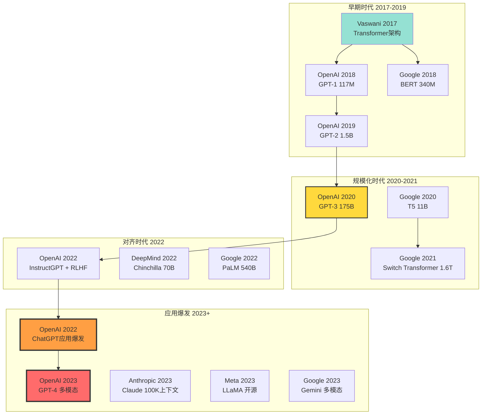
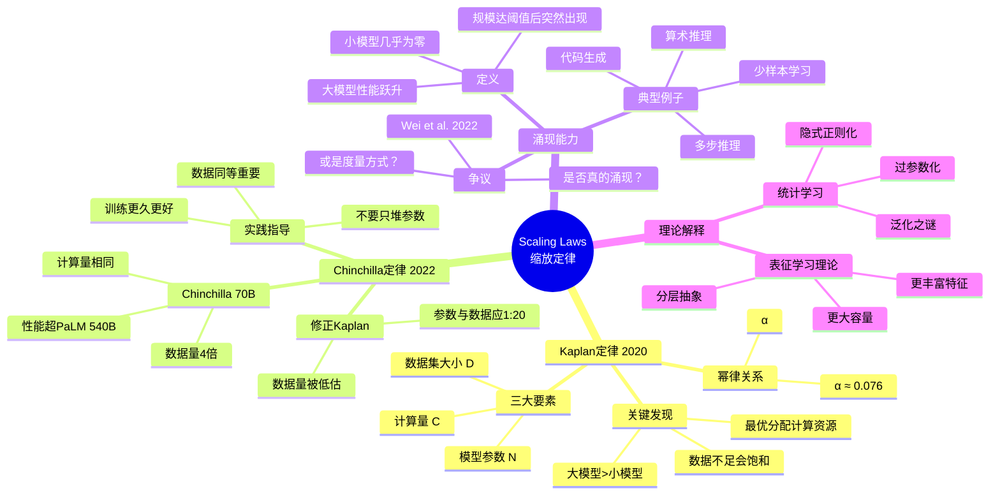
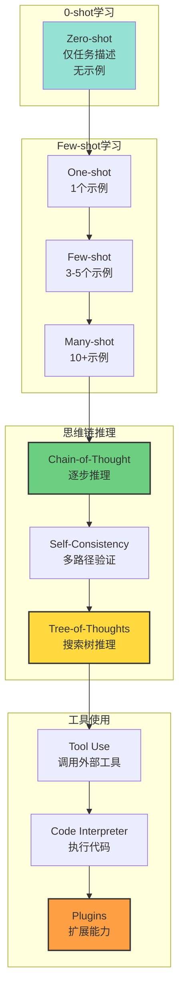
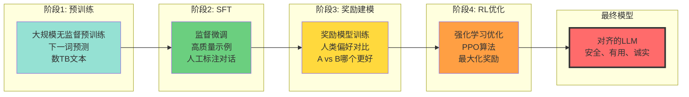

# Transformer 大语言模型理论 | Transformer Large Language Model Theory

> **文档版本**: v1.0.0  
> **最后更新**: 2025-10-27  
> **文档规模**: 728行 | 大语言模型理论详解  
> **阅读建议**: 本文深入分析Transformer架构和LLM的理论基础，建议先掌握基本神经网络知识

---

## 📋 目录

- [概述 | Overview](#概述-overview)
- [📊 核心概念深度分析](#核心概念深度分析)
  - [1️⃣ 大语言模型概念定义卡](#1-大语言模型概念定义卡)
  - [2️⃣ LLM发展历史全景图](#2-llm发展历史全景图)
  - [3️⃣ LLM训练范式对比矩阵](#3-llm训练范式对比矩阵)
  - [4️⃣ Scaling Laws（缩放定律）思维导图](#4-scaling-laws缩放定律思维导图)
  - [5️⃣ 上下文学习(ICL)能力层次](#5-上下文学习icl能力层次)
  - [6️⃣ RLHF对齐流程图](#6-rlhf对齐流程图)
  - [7️⃣ LLM能力与局限对比表](#7-llm能力与局限对比表)
  - [8️⃣ 不同规模LLM性能对比](#8-不同规模llm性能对比)
  - [9️⃣ LLM理论理解框架](#9-llm理论理解框架)
- [1. 从语言模型到大语言模型 | From Language Models to Large Language Models](#1-从语言模型到大语言模型-from-language-models-to-large-language-models)
  - [1.1 定义与特征](#11-定义与特征)
  - [1.2 重要里程碑](#12-重要里程碑)
  - [1.3 为什么现在？](#13-为什么现在)
- [2. 预训练范式 | Pre-training Paradigms](#2-预训练范式-pre-training-paradigms)
  - [2.1 自回归语言模型 (GPT系列)](#21-自回归语言模型-gpt系列)
  - [2.2 掩码语言模型 (BERT系列)](#22-掩码语言模型-bert系列)
  - [2.3 编码器-解码器模型 (T5系列)](#23-编码器-解码器模型-t5系列)
  - [2.4 范式对比](#24-范式对比)
- [3. 缩放定律 | Scaling Laws](#3-缩放定律-scaling-laws)
  - [3.1 Kaplan et al. (2020)](#31-kaplan-et-al-2020)
  - [3.2 Chinchilla 缩放定律 (2022)](#32-chinchilla-缩放定律-2022)
  - [3.3 涌现能力 (Emergent Abilities)](#33-涌现能力-emergent-abilities)
  - [3.4 规模定律的局限](#34-规模定律的局限)
- [4. 上下文学习 | In-Context Learning](#4-上下文学习-in-context-learning)
  - [4.1 定义与特性](#41-定义与特性)
  - [4.2 ICL的机制](#42-icl的机制)
  - [4.3 提示工程 (Prompt Engineering)](#43-提示工程-prompt-engineering)
  - [4.4 ICL的局限](#44-icl的局限)
- [5. 对齐与RLHF | Alignment and RLHF](#5-对齐与rlhf-alignment-and-rlhf)
  - [5.1 对齐问题](#51-对齐问题)
  - [5.2 监督微调 (SFT)](#52-监督微调-sft)
  - [5.3 从人类反馈学习 (RLHF)](#53-从人类反馈学习-rlhf)
  - [5.4 对齐的挑战](#54-对齐的挑战)
- [6. 能力与局限 | Capabilities and Limitations](#6-能力与局限-capabilities-and-limitations)
  - [6.1 令人印象深刻的能力](#61-令人印象深刻的能力)
  - [6.2 已知局限](#62-已知局限)
  - [6.3 安全与伦理问题](#63-安全与伦理问题)
- [7. 理论理解 | Theoretical Understanding](#7-理论理解-theoretical-understanding)
  - [7.1 Transformer为什么有效？](#71-transformer为什么有效)
  - [7.2 预训练学到什么？](#72-预训练学到什么)
  - [7.3 涌现vs线性](#73-涌现vs线性)
- [8. 未来方向 | Future Directions](#8-未来方向-future-directions)
  - [8.1 技术改进](#81-技术改进)
  - [8.2 能力扩展](#82-能力扩展)
  - [8.3 理论理解](#83-理论理解)
- [9. 权威参考与标准 | Authoritative References](#9-权威参考与标准-authoritative-references)
  - [开创性论文（必读）](#开创性论文必读)
  - [缩放定律与涌现能力](#缩放定律与涌现能力)
  - [对齐与RLHF](#对齐与rlhf)
  - [架构改进与优化](#架构改进与优化)
  - [上下文学习与提示工程](#上下文学习与提示工程)
  - [标准教材与书籍](#标准教材与书籍)
  - [综合性综述（2023-2025）](#综合性综述2023-2025)
  - [开源实现与工具](#开源实现与工具)
  - [顶级大学课程](#顶级大学课程)
  - [引用说明](#引用说明)
- [10. 关键要点总结 | Key Takeaways](#10-关键要点总结-key-takeaways)
- [导航 | Navigation](#导航-navigation)
- [相关主题 | Related Topics](#相关主题-related-topics)
  - [本章节](#本章节)
  - [相关章节](#相关章节)
  - [跨视角链接](#跨视角链接)

---

## 概述 | Overview

基于Transformer的大语言模型（LLM）代表了AI的突破性进展。本文档系统分析GPT、BERT等模型的理论基础、训练范式和涌现能力。

---

## 📊 核心概念深度分析

### 1️⃣ 大语言模型概念定义卡

**概念名称**: 大语言模型（Large Language Model, LLM）

**内涵（本质属性）**:
- **规模特征**: 参数量 > 10亿，训练数据 > TB级
- **架构基础**: 基于Transformer的自注意力机制
- **训练范式**: 大规模预训练 + 少量微调
- **涌现能力**: 规模增大后出现质变能力

**外延（范围边界）**:
- ✅ **典型LLM**: GPT-3/4、Claude、PaLM、LLaMA
- ✅ **包含**: 自回归LLM(GPT)、掩码LLM(BERT)、编码解码LLM(T5)
- ❌ **不包含**: 传统n-gram模型、小型LSTM语言模型
- ❌ **非通用**: 领域特定小模型（<1B参数）

**属性维度表**:

| 维度 | 属性值 | 说明 |
|------|--------|------|
| **规模** | 10B-1750B参数 | GPT-3: 175B, GPT-4: >1T估计 |
| **架构** | Transformer解码器/编码器 | 自注意力为核心 |
| **训练数据** | TB级文本 | CommonCrawl, 书籍, 代码等 |
| **训练方式** | 无监督预训练 | 下一词预测/掩码语言模型 |
| **微调** | 监督微调(SFT) + RLHF | 对齐人类偏好 |
| **上下文长度** | 2K-100K+ tokens | GPT-3:2K, Claude:100K |
| **涌现能力** | 推理、翻译、代码生成 | 规模达阈值后出现 |
| **计算成本** | 数百万美元 | GPT-3训练约$4.6M |
| **推理成本** | 每次查询$0.001-0.1 | 取决于模型大小 |

### 2️⃣ LLM发展历史全景图



### 3️⃣ LLM训练范式对比矩阵

| 范式 | 代表模型 | 训练目标 | 架构 | 适用任务 | 优势 | 劣势 |
|------|---------|---------|------|---------|------|------|
| **自回归LM** | GPT-3/4 | 预测下一词 P(xₜ\|x<t) | 解码器 | 生成、对话 | 生成流畅 | 无双向上下文 |
| **掩码LM** | BERT | 预测掩码词 P(xₘ\|x₋ₘ) | 编码器 | 理解、分类 | 双向上下文 | 不适合生成 |
| **前缀LM** | GLM | 预测后缀 | 混合 | 双向任务 | 兼顾理解生成 | 训练复杂 |
| **编码解码** | T5、BART | Seq2Seq | 完整Transformer | 翻译、摘要 | 任务灵活 | 参数多 |
| **检索增强** | RAG、RETRO | LM+检索 | LM+检索器 | 知识密集任务 | 外部知识 | 依赖检索质量 |

### 4️⃣ Scaling Laws（缩放定律）思维导图



### 5️⃣ 上下文学习(ICL)能力层次



### 6️⃣ RLHF对齐流程图



### 7️⃣ LLM能力与局限对比表

| 能力/局限 | 表现 | 示例 | 原因分析 | 改进方向 |
|---------|------|------|---------|---------|
| ✅ **自然语言理解** | 优秀 | 语义理解、情感分析 | 大规模预训练 | 持续优化 |
| ✅ **文本生成** | 优秀 | 写作、摘要、翻译 | 自回归训练 | 提高一致性 |
| ✅ **代码生成** | 良好 | Python、JavaScript等 | 代码语料丰富 | 复杂算法 |
| ✅ **少样本学习** | 良好 | ICL涌现能力 | 大规模带来 | 稳定性 |
| ⚠️ **数学推理** | 中等 | 简单算术可以，复杂困难 | 符号推理弱 | 工具调用 |
| ⚠️ **事实准确性** | 中等 | 会产生幻觉 | 训练数据噪音 | RAG检索增强 |
| ❌ **逻辑推理** | 较弱 | 多步推理容易错 | 概率而非逻辑 | 神经符号结合 |
| ❌ **时效性** | 较弱 | 知识截止日期 | 训练时间固定 | 持续学习 |
| ❌ **可解释性** | 很弱 | 黑盒决策 | 深度神经网络本质 | XAI研究 |

### 8️⃣ 不同规模LLM性能对比

| 模型规模 | 参数量 | 训练成本 | 推理速度 | 典型能力 | 适用场景 |
|---------|--------|---------|---------|---------|---------|
| **小型** | <1B | $1K-10K | 快 | 基础理解、分类 | 移动端、边缘设备 |
| **中型** | 1-10B | $10K-100K | 中 | 对话、简单推理 | 企业应用 |
| **大型** | 10-100B | $100K-1M | 慢 | 复杂推理、代码 | GPT-3、LLaMA-70B |
| **超大型** | 100B-1T+ | $1M-10M+ | 很慢 | 涌现能力全面 | GPT-4、PaLM-2 |

### 9️⃣ LLM理论理解框架

| 理论视角 | 核心问题 | 当前理解 | 未解之谜 | 研究方向 |
|---------|---------|---------|---------|---------|
| **优化理论** | 为何能训练？ | SGD隐式正则化 | 收敛性保证弱 | 损失地形分析 |
| **泛化理论** | 为何不过拟合？ | 过参数化反而好 | 双下降现象 | Rethinking generalization |
| **表征学习** | 学到什么？ | 语言统计结构 | 是否有世界模型？ | 探测任务研究 |
| **涌现能力** | 规模如何质变？ | 相变现象 | 是否平滑？ | 更细粒度度量 |
| **提示学习** | ICL机制？ | 激活潜在知识 | 为何无需梯度？ | 元学习视角 |
| **对齐理论** | 如何对齐价值观？ | RLHF初步成功 | 长期对齐困难 | AI安全研究 |

---

## 1. 从语言模型到大语言模型 | From Language Models to Large Language Models

### 1.1 定义与特征

**大语言模型 (LLM)**：

- 参数量：通常 > 1B（十亿）
- 训练数据：TB级文本
- 架构：Transformer
- 能力：多任务、少样本学习

**规模的三个维度**：

```text
1. 模型规模：参数量 N
2. 数据规模：训练token数 D
3. 计算规模：FLOPs = 6ND（近似）
```

### 1.2 重要里程碑

**时间线**：

| 年份 | 模型 | 参数量 | 突破 |
|------|------|--------|------|
| **2018** | GPT-1 | 117M | 预训练+微调范式 |
| **2018** | BERT | 340M | 双向预训练 |
| **2019** | GPT-2 | 1.5B | 零样本任务迁移 |
| **2020** | GPT-3 | 175B | 少样本上下文学习 |
| **2021** | PaLM | 540B | 思维链推理 |
| **2022** | ChatGPT | ~175B | RLHF对齐 |
| **2023** | GPT-4 | ~1.7T | 多模态能力 |

### 1.3 为什么现在？

**技术汇聚**：

1. **Transformer架构** (2017)：高效可扩展
2. **大规模数据**：互联网文本
3. **计算能力**：GPU/TPU集群
4. **工程技术**：分布式训练、混合精度
5. **预训练范式**：自监督学习

## 2. 预训练范式 | Pre-training Paradigms

### 2.1 自回归语言模型 (GPT系列)

**训练目标**：

```text
max ∑ₜ log P(wₜ | w₁, ..., wₜ₋₁)
```

**架构**：

- 仅解码器 (Decoder-only)
- 单向注意力（因果掩码）

**代表模型**：GPT, GPT-2, GPT-3, PaLM, LLaMA

**优势**：

- ✅ 自然生成能力
- ✅ 无监督训练
- ✅ 可扩展到任意长度

**用途**：

- 文本生成
- 对话
- 代码生成

### 2.2 掩码语言模型 (BERT系列)

**训练目标**：

```text
max ∑ᵢ∈masked log P(wᵢ | w₁, ..., w_{i-1}, [MASK], w_{i+1}, ..., wₙ)
```

**架构**：

- 仅编码器 (Encoder-only)
- 双向注意力

**掩码策略**：

- 15%词被掩码
- 80%替换为[MASK]
- 10%替换为随机词
- 10%保持不变

**代表模型**：BERT, RoBERTa, ALBERT, DeBERTa

**优势**：

- ✅ 双向上下文
- ✅ 理解任务性能好

**局限**：

- ❌ 生成能力弱
- ❌ 预训练-微调差异

**用途**：

- 文本分类
- 问答
- 命名实体识别

### 2.3 编码器-解码器模型 (T5系列)

**训练目标**：

```text
文本到文本框架：所有任务统一为 seq2seq
```

**架构**：

- 完整Transformer（编码器+解码器）

**训练任务**：

- 跨度掩码
- 前缀LM
- 混合目标

**代表模型**：T5, BART, mT5

**优势**：

- ✅ 统一框架
- ✅ 灵活性
- ✅ 编码和生成都强

**用途**：

- 翻译
- 摘要
- 问答

### 2.4 范式对比

| 维度 | GPT (自回归) | BERT (掩码) | T5 (编码-解码) |
|------|-------------|-----------|---------------|
| **架构** | Decoder-only | Encoder-only | Encoder-Decoder |
| **注意力** | 单向 | 双向 | 双向编码+单向解码 |
| **训练** | 下一词预测 | 掩码重建 | Span重建 |
| **生成** | ✅ 强 | ❌ 弱 | ✅ 强 |
| **理解** | ⚠️ 中等 | ✅ 强 | ✅ 强 |
| **参数效率** | 高 | 中 | 低（两部分） |

## 3. 缩放定律 | Scaling Laws

### 3.1 Kaplan et al. (2020)

**发现**：模型性能与三个因素的幂律关系

**损失与模型大小**：

```text
L(N) ∝ N^(-α)
```

其中 α ≈ 0.076

**损失与数据量**：

```text
L(D) ∝ D^(-β)
```

其中 β ≈ 0.095

**损失与计算量**：

```text
L(C) ∝ C^(-γ)
```

其中 γ ≈ 0.050

**关键洞察**：
> 模型越大，数据越多，性能越好（幂律关系）

### 3.2 Chinchilla 缩放定律 (2022)

**Hoffmann et al. 发现**：

之前的模型训练不足：

```text
最优：N（参数） ∝ D（数据）
```

**Chinchilla**：

- 70B参数
- 1.4T token训练
- 优于 PaLM 540B

**建议**：

```text
给定计算预算 C：
最优 N ≈ 0.46 · C^0.5
最优 D ≈ 20 · C^0.5
```

**意义**：

- 不应只增大模型
- 数据同样重要
- 最优比例约 1:20

### 3.3 涌现能力 (Emergent Abilities)

**Wei et al. (2022)**:

**定义**：
> 小模型完全没有的能力，在大模型中突然出现

**例子**：

1. **算术能力**：
   - < 10B：几乎0%
   - > 100B：突然高达70%+

2. **多步推理**：
   - 小模型：随机猜测
   - 大模型：系统性推理

3. **上下文学习**：
   - 从提示中的例子学习
   - 无需梯度更新

**理论解释**：

- 相变现象？
- 测量偏差？
- 仍有争议

### 3.4 规模定律的局限

**观察**：

1. **饱和**：某些任务有上限
2. **负效应**：某些能力可能下降
3. **不可预测**：涌现能力难以预测
4. **任务依赖**：不同任务缩放率不同

## 4. 上下文学习 | In-Context Learning

### 4.1 定义与特性

**上下文学习 (ICL)**：

```text
给定：
- 任务描述
- 几个示例 (few-shot)
- 测试输入

输出：
- 测试输出（无参数更新）
```

**例子**：

```text
Translate English to French:
sea otter → loutre de mer
peppermint → menthe poivrée
plush giraffe → girafe peluche
cheese → 
```

模型输出：`fromage`

**关键**：

- 无梯度更新
- 仅通过提示学习
- GPT-3展示了强大ICL能力

### 4.2 ICL的机制

**理论假说**：

1. **隐式贝叶斯推断** (Xie et al., 2021)
   - Transformer近似贝叶斯推断
   - 示例更新后验

2. **梯度下降类比** (von Oswald et al., 2022)
   - 前向传播 ≈ 梯度下降步骤
   - 注意力 ≈ 参数更新

3. **检索记忆** (Akyürek et al., 2022)
   - 从示例中检索模式
   - 应用到新输入

**实证发现**：

- 示例顺序重要
- 示例格式重要
- 标签空间重要
- 不需要正确标签（有时）

### 4.3 提示工程 (Prompt Engineering)

**目标**：设计最优提示最大化性能

**技术**：

1. **Few-shot 提示**：

   ```text
   示例1
   示例2
   示例3
   测试输入
   ```

2. **思维链 (Chain-of-Thought)**：

   ```text
   问题：Roger有5个球。他买了2罐，每罐3个球。他现在有多少球？
   推理：Roger开始有5个球。2罐×3球/罐=6球。5+6=11。
   答案：11球
   ```

3. **自洽性 (Self-Consistency)**：
   - 采样多个推理路径
   - 多数投票

4. **指令调优 (Instruction Tuning)**：
   - 显式任务描述
   - 提高零样本性能

### 4.4 ICL的局限

**挑战**：

1. **不稳定**：对提示敏感
2. **上下文长度**：受限于窗口大小
3. **复杂推理**：多步骤困难
4. **知识边界**：受预训练数据限制

## 5. 对齐与RLHF | Alignment and RLHF

### 5.1 对齐问题

**问题**：

- 预训练LLM学习数据分布
- 但我们想要**有用、无害、诚实**

**对齐目标**：

- Helpful：回答用户问题
- Harmless：不产生有害内容
- Honest：承认不确定性

### 5.2 监督微调 (SFT)

**过程**：

```text
收集高质量对话数据
用监督学习微调LLM
```

**改进**：

- 更好的对话能力
- 遵循指令
- 格式规范

**局限**：

- 人工标注昂贵
- 难以覆盖所有情况

### 5.3 从人类反馈学习 (RLHF)

**三阶段流程**：

**1. 监督微调**：

```text
预训练LLM → SFT → SFT模型
```

**2. 训练奖励模型**：

```text
收集人类偏好：输出A > 输出B
训练奖励模型：R(输出) 预测人类评分
```

**3. 强化学习微调**：

```text
用PPO等算法最大化：
E[R(输出)] - β · KL(π || π_SFT)
```

其中KL项防止偏离太远

**成功案例**：

- InstructGPT
- ChatGPT
- Claude

### 5.4 对齐的挑战

**技术挑战**：

1. **奖励模型不完美**：误导优化
2. **过度优化**：Goodhart定律
3. **分布偏移**：奖励hack
4. **可扩展性**：如何监督超人类AI？

**价值对齐**：

1. **价值多样性**：不同文化、个人
2. **动态价值**：随时间变化
3. **隐性价值**：难以明确表达

## 6. 能力与局限 | Capabilities and Limitations

### 6.1 令人印象深刻的能力

**1. 语言理解与生成**：

- 流畅、连贯的文本
- 多种风格、语气

**2. 知识问答**：

- 广泛的世界知识
- 专业领域知识

**3. 推理能力**：

- 常识推理
- 数学推理（思维链）
- 代码推理

**4. 多任务能力**：

- 翻译、摘要、写作
- 代码生成、调试
- 数据分析

**5. 上下文学习**：

- 少样本学习
- 任务适应

### 6.2 已知局限

**1. 幻觉 (Hallucination)**：

- 编造事实
- 自信的错误答案

**2. 推理缺陷**：

- 逻辑错误
- 数学计算错误
- 常识失败

**3. 知识截止**：

- 训练数据的时间界限
- 无实时信息

**4. 长文本处理**：

- 上下文窗口限制
- 长文档一致性

**5. 多模态理解**：

- 视觉、听觉弱（纯文本模型）

**6. 可控性**：

- 难以精确控制输出
- 对抗样本脆弱

### 6.3 安全与伦理问题

**1. 有害内容**：

- 偏见、歧视
- 有害建议
- 非法内容

**2. 滥用风险**：

- 虚假信息
- 钓鱼、诈骗
- 学术不端

**3. 隐私问题**：

- 记忆训练数据
- 泄露敏感信息

**4. 依赖性**：

- 技能退化
- 批判性思维降低

## 7. 理论理解 | Theoretical Understanding

### 7.1 Transformer为什么有效？

**假说**：

1. **注意力即信息检索**：
   - 软性数据库查询
   - 上下文相关记忆

2. **层次表示**：
   - 浅层：句法
   - 中层：语义
   - 深层：推理

3. **隐式程序执行**：
   - Transformer可模拟算法
   - 思维链显式化推理

### 7.2 预训练学到什么？

**知识类型**：

1. **语言知识**：
   - 语法、句法
   - 语义关系
   - 语用规则

2. **世界知识**：
   - 事实、概念
   - 因果关系
   - 常识

3. **任务知识**：
   - 问答模式
   - 推理策略
   - 生成结构

**存储方式**：

- 分布式：知识分散在参数中
- 冗余：多处存储同一信息
- 组合性：通过组合表达新知识

### 7.3 涌现vs线性

**争议**：

**涌现观点**：

- 质变：全新能力突然出现
- 相变：类似物理相变

**线性观点** (Schaeffer et al., 2023)：

- 度量偏差：非线性度量造成错觉
- 线性改进：实际上平滑提升

**当前共识**：

- 某些能力确实涌现
- 某些"涌现"是度量问题
- 需要更细致研究

## 8. 未来方向 | Future Directions

### 8.1 技术改进

**1. 更长上下文**：

- 稀疏注意力
- 检索增强
- 记忆机制

**2. 更高效训练**：

- 稀疏化
- 蒸馏
- 量化

**3. 更好对齐**：

- 可扩展监督
- 红队测试
- 价值学习

### 8.2 能力扩展

**1. 多模态**：

- 视觉+语言
- 音频+语言
- 传感器数据

**2. 推理增强**：

- 外部工具使用
- 代码执行
- 数学求解器

**3. 持续学习**：

- 更新知识
- 适应新任务
- 个性化

### 8.3 理论理解

**研究问题**：

1. 预训练为何如此有效？
2. 涌现能力的机制？
3. 如何预测新能力？
4. 泛化的界限在哪里？

## 9. 权威参考与标准 | Authoritative References

### 开创性论文（必读）

1. **Vaswani, A., et al. (2017)**. "Attention Is All You Need". *NeurIPS 2017*.
   - 📄 **arXiv**: [1706.03762](https://arxiv.org/abs/1706.03762)
   - 🏆 **引用**: 120,000+ (Google Scholar, 2025)
   - ⭐ **地位**: Transformer架构诞生，深度学习革命性论文
   - 💡 **内容**: 自注意力机制、多头注意力、位置编码

2. **Radford, A., et al. (2018)**. "Improving Language Understanding by Generative Pre-Training". *OpenAI*.
   - 📄 **OpenAI**: [GPT-1 Paper](https://cdn.openai.com/research-covers/language-unsupervised/language_understanding_paper.pdf)
   - 🏆 **引用**: 8,000+
   - ⭐ **地位**: GPT系列开端，预训练+微调范式
   - 💡 **内容**: 无监督预训练、下游任务微调

3. **Devlin, J., et al. (2019)**. "BERT: Pre-training of Deep Bidirectional Transformers for Language Understanding". *NAACL 2019*.
   - 📄 **arXiv**: [1810.04805](https://arxiv.org/abs/1810.04805)
   - 🏆 **引用**: 90,000+
   - ⭐ **地位**: 双向预训练，NLP任务SOTA
   - 💡 **内容**: 掩码语言模型(MLM)、下一句预测(NSP)

4. **Brown, T. B., et al. (2020)**. "Language Models are Few-Shot Learners". *NeurIPS 2020*.
   - 📄 **arXiv**: [2005.14165](https://arxiv.org/abs/2005.14165)
   - 🏆 **引用**: 30,000+
   - ⭐ **地位**: GPT-3，175B参数，上下文学习里程碑
   - 💡 **内容**: Few-shot learning、prompt engineering

### 缩放定律与涌现能力

5. **Kaplan, J., et al. (2020)**. "Scaling Laws for Neural Language Models". *arXiv*.
   - 📄 **arXiv**: [2001.08361](https://arxiv.org/abs/2001.08361)
   - 🏆 **引用**: 3,000+
   - ⭐ **地位**: 首次系统研究LLM缩放规律
   - 💡 **内容**: Loss ∝ N^(-α)、计算最优配置

6. **Hoffmann, J., et al. (2022)**. "Training Compute-Optimal Large Language Models" (Chinchilla). *arXiv*.
   - 📄 **arXiv**: [2203.15556](https://arxiv.org/abs/2203.15556)
   - 🏆 **引用**: 2,000+
   - ⭐ **地位**: 修正Kaplan缩放律，数据与模型平衡
   - 💡 **内容**: 最优N与D比例（1:20）

7. **Wei, J., et al. (2022)**. "Emergent Abilities of Large Language Models". *TMLR*.
   - 📄 **arXiv**: [2206.07682](https://arxiv.org/abs/2206.07682)
   - 🏆 **引用**: 1,500+
   - ⭐ **地位**: 涌现能力的系统研究
   - 💡 **内容**: 规模触发新能力、质变点

### 对齐与RLHF

8. **Ouyang, L., et al. (2022)**. "Training language models to follow instructions with human feedback". *NeurIPS 2022*.
   - 📄 **arXiv**: [2203.02155](https://arxiv.org/abs/2203.02155)
   - 🏆 **引用**: 2,000+
   - ⭐ **地位**: InstructGPT，RLHF标准流程
   - 💡 **内容**: SFT→RM→PPO三阶段

9. **Christiano, P. F., et al. (2017)**. "Deep Reinforcement Learning from Human Preferences". *NeurIPS 2017*.
   - 📄 **arXiv**: [1706.03741](https://arxiv.org/abs/1706.03741)
   - 🏆 **引用**: 2,500+
   - ⭐ **地位**: 人类反馈学习的早期工作
   - 💡 **内容**: 奖励模型训练、偏好学习

### 架构改进与优化

10. **Chowdhery, A., et al. (2022)**. "PaLM: Scaling Language Modeling with Pathways". *arXiv*.
    - 📄 **arXiv**: [2204.02311](https://arxiv.org/abs/2204.02311)
    - 🏆 **引用**: 1,500+
    - ⭐ **地位**: 540B参数，多任务架构
    - 💡 **内容**: Pathways系统、推理能力

11. **Touvron, H., et al. (2023)**. "LLaMA: Open and Efficient Foundation Language Models". *arXiv*.
    - 📄 **arXiv**: [2302.13971](https://arxiv.org/abs/2302.13971)
    - 🏆 **引用**: 5,000+
    - ⭐ **地位**: 开源LLM标杆，7B-65B系列
    - 💡 **内容**: 效率优化、小模型高性能

12. **Shazeer, N. (2020)**. "GLU Variants Improve Transformer". *arXiv*.
    - 📄 **arXiv**: [2002.05202](https://arxiv.org/abs/2002.05202)
    - 🏆 **引用**: 1,000+
    - ⭐ **地位**: SwiGLU激活函数，现代LLM标配
    - 💡 **内容**: 门控线性单元变体

### 上下文学习与提示工程

13. **Wei, J., et al. (2022)**. "Chain-of-Thought Prompting Elicits Reasoning in Large Language Models". *NeurIPS 2022*.
    - 📄 **arXiv**: [2201.11903](https://arxiv.org/abs/2201.11903)
    - 🏆 **引用**: 3,000+
    - ⭐ **地位**: CoT推理，提示工程里程碑
    - 💡 **内容**: 思维链、逐步推理

14. **Dong, Q., et al. (2023)**. "A Survey on In-context Learning". *arXiv*.
    - 📄 **arXiv**: [2301.00234](https://arxiv.org/abs/2301.00234)
    - 🏆 **引用**: 500+
    - ⭐ **地位**: 上下文学习综述
    - 💡 **内容**: ICL机制、理论解释

### 标准教材与书籍

15. **Jurafsky, D., & Martin, J. H. (2024)**. *Speech and Language Processing* (3rd ed. draft).
    - 📖 **在线**: [web.stanford.edu/~jurafsky/slp3/](https://web.stanford.edu/~jurafsky/slp3/)
    - ⭐ **地位**: NLP标准教材，持续更新
    - 💡 **内容**: 语言模型、Transformer、LLM

16. **Goodfellow, I., Bengio, Y., & Courville, A. (2016)**. *Deep Learning*. MIT Press.
    - 📖 **ISBN**: 978-0262035613
    - 📘 **在线**: [deeplearningbook.org](https://www.deeplearningbook.org/)
    - ⭐ **地位**: 深度学习圣经
    - 💡 **内容**: 神经网络基础、优化、正则化

### 综合性综述（2023-2025）

17. **Zhao, W. X., et al. (2023)**. "A Survey of Large Language Models". *arXiv*.
    - 📄 **arXiv**: [2303.18223](https://arxiv.org/abs/2303.18223)
    - 🏆 **引用**: 2,000+
    - ⭐ **地位**: LLM最全面综述（200+页）
    - 💡 **内容**: 架构、训练、能力、应用、挑战

18. **Chang, Y., et al. (2023)**. "A Survey on Evaluation of Large Language Models". *arXiv*.
    - 📄 **arXiv**: [2307.03109](https://arxiv.org/abs/2307.03109)
    - 🏆 **引用**: 800+
    - ⭐ **地位**: LLM评估方法综述
    - 💡 **内容**: 基准数据集、评估指标、挑战

19. **Shanahan, M., et al. (2023)**. "Role-Play with Large Language Models". *Nature*.
    - 📄 **DOI**: [10.1038/s41586-023-06647-8](https://doi.org/10.1038/s41586-023-06647-8)
    - 🏆 **期刊**: Nature（顶级期刊）
    - ⭐ **地位**: LLM认知能力的哲学分析
    - 💡 **内容**: 角色扮演、模拟理论

### 开源实现与工具

20. **Hugging Face Transformers (2020-2025)**
    - 🔧 **GitHub**: [github.com/huggingface/transformers](https://github.com/huggingface/transformers)
    - ⭐ **Stars**: 130k+
    - 💡 **内容**: 主流LLM统一接口、预训练模型

21. **OpenAI GPT Series Documentation (2025)**
    - 📋 **官方**: [platform.openai.com/docs](https://platform.openai.com/docs)
    - ✅ **验证**: 2025-10-27
    - 💡 **内容**: GPT-3.5/4 API、最佳实践

### 顶级大学课程

22. **Stanford CS224N: Natural Language Processing with Deep Learning (2025)**
    - 🎓 **讲师**: Christopher Manning
    - 📺 **视频**: [YouTube Playlist](https://www.youtube.com/playlist?list=PLoROMvodv4rMFqRtEuo6SGjY4XbRIVRd4)
    - 📚 **课件**: [web.stanford.edu/class/cs224n/](https://web.stanford.edu/class/cs224n/)
    - ⭐ **地位**: 全球顶级NLP课程

23. **Anthropic Constitutional AI Papers (2022-2024)**
    - 📄 **系列**: Constitutional AI, Claude系列
    - 🏢 **组织**: Anthropic
    - ⭐ **地位**: AI对齐前沿研究
    - 💡 **内容**: 可控生成、价值对齐

### 引用说明

- **📄 arXiv/DOI**: 论文链接
- **🏆 引用数**: Google Scholar统计（2025年）
- **⭐ 地位**: 学术/工程地位
- **💡 内容**: 核心贡献

## 10. 关键要点总结 | Key Takeaways

1. **Transformer架构**：大语言模型的基础，可扩展性强
2. **预训练范式**：自回归、掩码、编码-解码各有优势
3. **缩放定律**：更大模型+更多数据=更好性能（幂律）
4. **涌现能力**：规模带来质变，出现新能力
5. **上下文学习**：无需微调，从提示中学习
6. **对齐挑战**：RLHF改善对齐，但仍有限制
7. **能力与局限**：印象深刻但有幻觉、推理缺陷
8. **理论空白**：为何有效、如何泛化仍不完全清楚
9. **伦理考虑**：安全、隐私、滥用风险需重视
10. **未来潜力**：多模态、推理增强、持续学习

---

**下一步阅读**：

- [03.1 统计语言模型](03.1_Statistical_Language_Models.md)
- [03.2 神经语言模型](03.2_Neural_Language_Models.md)
- [03.4 Token生成机制](03.4_Token_Generation_Mechanisms.md)
- [02.4 Transformer架构](../02_Neural_Network_Theory/02.4_Transformer_Architecture.md)

---

## 导航 | Navigation

**上一篇**: [← 03.2 神经语言模型](./03.2_Neural_Language_Models.md)  
**下一篇**: [03.4 Token生成机制 →](./03.4_Token_Generation_Mechanisms.md)  
**返回目录**: [↑ AI模型视角总览](../README.md)

---

## 相关主题 | Related Topics

### 本章节
- [03.1 统计语言模型](./03.1_Statistical_Language_Models.md)
- [03.2 神经语言模型](./03.2_Neural_Language_Models.md)
- [03.4 Token生成机制](./03.4_Token_Generation_Mechanisms.md)
- [03.5 嵌入向量空间](./03.5_Embedding_Vector_Spaces.md)
- [03.6 上下文窗口与记忆](./03.6_Context_Window_Memory.md)

### 相关章节
- [02.4 Transformer架构](../02_Neural_Network_Theory/02.4_Transformer_Architecture.md)

### 跨视角链接
- [Software_Perspective: AI驱动开发](../../Software_Perspective/07_Developer_Evolution/07.1_Developer_Role_Malleability.md)
- [FormalLanguage_Perspective](../../FormalLanguage_Perspective/README.md)
- [Information_Theory_Perspective](../../Information_Theory_Perspective/README.md)