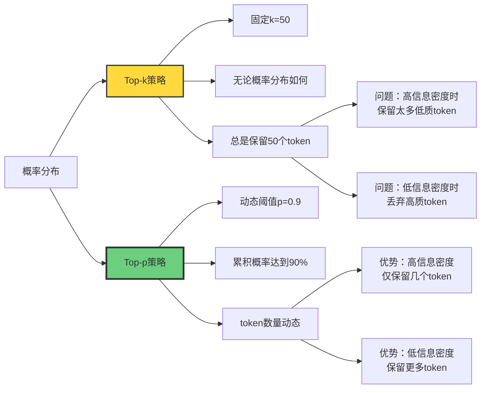
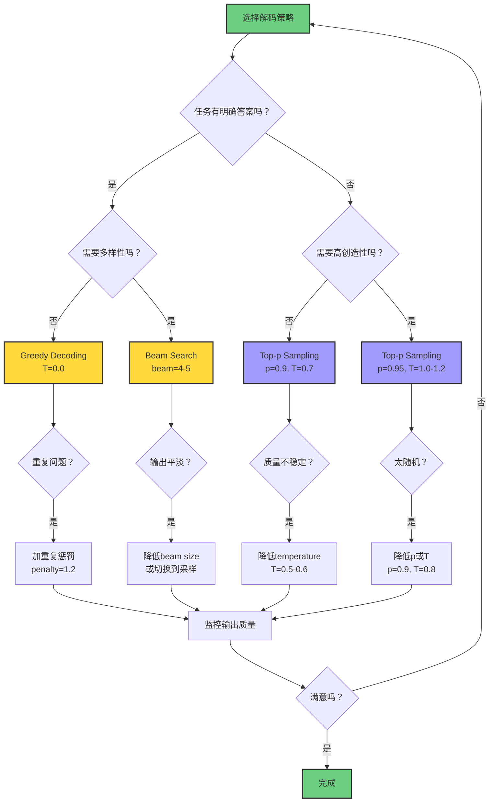

# Token 生成机制 | Token Generation Mechanisms

> **文档版本**: v1.0.0  
> **最后更新**: 2025-10-27  
> **文档规模**: 609行 | Token生成与解码策略  
> **阅读建议**: 本文详解从模型输出到文本生成的全过程，是理解LLM推理机制的关键

---

## 核心概念深度分析

<details>
<summary><b>🎲📝 点击展开：Token生成机制全流程深度分析</b></summary>

本节深入剖析从模型logits到最终文本的完整生成过程，揭示各种解码策略的数学原理、权衡取舍及实践指南。

### 1️⃣ Token生成机制概念定义卡

**概念名称**: Token生成机制（Token Generation Mechanisms）

**内涵（本质属性）**:

**🔹 核心流程**:
将模型输出的logits向量转换为自然语言文本的多步骤过程：

$$
\text{隐状态} \xrightarrow{\text{线性层}} \text{logits} \xrightarrow{\text{Softmax}} \text{概率} \xrightarrow{\text{解码策略}} \text{token序列}
$$

**🔹 三大组件**:

| 组件 | 输入 | 输出 | 作用 |
|------|------|------|------|
| **Tokenization** | 文本字符串 | Token ID序列 | 编码 |
| **模型推理** | Token IDs | Logits向量 | 预测 |
| **解码策略** | Logits/概率 | 下一个Token | 采样 |

**🔹 数学形式化**:

**自回归生成**:
$$
P(w_1, \ldots, w_T) = \prod_{t=1}^{T} P_\theta(w_t \mid w_1, \ldots, w_{t-1})
$$

**单步生成**:
$$
\begin{align}
\text{logits}_t &= W_{\text{out}} h_t + b \\
P(w_t \mid w_{<t}) &= \text{softmax}(\text{logits}_t / T)
\end{align}
$$

**外延（范围边界）**:

| 维度 | 包含 ✅ | 不包含 ❌ |
|------|---------|----------|
| **Tokenization方法** | BPE、WordPiece、SentencePiece | 字符级、纯词级 |
| **解码策略** | Greedy、Beam Search、Sampling | 强化学习解码 |
| **采样方法** | Top-k、Top-p、Temperature | Gumbel采样（罕见） |
| **应用场景** | 文本生成、翻译、对话 | 图像生成、语音合成 |

**属性维度表**:

| 维度 | 值/描述 | 说明 |
|------|---------|------|
| **核心挑战** | 探索-利用平衡 | 多样性 vs 质量 |
| **时间复杂度** | $O(T \cdot \|V\|)$（Greedy） | $T$序列长度，$\|V\|$词表 |
| **Beam Search复杂度** | $O(T \cdot B \cdot \|V\|)$ | $B$是beam size |
| **默认策略** | GPT：Top-p=0.9, T=0.7 | ChatGPT配置 |
| **确定性** | Greedy: ✅ / Sampling: ❌ | 可复现性差异 |
| **适用性** | 任务依赖 | 翻译vs创作不同 |

---

### 2️⃣ Token生成全流程详细图

```mermaid
graph TB
    Input[输入文本:<br/>"The cat"]
    
    Input --> Tokenize[Tokenization<br/>BPE/WordPiece]
    Tokenize --> IDs["Token IDs: [464, 3797]"]
    
    IDs --> Model[Transformer模型]
    Model --> Hidden["最后隐状态 h<sub>t</sub> ∈ ℝ<sup>d</sup>"]
    
    Hidden --> Linear["线性层: W<sub>out</sub>h + b"]
    Linear --> Logits["Logits ∈ ℝ<sup>|V|</sup><br/>[2.5, 3.1, -0.5, ..., 1.2]"]
    
    Logits --> Temperature["温度缩放<br/>logits/T"]
    Temperature --> Softmax["Softmax归一化"]
    Softmax --> Probs["概率分布 P(w|context)<br/>[0.05, 0.12, ..., 0.03]"]
    
    Probs --> Filter[过滤策略]
    Filter --> TopK[Top-k过滤]
    Filter --> TopP[Top-p/Nucleus过滤]
    
    TopK --> Renorm1[重归一化]
    TopP --> Renorm2[重归一化]
    
    Renorm1 --> Strategy[解码策略]
    Renorm2 --> Strategy
    
    Strategy --> Greedy[Greedy: argmax]
    Strategy --> Beam[Beam Search]
    Strategy --> Sample[Sampling]
    
    Greedy --> NextToken1["下一个Token: 'sat'"]
    Beam --> NextToken2["Beam: ['sat', 'is']"]
    Sample --> NextToken3["采样Token: 'sat'"]
    
    NextToken1 --> Repeat[重复直到<eos>或max_len]
    NextToken2 --> Repeat
    NextToken3 --> Repeat
    
    Repeat --> Output["输出文本:<br/>'The cat sat on the mat'"]
    
    style Input fill:#6bcf7f,stroke:#333,stroke-width:2px
    style Probs fill:#ffd93d,stroke:#333,stroke-width:3px
    style Strategy fill:#ff6b6b,stroke:#333,stroke-width:3px
    style Output fill:#6bcf7f,stroke:#333,stroke-width:2px
```

---

### 3️⃣ 解码策略全面对比矩阵

| 解码策略 | 确定性 | 质量 | 多样性 | 速度 | 计算成本 | 重复问题 | 适用场景 |
|---------|-------|------|--------|------|---------|---------|---------|
| **Greedy** | ✅ 是 | ⚠️ 中 | ❌ 低 | ✅✅✅ 快 | ✅✅✅ 低 | ❌❌ 严重 | 翻译、摘要 |
| **Beam Search** | ✅ 是 | ✅✅ 高 | ⚠️ 中 | ⚠️ 中 | ⚠️ 中 | ⚠️ 中等 | 翻译、标题生成 |
| **Pure Sampling** | ❌ 否 | ❌ 低 | ✅✅✅ 高 | ✅✅ 快 | ✅✅ 低 | ✅ 少 | 创意写作（慎用） |
| **Top-k (k=50)** | ❌ 否 | ⚠️⚠️ 中高 | ✅✅ 高 | ✅✅ 快 | ✅✅ 低 | ✅ 少 | 开放域对话 |
| **Top-p (p=0.9)** | ❌ 否 | ✅✅ 高 | ✅✅ 高 | ✅✅ 快 | ✅✅ 低 | ✅✅ 很少 | **ChatGPT默认** |
| **Contrastive Search** | ❌ 否 | ✅✅✅ 很高 | ✅ 中 | ⚠️ 慢 | ❌ 高 | ✅✅✅ 极少 | 长文本生成 |

**关键洞察**:
- **Greedy的致命缺陷**: 局部最优 + 重复问题
- **Beam Search的局限**: 对开放域生成效果不佳
- **Top-p的优越性**: 动态阈值 > 固定k值
- **现代标准**: Top-p (Nucleus) Sampling成为主流

---

### 4️⃣ 温度与采样策略详细分析

**温度缩放数学原理**:

$$
\begin{align}
P_T(w_i) &= \frac{\exp(\text{logits}_i / T)}{\sum_j \exp(\text{logits}_j / T)} \\
T &\to 0: \quad P \to \delta_{\arg\max} \quad \text{（确定性，argmax）} \\
T &\to \infty: \quad P \to \text{Uniform} \quad \text{（随机，均匀）}
\end{align}
$$

**温度效果可视化示例**:

| Temperature | 原始logits | 概率分布 | 最大概率 | 效果描述 |
|------------|-----------|---------|---------|---------|
| **T=0.1** | [3.0, 2.0, 1.0] | [0.997, 0.003, 0.000] | 99.7% | 几乎确定性 |
| **T=0.5** | [3.0, 2.0, 1.0] | [0.843, 0.142, 0.016] | 84.3% | 偏向高概率 |
| **T=1.0** | [3.0, 2.0, 1.0] | [0.665, 0.244, 0.090] | 66.5% | 原始分布 |
| **T=1.5** | [3.0, 2.0, 1.0] | [0.551, 0.305, 0.143] | 55.1% | 更平滑 |
| **T=2.0** | [3.0, 2.0, 1.0] | [0.493, 0.315, 0.192] | 49.3% | 接近均匀 |

**Top-k vs Top-p核心区别**:



**Nucleus Sampling (Top-p) 详细算法**:

```yaml
输入: 概率分布P, 阈值p=0.9

步骤:
  1. 按概率降序排序: P_sorted
  2. 计算累积概率: CDF[i] = sum(P_sorted[0:i+1])
  3. 找到最小k使得: CDF[k] >= p
  4. 保留: V_p = {top k+1 tokens}
  5. 重归一化: P'(w) = P(w) / sum(P(V_p))
  6. 从P'中采样

数学形式:
  V_p = {w ∈ V : sum_{w' > w} P(w') < p}
  
效果:
  - 高信息密度（如"The capital of France is"）
    → CDF快速达到0.9，仅保留1-2个token（Paris）
  - 低信息密度（如"The weather is"）
    → CDF缓慢达到0.9，保留10+个token（sunny, rainy, ...）
```

---

### 5️⃣ Beam Search vs Sampling深入对比

**Beam Search核心问题**:

| 问题 | 描述 | 数学解释 | 实际影响 |
|------|------|---------|---------|
| **局部最优** | 贪心式扩展 | $\max P(w_1, \ldots, w_T)$ | 错过全局最优 |
| **长度偏置** | 偏向短序列 | $\log P \propto -T$ | 需要长度归一化 |
| **平淡输出** | 高概率但无趣 | 最大化似然 | "the the the..." |
| **缺乏多样性** | 确定性 | beam内序列相似 | 不适合创意任务 |

**Beam Search优化技巧**:

$$
\begin{align}
\text{标准分数}: &\quad \sum_{t=1}^{T} \log P(w_t \mid w_{<t}) \\
\text{长度归一化}: &\quad \frac{1}{T} \sum_{t=1}^{T} \log P(w_t \mid w_{<t}) \\
\text{长度惩罚（Wu 2016）}: &\quad \frac{1}{(5+T)^\alpha / (5+1)^\alpha} \sum_{t=1}^{T} \log P(w_t \mid w_{<t})
\end{align}
$$

其中 $\alpha \in [0.6, 0.7]$ 对翻译任务最优。

**Sampling方法的哲学转变**:

```yaml
Beam Search哲学:
  目标: 找最大化似然的序列
  假设: 高概率 = 高质量
  适用: 明确答案的任务（翻译、摘要）

Sampling哲学:
  目标: 从模型分布中采样
  假设: 人类文本有随机性
  适用: 开放域生成（对话、创作）

关键洞察:
  人类文本 ≠ 最大似然序列
  多样性 > 确定性（对很多任务）
```

---

### 6️⃣ 重复问题深度分析与解决方案

**重复问题的三大成因**:

| 成因 | 机制 | 数学表现 | 示例 |
|------|------|---------|------|
| **Greedy陷阱** | 局部最优循环 | $w_t = w_{t-k}$ | "I like cats. I like cats. I like cats." |
| **分布坍缩** | 训练分布vs测试分布 | $P_{\text{model}} \neq P_{\text{human}}$ | 训练时有teacher forcing |
| **长程依赖弱** | 难以记住远程token | 注意力衰减 | 忘记前文说过的内容 |

**重复惩罚（Repetition Penalty）**:

**基础版本（Keskar 2019）**:
$$
\text{logits}'_i = \begin{cases}
\text{logits}_i / \lambda & \text{if } i \in \text{generated} \\
\text{logits}_i & \text{otherwise}
\end{cases}
$$

其中 $\lambda > 1$（典型值：1.2-1.5）

**改进版本（频率惩罚）**:
$$
\text{logits}'_i = \text{logits}_i - \alpha \cdot \text{count}(i)
$$

其中 $\alpha$ 是惩罚强度。

**对比搜索（Contrastive Search, Su 2022）**:

$$
w_t = \arg\max_{w \in V_k} \left[ (1-\alpha) P(w \mid w_{<t}) - \alpha \max_{w' \in w_{<t}} \text{sim}(h_w, h_{w'}) \right]
$$

**核心思想**:
- **第一项**: 模型置信度（高概率）
- **第二项**: 与历史token的相似度（惩罚重复）
- **平衡**: $\alpha \in [0.5, 0.7]$

**效果**: 显著减少重复，同时保持连贯性！

---

### 7️⃣ 不同任务的解码策略选择指南

| 任务类型 | 推荐策略 | 参数配置 | 理由 |
|---------|---------|---------|------|
| **机器翻译** | Beam Search | beam=4-5, length_penalty=0.6 | 明确答案，需要质量 |
| **文本摘要** | Beam Search | beam=4, length_penalty=1.0 | 事实准确性优先 |
| **问答（事实性）** | Greedy / Top-p | p=0.3, T=0.1 | 确定性答案 |
| **开放域对话** | Top-p | p=0.9, T=0.7-0.8 | 平衡质量和多样性 |
| **创意写作** | Top-p | p=0.95, T=1.0-1.2 | 高多样性 |
| **代码生成** | Greedy / Beam | beam=1-3, T=0.2 | 语法正确性 |
| **诗歌创作** | Top-p + Temperature | p=0.95, T=1.2-1.5 | 最高随机性 |
| **长文本生成** | Contrastive Search | k=5, α=0.6 | 避免重复 |

**ChatGPT的配置**:
```python
temperature = 0.7  # 平衡创造性和连贯性
top_p = 0.9        # Nucleus sampling
frequency_penalty = 0.0  # 不用重复惩罚（模型已足够好）
presence_penalty = 0.0
```

---

### 8️⃣ 评估指标的深刻困境

**困惑度（Perplexity）的局限**:

$$
\text{PPL} = \exp\left(-\frac{1}{T}\sum_{t=1}^{T} \log P(w_t \mid w_{<t})\right)
$$

**问题**:
- ✅ **优势**: 客观、可比、快速
- ❌ **局限1**: 低困惑度 ≠ 高质量生成
- ❌ **局限2**: 衡量模型，不衡量解码策略
- ❌ **局限3**: 与人类评估相关性弱

**BLEU的致命缺陷**:

$$
\text{BLEU} = \text{BP} \cdot \exp\left(\sum_{n=1}^{4} w_n \log p_n\right)
$$

**问题**:
- ❌ **n-gram匹配**: 无法捕捉语义
- ❌ **同义词盲**: "big" vs "large" 算错
- ❌ **多样性惩罚**: 惩罚创造性表达
- ❌ **适用范围窄**: 仅翻译，不适合对话/创作

**人类评估的困境**:

| 评估维度 | 优势 | 劣势 |
|---------|------|------|
| **流畅性** | ✅ 人类直觉准确 | ❌ 主观、成本高 |
| **连贯性** | ✅ 理解上下文 | ❌ 标注者一致性低 |
| **信息性** | ✅ 判断内容质量 | ❌ 难以量化 |
| **多样性** | ⚠️ 可比较多个样本 | ❌ 无绝对标准 |

**现代趋势**:
- **模型辅助评估**: GPT-4作为评估器
- **多维度评估**: 不依赖单一指标
- **任务特定指标**: 对话一致性、代码可执行性等

---

### 9️⃣ 实践调参决策树



---

### 🔟 核心洞察与设计原则

**五大定律**:

1. **探索-利用权衡定律**
   $$
   \text{质量} \propto \text{利用}, \quad \text{多样性} \propto \text{探索}
   $$
   - 温度控制探索
   - 任务决定平衡点

2. **动态阈值优越性定律**
   $$
   \text{Top-p（动态）} > \text{Top-k（固定）}
   $$
   - 适应不同信息密度
   - 现代LLM标准

3. **重复惩罚必要性定律**
   $$
   \text{Greedy/Beam} \Rightarrow \text{重复问题}
   $$
   - 局部最优陷阱
   - Contrastive Search解决

4. **人类文本≠最大似然定律**
   $$
   \arg\max P(w_1, \ldots, w_T) \neq \text{高质量文本}
   $$
   - Beam Search对开放域生成不佳
   - Sampling更符合人类分布

5. **评估困境定律**
   $$
   \text{自动指标} \not\approx \text{人类质量判断}
   $$
   - 困惑度/BLEU局限性
   - 需要任务特定评估

**实践原则**:

```yaml
原则1_任务优先:
  认知: 不同任务需要不同策略
  行动: 根据任务选择（见决策树）
  例子: 翻译用Beam，对话用Top-p

原则2_温度关键:
  认知: 温度是质量-多样性旋钮
  行动: T<0.7确定性，T>1.0创造性
  例子: 事实问答T=0.2，创意写作T=1.2

原则3_Top-p标准:
  认知: Nucleus sampling是现代默认
  行动: 优先考虑Top-p而非Top-k
  例子: p=0.9是黄金值

原则4_重复必察:
  认知: 重复是Greedy/Beam通病
  行动: 监控重复，加惩罚或切换策略
  例子: 长文本用Contrastive Search

原则5_评估多维:
  认知: 单一指标不够
  行动: 人类评估+多个自动指标
  例子: 流畅性+连贯性+信息性
```

**终极洞察**:

> **"Token生成不是简单的argmax，而是在质量、多样性、效率之间寻找平衡的艺术。Greedy给出确定性但平淡的输出，Beam Search追求似然但牺牲多样性，Top-p Sampling通过动态阈值实现了最优权衡——这就是为什么它成为ChatGPT等现代LLM的默认策略。理解这些机制，不仅是掌握技术细节，更是理解语言模型如何'思考'和'创造'的窗口。"**

**元认知**:
- **解码≠简单采样**: 是复杂的优化问题
- **策略无优劣**: 取决于任务和目标
- **温度是灵魂**: 控制随机性的关键参数
- **Top-p是王者**: 动态适应信息密度
- **重复是敌人**: 需要专门机制对抗
- **评估是难题**: 自动指标与人类判断脱节
- **实践胜理论**: 多实验找到最佳配置

</details>

---

## 📋 目录

- [核心概念深度分析](#核心概念深度分析)
- [目录 | Table of Contents](#目录-table-of-contents)
- [概述 | Overview](#概述-overview)
- [1. Token化基础 | Tokenization Fundamentals](#1-token化基础-tokenization-fundamentals)
  - [1.1 什么是Token](#11-什么是token)
  - [1.2 BPE (Byte Pair Encoding)](#12-bpe-byte-pair-encoding)
  - [1.3 WordPiece (BERT使用)](#13-wordpiece-bert使用)
  - [1.4 SentencePiece](#14-sentencepiece)
- [2. 从模型输出到Token | From Model Output to Tokens](#2-从模型输出到token-from-model-output-to-tokens)
  - [2.1 模型输出](#21-模型输出)
  - [2.2 Softmax归一化](#22-softmax归一化)
  - [2.3 Top-k/Top-p过滤](#23-top-ktop-p过滤)
  - [2.4 温度缩放](#24-温度缩放)
- [3. 解码策略 | Decoding Strategies](#3-解码策略-decoding-strategies)
  - [3.1 贪心解码 (Greedy Decoding)](#31-贪心解码-greedy-decoding)
  - [3.2 Beam Search](#32-beam-search)
  - [3.3 采样 (Sampling)](#33-采样-sampling)
  - [3.4 Top-k 采样](#34-top-k-采样)
  - [3.5 Top-p (Nucleus) 采样](#35-top-p-nucleus-采样)
  - [3.6 对比矩阵](#36-对比矩阵)
- [4. 高级技术 | Advanced Techniques](#4-高级技术-advanced-techniques)
  - [4.1 对比搜索 (Contrastive Search)](#41-对比搜索-contrastive-search)
  - [4.2 重复惩罚 (Repetition Penalty)](#42-重复惩罚-repetition-penalty)
  - [4.3 长度惩罚 (Length Penalty)](#43-长度惩罚-length-penalty)
  - [4.4 强制解码 (Constrained Decoding)](#44-强制解码-constrained-decoding)
- [5. 评估指标 | Evaluation Metrics](#5-评估指标-evaluation-metrics)
  - [5.1 困惑度 (Perplexity)](#51-困惑度-perplexity)
  - [5.2 BLEU Score](#52-bleu-score)
  - [5.3 人类评估](#53-人类评估)
  - [5.4 自动评估的挑战](#54-自动评估的挑战)
- [6. 实践建议 | Practical Recommendations](#6-实践建议-practical-recommendations)
  - [6.1 默认配置](#61-默认配置)
  - [6.2 调参指南](#62-调参指南)
  - [6.3 常见问题排查](#63-常见问题排查)
- [7. 权威参考文献 | Authoritative References](#7-权威参考文献-authoritative-references)
  - [学术论文](#学术论文)
  - [实践资源](#实践资源)
- [8. 关键要点总结 | Key Takeaways](#8-关键要点总结-key-takeaways)
- [导航 | Navigation](#导航-navigation)
- [相关主题 | Related Topics](#相关主题-related-topics)
  - [本章节](#本章节)
  - [相关章节](#相关章节)
  - [跨视角链接](#跨视角链接)

---

## 概述 | Overview

Token生成是大语言模型的核心输出机制。本文档系统分析从概率分布采样到各种解码策略的技术细节。

## 1. Token化基础 | Tokenization Fundamentals

### 1.1 什么是Token

**Token**：文本的基本单位

**粒度选择**：

- **字符级**：`"hello"` → `['h', 'e', 'l', 'l', 'o']`
- **词级**：`"New York"` → `['New', 'York']`
- **子词级**：`"unhappiness"` → `['un', 'happiness']`

**现代标准**：子词级（BPE, WordPiece, SentencePiece）

### 1.2 BPE (Byte Pair Encoding)

**算法**（训练）：

```text
1. 初始化：所有字符为token
2. 重复：
   a. 找最频繁的token对
   b. 合并为新token
   c. 直到达到词汇表大小
```

**例子**：

```text
初始："low", "lowest", "newer"
迭代1：合并 'lo' → token
迭代2：合并 'low' → token
...
结果词汇表：['l', 'o', 'w', 'lo', 'low', 'e', 'r', ...]
```

**推理**（编码）：

```text
贪心地应用学到的合并规则
```

**优势**：

- 平衡词汇表大小与序列长度
- 无OOV（out-of-vocabulary）
- 学习常见词缀

### 1.3 WordPiece (BERT使用)

**与BPE的区别**：

```text
BPE：基于频率
WordPiece：基于似然
```

选择使训练数据似然最大的合并

### 1.4 SentencePiece

**特点**：

- 直接从原始文本训练
- 不需要预分词
- 支持多种语言

**使用**：T5, mT5, XLM-R

## 2. 从模型输出到Token | From Model Output to Tokens

### 2.1 模型输出

**Transformer最后一层**：

```text
logits = W_output · h_final + b
```

其中：

- `logits ∈ ℝ^|V|`（V是词汇表）
- 每个维度对应一个token

### 2.2 Softmax归一化

**转换为概率分布**：

```text
P(token_i) = exp(logits_i) / ∑_j exp(logits_j)
```

**性质**：

- `∑_i P(token_i) = 1`
- `P(token_i) > 0`
- 归一化的概率分布

### 2.3 Top-k/Top-p过滤

**Top-k采样**：

```text
1. 选择概率最高的k个token
2. 重新归一化
3. 从这k个中采样
```

**Top-p (Nucleus) 采样**：

```text
1. 按概率降序排列token
2. 选择累积概率≥p的最小集合
3. 重新归一化并采样
```

**例子**（p=0.9）：

```text
原始分布：
P(the) = 0.7
P(a) = 0.15
P(an) = 0.10
P(this) = 0.04
P(that) = 0.01

累积：0.7, 0.85, 0.95, ...
选择：{"the", "a", "an"}（累积>0.9）
```

### 2.4 温度缩放

**调整分布锐度**：

```text
P_temp(token_i) = exp(logits_i / T) / ∑_j exp(logits_j / T)
```

**效果**：

- `T < 1`：更确定（峰更尖）
- `T = 1`：原始分布
- `T > 1`：更随机（更平坦）
- `T → 0`：贪心（argmax）
- `T → ∞`：均匀分布

**例子**：

```text
原始logits：[3.0, 2.0, 1.0]

T=0.5（确定）：
P = [0.84, 0.14, 0.02]

T=1.0（原始）：
P = [0.67, 0.24, 0.09]

T=2.0（随机）：
P = [0.49, 0.31, 0.19]
```

## 3. 解码策略 | Decoding Strategies

### 3.1 贪心解码 (Greedy Decoding)

**算法**：

```text
for t in 1..max_length:
    token_t = argmax P(token | token_1, ..., token_{t-1})
    output token_t
```

**优点**：

- ✅ 快速
- ✅ 确定性
- ✅ 简单

**缺点**：

- ❌ 局部最优
- ❌ 重复问题
- ❌ 无法纠正早期错误

**适用**：

- 翻译（有明确答案）
- 代码生成

### 3.2 Beam Search

**核心思想**：维护top-k假设

**算法**：

```text
初始化：beam = [(<start>, 0)]  # (序列, 分数)

for t in 1..max_length:
    candidates = []
    for each sequence in beam:
        for each token in vocabulary:
            new_seq = sequence + token
            new_score = score + log P(token | sequence)
            candidates.append((new_seq, new_score))
    
    beam = top_k(candidates, k=beam_size)
    
返回：best sequence in beam
```

**例子**（beam_size=2）：

```text
Step 0:
["<s>"]

Step 1:
["<s> The"] (score=-0.5)
["<s> A"] (score=-1.2)

Step 2:
["<s> The cat"] (score=-1.0)
["<s> The dog"] (score=-1.3)

...
```

**分数归一化**：

```text
按长度归一化：score / length
避免偏向短序列
```

**优点**：

- ✅ 比贪心更好
- ✅ 适中的计算成本
- ✅ 翻译等任务的标准

**缺点**：

- ❌ 仍可能重复
- ❌ 生成缺乏多样性
- ❌ beam_size需要调优

### 3.3 采样 (Sampling)

**纯随机采样**：

```text
token_t ~ P(· | token_1, ..., token_{t-1})
```

**优点**：

- ✅ 多样性
- ✅ 创造性
- ✅ 避免重复

**缺点**：

- ❌ 可能不连贯
- ❌ 质量不稳定
- ❌ 可能采样到低概率token

**改进**：Top-k, Top-p, 温度

### 3.4 Top-k 采样

**Radford et al. (2019)**:

**算法**：

```text
1. 选择概率最高的k个token
2. 重新归一化
3. 从中采样
```

**典型k值**：40-50

**优点**：

- ✅ 过滤低质量token
- ✅ 保持多样性

**缺点**：

- ❌ k固定不灵活
- ❌ 概率分布形状变化大

### 3.5 Top-p (Nucleus) 采样

**Holtzman et al. (2019)**:

**动态选择候选集**：

```text
选择最小的token集合，累积概率≥p
```

**典型p值**：0.9-0.95

**优点**：

- ✅ 自适应候选集大小
- ✅ 平衡质量与多样性
- ✅ 现代LLM的默认

**对比Top-k**：

```text
情况1：分布尖锐
P = [0.95, 0.02, 0.01, ...]
Top-k (k=5)：包含很多低概率token
Top-p (p=0.95)：只选第一个✅

情况2：分布平坦
P = [0.15, 0.14, 0.13, 0.12, ...]
Top-k (k=5)：可能太少
Top-p (p=0.9)：动态选7个✅
```

### 3.6 对比矩阵

| 策略 | 确定性 | 质量 | 多样性 | 速度 | 适用场景 |
|------|-------|------|-------|------|---------|
| **贪心** | 完全 | 中 | 低 | 快 | 翻译 |
| **Beam Search** | 部分 | 高 | 低 | 中 | 摘要、翻译 |
| **纯采样** | 随机 | 不稳定 | 高 | 快 | 创意写作 |
| **Top-k** | 随机 | 较好 | 中高 | 快 | 对话 |
| **Top-p** | 随机 | 好 | 中高 | 快 | **通用首选** |

## 4. 高级技术 | Advanced Techniques

### 4.1 对比搜索 (Contrastive Search)

**Su et al. (2022)**:

**目标**：平衡流畅性与多样性

**公式**：

```text
token_t = argmax [α · P(token | 前文) - (1-α) · max_similarity(token, 前文tokens)]
```

**思想**：

- 高概率（流畅）
- 低相似度（避免重复）

### 4.2 重复惩罚 (Repetition Penalty)

**调整已出现token的logit**：

```text
if token in previous_tokens:
    logit_token = logit_token / penalty
```

`penalty > 1`：降低重复概率

**问题**：

- 可能过度惩罚（合理重复也被惩罚）
- 需要调参

### 4.3 长度惩罚 (Length Penalty)

**Beam Search中**：

```text
score = log_prob / length^α
```

- `α < 1`：鼓励更长
- `α > 1`：鼓励更短
- `α = 1`：中性

### 4.4 强制解码 (Constrained Decoding)

**应用场景**：

- 格式控制（JSON输出）
- 关键词包含
- 语法约束

**实现**：

- 修改logit：不合法token设为-∞
- 有限状态机引导

## 5. 评估指标 | Evaluation Metrics

### 5.1 困惑度 (Perplexity)

**定义**：

```text
PPL = exp(-1/N ∑ log P(token_i | 前文))
```

**意义**：

- 模型对测试数据的"惊讶"程度
- 越低越好
- 但与生成质量不完全对应

### 5.2 BLEU Score

**用于翻译等任务**：

```text
BLEU = BP · exp(∑ w_n log p_n)
```

其中 p_n 是 n-gram 精确率

**问题**：

- 只看n-gram重叠
- 不考虑语义

### 5.3 人类评估

**维度**：

1. **流畅性**：语法正确、自然
2. **连贯性**：逻辑一致
3. **相关性**：切题
4. **信息量**：内容丰富
5. **真实性**：事实正确

**方法**：

- 绝对评分（1-5）
- 相对比较（A vs B）

### 5.4 自动评估的挑战

**问题**：

- 指标与人类判断相关性弱
- 多样性难以评估
- 创造性无法量化

**趋势**：

- 用LLM评估LLM输出
- 多维度评估
- 任务特定指标

## 6. 实践建议 | Practical Recommendations

### 6.1 默认配置

**通用对话/生成**：

```python
temperature = 0.7
top_p = 0.9
max_tokens = 2048
repetition_penalty = 1.1
```

**事实性任务**（QA）：

```python
temperature = 0.2  # 更确定
top_p = 0.95
max_tokens = 512
```

**创意写作**：

```python
temperature = 1.0  # 更随机
top_p = 0.95
max_tokens = 4096
```

### 6.2 调参指南

**温度调整**：

- 输出太确定/重复 → 提高温度
- 输出太随机/不连贯 → 降低温度

**Top-p调整**：

- 需要更多创造性 → 降低p（如0.85）
- 需要更稳定输出 → 提高p（如0.98）

**长度控制**：

- 设置`max_tokens`
- 使用`stop_sequences`提前终止

### 6.3 常见问题排查

**问题：重复输出**:

- 解决：增加重复惩罚、提高温度

**问题：输出不相关**:

- 解决：降低温度、改进提示

**问题：输出太短**:

- 解决：调整长度惩罚、增加`min_tokens`

**问题：输出格式错误**:

- 解决：使用约束解码、改进提示示例

## 7. 权威参考文献 | Authoritative References

### 学术论文

1. **Holtzman, A., et al. (2019)**. "The Curious Case of Neural Text Degeneration". *ICLR*.
   - Top-p (Nucleus) 采样

2. **Su, Y., et al. (2022)**. "A Contrastive Framework for Neural Text Generation". *NeurIPS*.
   - 对比搜索

3. **Sennrich, R., et al. (2016)**. "Neural Machine Translation of Rare Words with Subword Units". *ACL*.
   - BPE

4. **Kudo, T., & Richardson, J. (2018)**. "SentencePiece: A simple and language independent approach to subword tokenization". *EMNLP*.
   - SentencePiece

### 实践资源

1. **Hugging Face Transformers**：标准实现
2. **OpenAI API Documentation**：参数说明
3. **LangChain**：高级生成控制

## 8. 关键要点总结 | Key Takeaways

1. **Token化**：子词级（BPE等）是现代标准
2. **Softmax**：模型输出转为概率分布
3. **温度**：控制随机性的关键参数
4. **贪心vs采样**：确定性vs多样性权衡
5. **Top-p**：现代LLM的默认，自适应候选集
6. **Beam Search**：适合有明确答案的任务
7. **评估难题**：自动指标与人类判断不完全一致
8. **实践为王**：没有万能配置，需要针对任务调优

---

**下一步阅读**：

- [03.3 Transformer大语言模型理论](03.3_Transformer_LLM_Theory.md)
- [03.5 嵌入向量空间理论](03.5_Embedding_Vector_Spaces.md)

---

## 导航 | Navigation

**上一篇**: [← 03.3 Transformer LLM理论](./03.3_Transformer_LLM_Theory.md)  
**下一篇**: [03.5 嵌入向量空间 →](./03.5_Embedding_Vector_Spaces.md)  
**返回目录**: [↑ AI模型视角总览](../README.md)

---

## 相关主题 | Related Topics

### 本章节
- [03.1 统计语言模型](./03.1_Statistical_Language_Models.md)
- [03.2 神经语言模型](./03.2_Neural_Language_Models.md)
- [03.3 Transformer LLM理论](./03.3_Transformer_LLM_Theory.md)
- [03.5 嵌入向量空间](./03.5_Embedding_Vector_Spaces.md)
- [03.6 上下文窗口与记忆](./03.6_Context_Window_Memory.md)

### 相关章节
- [02.4 Transformer架构](../02_Neural_Network_Theory/02.4_Transformer_Architecture.md)

### 跨视角链接
- [Information_Theory_Perspective: 熵与编码](../../Information_Theory_Perspective/README.md)