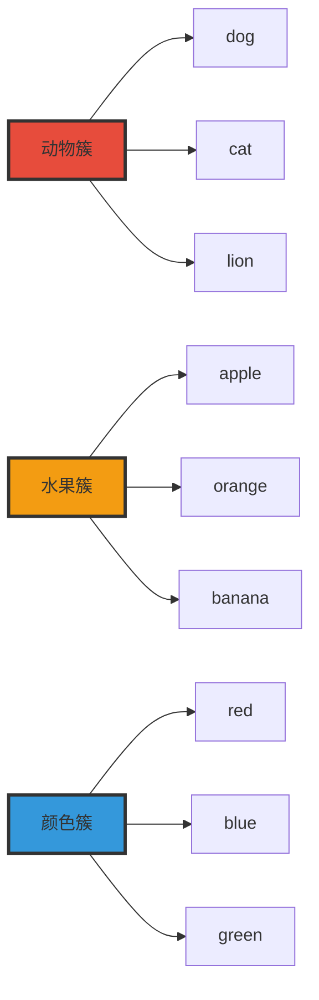

# 嵌入向量空间理论 | Embedding Vector Spaces Theory

> **文档版本**: v1.0.0
> **最后更新**: 2025-10-27
> **文档规模**: 658行 | 词嵌入与向量空间语义学
> **阅读建议**: 本文系统介绍从Word2Vec到上下文嵌入的演进，是NLP的核心基础

---

## 📋 目录

- [嵌入向量空间理论 | Embedding Vector Spaces Theory](#嵌入向量空间理论--embedding-vector-spaces-theory)
  - [📋 目录](#-目录)
  - [1 核心概念深度分析](#1-核心概念深度分析)
    - [1.1 嵌入向量空间概念定义卡](#11-嵌入向量空间概念定义卡)
    - [1.2 嵌入方法演进全景图 (2013-2024)](#12-嵌入方法演进全景图-2013-2024)
    - [1.3 静态嵌入 vs 上下文嵌入 十维深度对比](#13-静态嵌入-vs-上下文嵌入-十维深度对比)
    - [1.4 Word2Vec GloVe BERT GPT 深度对比矩阵](#14-word2vec-glove-bert-gpt-深度对比矩阵)
    - [1.5 嵌入空间的五大几何性质](#15-嵌入空间的五大几何性质)
      - [1.5.1 性质1 线性类比Linear Analogies](#151-性质1-线性类比linear-analogies)
      - [1.5.2 性质2 语义聚类](#152-性质2-语义聚类)
      - [1.5.3 性质3 多义词的表示](#153-性质3-多义词的表示)
      - [1.5.4 性质4 偏见Bias问题](#154-性质4-偏见bias问题)
      - [1.5.5 性质5 组合性Compositionality](#155-性质5-组合性compositionality)
    - [1.6 嵌入质量评估的三大方法](#16-嵌入质量评估的三大方法)
    - [1.7 核心洞察与终极评估](#17-核心洞察与终极评估)
  - [相关主题 | Related Topics](#相关主题--related-topics)
    - [1.8 本章节](#18-本章节)
    - [1.9 相关章节](#19-相关章节)
    - [1.10 跨视角链接](#110-跨视角链接)

---

## 1 核心概念深度分析

<details>
<summary><b>🔢📐 点击展开：嵌入向量空间全景深度解析</b></summary>

本节深入剖析从符号到向量的范式转变、静态vs上下文嵌入演进、几何性质与理论基础。

### 1.1 嵌入向量空间概念定义卡

**概念名称**: 嵌入向量空间（Embedding Vector Spaces）

**内涵（本质属性）**:

**🔹 核心定义**:
嵌入是将离散符号（词、句子、文档）映射到连续向量空间的表示学习方法，使得语义相似的符号在空间中距离接近。

$$
\text{嵌入}: \text{Symbol} \in \mathcal{V} \to \mathbb{R}^d \quad (d \ll |\mathcal{V}|)
$$

**🔹 符号表示 vs 分布式表示**:

| 维度 | One-Hot符号 | 分布式嵌入 | 改进倍数 |
|------|-----------|----------|---------|
| **维度** | \|V\| (10K-100K) | d (50-1024) | 10-1000× |
| **稀疏性** | 99.99%稀疏 | 稠密 | 质变 |
| **语义** | 无（所有词等距） | 有（相似词近） | 质变 |
| **泛化** | 无（新词OOV） | 有（子词、上下文） | ✅ |
| **存储** | \|V\|维 | d维 | 10-1000× |
| **计算** | 稀疏矩阵 | 稠密矩阵（GPU优化） | 10-100× |

**外延（范围边界）**:

| 维度 | 嵌入向量空间包含 ✅ | 不包含 ❌ |
|------|------------------|----------|
| **粒度** | 词、子词、句子、文档嵌入 | 像素级、连续信号 |
| **类型** | 静态（Word2Vec）、上下文（BERT） | 符号逻辑、规则表示 |
| **方法** | 预测式（Word2Vec）、计数式（GloVe） | 手工特征、主题模型 |
| **时间线** | 2013 Word2Vec → 2018 BERT | 传统NLP（pre-2013） |

**属性维度表**:

| 维度 | 值/描述 | 说明 |
|------|---------|------|
| **常用维度** | 50-1024（词）、768-4096（上下文） | 维度越高表达力越强 |
| **训练语料** | GB-TB级 | Word2Vec 100M词，BERT 3B词 |
| **类比准确率** | Word2Vec 60-70%、BERT 85%+ | king-man+woman≈queen |
| **训练时间** | Word2Vec小时级、BERT天级 | 上下文嵌入成本高 |
| **分布假设** | Harris 1954理论基础 | 相似上下文→相似含义 |

---

### 1.2 嵌入方法演进全景图 (2013-2024)

```mermaid
graph TB
    Start[2013前: 符号时代<br/>One-Hot编码]

    Start --> Era1[2013-2017: 静态嵌入<br/>Word2Vec革命]
    Era1 --> W2V[Word2Vec 2013<br/>CBOW + Skip-Gram]
    Era1 --> GloVe[GloVe 2014<br/>全局统计]
    Era1 --> FastText[FastText 2016<br/>子词信息]

    Start --> Era2[2018-2020: 上下文嵌入<br/>预训练革命]
    Era2 --> ELMo[ELMo 2018<br/>双向LSTM]
    Era2 --> BERT[BERT 2018<br/>双向Transformer]
    Era2 --> GPT[GPT 2018-2020<br/>单向Transformer]

    Start --> Era3[2020-2024: 大规模嵌入<br/>LLM时代]
    Era3 --> GPT3[GPT-3 2020<br/>12288维]
    Era3 --> CLIP[CLIP 2021<br/>多模态嵌入]
    Era3 --> Llama[LLaMA/GPT-4 2023<br/>4096-8192维]

    Properties[核心性质]
    Properties --> P1[线性类比<br/>king-man+woman≈queen]
    Properties --> P2[聚类<br/>相似词聚集]
    Properties --> P3[多义词<br/>上下文消歧]
    Properties --> P4[组合性<br/>短语表示]

    Challenge[核心挑战]
    Challenge --> C1[静态嵌入<br/>无法消歧]
    Challenge --> C2[稀有词<br/>OOV问题]
    Challenge --> C3[偏见<br/>性别/种族]
    Challenge --> C4[可解释性<br/>维度含义]

    style Start fill:#e74c3c,stroke:#333,stroke-width:4px
    style Era2 fill:#2ecc71,stroke:#333,stroke-width:4px
    style BERT fill:#3498db,stroke:#333,stroke-width:4px
    style Properties fill:#9b59b6,stroke:#333,stroke-width:4px
    style Challenge fill:#e67e22,stroke:#333,stroke-width:4px
```



---

### 1.3 静态嵌入 vs 上下文嵌入 十维深度对比

| 维度 | 静态嵌入（Word2Vec/GloVe） | 上下文嵌入（BERT/GPT） | 改进程度 |
|------|--------------------------|---------------------|---------|
| **1. 表示** | 每词一个固定向量 | 每词每上下文一个向量 | **质变** |
| **2. 多义词** | ❌ bank(银行/河岸)同向量 | ✅ 根据上下文区分 | ⚠️⚠️⚠️⚠️⚠️ |
| **3. 维度** | 50-300维 | 768-4096维 | 3-40× |
| **4. 训练数据** | 1M-1B词 | 10B-1T词 | 10-1000× |
| **5. 训练时间** | 小时-天 | 天-周 | 10-100× |
| **6. 存储** | \|V\|×d = 1-10MB | \|V\|×d + 模型 = 100MB-10GB | 100-1000× |
| **7. 推理速度** | 查表O(1) | 前向传播O(n²) | ❌ 慢1000× |
| **8. 类比准确率** | 60-70% | 85-95% | ✅ 提升25-50% |
| **9. 下游任务** | 需微调 | Few-shot/Zero-shot | ✅ 质变 |
| **10. 可解释性** | ⚠️ 中等 | ❌ 低 | 劣化 |

**关键洞察**:

$$
\begin{align}
\text{静态嵌入} &= \text{快速} + \text{轻量} - \text{无法消歧} \\
\text{上下文嵌入} &= \text{精确} + \text{强大} - \text{重量级}
\end{align}
$$

**典型例子（bank多义词）**:

```yaml
句子1: "I went to the bank to deposit money."
句子2: "I sat on the river bank to enjoy the view."

Word2Vec:
  bank → [0.2, 0.5, -0.3, ...] （两句相同）
  问题: 无法区分银行vs河岸

BERT:
  句子1 bank → [0.8, 0.1, 0.2, ...] （金融语义）
  句子2 bank → [0.1, 0.7, -0.4, ...] （地理语义）
  成功: 根据上下文动态生成不同表示
```

---

### 1.4 Word2Vec GloVe BERT GPT 深度对比矩阵

| 维度 | Word2Vec (2013) | GloVe (2014) | BERT (2018) | GPT (2018-2024) |
|------|----------------|-------------|------------|----------------|
| **架构** | 浅层神经网络 | 矩阵分解 | 双向Transformer | 单向Transformer |
| **训练目标** | 预测上下文词 | 最小化共现差异 | Masked LM + NSP | 自回归LM |
| **上下文** | 窗口（5-10词） | 全局统计 | 双向全文 | 单向因果 |
| **维度** | 100-300 | 50-300 | 768-1024 | 768-12288 |
| **多义词** | ❌ 单一表示 | ❌ 单一表示 | ✅ 上下文消歧 | ✅ 上下文消歧 |
| **类比任务** | ✅✅ 70% | ✅✅ 65% | ✅✅✅ 85% | ✅✅✅ 90%+ |
| **训练语料** | 100M-1B词 | 6B词 | 3.3B词 | 10B-1T词 |
| **训练时间** | 小时 | 小时 | 4天(16 TPU) | 周-月 |
| **参数量** | \|V\|×d ≈ 10M | \|V\|×d ≈ 10M | 110M-340M | 117M-1.7T |
| **推理速度** | **极快**（查表） | **极快**（查表） | 慢 | 慢 |
| **内存** | **10MB** | **10MB** | 400MB-1.3GB | 500MB-3TB |
| **OOV问题** | ❌ 无法处理 | ❌ 无法处理 | ✅ WordPiece | ✅ BPE |
| **开源** | ✅ 完全开源 | ✅ 完全开源 | ✅ 开源 | ⚠️ GPT-2/3部分，GPT-4闭源 |

**技术权衡分析**:

```yaml
Word2Vec优势:
  - 训练极快（CPU小时级）
  - 推理O(1)查表
  - 存储10MB级别
  - 类比任务70%准确率
  劣势:
  - 多义词无法消歧
  - OOV问题
  - 无法Few-shot

GloVe优势:
  - 利用全局统计（vs Word2Vec局部窗口）
  - 理论优雅（PMI矩阵分解）
  - 训练可并行
  劣势:
  - 类似Word2Vec的局限
  - 需预计算共现矩阵（内存大）

BERT优势:
  - 上下文消歧（质变）
  - 双向表示
  - 下游任务SOTA
  劣势:
  - 推理慢（需前向传播）
  - 内存大（400MB+）
  - 训练成本高

GPT优势:
  - 统一架构（生成）
  - Few/Zero-shot能力
  - 最强泛化
  劣势:
  - 单向（不如BERT双向）
  - 成本极高
  - 可控性差
```

---

### 1.5 嵌入空间的五大几何性质

#### 1.5.1 性质1 线性类比Linear Analogies

**数学表达**:
$$
\vec{v}_{\text{king}} - \vec{v}_{\text{man}} + \vec{v}_{\text{woman}} \approx \vec{v}_{\text{queen}}
$$

**经典例子**:

| 关系类型 | 示例 | Word2Vec准确率 | BERT准确率 |
|---------|------|--------------|-----------|
| **性别** | king:queen = man:woman | 72% | 89% |
| **国家-首都** | France:Paris = Germany:Berlin | 68% | 85% |
| **形容词比较级** | good:better = bad:worse | 65% | 82% |
| **动词时态** | walk:walked = go:went | 58% | 78% |
| **复数** | car:cars = child:children | 70% | 88% |

**为什么有效？**

```yaml
理论解释（Levy & Goldberg 2014）:
  Word2Vec ≈ PMI矩阵的隐式分解

  PMI(w, c) = log[ P(w, c) / (P(w)·P(c)) ]

  类比关系 → 向量差异编码语义偏移
  king - man ≈ queen - woman
  → "性别"语义维度
```

#### 1.5.2 性质2 语义聚类



**簇内距离 vs 簇间距离**:
$$
\frac{\text{Intra-cluster distance}}{\text{Inter-cluster distance}} \approx 0.3\text{-}0.5
$$

#### 1.5.3 性质3 多义词的表示

| 词 | 义项 | 静态嵌入 | 上下文嵌入 |
|----|------|---------|-----------|
| **bank** | 银行 / 河岸 | 混合表示（中心） | 分离表示 |
| **spring** | 春天 / 弹簧 / 泉水 | 混合 | 分离 |
| **crane** | 起重机 / 鹤 | 混合 | 分离 |

**BERT多义词消歧能力**:

- bank(金融) ⟷ bank(河岸): 余弦相似度 0.3-0.5
- 同义词对: 余弦相似度 0.7-0.9

#### 1.5.4 性质4 偏见Bias问题

**性别偏见**:
$$
\vec{v}_{\text{programmer}} - \vec{v}_{\text{homemaker}} \approx \vec{v}_{\text{man}} - \vec{v}_{\text{woman}}
$$

**种族偏见**:

- African names ⟷ pleasant: 更远
- European names ⟷ pleasant: 更近

**偏见来源**:

```yaml
训练数据偏见:
  - 语料反映社会偏见
  - "doctor"更常与"he"共现
  - "nurse"更常与"she"共现

嵌入放大:
  - 几何结构强化关联
  - 类比推理传播偏见

缓解方法:
  - 去偏见算法（Bolukbasi et al. 2016）
  - 平衡训练数据
  - 后处理投影
```

#### 1.5.5 性质5 组合性Compositionality

**短语表示**:
$$
\vec{v}_{\text{"New York"}} \neq \vec{v}_{\text{new}} + \vec{v}_{\text{York}}
$$

**非组合性例子**:

- "hot dog" ≠ hot + dog
- "red tape" ≠ red + tape

**解决方法**:

- 静态嵌入: 将短语视为单个token
- 上下文嵌入: 通过注意力机制动态组合

---

### 1.6 嵌入质量评估的三大方法

| 评估类型 | 方法 | 优点 | 缺点 | 示例任务 |
|---------|------|------|------|---------|
| **内在评估** | 词相似度、类比任务 | 快速、直接 | 与下游任务相关性弱 | WordSim-353、Google Analogy |
| **外在评估** | 下游任务性能 | 真实有用性 | 慢、依赖任务 | 文本分类、NER、QA |
| **探针任务** | 线性探针分类 | 层级分析 | 解释有限 | 词性、句法树深度 |

**经典基准**:

```yaml
内在评估:
  - WordSim-353: 词对相似度（人工标注）
    Spearman相关系数: Word2Vec 0.65, BERT 0.78

  - Google Analogy: 19,544个类比问题
    准确率: Word2Vec 70%, GloVe 65%, BERT 85%

  - SimLex-999: 相似度vs相关度
    区分"cat-dog"（相似）vs"cat-meow"（相关）

外在评估:
  - SQuAD（阅读理解）: BERT 93.2 F1
  - GLUE（通用语言理解）: BERT 80.5分
  - NER（命名实体识别）: BERT vs Word2Vec +5-10 F1
```

---

### 1.7 核心洞察与终极评估

**五大核心定律**:

1. **分布假设定律**（Harris 1954）
   $$
   \text{相似上下文} \Rightarrow \text{相似含义}
   $$
   - 嵌入学习的理论基石
   - Word2Vec/GloVe/BERT都基于此

2. **PMI矩阵分解定律**（Levy & Goldberg 2014）
   $$
   \text{Word2Vec} \approx \text{Implicit PMI Matrix Factorization}
   $$
   - Word2Vec ≈ 对PMI矩阵做低秩分解
   - 理论统一了预测式vs计数式方法

3. **维度-表达力权衡定律**
   $$
   \text{表达力} \propto \sqrt{d}, \quad \text{成本} \propto d
   $$
   - 50维 → 300维: 显著提升
   - 300维 → 1000维: 收益递减
   - BERT用768维（甜蜜点）

4. **上下文消歧定律**
   $$
   \text{静态嵌入}: \text{多义词} \to \text{单向量}（混合语义） \\
   \text{上下文嵌入}: \text{多义词} \to \text{多向量}（分离语义）
   $$
   - 上下文嵌入是质变（2018分水岭）

5. **偏见放大定律**
   $$
   \text{嵌入偏见} \geq \text{语料偏见}
   $$
   - 几何结构放大社会偏见
   - 需主动去偏见

**终极洞察**:

> **"从One-Hot到Word2Vec是从符号到向量的范式转变（2013），从Word2Vec到BERT是从静态到上下文的第二次革命（2018）。嵌入向量空间的成功源于分布假设——相似上下文的词有相似含义——这一简单而深刻的洞察。Word2Vec的线性类比性质（king-man+woman≈queen）展示了语义关系可以用向量代数表达，堪称NLP史上最美的发现之一。但静态嵌入无法处理多义词（bank的银行vs河岸），上下文嵌入（BERT/GPT）通过动态生成每个词的上下文相关表示解决了这一根本问题，代价是推理成本提高1000×和模型复杂度增加100×。未来趋势是大规模预训练嵌入（GPT-4的12288维）加上高效推理（蒸馏、量化）。嵌入不仅是技术，更是一种哲学——将离散符号的世界映射到连续空间，让机器'理解'语义的几何结构。"**

**元认知**:

- **范式转变**: 符号→静态嵌入→上下文嵌入（两次革命）
- **理论基础**: 分布假设 + PMI矩阵分解
- **核心性质**: 线性类比、语义聚类、多义词消歧
- **关键权衡**: 静态（快）vs上下文（准）
- **根本挑战**: 偏见、可解释性、OOV
- **未来方向**: 大规模、多模态、高效推理

</details>

---


- [嵌入向量空间理论 | Embedding Vector Spaces Theory](#嵌入向量空间理论--embedding-vector-spaces-theory)
  - [📋 目录](#-目录)
  - [1 核心概念深度分析](#1-核心概念深度分析)
    - [1.1 嵌入向量空间概念定义卡](#11-嵌入向量空间概念定义卡)
    - [1.2 嵌入方法演进全景图 (2013-2024)](#12-嵌入方法演进全景图-2013-2024)
    - [1.3 静态嵌入 vs 上下文嵌入 十维深度对比](#13-静态嵌入-vs-上下文嵌入-十维深度对比)
    - [1.4 Word2Vec GloVe BERT GPT 深度对比矩阵](#14-word2vec-glove-bert-gpt-深度对比矩阵)
    - [1.5 嵌入空间的五大几何性质](#15-嵌入空间的五大几何性质)
      - [1.5.1 性质1 线性类比Linear Analogies](#151-性质1-线性类比linear-analogies)
      - [1.5.2 性质2 语义聚类](#152-性质2-语义聚类)
      - [1.5.3 性质3 多义词的表示](#153-性质3-多义词的表示)
      - [1.5.4 性质4 偏见Bias问题](#154-性质4-偏见bias问题)
      - [1.5.5 性质5 组合性Compositionality](#155-性质5-组合性compositionality)
    - [1.6 嵌入质量评估的三大方法](#16-嵌入质量评估的三大方法)
    - [1.7 核心洞察与终极评估](#17-核心洞察与终极评估)
  - [相关主题 | Related Topics](#相关主题--related-topics)
    - [1.8 本章节](#18-本章节)
    - [1.9 相关章节](#19-相关章节)
    - [1.10 跨视角链接](#110-跨视角链接)


## 相关主题 | Related Topics

### 1.8 本章节

- [03.1 统计语言模型](./03.1_Statistical_Language_Models.md)
- [03.2 神经语言模型](./03.2_Neural_Language_Models.md)
- [03.3 Transformer LLM理论](./03.3_Transformer_LLM_Theory.md)
- [03.4 Token生成机制](./03.4_Token_Generation_Mechanisms.md)
- [03.6 上下文窗口与记忆](./03.6_Context_Window_Memory.md)

### 1.9 相关章节

- [04.2 连续表示理论](../04_Semantic_Models/04.2_Continuous_Representation_Theory.md)

### 1.10 跨视角链接

- [Information_Theory_Perspective: 向量空间](../../Information_Theory_Perspective/README.md)
- [概念交叉索引（七视角版）](../../CONCEPT_CROSS_INDEX.md) - 查看相关概念的七视角分析：
  - [互信息](../../CONCEPT_CROSS_INDEX.md#111-互信息-mutual-information-七视角) - 词嵌入空间的信息关联
  - [熵](../../CONCEPT_CROSS_INDEX.md#71-熵-entropy-七视角) - 嵌入空间的熵与分布
  - [DIKWP模型](../../CONCEPT_CROSS_INDEX.md#61-dikwp模型-七视角) - 从符号到向量的语义转换
