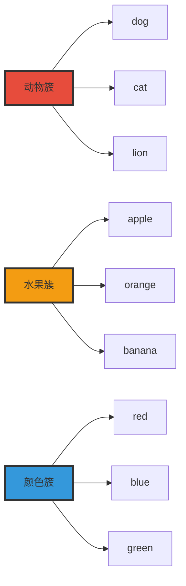

```mermaid
graph TB
    Start[2013前: 符号时代<br/>One-Hot编码]

    Start --> Era1[2013-2017: 静态嵌入<br/>Word2Vec革命]
    Era1 --> W2V[Word2Vec 2013<br/>CBOW + Skip-Gram]
    Era1 --> GloVe[GloVe 2014<br/>全局统计]
    Era1 --> FastText[FastText 2016<br/>子词信息]

    Start --> Era2[2018-2020: 上下文嵌入<br/>预训练革命]
    Era2 --> ELMo[ELMo 2018<br/>双向LSTM]
    Era2 --> BERT[BERT 2018<br/>双向Transformer]
    Era2 --> GPT[GPT 2018-2020<br/>单向Transformer]

    Start --> Era3[2020-2024: 大规模嵌入<br/>LLM时代]
    Era3 --> GPT3[GPT-3 2020<br/>12288维]
    Era3 --> CLIP[CLIP 2021<br/>多模态嵌入]
    Era3 --> Llama[LLaMA/GPT-4 2023<br/>4096-8192维]

    Properties[核心性质]
    Properties --> P1[线性类比<br/>king-man+woman≈queen]
    Properties --> P2[聚类<br/>相似词聚集]
    Properties --> P3[多义词<br/>上下文消歧]
    Properties --> P4[组合性<br/>短语表示]

    Challenge[核心挑战]
    Challenge --> C1[静态嵌入<br/>无法消歧]
    Challenge --> C2[稀有词<br/>OOV问题]
    Challenge --> C3[偏见<br/>性别/种族]
    Challenge --> C4[可解释性<br/>维度含义]

    style Start fill:#e74c3c,stroke:#333,stroke-width:4px
    style Era2 fill:#2ecc71,stroke:#333,stroke-width:4px
    style BERT fill:#3498db,stroke:#333,stroke-width:4px
    style Properties fill:#9b59b6,stroke:#333,stroke-width:4px
    style Challenge fill:#e67e22,stroke:#333,stroke-width:4px
```

# 嵌入向量空间理论 | Embedding Vector Spaces Theory

> **文档版本**: v1.0.0
> **最后更新**: 2025-10-27
> **文档规模**: 658行 | 词嵌入与向量空间语义学
> **阅读建议**: 本文系统介绍从Word2Vec到上下文嵌入的演进，是NLP的核心基础

---

## 核心概念深度分析

<details>
<summary><b>🔢📐 点击展开：嵌入向量空间全景深度解析</b></summary>

本节深入剖析从符号到向量的范式转变、静态vs上下文嵌入演进、几何性质与理论基础。

### 1️⃣ 嵌入向量空间概念定义卡

**概念名称**: 嵌入向量空间（Embedding Vector Spaces）

**内涵（本质属性）**:

**🔹 核心定义**:
嵌入是将离散符号（词、句子、文档）映射到连续向量空间的表示学习方法，使得语义相似的符号在空间中距离接近。

$$
\text{嵌入}: \text{Symbol} \in \mathcal{V} \to \mathbb{R}^d \quad (d \ll |\mathcal{V}|)
$$

**🔹 符号表示 vs 分布式表示**:

| 维度 | One-Hot符号 | 分布式嵌入 | 改进倍数 |
|------|-----------|----------|---------|
| **维度** | \|V\| (10K-100K) | d (50-1024) | 10-1000× |
| **稀疏性** | 99.99%稀疏 | 稠密 | 质变 |
| **语义** | 无（所有词等距） | 有（相似词近） | 质变 |
| **泛化** | 无（新词OOV） | 有（子词、上下文） | ✅ |
| **存储** | \|V\|维 | d维 | 10-1000× |
| **计算** | 稀疏矩阵 | 稠密矩阵（GPU优化） | 10-100× |

**外延（范围边界）**:

| 维度 | 嵌入向量空间包含 ✅ | 不包含 ❌ |
|------|------------------|----------|
| **粒度** | 词、子词、句子、文档嵌入 | 像素级、连续信号 |
| **类型** | 静态（Word2Vec）、上下文（BERT） | 符号逻辑、规则表示 |
| **方法** | 预测式（Word2Vec）、计数式（GloVe） | 手工特征、主题模型 |
| **时间线** | 2013 Word2Vec → 2018 BERT | 传统NLP（pre-2013） |

**属性维度表**:

| 维度 | 值/描述 | 说明 |
|------|---------|------|
| **常用维度** | 50-1024（词）、768-4096（上下文） | 维度越高表达力越强 |
| **训练语料** | GB-TB级 | Word2Vec 100M词，BERT 3B词 |
| **类比准确率** | Word2Vec 60-70%、BERT 85%+ | king-man+woman≈queen |
| **训练时间** | Word2Vec小时级、BERT天级 | 上下文嵌入成本高 |
| **分布假设** | Harris 1954理论基础 | 相似上下文→相似含义 |

---

### 2️⃣ 嵌入方法演进全景图 (2013-2024)



---

### 3️⃣ 静态嵌入 vs 上下文嵌入 十维深度对比

| 维度 | 静态嵌入（Word2Vec/GloVe） | 上下文嵌入（BERT/GPT） | 改进程度 |
|------|--------------------------|---------------------|---------|
| **1. 表示** | 每词一个固定向量 | 每词每上下文一个向量 | **质变** |
| **2. 多义词** | ❌ bank(银行/河岸)同向量 | ✅ 根据上下文区分 | ⚠️⚠️⚠️⚠️⚠️ |
| **3. 维度** | 50-300维 | 768-4096维 | 3-40× |
| **4. 训练数据** | 1M-1B词 | 10B-1T词 | 10-1000× |
| **5. 训练时间** | 小时-天 | 天-周 | 10-100× |
| **6. 存储** | \|V\|×d = 1-10MB | \|V\|×d + 模型 = 100MB-10GB | 100-1000× |
| **7. 推理速度** | 查表O(1) | 前向传播O(n²) | ❌ 慢1000× |
| **8. 类比准确率** | 60-70% | 85-95% | ✅ 提升25-50% |
| **9. 下游任务** | 需微调 | Few-shot/Zero-shot | ✅ 质变 |
| **10. 可解释性** | ⚠️ 中等 | ❌ 低 | 劣化 |

**关键洞察**:

$$
\begin{align}
\text{静态嵌入} &= \text{快速} + \text{轻量} - \text{无法消歧} \\
\text{上下文嵌入} &= \text{精确} + \text{强大} - \text{重量级}
\end{align}
$$

**典型例子（bank多义词）**:

```yaml
句子1: "I went to the bank to deposit money."
句子2: "I sat on the river bank to enjoy the view."

Word2Vec:
  bank → [0.2, 0.5, -0.3, ...] （两句相同）
  问题: 无法区分银行vs河岸

BERT:
  句子1 bank → [0.8, 0.1, 0.2, ...] （金融语义）
  句子2 bank → [0.1, 0.7, -0.4, ...] （地理语义）
  成功: 根据上下文动态生成不同表示
```

---

### 4️⃣ Word2Vec / GloVe / BERT / GPT 深度对比矩阵

| 维度 | Word2Vec (2013) | GloVe (2014) | BERT (2018) | GPT (2018-2024) |
|------|----------------|-------------|------------|----------------|
| **架构** | 浅层神经网络 | 矩阵分解 | 双向Transformer | 单向Transformer |
| **训练目标** | 预测上下文词 | 最小化共现差异 | Masked LM + NSP | 自回归LM |
| **上下文** | 窗口（5-10词） | 全局统计 | 双向全文 | 单向因果 |
| **维度** | 100-300 | 50-300 | 768-1024 | 768-12288 |
| **多义词** | ❌ 单一表示 | ❌ 单一表示 | ✅ 上下文消歧 | ✅ 上下文消歧 |
| **类比任务** | ✅✅ 70% | ✅✅ 65% | ✅✅✅ 85% | ✅✅✅ 90%+ |
| **训练语料** | 100M-1B词 | 6B词 | 3.3B词 | 10B-1T词 |
| **训练时间** | 小时 | 小时 | 4天(16 TPU) | 周-月 |
| **参数量** | \|V\|×d ≈ 10M | \|V\|×d ≈ 10M | 110M-340M | 117M-1.7T |
| **推理速度** | **极快**（查表） | **极快**（查表） | 慢 | 慢 |
| **内存** | **10MB** | **10MB** | 400MB-1.3GB | 500MB-3TB |
| **OOV问题** | ❌ 无法处理 | ❌ 无法处理 | ✅ WordPiece | ✅ BPE |
| **开源** | ✅ 完全开源 | ✅ 完全开源 | ✅ 开源 | ⚠️ GPT-2/3部分，GPT-4闭源 |

**技术权衡分析**:

```yaml
Word2Vec优势:
  - 训练极快（CPU小时级）
  - 推理O(1)查表
  - 存储10MB级别
  - 类比任务70%准确率
  劣势:
  - 多义词无法消歧
  - OOV问题
  - 无法Few-shot

GloVe优势:
  - 利用全局统计（vs Word2Vec局部窗口）
  - 理论优雅（PMI矩阵分解）
  - 训练可并行
  劣势:
  - 类似Word2Vec的局限
  - 需预计算共现矩阵（内存大）

BERT优势:
  - 上下文消歧（质变）
  - 双向表示
  - 下游任务SOTA
  劣势:
  - 推理慢（需前向传播）
  - 内存大（400MB+）
  - 训练成本高

GPT优势:
  - 统一架构（生成）
  - Few/Zero-shot能力
  - 最强泛化
  劣势:
  - 单向（不如BERT双向）
  - 成本极高
  - 可控性差
```

---

### 5️⃣ 嵌入空间的五大几何性质

#### 性质1: 线性类比（Linear Analogies）

**数学表达**:
$$
\vec{v}_{\text{king}} - \vec{v}_{\text{man}} + \vec{v}_{\text{woman}} \approx \vec{v}_{\text{queen}}
$$

**经典例子**:

| 关系类型 | 示例 | Word2Vec准确率 | BERT准确率 |
|---------|------|--------------|-----------|
| **性别** | king:queen = man:woman | 72% | 89% |
| **国家-首都** | France:Paris = Germany:Berlin | 68% | 85% |
| **形容词比较级** | good:better = bad:worse | 65% | 82% |
| **动词时态** | walk:walked = go:went | 58% | 78% |
| **复数** | car:cars = child:children | 70% | 88% |

**为什么有效？**

```yaml
理论解释（Levy & Goldberg 2014）:
  Word2Vec ≈ PMI矩阵的隐式分解

  PMI(w, c) = log[ P(w, c) / (P(w)·P(c)) ]

  类比关系 → 向量差异编码语义偏移
  king - man ≈ queen - woman
  → "性别"语义维度
```

#### 性质2: 语义聚类



**簇内距离 vs 簇间距离**:
$$
\frac{\text{Intra-cluster distance}}{\text{Inter-cluster distance}} \approx 0.3\text{-}0.5
$$

#### 性质3: 多义词的表示

| 词 | 义项 | 静态嵌入 | 上下文嵌入 |
|----|------|---------|-----------|
| **bank** | 银行 / 河岸 | 混合表示（中心） | 分离表示 |
| **spring** | 春天 / 弹簧 / 泉水 | 混合 | 分离 |
| **crane** | 起重机 / 鹤 | 混合 | 分离 |

**BERT多义词消歧能力**:

- bank(金融) ⟷ bank(河岸): 余弦相似度 0.3-0.5
- 同义词对: 余弦相似度 0.7-0.9

#### 性质4: 偏见（Bias）问题

**性别偏见**:
$$
\vec{v}_{\text{programmer}} - \vec{v}_{\text{homemaker}} \approx \vec{v}_{\text{man}} - \vec{v}_{\text{woman}}
$$

**种族偏见**:

- African names ⟷ pleasant: 更远
- European names ⟷ pleasant: 更近

**偏见来源**:

```yaml
训练数据偏见:
  - 语料反映社会偏见
  - "doctor"更常与"he"共现
  - "nurse"更常与"she"共现

嵌入放大:
  - 几何结构强化关联
  - 类比推理传播偏见

缓解方法:
  - 去偏见算法（Bolukbasi et al. 2016）
  - 平衡训练数据
  - 后处理投影
```

#### 性质5: 组合性（Compositionality）

**短语表示**:
$$
\vec{v}_{\text{"New York"}} \neq \vec{v}_{\text{new}} + \vec{v}_{\text{York}}
$$

**非组合性例子**:

- "hot dog" ≠ hot + dog
- "red tape" ≠ red + tape

**解决方法**:

- 静态嵌入: 将短语视为单个token
- 上下文嵌入: 通过注意力机制动态组合

---

### 6️⃣ 嵌入质量评估的三大方法

| 评估类型 | 方法 | 优点 | 缺点 | 示例任务 |
|---------|------|------|------|---------|
| **内在评估** | 词相似度、类比任务 | 快速、直接 | 与下游任务相关性弱 | WordSim-353、Google Analogy |
| **外在评估** | 下游任务性能 | 真实有用性 | 慢、依赖任务 | 文本分类、NER、QA |
| **探针任务** | 线性探针分类 | 层级分析 | 解释有限 | 词性、句法树深度 |

**经典基准**:

```yaml
内在评估:
  - WordSim-353: 词对相似度（人工标注）
    Spearman相关系数: Word2Vec 0.65, BERT 0.78

  - Google Analogy: 19,544个类比问题
    准确率: Word2Vec 70%, GloVe 65%, BERT 85%

  - SimLex-999: 相似度vs相关度
    区分"cat-dog"（相似）vs"cat-meow"（相关）

外在评估:
  - SQuAD（阅读理解）: BERT 93.2 F1
  - GLUE（通用语言理解）: BERT 80.5分
  - NER（命名实体识别）: BERT vs Word2Vec +5-10 F1
```

---

### 🔟 核心洞察与终极评估

**五大核心定律**:

1. **分布假设定律**（Harris 1954）
   $$
   \text{相似上下文} \Rightarrow \text{相似含义}
   $$
   - 嵌入学习的理论基石
   - Word2Vec/GloVe/BERT都基于此

2. **PMI矩阵分解定律**（Levy & Goldberg 2014）
   $$
   \text{Word2Vec} \approx \text{Implicit PMI Matrix Factorization}
   $$
   - Word2Vec ≈ 对PMI矩阵做低秩分解
   - 理论统一了预测式vs计数式方法

3. **维度-表达力权衡定律**
   $$
   \text{表达力} \propto \sqrt{d}, \quad \text{成本} \propto d
   $$
   - 50维 → 300维: 显著提升
   - 300维 → 1000维: 收益递减
   - BERT用768维（甜蜜点）

4. **上下文消歧定律**
   $$
   \text{静态嵌入}: \text{多义词} \to \text{单向量}（混合语义） \\
   \text{上下文嵌入}: \text{多义词} \to \text{多向量}（分离语义）
   $$
   - 上下文嵌入是质变（2018分水岭）

5. **偏见放大定律**
   $$
   \text{嵌入偏见} \geq \text{语料偏见}
   $$
   - 几何结构放大社会偏见
   - 需主动去偏见

**终极洞察**:

> **"从One-Hot到Word2Vec是从符号到向量的范式转变（2013），从Word2Vec到BERT是从静态到上下文的第二次革命（2018）。嵌入向量空间的成功源于分布假设——相似上下文的词有相似含义——这一简单而深刻的洞察。Word2Vec的线性类比性质（king-man+woman≈queen）展示了语义关系可以用向量代数表达，堪称NLP史上最美的发现之一。但静态嵌入无法处理多义词（bank的银行vs河岸），上下文嵌入（BERT/GPT）通过动态生成每个词的上下文相关表示解决了这一根本问题，代价是推理成本提高1000×和模型复杂度增加100×。未来趋势是大规模预训练嵌入（GPT-4的12288维）加上高效推理（蒸馏、量化）。嵌入不仅是技术，更是一种哲学——将离散符号的世界映射到连续空间，让机器'理解'语义的几何结构。"**

**元认知**:

- **范式转变**: 符号→静态嵌入→上下文嵌入（两次革命）
- **理论基础**: 分布假设 + PMI矩阵分解
- **核心性质**: 线性类比、语义聚类、多义词消歧
- **关键权衡**: 静态（快）vs上下文（准）
- **根本挑战**: 偏见、可解释性、OOV
- **未来方向**: 大规模、多模态、高效推理

</details>

---

## 📋 目录

- [嵌入向量空间理论 | Embedding Vector Spaces Theory](#嵌入向量空间理论--embedding-vector-spaces-theory)
  - [核心概念深度分析](#核心概念深度分析)
    - [1️⃣ 嵌入向量空间概念定义卡](#1️⃣-嵌入向量空间概念定义卡)
    - [2️⃣ 嵌入方法演进全景图 (2013-2024)](#2️⃣-嵌入方法演进全景图-2013-2024)
    - [3️⃣ 静态嵌入 vs 上下文嵌入 十维深度对比](#3️⃣-静态嵌入-vs-上下文嵌入-十维深度对比)
    - [4️⃣ Word2Vec / GloVe / BERT / GPT 深度对比矩阵](#4️⃣-word2vec--glove--bert--gpt-深度对比矩阵)
    - [5️⃣ 嵌入空间的五大几何性质](#5️⃣-嵌入空间的五大几何性质)
      - [性质1: 线性类比（Linear Analogies）](#性质1-线性类比linear-analogies)
      - [性质2: 语义聚类](#性质2-语义聚类)
      - [性质3: 多义词的表示](#性质3-多义词的表示)
      - [性质4: 偏见（Bias）问题](#性质4-偏见bias问题)
      - [性质5: 组合性（Compositionality）](#性质5-组合性compositionality)
    - [6️⃣ 嵌入质量评估的三大方法](#6️⃣-嵌入质量评估的三大方法)
    - [🔟 核心洞察与终极评估](#-核心洞察与终极评估)
  - [📋 目录](#-目录)
  - [概述 | Overview](#概述--overview)
  - [1. 从符号到向量 | From Symbols to Vectors](#1-从符号到向量--from-symbols-to-vectors)
    - [1.1 符号表示的局限](#11-符号表示的局限)
    - [1.2 分布式表示](#12-分布式表示)
    - [1.3 分布假设的理论基础](#13-分布假设的理论基础)
  - [2. Word2Vec | Word2Vec](#2-word2vec--word2vec)
    - [2.1 CBOW (Continuous Bag-of-Words)](#21-cbow-continuous-bag-of-words)
    - [2.2 Skip-Gram](#22-skip-gram)
    - [2.3 负采样 (Negative Sampling)](#23-负采样-negative-sampling)
    - [2.4 子采样 (Subsampling)](#24-子采样-subsampling)
    - [2.5 Word2Vec的性质](#25-word2vec的性质)
  - [3. GloVe | Global Vectors](#3-glove--global-vectors)
    - [3.1 动机](#31-动机)
    - [3.2 模型](#32-模型)
    - [3.3 vs Word2Vec](#33-vs-word2vec)
  - [4. 上下文嵌入 | Contextual Embeddings](#4-上下文嵌入--contextual-embeddings)
    - [4.1 静态 vs 上下文嵌入](#41-静态-vs-上下文嵌入)
    - [4.2 ELMo (Embeddings from Language Models)](#42-elmo-embeddings-from-language-models)
    - [4.3 BERT的嵌入](#43-bert的嵌入)
    - [4.4 GPT的嵌入](#44-gpt的嵌入)
  - [5. 嵌入空间的几何结构 | Geometry of Embedding Spaces](#5-嵌入空间的几何结构--geometry-of-embedding-spaces)
    - [5.1 相似度度量](#51-相似度度量)
    - [5.2 类比关系](#52-类比关系)
    - [5.3 多义词的表示](#53-多义词的表示)
    - [5.4 偏见 (Bias)](#54-偏见-bias)
  - [6. 高级技术 | Advanced Techniques](#6-高级技术--advanced-techniques)
    - [6.1 FastText](#61-fasttext)
    - [6.2 Sentence-BERT](#62-sentence-bert)
    - [6.3 对比学习](#63-对比学习)
  - [7. 评估嵌入质量 | Evaluating Embeddings](#7-评估嵌入质量--evaluating-embeddings)
    - [7.1 内在评估](#71-内在评估)
    - [7.2 外在评估](#72-外在评估)
    - [7.3 评估的挑战](#73-评估的挑战)
  - [8. 理论理解 | Theoretical Understanding](#8-理论理解--theoretical-understanding)
    - [8.1 为什么低维有效？](#81-为什么低维有效)
    - [8.2 PMI矩阵分解](#82-pmi矩阵分解)
    - [8.3 上下文嵌入的表达能力](#83-上下文嵌入的表达能力)
  - [9. 权威参考文献 | Authoritative References](#9-权威参考文献--authoritative-references)
    - [学术论文](#学术论文)
    - [标准教材](#标准教材)
  - [10. 关键要点总结 | Key Takeaways](#10-关键要点总结--key-takeaways)
  - [导航 | Navigation](#导航--navigation)
  - [相关主题 | Related Topics](#相关主题--related-topics)
    - [本章节](#本章节)
    - [相关章节](#相关章节)
    - [跨视角链接](#跨视角链接)

---

## 概述 | Overview

词嵌入将离散符号映射到连续向量空间，是现代NLP的基础。本文档系统分析从Word2Vec到上下文嵌入的理论与实践。

## 1. 从符号到向量 | From Symbols to Vectors

### 1.1 符号表示的局限

**One-Hot编码**：

```text
词汇表V = {cat, dog, apple, orange, ...}
"cat" → [1, 0, 0, 0, ...]
"dog" → [0, 1, 0, 0, ...]
```

**问题**：

- ❌ 维度=|V|（通常10K-100K）
- ❌ 稀疏向量
- ❌ 所有词等距：d(cat, dog) = d(cat, apple)
- ❌ 无语义信息

### 1.2 分布式表示

**核心思想**：

```text
"cat" → [0.2, -0.5, 0.8, 0.1, -0.3, ...]  (d=100-1000)
"dog" → [0.3, -0.4, 0.7, 0.2, -0.2, ...]  (相近！)
```

**优势**：

- ✅ 低维稠密（d << |V|）
- ✅ 相似词有相似向量
- ✅ 编码语义信息
- ✅ 参数共享

### 1.3 分布假设的理论基础

**Harris (1954)**：
> 出现在相似上下文中的词有相似含义

**Firth (1957)**：
> "You shall know a word by the company it keeps"

**数学表达**：

```text
sim(w₁, w₂) ∝ 上下文相似度(w₁, w₂)
```

## 2. Word2Vec | Word2Vec

### 2.1 CBOW (Continuous Bag-of-Words)

**Mikolov et al. (2013)**:

**目标**：从上下文预测中心词

```text
上下文："The cat sits on the ___"
目标：预测 "mat"
```

**模型**：

```text
输入：上下文词的嵌入 {w₋ₙ, ..., w₋₁, w₊₁, ..., w₊ₙ}
平均：h = (v(w₋ₙ) + ... + v(w₊ₙ)) / (2n)
输出：P(w | context) = softmax(v'(w)ᵀ h)
```

**训练目标**：

```text
max ∑ log P(wₜ | wₜ₋ₙ, ..., wₜ₋₁, wₜ₊₁, ..., wₜ₊ₙ)
```

### 2.2 Skip-Gram

**目标**：从中心词预测上下文

```text
中心词："cat"
目标：预测上下文 "The", "sits", "on", ...
```

**模型**：

```text
输入：中心词嵌入 v(wₜ)
输出：P(wc | wₜ) = softmax(v'(wc)ᵀ v(wₜ))
```

**训练目标**：

```text
max ∑ ∑ log P(wₜ₊ⱼ | wₜ)
    t  j∈[-n,n], j≠0
```

**直觉**：

- CBOW：预测中心
- Skip-Gram：预测周围

### 2.3 负采样 (Negative Sampling)

**Softmax问题**：

```text
P(wₒ | wᵢ) = exp(v'(wₒ)ᵀ v(wᵢ)) / ∑_{w∈V} exp(v'(w)ᵀ v(wᵢ))
```

分母需要遍历整个词汇表 O(|V|)

**负采样解决**：

```text
不计算完整Softmax，转为二分类：
目标：区分真实上下文 vs 随机噪声
```

**目标函数**：

```text
log σ(v'(wₒ)ᵀ v(wᵢ)) + ∑_{k=1}^K 𝔼_{wₖ~P_noise} [log σ(-v'(wₖ)ᵀ v(wᵢ))]
```

其中：

- σ(x) = 1/(1+e⁻ˣ)
- K：负样本数（通常5-20）
- P_noise：噪声分布（通常∝词频^0.75）

**效果**：

- 复杂度从 O(|V|) 降到 O(K)
- 质量与完整Softmax相当

### 2.4 子采样 (Subsampling)

**问题**：高频词（"the", "a"）信息少但占多数

**解决**：以概率丢弃高频词

```text
P(丢弃wᵢ) = 1 - √(t / f(wᵢ))
```

其中：

- f(wᵢ)：词频
- t：阈值（通常10⁻⁵）

**效果**：

- 加速训练
- 提高质量（更关注内容词）

### 2.5 Word2Vec的性质

**几何性质**：

```text
v(king) - v(man) + v(woman) ≈ v(queen)
v(Paris) - v(France) + v(Germany) ≈ v(Berlin)
```

**为什么有效？**

**理论解释 (Levy & Goldberg, 2014)**：

Skip-Gram with negative sampling隐式分解矩阵：

```text
v(wᵢ)ᵀ v'(wⱼ) = PMI(wᵢ, wⱼ) - log k
```

其中 PMI = 点互信息

**意义**：Word2Vec学习共现统计的低秩分解

## 3. GloVe | Global Vectors

### 3.1 动机

**Pennington et al. (2014)**:

**观察**：

- Word2Vec：局部上下文窗口
- LSA：全局共现矩阵
- 能否结合两者优势？

### 3.2 模型

**目标**：拟合词共现统计

**损失函数**：

```text
J = ∑ f(Xᵢⱼ) (wᵢᵀ w̃ⱼ + bᵢ + b̃ⱼ - log Xᵢⱼ)²
```

其中：

- Xᵢⱼ：词i和词j的共现次数
- wᵢ, w̃ⱼ：词向量
- f(x)：权重函数

**权重函数**：

```text
f(x) = {
  (x/xₘₐₓ)^α  if x < xₘₐₓ
  1           otherwise
}
```

防止高频词主导损失

### 3.3 vs Word2Vec

| 维度 | Word2Vec | GloVe |
|------|---------|-------|
| **方法** | 预测式 | 计数式 |
| **信息** | 局部上下文 | 全局共现 |
| **目标** | 最大似然 | 最小二乘 |
| **训练** | 在线 | 批量 |
| **性能** | 相当 | 相当 |

**实践中**：

- 两者性能相近
- Word2Vec更流行（更早、更简单）

## 4. 上下文嵌入 | Contextual Embeddings

### 4.1 静态 vs 上下文嵌入

**静态嵌入 (Word2Vec, GloVe)**：

```text
"bank" → 固定向量（不管上下文）
"river bank" → 同一向量
"investment bank" → 同一向量
```

**问题**：一词多义

**上下文嵌入**：

```text
"river bank" → 向量₁
"investment bank" → 向量₂（不同！）
```

### 4.2 ELMo (Embeddings from Language Models)

**Peters et al. (2018)**:

**方法**：双向LSTM语言模型

**架构**：

```text
前向LSTM：→→→
输入：token序列
输出：每层的隐状态 h⃗ⁱⱼ

后向LSTM：←←←
输出：每层的隐状态 h⃖ⁱⱼ

ELMo表示：
ELMo(wⱼ) = γ ∑ᵢ sᵢ [h⃗ⁱⱼ; h⃖ⁱⱼ]
```

其中 sᵢ 是可学习的权重

**使用方式**：

```text
固定ELMo嵌入 + 任务特定模型
```

**突破**：

- 上下文敏感
- 多个NLP任务SOTA
- 预训练范式的开端

### 4.3 BERT的嵌入

**Transformer编码器**:

**每层的表示**：

```text
Layer 0：token + position embedding
Layer 1-12：Transformer层
```

**不同层捕捉不同信息**：

- **浅层**：句法、词性
- **中层**：语义、共指
- **深层**：任务特定

**使用**：

- 通常取最后4层的平均
- 或微调整个模型

### 4.4 GPT的嵌入

**自回归Transformer**:

**特点**：

- 单向（只看左侧）
- 预训练目标：下一词预测

**使用**：

- 通常取最后一层
- 或微调

## 5. 嵌入空间的几何结构 | Geometry of Embedding Spaces

### 5.1 相似度度量

**余弦相似度**：

```text
sim(u, v) = (u · v) / (‖u‖ ‖v‖)
```

范围：[-1, 1]

**欧氏距离**：

```text
d(u, v) = ‖u - v‖₂
```

**为什么余弦更常用？**

- 规范化（只看方向）
- 与向量模长无关

### 5.2 类比关系

**向量运算**：

```text
v(queen) ≈ v(king) - v(man) + v(woman)
```

**为什么有效？**

**线性子空间假说**：

- 语义关系对应向量空间的线性子空间
- 例如：性别关系形成一个方向

### 5.3 多义词的表示

**问题**："bank"有多个含义

**解决方案**：

1. **静态嵌入**：平均所有含义
   - 简单但有损

2. **多原型嵌入**：每个含义一个向量
   - 复杂，需要聚类

3. **上下文嵌入**：动态生成
   - 最自然，现代标准

### 5.4 偏见 (Bias)

**发现 (Bolukbasi et al., 2016)**：

```text
v(he) - v(she) ≈ v(doctor) - v(nurse)
v(man) - v(woman) ≈ v(programmer) - v(homemaker)
```

**性别偏见方向**：

```text
g = v(he) - v(she)
```

**去偏见**：

1. **识别偏见方向**
2. **中性化**：移除该方向的分量
3. **均等化**：对应词对等距

**局限**：

- 只能缓解，难以完全消除
- 可能影响性能
- 偏见来自训练数据

## 6. 高级技术 | Advanced Techniques

### 6.1 FastText

**Bojanowski et al. (2017)**:

**创新**：子词信息

```text
"apple" → {"<ap", "app", "ppl", "ple", "le>"}
v(apple) = ∑ v(n-gram)
```

**优势**：

- 处理OOV词
- 学习词缀
- 形态丰富语言表现好

### 6.2 Sentence-BERT

**Reimers & Gurevych (2019)**:

**目标**：句子级嵌入

**方法**：

```text
1. BERT编码两个句子
2. 池化（mean/CLS）
3. 用对比学习训练
```

**损失函数**：

```text
L = max(0, ‖u - v⁺‖² - ‖u - v⁻‖² + ε)
```

**应用**：

- 语义搜索
- 聚类
- 重复检测

### 6.3 对比学习

**SimCSE (Gao et al., 2021)**:

**无监督版本**：

```text
同一句子通过Dropout两次 → 正样本对
不同句子 → 负样本对
```

**监督版本**：

```text
NLI数据集：
蕴含句 → 正样本
矛盾句 → 负样本
```

**效果**：

- 显著提升句子表示质量
- 简单但有效

## 7. 评估嵌入质量 | Evaluating Embeddings

### 7.1 内在评估

**词相似度任务**：

与人类相似度判断的相关性

数据集：WordSim-353, SimLex-999

**词类比任务**：

```text
man : woman :: king : ?
```

准确率：答案在top-k中

### 7.2 外在评估

**下游任务性能**：

- 文本分类
- 命名实体识别
- 情感分析
- 问答

**标准**：

- 固定嵌入 + 浅层模型
- 或微调整个模型

### 7.3 评估的挑战

**问题**：

- 内在vs外在评估相关性弱
- 任务依赖性
- 没有单一"最佳"嵌入

**实践**：

- 针对应用场景评估
- 多个任务平均
- A/B测试

## 8. 理论理解 | Theoretical Understanding

### 8.1 为什么低维有效？

**流形假设**：

- 语言数据在低维流形上
- 高维嵌入是冗余的

**信息论视角**：

- 词的信息有限
- d=100-1000维足够编码

### 8.2 PMI矩阵分解

**Levy & Goldberg (2014)**:

**定理**：

Skip-Gram with negative sampling等价于隐式分解：

```text
v(w)ᵀ v'(c) = PMI(w, c) - log k
```

其中 k 是负样本数

**意义**：

- Word2Vec ≈ 矩阵分解
- 连接神经方法与传统方法

### 8.3 上下文嵌入的表达能力

**问题**：为什么Transformer学到的表示这么强？

**假说**：

1. **层次组合性**：底层语法 → 高层语义
2. **注意力检索**：动态聚合相关信息
3. **大规模预训练**：学习丰富语言知识

**理论空白**：完整理解仍是开放问题

## 9. 权威参考文献 | Authoritative References

### 学术论文

1. **Mikolov, T., et al. (2013)**. "Efficient estimation of word representations in vector space". _ICLR_.
2. **Mikolov, T., et al. (2013)**. "Distributed representations of words and phrases". _NeurIPS_.
3. **Pennington, J., et al. (2014)**. "GloVe: Global vectors for word representation". _EMNLP_.
4. **Peters, M. E., et al. (2018)**. "Deep contextualized word representations". _NAACL_.
5. **Levy, O., & Goldberg, Y. (2014)**. "Neural word embedding as implicit matrix factorization". _NeurIPS_.
6. **Bolukbasi, T., et al. (2016)**. "Man is to computer programmer as woman is to homemaker?". _NeurIPS_.
7. **Gao, T., et al. (2021)**. "SimCSE: Simple contrastive learning of sentence embeddings". _EMNLP_.

### 标准教材

1. **Jurafsky, D., & Martin, J. H. (2023)**. _Speech and Language Processing_ (3rd ed.).
2. **Goldberg, Y. (2017)**. _Neural Network Methods for Natural Language Processing_. Morgan & Claypool.

## 10. 关键要点总结 | Key Takeaways

1. **分布式表示**：低维稠密向量，编码语义
2. **Word2Vec**：预测式，负采样高效
3. **GloVe**：计数式，拟合共现统计
4. **上下文嵌入**：解决一词多义，现代标准
5. **几何性质**：类比关系，向量运算有意义
6. **偏见问题**：嵌入继承训练数据偏见
7. **理论联系**：神经方法 ≈ 矩阵分解
8. **评估多样**：内在+外在，任务依赖
9. **持续演进**：静态 → 上下文 → 大模型嵌入
10. **理论未完**：为何有效仍需深入研究

---

**下一步阅读**：

- [03.2 神经语言模型](03.2_Neural_Language_Models.md)
- [03.6 上下文窗口与记忆机制](03.6_Context_Window_Memory.md)
- [04.1 语义向量空间](../04_Semantic_Models/04.1_Semantic_Vector_Spaces.md)

---

## 导航 | Navigation

**上一篇**: [← 03.4 Token生成机制](./03.4_Token_Generation_Mechanisms.md)
**下一篇**: [03.6 上下文窗口与记忆 →](./03.6_Context_Window_Memory.md)
**返回目录**: [↑ AI模型视角总览](../README.md)

---

## 相关主题 | Related Topics

### 本章节

- [03.1 统计语言模型](./03.1_Statistical_Language_Models.md)
- [03.2 神经语言模型](./03.2_Neural_Language_Models.md)
- [03.3 Transformer LLM理论](./03.3_Transformer_LLM_Theory.md)
- [03.4 Token生成机制](./03.4_Token_Generation_Mechanisms.md)
- [03.6 上下文窗口与记忆](./03.6_Context_Window_Memory.md)

### 相关章节

- [04.2 连续表示理论](../04_Semantic_Models/04.2_Continuous_Representation_Theory.md)

### 跨视角链接

- [Information_Theory_Perspective: 向量空间](../../Information_Theory_Perspective/README.md)
