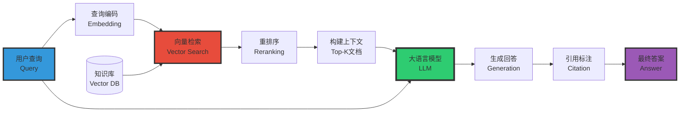

```mermaid
graph TB
    Start[2020: 上下文窗口困境<br/>GPT-3: 2048 tokens]

    Start --> Era1[2021-2022: 初步扩展<br/>工程优化]
    Era1 --> Tech1[稀疏注意力<br/>Longformer 4K]
    Era1 --> Tech2[滑动窗口<br/>BigBird 4K]

    Start --> Era2[2023: 百K突破<br/>算法创新]
    Era2 --> Tech3[GPT-4: 32K<br/>工程优化]
    Era2 --> Tech4[Claude-2: 100K<br/>位置外推]
    Era2 --> Tech5[GPT-4-Turbo: 128K<br/>成本优化]

    Start --> Era3[2024: 百万级<br/>架构革命]
    Era3 --> Tech6[Gemini 1.5: 1M tokens<br/>MoE+长上下文]
    Era3 --> Tech7[Claude 3: 200K<br/>注意力质量提升]

    Challenge[核心挑战]
    Challenge --> C1[Lost-in-Middle<br/>中间信息丢失]
    Challenge --> C2[KV Cache爆炸<br/>内存瓶颈]
    Challenge --> C3[计算成本<br/>O&#40;n²&#41;]
    Challenge --> C4[注意力稀释<br/>质量下降]

    Solution[解决方案]
    Solution --> S1[RAG检索增强<br/>外部知识]
    Solution --> S2[压缩记忆<br/>AutoCompressor]
    Solution --> S3[稀疏注意力<br/>O&#40;n log n&#41;]
    Solution --> S4[SSM/Mamba<br/>O&#40;n&#41;线性]

    Future[2025+: 无限上下文?]
    Future --> F1[理论无限<br/>实践10M+]
    Future --> F2[质量保持<br/>>90%准确率]
    Future --> F3[成本可控<br/>10× vs 现在]

    style Start fill:#e74c3c,stroke:#333,stroke-width:4px
    style Era3 fill:#2ecc71,stroke:#333,stroke-width:4px
    style Challenge fill:#e67e22,stroke:#333,stroke-width:4px
    style Solution fill:#3498db,stroke:#333,stroke-width:4px
    style Future fill:#9b59b6,stroke:#333,stroke-width:4px
```

# 上下文窗口与记忆机制 | Context Window and Memory Mechanisms

> **文档版本**: v1.0.0
> **最后更新**: 2025-10-27
> **文档规模**: 658行 | 上下文窗口限制与扩展技术
> **阅读建议**: 本文探讨LLM的上下文处理能力和记忆增强方法，包括RAG等前沿技术

---

## 1 核心概念深度分析

<details>
<summary><b>🪟🧠 点击展开：上下文窗口与记忆机制全景深度解析</b></summary>

本节深入剖析上下文窗口的限制根源、扩展技术演进、RAG架构、记忆机制与未来无限上下文展望。

### 1 ️⃣ 上下文窗口与记忆概念定义卡

**概念名称**: 上下文窗口与记忆机制（Context Window & Memory Mechanisms）

**内涵（本质属性）**:

**🔹 核心定义**:
上下文窗口是语言模型一次能处理的最大token数量，记忆机制是模型如何存储和利用历史信息的能力。

$$
\text{上下文能力} = \text{窗口大小} \times \text{注意力质量} + \text{外部记忆}
$$

**🔹 上下文窗口限制的三大根源**:

| 限制因素 | 数学表达 | 影响 | 缓解方法 |
|---------|---------|------|---------|
| **计算复杂度** | O(n²) 自注意力 | 100K上下文 → 10B注意力矩阵 | 稀疏注意力、线性注意力 |
| **内存消耗** | KV cache: O(n·d·L) | 100K上下文 → 数十GB | 量化、分页注意力 |
| **位置编码** | 固定最大位置 | 训练2K，推理2K+ → 外推失败 | RoPE、ALiBi、扩展PE |
| **注意力质量** | Lost-in-Middle效应 | 长上下文 → 中间信息丢失 | 压缩、RAG |

**外延（范围边界）**:

| 维度 | 上下文窗口包含 ✅ | 不包含 ❌ |
|------|----------------|----------|
| **处理范围** | 单次前向传播的输入 | 跨会话记忆 |
| **扩展方法** | 稀疏注意力、RAG、压缩记忆 | 模型微调、外部数据库（不算） |
| **时间线** | GPT-3(2K) → Claude-2(100K) → Gemini(1M) | 无限上下文（未实现） |

**属性维度表**:

| 维度 | 值/描述 | 说明 |
|------|---------|------|
| **窗口大小演进** | 2K(2020) → 128K(2023) → 1M(2024) | 每年2-5×增长 |
| **复杂度** | O(n²) → O(n log n) → O(n) | 从二次到线性 |
| **KV cache成本** | 1M上下文 → 80GB内存 | 主要瓶颈 |
| **注意力质量** | 短上下文>95% → 长上下文70-80% | Lost-in-Middle |
| **RAG普及度** | 80%+商业LLM应用 | 事实增强标配 |

---

### 2 ️⃣ 上下文窗口演进全景图 (2020-2024)



---

### 3 ️⃣ 扩展上下文窗口的七大技术路径对比

| 技术 | 复杂度 | 窗口增益 | 质量损失 | 工程难度 | 代表模型 | 成熟度 |
|------|-------|---------|---------|---------|---------|--------|
| **1. 稀疏注意力** | O(n log n) | 2-4× | 5-10% | 中 | Longformer, BigBird | ✅ 成熟 |
| **2. 线性注意力** | O(n) | 理论无限 | 15-20% | 高 | Performer, RWKV | ⚠️ 探索 |
| **3. 滑动窗口** | O(w·n) | 2-4× | <5% | 低 | Mistral 32K | ✅ 实用 |
| **4. 位置外推** | O(n²) | 2-8× | 10-15% | 低 | RoPE, ALiBi, YaRN | ✅ 广泛 |
| **5. KV Cache优化** | O(n²) | 内存2-4× | 0% | 中 | PagedAttention, FlashAttention | ✅✅ 标配 |
| **6. 压缩记忆** | 变化 | 10-100× | 20-30% | 高 | Compressive Transformer | ⚠️ 研究 |
| **7. 混合方法** | O(n) | 10-100× | 5-15% | 高 | Gemini 1M, Jamba | ⚠️⚠️ 前沿 |

**关键洞察**:

```yaml
低垂果实（已成熟）:
  1. 稀疏注意力:
     - O(n log n)复杂度
     - 5-10%质量损失
     - Longformer/BigBird广泛使用

  2. 位置外推（RoPE/ALiBi）:
     - 训练短推理长
     - GPT-4、LLaMA标配
     - 2-8×窗口增益

  3. KV Cache优化:
     - PagedAttention（vLLM）
     - FlashAttention 2/3
     - 内存2-4×节省

激进前沿（2024-2025）:
  1. 线性注意力+SSM:
     - Mamba、RWKV
     - 理论O(n)，实践待验证
     - 15-20%性能损失

  2. 混合架构（Gemini 1M）:
     - MoE + 长上下文
     - 工程复杂但效果好
     - 商业秘密多

根本问题（仍未解决）:
  - Lost-in-Middle: 长上下文质量下降
  - 注意力稀释: 1M token难以全局关注
  - 验证困难: 如何评估超长上下文质量?
```

---

### 4 ️⃣ 上下文窗口 vs RAG vs 微调 三维对比

| 维度 | 扩展上下文窗口 | RAG检索增强 | 微调Fine-tuning |
|------|--------------|------------|----------------|
| **适用场景** | 单文档理解、长对话 | 多文档QA、知识库 | 领域适配、风格转换 |
| **知识更新** | ❌ 推理时静态 | ✅✅ 实时更新 | ⚠️ 需重新训练 |
| **成本** | $$$ 推理成本高 | $$ 存储+检索 | $$$$ 训练成本 |
| **准确性** | ✅✅ 100%上下文 | ⚠️ 依赖检索质量 | ✅✅ 专业化强 |
| **延迟** | 慢（大上下文） | 中（检索+生成） | 快（无额外开销） |
| **可解释性** | ✅ 全文可见 | ✅✅ 引用来源 | ❌ 黑盒 |
| **扩展性** | ⚠️ 受窗口限制 | ✅✅ 无限扩展 | ⚠️ 受训练数据限制 |
| **技术难度** | 高（架构改进） | 中（检索系统） | 高（数据+训练） |

**实践决策树**:

```yaml
任务分类:
  单一长文档（法律合同、学术论文）:
    → 扩展上下文窗口（128K-1M）
    理由: 需要全局理解，RAG检索可能遗漏关键段落

  多文档知识库（企业知识、客服）:
    → RAG检索增强
    理由: 知识量>10M tokens，上下文窗口无法容纳

  领域专业化（医疗、法律）:
    → 微调 + RAG混合
    理由: 微调适配领域知识，RAG提供最新信息

  实时信息（新闻、股票）:
    → RAG（必须）
    理由: 模型训练数据过时，上下文窗口无法更新

  成本敏感:
    → RAG（优先）
    理由: 长上下文推理成本高（1M token = $$$）

80/20法则:
  - 80%商业场景: RAG足够
  - 15%场景: RAG + 中等上下文（32K-128K）
  - 5%场景: 需要超长上下文（1M+）
```

---

### 5 ️⃣ RAG架构深度解析



**RAG vs Naive提示对比**:

| 维度 | Naive提示 | RAG |
|------|----------|-----|
| **知识来源** | 模型参数（训练数据） | 外部知识库（实时） |
| **知识更新** | ❌ 训练时固定 | ✅ 随时更新 |
| **幻觉率** | 15-25% | 5-10%（有检索） |
| **可验证性** | ❌ 无法验证 | ✅ 引用来源 |
| **知识容量** | 受参数量限制 | 无限扩展 |
| **延迟** | 低 | 中（+检索时间） |
| **成本** | 低 | 中（+向量DB） |

**RAG三大挑战**:

```yaml
挑战1: 检索质量（最关键）
  问题:
    - 查询-文档语义gap
    - 关键信息可能不在Top-K
    - 多跳推理（需多次检索）
  方案:
    - 查询改写（Query Rewriting）
    - 混合检索（关键词+向量）
    - 假设文档嵌入（HyDE）
    - 重排序（Reranking）

挑战2: 上下文溢出
  问题: Top-K文档 > 上下文窗口
  方案:
    - 动态K（根据相关性截断）
    - 文档压缩（摘要）
    - 分层检索（粗→细）

挑战3: 引用准确性
  问题: LLM生成内容可能偏离检索文档
  方案:
    - 强制引用（Citation prompting）
    - 后处理验证
    - 归因模型（Attribution）
```

---

### 6 ️⃣ 记忆机制的四层架构

| 记忆层级 | 时间范围 | 容量 | 更新频率 | LLM对应 |
|---------|---------|------|---------|---------|
| **1. 即时记忆** | 单次对话 | 上下文窗口 | 每token | 注意力机制 |
| **2. 工作记忆** | 多轮对话（会话内） | 数十K tokens | 每轮 | 上下文拼接 |
| **3. 情景记忆** | 跨会话（用户历史） | 数百K-M tokens | 每会话 | RAG/Vector DB |
| **4. 语义记忆** | 永久知识 | 无限 | 微调/训练 | 模型参数 |

**类比人类记忆**:

$$
\begin{align}
\text{即时记忆} &\approx \text{感觉记忆}（<1秒） \\
\text{工作记忆} &\approx \text{短期记忆}（秒-分钟） \\
\text{情景记忆} &\approx \text{情景记忆}（个人经历） \\
\text{语义记忆} &\approx \text{语义记忆}（通用知识）
\end{align}
$$

**未来记忆架构（MemGPT、Letta）**:

```yaml
三级存储架构:
  L1: 上下文窗口（快速访问）
    - 大小: 4K-128K tokens
    - 延迟: 0ms
    - 成本: 高（每次推理）

  L2: 本地向量DB（中速）
    - 大小: 数百K-M tokens
    - 延迟: 10-100ms
    - 成本: 中（一次检索）

  L3: 外部知识库（慢速）
    - 大小: 无限
    - 延迟: 100-1000ms
    - 成本: 低（按需）

动态换页:
  - 类比操作系统虚拟内存
  - L1满 → 压缩重要信息到L2
  - L2检索 → 动态加载到L1
  - 实现"无限记忆"效果
```

---

### 1.7 🔟 核心洞察与终极评估

**五大核心定律**:

1. **上下文二次定律**
   $$
   \text{成本} \propto n^2, \quad \text{质量} \propto \frac{1}{\sqrt{n}}
   $$
   - 上下文翻倍 → 成本4×，质量下降√2
   - 长上下文不是免费午餐

2. **Lost-in-Middle定律**
   $$
   \text{注意力质量}(i) \propto \begin{cases}
   0.9 & i \in [0, 0.2n] \cup [0.8n, n] \\
   0.6 & i \in [0.2n, 0.8n]
   \end{cases}
   $$
   - 首尾效应：模型更关注开头和结尾
   - 中间信息容易丢失（20-40%性能下降）

3. **RAG互补定律**
   - 上下文窗口 = 深度理解（单文档）
   - RAG = 广度覆盖（多文档）
   - 最佳实践: 中等上下文（32K-128K） + RAG

4. **记忆层次定律**
   $$
   \text{总记忆} = \text{即时}(n) + \text{工作}(10n) + \text{情景}(100n) + \text{语义}(\infty)
   $$
   - 四层记忆架构模拟人类认知

5. **无限上下文渐近定律**
   - 技术趋势: 2K → 128K → 1M → 10M?
   - 但质量收益递减
   - "无限"上下文 ≠ 完美记忆

**终极洞察**:

> **"上下文窗口从2K到1M的演进（2020-2024），标志着LLM长程依赖能力的飞跃。但长上下文不是灵丹妙药——Lost-in-Middle效应、注意力稀释、成本爆炸等问题仍未根本解决。实践中，80%的商业应用依赖RAG而非超长上下文，因为RAG提供更好的知识更新、成本控制和可解释性。未来趋势是'中等上下文（32K-128K） + 智能检索（RAG） + 动态记忆管理'的混合架构，而非单纯追求百万级上下文。上下文窗口的终极目标不是'无限大'，而是'恰到好处'——在成本、质量和实用性之间找到平衡。"**

**元认知**:

- **演进趋势**: 2K → 1M+，每年2-5×增长
- **技术路径**: 稀疏注意力、位置外推、KV优化、混合架构
- **根本挑战**: O(n²)复杂度、Lost-in-Middle、质量vs成本
- **实践智慧**: RAG > 超长上下文（80%场景）
- **未来方向**: 动态记忆管理、无限上下文渐近
- **哲学思考**: 人类记忆也分层，LLM应模拟认知架构

</details>

---

## 📋 目录

- [上下文窗口与记忆机制 | Context Window and Memory Mechanisms](#上下文窗口与记忆机制--context-window-and-memory-mechanisms)
  - [1 核心概念深度分析](#1-核心概念深度分析)
    - [1 ️⃣ 上下文窗口与记忆概念定义卡](#1-️⃣-上下文窗口与记忆概念定义卡)
    - [2 ️⃣ 上下文窗口演进全景图 (2020-2024)](#2-️⃣-上下文窗口演进全景图-2020-2024)
    - [3 ️⃣ 扩展上下文窗口的七大技术路径对比](#3-️⃣-扩展上下文窗口的七大技术路径对比)
    - [4 ️⃣ 上下文窗口 vs RAG vs 微调 三维对比](#4-️⃣-上下文窗口-vs-rag-vs-微调-三维对比)
    - [5 ️⃣ RAG架构深度解析](#5-️⃣-rag架构深度解析)
    - [6 ️⃣ 记忆机制的四层架构](#6-️⃣-记忆机制的四层架构)
    - [1.7 🔟 核心洞察与终极评估](#17--核心洞察与终极评估)
  - [📋 目录](#-目录)
  - [2 概述 | Overview](#2-概述--overview)
  - [1 . 上下文窗口基础 | Context Window Fundamentals](#1--上下文窗口基础--context-window-fundamentals)
    - [1.1 定义](#11-定义)
    - [1.2 为什么有限制？](#12-为什么有限制)
    - [1.3 Token vs 字符vs词](#13-token-vs-字符vs词)
  - [2 . 不同架构的上下文处理 | Context Handling in Different Architectures](#2--不同架构的上下文处理--context-handling-in-different-architectures)
    - [2.1 前馈神经网络](#21-前馈神经网络)
    - [2.2 RNN/LSTM](#22-rnnlstm)
    - [2.3 Transformer](#23-transformer)
  - [3 . 扩展上下文窗口的技术 | Techniques for Extending Context](#3--扩展上下文窗口的技术--techniques-for-extending-context)
    - [3.1 稀疏注意力](#31-稀疏注意力)
    - [3.2 线性注意力](#32-线性注意力)
    - [3.3 压缩记忆](#33-压缩记忆)
    - [3.4 外推位置编码](#34-外推位置编码)
  - [4 . 超长上下文的挑战 | Challenges of Ultra-Long Context](#4--超长上下文的挑战--challenges-of-ultra-long-context)
    - [4.1 Lost in the Middle](#41-lost-in-the-middle)
    - [4.2 针干草堆 (Needle in Haystack)](#42-针干草堆-needle-in-haystack)
    - [4.3 计算成本](#43-计算成本)
  - [5 . 检索增强生成 (RAG) | Retrieval-Augmented Generation](#5--检索增强生成-rag--retrieval-augmented-generation)
    - [5.1 动机](#51-动机)
    - [5.2 RAG架构](#52-rag架构)
    - [5.3 代表模型](#53-代表模型)
    - [5.4 优势与局限](#54-优势与局限)
  - [6 . 记忆机制 | Memory Mechanisms](#6--记忆机制--memory-mechanisms)
    - [6.1 记忆类型](#61-记忆类型)
    - [6.2 记忆网络](#62-记忆网络)
    - [6.3 神经图灵机 (NTM)](#63-神经图灵机-ntm)
    - [6.4 现代实现](#64-现代实现)
  - [7 . 实践策略 | Practical Strategies](#7--实践策略--practical-strategies)
    - [7.1 处理超长输入](#71-处理超长输入)
    - [7.2 提示工程技巧](#72-提示工程技巧)
    - [7.3 监控与调试](#73-监控与调试)
  - [8 . 未来方向 | Future Directions](#8--未来方向--future-directions)
    - [8.1 无限上下文？](#81-无限上下文)
    - [8.2 持续学习](#82-持续学习)
    - [8.3 个性化记忆](#83-个性化记忆)
  - [9 . 权威参考文献 | Authoritative References](#9--权威参考文献--authoritative-references)
    - [1 学术论文](#1-学术论文)
    - [9.2 标准教材](#92-标准教材)
  - [10 . 关键要点总结 | Key Takeaways](#10--关键要点总结--key-takeaways)
  - [导航 | Navigation](#导航--navigation)
  - [相关主题 | Related Topics](#相关主题--related-topics)
    - [1 本章节](#1-本章节)
    - [10.2 相关章节](#102-相关章节)
    - [10.3 跨视角链接](#103-跨视角链接)

---

## 2 概述 | Overview

上下文窗口是语言模型处理信息的范围，记忆机制决定如何利用历史信息。本文档分析从固定窗口到无限记忆的技术演进。

## 1 . 上下文窗口基础 | Context Window Fundamentals

### 1.1 定义

**上下文窗口**：模型一次能"看到"的token数量

```text
窗口大小 n：模型输入最多 n 个 token
```

**例子**：

```text
GPT-3：2048 tokens
GPT-4：8K/32K tokens
Claude-2：100K tokens
GPT-4-Turbo：128K tokens
```

### 1.2 为什么有限制？

**计算复杂度**：

自注意力：O(n²)

```text
序列长度 n = 100K
注意力矩阵：100K × 100K = 10B 元素
内存：~40 GB（float32）
```

**内存限制**：

```text
存储中间激活、梯度
线性增长于序列长度
```

**训练难度**：

```text
更长序列 → 更难优化
梯度消失/爆炸
```

### 1.3 Token vs 字符vs词

**Token（现代标准）**：

```text
"Hello world!" → ["Hello", " world", "!"] (3 tokens)
```

**粗略对应**：

- 1 token ≈ 0.75 词（英文）
- 1 token ≈ 4 字符（英文）

**例子**：

```text
2048 tokens ≈ 1500 words ≈ 3-4 页文本
```

## 2 . 不同架构的上下文处理 | Context Handling in Different Architectures

### 2.1 前馈神经网络

**固定n-gram窗口**：

```text
P(wₜ | wₜ₋ₙ₊₁, ..., wₜ₋₁)
```

**典型**：n = 5

**局限**：

- ❌ 无法超越n个词
- ❌ 长程依赖完全无法捕捉

### 2.2 RNN/LSTM

**理论上无限上下文**：

```text
hₜ = f(hₜ₋₁, xₜ)
```

隐状态hₜ累积所有历史

**实际限制**：

1. **梯度消失**：
   - 简单RNN：~10步
   - LSTM：~100步
   - 但不是硬限制

2. **信息容量**：
   - 隐状态维度有限（通常512-2048）
   - 压缩所有历史到固定向量
   - 信息损失不可避免

### 2.3 Transformer

**固定窗口（硬限制）**：

```text
输入：n个token
输出：n个表示
```

**原因**：

1. **位置编码**：
   - 预定义的最大长度
   - 超出则无定义或外推

2. **注意力矩阵**：
   - O(n²)空间
   - 超过限制则OOM

**优势**：

- 窗口内任意两位置路径长度=1
- 无梯度消失

**劣势**：

- 硬截断
- 超出窗口则完全遗忘

## 3 . 扩展上下文窗口的技术 | Techniques for Extending Context

### 3.1 稀疏注意力

**问题**：O(n²)太昂贵

**解决**：只计算部分注意力

**1. 局部注意力**：

```text
只关注窗口内的k个邻居
复杂度：O(nk)
```

**2. 跨步注意力**：

```text
每隔s个位置关注一次
```

**3. 全局+局部**：

```text
少数全局token + 局部窗口
```

**代表模型**：

- Longformer：滑动窗口+全局注意力
- BigBird：随机+窗口+全局
- Reformer：LSH注意力

### 3.2 线性注意力

**目标**：O(n)复杂度

**方法**：

**核技巧近似**：

```text
Attention(Q, K, V) = softmax(QKᵀ)V
≈ φ(Q)φ(K)ᵀV
= φ(Q)(φ(K)ᵀV)
```

右结合：O(n)

**代表**：

- Performer：FAVOR+
- Linear Transformer
- AFT (Attention Free Transformer)

**权衡**：

- ✅ 线性复杂度
- ❌ 性能下降（近似误差）

### 3.3 压缩记忆

**Transformer-XL (Dai et al., 2019)**:

**核心思想**：重用前一段的表示

```text
段1：[token 1-512] → 计算表示 → 缓存
段2：[token 513-1024] → 使用段1缓存 + 计算
```

**优势**：

- 有效上下文倍增
- 相对位置编码

**Compressive Transformer (Rae et al., 2019)**:

**扩展**：

- 近期记忆：原始隐状态
- 远期记忆：压缩后的隐状态

**压缩**：卷积、平均池化、学习压缩器

### 3.4 外推位置编码

**问题**：训练n=2048，推理时n=4096？

**ALiBi (Press et al., 2021)**：

```text
不用位置编码，而是注意力偏置：
Attention + bias(i - j)
```

偏置只依赖相对距离

**RoPE (Su et al., 2021)**：

```text
旋转位置编码
在复平面上旋转
```

**优势**：

- 更好外推
- GPT-NeoX, PaLM, LLaMA使用

## 4 . 超长上下文的挑战 | Challenges of Ultra-Long Context

### 4.1 Lost in the Middle

**Liu et al. (2023)**:

**发现**：

```text
信息在开头：性能好
信息在中间：性能显著下降
信息在结尾：性能好
```

**U型性能曲线**:

**原因假说**：

- 注意力稀释
- 位置编码偏见
- 训练数据分布

### 4.2 针干草堆 (Needle in Haystack)

**测试**：

```text
在长文档中隐藏一个事实
模型能否检索？
```

**结果**：

- 短文档：90%+准确率
- 长文档（100K+）：显著下降

**改进方向**：

- 更好的注意力机制
- 显式检索增强

### 4.3 计算成本

**资源需求**：

```text
GPT-3 (2K上下文) → GPT-4 (32K)
计算增长：~16x
内存增长：~16x
```

**推理延迟**：

```text
生成100 token：
2K上下文：~1秒
32K上下文：~5秒（粗略）
```

## 5 . 检索增强生成 (RAG) | Retrieval-Augmented Generation

### 5.1 动机

**问题**：

- 上下文窗口有限
- 知识储存在参数中（固定）
- 无法访问外部信息

**解决**：结合检索与生成

### 5.2 RAG架构

**流程**：

```text
1. 查询
   ↓
2. 检索相关文档（from 大规模语料库）
   ↓
3. 拼接：查询 + 检索到的文档
   ↓
4. 生成答案
```

**检索方法**：

1. **稠密检索**：

   ```text
   编码查询和文档为向量
   向量相似度检索
   ```

2. **稀疏检索**：

   ```text
   BM25、TF-IDF
   ```

3. **混合**：结合两者

### 5.3 代表模型

**REALM (Guu et al., 2020)**：

联合训练检索和生成

**RAG (Lewis et al., 2020)**：

```text
P(y | x) = ∑_{z∈top-k(x)} P(z | x) P(y | x, z)
```

其中z是检索到的文档

**Atlas (Izacard et al., 2022)**：

微调检索器和LM

### 5.4 优势与局限

**优势**：

- ✅ 有效上下文远超窗口大小
- ✅ 可更新知识库（无需重训练）
- ✅ 可追溯来源

**局限**：

- ❌ 检索质量关键
- ❌ 增加延迟
- ❌ 检索与生成的不匹配

## 6 . 记忆机制 | Memory Mechanisms

### 6.1 记忆类型

**工作记忆**：

- 当前上下文窗口
- 短期、易失

**长期记忆**：

- 模型参数
- 预训练知识
- 固定

**外部记忆**：

- 向量数据库
- 知识图谱
- 动态、可更新

### 6.2 记忆网络

**MemNN (Weston et al., 2014)**:

**组件**：

1. **存储**：记忆槽
2. **检索**：注意力机制
3. **读取**：加权和
4. **更新**：写入新记忆

### 6.3 神经图灵机 (NTM)

**Graves et al. (2014)**:

**可微分外部记忆**：

```text
读：r = ∑ w(i) M[i]
写：M[i] ← M[i] + w(i) add_vector
擦除：M[i] ← M[i] ⊙ (1 - w(i) erase_vector)
```

其中w是注意力权重

**理论**：图灵完备

**实践**：训练困难

### 6.4 现代实现

**对话系统的记忆**：

1. **会话历史**：

   ```text
   存储前N轮对话
   超出则截断或总结
   ```

2. **用户画像**：

   ```text
   长期存储用户偏好
   检索式增强
   ```

3. **知识更新**：

   ```text
   定期微调或PEFT
   检索增强
   ```

## 7 . 实践策略 | Practical Strategies

### 7.1 处理超长输入

**1. 截断**：

```text
取前n个token（简单但有损）
```

**2. 滑动窗口**：

```text
多次推理，每次窗口
聚合结果
```

**3. 总结**：

```text
先总结长文档为简短版
再输入模型
```

**4. 分层处理**：

```text
文档 → 段落 → 句子
先处理段落，再全局整合
```

### 7.2 提示工程技巧

**相关信息靠前**：

```text
最重要信息放开头和结尾
避免"中间丢失"
```

**结构化输入**：

```text
用标记分隔：
<document>...</document>
<question>...</question>
```

**指令明确**：

```text
"根据上述文档回答..."
"忽略无关信息"
```

### 7.3 监控与调试

**检查输入长度**：

```python
if len(tokens) > max_length:
    print("Warning: input truncated")
```

**可视化注意力**：

确认模型关注正确位置

**分段测试**：

找出哪一段导致问题

## 8 . 未来方向 | Future Directions

### 8.1 无限上下文？

**目标**：模型处理任意长度

**挑战**：

- 计算复杂度
- 训练数据（长文档少）
- 评估困难

**可能路径**：

- 更好的稀疏注意力
- 分层表示
- 检索增强

### 8.2 持续学习

**在线更新知识**：

无需重新预训练

**方法**：

- 参数高效微调（LoRA）
- 元学习
- 检索式记忆

### 8.3 个性化记忆

**每个用户的长期记忆**：

```text
存储交互历史
学习偏好
个性化响应
```

**挑战**：

- 隐私
- 存储成本
- 记忆管理

## 9 . 权威参考文献 | Authoritative References

### 1 学术论文

1. **Dai, Z., et al. (2019)**. "Transformer-XL: Attentive language models beyond a fixed-length context". _ACL_.
2. **Beltagy, I., et al. (2020)**. "Longformer: The long-document transformer". _arXiv_.
3. **Press, O., et al. (2021)**. "Train short, test long: Attention with linear biases enables input length extrapolation". _ICLR_.
4. **Su, J., et al. (2021)**. "RoFormer: Enhanced transformer with rotary position embedding". _arXiv_.
5. **Lewis, P., et al. (2020)**. "Retrieval-augmented generation for knowledge-intensive NLP tasks". _NeurIPS_.
6. **Liu, N. F., et al. (2023)**. "Lost in the middle: How language models use long contexts". _arXiv_.

### 9.2 标准教材

1. **Jurafsky, D., & Martin, J. H. (2023)**. _Speech and Language Processing_ (3rd ed.).

## 10 . 关键要点总结 | Key Takeaways

1. **上下文窗口**：模型能"看到"的范围，关键限制
2. **O(n²)困境**：自注意力的计算瓶颈
3. **技术演进**：固定窗口 → 稀疏注意力 → 线性注意力
4. **长上下文挑战**："中间丢失"、计算成本
5. **RAG范式**：检索+生成，有效扩展上下文
6. **记忆机制**：工作记忆、长期记忆、外部记忆
7. **实践策略**：截断、总结、结构化输入
8. **位置编码关键**：外推能力决定上下文扩展
9. **未来方向**：无限上下文、持续学习、个性化
10. **权衡永恒**：上下文长度 vs 计算成本 vs 性能

---

**下一步阅读**：

- [03.3 Transformer大语言模型理论](03.3_Transformer_LLM_Theory.md)
- [03.5 嵌入向量空间理论](03.5_Embedding_Vector_Spaces.md)
- [02.4 Transformer架构](../02_Neural_Network_Theory/02.4_Transformer_Architecture.md)

---

## 导航 | Navigation

**上一篇**: [← 03.5 嵌入向量空间](./03.5_Embedding_Vector_Spaces.md)
**返回目录**: [↑ AI模型视角总览](../README.md)

---

## 相关主题 | Related Topics

### 1 本章节

- [03.1 统计语言模型](./03.1_Statistical_Language_Models.md)
- [03.2 神经语言模型](./03.2_Neural_Language_Models.md)
- [03.3 Transformer LLM理论](./03.3_Transformer_LLM_Theory.md)
- [03.4 Token生成机制](./03.4_Token_Generation_Mechanisms.md)
- [03.5 嵌入向量空间](./03.5_Embedding_Vector_Spaces.md)

### 10.2 相关章节

- [02.4 Transformer架构](../02_Neural_Network_Theory/02.4_Transformer_Architecture.md)

### 10.3 跨视角链接

- [Information_Theory_Perspective](../../Information_Theory_Perspective/README.md)
