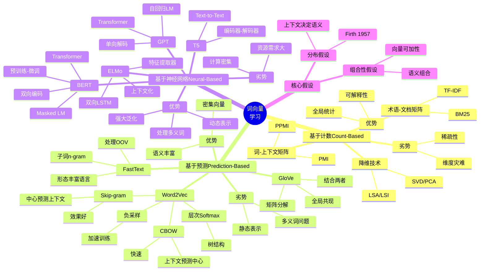
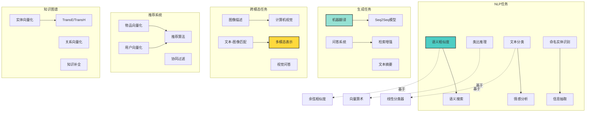

# 语义向量空间（Semantic Vector Spaces）

> **文档版本**: v1.0.0
> **最后更新**: 2025-10-27
> **文档规模**: 838行 | 语义向量空间的数学理论基础
> **阅读建议**: 本文详解语义向量空间的几何结构与数学性质，建议结合线性代数和拓扑学知识学习

---

## 📋 目录

- [语义向量空间（Semantic Vector Spaces）](#语义向量空间semantic-vector-spaces)
  - [📋 目录](#-目录)
    - [2 . 表示范式演进全景图](#2--表示范式演进全景图)
    - [3 . 语义向量构建方法对比矩阵](#3--语义向量构建方法对比矩阵)
    - [4 . 语义相似度度量方法对比](#4--语义相似度度量方法对比)
    - [5 . 词向量学习方法思维导图](#5--词向量学习方法思维导图)
    - [6 . 语义向量空间几何性质分析](#6--语义向量空间几何性质分析)
    - [7 . Word2Vec/GloVe/BERT深度对比](#7--word2vecglovebert深度对比)
    - [8 . 语义向量空间应用全景](#8--语义向量空间应用全景)
    - [9 . 语义向量空间局限性与未来方向](#9--语义向量空间局限性与未来方向)
  - [1 引言](#1-引言)
    - [1 核心思想](#1-核心思想)
    - [2.2 关键问题](#22-关键问题)
  - [2 从符号到向量：表示的范式转换](#2-从符号到向量表示的范式转换)
    - [1 传统符号表示](#1-传统符号表示)
    - [3.2 One-Hot表示](#32-one-hot表示)
    - [3.3 分布式表示（Distributed Representation）](#33-分布式表示distributed-representation)
    - [3.4 范式转换的本质](#34-范式转换的本质)
  - [3 向量空间模型的数学基础](#3-向量空间模型的数学基础)
    - [1 向量空间的定义](#1-向量空间的定义)
    - [4.2 内积与范数](#42-内积与范数)
    - [4.3 距离与相似度度量](#43-距离与相似度度量)
      - [1 . 欧几里得距离](#1--欧几里得距离)
      - [2 . 余弦相似度](#2--余弦相似度)
      - [3 . 余弦距离](#3--余弦距离)
  - [4 语义向量空间的几何结构](#4-语义向量空间的几何结构)
    - [1 语义向量空间的定义](#1-语义向量空间的定义)
    - [5.2 几何性质](#52-几何性质)
      - [1 . 聚类性（Clustering）](#1--聚类性clustering)
      - [2 . 线性性（Linearity）](#2--线性性linearity)
      - [3 . 可分性（Separability）](#3--可分性separability)
    - [5.3 拓扑结构](#53-拓扑结构)
      - [1 . 流形结构（Manifold Structure）](#1--流形结构manifold-structure)
      - [2 . 曲率（Curvature）](#2--曲率curvature)
  - [5 语义向量空间的构建方法](#5-语义向量空间的构建方法)
    - [1 . 基于计数的方法（Count-based）](#1--基于计数的方法count-based)
      - [1 术语-文档矩阵（Term-Document Matrix）](#1-术语-文档矩阵term-document-matrix)
      - [2 词-上下文矩阵（Word-Context Matrix）](#2-词-上下文矩阵word-context-matrix)
    - [2 . 基于预测的方法（Prediction-based）](#2--基于预测的方法prediction-based)
      - [1 Word2Vec](#1-word2vec)
      - [2 GloVe（Global Vectors）](#2-gloveglobal-vectors)
    - [3 . 基于神经网络的方法（Neural-based）](#3--基于神经网络的方法neural-based)
      - [1 上下文化表示（Contextualized Representations）](#1-上下文化表示contextualized-representations)
  - [6 语义向量空间的性质](#6-语义向量空间的性质)
    - [1 . 分布假设（Distributional Hypothesis）](#1--分布假设distributional-hypothesis)
    - [2 . 组合性（Compositionality）](#2--组合性compositionality)
    - [3 . 可学习性（Learnability）](#3--可学习性learnability)
  - [7 语义向量空间的维度问题](#7-语义向量空间的维度问题)
    - [1 维度的选择](#1-维度的选择)
    - [8.2 维度的影响](#82-维度的影响)
    - [8.3 内在维度（Intrinsic Dimensionality）](#83-内在维度intrinsic-dimensionality)
  - [8 语义向量空间的局限性](#8-语义向量空间的局限性)
    - [1 . 静态性（Static Embeddings）](#1--静态性static-embeddings)
    - [2 . 偏见与公平性（Bias and Fairness）](#2--偏见与公平性bias-and-fairness)
    - [3 . 可解释性（Interpretability）](#3--可解释性interpretability)
    - [4 . 计算成本（Computational Cost）](#4--计算成本computational-cost)
  - [9 总结](#9-总结)
    - [1 核心要点](#1-核心要点)
    - [10.2 语义向量空间的意义](#102-语义向量空间的意义)
    - [10.3 未解问题](#103-未解问题)
  - [参考文献](#参考文献)
    - [10.4 基础理论](#104-基础理论)
    - [10.5 词向量](#105-词向量)
    - [10.6 上下文化表示](#106-上下文化表示)
    - [10.7 几何与拓扑](#107-几何与拓扑)
    - [10.8 偏见与公平性](#108-偏见与公平性)
    - [10.9 教材](#109-教材)
  - [导航 | Navigation](#导航--navigation)
  - [相关主题 | Related Topics](#相关主题--related-topics)
    - [10.10 本章节](#1010-本章节)
    - [10.11 相关章节](#1011-相关章节)
    - [10.12 跨视角链接](#1012-跨视角链接)

---


### 2 . 表示范式演进全景图

```mermaid
graph TB
    subgraph 符号主义时代 1950s-1990s
        Symbolic[符号逻辑<br/>一阶谓词逻辑]
        KnowledgeBase[知识库<br/>Cyc, WordNet]
        Rules[规则系统<br/>专家系统]

        Symbolic --> KnowledgeBase
        KnowledgeBase --> Rules
    end

    subgraph 统计时代 1990s-2010s
        OneHot[One-Hot编码<br/>高维稀疏]
        TF IDF[TF-IDF<br/>术语-文档矩阵]
        LSA[LSA/LSI<br/>奇异值分解]

        OneHot --> TF_IDF
        TF_IDF --> LSA
    end

    subgraph 分布式表示时代 2013-2018
        Word2Vec[Word2Vec<br/>CBOW/Skip-gram]
        GloVe[GloVe<br/>全局向量]
        FastText[FastText<br/>子词向量]

        LSA --> Word2Vec
        Word2Vec --> GloVe
        GloVe --> FastText
    end

    subgraph 上下文化时代 2018-现在
        ELMo[ELMo<br/>双向LSTM]
        BERT[BERT<br/>Transformer编码器]
        GPT[GPT系列<br/>Transformer解码器]

        FastText --> ELMo
        ELMo --> BERT
        BERT --> GPT
    end

    subgraph 核心突破
        Break1[突破1: 分布假设<br/>1950s Firth]
        Break2[突破2: 神经语言模型<br/>2003 Bengio]
        Break3[突破3: Word2Vec<br/>2013 Mikolov]
        Break4[突破4: Transformer<br/>2017 Vaswani]

        Break1 --> LSA
        Break2 --> Word2Vec
        Break3 --> Word2Vec
        Break4 --> BERT
    end

    subgraph 关键演进
        Static[静态表示<br/>一词一向量]
        Dynamic[动态表示<br/>上下文依赖]
        Multimodal[多模态表示<br/>跨模态融合]

        Word2Vec --> Static
        BERT --> Dynamic
        GPT --> Dynamic
        Dynamic -.未来.-> Multimodal
    end

    style Symbolic fill:#ffcccc,stroke:#333,stroke-width:2px
    style Word2Vec fill:#ffff99,stroke:#333,stroke-width:3px
    style BERT fill:#99ff99,stroke:#333,stroke-width:3px
    style GPT fill:#99ccff,stroke:#333,stroke-width:3px
    style Break3 fill:#ff6b6b,stroke:#333,stroke-width:3px
```

---

### 3 . 语义向量构建方法对比矩阵

| 方法 | 提出年份 | 核心思想 | 维度 | 训练复杂度 | 优势 | 劣势 | 代表模型 |
|------|---------|---------|------|-----------|------|------|---------|
| **One-Hot** | 1960s | 每个词一个独热向量 | $|\mathcal{V}|$ | $O(1)$ | 简单 | 无语义、维度爆炸 | - |
| **TF-IDF** | 1970s | 词频×逆文档频率 | $|\mathcal{V}|$ | $O(n\|\mathcal{V}\|)$ | 考虑重要性 | 稀疏、无语义 | Salton VSM |
| **LSA** | 1990 | SVD降维 | 100-300 | $O(n^2d)$ | 降维、语义 | 线性假设 | Latent Semantic |
| **Word2Vec<br/>(CBOW)** | 2013 | 上下文预测中心词 | 300 | $O(T\|\mathcal{V}\|)$ | 高效、语义丰富 | 静态、多义词 | Mikolov |
| **Word2Vec<br/>(Skip-gram)** | 2013 | 中心词预测上下文 | 300 | $O(T\|\mathcal{V}\|)$ | 性能优于CBOW | 静态、多义词 | Mikolov |
| **GloVe** | 2014 | 全局共现矩阵分解 | 300 | $O(\|C\|)$ | 结合全局+局部 | 静态 | Pennington |
| **FastText** | 2016 | 子词向量（n-gram） | 300 | $O(T\|\mathcal{V}\|)$ | 处理OOV | 内存占用大 | Facebook |
| **ELMo** | 2018 | 双向LSTM | 1024 | $O(TL^2)$ | 上下文化 | 计算慢 | AllenNLP |
| **BERT** | 2018 | Transformer双向编码 | 768/1024 | $O(TL^2)$ | 强上下文、预训练 | 计算密集 | Google |
| **GPT-3** | 2020 | Transformer解码器 | 12288 | $O(TL^2)$ | 超大规模、涌现 | 资源密集 | OpenAI |

**关键演进趋势**:

1. **维度**: 稀疏高维 → 密集中维 → 超大维
2. **语义**: 无语义 → 静态语义 → 上下文化语义
3. **复杂度**: 简单快速 → 复杂强大

---

### 4 . 语义相似度度量方法对比

```mermaid
graph TD
    subgraph 距离度量
        Euclidean[欧几里得距离<br/>$d = \|\mathbf{u}-\mathbf{v}\|_2$]
        Manhattan[曼哈顿距离<br/>$d = \|\mathbf{u}-\mathbf{v}\|_1$]
        Chebyshev[切比雪夫距离<br/>$d = \|\mathbf{u}-\mathbf{v}\|_{\infty}$]

        Euclidean -.问题.-> LengthSensitive[对向量长度敏感]
    end

    subgraph 角度度量
        Cosine[余弦相似度<br/>$\cos\theta = \frac{\mathbf{u}\cdot\mathbf{v}}{\|\mathbf{u}\|\|\mathbf{v}\|}$]
        CosineDist[余弦距离<br/>$d = 1 - \cos\theta$]

        Cosine -->|最常用| NLP[NLP标准度量]
        Cosine -.优势.-> LengthInvariant[长度不变性]
    end

    subgraph 信息论度量
        KL[KL散度<br/>$D_{KL}(P\|Q)$]
        JS[JS散度<br/>对称KL]

        KL -.用于.-> Probability[概率分布对比]
    end

    subgraph 学习度量
        Mahalanobis[马氏距离<br/>考虑协方差]
        Learned[学习度量<br/>神经网络]

        Learned --> Siamese[孪生网络]
        Learned --> Triplet[三元组损失]
    end

    subgraph 实践选择
        Task1[词向量相似度] --> Cosine
        Task2[聚类分析] --> Euclidean
        Task3[检索排序] --> CosineDist
        Task4[异常检测] --> Mahalanobis
    end

    style Cosine fill:#4ecdc4,stroke:#333,stroke-width:3px
    style NLP fill:#ffd93d,stroke:#333,stroke-width:2px
```

**度量性质对比**:

| 度量 | 值域 | 对称性 | 三角不等式 | 长度不变 | 计算复杂度 | 适用场景 |
|------|------|--------|-----------|---------|-----------|---------|
| **欧氏距离** | $[0, \infty)$ | ✅ | ✅ | ❌ | $O(d)$ | 聚类、KNN |
| **余弦相似度** | $[-1, 1]$ | ✅ | ❌ | ✅ | $O(d)$ | **词向量（首选）** |
| **余弦距离** | $[0, 2]$ | ✅ | ✅ | ✅ | $O(d)$ | 检索排序 |
| **KL散度** | $[0, \infty)$ | ❌ | ❌ | - | $O(d)$ | 概率分布 |
| **马氏距离** | $[0, \infty)$ | ✅ | ✅ | ❌ | $O(d^2)$ | 异常检测 |

---

### 5 . 词向量学习方法思维导图



---

### 6 . 语义向量空间几何性质分析

```mermaid
graph TD
    subgraph 聚类性Clustering
        Similar[语义相似词聚集]
        Example1[king, queen, prince → 皇室]
        Example2[run, walk, jog → 运动]

        Similar --> Example1
        Similar --> Example2
    end

    subgraph 线性性Linearity
        Analogy[类比关系<br/>向量算术]
        Example3[king - man + woman ≈ queen]
        Example4[Paris - France + Italy ≈ Rome]

        Analogy --> Example3
        Analogy --> Example4

        Formula[$\mathbf{v}_{queen} \approx \mathbf{v}_{king} - \mathbf{v}_{man} + \mathbf{v}_{woman}$]
    end

    subgraph 可分性Separability
        Hyperplane[超平面分离]
        Classification[支持分类任务]

        Hyperplane --> SVM[SVM线性分类]
        Hyperplane --> Logistic[逻辑回归]
    end

    subgraph 流形结构Manifold
        LowDim[内在低维]
        NonLinear[非线性结构]

        LowDim --> Dimension[$d_{\text{intrinsic}} \ll d_{\text{ambient}}$]
        NonLinear --> Curvature[曲率非零]
    end

    subgraph 拓扑性质
        Connected[连通性]
        Dense[稠密性]

        Connected --> Path[任意两词有路径]
        Dense --> Neighbor[总有近邻]
    end

    Example3 -.验证.-> Word2Vec[Word2Vec实验<br/>Mikolov 2013]
    Example4 -.验证.-> GloVe[GloVe实验<br/>Pennington 2014]

    Similar --> Clustering[K-means聚类]
    Analogy --> Retrieval[类比检索]
    Hyperplane --> TaskPerformance[下游任务性能]

    style Analogy fill:#ff6b6b,stroke:#333,stroke-width:3px
    style Example3 fill:#4ecdc4,stroke:#333,stroke-width:2px
    style Word2Vec fill:#ffd93d,stroke:#333,stroke-width:2px
```

**线性性实验结果**（Word2Vec）:

| 类比任务 | 准确率 |
|---------|--------|
| 国家-首都 | 73% |
| 性别关系 | 88% |
| 时态变化 | 61% |
| 复数形式 | 78% |

---

### 7 . Word2Vec/GloVe/BERT深度对比

| 维度 | Word2Vec (2013) | GloVe (2014) | BERT (2018) |
|------|----------------|--------------|-------------|
| **核心思想** | 局部上下文预测 | 全局共现矩阵分解 | 双向上下文编码 |
| **训练目标** | $\max \log P(w_o\|w_i)$ | $\min \sum (w_i^T w_j - \log X_{ij})^2$ | Masked LM + NSP |
| **表示类型** | 静态（一词一向量） | 静态（一词一向量） | 动态（上下文依赖） |
| **多义词** | ❌ 无法区分 | ❌ 无法区分 | ✅ 根据上下文区分 |
| **训练数据** | 局部窗口 | 全局共现统计 | 大规模语料 |
| **模型结构** | 浅层神经网络 | 矩阵分解 | 深层Transformer |
| **维度** | 300 | 300 | 768/1024 |
| **训练时间** | 小时级 | 小时级 | 天级（单机） |
| **内存占用** | 小（GB） | 小（GB） | 大（TB） |
| **推理速度** | 极快（查表） | 极快（查表） | 慢（前向传播） |
| **OOV处理** | ❌ 无法处理 | ❌ 无法处理 | ✅ 子词Tokenization |
| **下游任务** | 需微调 | 需微调 | 预训练+微调范式 |
| **语义捕获** | 中等 | 中等 | 强（深层语义） |
| **类比任务** | ✅ 优秀 | ✅ 优秀 | ⚠️ 不直接支持 |
| **句子表示** | ❌ 需额外方法 | ❌ 需额外方法 | ✅ 原生支持 |
| **代表实现** | gensim | Stanford GloVe | HuggingFace |

**演进意义**:

- **Word2Vec**: 证明神经语言模型的有效性
- **GloVe**: 结合全局统计与局部预测
- **BERT**: 开创预训练-微调范式，上下文化表示

---

### 8 . 语义向量空间应用全景



---

### 9 . 语义向量空间局限性与未来方向

| 局限性 | 具体表现 | 解决方向 | 代表工作 |
|--------|---------|---------|---------|
| **静态性** | 一词一向量，无法表示多义词 | **上下文化表示** | ELMo、BERT、GPT |
| **组合性** | 短语/句子表示不明确 | **组合函数学习** | TreeRNN、Transformer |
| **可解释性** | 向量维度难以解释 | **可解释嵌入** | Sparse Coding、Disentanglement |
| **偏见问题** | 社会偏见嵌入向量 | **去偏见技术** | Bolukbasi 2016、BERT去偏 |
| **维度选择** | 最优维度不明确 | **自适应维度** | AutoEncoder、神经架构搜索 |
| **计算成本** | 大规模训练资源密集 | **高效训练** | 蒸馏、量化、稀疏化 |
| **跨语言** | 不同语言空间不对齐 | **多语言对齐** | MUSE、mBERT、XLM |
| **动态性** | 词义随时间演变 | **时序建模** | Diachronic Word Embeddings |
| **长尾问题** | 低频词表示质量差 | **迁移学习** | 子词建模、Few-shot |
| **符号基础** | 缺乏符号推理能力 | **神经符号融合** | Neuro-Symbolic AI |

**未来方向**:

1. **超大规模预训练**: GPT-4、GPT-5（万亿参数）
2. **多模态融合**: CLIP、Flamingo（统一表示空间）
3. **高效训练**: LoRA、Adapter（参数高效微调）
4. **可解释性**: Attention可视化、Probing Task
5. **去偏见**: 公平性约束、对抗训练
6. **符号融合**: 知识图谱增强、逻辑规则注入

**哲学问题**: 向量表示是否真正"理解"语义，还是仅仅是统计关联的高级形式？

---

## 2 引言

**语义向量空间**（Semantic Vector Space）是现代AI，特别是大语言模型的核心表示范式。它将离散的符号（词、句子、图像等）映射到连续的高维向量空间中，使得**语义上相似的对象在几何上相近**。

### 1 核心思想

> **将"意义"（Meaning）编码为"位置"（Position）：语义不再是符号的属性，而是向量空间中的几何关系。**

### 2.2 关键问题

1. **表示论问题**：什么是"意义"？如何用向量表示意义？
2. **几何问题**：向量空间的几何结构如何反映语义结构？
3. **学习问题**：如何从数据中学习到有意义的向量表示？
4. **哲学问题**：向量表示真的"理解"了语义，还是只是统计关联？

**参考文献**：

- [Wikipedia: Vector Space Model](https://en.wikipedia.org/wiki/Vector_space_model)
- [Wikipedia: Distributional Semantics](https://en.wikipedia.org/wiki/Distributional_semantics)

---

## 3 从符号到向量：表示的范式转换

### 1 传统符号表示

**符号主义AI**（Symbolic AI）将意义表示为**离散符号及其关系**：

```text
cat ⊑ animal  （猫是动物的子类）
∀x (cat(x) → animal(x))  （所有猫都是动物）
```

**特点**：

- ✅ **精确**：逻辑关系明确
- ✅ **可解释**：推理过程透明
- ❌ **脆弱**：难以处理模糊性和噪声
- ❌ **知识获取瓶颈**：需要手工编写规则

**参考文献**：

- [Wikipedia: Symbolic AI](https://en.wikipedia.org/wiki/Symbolic_artificial_intelligence)
- [Russell & Norvig, 2020](https://en.wikipedia.org/wiki/Artificial_Intelligence:_A_Modern_Approach) - Artificial Intelligence: A Modern Approach

### 3.2 One-Hot表示

**最简单的向量表示**：每个词对应一个维度，词汇表大小为 |V|

```text
cat  = [1, 0, 0, 0, ..., 0]  ∈ ℝ|V|
dog  = [0, 1, 0, 0, ..., 0]  ∈ ℝ|V|
animal = [0, 0, 1, 0, ..., 0]  ∈ ℝ|V|
```

**问题**：

- ❌ **维度灾难**：|V| 通常是 10⁴ ~ 10⁵
- ❌ **稀疏性**：每个向量只有一个非零元素
- ❌ **无语义**：任意两个词的余弦相似度都是 0

```text
cos(cat, dog) = cos(cat, animal) = 0
```

即：cat与dog的"距离"等于cat与animal的"距离"，这显然不合理。

**参考文献**：

- [Wikipedia: One-Hot Encoding](https://en.wikipedia.org/wiki/One-hot)

### 3.3 分布式表示（Distributed Representation）

**核心思想**：将每个词表示为**低维稠密向量**（通常 d = 100 ~ 4096）

```text
cat    = [0.2, -0.5, 0.8, ..., 0.3]  ∈ ℝᵈ
dog    = [0.3, -0.4, 0.7, ..., 0.2]  ∈ ℝᵈ
animal = [0.25, -0.45, 0.75, ..., 0.25]  ∈ ℝᵈ
```

**关键性质**：

```text
cos(cat, dog) ≈ 0.85  （高）
cos(cat, animal) ≈ 0.78  （中）
cos(cat, apple) ≈ 0.12  （低）
```

**优势**：

- ✅ **低维**：d ≪ |V|
- ✅ **稠密**：所有维度都有意义
- ✅ **语义**：相似词在向量空间中相近

**参考文献**：

- [Hinton et al., 1986](https://en.wikipedia.org/wiki/Connectionism) - Learning Distributed Representations of Concepts
- [Wikipedia: Distributed Representation](https://en.wikipedia.org/wiki/Distributed_representation)

### 3.4 范式转换的本质

| 维度 | 符号表示 | 向量表示 | 参考文献 |
|------|---------|----------|----------|
| **表示方式** | 离散符号 | 连续向量 | [Bengio et al., 2013](https://arxiv.org/abs/1206.5533) |
| **语义编码** | 逻辑关系 | 几何关系 | [Turney & Pantel, 2010](https://www.jair.org/index.php/jair/article/view/10640) |
| **相似度** | 人工定义 | 自动学习 | [Mikolov et al., 2013](https://arxiv.org/abs/1301.3781) |
| **泛化能力** | 弱 | 强 | [Goodfellow et al., 2016](https://www.deeplearningbook.org/) |
| **可解释性** | 强 | 弱 | [Lipton, 2018](https://arxiv.org/abs/1606.03490) |

---

## 4 向量空间模型的数学基础

### 1 向量空间的定义

**定义（向量空间）**：

一个**向量空间** V 是一个集合，配有两个运算：

1. **向量加法**：𝒖 + 𝒗 ∈ V
2. **标量乘法**：α 𝒖 ∈ V （α ∈ ℝ）

满足以下**八条公理**：

1. 加法交换律：𝒖 + 𝒗 = 𝒗 + 𝒖
2. 加法结合律：(𝒖 + 𝒗) + 𝒘 = 𝒖 + (𝒗 + 𝒘)
3. 加法零元：∃ 𝟎, 𝒖 + 𝟎 = 𝒖
4. 加法逆元：∃ -𝒖, 𝒖 + (-𝒖) = 𝟎
5. 乘法单位元：1 · 𝒖 = 𝒖
6. 乘法结合律：α(β𝒖) = (αβ)𝒖
7. 分配律1：α(𝒖 + 𝒗) = α𝒖 + α𝒗
8. 分配律2：(α + β)𝒖 = α𝒖 + β𝒖

**AI中的向量空间**：通常是 ℝᵈ（d维欧几里得空间）

**参考文献**：

- [Wikipedia: Vector Space](https://en.wikipedia.org/wiki/Vector_space)
- [Strang, 2016](https://en.wikipedia.org/wiki/Introduction_to_Linear_Algebra) - Introduction to Linear Algebra

### 4.2 内积与范数

**定义（内积）**：

一个**内积**是函数 ⟨·,·⟩ : V × V → ℝ，满足：

1. **对称性**：⟨𝒖, 𝒗⟩ = ⟨𝒗, 𝒖⟩
2. **线性**：⟨α𝒖 + β𝒗, 𝒘⟩ = α⟨𝒖, 𝒘⟩ + β⟨𝒗, 𝒘⟩
3. **正定性**：⟨𝒖, 𝒖⟩ ≥ 0，且 ⟨𝒖, 𝒖⟩ = 0 ⟺ 𝒖 = 𝟎

**欧几里得内积**：

```text
⟨𝒖, 𝒗⟩ = 𝒖 · 𝒗 = ∑ᵢ uᵢvᵢ
```

**定义（范数）**：

由内积导出的**范数**（长度）：

```text
‖𝒖‖ = √⟨𝒖, 𝒖⟩
```

对于欧几里得空间：

```text
‖𝒖‖₂ = √(∑ᵢ uᵢ²)  （L₂范数）
```

**参考文献**：

- [Wikipedia: Inner Product Space](https://en.wikipedia.org/wiki/Inner_product_space)
- [Wikipedia: Norm (mathematics)](https://en.wikipedia.org/wiki/Norm_(mathematics))

### 4.3 距离与相似度度量

#### 1 . 欧几里得距离

```text
d(𝒖, 𝒗) = ‖𝒖 - 𝒗‖₂ = √(∑ᵢ (uᵢ - vᵢ)²)
```

**特点**：

- ✅ 直观的"几何距离"
- ❌ 受向量长度影响

#### 2 . 余弦相似度

```text
cos(𝒖, 𝒗) = ⟨𝒖, 𝒗⟩ / (‖𝒖‖ ‖𝒗‖)
```

**值域**：[-1, 1]

- cos(𝒖, 𝒗) = 1：完全相同方向
- cos(𝒖, 𝒗) = 0：正交（无关）
- cos(𝒖, 𝒗) = -1：完全相反方向

**特点**：

- ✅ 不受向量长度影响（只看方向）
- ✅ 符合人类对"相似度"的直觉
- ✅ **AI中最常用的相似度度量**

#### 3 . 余弦距离

```text
d_cos(𝒖, 𝒗) = 1 - cos(𝒖, 𝒗)
```

**值域**：[0, 2]

**参考文献**：

- [Wikipedia: Cosine Similarity](https://en.wikipedia.org/wiki/Cosine_similarity)
- [Wikipedia: Euclidean Distance](https://en.wikipedia.org/wiki/Euclidean_distance)

---

## 5 语义向量空间的几何结构

### 1 语义向量空间的定义

**定义（语义向量空间）**：

一个**语义向量空间** 𝕍 是一个三元组 (ℝᵈ, Enc, Sem)，其中：

- **ℝᵈ**：d维欧几里得空间（几何空间）
- **Enc : Σ → ℝᵈ**：编码器，将符号映射到向量
- **Sem**：语义关系集合，定义了符号间的语义关系

**关键要求**：

> **几何关系 ≈ 语义关系**

形式化：对于语义关系 R(a, b)，应有：

```text
R(a, b) ⇒ d(Enc(a), Enc(b)) 较小
¬R(a, b) ⇒ d(Enc(a), Enc(b)) 较大
```

**参考文献**：

- [Turney & Pantel, 2010](https://www.jair.org/index.php/jair/article/view/10640) - From Frequency to Meaning

### 5.2 几何性质

#### 1 . 聚类性（Clustering）

**语义相似的词聚集在一起**：

```text
{cat, dog, rabbit, ...} ← 动物聚类
{red, blue, green, ...} ← 颜色聚类
{run, walk, jump, ...}  ← 动作聚类
```

**数学表述**：

设 C 是一个语义类别，则：

```text
∀a, b ∈ C : E[d(Enc(a), Enc(b))] < E[d(Enc(a), Enc(x))]
                                   x ∉ C
```

#### 2 . 线性性（Linearity）

**语义关系可以用向量运算表示**：

经典例子（Word2Vec）：

```text
king - man + woman ≈ queen
```

更一般地：

```text
vec(Paris) - vec(France) ≈ vec(Berlin) - vec(Germany)
```

**数学表述**：

对于关系 R : A → B，存在向量 𝒓 ∈ ℝᵈ，使得：

```text
R(a, b) ⇒ Enc(b) ≈ Enc(a) + 𝒓
```

#### 3 . 可分性（Separability）

**不同语义类别线性可分**：

对于二元分类任务（如情感分析：正面/负面），存在超平面 𝒘 ∈ ℝᵈ，使得：

```text
⟨𝒘, Enc(x)⟩ > 0  ⇔  x ∈ Positive
⟨𝒘, Enc(x)⟩ < 0  ⇔  x ∈ Negative
```

**参考文献**：

- [Mikolov et al., 2013](https://arxiv.org/abs/1301.3781) - Linguistic Regularities in Continuous Space
- [Wikipedia: Linear Separability](https://en.wikipedia.org/wiki/Linear_separability)

### 5.3 拓扑结构

语义向量空间不仅是度量空间，还具有**拓扑结构**：

#### 1 . 流形结构（Manifold Structure）

**假设**：高维语义向量空间实际上是**低维流形嵌入到高维空间**。

```text
真实语义空间 M ⊂ ℝᵈ  （M 是低维流形）
内在维度 ≪ 嵌入维度 d
```

**直觉**：虽然嵌入在 d=768 维空间，但实际"自由度"可能只有 10~100 维。

**参考文献**：

- [Wikipedia: Manifold](https://en.wikipedia.org/wiki/Manifold)
- [Fefferman et al., 2016](https://www.pnas.org/doi/full/10.1073/pnas.1408993113) - Testing the Manifold Hypothesis

#### 2 . 曲率（Curvature）

最近研究表明，语义空间可能具有**负曲率**（双曲几何）：

**双曲几何的优势**：

- ✅ 更适合表示**层次结构**（如 WordNet）
- ✅ 在相同维度下有**指数级更大的容量**

**参考文献**：

- [Nickel & Kiela, 2017](https://arxiv.org/abs/1705.08039) - Poincaré Embeddings for Learning Hierarchical Representations
- [Wikipedia: Hyperbolic Geometry](https://en.wikipedia.org/wiki/Hyperbolic_geometry)

---

## 6 语义向量空间的构建方法

### 1 . 基于计数的方法（Count-based）

#### 1 术语-文档矩阵（Term-Document Matrix）

**定义**：

```text
X ∈ ℝ|V|×|D|
Xᵢⱼ = 词 wᵢ 在文档 dⱼ 中出现的次数
```

**降维方法**：

- **奇异值分解（SVD）**：X ≈ U Σ Vᵀ
- **潜在语义分析（LSA）**：取 U 的前 k 列作为词向量

**参考文献**：

- [Wikipedia: Latent Semantic Analysis](https://en.wikipedia.org/wiki/Latent_semantic_analysis)
- [Deerwester et al., 1990](https://en.wikipedia.org/wiki/Latent_semantic_analysis) - Indexing by Latent Semantic Analysis

#### 2 词-上下文矩阵（Word-Context Matrix）

**定义**：

```text
X ∈ ℝ|V|×|V|
Xᵢⱼ = 词 wᵢ 与词 wⱼ 在窗口内共现的次数
```

**变体**：

- **原始计数**：Xᵢⱼ = count(wᵢ, wⱼ)
- **点互信息（PMI）**：

```text
PMI(wᵢ, wⱼ) = log P(wᵢ, wⱼ) / (P(wᵢ) P(wⱼ))
```

- **正点互信息（PPMI）**：

```text
PPMI(wᵢ, wⱼ) = max(0, PMI(wᵢ, wⱼ))
```

**参考文献**：

- [Wikipedia: Pointwise Mutual Information](https://en.wikipedia.org/wiki/Pointwise_mutual_information)

### 2 . 基于预测的方法（Prediction-based）

#### 1 Word2Vec

**核心思想**：通过**预测上下文**或**从上下文预测目标词**来学习向量。

**两种架构**：

1. **CBOW**（Continuous Bag-of-Words）：

    ```text
    P(wₜ | wₜ₋ₙ, ..., wₜ₋₁, wₜ₊₁, ..., wₜ₊ₙ)
    ```

    从上下文预测中心词

2. **Skip-Gram**：

    ```text
    P(wₜ₋ₙ, ..., wₜ₋₁, wₜ₊₁, ..., wₜ₊ₙ | wₜ)
    ```

从中心词预测上下文

**参考文献**：

- [Mikolov et al., 2013](https://arxiv.org/abs/1301.3781) - Efficient Estimation of Word Representations in Vector Space
- [Wikipedia: Word2vec](https://en.wikipedia.org/wiki/Word2vec)

#### 2 GloVe（Global Vectors）

**核心思想**：结合全局统计信息（共现矩阵）和局部预测（Word2Vec）。

**目标函数**：

```text
J = ∑ᵢⱼ f(Xᵢⱼ) (𝒖ᵢᵀ 𝒗ⱼ + bᵢ + cⱼ - log Xᵢⱼ)²
```

其中：

- Xᵢⱼ：词 wᵢ 和 wⱼ 的共现次数
- f(x)：权重函数，削弱高频词的影响

**参考文献**：

- [Pennington et al., 2014](https://nlp.stanford.edu/pubs/glove.pdf) - GloVe: Global Vectors for Word Representation
- [Wikipedia: GloVe](https://en.wikipedia.org/wiki/GloVe)

### 3 . 基于神经网络的方法（Neural-based）

#### 1 上下文化表示（Contextualized Representations）

**传统方法的局限**：每个词只有**一个固定向量**，无法处理**一词多义**。

**解决方案**：**上下文相关的向量表示**

```text
vec("bank") 在 "river bank" 中 ≠ vec("bank") 在 "bank account" 中
```

**代表模型**：

1. **ELMo**（Embeddings from Language Models）：

    ```text
    𝒉ᵢ = BiLSTM(w₁, ..., wₙ)[i]
    ```

2. **BERT**（Bidirectional Encoder Representations from Transformers）：

    ```text
    𝒉ᵢ = Transformer(w₁, ..., wₙ)[i]
    ```

3. **GPT**（Generative Pre-trained Transformer）：

    ```text
    𝒉ᵢ = TransformerDecoder(w₁, ..., wᵢ)[i]
    ```

**参考文献**：

- [Peters et al., 2018](https://arxiv.org/abs/1802.05365) - Deep Contextualized Word Representations
- [Devlin et al., 2019](https://arxiv.org/abs/1810.04805) - BERT
- [Radford et al., 2018](https://s3-us-west-2.amazonaws.com/openai-assets/research-covers/language-unsupervised/language_understanding_paper.pdf) - Improving Language Understanding

---

## 7 语义向量空间的性质

### 1 . 分布假设（Distributional Hypothesis）

**核心原理**：

> **"A word is characterized by the company it keeps."**
>
> **"词的意义由其上下文决定。"**
>
> — J. R. Firth (1957)

**形式化**：

```text
Sem(w₁) ≈ Sem(w₂)  ⟺  Context(w₁) ≈ Context(w₂)
```

**例子**：

```text
"cat" 和 "dog" 经常出现在相似上下文中：
  - "I have a ___ as a pet."
  - "The ___ is sleeping."
  - "Feed the ___."

因此，vec(cat) ≈ vec(dog)
```

**参考文献**：

- [Firth, 1957](https://en.wikipedia.org/wiki/Distributional_semantics) - A Synopsis of Linguistic Theory
- [Harris, 1954](https://www.jstor.org/stable/411805) - Distributional Structure

### 2 . 组合性（Compositionality）

**问题**：如何从词向量得到句子向量？

**简单方法**：

1. **平均**：

    ```text
    vec(sentence) = (1/n) ∑ᵢ vec(wᵢ)
    ```

2. **加权平均**（如 TF-IDF 权重）

**高级方法**：

1. **RNN/LSTM**：

    ```text
    𝒉ₜ = LSTM(𝒉ₜ₋₁, vec(wₜ))
    vec(sentence) = 𝒉ₙ
    ```

2. **Transformer**：

    ```text
    𝒉₁, ..., 𝒉ₙ = Transformer(vec(w₁), ..., vec(wₙ))
    vec(sentence) = 𝒉₁  （或平均）
    ```

**参考文献**：

- [Wikipedia: Principle of Compositionality](https://en.wikipedia.org/wiki/Principle_of_compositionality)

### 3 . 可学习性（Learnability）

**关键问题**：从有限数据中学习到的向量能否泛化？

**理论保证**：

- **Johnson-Lindenstrauss引理**：高维向量可以近似保距地投影到低维空间
- **随机投影**：随机初始化的向量经过训练可以学习到有意义的表示

**经验发现**：

- ✅ 大规模语料（如10亿词）可以学习到高质量的词向量
- ✅ 预训练模型可以迁移到下游任务

**参考文献**：

- [Wikipedia: Johnson-Lindenstrauss Lemma](https://en.wikipedia.org/wiki/Johnson%E2%80%93Lindenstrauss_lemma)

---

## 8 语义向量空间的维度问题

### 1 维度的选择

**经验法则**：

| 应用场景 | 典型维度 | 参考模型 |
|---------|---------|----------|
| 词向量（Word2Vec, GloVe） | 50 ~ 300 | [Mikolov et al., 2013](https://arxiv.org/abs/1301.3781) |
| 句子向量（Sentence-BERT） | 384 ~ 768 | [Reimers & Gurevych, 2019](https://arxiv.org/abs/1908.10084) |
| BERT-base | 768 | [Devlin et al., 2019](https://arxiv.org/abs/1810.04805) |
| BERT-large | 1024 | [Devlin et al., 2019](https://arxiv.org/abs/1810.04805) |
| GPT-3 | 12288 | [Brown et al., 2020](https://arxiv.org/abs/2005.14165) |

### 8.2 维度的影响

**维度太低**：

- ❌ 表达能力不足，难以区分细微语义差异
- ❌ 类比关系（如 king - man + woman ≈ queen）精度下降

**维度太高**：

- ❌ 过拟合风险
- ❌ 计算和存储成本增加
- ❌ **维度灾难**（Curse of Dimensionality）

### 8.3 内在维度（Intrinsic Dimensionality）

**观察**：虽然嵌入维度 d 很高（如768），但**实际有效维度可能远小于 d**。

**内在维度估计方法**：

1. **PCA分析**：看前 k 个主成分解释了多少方差
2. **局部维度估计**：估计流形的局部维度

**经验发现**：

- BERT的768维向量的内在维度约为 100~200
- 说明存在大量冗余

**参考文献**：

- [Wikipedia: Intrinsic Dimension](https://en.wikipedia.org/wiki/Intrinsic_dimension)

---

## 9 语义向量空间的局限性

### 1 . 静态性（Static Embeddings）

**问题**：传统Word2Vec/GloVe为每个词分配**固定向量**，无法处理：

- **一词多义**（Polysemy）：

```text
"bank" 在不同上下文中有不同含义
```

- **上下文依赖**：

```text
"good" 在 "good food" 和 "good enough" 中含义不同
```

**解决方案**：上下文化表示（ELMo, BERT, GPT）

### 2 . 偏见与公平性（Bias and Fairness）

**问题**：向量空间会**继承训练数据中的社会偏见**。

**例子**：

```text
vec(programmer) - vec(man) + vec(woman) ≈ vec(homemaker)
```

**原因**：训练语料中的性别刻板印象被编码到向量中。

**缓解方法**：

1. **去偏置算法**：调整向量使其在性别方向上正交
2. **对抗训练**：让模型无法从向量中预测敏感属性
3. **数据平衡**：使用更平衡的训练数据

**参考文献**：

- [Bolukbasi et al., 2016](https://arxiv.org/abs/1607.06520) - Man is to Computer Programmer as Woman is to Homemaker?
- [Wikipedia: Algorithmic Bias](https://en.wikipedia.org/wiki/Algorithmic_bias)

### 3 . 可解释性（Interpretability）

**问题**：向量的**各个维度没有明确语义**。

**例子**：

```text
vec(cat)[42] = 0.73  ← 这个0.73代表什么？
```

**尝试**：

- **可解释维度**：某些维度似乎对应特定语义（如性别、时态）
- **探测任务**（Probing Tasks）：训练分类器看向量是否编码了特定信息

**参考文献**：

- [Belinkov & Glass, 2019](https://arxiv.org/abs/1812.08951) - Analysis Methods in Neural Language Processing

### 4 . 计算成本（Computational Cost）

**问题**：高维向量的运算成本高昂。

| 操作 | 复杂度 | 场景 |
|------|--------|------|
| 向量点积 | O(d) | 相似度计算 |
| 矩阵乘法 | O(nd²) | Transformer |
| 最近邻搜索 | O(Nd) | 向量检索 |

**解决方案**：

1. **量化**（Quantization）：减少浮点精度（FP32 → FP16 → INT8）
2. **稀疏化**（Sparsification）：大部分维度置零
3. **近似最近邻**（ANN）：用索引结构加速检索（如 FAISS）

**参考文献**：

- [Wikipedia: Nearest Neighbor Search](https://en.wikipedia.org/wiki/Nearest_neighbor_search)
- [Johnson et al., 2019](https://arxiv.org/abs/1702.08734) - Billion-Scale Similarity Search with GPUs

---

## 10 总结

### 1 核心要点

1. **范式转换**：从符号到向量，从离散到连续
2. **分布假设**：词的意义由其上下文决定
3. **几何结构**：语义关系 ⇔ 几何关系
4. **学习方法**：计数法、预测法、神经网络法
5. **上下文化**：从静态向量到动态向量
6. **局限性**：偏见、不可解释、计算成本

### 10.2 语义向量空间的意义

> **语义向量空间是AI从符号主义到连接主义转变的核心载体。它将"意义"从离散的逻辑命题转化为连续的几何对象，使得机器学习方法能够直接处理语义。**

### 10.3 未解问题

1. **理论**：为什么向量表示能够捕捉语义？
2. **哲学**：向量相似度真的代表"理解"吗？
3. **技术**：如何构建更好的语义空间（如双曲空间、量子空间）？
4. **伦理**：如何消除向量中的偏见？

---

## 参考文献

### 10.4 基础理论

1. [Wikipedia: Vector Space Model](https://en.wikipedia.org/wiki/Vector_space_model)
2. [Wikipedia: Distributional Semantics](https://en.wikipedia.org/wiki/Distributional_semantics)
3. [Wikipedia: Vector Space](https://en.wikipedia.org/wiki/Vector_space)
4. [Turney & Pantel, 2010](https://www.jair.org/index.php/jair/article/view/10640) - From Frequency to Meaning: Vector Space Models of Semantics

### 10.5 词向量

1. [Mikolov et al., 2013](https://arxiv.org/abs/1301.3781) - Efficient Estimation of Word Representations in Vector Space
2. [Pennington et al., 2014](https://nlp.stanford.edu/pubs/glove.pdf) - GloVe: Global Vectors for Word Representation
3. [Wikipedia: Word2vec](https://en.wikipedia.org/wiki/Word2vec)
4. [Wikipedia: GloVe](https://en.wikipedia.org/wiki/GloVe)

### 10.6 上下文化表示

1. [Peters et al., 2018](https://arxiv.org/abs/1802.05365) - Deep Contextualized Word Representations (ELMo)
2. [Devlin et al., 2019](https://arxiv.org/abs/1810.04805) - BERT: Pre-training of Deep Bidirectional Transformers
3. [Radford et al., 2018](https://s3-us-west-2.amazonaws.com/openai-assets/research-covers/language-unsupervised/language_understanding_paper.pdf) - Improving Language Understanding by Generative Pre-Training

### 10.7 几何与拓扑

1. [Nickel & Kiela, 2017](https://arxiv.org/abs/1705.08039) - Poincaré Embeddings for Learning Hierarchical Representations
2. [Wikipedia: Manifold](https://en.wikipedia.org/wiki/Manifold)
3. [Wikipedia: Hyperbolic Geometry](https://en.wikipedia.org/wiki/Hyperbolic_geometry)

### 10.8 偏见与公平性

1. [Bolukbasi et al., 2016](https://arxiv.org/abs/1607.06520) - Man is to Computer Programmer as Woman is to Homemaker? Debiasing Word Embeddings
2. [Wikipedia: Algorithmic Bias](https://en.wikipedia.org/wiki/Algorithmic_bias)

### 10.9 教材

1. [Goodfellow et al., 2016](https://www.deeplearningbook.org/) - Deep Learning
2. [Jurafsky & Martin, 2023](https://web.stanford.edu/~jurafsky/slp3/) - Speech and Language Processing (3rd ed.)

---

_本文档系统阐述了语义向量空间的理论基础、构建方法和性质，为理解现代AI的表示学习提供了坚实的数学和概念基础。_

---

## 导航 | Navigation

**上一篇**: [← 03.6 上下文窗口与记忆](../03_Language_Models/03.6_Context_Window_Memory.md)
**下一篇**: [04.2 连续表示理论 →](./04.2_Continuous_Representation_Theory.md)
**返回目录**: [↑ AI模型视角总览](../README.md)

---

## 相关主题 | Related Topics

### 10.10 本章节

- [04.2 连续表示理论](./04.2_Continuous_Representation_Theory.md)
- [04.3 分布式语义](./04.3_Distributional_Semantics.md)
- [04.4 语义相似度度量](./04.4_Semantic_Similarity_Metrics.md)
- [04.5 多模态语义整合](./04.5_Multimodal_Semantic_Integration.md)
- [04.6 黄氏语义模型分析](./04.6_Huang_Semantic_Model_Analysis.md)

### 10.11 相关章节

- [03.5 嵌入向量空间](../03_Language_Models/03.5_Embedding_Vector_Spaces.md)

### 10.12 跨视角链接

- [FormalLanguage_Perspective](../../FormalLanguage_Perspective/README.md)
- [Information_Theory_Perspective](../../Information_Theory_Perspective/README.md)
- [概念交叉索引（七视角版）](../../CONCEPT_CROSS_INDEX.md) - 查看相关概念的七视角分析：
  - [互信息](../../CONCEPT_CROSS_INDEX.md#111-互信息-mutual-information-七视角) - 语义向量空间的信息关联
  - [熵](../../CONCEPT_CROSS_INDEX.md#71-熵-entropy-七视角) - 向量空间的熵与分布
  - [DIKWP模型](../../CONCEPT_CROSS_INDEX.md#61-dikwp模型-七视角) - 语义表示的五层模型
