# 多模态语义整合（Multimodal Semantic Integration)

> **文档版本**: v1.0.0
> **最后更新**: 2025-10-27
> **文档规模**: 993行 | 跨模态语义对齐与整合理论
> **阅读建议**: 本文探讨视觉-语言等多模态模型的理论基础，是理解CLIP、GPT-4V等前沿模型的关键

---

## 1 核心概念深度分析

<details>
<summary><b>🖼️🔤 点击展开：多模态语义整合全景深度解析</b></summary>

本节深入剖析统一语义空间假设、CLIP对比学习革命、早期vs晚期融合与GPT-4V架构。

### 1.1 多模态语义整合概念定义卡

**概念名称**: 多模态语义整合（Multimodal Semantic Integration）

**内涵（本质属性）**:

**🔹 核心定义**:
多模态语义整合是将来自不同感知模态（文本、图像、音频、视频）的信息融合到统一语义表示空间的过程，实现跨模态的语义理解、对齐和生成。

$$
\text{Multimodal Integration} = \underbrace{\text{Multiple Modalities}}_{\text{文本+图像+音频+...}} \xrightarrow{\text{对齐+融合}} \underbrace{\text{Unified Semantic Space}}_{\text{统一语义表示}}
$$

**🔹 多模态学习三大范式**:

| 范式 | 定义 | 代表方法 | 优势 | 劣势 |
|------|------|---------|------|------|
| **联合表示<br/>Joint** | 融合为单一表示 | 深度网络拼接 | 简单、交互强 | 模态独立性丧失 |
| **协同表示<br/>Coordinated** | 各模态独立表示，空间对齐 | **CLIP, CCA** | 保留模态独立性、可扩展 | **主流** |
| **编码器-解码器<br/>Enc-Dec** | 一模态→另一模态 | Image Captioning, DALL-E | 生成能力强 | 单向、复杂 |

**外延（范围边界）**:

| 维度 | 多模态整合包含 ✅ | 不包含 ❌ |
|------|--------------|----------|
| **模态** | 文本、图像、音频、视频 | 纯文本、纯图像 |
| **任务** | 跨模态检索、VQA、描述生成 | 单模态任务 |
| **方法** | CLIP、GPT-4V、Flamingo | Word2Vec、ResNet（单模态） |

**属性维度表**:

| 维度 | 值/描述 | 说明 |
|------|---------|------|
| **理论基础** | 统一语义空间假设 | 核心假设 |
| **认知基础** | 双重编码理论（Paivio 1971） | 心理学基础 |
| **关键技术** | 对比学习、注意力、Transformer | 深度学习 |
| **里程碑** | CLIP (2021), GPT-4V (2023) | 突破性模型 |

---

### 1.2 多模态语义整合全景图谱

```mermaid
graph TB
    MMI[多模态语义整合<br/>Multimodal Semantic Integration]

    MMI --> CoreIdea[核心思想:<br/>统一语义空间]

    CoreIdea --> Hypothesis[统一语义空间假设<br/>Unified Semantic Space Hypothesis]

    Hypothesis --> H1[不同模态<br/>共享抽象语义]
    Hypothesis --> H2[可学习映射<br/>φ_text, φ_image]
    Hypothesis --> H3[距离保持<br/>语义相似→几何接近]

    Paradigms[三大范式]

    Paradigms --> Joint[联合表示<br/>Joint Representation]
    Paradigms --> Coord[协同表示<br/>Coordinated]
    Paradigms --> EncDec[编码器-解码器<br/>Encoder-Decoder]

    Joint --> JointImpl[深度网络拼接<br/>concat特征]
    Coord --> CoordImpl[**CLIP对比学习**<br/>各模态独立编码]
    EncDec --> EncDecImpl[Image Captioning<br/>Text-to-Image]

    Alignment[跨模态对齐]

    Alignment --> Explicit[显式对齐<br/>区域-短语]
    Alignment --> Implicit[隐式对齐<br/>端到端学习]

    Explicit --> ExplicitEx[注意力机制<br/>对齐矩阵]
    Implicit --> ImplicitEx[CLIP对比损失<br/>无需标注]

    Fusion[融合策略]

    Fusion --> Early[早期融合<br/>特征层拼接]
    Fusion --> Late[晚期融合<br/>决策层融合]
    Fusion --> Hybrid[混合融合<br/>多层融合]
    Fusion --> Gated[门控融合<br/>动态权重]

    Architectures[主要架构]

    Architectures --> CLIP[CLIP 2021<br/>对比学习]
    Architectures --> Flamingo[Flamingo 2022<br/>Few-shot视觉理解]
    Architectures --> GPT4V[GPT-4V 2023<br/>多模态LLM]
    Architectures --> DALLE[DALL-E系列<br/>文本→图像]

    CLIP --> CLIPLoss[InfoNCE Loss:<br/>正样本接近，负样本远离]
    GPT4V --> GPT4VArch[LLM + Vision Encoder<br/>统一对话界面]
    DALLE --> DALLEArch[Diffusion Model<br/>文本条件生成]

    Applications[应用场景]

    Applications --> VQA[视觉问答<br/>VQA]
    Applications --> Captioning[图像描述<br/>Image Captioning]
    Applications --> Retrieval[跨模态检索<br/>Image-Text Search]
    Applications --> Generation[文本→图像<br/>DALL-E/Midjourney]

    Challenges[核心挑战]

    Challenges --> C1[数据对齐困难<br/>配对数据稀缺]
    Challenges --> C2[模态不平衡<br/>文本主导vs图像主导]
    Challenges --> C3[模态缺失<br/>鲁棒性]
    Challenges --> C4[计算成本<br/>大规模预训练]

    style MMI fill:#9b59b6,stroke:#333,stroke-width:4px
    style Paradigms fill:#3498db,stroke:#333,stroke-width:4px
    style Architectures fill:#2ecc71,stroke:#333,stroke-width:4px
    style Challenges fill:#e74c3c,stroke:#333,stroke-width:4px
```



---

### 1.3 三大多模态范式深度对比

| 维度 | 联合表示（Joint） | 协同表示（Coordinated） | 编码器-解码器（Enc-Dec） |
|------|----------------|---------------------|---------------------|
| **核心思想** | 融合为单一表示 | 各模态独立，空间对齐 | 一模态生成另一模态 |
| **表示独立性** | ❌ 模态耦合 | ✅✅ 模态独立 | ⚠️ 依赖源模态 |
| **可扩展性** | 低（需重训练） | ✅✅ 高（新模态易加） | 中（单向） |
| **模态缺失鲁棒性** | ❌ 差 | ✅ 好 | ❌ 无法处理 |
| **计算效率** | 高（单次前向） | 中（两次编码） | 低（生成迭代） |
| **代表方法** | 深度拼接网络 | **CLIP, CCA** | Image Captioning, DALL-E |
| **应用** | 分类、检测 | **跨模态检索**、对齐 | 描述生成、图像生成 |
| **主流地位** | 传统主流 | **当前主流** | 生成任务主流 |

**数学详解**:

$$
\begin{align}
\text{联合表示（Joint）} &: \\
z &= f([x_{\text{text}}, x_{\text{image}}]) \quad \text{（拼接后融合）} \\
\\
\text{协同表示（Coordinated，如CLIP）} &: \\
v_{\text{text}} &= f_{\text{text}}(x_{\text{text}}) \in \mathbb{R}^d \\
v_{\text{image}} &= f_{\text{image}}(x_{\text{image}}) \in \mathbb{R}^d \\
\text{sim}(v_{\text{text}}, v_{\text{image}}) &= \frac{v_{\text{text}} \cdot v_{\text{image}}}{||v_{\text{text}}|| \cdot ||v_{\text{image}}||} \\
\\
\text{编码器-解码器（Enc-Dec）} &: \\
z &= \text{Encoder}_{\text{image}}(x_{\text{image}}) \\
y_{\text{text}} &= \text{Decoder}_{\text{text}}(z) \quad \text{（图像→文本）}
\end{align}
$$

**深度分析**:

```yaml
联合表示（Joint Representation）:
  核心思想:
    - 将多模态特征拼接/融合
    - 学习统一的联合表示

  实现:
    1. 特征拼接:
       z = [v_text, v_image]
       然后通过全连接层融合

    2. 深度玻尔兹曼机（DBM）:
       多层联合训练
       学习共享表示

  优势:
    - 简单直观
    - 模态交互强（紧密融合）
    - 单次前向传播（效率高）

  劣势:
    - 模态独立性丧失
    - 新模态需完全重训练
    - 模态缺失时崩溃
    - 固定模态组合

  应用:
    - 多模态分类
    - 视频理解（RGB+光流）

协同表示（Coordinated Representation）:
  核心思想:
    - 各模态独立编码
    - 映射到共享语义空间
    - 空间中对齐（而非表示融合）

  实现:
    1. CCA（经典）:
       最大化两模态的相关性
       线性投影到共享空间

    2. CLIP（现代）:
       对比学习
       InfoNCE损失对齐空间

  CLIP革命性贡献:
    - 400M图像-文本对预训练
    - 对比学习: 正样本接近，负样本远离
    - Zero-shot能力: 无需微调
    - 模态独立: 文本/图像编码器解耦

  优势:
    - **模态独立性**: 可单独使用
    - **可扩展性**: 新模态易添加
    - **鲁棒性**: 模态缺失仍可用
    - **灵活性**: 跨模态检索天然支持

  劣势:
    - 两次编码（vs 联合一次）
    - 模态交互较弱（隐式通过空间）

  应用:
    - **跨模态检索**（主流）
    - Zero-shot分类
    - 图像-文本匹配

  当前主导地位:
    - CLIP成为多模态标准
    - OpenCLIP, BLIP等变体
    - 几乎所有现代多模态模型基础

编码器-解码器（Encoder-Decoder）:
  核心思想:
    - 一模态作为输入（编码）
    - 生成另一模态作为输出（解码）
    - 单向映射

  实现:
    1. Image Captioning:
       CNN编码图像 → RNN/Transformer解码文本

    2. Text-to-Image（DALL-E）:
       文本编码 → Diffusion/Transformer解码图像

  优势:
    - 生成能力强
    - 适合创作任务
    - 注意力机制实现精细对齐

  劣势:
    - 单向（需两个模型实现双向）
    - 生成复杂（迭代解码）
    - 训练困难（暴露偏差）

  应用:
    - 图像描述生成
    - 文本生成图像（DALL-E, Stable Diffusion）
    - 视频描述

范式选择建议:
  任务: 跨模态检索 → 协同表示（CLIP）
  任务: 多模态分类 → 联合表示
  任务: 图像描述 → 编码器-解码器
  任务: 文本→图像 → 编码器-解码器（Diffusion）

当前趋势（2024）:
  - 协同表示主导（CLIP风格）
  - 但生成任务仍需编码器-解码器
  - 统一模型（GPT-4V）: 混合范式
```

---

### 1.4 CLIP对比学习革命深度解析

**CLIP核心损失函数**:

$$
\begin{align}
\text{InfoNCE Loss} &: \\
\mathcal{L}_i &= -\log \frac{\exp(\text{sim}(v_i^{\text{text}}, v_i^{\text{image}}) / \tau)}{\sum_{j=1}^N \exp(\text{sim}(v_i^{\text{text}}, v_j^{\text{image}}) / \tau)} \\
\text{where } \text{sim}(u, v) &= \frac{u \cdot v}{||u|| \cdot ||v||} \quad \text{（余弦相似度）} \\
\tau &= \text{温度参数（temperature）}
\end{align}
$$

**CLIP vs 传统多模态对比**:

| 维度 | 传统多模态（如ImageNet预训练） | CLIP (2021) | 革命性差异 |
|------|------------------------------|------------|-----------|
| **预训练任务** | 分类（1000类） | 对比学习（配对） | 任务革命 |
| **数据规模** | 1M图像 | **400M图像-文本对** | 400×数据 |
| **标注** | 人工类别标签 | 自然语言描述（免费） | 标注成本↓ |
| **Zero-shot** | ❌ 需微调 | ✅✅✅ 天然Zero-shot | **核心突破** |
| **语义丰富性** | 1000类（有限） | 开放词汇（无限） | 开放世界 |
| **跨模态** | ❌ 仅视觉 | ✅ 视觉-语言对齐 | 多模态 |

**深度分析**:

```yaml
CLIP革命性贡献（Radford et al., 2021）:
  核心洞见:
    "与其预测固定类别，不如学习图像-文本对齐"
    → 从封闭世界到开放世界

  技术创新:
    1. 对比学习（Contrastive Learning）:
       - 正样本（配对）: sim↑
       - 负样本（非配对）: sim↓
       - Batch内所有其他样本为负样本

    2. 大规模预训练:
       - 400M图像-文本对
       - 来自互联网（免费标注）
       - 自然语言描述（vs 类别标签）

    3. Zero-shot分类:
       - 类别名称→文本编码
       - 图像→图像编码
       - 余弦相似度→分类
       - 无需微调！

  数学细节:
    损失函数（对称）:
      L = (L_i2t + L_t2i) / 2

      L_i2t: 图像查询文本
      L_t2i: 文本查询图像

    温度参数τ:
      - 控制softmax尖锐度
      - τ小 → 尖锐（确定性强）
      - τ大 → 平滑（不确定性高）
      - CLIP: τ=0.07（可学习）

    Batch size重要性:
      - 大batch → 更多负样本
      - CLIP: batch=32K（巨大）
      - 需多GPU并行

  实验结果:
    ImageNet Zero-shot:
      - CLIP: 76.2%
      - 无需ImageNet训练！
      - 接近监督学习（80%+）

    鲁棒性:
      - ImageNet变体（-A, -R, -V2）
      - CLIP显著优于微调模型
      - 泛化能力强

  影响:
    - 开启多模态预训练新范式
    - Zero-shot成为标准评估
    - 启发后续模型（ALIGN, BLIP, GPT-4V）
    - 成为视觉-语言模型基础

  局限性:
    - 精细分类差（vs 有监督）
    - 计数能力弱
    - 时序理解有限（静态图像）
    - 计算成本高（400M对）

变体与改进:
  1. OpenCLIP:
     - 开源复现
     - 更大数据（LAION-2B）

  2. BLIP:
     - 引导式过滤低质量数据
     - 图像描述生成+对比学习

  3. ALIGN（Google）:
     - 18亿图像-文本对
     - 噪声数据仍有效

当前地位（2024）:
  - CLIP是多模态模型标准基础
  - 几乎所有视觉-语言任务起点
  - GPT-4V等大模型的视觉编码器
```

---

### 1.5 核心洞察与终极评估

**五大核心定律**:

1. **统一语义空间假设定律**
   $$
   \text{不同模态} \xrightarrow{\text{映射}} \text{共享语义空间} \Rightarrow \text{跨模态理解}
   $$
   - 多模态整合的理论基础

2. **CLIP对比学习定律**
   $$
   \mathcal{L} = -\log \frac{\exp(\text{sim}(v_i, v_i') / \tau)}{\sum_j \exp(\text{sim}(v_i, v_j') / \tau)}
   $$
   - 正样本接近、负样本远离

3. **协同表示优越性定律**
   $$
   \text{模态独立性} + \text{空间对齐} > \text{模态融合}
   $$
   - 当前主流范式

4. **Zero-shot涌现定律**
   $$
   \text{大规模预训练} + \text{自然语言监督} \Rightarrow \text{Zero-shot能力}
   $$
   - CLIP核心突破

5. **模态不平衡权衡定律**
   $$
   \text{文本主导} \Leftrightarrow \text{图像主导} \Rightarrow \text{需动态平衡}
   $$
   - 门控融合解决

**终极洞察**:

> **"多模态语义整合是实现类人AI的关键——人类认知本质上是多模态的（Paivio双重编码理论，1971）。核心假设：不同模态共享抽象语义空间，可通过学习实现对齐。三大范式：①联合表示（拼接融合，传统）②协同表示（独立编码+空间对齐，**当前主流**）③编码器-解码器（生成任务）。CLIP革命（2021）：400M图像-文本对+对比学习→Zero-shot能力，从封闭世界（1000类）到开放世界（自然语言）。核心技术：InfoNCE损失（正样本接近、负样本远离）、余弦相似度、大batch（32K）。融合策略：早期融合（特征层）vs 晚期融合（决策层）vs 混合融合（多层）。代表架构：①CLIP（对比学习基础）②Flamingo（Few-shot视觉理解）③GPT-4V（多模态LLM）④DALL-E/Stable Diffusion（文本→图像）。应用：跨模态检索（CLIP主导）、视觉问答（VQA）、图像描述（Captioning）、文本生成图像。挑战：①数据对齐困难（配对数据稀缺）②模态不平衡（文本vs图像主导）③模态缺失（鲁棒性）④计算成本（大规模预训练）。当前趋势：协同表示主导（CLIP风格）、Zero-shot成为标准、统一多模态模型（GPT-4V）。哲学意义：语义的模态无关性——'猫'的概念超越文本和图像，存在于抽象语义层。多模态整合是迈向AGI的必经之路。"**

**元认知**:

- **核心假设**: 统一语义空间
- **主流范式**: 协同表示（CLIP）
- **革命性突破**: Zero-shot能力
- **关键技术**: 对比学习、注意力
- **代表模型**: CLIP, GPT-4V, DALL-E
- **应用主导**: 跨模态检索、生成
- **未来方向**: 统一多模态LLM

</details>

---

## 📋 目录

- [1 核心概念深度分析](#1-核心概念深度分析)
  - [1.1 多模态语义整合概念定义卡](#11-多模态语义整合概念定义卡)
  - [1.2 多模态语义整合全景图谱](#12-多模态语义整合全景图谱)
  - [1.3 三大多模态范式深度对比](#13-三大多模态范式深度对比)
  - [1.4 CLIP对比学习革命深度解析](#14-clip对比学习革命深度解析)
  - [1.5 核心洞察与终极评估](#15-核心洞察与终极评估)
- [2 多模态融合策略](#2-多模态融合策略)
  - [2.1 早期融合Early Fusion](#21-早期融合early-fusion)
  - [2.2 晚期融合Late Fusion](#22-晚期融合late-fusion)
  - [2.3 混合融合Hybrid Fusion](#23-混合融合hybrid-fusion)
  - [2.4 门控融合Gated Fusion](#24-门控融合gated-fusion)
- [3 主要多模态架构](#3-主要多模态架构)
  - [3.1 视觉-语言Transformer](#31-视觉-语言transformer)
    - [1.1.1 CLIPContrastive Language-Image Pre-training](#111-clipcontrastive-language-image-pre-training)
    - [1.1.2 ALIGN](#112-align)
  - [3.2 统一多模态模型](#32-统一多模态模型)
    - [2.2.1 Flamingo](#221-flamingo)
    - [2.2.2 GPT-4VGPT-4 with Vision](#222-gpt-4vgpt-4-with-vision)
  - [3.3 文本到图像生成](#33-文本到图像生成)
    - [3.3.1 DALL-E系列](#331-dall-e系列)
    - [3.3.2 Stable Diffusion](#332-stable-diffusion)
    - [3.3.3 Midjourney](#333-midjourney)
- [4 多模态预训练模型](#4-多模态预训练模型)
  - [4.1 预训练任务](#41-预训练任务)
    - [1.1.1 图像-文本匹配Image-Text Matching ITM](#111-图像-文本匹配image-text-matching-itm)
    - [1.1.2 掩码语言建模Masked Language Modeling MLM](#112-掩码语言建模masked-language-modeling-mlm)
    - [1.1.3 图像区域分类Masked Region Classification MRC](#113-图像区域分类masked-region-classification-mrc)
  - [4.2 代表性预训练模型](#42-代表性预训练模型)
    - [2.2.1 BERT for Vision-Language](#221-bert-for-vision-language)
    - [2.2.2 大规模预训练](#222-大规模预训练)
- [5 多模态应用场景](#5-多模态应用场景)
  - [5.1 视觉问答Visual Question Answering VQA](#51-视觉问答visual-question-answering-vqa)
  - [5.2 图像描述生成Image Captioning](#52-图像描述生成image-captioning)
  - [5.3 跨模态检索](#53-跨模态检索)
    - [3.3.1 图像-文本检索](#331-图像-文本检索)
    - [3.3.2 视频检索](#332-视频检索)
  - [5.4 多模态对话](#54-多模态对话)
  - [5.5 医学影像分析](#55-医学影像分析)
- [6 挑战与局限性](#6-挑战与局限性)
  - [6.1 数据对齐困难](#61-数据对齐困难)
  - [6.2 模态不平衡](#62-模态不平衡)
  - [6.3 模态缺失](#63-模态缺失)
  - [6.4 计算成本](#64-计算成本)
  - [6.5 偏见与公平性](#65-偏见与公平性)
- [7 总结](#7-总结)
  - [7.1 核心要点](#71-核心要点)
  - [7.2 发展趋势](#72-发展趋势)
  - [7.3 哲学反思](#73-哲学反思)
  - [7.4 未来方向](#74-未来方向)
  - [7.5 综述](#75-综述)
  - [7.6 认知基础](#76-认知基础)
  - [7.7 早期工作](#77-早期工作)
  - [7.8 现代架构](#78-现代架构)
  - [7.9 文本到图像](#79-文本到图像)
  - [7.10 预训练模型](#710-预训练模型)
  - [7.11 应用](#711-应用)
  - [7.12 公平性与偏见](#712-公平性与偏见)
  - [7.13 本章节](#713-本章节)
  - [7.14 相关章节](#714-相关章节)
  - [7.15 跨视角链接](#715-跨视角链接)

---


## 3 多模态融合策略

### 3.1 早期融合Early Fusion

**定义**：

在特征提取之前或之初就融合原始输入。

```text
[Image; Text] → Joint Encoder → 𝒛
```

**优势**：

- ✅ 模态间交互最充分

**劣势**：

- ❌ 难以利用单模态预训练模型
- ❌ 对噪声敏感

### 3.2 晚期融合Late Fusion

**定义**：

每个模态独立编码，最后融合高层表示。

```text
Image → Enc_img → 𝒉_img ↘
                           Fusion → 𝒛
Text  → Enc_text → 𝒉_text ↗
```

**融合方式**：

- 拼接：𝒛 = [𝒉_img; 𝒉_text]
- 加权和：𝒛 = α 𝒉_img + β 𝒉_text
- MLP：𝒛 = MLP([𝒉_img; 𝒉_text])

**优势**：

- ✅ 可以利用单模态预训练
- ✅ 模块化、灵活

**劣势**：

- ❌ 模态间交互不足

### 3.3 混合融合Hybrid Fusion

**定义**：

在多个层次融合。

**例子：ViLBERT**-

```text
Image Stream: 𝒗₀ → Layer1 → 𝒗₁ → Layer2 → ...
                    ↕ Cross-Attention ↕
Text Stream:  𝒕₀ → Layer1 → 𝒕₁ → Layer2 → ...
```

每一层都有跨模态交互。

**参考文献**：

- [Lu et al., 2019](https://arxiv.org/abs/1908.02265) - ViLBERT: Pretraining Task-Agnostic Visiolinguistic Representations

### 3.4 门控融合Gated Fusion

**动态权重**：

根据输入动态决定每个模态的贡献。

**公式**：

```text
α = σ(W [𝒉_img; 𝒉_text])
𝒛 = α ⊙ 𝒉_img + (1 - α) ⊙ 𝒉_text
```

其中 ⊙ 是逐元素乘法。

**优势**：

- ✅ 自适应
- ✅ 可以处理模态缺失

**参考文献**：

- [Arevalo et al., 2017](https://arxiv.org/abs/1702.07826) - Gated Multimodal Units for Information Fusion

---

## 4 主要多模态架构

### 4.1 视觉-语言Transformer

#### 1.1.1 CLIPContrastive Language-Image Pre-training

**架构**：

```text
Image → Vision Transformer → 𝒗_img
Text  → Text Transformer   → 𝒗_text

训练：对比学习（匹配的图文对相似度高）
```

**能力**：

- ✅ 零样本图像分类
- ✅ 图像-文本检索

**参考文献**：

- [Radford et al., 2021](https://arxiv.org/abs/2103.00020) - CLIP

#### 1.1.2 ALIGN

**与CLIP类似**，但：

- 使用**噪声更多**的数据（从网络爬取）
- 规模更大（18亿图文对 vs CLIP的4亿）

**参考文献**：

- [Jia et al., 2021](https://arxiv.org/abs/2102.05918) - Scaling Up Visual and Vision-Language Representation Learning

### 4.2 统一多模态模型

#### 2.2.1 Flamingo

**架构**：

```text
Vision Encoder (预训练，冻结)
    ↓
Perceiver Resampler（压缩视觉token）
    ↓
Language Model（交错插入视觉token）
```

**能力**：

- ✅ Few-shot学习
- ✅ 多轮对话（带图像）

**参考文献**：

- [Alayrac et al., 2022](https://arxiv.org/abs/2204.14198) - Flamingo: a Visual Language Model for Few-Shot Learning

#### 2.2.2 GPT-4VGPT-4 with Vision

**OpenAI的多模态大模型**：

- 接受图像和文本输入
- 生成文本输出

**能力**：

- ✅ 图像理解
- ✅ 图表分析
- ✅ OCR
- ✅ 视觉推理

**参考文献**：

- [OpenAI, 2023](https://openai.com/research/gpt-4v-system-card) - GPT-4V System Card

### 4.3 文本到图像生成

#### 3.3.1 DALL-E系列

**DALL-E**：

- 基于Transformer的自回归模型
- 将图像离散化为token

**DALL-E 2**：

- 使用扩散模型（Diffusion Model）
- CLIP引导生成

**DALL-E 3**：

- 更好的prompt理解
- 更高质量生成

**参考文献**：

- [Ramesh et al., 2021](https://arxiv.org/abs/2102.12092) - Zero-Shot Text-to-Image Generation
- [Ramesh et al., 2022](https://arxiv.org/abs/2204.06125) - Hierarchical Text-Conditional Image Generation with CLIP Latents

#### 3.3.2 Stable Diffusion

**架构**：

```text
Text → CLIP Text Encoder → Condition
        ↓
Latent Diffusion Model
        ↓
Image (via VAE Decoder)
```

**优势**：

- ✅ 开源
- ✅ 高效（在潜在空间中扩散）

**参考文献**：

- [Rombach et al., 2022](https://arxiv.org/abs/2112.10752) - High-Resolution Image Synthesis with Latent Diffusion Models

#### 3.3.3 Midjourney

**商业文本到图像生成系统**：

- 艺术风格强
- 用户友好

**参考文献**：

- [Midjourney Website](https://www.midjourney.com/)

---

## 5 多模态预训练模型

### 5.1 预训练任务

#### 1.1.1 图像-文本匹配Image-Text Matching ITM

**任务**：

判断图像和文本是否匹配。

```text
(Image, Text) → Binary Classification (match / not match)
```

#### 1.1.2 掩码语言建模Masked Language Modeling MLM

**任务**：

给定图像，预测文本中被掩码的词。

```text
Image + "A [MASK] sitting on a mat" → "cat"
```

#### 1.1.3 图像区域分类Masked Region Classification MRC

**任务**：

给定文本，预测图像中被掩码区域的类别。

### 5.2 代表性预训练模型

#### 2.2.1 BERT for Vision-Language

**ViLBERT**：

- 双流架构（图像流 + 文本流）
- 交叉注意力

**LXMERT**：

- 三流架构（图像、文本、跨模态）

**UNITER**：

- 单流架构（统一Transformer）

**参考文献**：

- [Lu et al., 2019](https://arxiv.org/abs/1908.02265) - ViLBERT
- [Tan & Bansal, 2019](https://arxiv.org/abs/1908.07490) - LXMERT
- [Chen et al., 2020](https://arxiv.org/abs/1909.11740) - UNITER

#### 2.2.2 大规模预训练

**FLAVA**（Foundational Language And Vision Alignment）：

- 统一架构
- 单模态 + 多模态预训练

**BEiT-3**：

- 统一的Masked Data Modeling
- 文本、图像、图文对

**参考文献**：

- [Singh et al., 2022](https://arxiv.org/abs/2112.04482) - FLAVA
- [Wang et al., 2022](https://arxiv.org/abs/2208.10442) - Image as a Foreign Language: BEiT Pretraining for All Vision and Vision-Language Tasks

---

## 6 多模态应用场景

### 6.1 视觉问答Visual Question Answering VQA

**任务**：

```text
输入：Image + Question
输出：Answer

例：
Image: [猫的图片]
Question: "What color is the cat?"
Answer: "Orange"
```

**挑战**：

- 需要视觉理解
- 需要常识推理

**参考文献**：

- [Antol et al., 2015](https://arxiv.org/abs/1505.00468) - VQA: Visual Question Answering

### 6.2 图像描述生成Image Captioning

**任务**：

```text
输入：Image
输出：Text description

例：
Image: [猫的图片]
Caption: "A cat is sitting on a mat."
```

**评估指标**：

- BLEU、METEOR、CIDEr、SPICE

**参考文献**：

- [Vinyals et al., 2015](https://arxiv.org/abs/1411.4555) - Show and Tell

### 6.3 跨模态检索

#### 3.3.1 图像-文本检索

**任务**：

- 文本查询 → 检索相关图像
- 图像查询 → 检索相关文本

**方法**：

在统一语义空间中计算相似度。

#### 3.3.2 视频检索

**扩展到视频**：

- 考虑时间维度
- 视频片段-文本对齐

**参考文献**：

- [Miech et al., 2019](https://arxiv.org/abs/1906.05743) - HowTo100M: Learning a Text-Video Embedding

### 6.4 多模态对话

**任务**：

与用户进行包含图像的多轮对话。

**例子**：

```text
用户：[上传图片] "这是什么？"
助手："这是一只橙色的猫。"
用户："它在做什么？"
助手："它坐在一个垫子上。"
```

**代表模型**：

- GPT-4V、Flamingo

### 6.5 医学影像分析

**任务**：

结合医学影像和文本报告进行诊断。

**优势**：

- 影像：精确的视觉信息
- 报告：上下文、病史

**参考文献**：

- [Zhang et al., 2020](https://arxiv.org/abs/2005.12522) - Contrastive Learning of Medical Visual Representations from Paired Images and Text

---

## 7 挑战与局限性

### 7.1 数据对齐困难

**问题**：

很难获得**精确对齐**的多模态数据。

**例子**：

```text
图像：[猫的图片]
文本："这是一只可爱的猫"

"可爱" ↔ 图像中的哪个区域？（模糊）
```

**缓解方法**：

- 弱监督学习
- 自监督对齐

### 7.2 模态不平衡

**问题**：

某些模态比其他模态更"强"，容易主导学习。

**例子**：

文本通常比图像包含更明确的语义信息。

**缓解方法**：

- 动态权重
- 对抗训练

### 7.3 模态缺失

**问题**：

实际应用中，某些模态可能缺失。

**例子**：

训练时有图像+文本，测试时只有文本。

**缓解方法**：

- 鲁棒训练（随机drop模态）
- 模态补全（hallucination）

### 7.4 计算成本

**问题**：

多模态模型通常非常大，训练和推理成本高。

**例子**：

- CLIP：4亿图文对，数千GPU训练
- GPT-4V：参数量和训练成本未公开（但预计极高）

**缓解方法**：

- 模型压缩
- 高效架构设计

### 7.5 偏见与公平性

**问题**：

多模态数据中的偏见会被模型学习并放大。

**例子**：

```text
"CEO" + 图像 → 模型倾向生成男性图像（性别偏见）
```

**缓解方法**：

- 数据去偏置
- 对抗去偏置训练

**参考文献**：

- [Zhao et al., 2021](https://arxiv.org/abs/2104.08758) - Understanding and Evaluating Racial Biases in Image Captioning

---

## 8 总结

### 8.1 核心要点

1. **理论基础**：认知科学、统一语义空间、互补性与冗余性
2. **表示学习**：联合表示、协同表示、编码器-解码器
3. **对齐**：显式对齐（注意力）、隐式对齐（端到端）
4. **融合策略**：早期融合、晚期融合、混合融合、门控融合
5. **主要架构**：CLIP、Flamingo、GPT-4V、DALL-E、Stable Diffusion
6. **预训练**：ITM、MLM、MRC
7. **应用**：VQA、图像描述、跨模态检索、多模态对话
8. **挑战**：数据对齐、模态不平衡、模态缺失、计算成本、偏见

### 8.2 发展趋势

1. **统一多模态模型**：一个模型处理所有模态
2. **任意模态组合**：不限于图像+文本
3. **端到端学习**：减少人工设计
4. **大规模预训练**：利用海量多模态数据
5. **高效架构**：降低计算成本

### 8.3 哲学反思

> **多模态语义整合揭示了一个深刻的洞察：意义不是单一的、孤立的，而是多维的、涌现的。真正的理解需要整合多种感知通道，就像人类认知一样。**

### 8.4 未来方向

1. **全模态整合**：文本、图像、音频、视频、触觉、气味...
2. **具身智能**：结合机器人与物理交互
3. **持续学习**：从实时多模态流中学习
4. **可解释性**：理解多模态模型的决策过程
5. **伦理与公平**：消除多模态系统中的偏见

---

## 参考文献

### 8.5 综述

1. [Wikipedia: Multimodal Learning](https://en.wikipedia.org/wiki/Multimodal_learning)
2. [Baltrušaitis et al., 2019](https://arxiv.org/abs/1705.09406) - Multimodal Machine Learning: A Survey and Taxonomy

### 8.6 认知基础

1. [Wikipedia: Multisensory Integration](https://en.wikipedia.org/wiki/Multisensory_integration)
2. [Wikipedia: Dual Coding Theory](https://en.wikipedia.org/wiki/Dual-coding_theory)
3. [Paivio, 1971](https://psycnet.apa.org/record/1972-21472-000) - Imagery and Verbal Processes

### 8.7 早期工作

1. [Ngiam et al., 2011](https://icml.cc/2011/papers/399_icmlpaper.pdf) - Multimodal Deep Learning
2. [Srivastava & Salakhutdinov, 2012](https://proceedings.neurips.cc/paper/2012/hash/af21d0c97db2e27e13572cbf59eb343d-Abstract.html) - Multimodal Learning with Deep Boltzmann Machines

### 8.8 现代架构

1. [Radford et al., 2021](https://arxiv.org/abs/2103.00020) - CLIP
2. [Jia et al., 2021](https://arxiv.org/abs/2102.05918) - ALIGN
3. [Alayrac et al., 2022](https://arxiv.org/abs/2204.14198) - Flamingo
4. [OpenAI, 2023](https://openai.com/research/gpt-4v-system-card) - GPT-4V

### 8.9 文本到图像

1. [Ramesh et al., 2021](https://arxiv.org/abs/2102.12092) - DALL-E
2. [Ramesh et al., 2022](https://arxiv.org/abs/2204.06125) - DALL-E 2
3. [Rombach et al., 2022](https://arxiv.org/abs/2112.10752) - Stable Diffusion

### 8.10 预训练模型

1. [Lu et al., 2019](https://arxiv.org/abs/1908.02265) - ViLBERT
2. [Tan & Bansal, 2019](https://arxiv.org/abs/1908.07490) - LXMERT
3. [Chen et al., 2020](https://arxiv.org/abs/1909.11740) - UNITER
4. [Singh et al., 2022](https://arxiv.org/abs/2112.04482) - FLAVA

### 8.11 应用

1. [Antol et al., 2015](https://arxiv.org/abs/1505.00468) - VQA: Visual Question Answering
2. [Vinyals et al., 2015](https://arxiv.org/abs/1411.4555) - Show and Tell: Image Captioning
3. [Anderson et al., 2018](https://arxiv.org/abs/1707.07998) - Bottom-Up and Top-Down Attention

### 8.12 公平性与偏见

1. [Zhao et al., 2021](https://arxiv.org/abs/2104.08758) - Understanding and Evaluating Racial Biases in Image Captioning

---

_本文档全面阐述了多模态语义整合的理论基础、关键技术和前沿应用，为理解多模态AI系统提供了系统的理论框架。_

---

## 导航 | Navigation

**上一篇**: [← 04.4 语义相似度度量](./04.4_Semantic_Similarity_Metrics.md)
**下一篇**: [04.6 黄氏语义模型分析 →](./04.6_Huang_Semantic_Model_Analysis.md)
**返回目录**: [↑ AI模型视角总览](../README.md)

---

## 相关主题 | Related Topics

### 8.13 本章节

- [04.1 语义向量空间](./04.1_Semantic_Vector_Spaces.md)
- [04.2 连续表示理论](./04.2_Continuous_Representation_Theory.md)
- [04.3 分布式语义](./04.3_Distributional_Semantics.md)
- [04.4 语义相似度度量](./04.4_Semantic_Similarity_Metrics.md)
- [04.6 黄氏语义模型分析](./04.6_Huang_Semantic_Model_Analysis.md)

### 8.14 相关章节

- [03.3 Transformer LLM理论](../03_Language_Models/03.3_Transformer_LLM_Theory.md)

### 8.15 跨视角链接

- [Information_Theory_Perspective: 多模态信息](../../Information_Theory_Perspective/README.md)
