```mermaid
graph TB
    HSM[黄仁勋的语义模型<br/>Jensen Huang's Semantic Model]

    HSM --> CoreIdea[核心思想:<br/>AI=语义生产者]

    CoreIdea --> Redef[重新定义AI]
    Redef --> R1[不是: 程序/数据库]
    Redef --> R2[而是: 语义计算模式]
    Redef --> R3[产品: Token可计量]

    ThreeLayers[三层含义]

    ThreeLayers --> Technical[技术层:<br/>可微函数]
    ThreeLayers --> Conceptual[概念层:<br/>语义映射]
    ThreeLayers --> Business[商业层:<br/>Token工厂]

    Technical --> T1[参数化函数<br/>θ ∈ ℝ^n]
    Technical --> T2[连续向量空间<br/>embedding]
    Technical --> T3[可微优化<br/>梯度下降]

    Conceptual --> C1[任意模态→语义<br/>文本/图像/音频]
    Conceptual --> C2[统一语义空间<br/>几何化]
    Conceptual --> C3[概率解码<br/>分布输出]

    Business --> B1[Token=产品单元<br/>可计量]
    Business --> B2[AI数据中心=工厂<br/>生产Token]
    Business --> B3[算力=生产能力<br/>吞吐量]

    Analogies[核心类比]

    Analogies --> A1[Token工厂<br/>vs 钢厂产钢]
    Analogies --> A2[语义血管<br/>vs 数据管道]
    Analogies --> A3[语义素材<br/>vs 原材料]

    Formalization[形式化尝试]

    Formalization --> F1[定义1:<br/>可微函数]
    Formalization --> F2[定义2:<br/>向量场导航]

    F1 --> F1_Formula[f_θ: X → P&#40;Y&#41;<br/>可微、参数化]
    F2 --> F2_Formula[语义空间导航<br/>梯度场]

    CoreTransform[核心转换]

    CoreTransform --> CT1[语法规则→向量几何]
    CoreTransform --> CT2[演绎推理→相似度匹配]
    CoreTransform --> CT3[停机问题→范数截断]

    Position[理论地位]

    Position --> Pos1[非超图灵机<br/>仍在Church-Turing内]
    Position --> Pos2[图灵机的可微近似<br/>连续空间]
    Position --> Pos3[新视角，非新模型<br/>工程系统]

    Evaluation[评价]

    Evaluation --> Pros[优点:<br/>直观、商业化、激励创新]
    Evaluation --> Cons[局限:<br/>不精确、缺乏形式化]
    Evaluation --> Academic[学术价值:<br/>工业界视角启发]

    style HSM fill:#9b59b6,stroke:#333,stroke-width:4px
    style ThreeLayers fill:#3498db,stroke:#333,stroke-width:4px
    style Formalization fill:#2ecc71,stroke:#333,stroke-width:4px
    style Position fill:#e67e22,stroke:#333,stroke-width:4px
```

# 黄仁勋的"语义模型"分析

> **文档版本**: v1.0.0  
> **最后更新**: 2025-10-27  
> **文档规模**: 588行 | 对黄仁勋"语义模型"概念的深度解析  
> **阅读建议**: 本文分析NVIDIA CEO对AI范式转变的见解，建议结合工业界视角理解

---

## 核心概念深度分析

<details>
<summary><b>🏭💡 点击展开：黄仁勋语义模型全景深度解析</b></summary>

本节深入剖析Jensen Huang的"语义模型"概念、Token工厂类比、形式化尝试与计算模型地位。

### 1️⃣ 黄仁勋语义模型概念定义卡

**概念名称**: 黄仁勋的"语义模型"（Jensen Huang's Semantic Model）

**内涵（本质属性）**:

**🔹 核心定义**:
黄仁勋的"语义模型"是从工业界CEO视角对AI范式转变的诠释，将AI从"规则执行器"重新定义为"语义生产者"，Token成为可计量的产品单元，AI数据中心变身"语义工厂"。

$$
\text{Semantic Model} = \underbrace{\text{参数化函数}}_{\text{技术层}} + \underbrace{\text{语义映射}}_{\text{概念层}} + \underbrace{\text{Token工厂}}_{\text{商业层}}
$$

**🔹 语义模型vs传统程序核心对比**:

| 维度 | 传统程序 | 黄仁勋的"语义模型" | 范式转变 |
|------|---------|-----------------|---------|
| **本质** | 规则的集合 | 参数的集合 | 从规则→参数 |
| **输入** | 符号串 | 任意模态（文本、图像、音频） | 从离散→连续 |
| **内部表示** | 变量、数据结构 | 高维向量（embedding） | 从符号→几何 |
| **处理过程** | 逻辑运算 | 矩阵运算+非线性 | 从逻辑→微积分 |
| **输出** | 确定性结果 | 概率分布 | 从确定→概率 |
| **可修改性** | 改代码 | 改数据（微调、LoRA） | 从编程→训练 |
| **产品单元** | ❌ 无 | **Token**（可计量） | 工业化 |

**外延（范围边界）**:

| 维度 | 语义模型包含 ✅ | 不包含 ❌ |
|------|--------------|----------|
| **模型** | Transformer、扩散模型 | 传统规则引擎 |
| **视角** | Token作为产品 | 算法作为逻辑 |
| **类比** | AI工厂、语义血管 | 数据库、编译器 |

**属性维度表**:

| 维度 | 值/描述 | 说明 |
|------|---------|------|
| **提出者** | Jensen Huang, NVIDIA CEO | 2025 GTC |
| **核心类比** | AI数据中心=Token工厂 | 工业化类比 |
| **技术基础** | Transformer、连续向量空间 | 深度学习 |
| **地位** | 工业界视角，非学术模型 | CEO诠释 |

---

### 2️⃣ 黄仁勋语义模型全景图谱



---

### 3️⃣ 语义模型的形式化尝试

**定义1：语义模型作为可微函数**

$$
\begin{align}
f_\theta: \mathcal{X} &\to \mathcal{P}(\mathcal{Y}) \\
\text{where } \mathcal{X} &= \text{输入空间（任意模态）} \\
\mathcal{Y} &= \text{输出空间（如Token序列）} \\
\mathcal{P}(\mathcal{Y}) &= \text{Y上的概率分布} \\
\theta &\in \mathbb{R}^n \text{（参数，可微分）}
\end{align}
$$

**定义2：语义模型作为向量场导航**

$$
\begin{align}
\text{Embed}: x &\mapsto v \in \mathbb{R}^d \quad \text{（嵌入）} \\
\text{Navigate}: v_t &\mapsto v_{t+1} \quad \text{（向量场导航）} \\
\text{Decode}: v &\mapsto P(y|v) \quad \text{（概率解码）}
\end{align}
$$

**核心转换对比**:

| 转换 | 传统计算（图灵机） | 黄仁勋的语义模型 |
|------|----------------|----------------|
| **1. 规则** | 语法规则（离散） | 向量几何（连续） |
| **2. 推理** | 演绎推理（逻辑） | 相似度匹配+概率解码 |
| **3. 停机** | 停机问题（不可判定） | 向量范数截断+温度采样 |

**深度分析**:

```yaml
形式化定义1: 可微函数视角
  f_θ: X → P(Y)
  
  关键属性:
    1. 参数化: θ ∈ ℝ^n（巨大，GPT-3: 175B参数）
    2. 可微分: ∂f/∂θ存在（梯度下降基础）
    3. 概率输出: P(Y)而非确定值
    4. 多模态输入: X可以是文本/图像/音频
  
  vs 传统程序:
    - 程序: if-else规则（离散）
    - 语义模型: 矩阵运算（连续）
    → 从逻辑到微积分

形式化定义2: 向量场导航
  过程:
    1. 嵌入: x → v（离散→连续）
    2. 导航: v在语义空间移动
    3. 解码: v → P(y)（连续→离散）
  
  类比:
    - 传统: 状态机跳转（离散状态）
    - 语义模型: 向量场漂移（连续空间）
  
  Transformer机制:
    - 自注意力: 向量间交互
    - 前馈: 非线性变换
    - 位置编码: 注入序列信息
    → 在语义空间"导航"

核心转换1: 语法规则→向量几何
  传统:
    - "主语+动词+宾语"（语法规则）
    - 硬编码，显式
  
  语义模型:
    - 向量v_主语, v_动词, v_宾语
    - 几何关系（角度、距离）隐式编码语法
    - 例: v_king - v_man + v_woman ≈ v_queen
  
  意义:
    - 从符号操作→几何运算
    - 规则隐式学习，非显式编程

核心转换2: 演绎推理→相似度匹配+概率解码
  传统演绎:
    - 前提: A→B, A
    - 结论: B（确定性）
    - 逻辑规则
  
  语义模型:
    - 输入: v_A（向量）
    - 匹配: 找最相似v_B
    - 解码: P(B|A)（概率）
    → 非确定性，基于统计模式

核心转换3: 停机问题→范数截断+温度采样
  传统停机问题:
    - "程序是否终止？"
    - 不可判定（图灵证明）
  
  语义模型:
    - 最大长度截断（如2048 tokens）
    - 温度采样（控制随机性）
    - 实践解决（非理论）
    → 工程妥协，非理论突破

形式化的局限:
  1. 缺乏完整公理系统
  2. 无严格定理证明
  3. 更像"工程系统"定义
  4. 非传统计算模型（vs 图灵机、lambda演算）

但有价值:
  - 提供新视角
  - 连接技术与商业
  - 激发形式化研究
```

---

### 4️⃣ 语义模型的理论地位

**图灵机vs语义模型对比**:

| 维度 | 图灵机 | 黄仁勋的语义模型 | 关键差异 |
|------|--------|----------------|---------|
| **计算能力** | 图灵完备 | ⚠️ 图灵完备（理论上） | **无超越** |
| **表示空间** | 离散符号 | 连续向量 | 离散vs连续 |
| **操作** | 符号读写 | 矩阵运算 | 符号vs数值 |
| **确定性** | 确定 | 概率 | 确定vs随机 |
| **可微性** | ❌ 不可微 | ✅ 可微 | **核心优势** |
| **实践性能** | 理论模型 | 实际SOTA | 理论vs实践 |

**理论定位**:

1. **非超图灵机**: 计算能力仍在Church-Turing thesis内
2. **图灵机的可微近似**: 在连续空间近似离散计算
3. **新视角，非新模型**: 工程系统视角，非理论突破

**深度分析**:

```yaml
语义模型是超图灵机吗？
  答案: 否
  
  原因:
    1. 计算能力未超越:
       - 理论上可用图灵机模拟
       - 浮点运算=有理数算术（可图灵模拟）
       - 无神谕（Oracle）
    
    2. Church-Turing Thesis仍成立:
       - 所有"有效可计算"函数=图灵可计算
       - 神经网络=图灵可计算
       → 未突破
  
  但:
    - 实践效率不同
    - 表示方式不同
    - 优化方式不同（梯度vs搜索）

语义模型=图灵机在连续空间的可微近似
  核心洞见:
    - 图灵机: 离散状态、符号操作
    - 语义模型: 连续向量、矩阵运算
    → 连续近似离散
  
  类比:
    - 图灵机: 数字电路（0/1）
    - 语义模型: 模拟电路（连续电压）
    → 两者可互相近似
  
  可微性的革命意义:
    - 图灵机: 不可微（离散跳转）
    - 语义模型: 可微（梯度下降）
    → 优化方法革命
    → SGD成为可能
  
  实践性能:
    - 图灵机: 理论优雅，实践困难
    - 语义模型: 理论不完整，实践SOTA
    → 工程主导

"模型"的三种解释:
  1. 计算能力视角:
     - 非新模型（仍图灵完备）
     - 计算能力未超越
  
  2. 抽象范式视角:
     - 新范式（从符号→向量）
     - 新计算模式
  
  3. 工程系统视角:
     - 新工程范式（Token工厂）
     - 新商业模式

黄仁勋的贡献:
  技术层:
    - 连接深度学习与工业界
    - Token作为产品单元（可计量）
  
  概念层:
    - "语义模型"提供新视角
    - 类比（工厂、血管）直观
  
  商业层:
    - AI工厂商业模式
    - 算力作为生产力

当前共识（2024）:
  - 学术界: 不认为是新"计算模型"
  - 工业界: 认可"语义模型"视角
  - 实践: Transformer主导
  - 理论: 仍需形式化
```

---

### 🔟 核心洞察与终极评估

**五大核心定律**:

1. **范式转变定律**（黄仁勋核心洞见）
   $$
   \text{AI} = \text{规则执行器} \Rightarrow \text{语义生产者}
   $$
   - 从编程到训练

2. **Token工厂定律**
   $$
   \text{Token} = \text{语义的最小可生产单元} \quad \text{（可计量）}
   $$
   - 工业化类比

3. **可微近似定律**
   $$
   \text{离散符号计算} \xrightarrow{\text{连续化}} \text{可微向量计算}
   $$
   - 梯度优化成为可能

4. **非超图灵定律**
   $$
   \text{语义模型计算能力} \subseteq \text{图灵机} \quad \text{（Church-Turing内）}
   $$
   - 非理论突破

5. **实践优越性定律**
   $$
   \text{理论不完整} + \text{可微性} \Rightarrow \text{实践SOTA}
   $$
   - 工程驱动

**终极洞察**:

> **"黄仁勋的'语义模型'是CEO对AI范式转变的工业界诠释，技术层是可微参数化函数（$f_\theta: X \to P(Y)$），概念层是任意模态到统一语义空间的映射，商业层是Token工厂类比（Token=可计量产品）。核心转换：①语法规则→向量几何②演绎推理→相似度匹配③停机问题→范数截断。理论地位：非超图灵机（仍在Church-Turing内），是图灵机在连续空间的可微近似，新视角而非新计算模型。评价：优点是直观类比、连接技术与商业、激励创新；局限是缺乏形式化、不精确定义、工程主导非理论。三层解读：①计算能力（非新模型）②抽象范式（新范式：符号→向量）③工程系统（新商业模式：AI工厂）。核心价值：提供工业界视角理解AI，Token作为产品单元实现可计量化，AI数据中心=语义生产工厂。学术价值：启发形式化研究方向（如可微计算理论）。当前地位：学术界不认为是新计算模型，工业界广泛认可视角。黄仁勋的贡献：将深度学习商业化、可视化、可计量化，从学术概念到工业产品的桥梁。"语义模型"本质是Transformer等现代AI的CEO视角重新包装，但这种包装有价值——让商业世界理解AI范式转变。"**

**元认知**:
- **本质**: CEO对AI的工业界诠释
- **技术基础**: 可微参数化函数（Transformer）
- **核心类比**: Token工厂、语义血管
- **理论地位**: 新视角非新模型（非超图灵）
- **实践价值**: 商业化、可计量化、工业化
- **学术评价**: 启发性but不精确
- **当前影响**: 工业界广泛认可

</details>

---

## 目录 | Table of Contents

- [黄仁勋的"语义模型"分析](#黄仁勋的语义模型分析)
- [背景](#背景)
- [黄仁勋的"语义模型"是什么？](#黄仁勋的语义模型是什么)
  - [核心思想](#核心思想)
  - [关键特征](#关键特征)
  - [Token 作为"语义的最小可生产单元"](#token-作为语义的最小可生产单元)
- [能否把"语义模型"上升为严格的计算模型？](#能否把语义模型上升为严格的计算模型)
  - [与图灵机的对比](#与图灵机的对比)
  - [形式化定义尝试](#形式化定义尝试)
    - [定义1：语义模型作为可微函数](#定义1语义模型作为可微函数)
    - [定义2：语义模型作为向量场导航](#定义2语义模型作为向量场导航)
  - [语义模型的核心转换](#语义模型的核心转换)
    - [1. 语法规则 ⇒ 向量几何](#1-语法规则-向量几何)
    - [2. 演绎推理 ⇒ 相似度匹配 + 概率解码](#2-演绎推理-相似度匹配-概率解码)
    - [3. 停机问题 ⇒ 向量范数截断 + 温度采样](#3-停机问题-向量范数截断-温度采样)
  - [小结：语义模型的本质](#小结语义模型的本质)
- [所以，它是"新模型"还是"新视角"？](#所以它是新模型还是新视角)
  - [三个层面的回答](#三个层面的回答)
    - [1. 若"模型" = 计算能力](#1-若模型-计算能力)
    - [2. 若"模型" = 抽象范式](#2-若模型-抽象范式)
    - [3. 若"模型" = 工程系统](#3-若模型-工程系统)
- [语义模型的理论地位](#语义模型的理论地位)
  - [它不是超图灵机](#它不是超图灵机)
  - [它是图灵机在连续空间的"可微近似"](#它是图灵机在连续空间的可微近似)
- [一句话总结](#一句话总结)
- [延伸含义](#延伸含义)
  - [数据即参数](#数据即参数)
  - [参数即语义](#参数即语义)
  - [语义即产品](#语义即产品)
- [评价](#评价)
  - [优点](#优点)
  - [局限](#局限)
  - [学术价值](#学术价值)
- [未来研究方向](#未来研究方向)
  - [形式化语义模型理论](#形式化语义模型理论)
  - [混合系统](#混合系统)
- [结论](#结论)

---

## 背景

NVIDIA CEO 黄仁勋（Jensen Huang）在2025年的多场公开演讲中（包括GTC 2025），提出了一个新概念：**"语义模型"（Semantic Model）**。

他不再把AI看成传统的"程序"或"数据库"，而是看成一种全新的**语义计算模式**，甚至使用"语义血管"、"语义素材"、"Token工厂"等比喻。

**核心问题**：这只是营销修辞，还是真的构成了一个新的技术定义？

**参考来源**：

- [NVIDIA GTC 2025](https://www.nvidia.com/gtc/) - Jensen Huang Keynote
- [NVIDIA Blog](https://blogs.nvidia.com/) - AI Factory概念
- [Wikipedia: Jensen Huang](https://en.wikipedia.org/wiki/Jensen_Huang)

## 黄仁勋的"语义模型"是什么？

### 核心思想

传统计算机科学把程序分为：

1. **算法**（Algorithm）：如何计算
2. **数据结构**（Data Structure）：如何存储

黄仁勋提出：**AI引入了第三种实体——语义模型**：

> **语义模型 = 把任意模态数据映射到统一语义向量空间的"可微分函数"**

### 关键特征

| 维度 | 传统程序 | 语义模型 |
|------|---------|----------|
| **本质** | 规则的集合 | 参数的集合 |
| **输入** | 符号串 | 任意模态（文本、图像、音频） |
| **内部表示** | 变量、数据结构 | 高维向量（embedding） |
| **处理过程** | 逻辑运算 | 矩阵运算 + 非线性变换 |
| **输出** | 确定性结果 | 概率分布 |
| **可修改性** | 改代码 | 改数据（微调、LoRA） |

**参考文献**：

- [Wikipedia: Embedding](https://en.wikipedia.org/wiki/Embedding)
- [Mikolov et al., 2013](https://arxiv.org/abs/1301.3781) - Efficient Estimation of Word Representations

### Token 作为"语义的最小可生产单元"

黄仁勋的关键类比：

> **Token不再是文本的最小单位，而是"语义的最小可生产单元"；AI工厂每小时产多少Token，就像钢厂产多少吨钢。**

**形式化**：

传统视角：

```text
Token = 文本分词单位（如 "the", "##ing"）
```

语义模型视角：

```text
Token = 语义向量空间中的一个点 𝒕 ∈ ℝᵈ
生成 Token = 在向量空间中导航到下一个点
```

**参考文献**：

- [Wikipedia: Tokenization](https://en.wikipedia.org/wiki/Lexical_analysis#Tokenization)
- [Sennrich et al., 2016](https://arxiv.org/abs/1508.07909) - Neural Machine Translation of Rare Words with Subword Units

## 能否把"语义模型"上升为严格的计算模型？

### 与图灵机的对比

| 维度 | 图灵机 | 黄氏"语义模型" |
|------|--------|---------------|
| **状态表示** | 离散符号 q ∈ Q | 高维连续向量 𝒙 ∈ ℝᵈ |
| **转移规则** | 人工写 δ(q,a)→(q',b,Δ) | 数据学 𝑭θ(𝒙)→𝒙' |
| **确定性** | 确定 or 非确定 | 概率性（带temperature） |
| **可解释性** | 完全可追踪 | 黑箱，后解释 |
| **错误形态** | 死机/拒绝 | 漂移/幻觉 |
| **语言类** | ℒRE（递归可枚举） | 随机正则 + 可学习子集 |

**参考文献**：

- [Wikipedia: Turing Machine](https://en.wikipedia.org/wiki/Turing_machine)
- [Wikipedia: Stochastic Process](https://en.wikipedia.org/wiki/Stochastic_process)

### 形式化定义尝试

#### 定义1：语义模型作为可微函数

**语义模型 M**：

```text
M = (𝕍, 𝑭θ, Enc, Dec)
```

其中：

- **𝕍 = ℝᵈ**：语义向量空间（如d=768, 1024, 4096）
- **𝑭θ : 𝕍 → 𝕍**：可微转移函数（θ是参数）
- **Enc : Input → 𝕍**：编码器（任意模态→向量）
- **Dec : 𝕍 → Output**：解码器（向量→任意模态）

**计算过程**：

```text
Input → Enc → 𝒙₀ ∈ 𝕍
𝒙₀ → 𝑭θ → 𝒙₁ → 𝑭θ → 𝒙₂ → ... → 𝒙ₜ
𝒙ₜ → Dec → Output
```

**参考文献**：

- [Goodfellow et al., 2016](https://www.deeplearningbook.org/) - Deep Learning, Chapter 6

#### 定义2：语义模型作为向量场导航

**关键洞察**：

传统计算：

```text
符号空间中的离散跳跃
```

语义模型：

```text
向量场中的连续导航
```

**数学类比**：

| 传统计算 | 语义模型 |
|---------|----------|
| 图论路径搜索 | 流形上的测地线 |
| 离散状态机 | 动力系统 |
| 符号推理 | 向量几何 |

**形式化**：

设 𝒙(t) 是在语义空间中的轨迹，则：

```text
d𝒙/dt = 𝑭θ(𝒙)  （连续时间）
```

或

```text
𝒙ₜ₊₁ = 𝒙ₜ + 𝑭θ(𝒙ₜ)  （离散时间）
```

这类似于**常微分方程（ODE）**或**迭代动力系统**。

**参考文献**：

- [Chen et al., 2018](https://arxiv.org/abs/1806.07366) - Neural Ordinary Differential Equations
- [Wikipedia: Dynamical System](https://en.wikipedia.org/wiki/Dynamical_system)

### 语义模型的核心转换

#### 1. 语法规则 ⇒ 向量几何

**传统符号AI**：

```python
if (state == "NP" and next_token == "Det"):
    state = "NP_Det"
```

**语义模型**：

```python
𝒙_new = W @ 𝒙_old + b  # 线性变换（旋转+平移）
𝒙_new = σ(𝒙_new)       # 非线性激活
```

**几何意义**：

- 矩阵乘法 = 旋转、缩放、投影
- 加法 = 平移
- 非线性 = 弯曲空间

**参考文献**：

- [Olah, 2014](https://colah.github.io/posts/2014-03-NN-Manifolds-Topology/) - Neural Networks, Manifolds, and Topology

#### 2. 演绎推理 ⇒ 相似度匹配 + 概率解码

**传统逻辑**：

```text
前提1: ∀x (P(x) → Q(x))
前提2: P(a)
结论: Q(a)  （Modus Ponens）
```

**语义模型**：

```text
Premise1: 𝒗_P ∈ 𝕍
Premise2: 𝒗_Q ∈ 𝕍
Query: 相似度 cos(𝒗_P, 𝒗_Q)
Output: 概率分布 P(Q | P)
```

**关键区别**：

- 传统：演绎是**必然**的
- 语义：推理是**概率**的

**参考文献**：

- [Wikipedia: Modus Ponens](https://en.wikipedia.org/wiki/Modus_ponens)
- [Wikipedia: Cosine Similarity](https://en.wikipedia.org/wiki/Cosine_similarity)

#### 3. 停机问题 ⇒ 向量范数截断 + 温度采样

**图灵机停机**：

```text
到达 q_accept → 接受
到达 q_reject → 拒绝
其他 → 不停机
```

**语义模型停机**：

```text
if ||Δ𝒙|| < ε:  # 向量变化很小
    stop
if len(output) >= max_length:  # 外部截断
    stop
if sample(P) == EOS:  # 采样到结束符
    stop
```

**关键问题**：停机条件是**外部规则**，不是模型内部的状态。

**参考文献**：

- [Holtzman et al., 2019](https://arxiv.org/abs/1904.09751) - The Curious Case of Neural Text Degeneration

### 小结：语义模型的本质

> **语义模型把"语言"从符号串换成了向量轨迹，把"计算"从规则推导换成了向量场导航；它不改写可计算性定理，却改写了"程序"与"数据"的边界。**

**核心等价关系**：

```text
形式语言的"成员判定问题" 
    ⟺ 
连续空间的"邻近度估计问题"
```

## 所以，它是"新模型"还是"新视角"？

### 三个层面的回答

#### 1. 若"模型" = 计算能力

**答案：❌ 不是新模型**:

- 语义模型没有突破可计算性边界
- 仍然 ≤ 图灵可计算
- 不能解决停机问题
- 不能突破 NP vs P

**结论**：在可计算性理论层面，它不是新模型。

**参考文献**：

- [Wikipedia: Computability Theory](https://en.wikipedia.org/wiki/Computability_theory)

#### 2. 若"模型" = 抽象范式

**答案：✅ 是新模型**:

**新范式**：

```text
离散-符号-语法 范式
    ↓
连续-统计-语义 范式
```

**对比**：

| 方面 | 符号范式 | 语义范式 |
|------|---------|----------|
| **基本元素** | 符号 | 向量 |
| **操作** | 规则 | 梯度下降 |
| **知识表示** | 逻辑公式 | 权重矩阵 |
| **推理** | 演绎 | 相似度 + 概率 |
| **学习** | 编程 | 训练 |

**结论**：在计算范式层面，它是全新的模型。

**参考文献**：

- [Russell & Norvig, 2020](https://en.wikipedia.org/wiki/Artificial_Intelligence:_A_Modern_Approach) - Artificial Intelligence: A Modern Approach

#### 3. 若"模型" = 工程系统

**答案：✅ 是革命性新模型**:

**AI工厂模式**：

黄仁勋把整个**数据中心**重构成一台**生产Token语义**的"AI工厂"：

```text
传统数据中心:
  输入：程序 + 数据
  处理：CPU执行指令
  输出：计算结果

AI工厂:
  输入：Prompt（语义需求）
  处理：GPU并行矩阵运算
  输出：Token流（语义产品）
```

**关键转变**：

1. **硬件整合**：
   - CPU → GPU/TPU（大规模并行）
   - 内存 → HBM（高带宽）
   - 网络 → NVLink/InfiniBand（低延迟互连）

2. **软件栈**：
   - 操作系统 → CUDA/ROCm（并行计算框架）
   - 数据库 → 向量数据库（Milvus, Pinecone）
   - 中间件 → Inference Engine（TensorRT, vLLM）

3. **能源管理**：
   - Token/瓦特 = 新的效率指标
   - AI工厂的"产能"以 Tokens/秒 衡量

4. **商业模式**：
   - 卖软件 → 卖API（OpenAI API, Claude API）
   - 按CPU时间计费 → 按Token数计费
   - 智能作为**商品**而非工具

**参考来源**：

- [NVIDIA AI Enterprise](https://www.nvidia.com/en-us/data-center/products/ai-enterprise/)
- [OpenAI API Pricing](https://openai.com/pricing)

**结论**：在工程系统层面，它是历史上第一次把"智能"当**批量可计量商品**来制造。

## 语义模型的理论地位

### 它不是超图灵机

**明确**：语义模型**不是**超越图灵机的新机器。

**证据**：

1. 所有物理实现的神经网络都可以被图灵机模拟
2. 神经网络的每一步（矩阵乘法、激活函数）都是可计算的
3. 整个训练和推理过程都是算法化的

**参考文献**：

- [Church-Turing Thesis](https://en.wikipedia.org/wiki/Church%E2%80%93Turing_thesis)

### 它是图灵机在连续空间的"可微近似"

**精确表述**：

语义模型 = 图灵机的计算能力 × 连续空间的表示能力

```text
Semantic Model ≈ Differentiable Approximation of Turing Machine in Vector Space
```

**类比**：

| 关系 | 类似于 |
|------|--------|
| 图灵机 vs 语义模型 | 牛顿力学 vs 量子力学？ |
| - | ❌ 不是。量子力学改写了物理定律。 |
| 图灵机 vs 语义模型 | 几何学的公理化 vs 向量化？ |
| - | ✅ 更接近。同一数学对象的不同表示。 |

**更准确的类比**：

```text
图灵机 : 离散拓扑
语义模型 : 连续拓扑

（在同一集合上的不同拓扑结构）
```

**参考文献**：

- [Wikipedia: Topology](https://en.wikipedia.org/wiki/Topology)

## 一句话总结

> **黄仁勋的"语义模型"不是超图灵的新机器，而是把"计算"从符号推导变成了向量场里的连续导航；它不改写可计算性定理，却改写了"程序"与"数据"的边界——数据即参数，参数即语义，语义即产品。**

## 延伸含义

### 数据即参数

**传统程序**：

```text
程序（小） + 数据（大） → 输出
```

**语义模型**：

```text
模型结构（小） + 参数/数据（大） → 输出
```

**关键转变**：

- 传统：数据是**被处理的对象**
- 语义：数据是**模型的一部分**（通过训练变成参数）

### 参数即语义

**传统权重**：

- 只是数字，无直接语义

**语义嵌入**：

```text
"king" - "man" + "woman" ≈ "queen"
```

- 向量的几何关系**编码了语义关系**

**参考文献**：

- [Mikolov et al., 2013](https://arxiv.org/abs/1301.3781) - Linguistic Regularities in Continuous Space Word Representations

### 语义即产品

**传统软件**：

- 产品 = 软件（代码）
- 用户购买软件，运行在自己的硬件上

**AI工厂**：

- 产品 = Token流（语义）
- 用户通过API购买语义，按使用量付费

**商业革命**：

```text
卖软件拷贝 → 卖软件服务（SaaS） → 卖智能服务（AIaaS）
```

## 评价

### 优点

1. ✅ **直观**：用工业生产类比易于理解
2. ✅ **实用**：指导了NVIDIA的商业战略
3. ✅ **前瞻**：预见了AI基础设施的重要性

### 局限

1. ⚠️ **不够形式化**：还不是严格的数学定义
2. ⚠️ **营销成分**：部分是为了推广NVIDIA产品
3. ⚠️ **过度类比**：Token ≠ 物理产品（不可替代、不可转售等）

### 学术价值

**中等偏上**：

- ✅ 提出了新的思考角度
- ✅ 整合了工程实践的洞察
- ❌ 尚未形成严格的理论体系
- ❌ 需要更多形式化工作

## 未来研究方向

### 形式化语义模型理论

**待解决问题**：

1. 如何形式化定义"语义"？
2. 向量空间中的几何结构与符号逻辑的对应关系？
3. 连续近似的误差界限？
4. 语义模型的可学习性理论？

**可能的工具**：

- 范畴论（Category Theory）
- 拓扑数据分析（Topological Data Analysis）
- 信息几何（Information Geometry）
- 可微编程（Differentiable Programming）

**参考文献**：

- [Wikipedia: Category Theory](https://en.wikipedia.org/wiki/Category_theory)
- [Wikipedia: Topological Data Analysis](https://en.wikipedia.org/wiki/Topological_data_analysis)
- [Amari, 2016](https://link.springer.com/book/10.1007/978-4-431-55978-8) - Information Geometry and Its Applications

### 混合系统

**符号+神经**：

```text
Symbolic AI  +  Neural AI  =  Neurosymbolic AI
   ↓               ↓                 ↓
精确逻辑      +  统计学习   =   可解释+泛化
```

**代表工作**：

- Neural Module Networks
- Differentiable Inductive Logic Programming
- Probabilistic Programming

**参考文献**：

- [Garcez et al., 2019](https://arxiv.org/abs/1905.12389) - Neural-Symbolic Computing: An Effective Methodology for Principled Integration
- [Wikipedia: Neuro-Symbolic AI](https://en.wikipedia.org/wiki/Neuro-symbolic_AI)

## 结论

黄仁勋的"语义模型"概念：

1. **不是**严格的数学模型（目前）
2. **是**一种有价值的工程视角
3. **揭示了**AI计算范式的本质转变
4. **预示了**AI基础设施的未来方向

> **换句话说：AI不是新"机器"，是新"制式"；语义模型不是替代图灵机，而是让图灵机在连续空间里开了一条新的"语义生产线"。**

---

*本文档分析了黄仁勋提出的"语义模型"概念，从理论、范式、工程三个层面评估其价值，并指出了形式化的研究方向。*
