# 黄仁勋的"语义模型"分析

> **文档版本**: v1.0.0
> **最后更新**: 2025-10-27
> **文档规模**: 588行 | 对黄仁勋"语义模型"概念的深度解析
> **阅读建议**: 本文分析NVIDIA CEO对AI范式转变的见解，建议结合工业界视角理解

---

## 📋 目录

- [1 核心概念深度分析](#1-核心概念深度分析)
  - [1.1 黄仁勋语义模型概念定义卡](#11-黄仁勋语义模型概念定义卡)
  - [1.2 黄仁勋语义模型全景图谱](#12-黄仁勋语义模型全景图谱)
  - [1.3 语义模型的形式化尝试](#13-语义模型的形式化尝试)
  - [1.4 语义模型的理论地位](#14-语义模型的理论地位)
  - [1.5 核心洞察与终极评估](#15-核心洞察与终极评估)

---

## 1 核心概念深度分析

<details>
<summary><b>🏭💡 点击展开：黄仁勋语义模型全景深度解析</b></summary>

本节深入剖析Jensen Huang的"语义模型"概念、Token工厂类比、形式化尝试与计算模型地位。

### 1.1 黄仁勋语义模型概念定义卡

**概念名称**: 黄仁勋的"语义模型"（Jensen Huang's Semantic Model）

**内涵（本质属性）**:

**🔹 核心定义**:
黄仁勋的"语义模型"是从工业界CEO视角对AI范式转变的诠释，将AI从"规则执行器"重新定义为"语义生产者"，Token成为可计量的产品单元，AI数据中心变身"语义工厂"。

$$
\text{Semantic Model} = \underbrace{\text{参数化函数}}_{\text{技术层}} + \underbrace{\text{语义映射}}_{\text{概念层}} + \underbrace{\text{Token工厂}}_{\text{商业层}}
$$

**🔹 语义模型vs传统程序核心对比**:

| 维度 | 传统程序 | 黄仁勋的"语义模型" | 范式转变 |
|------|---------|-----------------|---------|
| **本质** | 规则的集合 | 参数的集合 | 从规则→参数 |
| **输入** | 符号串 | 任意模态（文本、图像、音频） | 从离散→连续 |
| **内部表示** | 变量、数据结构 | 高维向量（embedding） | 从符号→几何 |
| **处理过程** | 逻辑运算 | 矩阵运算+非线性 | 从逻辑→微积分 |
| **输出** | 确定性结果 | 概率分布 | 从确定→概率 |
| **可修改性** | 改代码 | 改数据（微调、LoRA） | 从编程→训练 |
| **产品单元** | ❌ 无 | **Token**（可计量） | 工业化 |

**外延（范围边界）**:

| 维度 | 语义模型包含 ✅ | 不包含 ❌ |
|------|--------------|----------|
| **模型** | Transformer、扩散模型 | 传统规则引擎 |
| **视角** | Token作为产品 | 算法作为逻辑 |
| **类比** | AI工厂、语义血管 | 数据库、编译器 |

**属性维度表**:

| 维度 | 值/描述 | 说明 |
|------|---------|------|
| **提出者** | Jensen Huang, NVIDIA CEO | 2025 GTC |
| **核心类比** | AI数据中心=Token工厂 | 工业化类比 |
| **技术基础** | Transformer、连续向量空间 | 深度学习 |
| **地位** | 工业界视角，非学术模型 | CEO诠释 |

---

### 1.2 黄仁勋语义模型全景图谱

```mermaid
graph TB
    HSM[黄仁勋的语义模型<br/>Jensen Huang's Semantic Model]

    HSM --> CoreIdea[核心思想:<br/>AI=语义生产者]

    CoreIdea --> Redef[重新定义AI]
    Redef --> R1[不是: 程序/数据库]
    Redef --> R2[而是: 语义计算模式]
    Redef --> R3[产品: Token可计量]

    ThreeLayers[三层含义]

    ThreeLayers --> Technical[技术层:<br/>可微函数]
    ThreeLayers --> Conceptual[概念层:<br/>语义映射]
    ThreeLayers --> Business[商业层:<br/>Token工厂]

    Technical --> T1[参数化函数<br/>θ ∈ ℝ^n]
    Technical --> T2[连续向量空间<br/>embedding]
    Technical --> T3[可微优化<br/>梯度下降]

    Conceptual --> C1[任意模态→语义<br/>文本/图像/音频]
    Conceptual --> C2[统一语义空间<br/>几何化]
    Conceptual --> C3[概率解码<br/>分布输出]

    Business --> B1[Token=产品单元<br/>可计量]
    Business --> B2[AI数据中心=工厂<br/>生产Token]
    Business --> B3[算力=生产能力<br/>吞吐量]

    Analogies[核心类比]

    Analogies --> A1[Token工厂<br/>vs 钢厂产钢]
    Analogies --> A2[语义血管<br/>vs 数据管道]
    Analogies --> A3[语义素材<br/>vs 原材料]

    Formalization[形式化尝试]

    Formalization --> F1[定义1:<br/>可微函数]
    Formalization --> F2[定义2:<br/>向量场导航]

    F1 --> F1_Formula[f_θ: X → P&#40;Y&#41;<br/>可微、参数化]
    F2 --> F2_Formula[语义空间导航<br/>梯度场]

    CoreTransform[核心转换]

    CoreTransform --> CT1[语法规则→向量几何]
    CoreTransform --> CT2[演绎推理→相似度匹配]
    CoreTransform --> CT3[停机问题→范数截断]

    Position[理论地位]

    Position --> Pos1[非超图灵机<br/>仍在Church-Turing内]
    Position --> Pos2[图灵机的可微近似<br/>连续空间]
    Position --> Pos3[新视角，非新模型<br/>工程系统]

    Evaluation[评价]

    Evaluation --> Pros[优点:<br/>直观、商业化、激励创新]
    Evaluation --> Cons[局限:<br/>不精确、缺乏形式化]
    Evaluation --> Academic[学术价值:<br/>工业界视角启发]

    style HSM fill:#9b59b6,stroke:#333,stroke-width:4px
    style ThreeLayers fill:#3498db,stroke:#333,stroke-width:4px
    style Formalization fill:#2ecc71,stroke:#333,stroke-width:4px
    style Position fill:#e67e22,stroke:#333,stroke-width:4px
```



---

### 1.3 语义模型的形式化尝试

**定义1：语义模型作为可微函数**

$$
\begin{align}
f_\theta: \mathcal{X} &\to \mathcal{P}(\mathcal{Y}) \\
\text{where } \mathcal{X} &= \text{输入空间（任意模态）} \\
\mathcal{Y} &= \text{输出空间（如Token序列）} \\
\mathcal{P}(\mathcal{Y}) &= \text{Y上的概率分布} \\
\theta &\in \mathbb{R}^n \text{（参数，可微分）}
\end{align}
$$

**定义2：语义模型作为向量场导航**

$$
\begin{align}
\text{Embed}: x &\mapsto v \in \mathbb{R}^d \quad \text{（嵌入）} \\
\text{Navigate}: v_t &\mapsto v_{t+1} \quad \text{（向量场导航）} \\
\text{Decode}: v &\mapsto P(y|v) \quad \text{（概率解码）}
\end{align}
$$

**核心转换对比**:

| 转换 | 传统计算（图灵机） | 黄仁勋的语义模型 |
|------|----------------|----------------|
| **1. 规则** | 语法规则（离散） | 向量几何（连续） |
| **2. 推理** | 演绎推理（逻辑） | 相似度匹配+概率解码 |
| **3. 停机** | 停机问题（不可判定） | 向量范数截断+温度采样 |

**深度分析**:

```yaml
形式化定义1: 可微函数视角
  f_θ: X → P(Y)

  关键属性:
    1. 参数化: θ ∈ ℝ^n（巨大，GPT-3: 175B参数）
    2. 可微分: ∂f/∂θ存在（梯度下降基础）
    3. 概率输出: P(Y)而非确定值
    4. 多模态输入: X可以是文本/图像/音频

  vs 传统程序:
    - 程序: if-else规则（离散）
    - 语义模型: 矩阵运算（连续）
    → 从逻辑到微积分

形式化定义2: 向量场导航
  过程:
    1. 嵌入: x → v（离散→连续）
    2. 导航: v在语义空间移动
    3. 解码: v → P(y)（连续→离散）

  类比:
    - 传统: 状态机跳转（离散状态）
    - 语义模型: 向量场漂移（连续空间）

  Transformer机制:
    - 自注意力: 向量间交互
    - 前馈: 非线性变换
    - 位置编码: 注入序列信息
    → 在语义空间"导航"

核心转换1: 语法规则→向量几何
  传统:
    - "主语+动词+宾语"（语法规则）
    - 硬编码，显式

  语义模型:
    - 向量v_主语, v_动词, v_宾语
    - 几何关系（角度、距离）隐式编码语法
    - 例: v_king - v_man + v_woman ≈ v_queen

  意义:
    - 从符号操作→几何运算
    - 规则隐式学习，非显式编程

核心转换2: 演绎推理→相似度匹配+概率解码
  传统演绎:
    - 前提: A→B, A
    - 结论: B（确定性）
    - 逻辑规则

  语义模型:
    - 输入: v_A（向量）
    - 匹配: 找最相似v_B
    - 解码: P(B|A)（概率）
    → 非确定性，基于统计模式

核心转换3: 停机问题→范数截断+温度采样
  传统停机问题:
    - "程序是否终止？"
    - 不可判定（图灵证明）

  语义模型:
    - 最大长度截断（如2048 tokens）
    - 温度采样（控制随机性）
    - 实践解决（非理论）
    → 工程妥协，非理论突破

形式化的局限:
  1. 缺乏完整公理系统
  2. 无严格定理证明
  3. 更像"工程系统"定义
  4. 非传统计算模型（vs 图灵机、lambda演算）

但有价值:
  - 提供新视角
  - 连接技术与商业
  - 激发形式化研究
```

---

### 1.4 语义模型的理论地位

**图灵机vs语义模型对比**:

| 维度 | 图灵机 | 黄仁勋的语义模型 | 关键差异 |
|------|--------|----------------|---------|
| **计算能力** | 图灵完备 | ⚠️ 图灵完备（理论上） | **无超越** |
| **表示空间** | 离散符号 | 连续向量 | 离散vs连续 |
| **操作** | 符号读写 | 矩阵运算 | 符号vs数值 |
| **确定性** | 确定 | 概率 | 确定vs随机 |
| **可微性** | ❌ 不可微 | ✅ 可微 | **核心优势** |
| **实践性能** | 理论模型 | 实际SOTA | 理论vs实践 |

**理论定位**:

1. **非超图灵机**: 计算能力仍在Church-Turing thesis内
2. **图灵机的可微近似**: 在连续空间近似离散计算
3. **新视角，非新模型**: 工程系统视角，非理论突破

**深度分析**:

```yaml
语义模型是超图灵机吗？
  答案: 否

  原因:
    1. 计算能力未超越:
       - 理论上可用图灵机模拟
       - 浮点运算=有理数算术（可图灵模拟）
       - 无神谕（Oracle）

    2. Church-Turing Thesis仍成立:
       - 所有"有效可计算"函数=图灵可计算
       - 神经网络=图灵可计算
       → 未突破

  但:
    - 实践效率不同
    - 表示方式不同
    - 优化方式不同（梯度vs搜索）

语义模型=图灵机在连续空间的可微近似
  核心洞见:
    - 图灵机: 离散状态、符号操作
    - 语义模型: 连续向量、矩阵运算
    → 连续近似离散

  类比:
    - 图灵机: 数字电路（0/1）
    - 语义模型: 模拟电路（连续电压）
    → 两者可互相近似

  可微性的革命意义:
    - 图灵机: 不可微（离散跳转）
    - 语义模型: 可微（梯度下降）
    → 优化方法革命
    → SGD成为可能

  实践性能:
    - 图灵机: 理论优雅，实践困难
    - 语义模型: 理论不完整，实践SOTA
    → 工程主导

"模型"的三种解释:
  1. 计算能力视角:
     - 非新模型（仍图灵完备）
     - 计算能力未超越

  2. 抽象范式视角:
     - 新范式（从符号→向量）
     - 新计算模式

  3. 工程系统视角:
     - 新工程范式（Token工厂）
     - 新商业模式

黄仁勋的贡献:
  技术层:
    - 连接深度学习与工业界
    - Token作为产品单元（可计量）

  概念层:
    - "语义模型"提供新视角
    - 类比（工厂、血管）直观

  商业层:
    - AI工厂商业模式
    - 算力作为生产力

当前共识（2024）:
  - 学术界: 不认为是新"计算模型"
  - 工业界: 认可"语义模型"视角
  - 实践: Transformer主导
  - 理论: 仍需形式化
```

---

### 1.5 核心洞察与终极评估

**五大核心定律**:

1. **范式转变定律**（黄仁勋核心洞见）
   $$
   \text{AI} = \text{规则执行器} \Rightarrow \text{语义生产者}
   $$
   - 从编程到训练

2. **Token工厂定律**
   $$
   \text{Token} = \text{语义的最小可生产单元} \quad \text{（可计量）}
   $$
   - 工业化类比

3. **可微近似定律**
   $$
   \text{离散符号计算} \xrightarrow{\text{连续化}} \text{可微向量计算}
   $$
   - 梯度优化成为可能

4. **非超图灵定律**
   $$
   \text{语义模型计算能力} \subseteq \text{图灵机} \quad \text{（Church-Turing内）}
   $$
   - 非理论突破

5. **实践优越性定律**
   $$
   \text{理论不完整} + \text{可微性} \Rightarrow \text{实践SOTA}
   $$
   - 工程驱动

**终极洞察**:

> **"黄仁勋的'语义模型'是CEO对AI范式转变的工业界诠释，技术层是可微参数化函数（$f_\theta: X \to P(Y)$），概念层是任意模态到统一语义空间的映射，商业层是Token工厂类比（Token=可计量产品）。核心转换：①语法规则→向量几何②演绎推理→相似度匹配③停机问题→范数截断。理论地位：非超图灵机（仍在Church-Turing内），是图灵机在连续空间的可微近似，新视角而非新计算模型。评价：优点是直观类比、连接技术与商业、激励创新；局限是缺乏形式化、不精确定义、工程主导非理论。三层解读：①计算能力（非新模型）②抽象范式（新范式：符号→向量）③工程系统（新商业模式：AI工厂）。核心价值：提供工业界视角理解AI，Token作为产品单元实现可计量化，AI数据中心=语义生产工厂。学术价值：启发形式化研究方向（如可微计算理论）。当前地位：学术界不认为是新计算模型，工业界广泛认可视角。黄仁勋的贡献：将深度学习商业化、可视化、可计量化，从学术概念到工业产品的桥梁。"语义模型"本质是Transformer等现代AI的CEO视角重新包装，但这种包装有价值——让商业世界理解AI范式转变。"**

**元认知**:

- **本质**: CEO对AI的工业界诠释
- **技术基础**: 可微参数化函数（Transformer）
- **核心类比**: Token工厂、语义血管
- **理论地位**: 新视角非新模型（非超图灵）
- **实践价值**: 商业化、可计量化、工业化
- **学术评价**: 启发性but不精确
- **当前影响**: 工业界广泛认可

</details>

---


- [黄仁勋的"语义模型"分析](#黄仁勋的语义模型分析)
  - [1 核心概念深度分析](#1-核心概念深度分析)
    - [1 . 黄仁勋语义模型概念定义卡](#1--黄仁勋语义模型概念定义卡)
    - [2 . 黄仁勋语义模型全景图谱](#2--黄仁勋语义模型全景图谱)
    - [3 . 语义模型的形式化尝试](#3--语义模型的形式化尝试)
    - [4 . 语义模型的理论地位](#4--语义模型的理论地位)
    - [1.5 🔟 核心洞察与终极评估](#15--核心洞察与终极评估)
  - [📋 目录](#-目录)
  - [相关主题 | Related Topics](#相关主题--related-topics)
    - [1 本章节](#1-本章节)
    - [11.2 相关章节](#112-相关章节)
    - [11.3 跨视角链接](#113-跨视角链接)


## 相关主题 | Related Topics

### 1.6 本章节

- [04.1 语义向量空间](./04.1_Semantic_Vector_Spaces.md)
- [04.2 连续表示理论](./04.2_Continuous_Representation_Theory.md)
- [04.3 分布式语义](./04.3_Distributional_Semantics.md)
- [04.4 语义相似度度量](./04.4_Semantic_Similarity_Metrics.md)
- [04.5 多模态语义整合](./04.5_Multimodal_Semantic_Integration.md)

### 1.7 相关章节

- [01.1 图灵机与可计算性](../01_Foundational_Theory/01.1_Turing_Machine_Computability.md)

### 1.8 跨视角链接

- [Software_Perspective: AI驱动开发](../../Software_Perspective/07_Developer_Evolution/07.1_Developer_Role_Malleability.md)
- [FormalLanguage_Perspective](../../FormalLanguage_Perspective/README.md)
