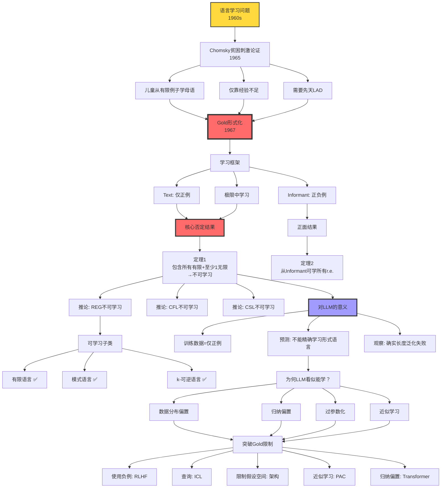

# 5.2 Gold Learnability Theory

> **子主题编号**: 05.2
> **主题**: AI模型视角

> **最后更新**: 2025-10-27
> **文档规模**: 631行 | Gold极限学习理论与形式语言可学习性
> **阅读建议**: 本文探讨形式语言的可学习性边界，对理解LLM的理论限制有重要意义

---

## 📋 目录

- [5.2 Gold Learnability Theory](#52-gold-learnability-theory)
  - [📋 目录](#-目录)
  - [1 核心概念深度分析](#1-核心概念深度分析)
    - [1.1 Gold可学习性理论概念定义卡](#11-gold可学习性理论概念定义卡)
    - [1.2 Gold可学习性理论全景图](#12-gold可学习性理论全景图)
    - [1.3 Gold定理详细证明与推论](#13-gold定理详细证明与推论)
    - [1.4 Text vs Informant详细对比](#14-text-vs-informant详细对比)
    - [1.5 对大语言模型的深刻意义](#15-对大语言模型的深刻意义)
    - [1.6 可学习语言类详细分析](#16-可学习语言类详细分析)
    - [1.7 突破Gold限制的策略矩阵](#17-突破gold限制的策略矩阵)
    - [1.8 Gold定理对AI研究的启示](#18-gold定理对ai研究的启示)
    - [1.9 Gold理论 vs 其他学习理论对比](#19-gold理论-vs-其他学习理论对比)
    - [1.10 核心洞察与设计原则](#110-核心洞察与设计原则)
  - [相关主题 | Related Topics](#相关主题--related-topics)
    - [1.11 本章节](#111-本章节)
    - [1.12 相关章节](#112-相关章节)
    - [1.13 跨视角链接](#113-跨视角链接)

---

## 1 核心概念深度分析

<details>
<summary><b>🎓🚫 点击展开：Gold可学习性理论深度分析与LLM限制</b></summary>

本节深入剖析Gold可学习性理论，揭示仅从正例学习形式语言的根本限制，以及这对大语言模型能力边界的深刻意义。

### 1.1 Gold可学习性理论概念定义卡

**概念名称**: Gold可学习性理论（Gold's Language Identification in the Limit）

**内涵（本质属性）**:

**🔹 核心定义**:
研究从例子流中学习形式语言的理论框架，定义了"极限中的学习"：

**学习器M在极限中学习语言L**，当且仅当：
$$
\exists N, \forall n \geq N: L(M(x_1, \ldots, x_n)) = L
$$
且对L的任意完整表示（包含所有L的成员）都成立。

**🔹 两种学习场景**:

| 场景类型 | 输入 | 可学习语言类 | 对LLM的意义 |
|---------|------|-------------|-----------|
| **Text（正例）** | $x_1, x_2, \ldots \in L$ | 非常有限 | ❌ LLM只有正例 |
| **Informant（正负例）** | $(x_1, +), (x_2, -), \ldots$ | 所有r.e.语言 | ✅ 但LLM无负例 |

**🔹 Gold定理（核心结果）**:

**定理1（不可学习性）**:
$$
\text{如果 } \mathcal{L} \text{ 包含所有有限语言且至少一个无限语言，则 } \mathcal{L} \text{ 不可从Text学习}
$$

**推论**:

- REG（正则语言）不可学习
- CFL（上下文无关语言）不可学习
- CSL（上下文相关语言）不可学习

**外延（范围边界）**:

| 维度 | 可学习 ✅ | 不可学习 ❌ |
|------|---------|-----------|
| **语言类** | 有限语言、模式语言、k-可逆语言 | REG、CFL、CSL（从Text） |
| **学习场景** | Informant（正负例） | Text（仅正例） |
| **收敛类型** | 极限收敛（无时间限制） | PAC学习（多项式时间） |
| **目标** | 精确学习 | 近似学习 |

**属性维度表**:

| 维度 | 值/描述 | 说明 |
|------|---------|------|
| **提出时间** | 1967 | E. Mark Gold |
| **动机** | Chomsky贫困刺激论证 | 形式化语言习得问题 |
| **理论基础** | 递归论、形式语言理论 | 可计算性+语法 |
| **核心结论** | 仅正例学习极度受限 | 负例至关重要 |
| **对LLM意义** | ⚠️⚠️⚠️⚠️⚠️ 极高 | 揭示根本限制 |
| **正面应用** | 可学习子类识别 | 指导模型设计 |
| **局限性** | 不考虑概率、资源 | 理想化模型 |

---

### 1.2 Gold可学习性理论全景图



---

### 1.3 Gold定理详细证明与推论

**定理1核心陈述**:

设 $\mathcal{L}$ 是一个语言类，如果：

1. $\mathcal{L}$ 包含所有有限语言
2. $\mathcal{L}$ 包含至少一个无限语言 $L_\infty$

则 $\mathcal{L}$ 不可从Text在极限中学习。

**证明思路（反证法）**:

| 步骤 | 论证 | 关键洞察 |
|------|------|---------|
| **假设** | 存在学习器$M$可学习$\mathcal{L}$ | 反证法起点 |
| **构造** | 有限语言$L_n = \{x_1, \ldots, x_n\}$ | 都属于$\mathcal{L}$ |
| **收敛** | $M$在看到$L_n$所有元素后必须收敛 | 极限学习定义 |
| **矛盾** | 但$L_n \subset L_\infty$，$M$无法区分 | 仅正例无法确定有限/无限 |
| **结论** | $M$不存在 | 不可学习 |

**直观例子**:

**输入例子流**: $a, aa, aaa, aaaa, \ldots$

**可能目标**:

```yaml
L1: {a, aa, aaa, aaaa}           # 有限集合
L2: {aⁿ | n≥1}                   # a⁺ (无限)
L3: {aⁿ | n≥1} ∪ {b}             # 加个b
L4: {aⁿ | n≥1, n≠100}            # 除了a¹⁰⁰
... 无穷多可能
```

**问题**: 学习器**永远无法确定**哪个是目标！

**REG不可学推论**:

$$
\begin{align}
\text{REG包含所有有限语言} &\quad \checkmark \\
\text{REG包含无限语言}(如 \; a^*) &\quad \checkmark \\
\therefore \text{REG不可从Text学习} &\quad \text{QED}
\end{align}
$$

---

### 1.4 Text vs Informant详细对比

| 维度 | Text（仅正例） | Informant（正负例） | 差异影响 |
|------|---------------|-------------------|---------|
| **输入** | $x_1, x_2, \ldots \in L$ | $(x_1, +), (x_2, -), \ldots$ | 负例关键 |
| **可学习** | 极少（有限、模式等） | 所有r.e.语言 | ⚠️⚠️⚠️⚠️⚠️ 巨大鸿沟 |
| **REG** | ❌ 不可学习 | ✅ 可学习 | 负例改变一切 |
| **CFL** | ❌ 不可学习 | ✅ 可学习 | 同上 |
| **CSL** | ❌ 不可学习 | ✅ 可学习 | 同上 |
| **r.e.** | ❌ 不可学习 | ✅ 可学习 | 终极区别 |
| **LLM场景** | ✅ 仅正例 | ❌ 无负例（预训练） | ⚠️ Gold限制适用 |
| **RLHF** | ⚠️ 部分负例 | ⚠️ 隐式负例 | 部分缓解 |

**为什么负例如此重要？**

**数学直觉**:
$$
\begin{align}
\text{仅正例}: &\quad \{x : x \in L\} \quad \text{（开集，无边界）} \\
\text{正负例}: &\quad \{x : x \in L\} \cup \{x : x \notin L\} \quad \text{（有边界）}
\end{align}
$$

负例提供**边界信息**，排除过度泛化！

**实际例子**:

```yaml
仅正例学习:
  看到: "dog", "dogs", "cat", "cats"
  可能规则:
    1. 所有单词（过度泛化）
    2. 动物名词
    3. 可数名词
    4. 以s结尾的复数形式
  问题: 无法确定！

有负例学习:
  看到: "dog"(+), "dogs"(+), "run"(-), "runs"(-)
  排除: 规则1（"run"是单词但被拒绝）
  精确: 名词（非动词）
```

---

### 1.5 对大语言模型的深刻意义

**LLM训练场景分析**:

| 维度 | LLM实际情况 | Gold框架对应 | 理论预测 |
|------|-----------|-------------|---------|
| **训练数据** | 语料库文本 | Text（仅正例） | ⚠️ Gold限制适用 |
| **目标语言** | 自然语言 | 至少包含REG | ❌ 不可学习 |
| **训练目标** | $\max \log P(x_{t+1} \mid x_{\leq t})$ | 概率近似 | 非精确学习 |
| **归纳偏置** | Transformer架构 | 限制假设空间 | 部分缓解 |
| **数据规模** | TB级 | 非Gold考虑 | 统计优势 |
| **收敛标准** | 困惑度、下游任务 | 非精确标准 | PAC框架 |

**Gold定理的预测 vs 实际观察**:

| 预测 | 实际观察 | 匹配度 | 论文证据 |
|------|---------|--------|---------|
| **不能精确学REG** | ✅ 长度泛化失败（$\{a^nb^n\}$） | ✅✅✅ 完美 | Deletang 2023 |
| **不能精确学CFL** | ✅ 括号匹配n≤20 | ✅✅✅ 完美 | Sennhauser 2018 |
| **不能精确计数** | ✅ 算术加法3-4位 | ✅✅✅ 完美 | Anil 2022 |
| **依赖归纳偏置** | ✅ 架构设计关键 | ✅✅✅ 完美 | - |
| **海量数据缓解** | ✅ Scaling Laws | ✅✅ 高 | Kaplan 2020 |

**为什么LLM"看起来"能学习？**

```mermaid
mindmap
  root((LLM表面成功))
    数据分布偏置
      自然语言非随机
        高频模式主导
        低频边界情况罕见
        测试集类似训练集
      统计正则性
        Zipf定律
        短句子多
        长句子指数级减少
    归纳偏置
      Transformer架构
        注意力机制
        位置编码
        层归一化
      预训练目标
        自回归
        掩码语言模型
        因果mask
    过参数化
      参数>>数据
        记忆能力强
        拟合训练分布
      泛化悖论
        过参数反而泛化好
        双下降曲线
    近似学习
      不求精确
        80-95%准确率足够
        实用≠理论完美
      概率建模
        P(x)而非L(x)∈{0,1}
        平滑泛化
```

**关键洞察**: LLM通过这些机制**绕过但未违反**Gold定理！

---

### 1.6 可学习语言类详细分析

| 语言类 | 定义 | 例子 | 可学习性 | 实际意义 |
|--------|------|------|---------|---------|
| **有限语言** | $\|L\| < \infty$ | $\{a, ab, abc\}$ | ✅ 可学习 | 枚举收敛 |
| **模式语言** | 含变量的字符串 | $\{a?b\}$（?匹配任意字符串） | ✅ 可学习 | 受限泛化 |
| **k-可逆语言** | k步可确定自动机 | DFA变体 | ✅ 可学习 | 正则子类 |
| **单例语言** | $L = \{w\}$ | $\{hello\}$ | ✅ 可学习 | 平凡 |
| **严格局部语言** | k-gram约束 | 禁止bi-gram列表 | ✅ 可学习 | 实用子类 |

**共同特征**: 都是**高度受限的子类**！

**模式语言详解**:

```yaml
定义:
  模式: "a?b?c"
  ?匹配: 任意有限字符串
  语言: {abc, axbc, axybc, abxc, ...}

学习算法:
  看到例子: abc, axbc, axybc
  最大特化: 找最具体模式包含所有例子
  收敛: 模式a?b?c

可学性:
  有限时间收敛: ✅
  精确学习: ✅
  但: 极度受限（REG子类的子类）
```

---

### 1.7 突破Gold限制的策略矩阵

| 策略 | 核心思想 | 实现方法 | 效果 | LLM应用 |
|------|---------|---------|------|---------|
| **使用负例** | 提供边界信息 | RLHF（人类反馈） | ⚠️⚠️⚠️⚠️ 显著 | ✅ 实用 |
| **查询** | 主动询问 | In-Context Learning | ⚠️⚠️⚠️ 中等 | ✅ 已用 |
| **限制假设空间** | 减少可能性 | 架构设计（Transformer） | ⚠️⚠️⚠️⚠️ 显著 | ✅ 核心 |
| **近似学习** | 放松精确要求 | PAC框架 | ⚠️⚠️⚠️⚠️⚠️ 根本 | ✅ 实质 |
| **归纳偏置** | 编码先验知识 | 注意力、位置编码 | ⚠️⚠️⚠️⚠️ 显著 | ✅ 必须 |
| **混合系统** | 神经+符号 | LLM+工具调用 | ⚠️⚠️⚠️⚠️ 显著 | ⚠️ 探索中 |

**RLHF作为隐式负例**:

```yaml
传统RLHF:
  生成: response1, response2
  人类评分: response1 > response2
  隐式负例: response2被拒绝

PPO训练:
  奖励模型R(x,y)
  惩罚低分响应
  相当于: 软负例

效果:
  部分缓解Gold限制
  但: 负例覆盖不完整
  结果: 改善但未根本解决
```

**Gold vs PAC对比**:

$$
\begin{align}
\text{Gold}: &\quad L(M(x_1, \ldots, x_n)) = L \quad \text{（精确）} \\
\text{PAC}: &\quad \Pr[\text{error}(h) \leq \epsilon] \geq 1-\delta \quad \text{（近似）}
\end{align}
$$

**PAC绕过Gold限制**: 不要求精确，只要高概率低误差！

---

### 1.8 Gold定理对AI研究的启示

**四大核心启示**:

**1️⃣ 理解LLM的根本局限**:

| 任务类型 | Gold预测 | 实际表现 | 匹配度 | 应对 |
|---------|---------|---------|--------|------|
| **形式语言识别** | ❌ 不可学习 | ⚠️ 近似可行 | ✅ 高 | 近似学习 |
| **精确计数** | ❌ 不可学习 | ❌ 失败 | ✅✅✅ 完美 | 工具调用 |
| **长距离依赖** | ⚠️ 难 | ⚠️ 有限 | ✅✅ 高 | 架构改进 |
| **组合泛化** | ❌ 不可学习 | ❌ 困难 | ✅✅✅ 完美 | 混合系统 |

**2️⃣ 不要期望精确学习形式语言**:

$$
\text{期望} \neq \text{LLM精确学REG/CFL} \quad \text{（Gold禁止）}
$$

**现实目标**:

- 统计近似 ✅
- 分布内泛化 ✅
- 实用性能 ✅

**3️⃣ 混合系统的必然性**:

```yaml
纯神经系统: Gold限制 → 无法精确形式任务
纯符号系统: 脆弱 → 无法处理噪声/模糊性

混合系统必然性:
  神经: 处理自然语言、模式识别
  符号: 处理精确计算、形式推理
  结合: 优势互补
```

**LLM+工具调用** 就是突破Gold限制的实用方案！

**4️⃣ 人类反馈的价值**:

$$
\text{负例（RLHF）} \Rightarrow \text{扩展可学习语言类}
$$

**RLHF不仅是对齐工具，更是突破Gold限制的理论途径！**

---

### 1.9 Gold理论 vs 其他学习理论对比

| 理论 | 提出 | 学习目标 | 资源考虑 | 数据类型 | 主要结论 |
|------|------|---------|---------|---------|---------|
| **Gold** | 1967 | 精确学习 | ❌ 无限时间 | Text/Informant | 仅正例极度受限 |
| **PAC** | 1984 | 近似学习 | ✅ 多项式时间 | i.i.d.样本 | 概率近似可行 |
| **VC理论** | 1971 | 样本复杂度 | ⚠️ 隐含考虑 | i.i.d.样本 | $m \sim d_{VC}/\epsilon$ |
| **在线学习** | 1990s | 序列学习 | ✅ 单次更新 | 对抗序列 | Regret界 |
| **元学习** | 2010s | 学习学习 | ⚠️ 多任务 | 任务分布 | 快速适应 |

**互补关系**:

- **Gold**: 精确学习的理论极限（否定结果）
- **PAC**: 近似学习的可行性（正面结果）
- **VC**: 样本复杂度（桥梁）
- **LLM**: 实践中综合应用所有理论

---

### 1.10 核心洞察与设计原则

**五大核心定律**:

1. **Gold不可能定律**
   $$
   \text{仅正例} + \text{包含所有有限+至少1无限} \Rightarrow \text{不可学习}
   $$
   - 根本限制，无法绕过
   - LLM训练正是此场景

2. **负例关键定律**
   $$
   \text{负例} \Rightarrow \text{可学习语言类暴增}（\text{有限子类} \to \text{所有r.e.}）
   $$
   - RLHF价值的理论基础
   - 边界信息至关重要

3. **近似逃逸定律**
   $$
   \text{精确学习（Gold）} \neq \text{近似学习（PAC）}
   $$
   - PAC不受Gold限制
   - LLM本质是近似学习

4. **归纳偏置必然性定律**
   $$
   \text{无归纳偏置} \Rightarrow \text{Gold限制致命}
   $$
   - Transformer架构是归纳偏置
   - 限制假设空间=绕过Gold

5. **混合系统必然定律**
   $$
   \text{突破Gold限制} \Rightarrow \text{神经+符号混合}
   $$
   - 纯神经受Gold限制
   - 工具调用是实用解

**实践设计原则**:

```yaml
原则1_接受Gold限制:
  认知: LLM不能精确学习形式语言
  行动: 不设计需要精确学习的任务
  例子: 用符号系统做精确计算

原则2_利用RLHF:
  认知: 负例扩展可学习类
  行动: 人类反馈提供隐式负例
  例子: RLHF对齐

原则3_归纳偏置优先:
  认知: 架构限制假设空间
  行动: 设计任务特定归纳偏置
  例子: Transformer注意力机制

原则4_近似思维:
  认知: 不追求精确，追求实用
  行动: PAC框架而非Gold框架
  例子: 困惑度、BLEU等近似指标

原则5_混合架构:
  认知: 神经+符号突破Gold限制
  行动: 工具调用、神经符号融合
  例子: LLM+代码解释器
```

**终极洞察**:

> **"Gold定理不是LLM的bug，而是feature。它精确定义了纯神经方法的理论边界。LLM的成功不是违反Gold定理，而是通过近似学习、归纳偏置、海量数据，在实用层面绕过了理论限制。但根本限制永远存在：要精确学习形式语言，必须有负例或限制假设空间。这就是为什么RLHF和工具调用不是锦上添花，而是突破Gold限制的必由之路。"**

**元认知**:

- **Gold理论≠实践障碍**: 提供理论理解，不阻止实用系统
- **负例的价值被低估**: RLHF远比对齐更重要
- **近似学习是智慧**: 不追求不可能的精确
- **混合系统是未来**: 神经+符号突破理论限制
- **理论指导实践**: Gold定理解释为何LLM在某些任务失败

</details>

---


- [Gold可学习性理论](#gold可学习性理论)
  - [📋 目录](#-目录)
  - [1 核心概念深度分析](#1-核心概念深度分析)
    - [1.1 Gold可学习性理论概念定义卡](#11-gold可学习性理论概念定义卡)
    - [1.2 Gold可学习性理论全景图](#12-gold可学习性理论全景图)
    - [1.3 Gold定理详细证明与推论](#13-gold定理详细证明与推论)
    - [1.4 Text vs Informant详细对比](#14-text-vs-informant详细对比)
    - [1.5 对大语言模型的深刻意义](#15-对大语言模型的深刻意义)
    - [1.6 可学习语言类详细分析](#16-可学习语言类详细分析)
    - [1.7 突破Gold限制的策略矩阵](#17-突破gold限制的策略矩阵)
    - [1.8 Gold定理对AI研究的启示](#18-gold定理对ai研究的启示)
    - [1.9 Gold理论 vs 其他学习理论对比](#19-gold理论-vs-其他学习理论对比)
    - [1.10 核心洞察与设计原则](#110-核心洞察与设计原则)
  - [相关主题 | Related Topics](#相关主题--related-topics)
    - [1.11 本章节](#111-本章节)
    - [1.12 相关章节](#112-相关章节)
    - [1.13 跨视角链接](#113-跨视角链接)


## 相关主题 | Related Topics

### 1.11 本章节

- [05.1 PAC学习框架](./05.1_PAC_Learning_Framework.md)
- [05.3 样本复杂度](./05.3_Sample_Complexity.md)
- [05.4 泛化理论](./05.4_Generalization_Theory.md)
- [05.5 归纳偏置](./05.5_Inductive_Bias.md)
- [05.6 统计学习理论](./05.6_Statistical_Learning_Theory.md)

### 1.12 相关章节

- [01.3 形式语言分类](../01_Foundational_Theory/01.3_Formal_Language_Classification.md)
- [03.1 统计语言模型](../03_Language_Models/03.1_Statistical_Language_Models.md)

### 1.13 跨视角链接

- [FormalLanguage_Perspective](../../FormalLanguage_Perspective/README.md)
- [概念交叉索引（七视角版）](../../CONCEPT_CROSS_INDEX.md) - 查看相关概念的七视角分析：
  - [Gold可学习性理论](../../CONCEPT_CROSS_INDEX.md#91-gold可学习性-gold-learnability-theory-七视角) - 本文档的七视角完整分析
  - [Chomsky层级](../../CONCEPT_CROSS_INDEX.md#51-chomsky层级-chomsky-hierarchy-七视角) - 形式语言分类体系
  - [图灵完备性](../../CONCEPT_CROSS_INDEX.md#191-图灵完备性-turing-completeness-七视角) - 计算能力的理论基础
