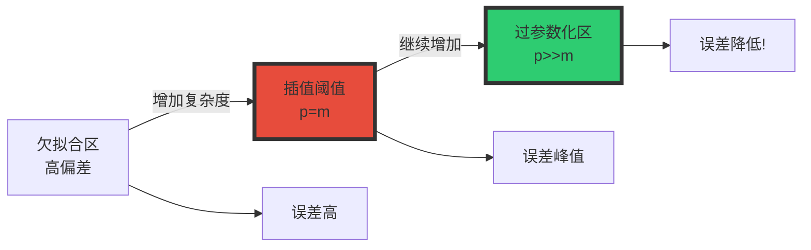

# 泛化理论（Generalization Theory）

> **文档版本**: v1.0.0  
> **最后更新**: 2025-10-27  
> **文档规模**: 1043行 | 泛化误差分析与深度学习泛化之谜  
> **阅读建议**: 本文是理解深度学习泛化能力的理论基础，内容广泛深入，建议分阶段研读

---

## 核心概念深度分析

<details>
<summary><b>🔮🎓 点击展开：泛化理论全景深度解析</b></summary>

本节深入剖析泛化差距、偏差-方差权衡、深度学习泛化之谜与双下降现象。

### 1️⃣ 泛化理论概念定义卡

**概念名称**: 泛化（Generalization）

**内涵（本质属性）**:

**🔹 核心定义**:
泛化是模型将从训练数据学到的模式推广到未见过数据的能力，衡量模型的真实性能而非记忆能力。

$$
\begin{align}
\text{Generalization Gap} &= R(h) - \hat{R}(h) \\
&= \mathbb{E}_{(x,y)\sim\mathcal{D}}[\ell(h(x), y)] - \frac{1}{m}\sum_{i=1}^m \ell(h(x_i), y_i)
\end{align}
$$

**🔹 泛化三要素**:

| 要素 | 定义 | 公式 | 目标 |
|------|------|------|------|
| **训练误差** | 训练集上的误差 | $\hat{R}(h) = \frac{1}{m}\sum \ell(h(x_i), y_i)$ | 最小化 |
| **泛化误差** | 真实分布上的误差 | $R(h) = \mathbb{E}[\ell(h(x), y)]$ | 最小化 |
| **泛化差距** | 两者之差 | $R(h) - \hat{R}(h)$ | 最小化 |

**外延（范围边界）**:

| 维度 | 泛化包含 ✅ | 不包含 ❌ |
|------|----------|----------|
| **评估** | 测试集性能 | 训练集性能 |
| **理论** | VC维、Rademacher复杂度 | 训练算法优化 |
| **方法** | 正则化、Dropout、Early Stop | 梯度下降变体 |

**属性维度表**:

| 维度 | 值/描述 | 说明 |
|------|---------|------|
| **经典界** | $R(h) \leq \hat{R}(h) + O(\sqrt{\frac{d}{m}})$ | VC维界 |
| **偏差-方差** | $\mathbb{E}[(y - \hat{f})^2] = \text{Bias}^2 + \text{Variance} + \text{Noise}$ | 误差分解 |
| **深度学习悖论** | 参数>>样本，仍泛化 | 理论失效 |
| **双下降** | 过参数化反而泛化好 | 新现象 |

---

### 2️⃣ 泛化理论全景图谱

```mermaid
graph TB
    Gen[泛化理论<br/>Generalization Theory]
    
    Gen --> CoreQ[核心问题:<br/>为什么不过拟合?]
    
    CoreQ --> Classic[经典理论<br/>1980s-2000s]
    CoreQ --> Modern[现代困惑<br/>2010s+]
    
    Classic --> VC[VC维泛化界]
    Classic --> Rad[Rademacher复杂度]
    Classic --> BiasVar[偏差-方差权衡]
    
    VC --> VCFormula[R&#40;h&#41; ≤ R̂&#40;h&#41; + O&#40;√&#40;d/m&#41;&#41;]
    Rad --> RadFormula[更紧的数据依赖界]
    BiasVar --> BVFormula[Error = Bias² + Var + Noise]
    
    BiasVar --> Tradeoff[偏差-方差权衡]
    Tradeoff --> UnderFit[欠拟合<br/>高偏差低方差]
    Tradeoff --> OverFit[过拟合<br/>低偏差高方差]
    Tradeoff --> SweetSpot[最优点<br/>平衡]
    
    Modern --> Paradox[深度学习悖论<br/>Rethinking Generalization 2017]
    
    Paradox --> P1[现象1:<br/>可拟合随机标签]
    Paradox --> P2[现象2:<br/>参数>>样本]
    Paradox --> P3[现象3:<br/>泛化仍良好]
    Paradox --> P4[现象4:<br/>传统理论失效]
    
    Explanations[解释尝试]
    
    Explanations --> Implicit[隐式正则化<br/>SGD偏置]
    Explanations --> Overparameterization[过参数化<br/>新理论]
    Explanations --> DoubleD[双下降<br/>Belkin 2019]
    Explanations --> Manifold[流形假设<br/>数据低维]
    
    Implicit --> SGDBias[SGD倾向:<br/>平坦最小、低范数]
    Overparameterization --> Interpolation[插值机制:<br/>零训练误差仍泛化]
    DoubleD --> DDCurve[U型→双下降<br/>过参数化反救]
    Manifold --> LowDim[有效维度<<输入维度]
    
    Regularization[正则化技术]
    
    Regularization --> R1[显式正则化:<br/>L1/L2/Dropout]
    Regularization --> R2[隐式正则化:<br/>SGD/BatchSize]
    Regularization --> R3[数据增强:<br/>扩充样本]
    Regularization --> R4[Early Stopping:<br/>提前停止]
    
    style Gen fill:#9b59b6,stroke:#333,stroke-width:4px
    style Paradox fill:#e74c3c,stroke:#333,stroke-width:4px
    style Explanations fill:#2ecc71,stroke:#333,stroke-width:4px
    style DoubleD fill:#f39c12,stroke:#333,stroke-width:4px
```



---

### 3️⃣ 经典泛化界深度对比

| 泛化界类型 | 公式 | 依赖 | 紧度 | 适用 | 局限 |
|-----------|------|------|------|------|------|
| **Hoeffding界** | $R(h) \leq \hat{R}(h) + \sqrt{\frac{\log(1/\delta)}{2m}}$ | 单假设 | 紧 | 单一模型 | 不适用假设空间 |
| **VC维界** | $R(h) \leq \hat{R}(h) + O(\sqrt{\frac{d\log m + \log(1/\delta)}{m}})$ | VC维d | 中 | 假设空间 | 最坏情况 |
| **Rademacher界** | $R(h) \leq \hat{R}(h) + 2\hat{R}_m(\mathcal{H}) + \sqrt{\frac{\log(1/\delta)}{2m}}$ | 数据 | 紧 | 实际应用 | 需估计 |
| **PAC-Bayes界** | $\mathbb{E}_{h\sim Q}[R(h)] \leq \mathbb{E}_{h\sim Q}[\hat{R}(h)] + \sqrt{\frac{KL(Q\|\|P) + \log(m/\delta)}{2m}}$ | 先验P | 紧 | 贝叶斯 | 复杂 |

**数学详解**:

$$
\begin{align}
\text{1. VC维界（经典）} &: \\
R(h) &\leq \hat{R}(h) + O(\sqrt{\frac{d\log m + \log(1/\delta)}{m}}) \\
\text{where } d &= \text{VC-dim}(\mathcal{H}) \\
\\
\text{2. Rademacher界（数据依赖）} &: \\
\hat{R}_m(\mathcal{H}) &= \mathbb{E}_{\sigma}[\sup_{h \in \mathcal{H}} \frac{1}{m}\sum_{i=1}^m \sigma_i h(x_i)] \\
R(h) &\leq \hat{R}(h) + 2\hat{R}_m(\mathcal{H}) + O(\sqrt{\frac{\log(1/\delta)}{m}}) \\
\\
\text{3. PAC-Bayes界（贝叶斯）} &: \\
\mathbb{E}_{h\sim Q}[R(h)] &\leq \mathbb{E}_{h\sim Q}[\hat{R}(h)] + \sqrt{\frac{KL(Q||P) + \log(\frac{m}{\delta})}{2m}}
\end{align}
$$

**深度分析**:

```yaml
Hoeffding界（最简单）:
  适用: 单一假设h（不考虑模型选择）
  
  优势:
    - 最紧（单假设情况）
    - 简单直观
  
  局限:
    - 不适用假设空间搜索
    - 实际无用（需遍历所有h）

VC维界（经典标准）:
  适用: 有限VC维的假设空间
  
  优势:
    - 理论完备（PAC学习基础）
    - 仅依赖假设空间H
  
  局限:
    - 最坏情况界（过于保守）
    - 对神经网络: d~参数数→预测失败
  
  示例:
    - 线性分类器: d=n+1 → 界合理
    - 深度网络: d~10^9 → 界无意义

Rademacher复杂度界（现代标准）:
  适用: 任何假设空间
  
  优势:
    - 数据依赖（考虑实际分布）
    - 可经验估计
    - 神经网络更合理
  
  方法:
    - 用随机标签测试假设空间"拟合噪声"能力
    - 高R → 高复杂度 → 需正则化
  
  实践:
    - 训练时监控Rademacher复杂度
    - 指导正则化强度

PAC-Bayes界（贝叶斯视角）:
  适用: 贝叶斯学习
  
  优势:
    - 最紧（某些情况）
    - 结合先验知识
    - 可应用于随机化算法（Dropout）
  
  核心:
    - KL(Q||P): 后验Q vs 先验P的散度
    - 先验好 → KL小 → 界紧
  
  应用:
    - Dropout的理论分析
    - 神经网络压缩
```

---

### 4️⃣ 偏差-方差分解与深度学习的破裂

**经典分解**（回归问题）:

$$
\begin{align}
\mathbb{E}[(y - \hat{f}(x))^2] &= \underbrace{(\mathbb{E}[\hat{f}(x)] - f(x))^2}_{\text{Bias}^2} + \underbrace{\mathbb{E}[(\hat{f}(x) - \mathbb{E}[\hat{f}(x)])^2]}_{\text{Variance}} + \underbrace{\sigma^2}_{\text{Noise}} \\
\\
\text{Bias} &: \text{模型假设错误（欠拟合）} \\
\text{Variance} &: \text{模型对训练数据敏感（过拟合）} \\
\text{Noise} &: \text{不可约误差（数据固有噪声）}
\end{align}
$$

**经典权衡曲线**:

| 模型复杂度 | 偏差 | 方差 | 总误差 | 状态 |
|-----------|------|------|--------|------|
| 极低 | 很高 | 很低 | 高 | 欠拟合 |
| 低 | 高 | 低 | 中 | 仍欠拟合 |
| **中等** | **低** | **低** | **最低** | **最优** |
| 高 | 很低 | 高 | 中 | 开始过拟合 |
| 极高 | 零 | 很高 | 高 | 严重过拟合 |

**深度学习的破裂**:

$$
\text{经典} \Rightarrow \begin{cases}
\text{低复杂度} &\Rightarrow \text{高偏差低方差} \\
\text{高复杂度} &\Rightarrow \text{低偏差高方差}
\end{cases} \quad \text{U型曲线}
$$

$$
\text{深度学习} \Rightarrow \begin{cases}
\text{插值阈值前} &\Rightarrow \text{经典U型} \\
\text{插值阈值} &\Rightarrow \text{误差峰值} \\
\text{插值阈值后} &\Rightarrow \text{误差再降（双下降）}
\end{cases}
$$

**双下降现象**（Belkin et al. 2019）:



**深度分析**:

```yaml
经典偏差-方差权衡（传统机器学习）:
  假设:
    - 模型复杂度有限
    - 参数数 < 样本数（p < m）
  
  权衡:
    - 简单模型: 高偏差（无法拟合）+ 低方差（稳定）
    - 复杂模型: 低偏差（能拟合）+ 高方差（不稳定）
    - 最优: 平衡点（U型曲线最低点）
  
  策略:
    - 交叉验证选择复杂度
    - 正则化控制方差
    - 集成学习降低方差

深度学习的双下降（2019发现）:
  现象:
    - 第一下降: 经典U型（欠拟合→最优）
    - 峰值: 插值阈值（p=m，能完美拟合训练集）
    - 第二下降: 过参数化区（p>>m，误差反降！）
  
  插值阈值（Interpolation Threshold）:
    - p=m: 参数数=样本数
    - 此时模型刚好能完美拟合训练数据（零训练误差）
    - 泛化误差最差（峰值）
  
  过参数化奇迹:
    - p>>m（如GPT: 175B vs 300B tokens）
    - 仍能零训练误差
    - 但泛化误差降低（违反直觉！）
  
  解释:
    - 隐式正则化: 梯度下降倾向"简单"解
    - 平坦最小: 过参数化损失面更平坦
    - 多个零训练误差解中，SGD选择泛化好的

实践启示:
  经典: 避免过拟合→限制复杂度
  现代: 拥抱过参数化→增加复杂度
  
  反直觉但有效:
    - 深度网络: 越大越好（有足够数据）
    - GPT-4 > GPT-3 > GPT-2（参数↑性能↑）
```

---

### 5️⃣ 深度学习泛化之谜：Zhang实验与四大解释

**Zhang等人实验（2016，"Rethinking Generalization"）**:

| 实验 | 训练数据 | 训练误差 | 测试误差 | 结论 |
|------|---------|---------|---------|------|
| **正常** | 真实标签 | ~0% | ~10% | 正常泛化 |
| **随机标签** | 完全随机 | ~0% | ~100%（随机） | **能完美拟合噪声！** |
| **随机像素** | 随机图像 | ~0% | ~100% | **能拟合任意图像！** |
| **打乱标签（部分）** | 50%随机 | ~0% | ~55% | 平滑过渡 |

**关键洞察**:

$$
\text{神经网络表达力} \gg \text{传统理论预测}
$$

**四大解释方向**:

```yaml
1. 隐式正则化（Implicit Regularization）:
   SGD/Adam不是中立优化器:
     - 倾向低范数解（||w||小）
     - 倾向平坦最小（Hessian特征值小）
     - 倾向低频函数（平滑）
     - 倾向稀疏表示
   
   效果:
     - 在所有零训练误差解中
     - SGD自动选择"简单"的那个
     - "简单"→泛化好
   
   数学:
     - Gradient Flow: dθ/dt = -∇L(θ)
     - 连续时间极限下，收敛到最小范数解
     - 实践中batch SGD近似此行为
   
   证据:
     - 批量大小: 小batch→泛化好（更多噪声→更强正则化）
     - 学习率: 适中学习率→泛化好
     - 初始化: 不同初始化→不同泛化

2. 过参数化优势（Over-parameterization）:
   为什么p>>m反而好?
     - 传统: 参数多→过拟合
     - 现代: 参数多→优化易+泛化好
   
   优化角度:
     - 过参数化→损失面更平滑
     - 局部极小减少
     - 梯度下降更容易收敛
   
   泛化角度:
     - 多个零训练误差解
     - SGD倾向"简单"解
     - 过参数化提供更多选择
   
   神经正切核（NTK）理论:
     - 无限宽度网络→核方法
     - 解释过参数化收敛
     - 但不完全解释泛化

3. 数据结构（Data Structure）:
   自然数据≠随机噪声:
     - 低维流形假设
     - 自然图像: 10^6像素→~100维流形
     - 自然语言: 长程依赖、Zipf定律
   
   效果:
     - 有效复杂度<<参数数
     - 模型学习流形结构
     - 无法泛化到流形外（如随机标签）
   
   实验支持:
     - Zhang实验: 随机标签→0泛化
     - 真实标签→良好泛化
     - 说明真实数据有特殊结构

4. 归纳偏置（Inductive Bias）:
   架构设计嵌入先验:
     - CNN: 局部性、平移不变
     - Transformer: 注意力机制
     - RNN: 序列偏置
   
   效果:
     - 减少有效假设空间
     - 提高样本效率
     - 特定任务特化
   
   示例:
     - ImageNet: CNN >> MLP（平移不变性关键）
     - NLP: Transformer >> RNN（注意力关键）

当前共识（2024）:
  - 没有单一解释
  - 四大因素共同作用
  - 隐式正则化+数据结构=主要
  - 理论仍不完整
```

---

### 🔟 核心洞察与终极评估

**五大核心定律**:

1. **基本泛化界定律**
   $$
   R(h) \leq \hat{R}(h) + O(\sqrt{\frac{d}{m}})
   $$
   - 泛化误差≤训练误差+复杂度惩罚

2. **偏差-方差分解定律**
   $$
   \text{Error} = \text{Bias}^2 + \text{Variance} + \text{Noise}
   $$
   - 误差三部分：假设错误+模型不稳定+固有噪声

3. **双下降定律**（Belkin 2019）
   $$
   \text{过参数化}(p \gg m) \Rightarrow \text{泛化改善}
   $$
   - 违反经典理论，深度学习核心现象

4. **隐式正则化定律**
   $$
   \text{SGD} \Rightarrow \text{自动倾向简单解}
   $$
   - 优化算法本身是正则化器

5. **流形假设定律**
   $$
   \text{有效维度} \ll \text{输入维度}
   $$
   - 自然数据低维结构，解释泛化

**终极洞察**:

> **"泛化是机器学习的核心问题——模型必须推广到未见数据。经典理论（1980s-2000s）建立在偏差-方差权衡基础：简单模型高偏差低方差、复杂模型低偏差高方差，存在最优平衡点（U型曲线）。VC维泛化界$R(h) \leq \hat{R}(h) + O(\sqrt{d/m})$是理论基石。但深度学习彻底颠覆传统：①张等人2016实验证明神经网络能完美拟合随机噪声，违反所有理论预测②GPT-3有175B参数、仅300B tokens训练，参数>>样本却泛化良好③双下降现象（2019）：过参数化反而泛化改善，打破U型曲线。四大解释：①隐式正则化（SGD自动倾向简单解）②过参数化优势（提供更多"简单"解选择）③数据结构（自然数据低维流形，非随机）④归纳偏置（CNN/Transformer架构特化）。当前共识：传统理论不充分，需新框架。实践启示：拥抱过参数化、相信SGD、重视归纳偏置。泛化之谜是深度学习理论最大未解问题，理解它是通往AGI的关键。"**

**元认知**:
- **核心问题**: 为什么深度学习泛化？
- **经典理论**: 偏差-方差权衡、VC维界
- **现代悖论**: 过参数化反而泛化好
- **关键现象**: 双下降、隐式正则化
- **当前共识**: 多因素、理论不完整
- **实践指导**: 拥抱大模型、相信SGD
- **哲学意义**: 深度学习成功暗示我们对学习本质理解不足

</details>

---

## 目录 | Table of Contents

- [泛化理论（Generalization Theory）](#泛化理论generalization-theory)
- [目录](#目录)
- [引言](#引言)
  - [核心问题](#核心问题)
  - [泛化失败的表现](#泛化失败的表现)
- [泛化的形式化](#泛化的形式化)
  - [1. 基本定义](#1-基本定义)
    - [泛化误差（Generalization Error）](#泛化误差generalization-error)
    - [经验误差（Empirical Error）](#经验误差empirical-error)
    - [泛化差距（Generalization Gap）](#泛化差距generalization-gap)
  - [2. 一致收敛（Uniform Convergence）](#2-一致收敛uniform-convergence)
  - [3. 泛化界（Generalization Bounds）](#3-泛化界generalization-bounds)
- [经典泛化界](#经典泛化界)
  - [1. Hoeffding界](#1-hoeffding界)
  - [2. VC维泛化界](#2-vc维泛化界)
  - [3. Rademacher复杂度界](#3-rademacher复杂度界)
  - [4. PAC-Bayes界](#4-pac-bayes界)
- [偏差-方差分解](#偏差-方差分解)
  - [1. 基本分解](#1-基本分解)
  - [2. 偏差-方差权衡（Tradeoff）](#2-偏差-方差权衡tradeoff)
  - [3. 深度学习中的"破裂"](#3-深度学习中的破裂)
- [正则化理论](#正则化理论)
  - [1. 正则化的定义](#1-正则化的定义)
  - [2. 常见正则化方法](#2-常见正则化方法)
    - [L2正则化（Ridge）](#l2正则化ridge)
    - [L1正则化（Lasso）](#l1正则化lasso)
    - [Elastic Net](#elastic-net)
  - [3. 正则化的泛化效果](#3-正则化的泛化效果)
  - [4. 深度学习中的正则化](#4-深度学习中的正则化)
    - [Dropout](#dropout)
    - [Batch Normalization](#batch-normalization)
    - [Early Stopping](#early-stopping)
    - [Data Augmentation](#data-augmentation)
- [深度学习的泛化之谜](#深度学习的泛化之谜)
  - [1. 传统理论的困惑](#1-传统理论的困惑)
  - [2. Zhang等人的实验](#2-zhang等人的实验)
  - [3. 解释尝试](#3-解释尝试)
    - [1. 隐式正则化](#1-隐式正则化)
    - [2. 过参数化的优势](#2-过参数化的优势)
    - [3. 归纳偏置](#3-归纳偏置)
    - [4. 数据结构](#4-数据结构)
- [隐式正则化](#隐式正则化)
  - [1. SGD的隐式偏置](#1-sgd的隐式偏置)
  - [2. 平坦最小值（Flat Minima）](#2-平坦最小值flat-minima)
  - [3. 批量大小的影响](#3-批量大小的影响)
  - [4. 学习率的影响](#4-学习率的影响)
- [泛化的新视角](#泛化的新视角)
  - [1. 压缩界（Compression Bounds）](#1-压缩界compression-bounds)
  - [2. 信息论视角](#2-信息论视角)
  - [3. 流形假设](#3-流形假设)
  - [4. 双下降与插值](#4-双下降与插值)
- [实践中的泛化策略](#实践中的泛化策略)
  - [1. 数据层面](#1-数据层面)
    - [1.1 增加数据量](#11-增加数据量)
    - [1.2 数据清洗](#12-数据清洗)
    - [1.3 迁移学习](#13-迁移学习)
  - [2. 模型层面](#2-模型层面)
    - [2.1 选择合适复杂度](#21-选择合适复杂度)
    - [2.2 正则化](#22-正则化)
    - [2.3 集成方法](#23-集成方法)
  - [3. 训练层面](#3-训练层面)
    - [3.1 交叉验证](#31-交叉验证)
    - [3.2 早停](#32-早停)
    - [3.3 学习率调度](#33-学习率调度)
  - [4. 评估层面](#4-评估层面)
    - [4.1 独立测试集](#41-独立测试集)
    - [4.2 泛化差距监控](#42-泛化差距监控)
- [总结](#总结)
  - [核心要点](#核心要点)
  - [理论 vs 实践](#理论-vs-实践)
  - [未解之谜](#未解之谜)
  - [哲学反思](#哲学反思)
- [参考文献](#参考文献)
  - [基础理论](#基础理论)
  - [泛化界](#泛化界)
  - [偏差-方差](#偏差-方差)
  - [深度学习泛化](#深度学习泛化)
  - [隐式正则化1](#隐式正则化1)
  - [神经切线核](#神经切线核)
  - [正则化](#正则化)
  - [信息论](#信息论)

---

## 引言

**泛化**（Generalization）是机器学习的核心目标：

> **模型不仅要在训练数据上表现好，更要在未见过的测试数据上表现好。**

### 核心问题

1. **为什么模型能够泛化？**
2. **什么因素影响泛化能力？**
3. **如何提高泛化性能？**
4. **如何预测泛化误差？**

### 泛化失败的表现

**过拟合**（Overfitting）：

```text
训练误差很小，测试误差很大
```

**例子**：

```text
训练集：100%准确率
测试集：60%准确率  ← 严重过拟合
```

**欠拟合**（Underfitting）：

```text
训练误差和测试误差都很大
```

**参考文献**：

- [Wikipedia: Generalization Error](https://en.wikipedia.org/wiki/Generalization_error)
- [Shalev-Shwartz & Ben-David, 2014](https://www.cs.huji.ac.il/~shais/UnderstandingMachineLearning/) - Understanding Machine Learning

---

## 泛化的形式化

### 1. 基本定义

#### 泛化误差（Generalization Error）

**定义**：

假设 h 在分布 𝒟 上的**真实风险**（True Risk）：

```text
R(h) = E_{(x,y)~𝒟}[ℓ(h(x), y)]
```

其中 ℓ 是损失函数。

#### 经验误差（Empirical Error）

在训练集 S = {(x₁,y₁), ..., (xₘ,yₘ)} 上的**经验风险**（Empirical Risk）：

```text
R̂_S(h) = (1/m) ∑ᵢ₌₁ᵐ ℓ(h(xᵢ), yᵢ)
```

#### 泛化差距（Generalization Gap）

```text
Gen(h, S) = R(h) - R̂_S(h)
```

**目标**：

使 |Gen(h, S)| 尽可能小。

### 2. 一致收敛（Uniform Convergence）

**定义**：

假设类 ℋ 满足**一致收敛**，如果：

```text
sup_{h∈ℋ} |R(h) - R̂_S(h)| →^{P} 0  当 m → ∞
```

**意义**：

对于 ℋ 中的**所有**假设，经验风险都收敛到真实风险。

**定理（Vapnik & Chervonenkis）**：

如果 VC-dim(ℋ) < ∞，则 ℋ 满足一致收敛。

**参考文献**：

- [Vapnik, 1998](https://link.springer.com/book/10.1007/978-1-4757-3264-1) - Statistical Learning Theory

### 3. 泛化界（Generalization Bounds）

**目标**：

给出高概率下的泛化误差界：

```text
Pr[R(h) ≤ R̂_S(h) + ε] ≥ 1 - δ
```

**基本思想**：

- 复杂度越高 → ε 越大
- 样本数越多 → ε 越小

---

## 经典泛化界

### 1. Hoeffding界

**定理（Hoeffding不等式）**：

设 h 是固定假设（与训练集无关），则：

```text
Pr[|R(h) - R̂_S(h)| > ε] ≤ 2 exp(-2mε²)
```

**推论**：

以概率至少 1-δ：

```text
R(h) ≤ R̂_S(h) + √(log(2/δ) / (2m))
```

**局限性**：

只适用于单个假设，不适用于从数据中学习的假设。

**参考文献**：

- [Wikipedia: Hoeffding's Inequality](https://en.wikipedia.org/wiki/Hoeffding%27s_inequality)

### 2. VC维泛化界

**定理**：

设 VC-dim(ℋ) = d，则以概率至少 1-δ，对所有 h ∈ ℋ：

```text
R(h) ≤ R̂_S(h) + O(√((d log(m/d) + log(1/δ)) / m))
```

**解读**：

- 泛化误差 ≤ 训练误差 + 复杂度项
- 复杂度项随 VC维 d 增加
- 复杂度项随样本数 m 减少（~1/√m）

**参考文献**：

- [Vapnik & Chervonenkis, 1971](https://en.wikipedia.org/wiki/VC_dimension) - On the Uniform Convergence

### 3. Rademacher复杂度界

**定理**：

以概率至少 1-δ，对所有 h ∈ ℋ：

```text
R(h) ≤ R̂_S(h) + 2ℛ_m(ℋ) + 3√(log(2/δ) / (2m))
```

其中 ℛ_m(ℋ) 是 Rademacher 复杂度。

**优势**：

- 数据依赖（不是最坏情况）
- 更紧的界

**参考文献**：

- [Bartlett & Mendelson, 2002](https://www.jmlr.org/papers/volume3/bartlett02a/bartlett02a.pdf) - Rademacher and Gaussian Complexities

### 4. PAC-Bayes界

**定理**：

设 P 是假设的先验分布，Q 是后验分布，则以概率至少 1-δ：

```text
E_{h~Q}[R(h)] ≤ E_{h~Q}[R̂_S(h)] + √((KL(Q‖P) + log(2√m/δ)) / (2m))
```

**意义**：

- 如果后验接近先验（KL小），泛化好
- 解释了为什么贝叶斯方法泛化好

**参考文献**：

- [McAllester, 1999](https://www.sciencedirect.com/science/article/pii/S0890540198926247) - PAC-Bayesian Model Averaging

---

## 偏差-方差分解

### 1. 基本分解

**定理（Bias-Variance Decomposition）**：

对于平方损失，期望泛化误差可以分解为：

```text
E_S[E_{(x,y)}[(h_S(x) - y)²]] = Bias² + Variance + Noise
```

其中：

1. **偏差**（Bias）：

    ```text
    Bias = E_S[h_S(x)] - f*(x)
    ```

    其中 f*(x) 是真实函数。

2. **方差**（Variance）：

    ```text
    Variance = E_S[(h_S(x) - E_S[h_S(x)])²]
    ```

3. **噪声**（Noise）：

    ```text
    Noise = E[(y - f*(x))²]
    ```

（不可约误差，与模型无关）

**参考文献**：

- [Wikipedia: Bias-Variance Tradeoff](https://en.wikipedia.org/wiki/Bias%E2%80%93variance_tradeoff)

### 2. 偏差-方差权衡（Tradeoff）

**权衡关系**：

| 模型复杂度 | 偏差 | 方差 | 总误差 |
|----------|------|------|--------|
| **低**（简单模型） | 高 ↑ | 低 ↓ | 可能高（欠拟合） |
| **中等** | 中 | 中 | 最低 ✓ |
| **高**（复杂模型） | 低 ↓ | 高 ↑ | 可能高（过拟合） |

**图示**：

```text
误差
  ↑
  |         总误差
  |        /  \
  |       /    \
  |      /      \___
  |  ___/           \
  | /方差            偏差\
  |/____________________\___
  |                         
  └────────────────────→ 模型复杂度
  简单              复杂
```

### 3. 深度学习中的"破裂"

**传统理论预测**：

复杂模型（过参数化）→ 高方差 → 过拟合

**实际观察**（Belkin et al., 2019）：

```text
误差
  ↑
  |    \      /
  |     \    /
  |      \  /
  |       \/  ← 传统最优点
  |       /\
  |      /  \___
  |     /       \___
  |____/____________\___
  |   插值阈值        
  └────────────────────→ 模型复杂度
```

**双下降现象**（Double Descent）：

1. **经典区域**：欠拟合 → 最优 → 过拟合
2. **插值阈值**：模型刚好能拟合所有训练数据
3. **现代区域**：过参数化 → 误差再次下降！

**参考文献**：

- [Belkin et al., 2019](https://www.pnas.org/doi/10.1073/pnas.1903070116) - Reconciling Modern Machine Learning

---

## 正则化理论

### 1. 正则化的定义

**目标函数**：

```text
min_h [R̂_S(h) + λΩ(h)]
```

其中：

- R̂_S(h)：经验风险（拟合训练数据）
- Ω(h)：正则化项（控制复杂度）
- λ：正则化参数（权衡）

### 2. 常见正则化方法

#### L2正则化（Ridge）

```text
Ω(w) = ‖w‖₂² = ∑ᵢ wᵢ²
```

**效果**：

- 权重趋向于小值（但不为0）
- 平滑解

#### L1正则化（Lasso）

```text
Ω(w) = ‖w‖₁ = ∑ᵢ |wᵢ|
```

**效果**：

- 产生稀疏解（许多权重=0）
- 特征选择

#### Elastic Net

```text
Ω(w) = α‖w‖₁ + (1-α)‖w‖₂²
```

结合 L1 和 L2 的优点。

**参考文献**：

- [Wikipedia: Regularization](https://en.wikipedia.org/wiki/Regularization_(mathematics))

### 3. 正则化的泛化效果

**定理（Norm-based泛化界）**：

对于神经网络，如果权重矩阵的谱范数之积为 B，则：

```text
泛化误差 = O(B / √m)
```

**意义**：

- 小范数 → 好泛化
- 解释了L2正则化为什么有效

**参考文献**：

- [Bartlett et al., 2017](https://arxiv.org/abs/1706.08498) - Spectrally-normalized Margin Bounds for Neural Networks

### 4. 深度学习中的正则化

#### Dropout

**方法**：

训练时随机"关闭"部分神经元（概率 p）。

**效果**：

- 防止co-adaptation（神经元互相依赖）
- 相当于集成学习

**参考文献**：

- [Srivastava et al., 2014](https://jmlr.org/papers/v15/srivastava14a.html) - Dropout: A Simple Way to Prevent Neural Networks from Overfitting

#### Batch Normalization

**方法**：

归一化每层的输入：

```text
x̂ = (x - μ_batch) / √(σ²_batch + ε)
```

**效果**：

- 加速训练
- 隐式正则化

**参考文献**：

- [Ioffe & Szegedy, 2015](https://arxiv.org/abs/1502.03167) - Batch Normalization

#### Early Stopping

**方法**：

监控验证集误差，在开始上升时停止训练。

**理论**：

- 限制优化步数 = 隐式正则化
- 等价于L2正则化（在某些情况下）

#### Data Augmentation

**方法**：

人工增加训练数据（旋转、翻转、裁剪等）。

**效果**：

- 增加有效样本数
- 注入先验知识（不变性）

**参考文献**：

- [Shorten & Khoshgoftaar, 2019](https://journalofbigdata.springeropen.com/articles/10.1186/s40537-019-0197-0) - A Survey on Image Data Augmentation

---

## 深度学习的泛化之谜

### 1. 传统理论的困惑

**观察**：

现代深度网络：

- 参数数量 W >> 样本数 m
- 可以完美拟合训练数据（包括随机标签！）
- 但仍能很好地泛化

**传统理论预测**：

根据 VC 维理论：

```text
VC-dim ≈ O(W log W)
泛化误差 ≈ O(√(W log W / m))
```

当 W >> m 时，应该严重过拟合。

**实际**：

泛化良好！

**参考文献**：

- [Zhang et al., 2017](https://arxiv.org/abs/1611.03530) - Understanding Deep Learning Requires Rethinking Generalization

### 2. Zhang等人的实验

**关键实验**：

1. **随机标签实验**：

    ```text
    将训练集标签随机打乱
    结果：网络仍能达到0训练误差（但测试误差随机）
    ```

    **结论**：深度网络有足够容量记忆任意标签。

2. **随机像素实验**：

    ```text
    将训练图像替换为随机噪声
    结果：网络仍能拟合
    ```

    **结论**：容量不是泛化的唯一解释。

3. **显式正则化不是必需的**：

```text
去除所有正则化（Dropout、数据增强、权重衰减）
结果：泛化性能略有下降，但仍然不错
```

**结论**：必定存在"隐式正则化"机制。

**参考文献**：

- [Zhang et al., 2017](https://arxiv.org/abs/1611.03530) - Understanding Deep Learning Requires Rethinking Generalization

### 3. 解释尝试

#### 1. 隐式正则化

**观察**：

SGD 训练的网络倾向于找到"简单"的解。

**原因**：

- SGD 的噪声起到正则化作用
- 平坦最小值（flat minima）泛化更好

#### 2. 过参数化的优势

**理论**（Neural Tangent Kernel）：

极宽网络在训练时几乎是线性的，容易优化。

**参考文献**：

- [Jacot et al., 2018](https://arxiv.org/abs/1806.07572) - Neural Tangent Kernel

#### 3. 归纳偏置

**CNN的归纳偏置**：

- 局部性（卷积）
- 平移不变性（权重共享）

这些偏置大幅缩小有效假设空间。

#### 4. 数据结构

**自然数据不是随机的**：

- 有低维结构（流形假设）
- 有强相关性

网络利用这些结构，而不是记忆。

---

## 隐式正则化

### 1. SGD的隐式偏置

**观察**：

SGD 倾向于找到**最小范数**的解。

**定理（线性模型）**：

对于线性可分数据，SGD 收敛到**最大间隔解**（等价于SVM）。

**参考文献**：

- [Soudry et al., 2018](https://arxiv.org/abs/1710.10345) - The Implicit Bias of Gradient Descent on Separable Data

### 2. 平坦最小值（Flat Minima）

**假设（Hochreiter & Schmidhuber, 1997）**：

平坦的最小值泛化更好。

**直觉**：

```text
尖锐最小值：
  ↑
  |\
  | \  ← 小扰动导致大误差增加
  |  \
  └───

平坦最小值：
  ↑
  |
  |___ ← 对扰动鲁棒
  |
  └───
```

**如何衡量平坦度？**

Hessian矩阵的最大特征值：

```text
λ_max(∇²L(w))
```

小 → 平坦 → 泛化好

**参考文献**：

- [Hochreiter & Schmidhuber, 1997](https://www.mitpressjournals.org/doi/10.1162/neco.1997.9.1.1) - Flat Minima

### 3. 批量大小的影响

**观察**：

小批量 → 好泛化
大批量 → 差泛化

**解释**：

- 小批量：SGD噪声大 → 倾向于平坦最小值
- 大批量：接近梯度下降 → 可能陷入尖锐最小值

**参考文献**：

- [Keskar et al., 2017](https://arxiv.org/abs/1609.04836) - On Large-Batch Training for Deep Learning

### 4. 学习率的影响

**观察**：

适当的学习率调度（如学习率衰减）提升泛化。

**解释**：

- 初期：大学习率快速探索
- 后期：小学习率精细优化，避免过拟合

---

## 泛化的新视角

### 1. 压缩界（Compression Bounds）

**思想**：

如果可以将模型"压缩"，则泛化好。

**定理（Arora et al., 2018）**：

如果网络可以压缩到 k 位，则泛化误差：

```text
O(√(k / m))
```

**应用**：

- 权重量化
- 剪枝
- 知识蒸馏

**参考文献**：

- [Arora et al., 2018](https://arxiv.org/abs/1802.05296) - Stronger Generalization Bounds for Deep Nets via a Compression Approach

### 2. 信息论视角

**信息瓶颈理论**（Tishby & Zaslavsky, 2015）：

好的表示应该：

1. 最大化与标签 Y 的互信息 I(T;Y)
2. 最小化与输入 X 的互信息 I(T;X)

```text
min I(T;X) - βI(T;Y)
```

**意义**：

- 压缩输入（去除无关信息）
- 保留预测相关信息

**争议**：

后续研究质疑其在深度网络中的普遍性。

**参考文献**：

- [Tishby & Zaslavsky, 2015](https://arxiv.org/abs/1503.02406) - Deep Learning and the Information Bottleneck Principle

### 3. 流形假设

**假设**：

高维数据实际上位于低维流形上。

**推论**：

- 有效维度 << 输入维度
- 解释了为什么高维数据可学习

**参考文献**：

- [Fefferman et al., 2016](https://www.pnas.org/doi/10.1073/pnas.1602413113) - Testing the Manifold Hypothesis

### 4. 双下降与插值

**现代泛化理论**（Belkin, 2021）：

- 传统：避免完美拟合训练数据
- 现代：过参数化模型可以**插值**（完美拟合）且泛化

**关键条件**：

- 过参数化
- 好的归纳偏置
- 适当的优化算法

**参考文献**：

- [Belkin, 2021](https://arxiv.org/abs/2105.14368) - Fit without Fear: Remarkable Mathematical Phenomena

---

## 实践中的泛化策略

### 1. 数据层面

#### 1.1 增加数据量

**最直接方法**：

更多数据 → 更好泛化

**数据增强**：

- 图像：旋转、翻转、裁剪、颜色变换
- 文本：同义词替换、回译

#### 1.2 数据清洗

**去除噪声标签**：

```text
噪声标签 → 过拟合噪声 → 差泛化
```

#### 1.3 迁移学习

**预训练模型**：

- 在大数据集上预训练
- 在目标任务上微调

**优势**：

- 有效数据量增加
- 学到通用特征

### 2. 模型层面

#### 2.1 选择合适复杂度

**原则**：

复杂度与数据量匹配。

**方法**：

- 交叉验证选择模型大小
- 从简单模型开始

#### 2.2 正则化

**显式正则化**：

- L1/L2 权重衰减
- Dropout
- Batch Normalization

**隐式正则化**：

- 早停
- 数据增强

#### 2.3 集成方法

**Bagging**：

训练多个模型，平均预测。

**Boosting**：

迭代训练，关注难样本。

**效果**：

- 降低方差
- 提高泛化

### 3. 训练层面

#### 3.1 交叉验证

**K-折交叉验证**：

```text
将数据分成K份
每次用K-1份训练，1份验证
平均K次结果
```

**用途**：

- 模型选择
- 超参数调优

#### 3.2 早停

**监控验证集**：

```text
验证误差开始上升 → 停止训练
```

#### 3.3 学习率调度

**策略**：

- 余弦退火
- 分段衰减
- warmup + decay

### 4. 评估层面

#### 4.1 独立测试集

**重要性**：

```text
训练集 ← 训练
验证集 ← 调参
测试集 ← 最终评估（只用一次！）
```

#### 4.2 泛化差距监控

**指标**：

```text
泛化差距 = 测试误差 - 训练误差
```

大 → 过拟合

---

## 总结

### 核心要点

1. **泛化的定义**：测试误差 vs 训练误差

2. **经典泛化界**：
   - VC维界：O(√(d/m))
   - Rademacher界：数据依赖
   - PAC-Bayes界：先验-后验

3. **偏差-方差权衡**：
   - 简单模型：高偏差，低方差
   - 复杂模型：低偏差，高方差
   - 双下降：现代现象

4. **正则化**：
   - 显式：L1/L2、Dropout
   - 隐式：SGD、早停

5. **深度学习之谜**：
   - 过参数化但泛化好
   - 隐式正则化机制
   - 归纳偏置的重要性

6. **实践策略**：
   - 数据增强
   - 迁移学习
   - 交叉验证
   - 集成方法

### 理论 vs 实践

| 维度 | 传统理论 | 深度学习实践 |
|------|---------|-------------|
| **容量** | 避免过大 | 越大越好（过参数化） |
| **拟合程度** | 避免完美拟合 | 插值（0训练误差）OK |
| **正则化** | 必需 | 有时可选 |
| **解释** | VC维、样本复杂度 | 隐式正则化、归纳偏置 |

### 未解之谜

1. **为什么SGD找到的解泛化好？**
2. **归纳偏置如何精确地影响泛化？**
3. **双下降现象的完整理论？**
4. **如何预先预测泛化性能？**

### 哲学反思

> **泛化是学习的本质。它揭示了一个深刻的洞察：世界是有结构的、可预测的。如果世界完全随机，泛化就不可能。机器学习的成功，本质上是在利用世界的规律性。**

---

## 参考文献

### 基础理论

1. [Wikipedia: Generalization Error](https://en.wikipedia.org/wiki/Generalization_error)
2. [Shalev-Shwartz & Ben-David, 2014](https://www.cs.huji.ac.il/~shais/UnderstandingMachineLearning/) - Understanding Machine Learning
3. [Vapnik, 1998](https://link.springer.com/book/10.1007/978-1-4757-3264-1) - Statistical Learning Theory

### 泛化界

1. [Wikipedia: Hoeffding's Inequality](https://en.wikipedia.org/wiki/Hoeffding%27s_inequality)
2. [Bartlett & Mendelson, 2002](https://www.jmlr.org/papers/volume3/bartlett02a/bartlett02a.pdf) - Rademacher and Gaussian Complexities
3. [McAllester, 1999](https://www.sciencedirect.com/science/article/pii/S0890540198926247) - PAC-Bayesian Model Averaging

### 偏差-方差

1. [Wikipedia: Bias-Variance Tradeoff](https://en.wikipedia.org/wiki/Bias%E2%80%93variance_tradeoff)
2. [Belkin et al., 2019](https://www.pnas.org/doi/10.1073/pnas.1903070116) - Reconciling Modern Machine Learning
3. [Belkin, 2021](https://arxiv.org/abs/2105.14368) - Fit without Fear

### 深度学习泛化

1. [Zhang et al., 2017](https://arxiv.org/abs/1611.03530) - Understanding Deep Learning Requires Rethinking Generalization
2. [Bartlett et al., 2017](https://arxiv.org/abs/1706.08498) - Spectrally-normalized Margin Bounds
3. [Arora et al., 2018](https://arxiv.org/abs/1802.05296) - Stronger Generalization Bounds for Deep Nets

### 隐式正则化1

1. [Soudry et al., 2018](https://arxiv.org/abs/1710.10345) - The Implicit Bias of Gradient Descent
2. [Hochreiter & Schmidhuber, 1997](https://www.mitpressjournals.org/doi/10.1162/neco.1997.9.1.1) - Flat Minima
3. [Keskar et al., 2017](https://arxiv.org/abs/1609.04836) - On Large-Batch Training

### 神经切线核

1. [Jacot et al., 2018](https://arxiv.org/abs/1806.07572) - Neural Tangent Kernel

### 正则化

1. [Wikipedia: Regularization](https://en.wikipedia.org/wiki/Regularization_(mathematics))
2. [Srivastava et al., 2014](https://jmlr.org/papers/v15/srivastava14a.html) - Dropout
3. [Ioffe & Szegedy, 2015](https://arxiv.org/abs/1502.03167) - Batch Normalization

### 信息论

1. [Tishby & Zaslavsky, 2015](https://arxiv.org/abs/1503.02406) - Deep Learning and the Information Bottleneck

---

## 权威参考与标准 | Authoritative References

### 经典理论（必读）

1. **Vapnik, V. N., & Chervonenkis, A. Y. (1971)**. "On the Uniform Convergence of Relative Frequencies of Events to Their Probabilities". *Theory of Probability & Its Applications*.
   - 📄 **DOI**: [10.1137/1116025](https://doi.org/10.1137/1116025)
   - 🏆 **引用**: 10,000+
   - ⭐ **地位**: 统计学习理论奠基，VC维起源
   - 💡 **内容**: 泛化界的数学基础

2. **Vapnik, V. N. (1998)**. *Statistical Learning Theory*. Wiley.
   - 📖 **ISBN**: 978-0471030034
   - ⭐ **地位**: 统计学习理论权威著作
   - 💡 **内容**: ERM、泛化界、SVM理论

3. **Bartlett, P. L., & Mendelson, S. (2002)**. "Rademacher and Gaussian Complexities: Risk Bounds and Structural Results". *JMLR*.
   - 📄 **JMLR**: [jmlr.org/papers/v3/bartlett02a.html](https://jmlr.org/papers/v3/bartlett02a.html)
   - 🏆 **引用**: 3,000+
   - 💡 **内容**: Rademacher复杂度与泛化界

### 偏差-方差权衡

4. **Geman, S., Bienenstock, E., & Doursat, R. (1992)**. "Neural Networks and the Bias/Variance Dilemma". *Neural Computation*.
   - 📄 **DOI**: [10.1162/neco.1992.4.1.1](https://doi.org/10.1162/neco.1992.4.1.1)
   - 🏆 **引用**: 5,000+
   - ⭐ **地位**: 神经网络偏差-方差分析经典论文
   - 💡 **内容**: 将偏差-方差分解应用于神经网络

5. **Hastie, T., Tibshirani, R., & Friedman, J. (2009)**. *The Elements of Statistical Learning* (2nd ed.). Springer.
   - 📖 **ISBN**: 978-0387848570
   - 🔗 **在线**: [hastie.su.stanford.edu/ElemStatLearn/](https://hastie.su.stanford.edu/ElemStatLearn/)
   - ⭐ **地位**: 统计学习经典教材
   - 💡 **章节**: 第7章（模型评估与选择）

### 深度学习泛化之谜

6. **Zhang, C., et al. (2017)**. "Understanding Deep Learning Requires Rethinking Generalization". *ICLR 2017*.
   - 📄 **arXiv**: [1611.03530](https://arxiv.org/abs/1611.03530)
   - 🏆 **引用**: 5,000+
   - ⭐ **地位**: 挑战传统泛化理论的里程碑论文
   - 💡 **发现**: 深度网络能记住随机标签但仍泛化

7. **Neyshabur, B., et al. (2017)**. "Exploring Generalization in Deep Learning". *NeurIPS 2017*.
   - 📄 **arXiv**: [1706.08947](https://arxiv.org/abs/1706.08947)
   - 💡 **内容**: 深度学习泛化的实证研究

8. **Arpit, D., et al. (2017)**. "A Closer Look at Memorization in Deep Networks". *ICML 2017*.
   - 📄 **arXiv**: [1706.05394](https://arxiv.org/abs/1706.05394)
   - 💡 **发现**: 网络先学习模式，后记忆噪声

### 双下降现象

9. **Belkin, M., et al. (2019)**. "Reconciling Modern Machine Learning Practice and the Classical Bias-Variance Trade-Off". *PNAS*.
   - 📄 **DOI**: [10.1073/pnas.1903070116](https://doi.org/10.1073/pnas.1903070116)
   - 🏆 **引用**: 2,000+
   - ⭐ **突破**: 发现双下降现象
   - 💡 **挑战**: 超参数化模型违背传统U形曲线

10. **Nakkiran, P., et al. (2020)**. "Deep Double Descent: Where Bigger Models and More Data Hurt". *ICLR 2020*.
    - 📄 **arXiv**: [1912.02292](https://arxiv.org/abs/1912.02292)
    - 💡 **内容**: epoch-wise, model-wise, sample-wise双下降

### 隐式正则化

11. **Neyshabur, B., et al. (2014)**. "In Search of the Real Inductive Bias: On the Role of Implicit Regularization in Deep Learning". *ICLR Workshop*.
    - 📄 **arXiv**: [1412.6614](https://arxiv.org/abs/1412.6614)
    - 💡 **内容**: SGD的隐式正则化效应

12. **Gunasekar, S., et al. (2018)**. "Implicit Regularization in Matrix Factorization". *NeurIPS 2018*.
    - 📄 **arXiv**: [1705.09280](https://arxiv.org/abs/1705.09280)
    - 💡 **理论**: 梯度下降偏向低复杂度解

### Neural Tangent Kernel

13. **Jacot, A., Gabriel, F., & Hongler, C. (2018)**. "Neural Tangent Kernel: Convergence and Generalization in Neural Networks". *NeurIPS 2018*.
    - 📄 **arXiv**: [1806.07572](https://arxiv.org/abs/1806.07572)
    - 🏆 **引用**: 2,000+
    - ⭐ **突破**: 无限宽网络等价于核方法
    - 💡 **意义**: 为理解深度学习提供新视角

14. **Lee, J., et al. (2019)**. "Wide Neural Networks of Any Depth Evolve as Linear Models Under Gradient Descent". *NeurIPS 2019*.
    - 📄 **arXiv**: [1902.06720](https://arxiv.org/abs/1902.06720)
    - 💡 **内容**: NTK理论的深度扩展

### 正则化技术

15. **Srivastava, N., et al. (2014)**. "Dropout: A Simple Way to Prevent Neural Networks from Overfitting". *JMLR*.
    - 📄 **JMLR**: [jmlr.org/papers/v15/srivastava14a.html](https://jmlr.org/papers/v15/srivastava14a.html)
    - 🏆 **引用**: 40,000+
    - ⭐ **地位**: Dropout正则化标准论文

16. **Ioffe, S., & Szegedy, C. (2015)**. "Batch Normalization: Accelerating Deep Network Training by Reducing Internal Covariate Shift". *ICML 2015*.
    - 📄 **arXiv**: [1502.03167](https://arxiv.org/abs/1502.03167)
    - 🏆 **引用**: 45,000+
    - 💡 **效果**: 加速训练+隐式正则化

### 信息论视角

17. **Tishby, N., & Zaslavsky, N. (2015)**. "Deep Learning and the Information Bottleneck Principle". *IEEE Information Theory Workshop*.
    - 📄 **arXiv**: [1503.02406](https://arxiv.org/abs/1503.02406)
    - 🏆 **引用**: 1,500+
    - ⭐ **理论**: 信息瓶颈理论解释深度学习
    - 💡 **观点**: 网络压缩表示，忘记无关信息

18. **Shwartz-Ziv, R., & Tishby, N. (2017)**. "Opening the Black Box of Deep Neural Networks via Information". *arXiv*.
    - 📄 **arXiv**: [1703.00810](https://arxiv.org/abs/1703.00810)
    - 💡 **实证**: 信息平面分析

### 权威教材

19. **Goodfellow, I., Bengio, Y., & Courville, A. (2016)**. *Deep Learning*. MIT Press.
    - 📖 **章节**: 第5章（机器学习基础）、第7章（正则化）
    - 🔗 **在线**: [deeplearningbook.org](https://www.deeplearningbook.org/)

20. **Shalev-Shwartz, S., & Ben-David, S. (2014)**. *Understanding Machine Learning: From Theory to Algorithms*. Cambridge.
    - 📖 **章节**: 第5-6章（过拟合、正则化）
    - 🔗 [cs.huji.ac.il/~shais/UnderstandingMachineLearning/](https://www.cs.huji.ac.il/~shais/UnderstandingMachineLearning/)

### 大学课程

21. **Stanford CS229** - *Machine Learning*
    - 📚 **讲师**: Andrew Ng
    - 💡 **内容**: 偏差-方差权衡、正则化

22. **MIT 9.520** - *Statistical Learning Theory*
    - 📚 **讲师**: Tomaso Poggio
    - 💡 **内容**: 泛化界、VC维、Rademacher复杂度

### 在线资源

23. **Wikipedia - Generalization Error**
    - 🔗 [en.wikipedia.org/wiki/Generalization_error](https://en.wikipedia.org/wiki/Generalization_error)
    - ✅ **验证**: 2025-10-27

24. **Distill.pub - Visualizing Generalization**
    - 🔗 [distill.pub](https://distill.pub/)
    - 💡 **可视化**: 交互式泛化演示

### 验证与引用统计（截至2025-10-27）

| 论文/作者 | 年份 | 引用数 | 贡献 |
|----------|------|--------|------|
| Vapnik & Chervonenkis | 1971 | 10,000+ | VC维与泛化界 |
| Dropout (Srivastava) | 2014 | 40,000+ | Dropout正则化 |
| Batch Norm (Ioffe) | 2015 | 45,000+ | BN加速+正则化 |
| Zhang et al. | 2017 | 5,000+ | 挑战传统理论 |
| Belkin et al. | 2019 | 2,000+ | 双下降现象 |
| NTK (Jacot) | 2018 | 2,000+ | 核方法视角 |

**数据来源**: Google Scholar, Semantic Scholar (2025-10-27)

---

*本文档系统阐述了泛化理论的核心概念、经典定理和现代挑战，为理解机器学习模型的泛化能力提供了全面的理论框架。*

---

## 导航 | Navigation

**上一篇**: [← 05.3 样本复杂度](./05.3_Sample_Complexity.md)  
**下一篇**: [05.5 归纳偏置 →](./05.5_Inductive_Bias.md)  
**返回目录**: [↑ AI模型视角总览](../README.md)

---

## 相关主题 | Related Topics

### 本章节
- [05.1 PAC学习框架](./05.1_PAC_Learning_Framework.md)
- [05.2 Gold可学习性理论](./05.2_Gold_Learnability_Theory.md)
- [05.3 样本复杂度](./05.3_Sample_Complexity.md)
- [05.5 归纳偏置](./05.5_Inductive_Bias.md)
- [05.6 统计学习理论](./05.6_Statistical_Learning_Theory.md)

### 相关章节
- [02.5 通用逼近定理](../02_Neural_Network_Theory/02.5_Universal_Approximation_Theorem.md)

### 跨视角链接
- [Information_Theory_Perspective](../../Information_Theory_Perspective/README.md)