# 归纳偏置（Inductive Bias）

> **文档版本**: v1.0.0
> **最后更新**: 2025-10-27
> **文档规模**: 846行 | 归纳偏置与模型先验知识
> **阅读建议**: 本文系统介绍各类模型的归纳偏置，是理解模型设计哲学的关键

---

## 📋 目录

- [归纳偏置（Inductive Bias）](#归纳偏置inductive-bias)
  - [📋 目录](#-目录)
  - [1 核心概念深度分析](#1-核心概念深度分析)
    - [1 . 归纳偏置概念定义卡](#1--归纳偏置概念定义卡)
    - [2 . 归纳偏置理论全景图谱](#2--归纳偏置理论全景图谱)
    - [3 . 经典架构归纳偏置深度对比](#3--经典架构归纳偏置深度对比)
    - [4 . 无免费午餐定理深度解析](#4--无免费午餐定理深度解析)
    - [5 . 归纳偏置演化趋势](#5--归纳偏置演化趋势)
    - [1.6 🔟 核心洞察与终极评估](#16--核心洞察与终极评估)
  - [4 无免费午餐定理](#4-无免费午餐定理)
    - [1 . 定理陈述](#1--定理陈述)
    - [2 . 定理的含义](#2--定理的含义)
    - [3 . 现实意义](#3--现实意义)
  - [5 经典模型的归纳偏置](#5-经典模型的归纳偏置)
    - [1 . 线性模型](#1--线性模型)
    - [2 . 决策树](#2--决策树)
    - [3 . k-近邻（k-NN）](#3--k-近邻k-nn)
    - [4 . 支持向量机（SVM）](#4--支持向量机svm)
    - [5 . 朴素贝叶斯](#5--朴素贝叶斯)
  - [6 深度学习的归纳偏置](#6-深度学习的归纳偏置)
    - [1 . 全连接网络（MLP）](#1--全连接网络mlp)
    - [2 . 卷积神经网络（CNN）](#2--卷积神经网络cnn)
    - [3 . 循环神经网络（RNN）](#3--循环神经网络rnn)
    - [4 . Transformer](#4--transformer)
    - [5 . 图神经网络（GNN）](#5--图神经网络gnn)
  - [7 归纳偏置与泛化](#7-归纳偏置与泛化)
    - [1 . 偏置-泛化权衡](#1--偏置-泛化权衡)
    - [2 . 例子：CNN vs MLP](#2--例子cnn-vs-mlp)
    - [3 . 过强的偏置](#3--过强的偏置)
    - [4 . 偏置与样本复杂度](#4--偏置与样本复杂度)
  - [8 如何选择归纳偏置](#8-如何选择归纳偏置)
    - [1 . 领域知识](#1--领域知识)
    - [2 . 数据量](#2--数据量)
    - [3 . 可解释性需求](#3--可解释性需求)
    - [4 . 计算资源](#4--计算资源)
  - [9 归纳偏置的进化](#9-归纳偏置的进化)
    - [1 . 传统机器学习：手工设计偏置](#1--传统机器学习手工设计偏置)
    - [2 . 深度学习：架构设计偏置](#2--深度学习架构设计偏置)
    - [3 . 未来：元学习与自适应偏置](#3--未来元学习与自适应偏置)
      - [1 Neural Architecture Search (NAS)](#1-neural-architecture-search-nas)
      - [2 Meta-Learning](#2-meta-learning)
      - [3 提示学习（Prompt Learning）](#3-提示学习prompt-learning)
    - [4 . 减少偏置的趋势](#4--减少偏置的趋势)
  - [10 总结](#10-总结)
    - [1 核心要点](#1-核心要点)
    - [10.2 偏置对比](#102-偏置对比)
    - [10.3 关键洞察](#103-关键洞察)
    - [10.4 哲学反思](#104-哲学反思)
  - [参考文献](#参考文献)
    - [10.5 基础理论](#105-基础理论)
    - [10.6 无免费午餐](#106-无免费午餐)
    - [10.7 深度学习架构](#107-深度学习架构)
    - [10.8 归纳偏置分析](#108-归纳偏置分析)
    - [10.9 元学习](#109-元学习)
    - [10.10 图神经网络](#1010-图神经网络)
  - [导航 | Navigation](#导航--navigation)
  - [相关主题 | Related Topics](#相关主题--related-topics)
    - [10.11 本章节](#1011-本章节)
    - [10.12 相关章节](#1012-相关章节)
    - [10.13 跨视角链接](#1013-跨视角链接)

## 1 核心概念深度分析

<details>
<summary><b>🧠🎯 点击展开：归纳偏置全景深度解析</b></summary>

本节深入剖析归纳偏置本质、无免费午餐定理、CNN/Transformer偏置设计与偏置进化趋势。

### 1 . 归纳偏置概念定义卡

**概念名称**: 归纳偏置（Inductive Bias）

**内涵（本质属性）**:

**🔹 核心定义**:
归纳偏置是学习算法为了泛化到未见数据而对假设空间或搜索策略做出的先验假设、约束或偏好，决定了模型"如何学习"和"能学什么"。

$$
\text{Inductive Bias} = \text{假设空间约束} + \text{搜索策略偏好} + \text{先验知识嵌入}
$$

**🔹 归纳偏置三层次分类**:

| 层次 | 类型 | 定义 | 示例 | 强度 |
|------|------|------|------|------|
| **语言偏置** | 假设空间约束 | 限制可表示的函数类 | CNN只能表示局部特征 | 强 |
| **搜索偏置** | 优化策略偏好 | 影响搜索过程 | SGD倾向平坦最小 | 中 |
| **偏好偏置** | 解选择偏好 | 多个解时的偏好 | Occam剃刀（简单优先） | 弱 |

**外延（范围边界）**:

| 维度 | 归纳偏置包含 ✅ | 不包含 ❌ |
|------|--------------|----------|
| **架构** | CNN局部性、Transformer注意力 | 参数初始化、学习率 |
| **算法** | SGD隐式正则化、Adam动量 | 具体参数值 |
| **先验** | 平滑性、稀疏性、对称性 | 数据本身 |

**属性维度表**:

| 维度 | 值/描述 | 说明 |
|------|---------|------|
| **Mitchell定义** | L ⊆ C上的归纳偏置 | 假设空间约束 |
| **无免费午餐** | 所有算法平均性能相等 | 偏置必要性 |
| **强弱权衡** | 强偏置↑样本效率↑灵活性↓ | U型曲线 |
| **演化趋势** | 手工设计→架构设计→元学习 | 逐步减少 |

---

### 2 . 归纳偏置理论全景图谱

```mermaid
graph TB
    IB[归纳偏置<br/>Inductive Bias]

    IB --> CoreQ[核心问题:<br/>如何选择假设?]

    CoreQ --> Under[学习不充分确定]
    Under --> U1[有限数据]
    Under --> U2[无限假设]
    Under --> U3[需要偏置]

    Types[三大类型]

    Types --> Language[语言偏置<br/>Language Bias]
    Types --> Search[搜索偏置<br/>Search Bias]
    Types --> Preference[偏好偏置<br/>Preference Bias]

    Language --> L1[约束假设空间<br/>H ⊆ 所有函数]
    Search --> S1[影响优化路径<br/>SGD隐式偏置]
    Preference --> P1[多解时偏好<br/>Occam剃刀]

    NFLT[无免费午餐定理<br/>No Free Lunch Theorem]

    NFLT --> NFL1[所有算法平均性能相等]
    NFLT --> NFL2[必须嵌入领域知识]
    NFLT --> NFL3[通用AI不存在]

    ArchBias[架构归纳偏置]

    ArchBias --> MLP[MLP:<br/>无特殊偏置]
    ArchBias --> CNN[CNN:<br/>局部性+平移不变]
    ArchBias --> RNN[RNN:<br/>时序+短期记忆]
    ArchBias --> Trans[Transformer:<br/>注意力+无归纳偏置]
    ArchBias --> GNN[GNN:<br/>图结构+置换不变]

    Tradeoff[偏置-泛化权衡]

    Tradeoff --> Strong[强偏置]
    Tradeoff --> Weak[弱偏置]

    Strong --> S_Pro[样本效率高]
    Strong --> S_Con[灵活性低]

    Weak --> W_Pro[灵活性高]
    Weak --> W_Con[样本需求大]

    Evolution[偏置演化]

    Evolution --> E1[传统ML:<br/>手工特征]
    Evolution --> E2[深度学习:<br/>架构设计]
    Evolution --> E3[未来:<br/>元学习/NAS]

    E3 --> Meta1[神经架构搜索]
    E3 --> Meta2[元学习]
    E3 --> Meta3[提示学习]

    Trend[减少偏置趋势]
    Trend --> T1[Transformer: 最少偏置]
    Trend --> T2[Foundation Models: 通用性]
    Trend --> T3[In-Context Learning: 无需微调]

    style IB fill:#9b59b6,stroke:#333,stroke-width:4px
    style NFLT fill:#e74c3c,stroke:#333,stroke-width:4px
    style ArchBias fill:#3498db,stroke:#333,stroke-width:4px
    style Evolution fill:#2ecc71,stroke:#333,stroke-width:4px
```



---

### 3 . 经典架构归纳偏置深度对比

| 架构 | 核心偏置 | 适用领域 | 样本效率 | 灵活性 | 计算 | 代表模型 |
|------|---------|---------|---------|--------|------|---------|
| **MLP** | 无特殊偏置 | 表格数据 | 低 | 高 | 中 | 多层感知机 |
| **CNN** | 局部性、平移不变、层次性 | 图像、音频 | ✅✅✅ 高 | 中 | 低 | ResNet, VGG |
| **RNN/LSTM** | 时序、短期记忆 | 序列数据 | 中 | 中 | 高（顺序） | LSTM, GRU |
| **Transformer** | 注意力、最少归纳偏置 | 通用序列 | 低（需大数据） | ✅✅✅ 高 | 高（并行） | GPT, BERT |
| **GNN** | 图结构、置换不变 | 图数据 | ✅✅ 高 | 中 | 中 | GCN, GAT |

**详细分析**:

```yaml
MLP（多层感知机）:
  偏置:
    - 几乎无归纳偏置
    - 仅假设平滑性（连续函数）

  优势:
    - 通用逼近器
    - 灵活性最高

  劣势:
    - 样本效率极低
    - 无法利用数据结构（如图像的局部性）

  示例:
    - 图像分类: MLP需百万样本 vs CNN需千样本
    → CNN的归纳偏置提供100×样本效率

CNN（卷积神经网络）:
  核心偏置:
    1. 局部性（Locality）:
       - 像素与邻近像素相关
       - 卷积核仅连接局部区域

    2. 平移不变性（Translation Equivariance）:
       - 物体位置改变，特征检测不变
       - 权重共享

    3. 层次性（Hierarchical）:
       - 低层: 边缘、纹理
       - 高层: 部件、对象

  数学表达:
    - 卷积: f(x) = (x * w)(i) = Σ_j x(j)·w(i-j)
    - 平移不变: f(T_k x) = T_k f(x)

  适用:
    - 自然图像（局部相关、平移不变）
    - 音频（时域局部相关）
    - 时间序列（1D卷积）

  不适用:
    - 图数据（非规则邻域）
    - 长程依赖（感受野受限）

RNN/LSTM（循环神经网络）:
  核心偏置:
    1. 时序偏置:
       - 当前依赖过去
       - h_t = f(h_{t-1}, x_t)

    2. 短期记忆:
       - 梯度消失→长程困难
       - LSTM/GRU缓解但未根治

  适用:
    - 语言建模（左右依赖）
    - 时间序列预测
    - 视频分析

  局限:
    - 顺序计算（无法并行）
    - 长程依赖衰减
    → Transformer已替代

Transformer:
  核心偏置:
    1. 注意力机制:
       - 动态全局依赖
       - 无距离衰减

    2. 最少归纳偏置:
       - 无局部性假设
       - 无时序假设
       - 仅位置编码（可选）

  优势:
    - 通用性最强
    - 并行计算
    - 长程依赖

  代价:
    - 样本需求大（需大数据）
    - O(n²)复杂度
    - 归纳偏置少→需更多数据补偿

  哲学:
    - "让数据说话"而非"强加假设"
    - 缩放定律: 更大数据+模型→更好性能

  现状:
    - NLP主导（GPT/BERT）
    - CV崛起（ViT）
    - 多模态（CLIP/Flamingo）

GNN（图神经网络）:
  核心偏置:
    1. 图结构:
       - 节点通过边连接
       - 消息传递机制

    2. 置换不变性:
       - 节点顺序无关
       - 聚合函数对称（sum/mean/max）

  数学:
    - h_v^{(k+1)} = σ(W·AGG({h_u^{(k)} : u ∈ N(v)}))

  适用:
    - 社交网络
    - 分子结构
    - 知识图谱

  优势:
    - 利用拓扑结构
    - 样本效率高（图先验）
```

---

### 4 . 无免费午餐定理深度解析

**定理陈述**（Wolpert & Macready, 1997）:

$$
\begin{align}
\text{对所有问题的平均性能} &: \\
\mathbb{E}_{f}[\text{Error}_A(f)] &= \mathbb{E}_{f}[\text{Error}_B(f)] \\
\\
\text{对于任意两个算法A和B}
\end{align}
$$

**核心含义**:

| 维度 | 含义 | 推论 |
|------|------|------|
| **平均性能** | 所有算法在所有问题上平均性能相等 | 不存在"最好"算法 |
| **必要性** | 必须嵌入领域知识（归纳偏置） | 通用AI不存在 |
| **特化** | 好性能需要偏置匹配问题 | 特化胜过通用 |

**深度分析**:

```yaml
定理证明思路:
  1. 考虑所有可能的函数f: X→Y
  2. 对于固定训练集D
  3. 算法A选择假设h_A
  4. 算法B选择假设h_B
  5. 在所有f上求平均
  6. 结论: 性能相等

关键洞察:
  - "所有问题"包括随机噪声
  - 在随机噪声上，所有算法都失败
  - 因此平均性能相等

实际意义:
  - 真实世界≠所有问题
  - 真实世界有结构（平滑、局部相关等）
  - 匹配结构的偏置→好性能

示例:
  问题: 图像分类
    - CNN（局部性偏置）: 优秀
    - MLP（无偏置）: 差
    - RNN（时序偏置）: 不适用

  原因: 图像具有局部相关性
    → CNN偏置匹配问题结构
    → 高样本效率+好性能

反直觉现象（Transformer）:
  - Transformer: 最少归纳偏置
  - 但性能最好（NLP/CV）

  解释:
    1. 大数据补偿:
       - 少偏置→需更多数据
       - 现代数据充足（TB级）

    2. 隐式偏置:
       - SGD隐式正则化
       - 注意力机制本身是偏置

    3. 通用性优势:
       - 少偏置→更通用
       - 适应多任务

  结论: NFL仍成立
    → Transformer在"自然数据"上好
    → 在"随机噪声"上不比其他好

哲学反思:
  - 学习=假设+数据
  - 强偏置: 假设↑数据↓
  - 弱偏置: 假设↓数据↑
  - 极端: 无偏置→需无限数据（不可学习）
```

---

### 5 . 归纳偏置演化趋势

| 时代 | 范式 | 偏置来源 | 代表 | 数据需求 | 通用性 |
|------|------|---------|------|---------|--------|
| **1980s-2000s** | 手工特征 | 专家设计 | SIFT, HOG | 低 | 低 |
| **2010-2015** | 深度学习早期 | 架构设计（强偏置） | AlexNet, VGG | 中 | 中 |
| **2015-2020** | 深度学习成熟 | 架构设计（精细） | ResNet, Inception | 中 | 中 |
| **2017-2022** | Transformer革命 | 最少偏置 | GPT, BERT | 高 | 高 |
| **2020-现在** | Foundation Models | In-Context Learning | GPT-4, LLaMA | 极高 | 极高 |
| **未来** | 元学习/NAS | 自动发现偏置 | AutoML, Meta-Learning | ? | ? |

**关键趋势**:

$$
\text{演化方向} = \underbrace{\text{手工偏置}}_{\text{强、特化}} \Rightarrow \underbrace{\text{架构偏置}}_{\text{中}} \Rightarrow \underbrace{\text{最少偏置}}_{\text{弱、通用}} \Rightarrow \underbrace{\text{元学习偏置}}_{\text{自适应}}
$$

**深度分析**:

```yaml
趋势1: 减少手工设计
  传统: SIFT/HOG手工特征（强偏置）
  CNN: 自动学习特征（中偏置：局部性）
  Transformer: 最少偏置（弱偏置：仅注意力）

  原因:
    - 数据增长（GB→TB）
    - 算力增长（CPU→GPU→TPU）
    - "让数据说话"优于"专家假设"

趋势2: 通用性提升
  专用: CNN仅图像、RNN仅序列
  通用: Transformer跨NLP/CV/Audio/多模态

  Foundation Models:
    - GPT-4: 文本+图像+代码
    - LLaMA: 多语言+多任务
    - 一个模型解决多问题

趋势3: In-Context Learning
  传统: 每任务需训练/微调
  现代: Few-shot/Zero-shot（无需微调）

  原理:
    - 大模型内化通用模式
    - 提示（Prompt）指定任务
    - 上下文学习（无需梯度更新）

  意义:
    - 归纳偏置从架构→提示
    - 更灵活、更高效

趋势4: 元学习与NAS
  Neural Architecture Search:
    - 自动搜索最优架构
    - 数据驱动架构设计
    - 替代人工设计

  Meta-Learning:
    - "学习如何学习"
    - 快速适应新任务
    - 少样本学习

  未来:
    - 自动发现偏置
    - 任务自适应架构
    - 端到端优化（数据→架构→权重）

矛盾现象:
  - 减少偏置→需更多数据
  - 但Transformer仍主导

  解释:
    1. 数据爆炸: 现代数据充足
    2. 规模经济: 一个大模型多用途
    3. 隐式偏置: SGD+注意力提供足够先验

当前共识（2024）:
  - 架构偏置仍重要（但减少）
  - Transformer成为默认起点
  - 特定领域仍需特化（如图GNN）
  - 未来趋势: 自适应偏置（元学习）
```

---

### 1.6 🔟 核心洞察与终极评估

**五大核心定律**:

1. **归纳偏置必要性定律**（NFL定理）
   $$
   \text{无偏置} \Rightarrow \text{无泛化}
   $$
   - 必须嵌入先验知识才能学习

2. **偏置-泛化权衡定律**
   $$
   \text{强偏置} \Leftrightarrow \begin{cases}
   \text{样本效率}↑ \\
   \text{灵活性}↓
   \end{cases}
   $$
   - U型曲线：过强或过弱都不好

3. **偏置匹配定律**
   $$
   \text{性能} = f(\text{偏置与问题的匹配度})
   $$
   - CNN图像好、RNN序列好、GNN图好

4. **数据-偏置互补定律**
   $$
   \text{强偏置} + \text{少数据} \approx \text{弱偏置} + \text{大数据}
   $$
   - 可用数据换偏置

5. **演化趋势定律**
   $$
   \text{历史演化} = \text{强偏置} \Rightarrow \text{弱偏置} + \text{大数据}
   $$
   - Transformer代表此趋势

**终极洞察**:

> **"归纳偏置是机器学习的灵魂——决定模型'如何学习'和'能学什么'。无免费午餐定理（1997）证明：不存在对所有问题都最好的算法，必须嵌入领域知识。归纳偏置类型：①语言偏置（约束假设空间）②搜索偏置（SGD隐式正则化）③偏好偏置（Occam剃刀）。架构设计是偏置的现代表达：CNN（局部性+平移不变）、RNN（时序）、Transformer（最少偏置）、GNN（图结构）。核心权衡：强偏置→样本效率高but灵活性低；弱偏置→通用but需大数据。历史演化：手工特征（1980s）→架构设计（2010s）→最少偏置（2017+Transformer）→元学习（未来）。Transformer革命：最少归纳偏置+海量数据=最强通用性，主导NLP/CV/多模态。In-Context Learning：偏置从架构→提示，无需微调。当前趋势：减少偏置、提升通用性、数据驱动。但特定领域仍需特化偏置（图→GNN）。未来方向：神经架构搜索（NAS）、元学习（自动发现偏置）。核心哲学：学习=假设（偏置）+数据，两者可互补但不可完全替代。归纳偏置是深度学习成功的隐藏英雄——正确的偏置提供100-1000×样本效率。"**

**元认知**:

- **核心问题**: 如何选择假设？
- **理论基础**: 无免费午餐定理
- **关键权衡**: 样本效率vs灵活性
- **架构哲学**: CNN特化、Transformer通用
- **演化趋势**: 强偏置→弱偏置+大数据
- **未来方向**: 元学习、自适应偏置
- **哲学意义**: 假设与数据的平衡艺术

</details>

---


## 4 无免费午餐定理

### 1 . 定理陈述

**定理（No Free Lunch Theorem, Wolpert & Macready, 1997）**：

在所有可能问题的平均意义下，任意两个学习算法的性能相同。

**形式化**：

设 A₁, A₂ 是两个学习算法，对所有可能的目标函数 f 求平均：

```text
E_f[error(A₁)] = E_f[error(A₂)]
```

**参考文献**：

- [Wikipedia: No Free Lunch Theorem](https://en.wikipedia.org/wiki/No_free_lunch_theorem)
- [Wolpert & Macready, 1997](https://ieeexplore.ieee.org/document/585893) - No Free Lunch Theorems for Optimization

### 2 . 定理的含义

**通俗理解**：

> **没有普适的最优学习算法。每个算法都有其擅长和不擅长的任务。**

**推论**：

1. **必须有偏置**：算法在某些任务上好 ⇒ 在其他任务上差
2. **偏置匹配任务**：选择与任务匹配的偏置是关键
3. **先验知识重要**：对任务的了解决定偏置选择

### 3 . 现实意义

**为什么现实中有"好"算法？**

- 现实问题**不是均匀分布**的
- 现实问题有**结构**、**规律**
- 好算法的偏置**匹配**这些规律

**例子**：

```text
任务：图像分类
现实：图像有局部性、层次结构
匹配偏置：CNN（卷积、池化）
→ CNN在图像任务上优于全连接网络
```

---

## 5 经典模型的归纳偏置

### 1 . 线性模型

**假设**：

```text
f(x) = w^T x + b
```

**归纳偏置**：

1. **线性关系**：输出是输入的线性组合
2. **特征独立性**：每个特征独立贡献
3. **全局性**：所有输入都影响输出

**适用场景**：

- 线性可分问题
- 特征已经很好（特征工程）

**局限性**：

- 无法学习非线性模式
- 无法学习特征交互

**参考文献**：

- [Wikipedia: Linear Model](https://en.wikipedia.org/wiki/Linear_model)

### 2 . 决策树

**归纳偏置**：

1. **分而治之**：递归划分空间
2. **局部性**：预测只依赖于局部区域
3. **轴对齐分割**：沿特征轴划分（标准决策树）
4. **偏好简单树**：深度小、节点少

**优势**：

- 可解释性强
- 处理非线性、交互

**局限性**：

- 容易过拟合
- 对旋转不鲁棒（轴对齐）

**参考文献**：

- [Wikipedia: Decision Tree](https://en.wikipedia.org/wiki/Decision_tree_learning)

### 3 . k-近邻（k-NN）

**归纳偏置**：

1. **局部平滑性**：相似输入 → 相似输出
2. **实例相似性**：通过距离衡量相似度
3. **非参数**：保留所有训练数据

**优势**：

- 简单
- 非线性

**局限性**：

- 计算成本高（测试时）
- 维度灾难（高维距离失效）

**参考文献**：

- [Wikipedia: k-Nearest Neighbors](https://en.wikipedia.org/wiki/K-nearest_neighbors_algorithm)

### 4 . 支持向量机（SVM）

**归纳偏置**：

1. **最大间隔**：偏好分离超平面距离数据最远
2. **稀疏性**：只有支持向量影响决策
3. **核技巧**：高维空间中的线性分离

**优势**：

- 理论基础扎实（VC维、泛化界）
- 对高维数据有效

**参考文献**：

- [Wikipedia: Support Vector Machine](https://en.wikipedia.org/wiki/Support_vector_machine)

### 5 . 朴素贝叶斯

**归纳偏置**：

1. **特征条件独立**：P(x|y) = ∏ᵢ P(xᵢ|y)
2. **贝叶斯推理**：P(y|x) ∝ P(x|y)P(y)

**优势**：

- 高效
- 对小数据有效

**局限性**：

- 独立性假设往往不成立

**参考文献**：

- [Wikipedia: Naive Bayes](https://en.wikipedia.org/wiki/Naive_Bayes_classifier)

---

## 6 深度学习的归纳偏置

### 1 . 全连接网络（MLP）

**归纳偏置**：

1. **层次表示**：逐层抽象
2. **分布式表示**：特征组合编码
3. **平滑性**：小输入变化 → 小输出变化（通过激活函数）

**最弱偏置**：

几乎可以表示任意函数（Universal Approximation）。

**代价**：

需要大量数据。

**参考文献**：

- [Goodfellow et al., 2016](https://www.deeplearningbook.org/) - Deep Learning Book

### 2 . 卷积神经网络（CNN）

**归纳偏置**：

1. **局部性**（Locality）：

    ```text
    卷积只看局部感受野
    假设：相邻像素相关，远处像素不直接相关
    ```

2. **平移不变性**（Translation Invariance）：

    ```text
    权重共享
    假设：特征在任何位置都有用（如边缘检测）
    ```

3. **层次性**（Hierarchy）：

    ```text
    低层：边缘、纹理
    中层：部件（如眼睛、轮子）
    高层：整体对象
    ```

**为什么对图像有效？**

- 图像确实有局部结构
- 对象可以出现在任何位置
- 视觉感知是层次的

**参考文献**：

- [LeCun et al., 1998](http://yann.lecun.com/exdb/publis/pdf/lecun-98.pdf) - Gradient-Based Learning Applied to Document Recognition

### 3 . 循环神经网络（RNN）

**归纳偏置**：

1. **序列性**（Sequential）：

    ```text
    输入是序列，顺序很重要
    ```

2. **时间不变性**（Time Invariance）：

    ```text
    同一套权重处理所有时间步
    假设：时间动态规律不变
    ```

3. **马尔可夫性**（有限历史）：

    ```text
    当前状态依赖于有限的历史
    （虽然理论上RNN有无限记忆）
    ```

**适用场景**：

- 自然语言
- 时间序列
- 音频

**参考文献**：

- [Wikipedia: Recurrent Neural Network](https://en.wikipedia.org/wiki/Recurrent_neural_network)

### 4 . Transformer

**归纳偏置**：

1. **注意力机制**：

    ```text
    任意位置可以直接交互
    弱位置偏置（通过位置编码补充）
    ```

2. **置换不变性**（Permutation Invariance，无位置编码时）：

    ```text
    序列顺序不重要（基本架构）
    通过位置编码注入顺序信息
    ```

3. **自注意力**：

    ```text
    表示依赖于输入的全局上下文
    ```

**为什么成功？**

- 长距离依赖建模能力强
- 并行化高效
- 足够灵活（弱偏置）+ 足够数据

**参考文献**：

- [Vaswani et al., 2017](https://arxiv.org/abs/1706.03762) - Attention Is All You Need

### 5 . 图神经网络（GNN）

**归纳偏置**：

1. **图结构**：

    ```text
    数据是图：节点 + 边
    ```

2. **局部性**：

    ```text
    节点表示依赖于邻居
    ```

3. **置换不变性**：

    ```text
    邻居顺序不重要
    ```

**适用场景**：

- 社交网络
- 分子结构
- 知识图谱

**参考文献**：

- [Wikipedia: Graph Neural Network](https://en.wikipedia.org/wiki/Graph_neural_network)

---

## 7 归纳偏置与泛化

### 1 . 偏置-泛化权衡

**原则**：

```text
强偏置 → 小假设空间 → 少数据即可泛化（如果偏置正确）
弱偏置 → 大假设空间 → 需要更多数据
```

**匹配很重要**：

```text
偏置匹配任务 → 优秀泛化 + 数据高效
偏置不匹配   → 差泛化 或 需要巨量数据
```

### 2 . 例子：CNN vs MLP

**任务**：MNIST手写数字识别

**实验**（LeCun et al., 1998）：

| 模型 | 参数数 | 测试误差 |
|------|--------|---------|
| **MLP** | ~300K | 1.6% |
| **CNN（LeNet-5）** | ~60K | 0.95% |

**结论**：

CNN的归纳偏置（局部性、平移不变性）匹配图像任务 → 更好泛化、更少参数。

**参考文献**：

- [LeCun et al., 1998](http://yann.lecun.com/exdb/publis/pdf/lecun-98.pdf) - LeNet-5

### 3 . 过强的偏置

**问题**：

偏置过强 → 表达能力受限。

**例子**：

```text
任务：图像中物体可以旋转
CNN偏置：平移不变性（但不是旋转不变性）
结果：对旋转不鲁棒
```

**解决**：

- 数据增强（旋转）
- 更弱偏置（如Capsule Networks）

### 4 . 偏置与样本复杂度

**定理（非正式）**：

```text
样本复杂度 ∝ log(|假设空间|)
```

**推论**：

强偏置缩小假设空间 → 降低样本复杂度。

---

## 8 如何选择归纳偏置

### 1 . 领域知识

**原则**：

根据任务的性质选择偏置。

**例子**：

| 任务 | 性质 | 匹配偏置 | 模型 |
|------|------|---------|------|
| **图像分类** | 局部性、平移不变性 | 卷积 | CNN |
| **语言建模** | 序列性、长距离依赖 | 自注意力 | Transformer |
| **时间序列** | 时间相关性 | 循环 | RNN/LSTM |
| **图数据** | 节点-边结构 | 消息传递 | GNN |
| **物理模拟** | 对称性（旋转、平移） | 等变网络 | SE(3)-GNN |

### 2 . 数据量

**原则**：

```text
数据少 → 强偏置（注入更多先验）
数据多 → 弱偏置（让数据说话）
```

**例子**：

```text
小数据：线性模型、决策树
大数据：深度网络、Transformer
```

### 3 . 可解释性需求

**权衡**：

```text
强偏置 → 通常更可解释（如决策树）
弱偏置 → 通常黑盒（如深度网络）
```

### 4 . 计算资源

**考虑**：

```text
强偏置 → 通常更高效（如CNN vs MLP）
弱偏置 → 可能需要更多计算
```

---

## 9 归纳偏置的进化

### 1 . 传统机器学习：手工设计偏置

**特点**：

- 特征工程
- 模型选择
- 大量领域知识

**例子**：

```text
图像 → 手工特征（SIFT, HOG） → 线性分类器
```

### 2 . 深度学习：架构设计偏置

**特点**：

- 端到端学习
- 架构设计 = 注入偏置
- 特征自动学习

**例子**：

```text
图像 → CNN → 类别
（CNN架构注入局部性偏置）
```

### 3 . 未来：元学习与自适应偏置

**目标**：

算法自己学习偏置（"学习如何学习"）。

#### 1 Neural Architecture Search (NAS)

**思想**：

搜索最优架构（即搜索最优偏置）。

**参考文献**：

- [Zoph & Le, 2017](https://arxiv.org/abs/1611.01578) - Neural Architecture Search

#### 2 Meta-Learning

**思想**：

在多个任务上学习，提取通用偏置。

**参考文献**：

- [Finn et al., 2017](https://arxiv.org/abs/1703.03400) - Model-Agnostic Meta-Learning (MAML)

#### 3 提示学习（Prompt Learning）

**思想**：

通过提示调整模型行为（动态偏置）。

**例子**（GPT）：

```text
提示："Translate to French: Hello"
→ 模型采用翻译偏置
```

### 4 . 减少偏置的趋势

**观察**：

随着数据和计算增加，模型偏置在减弱。

**例子**：

```text
CNN（强偏置） → Vision Transformer（弱偏置）
RNN（序列偏置） → Transformer（弱位置偏置）
```

**原因**：

- 数据足够多，可以从数据中学习规律
- 弱偏置更通用

**权衡**：

- 数据效率 ↓
- 通用性 ↑

---

## 10 总结

### 1 核心要点

1. **定义**：归纳偏置是学习算法的假设和偏好

2. **必要性**：
   - 无免费午餐：必须有偏置
   - 泛化的前提：偏置提供泛化能力

3. **类型**：
   - 语言偏置：限制假设空间
   - 搜索偏置：搜索策略
   - 偏好偏置：偏好顺序

4. **经典模型**：
   - 线性：线性关系
   - 决策树：分而治之
   - k-NN：局部平滑性
   - SVM：最大间隔

5. **深度学习**：
   - MLP：层次表示（弱偏置）
   - CNN：局部性、平移不变性
   - RNN：序列性、时间不变性
   - Transformer：全局注意力（更弱偏置）
   - GNN：图结构

6. **选择原则**：
   - 匹配任务性质
   - 考虑数据量
   - 权衡可解释性
   - 考虑计算资源

7. **未来方向**：
   - 元学习
   - NAS
   - 自适应偏置

### 10.2 偏置对比

| 模型 | 偏置强度 | 数据需求 | 通用性 | 适用领域 |
|------|---------|---------|--------|---------|
| **线性** | 很强 | 少 | 低 | 线性问题 |
| **决策树** | 强 | 中 | 中 | 表格数据 |
| **CNN** | 强 | 中 | 中 | 图像、网格数据 |
| **RNN** | 中 | 中-多 | 中 | 序列数据 |
| **Transformer** | 弱 | 多 | 高 | 序列、多模态 |
| **MLP** | 很弱 | 很多 | 很高 | 通用（但低效） |

### 10.3 关键洞察

> **归纳偏置是"用少量数据学习复杂模式"的秘密。它将人类对世界的理解（先验知识）编码到模型中。**
> **没有普适的最优偏置。选择偏置 = 选择要解决的问题类型。**
> **深度学习的成功，部分归功于找到了匹配现实任务（视觉、语言）的归纳偏置（CNN、Transformer）。**

### 10.4 哲学反思

**归纳问题**（Hume）：

从有限观察推广到未见情况，逻辑上无法证明。

**机器学习的回答**：

通过**归纳偏置**，我们做出假设（赌注），然后验证。

**成功的原因**：

世界有规律，我们的偏置匹配这些规律。

---

## 参考文献

### 10.5 基础理论

1. [Wikipedia: Inductive Bias](https://en.wikipedia.org/wiki/Inductive_bias)
2. [Mitchell, 1980](https://www.sciencedirect.com/science/article/pii/0004370280900425) - The Need for Biases in Learning Generalizations

### 10.6 无免费午餐

1. [Wikipedia: No Free Lunch Theorem](https://en.wikipedia.org/wiki/No_free_lunch_theorem)
2. [Wolpert & Macready, 1997](https://ieeexplore.ieee.org/document/585893) - No Free Lunch Theorems for Optimization

### 10.7 深度学习架构

1. [Goodfellow et al., 2016](https://www.deeplearningbook.org/) - Deep Learning Book
2. [LeCun et al., 1998](http://yann.lecun.com/exdb/publis/pdf/lecun-98.pdf) - Gradient-Based Learning Applied to Document Recognition
3. [Vaswani et al., 2017](https://arxiv.org/abs/1706.03762) - Attention Is All You Need

### 10.8 归纳偏置分析

1. [Battaglia et al., 2018](https://arxiv.org/abs/1806.01261) - Relational Inductive Biases, Deep Learning, and Graph Networks
2. [Goyal & Bengio, 2022](https://arxiv.org/abs/2103.03230) - Inductive Biases for Deep Learning of Higher-Level Cognition

### 10.9 元学习

1. [Finn et al., 2017](https://arxiv.org/abs/1703.03400) - Model-Agnostic Meta-Learning (MAML)
2. [Zoph & Le, 2017](https://arxiv.org/abs/1611.01578) - Neural Architecture Search

### 10.10 图神经网络

1. [Wikipedia: Graph Neural Network](https://en.wikipedia.org/wiki/Graph_neural_network)

---

_本文档系统阐述了归纳偏置的理论基础、各类模型的偏置特性及其对学习和泛化的影响，为理解和设计机器学习系统提供了深刻洞察。_

---

## 导航 | Navigation

**上一篇**: [← 05.4 泛化理论](./05.4_Generalization_Theory.md)
**下一篇**: [05.6 统计学习理论 →](./05.6_Statistical_Learning_Theory.md)
**返回目录**: [↑ AI模型视角总览](../README.md)

---

## 相关主题 | Related Topics

### 10.11 本章节

- [05.1 PAC学习框架](./05.1_PAC_Learning_Framework.md)
- [05.2 Gold可学习性理论](./05.2_Gold_Learnability_Theory.md)
- [05.3 样本复杂度](./05.3_Sample_Complexity.md)
- [05.4 泛化理论](./05.4_Generalization_Theory.md)
- [05.6 统计学习理论](./05.6_Statistical_Learning_Theory.md)

### 10.12 相关章节

- [02.4 Transformer架构](../02_Neural_Network_Theory/02.4_Transformer_Architecture.md)

### 10.13 跨视角链接

- [Software_Perspective](../../Software_Perspective/README.md)
- [概念交叉索引（七视角版）](../../CONCEPT_CROSS_INDEX.md) - 查看相关概念的七视角分析：
  - [VC维](../../CONCEPT_CROSS_INDEX.md#211-vc维-vapnik-chervonenkis-dimension-七视角) - 归纳偏置影响模型容量和VC维
  - [Gold可学习性理论](../../CONCEPT_CROSS_INDEX.md#91-gold可学习性-gold-learnability-theory-七视角) - 归纳偏置突破Gold限制的关键
  - [PAC学习框架](../../CONCEPT_CROSS_INDEX.md) - 归纳偏置在PAC学习中的作用
