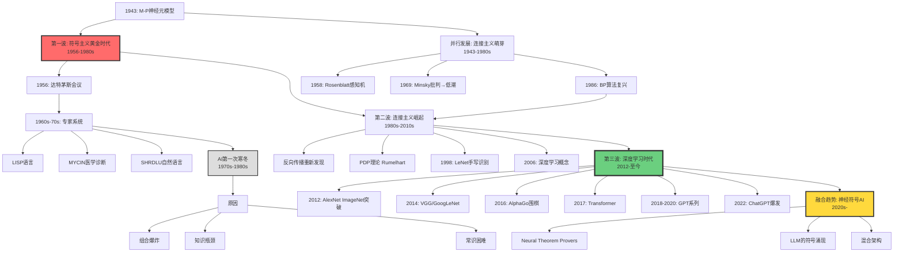
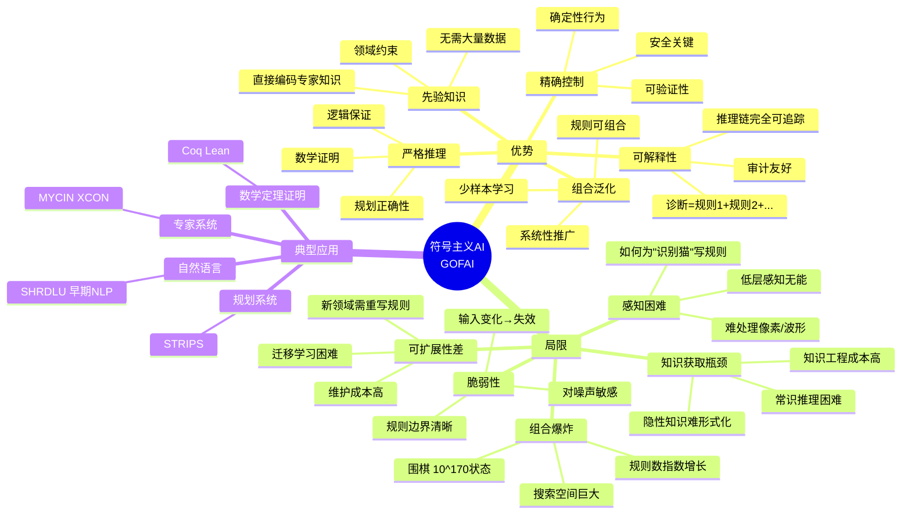
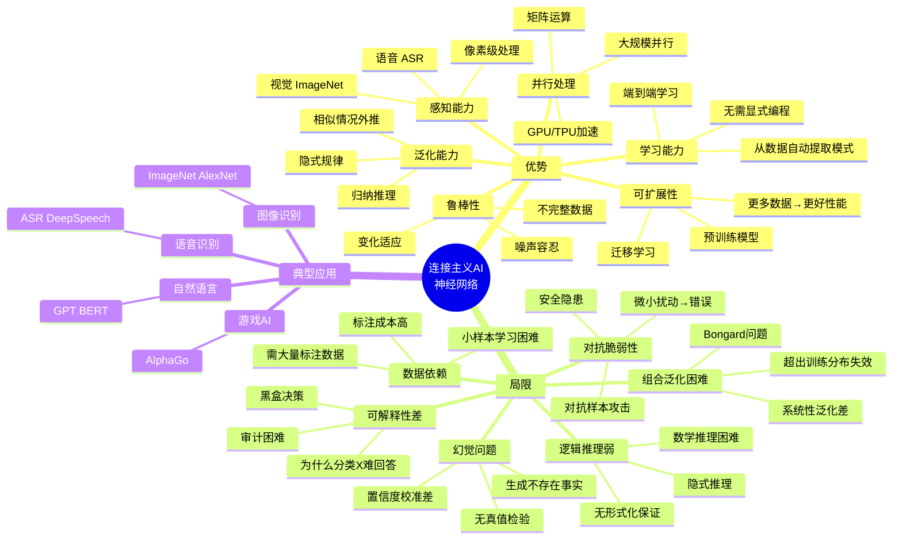
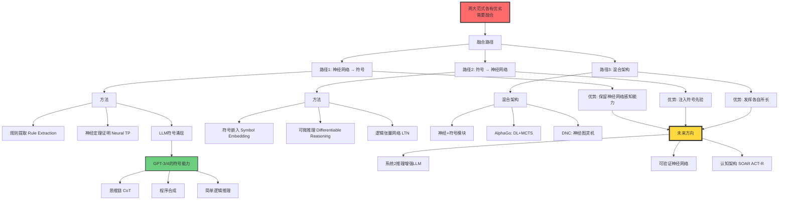

# 符号主义AI vs 连接主义AI（Symbolic AI vs Connectionist AI）

> **文档版本**: v1.0.0  
> **最后更新**: 2025-10-27  
> **文档规模**: 852行 | AI两大范式对比  
> **阅读建议**: 本文深入对比符号主义与连接主义AI的历史演进、核心原则和融合趋势

---

## 核心概念深度分析

<details>
<summary><b>🧠 点击展开：符号主义vs连接主义全景对比分析</b></summary>

本节提供AI两大范式的系统化深度对比，包括历史演进、哲学基础、核心原则、优势局限和融合路径。

### 1️⃣ 符号主义vs连接主义概念对比卡

**对比主题**: AI的两大根本范式——符号主义与连接主义

**🔹 核心哲学差异**:

| 维度 | 符号主义（Symbolic AI） | 连接主义（Connectionist AI） |
|------|----------------------|---------------------------|
| **智能本质** | 符号操作 + 逻辑推理 | 神经元连接 + 学习 |
| **哲学基础** | 理性主义（Rationalism） | 经验主义（Empiricism） |
| **认知模型** | 语言思维（Language of Thought） | 分布式表征（Distributed Representation） |
| **物理隐喻** | 数字计算机 | 人脑神经网络 |

**🔹 物理符号系统假设 vs 分布式表征假设**:

**符号主义核心假设**（Newell & Simon, 1976）:
$$
\text{智能} = \text{符号系统} \quad \Leftrightarrow \quad \text{物理符号系统具有智能所必需和充分的手段}
$$

**连接主义核心假设**（Rumelhart & McClelland, 1986）:
$$
\text{智能} = \text{大量简单单元的连接} + \text{学习} \quad \Rightarrow \quad \text{认知即模式}
$$

**🔹 形式化对比**:

| 特征 | 符号主义 | 连接主义 |
|------|---------|---------|
| **表示** | 离散符号 $s \in \Sigma$ | 连续向量 $\mathbf{x} \in \mathbb{R}^d$ |
| **操作** | 规则 $r: s_1 \rightarrow s_2$ | 函数 $f_\theta: \mathbb{R}^d \rightarrow \mathbb{R}^{d'}$ |
| **学习** | 人工编码规则 | 数据驱动 $\theta^* = \arg\min_\theta \mathcal{L}$ |
| **推理** | 演绎 $P \wedge Q \vdash R$ | 模式匹配 $\cos(\mathbf{x}, \mathbf{y})$ |
| **状态空间** | 离散可数 | 连续高维 |

**属性维度表**:

| 维度 | 符号主义 | 连接主义 | 评价 |
|------|---------|---------|------|
| **诞生时间** | 1956（达特茅斯会议） | 1943（M-P模型）→1986（BP复兴） | 符号主义先行 |
| **黄金时代** | 1956-1980s | 2012-至今 | 范式轮替 |
| **代表系统** | LISP、Prolog、专家系统 | 深度学习、Transformer | 各有千秋 |
| **可解释性** | ✅ 高（推理链） | ❌ 低（黑盒） | 符号优势 |
| **泛化能力** | ⚠️ 脆弱（规则边界） | ✅ 强（统计归纳） | 连接优势 |
| **数据需求** | 低（先验规则） | 高（大规模数据） | 符号优势 |
| **感知能力** | ❌ 弱（难处理像素） | ✅ 强（视觉/语音） | 连接优势 |
| **逻辑推理** | ✅ 强（形式化） | ⚠️ 弱（隐式） | 符号优势 |
| **并行性** | ❌ 低（串行） | ✅ 高（天然并行） | 连接优势 |

---

### 2️⃣ AI范式演进全景图（1943-2025）



---

### 3️⃣ 符号主义vs连接主义九维深度对比矩阵

| 对比维度 | 符号主义（Symbolic AI） | 连接主义（Connectionist AI） | 胜者 | 说明 |
|---------|----------------------|----------------------------|------|------|
| **🧩 知识表示** | 离散符号（逻辑、规则、框架） | 连续向量（权重、激活值） | ⚖️ | 符号可读，向量鲁棒 |
| **📚 知识获取** | 人工编写规则（知识工程） | 从数据学习（自动提取） | 🟢 连接 | 扩展性 |
| **🔍 推理机制** | 演绎推理（逻辑链） | 统计推理（相似度） | 🔴 符号 | 精确性 |
| **🎯 可解释性** | 高（完全可追踪） | 低（黑盒） | 🔴 符号 | 透明度 |
| **🎨 感知能力** | 弱（难处理原始数据） | 强（视觉/语音） | 🟢 连接 | 模式识别 |
| **📊 数据需求** | 低（先验规则） | 高（大规模数据） | 🔴 符号 | 小样本 |
| **🔧 鲁棒性** | 脆弱（噪声敏感） | 鲁棒（噪声容忍） | 🟢 连接 | 容错性 |
| **⚡ 并行性** | 低（串行规则） | 高（天然并行） | 🟢 连接 | 计算效率 |
| **🎓 泛化方式** | 演绎泛化（规则应用） | 归纳泛化（模式外推） | ⚖️ | 不同机制 |

**胜负统计**: 符号主义 3胜 | 连接主义 5胜 | 平局 2

**趋势**: 连接主义在工程实践中占优，但符号主义在理论保证上不可或缺。

---

### 4️⃣ 符号主义优势-局限思维导图



---

### 5️⃣ 连接主义优势-局限思维导图



---

### 6️⃣ 两大阵营历史辩论全景

| 辩论 | 时间 | 符号主义阵营 | 连接主义阵营 | 结果 |
|------|------|------------|------------|------|
| **Perceptrons之争** | 1960s-1980s | Minsky & Papert: 感知机无法学习XOR | Rosenblatt: 单层感知机 | 符号主义胜，神经网络低潮 |
| **PDP复兴** | 1986 | 专家系统瓶颈 | Rumelhart: 反向传播+PDP理论 | 连接主义复兴 |
| **中文房间** | 1980 | Searle: 语法≠语义，AI无理解 | - | 哲学争论，无定论 |
| **Chomsky vs 统计** | 2000s-至今 | Chomsky: 统计方法无语言学洞察 | 深度学习实践成功 | 工程上连接主义胜 |
| **AlphaGo围棋** | 2016 | 规则搜索+蒙特卡洛 | 深度强化学习 | 混合系统，连接主义主导 |
| **GPT突破** | 2018-至今 | 逻辑推理仍困难 | 语言理解/生成卓越 | 连接主义优势，但符号推理仍需 |

**核心争论点**:
1. **理解vs模拟**: AI是真理解还是仅模拟？（Searle中文房间）
2. **先验vs经验**: 先天结构 vs 后天学习？（Chomsky vs Connectionism）
3. **符号vs子符号**: 认知是符号操作还是分布式激活？
4. **推理vs模式**: 逻辑推理 vs 统计模式哪个更根本？

---

### 7️⃣ 神经符号融合路径全景



---

### 8️⃣ 任务适配决策矩阵

| 任务特征 | 推荐范式 | 原因 | 典型示例 |
|---------|---------|------|---------|
| **精确逻辑推理** | 🔴 符号主义 | 需要形式化保证 | 数学定理证明（Coq） |
| **感知任务** | 🟢 连接主义 | 模式识别优势 | 图像分类（ResNet） |
| **小样本学习** | 🔴 符号主义 | 利用先验规则 | 专家系统诊断 |
| **大规模数据** | 🟢 连接主义 | 自动学习模式 | 语言模型（GPT） |
| **可解释性要求高** | 🔴 符号主义 | 推理链可追踪 | 医疗决策支持 |
| **噪声鲁棒性** | 🟢 连接主义 | 容错能力强 | 语音识别（Whisper） |
| **组合泛化** | 🔴 符号主义 | 规则组合能力 | 规划（STRIPS） |
| **常识推理** | 🟡 混合 | 各有局限 | 视觉问答（需融合） |
| **游戏AI** | 🟡 混合 | 搜索+学习 | AlphaGo（MCTS+DL） |
| **自然语言** | 🟢 连接主义 | 统计归纳优势 | 机器翻译（Transformer） |

**选择原则**:
1. **有明确规则** → 符号主义
2. **只有数据无规则** → 连接主义
3. **需要两者** → 混合系统

---

### 9️⃣ 哲学基础对比与认知科学视角

| 哲学维度 | 符号主义 | 连接主义 | 认知科学对应 |
|---------|---------|---------|-------------|
| **认知理论** | 计算主义（Computationalism） | 联结主义（Connectionism） | Fodor vs Smolensky |
| **心智模型** | 语言思维（LOT） | 分布式表征 | Mentalese vs PDP |
| **知识论** | 理性主义 | 经验主义 | Descartes vs Hume |
| **学习观** | 先天结构+规则 | 后天学习+数据 | Chomsky vs Skinner |
| **推理方式** | 演绎（Deduction） | 归纳（Induction） | 逻辑 vs 统计 |
| **大脑类比** | 数字计算机 | 神经网络 | 冯诺依曼 vs 神经科学 |
| **表征粒度** | 符号级（Symbol-level） | 子符号级（Sub-symbolic） | 高层 vs 低层 |

**核心哲学问题**:
1. **中文房间**（Searle 1980）: 语法操作 ≠ 语义理解？
2. **框架问题**（McCarthy & Hayes 1969）: 如何表示常识？
3. **符号接地**（Harnad 1990）: 符号如何与感知连接？
4. **组合性**（Fodor & Pylyshyn 1988）: 神经网络能系统性组合吗？

---

### 🔟 核心洞察与未来方向

**五大核心定律**:

1. **互补定律**
   $$
   \text{最优AI} = \text{符号主义} \cup \text{连接主义} \quad \text{而非} \quad \text{符号} \vee \text{连接}
   $$
   - 两者互补而非对立
   - 融合优于单一范式

2. **No Free Lunch定律的体现**
   $$
   \nexists \text{ 万能范式}: \quad \forall \text{任务} \quad \text{皆优}
   $$
   - 符号主义：逻辑推理强，感知弱
   - 连接主义：感知强，推理弱

3. **范式轮替定律**
   $$
   \text{主流范式} = f(\text{数据可用性}, \text{计算能力}, \text{问题特性})
   $$
   - 1960s-1980s: 符号主义（数据少，逻辑问题）
   - 2012-至今: 连接主义（大数据，感知问题）

4. **LLM涌现定律**
   $$
   \text{规模} \uparrow \quad \Rightarrow \quad \text{符号能力涌现}
   $$
   - GPT-3/4展现初步符号推理
   - 但仍远弱于形式化系统

5. **融合必然性定律**
   $$
   \text{通用AI} \Rightarrow \text{神经符号融合}
   $$
   - 感知需要连接主义
   - 推理需要符号主义
   - AGI需要两者

**实践设计原则**:

```yaml
原则1_任务匹配:
  描述: 根据任务特性选择范式
  规则:
    - 精确逻辑 → 符号
    - 模糊模式 → 连接
    - 混合任务 → 融合

原则2_优势互补:
  描述: 符号提供结构，神经提供感知
  示例:
    - AlphaGo = MCTS(符号) + DL(连接)
    - VQA = CNN(感知) + 逻辑推理(符号)

原则3_可解释性权衡:
  描述: 高风险领域优先符号
  场景:
    - 医疗诊断 → 符号/混合
    - 自动驾驶 → 混合+验证
    - 推荐系统 → 连接即可

原则4_数据效率:
  描述: 小数据用符号，大数据用连接
  阈值:
    - <1K样本 → 符号/少样本学习
    - >100K样本 → 连接主义
    - 中间地带 → 混合

原则5_演化策略:
  描述: 从连接到符号的渐进
  路径:
    1. 神经网络训练（连接）
    2. 规则提取/符号涌现
    3. 符号精炼+验证
    4. 混合系统部署
```

**未来发展方向Checklist**:

```markdown
## 短期（2025-2027）
- [ ] LLM的符号推理增强（System 2思考）
- [ ] 神经定理证明器（Neural TP）
- [ ] 可微符号推理（Differentiable Logic）
- [ ] 混合架构标准化

## 中期（2027-2030）
- [ ] 通用神经符号架构
- [ ] 可验证神经网络
- [ ] 符号接地问题突破
- [ ] 认知架构整合（SOAR/ACT-R + DL）

## 长期（2030+）
- [ ] 通用人工智能（AGI）
- [ ] 完全可解释AI
- [ ] 人机协作认知系统
- [ ] 符号-连接统一理论
```

**终极洞察**:

> **"符号主义与连接主义不是敌人，而是AI的左右脑。符号主义提供逻辑骨架，连接主义提供感知血肉。未来的AI必然是神经符号的有机融合——不是1+1=2，而是1+1=10的协同涌现。"**

**历史经验**:
- ❌ 单一范式霸权（1960s符号，2010s神经）→ 局限性暴露
- ✅ 范式融合创新（AlphaGo, LLM+Tools）→ 突破性进展
- 🔮 未来趋势：神经符号AI（Neurosymbolic AI）成为主流

</details>

---

## 目录 | Table of Contents

- [符号主义AI vs 连接主义AI（Symbolic AI vs Connectionist AI）](#符号主义ai-vs-连接主义aisymbolic-ai-vs-connectionist-ai)
- [目录](#目录)
- [引言](#引言)
  - [核心问题](#核心问题)
  - [两大阵营](#两大阵营)
- [历史演进](#历史演进)
  - [1. 第一波：符号主义的黄金时代（1956-1980s）](#1-第一波符号主义的黄金时代1956-1980s)
    - [诞生](#诞生)
    - [AI第一次寒冬（1970s-1980s）](#ai第一次寒冬1970s-1980s)
  - [2. 并行发展：连接主义的萌芽（1943-1980s）](#2-并行发展连接主义的萌芽1943-1980s)
  - [3. 第二波：连接主义的崛起（1980s-2010s）](#3-第二波连接主义的崛起1980s-2010s)
  - [4. 第三波：深度学习时代（2012-现在）](#4-第三波深度学习时代2012-现在)
- [符号主义AI](#符号主义ai)
  - [1. 核心原则](#1-核心原则)
  - [2. 表示](#2-表示)
  - [3. 推理](#3-推理)
  - [4. 代表系统](#4-代表系统)
    - [LISP](#lisp)
    - [专家系统](#专家系统)
- [连接主义AI](#连接主义ai)
  - [1. 核心原则1](#1-核心原则1)
  - [2. 表示1](#2-表示1)
  - [3. 学习](#3-学习)
  - [4. 代表架构](#4-代表架构)
    - [多层感知机（MLP）](#多层感知机mlp)
    - [卷积神经网络（CNN）](#卷积神经网络cnn)
    - [循环神经网络（RNN）](#循环神经网络rnn)
    - [Transformer](#transformer)
- [核心对比](#核心对比)
  - [1. 知识表示](#1-知识表示)
  - [2. 学习 vs 编程](#2-学习-vs-编程)
  - [3. 推理1](#3-推理1)
  - [4. 计算性质](#4-计算性质)
  - [5. 优势领域](#5-优势领域)
- [优势与局限](#优势与局限)
  - [符号主义的优势](#符号主义的优势)
  - [符号主义的局限](#符号主义的局限)
  - [连接主义的优势](#连接主义的优势)
  - [连接主义的局限](#连接主义的局限)
- [两大阵营的辩论](#两大阵营的辩论)
  - [1. Minsky vs Rosenblatt（1960s-1980s）](#1-minsky-vs-rosenblatt1960s-1980s)
  - [2. Searle的中文房间论证（1980）](#2-searle的中文房间论证1980)
  - [3. Chomsky vs 统计方法（2000s-现在）](#3-chomsky-vs-统计方法2000s-现在)
  - [4. 理论 vs 实践](#4-理论-vs-实践)
- [融合趋势](#融合趋势)
  - [1. 神经符号AI（Neurosymbolic AI）](#1-神经符号aineurosymbolic-ai)
  - [2. 代表性工作](#2-代表性工作)
    - [Neural Theorem Provers](#neural-theorem-provers)
    - [Differentiable Neural Computers (DNC)](#differentiable-neural-computers-dnc)
    - [Logic Tensor Networks](#logic-tensor-networks)
  - [3. 大语言模型的符号涌现](#3-大语言模型的符号涌现)
- [总结](#总结)
  - [核心要点](#核心要点)
  - [哲学反思](#哲学反思)
  - [未来方向](#未来方向)
- [参考文献](#参考文献)
  - [综述](#综述)
  - [历史文献](#历史文献)
  - [经典论文](#经典论文)
  - [现代深度学习](#现代深度学习)
  - [哲学](#哲学)
  - [神经符号融合](#神经符号融合)
  - [其他参考](#其他参考)

---

## 引言

**符号主义AI vs 连接主义AI** 是人工智能历史上最根本的范式之争。

### 核心问题

> **智能的本质是什么？是符号操作，还是神经网络连接？**

### 两大阵营

**符号主义**（Symbolic AI / GOFAI - Good Old-Fashioned AI）：

- 智能 = 符号操作 + 逻辑推理
- 代表：专家系统、知识库、规则引擎

**连接主义**（Connectionist AI / Neural Networks）：

- 智能 = 大量简单单元的连接 + 学习
- 代表：神经网络、深度学习

**参考文献**：

- [Wikipedia: Symbolic AI](https://en.wikipedia.org/wiki/Symbolic_artificial_intelligence)
- [Wikipedia: Connectionism](https://en.wikipedia.org/wiki/Connectionism)

---

## 历史演进

### 1. 第一波：符号主义的黄金时代（1956-1980s）

#### 诞生

**1956年达特茅斯会议**：

- AI作为学科诞生
- 主导思想：符号操作

**代表人物**：

- Allen Newell & Herbert Simon：逻辑理论家、通用问题求解器
- John McCarthy：LISP语言、专家系统
- Marvin Minsky：框架理论

**成就**：

- SHRDLU（Winograd, 1972）：自然语言理解
- MYCIN（1970s）：医学诊断专家系统
- R1/XCON（1980）：计算机配置专家系统

**参考文献**：

- [Wikipedia: Dartmouth Conference](https://en.wikipedia.org/wiki/Dartmouth_workshop)
- [Wikipedia: Expert System](https://en.wikipedia.org/wiki/Expert_system)

#### AI第一次寒冬（1970s-1980s）

**原因**：

- 组合爆炸
- 知识获取瓶颈
- 常识推理困难

### 2. 并行发展：连接主义的萌芽（1943-1980s）

**早期工作**：

- McCulloch & Pitts (1943)：神经元数学模型
- Rosenblatt (1958)：感知机
- Rumelhart et al. (1986)：反向传播算法

**《Perceptrons》（Minsky & Papert, 1969）**：

- 批判感知机局限性（如无法学习XOR）
- 导致神经网络研究低潮

**参考文献**：

- [Wikipedia: Perceptron](https://en.wikipedia.org/wiki/Perceptron)
- [Wikipedia: Backpropagation](https://en.wikipedia.org/wiki/Backpropagation)

### 3. 第二波：连接主义的崛起（1980s-2010s）

**复兴**：

- 反向传播的重新发现（1986）
- 《Parallel Distributed Processing》（Rumelhart & McClelland, 1986）

**成就**：

- LeNet（1998）：手写数字识别
- 深度学习崛起（2006-2012）
- ImageNet突破（AlexNet, 2012）

**参考文献**：

- [Rumelhart & McClelland, 1986](https://mitpress.mit.edu/9780262680530/parallel-distributed-processing-volume-1/) - PDP Book
- [Krizhevsky et al., 2012](https://papers.nips.cc/paper/2012/hash/c399862d3b9d6b76c8436e924a68c45b-Abstract.html) - AlexNet

### 4. 第三波：深度学习时代（2012-现在）

**标志性成就**：

- AlexNet (2012)：ImageNet
- AlphaGo (2016)：围棋
- GPT-3 (2020)：语言模型
- ChatGPT (2022)：对话系统

**范式主导**：

连接主义（深度学习）成为AI主流。

---

## 符号主义AI

### 1. 核心原则

**物理符号系统假设**（Physical Symbol System Hypothesis, Newell & Simon, 1976）：

> **"物理符号系统具有智能行为所必需和充分的手段。"**

**要素**：

- **符号**：离散的表示单元
- **符号结构**：符号的组合（如列表、树）
- **符号操作**：规则驱动的变换

**参考文献**：

- [Newell & Simon, 1976](https://dl.acm.org/doi/10.1145/360018.360022) - Computer Science as Empirical Inquiry

### 2. 表示

**知识表示**：

1. **逻辑**：

    ```prolog
    human(socrates).
    mortal(X) :- human(X).
    ?- mortal(socrates).  % true
    ```

2. **语义网络**：

    ```text
    [Socrates] --is-a--> [Human] --is-a--> [Mortal]
    ```

3. **框架**（Minsky）：

    ```text
    Frame: Person
    Slots:
        - name: String
        - age: Integer
        - occupation: Concept
    ```

4. **产生式规则**：

    ```text
    IF temperature > 38°C AND cough
    THEN diagnosis = flu
    ```

**参考文献**：

- [Wikipedia: Knowledge Representation](https://en.wikipedia.org/wiki/Knowledge_representation_and_reasoning)

### 3. 推理

**推理类型**：

1. **演绎推理**（Deductive）：

    ```text
    前提：所有人都会死（一般）
    前提：苏格拉底是人（特殊）
    结论：苏格拉底会死（必然）
    ```

2. **归纳推理**（Inductive）：

    ```text
    观察：天鹅1是白色
    观察：天鹅2是白色
    ...
    结论：所有天鹅都是白色（可能）
    ```

3. **溯因推理**（Abductive）：

    ```text
    观察：草地湿了
    假设：可能下雨了（最佳解释）
    ```

**推理引擎**：

- 前向链接（Forward Chaining）
- 后向链接（Backward Chaining）
- 分辨原理（Resolution）

**参考文献**：

- [Wikipedia: Inference Engine](https://en.wikipedia.org/wiki/Inference_engine)

### 4. 代表系统

#### LISP

**特点**：

- 符号处理语言
- 代码即数据（Homoiconicity）
- 递归

**例子**：

```lisp
(defun factorial (n)
(if (<= n 1)
    1
    (* n (factorial (- n 1)))))
```

#### 专家系统

**结构**：

```text
知识库（规则） + 推理引擎 → 结论 + 解释
```

**例子：MYCIN**:

```text
IF infection is primary-bacteremia
   AND site of culture is blood
   AND suspected portal of entry is GI tract
THEN evidence (0.7) that identity is bacteroides
```

**参考文献**：

- [Wikipedia: MYCIN](https://en.wikipedia.org/wiki/MYCIN)

---

## 连接主义AI

### 1. 核心原则1

**灵感来源**：

生物神经网络（大脑）。

**核心思想**：

> **智能涌现于大量简单处理单元（神经元）的连接和交互。**

**特点**：

- **分布式表示**：知识存储在连接权重中
- **并行处理**：许多神经元同时激活
- **学习**：通过调整权重学习

**参考文献**：

- [Wikipedia: Connectionism](https://en.wikipedia.org/wiki/Connectionism)

### 2. 表示1

**神经元**：

```text
y = σ(∑ᵢ wᵢxᵢ + b)
```

其中：

- xᵢ：输入
- wᵢ：权重（连接强度）
- b：偏置
- σ：激活函数（如Sigmoid、ReLU）

**表示示例**：

**符号主义**：

```text
cat = [concept: animal, has: fur, legs: 4, ...]
```

**连接主义**：

```text
cat = [0.8, -0.3, 0.5, ..., 0.2]  ∈ ℝ³⁰⁰
（高维向量，每个维度含义不明确）
```

### 3. 学习

**监督学习**：

```text
给定：(x, y) 训练对
目标：学习 f(x) ≈ y
方法：反向传播（调整权重）
```

**损失函数**：

```text
L = (1/m) ∑ᵢ (f(xᵢ) - yᵢ)²
```

**梯度下降**：

```text
w := w - η ∂L/∂w
```

**参考文献**：

- [Wikipedia: Supervised Learning](https://en.wikipedia.org/wiki/Supervised_learning)
- [Wikipedia: Gradient Descent](https://en.wikipedia.org/wiki/Gradient_descent)

### 4. 代表架构

#### 多层感知机（MLP）

```text
输入层 → 隐层1 → 隐层2 → ... → 输出层
```

#### 卷积神经网络（CNN）

**特点**：

- 局部连接
- 权重共享
- 平移不变性

**应用**：图像识别

**参考文献**：

- [LeCun et al., 1998](http://yann.lecun.com/exdb/publis/pdf/lecun-98.pdf) - LeNet

#### 循环神经网络（RNN）

**特点**：

- 处理序列数据
- 有记忆（隐状态）

**应用**：语言建模、机器翻译

#### Transformer

**特点**：

- 自注意力机制
- 并行处理
- 长距离依赖

**应用**：BERT、GPT

**参考文献**：

- [Vaswani et al., 2017](https://arxiv.org/abs/1706.03762) - Attention Is All You Need

---

## 核心对比

### 1. 知识表示

| 维度 | 符号主义 | 连接主义 |
|------|---------|---------|
| **形式** | 离散符号（逻辑、规则） | 连续向量（权重、激活） |
| **可读性** | 高（人可理解） | 低（黑盒） |
| **组合性** | 强（结构化） | 弱（隐式） |
| **鲁棒性** | 脆弱（对噪声敏感） | 鲁棒（对噪声容忍） |

### 2. 学习 vs 编程

| 维度 | 符号主义 | 连接主义 |
|------|---------|---------|
| **知识获取** | 人工编写规则 | 从数据中学习 |
| **可扩展性** | 困难（知识工程瓶颈） | 容易（更多数据） |
| **先验知识** | 必需 | 可选 |
| **泛化** | 演绎泛化（规则应用） | 归纳泛化（模式识别） |

### 3. 推理1

| 维度 | 符号主义 | 连接主义 |
|------|---------|---------|
| **类型** | 演绎推理（逻辑） | 统计推理（相似度） |
| **过程** | 串行、确定性 | 并行、概率性 |
| **可解释性** | 高（推理链） | 低（激活模式） |
| **常识推理** | 困难（需显式编码） | 隐式（嵌入在权重中） |

### 4. 计算性质

| 维度 | 符号主义 | 连接主义 |
|------|---------|---------|
| **计算模型** | 图灵机、规则系统 | 神经网络、连续函数 |
| **状态空间** | 离散、可数 | 连续、高维 |
| **复杂度** | 可分析（算法复杂度） | 难分析（黑盒） |
| **并行性** | 低（串行） | 高（天然并行） |

### 5. 优势领域

| 符号主义擅长 | 连接主义擅长 |
|------------|-------------|
| ✅ 逻辑推理 | ✅ 感知任务（视觉、语音） |
| ✅ 数学证明 | ✅ 模式识别 |
| ✅ 规划 | ✅ 噪声数据处理 |
| ✅ 可解释性 | ✅ 泛化到相似情况 |
| ✅ 少样本学习（给定规则） | ✅ 大规模数据学习 |

---

## 优势与局限

### 符号主义的优势

1. **可解释性**：

    ```text
    推理过程完全可追踪
    诊断 = 规则1 + 规则2 + ...
    ```

2. **先验知识利用**：

    可以直接编码领域专家知识。

3. **严格推理**：

    保证逻辑正确性（如果规则正确）。

4. **组合泛化**：

    新规则可以与旧规则组合。

### 符号主义的局限

1. **知识获取瓶颈**：

    ```text
    问题：如何将专家知识形式化？
    难点：隐性知识、常识
    ```

2. **脆弱性**：

    ```text
    鲁棒性差：输入稍有不同 → 规则不适用
    ```

3. **组合爆炸**：

    ```text
    规则数量指数增长
    例：围棋的可能状态 ≈ 10¹⁷⁰
    ```

4. **感知困难**：

    ```text
    如何为"识别猫"写规则？
    难以处理原始感知数据（像素、波形）
    ```

### 连接主义的优势

1. **学习能力**：

    ```text
    从数据中自动提取模式
    无需显式编程
    ```

2. **鲁棒性**：

    ```text
    对噪声、变化、不完整数据容忍
    ```

3. **感知能力**：

    ```text
    擅长视觉、语音等低层感知任务
    ```

4. **并行处理**：

    ```text
    可以高效利用GPU/TPU
    ```

### 连接主义的局限

1. **可解释性差**：

    ```text
    决策过程不透明
    "为什么这样分类？" → 难以回答
    ```

2. **数据依赖**：

    ```text
    需要大量标注数据
    小样本学习困难
    ```

3. **逻辑推理弱**：

    ```text
    难以进行多步推理
    难以保证逻辑一致性
    ```

4. **知识迁移困难**：

    ```text
    难以明确提取和复用知识
    ```

---

## 两大阵营的辩论

### 1. Minsky vs Rosenblatt（1960s-1980s）

**Minsky的批评**（《Perceptrons》，1969）：

- 单层感知机无法学习XOR
- 推广质疑多层网络

**影响**：

导致神经网络研究低潮（"AI寒冬"）。

**历史反转**：

反向传播（1986）解决了多层网络训练问题。

### 2. Searle的中文房间论证（1980）

**论证**：

> **即使系统能正确处理中文（符号操作），也不意味着它"理解"中文。**

**针对**：

强AI（符号操作 = 理解）。

**连接主义回应**：

也许理解不在单个符号，而在整个网络的激活模式。

**参考文献**：

- [Wikipedia: Chinese Room](https://en.wikipedia.org/wiki/Chinese_room)

### 3. Chomsky vs 统计方法（2000s-现在）

**Chomsky的立场**：

- 语言有深层结构（普遍语法）
- 纯统计方法无法捕捉语言本质
- 批评大语言模型"只是统计鹦鹉"

**深度学习阵营**：

- GPT等模型展示了惊人的语言能力
- "也许统计就够了"

**参考文献**：

- [Chomsky, 2023](https://www.nytimes.com/2023/03/08/opinion/noam-chomsky-chatgpt-ai.html) - The False Promise of ChatGPT

### 4. 理论 vs 实践

**符号主义**：

- 理论优美（逻辑、形式化）
- 实践受限（知识瓶颈）

**连接主义**：

- 理论不完善（黑盒、缺乏数学理论）
- 实践成功（ImageNet、AlphaGo、GPT）

---

## 融合趋势

### 1. 神经符号AI（Neurosymbolic AI）

**目标**：

结合符号主义的推理和连接主义的学习。

**方法**：

1. **神经网络 + 逻辑规则**：

    ```text
    神经网络提取特征 → 符号推理引擎 → 结论
    ```

2. **可微分推理**：

    将逻辑操作转换为可微分操作，集成到神经网络。

3. **知识图谱嵌入**：

    ```text
    符号知识（三元组） → 嵌入向量 → 神经网络
    ```

**参考文献**：

- [Wikipedia: Neurosymbolic AI](https://en.wikipedia.org/wiki/Neurosymbolic_AI)

### 2. 代表性工作

#### Neural Theorem Provers

**目标**：

用神经网络辅助定理证明。

**例子**：

- DeepMath（Google）
- GPT-f（OpenAI）

#### Differentiable Neural Computers (DNC)

**思想**：

神经网络 + 可读写外部存储。

**参考文献**：

- [Graves et al., 2016](https://www.nature.com/articles/nature20101) - Hybrid Computing using a Neural Network with Dynamic External Memory

#### Logic Tensor Networks

**思想**：

将逻辑公式嵌入到张量空间。

**参考文献**：

- [Serafini & Garcez, 2016](https://arxiv.org/abs/1606.04422) - Logic Tensor Networks

### 3. 大语言模型的符号涌现

**观察**：

GPT等模型展示了某种"符号操作"能力：

- 算术
- 推理
- 代码生成

**争议**：

这是真正的符号推理，还是统计模式匹配？

**Chain-of-Thought Prompting**：

```text
提示："Let's think step by step"
效果：模型生成推理过程，提高准确性
```

**参考文献**：

- [Wei et al., 2022](https://arxiv.org/abs/2201.11903) - Chain-of-Thought Prompting

---

## 总结

### 核心要点

1. **两大范式**：
   - 符号主义：智能 = 符号操作 + 推理
   - 连接主义：智能 = 神经连接 + 学习

2. **历史演进**：
   - 第一波：符号主义主导（1956-1980s）
   - 第二波：连接主义复兴（1980s-2010s）
   - 第三波：深度学习时代（2012-现在）

3. **关键对比**：
   - 表示：离散符号 vs 连续向量
   - 知识：编程 vs 学习
   - 推理：演绎 vs 统计
   - 可解释性：高 vs 低

4. **优势互补**：
   - 符号：推理、可解释、先验知识
   - 连接：感知、学习、鲁棒性

5. **融合趋势**：
   - 神经符号AI
   - 可微分推理
   - 知识增强神经网络

### 哲学反思

> **也许智能本身就是多面的：既需要符号操作（System 2，慢思考），也需要模式识别（System 1，快思考）。**
> **符号主义 vs 连接主义的争论，本质上是理性主义 vs 经验主义在AI领域的重演。**

### 未来方向

1. **继续融合**：更好的神经符号集成
2. **可解释AI**：连接主义的可解释性提升
3. **小样本学习**：连接主义如何利用先验知识
4. **逻辑推理**：神经网络的推理能力增强

---

## 参考文献

### 综述

1. [Wikipedia: Symbolic AI](https://en.wikipedia.org/wiki/Symbolic_artificial_intelligence)
2. [Wikipedia: Connectionism](https://en.wikipedia.org/wiki/Connectionism)
3. [Wikipedia: Neurosymbolic AI](https://en.wikipedia.org/wiki/Neurosymbolic_AI)

### 历史文献

1. [Newell & Simon, 1976](https://dl.acm.org/doi/10.1145/360018.360022) - Computer Science as Empirical Inquiry: Symbols and Search
2. [Minsky & Papert, 1969](https://mitpress.mit.edu/9780262630221/perceptrons/) - Perceptrons
3. [Rumelhart & McClelland, 1986](https://mitpress.mit.edu/9780262680530/parallel-distributed-processing-volume-1/) - Parallel Distributed Processing

### 经典论文

1. [McCulloch & Pitts, 1943](https://link.springer.com/article/10.1007/BF02478259) - A Logical Calculus
2. [Rosenblatt, 1958](https://psycnet.apa.org/record/1959-09865-001) - The Perceptron
3. [Rumelhart et al., 1986](https://www.nature.com/articles/323533a0) - Learning Representations by Back-Propagating Errors

### 现代深度学习

1. [Krizhevsky et al., 2012](https://papers.nips.cc/paper/2012/hash/c399862d3b9d6b76c8436e924a68c45b-Abstract.html) - AlexNet
2. [LeCun et al., 1998](http://yann.lecun.com/exdb/publis/pdf/lecun-98.pdf) - Gradient-Based Learning Applied to Document Recognition
3. [Vaswani et al., 2017](https://arxiv.org/abs/1706.03762) - Attention Is All You Need

### 哲学

1. [Wikipedia: Chinese Room](https://en.wikipedia.org/wiki/Chinese_room)
2. [Chomsky, 2023](https://www.nytimes.com/2023/03/08/opinion/noam-chomsky-chatgpt-ai.html) - The False Promise of ChatGPT

### 神经符号融合

1. [Graves et al., 2016](https://www.nature.com/articles/nature20101) - Hybrid Computing using a Neural Network
2. [Serafini & Garcez, 2016](https://arxiv.org/abs/1606.04422) - Logic Tensor Networks
3. [Wei et al., 2022](https://arxiv.org/abs/2201.11903) - Chain-of-Thought Prompting

### 其他参考

1. [Wikipedia: Expert System](https://en.wikipedia.org/wiki/Expert_system)
2. [Wikipedia: Dartmouth Conference](https://en.wikipedia.org/wiki/Dartmouth_workshop)
3. [Wikipedia: Knowledge Representation](https://en.wikipedia.org/wiki/Knowledge_representation_and_reasoning)

---

*本文档系统阐述了符号主义AI与连接主义AI的核心区别、历史演进和融合趋势，为理解AI的两大基本范式提供了全面的理论框架。*
