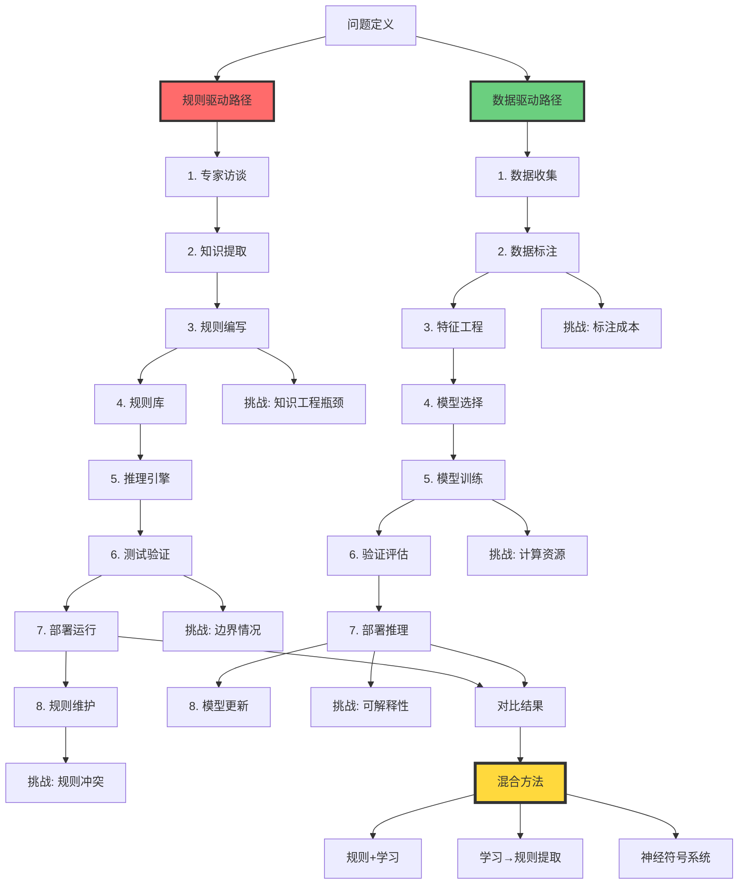
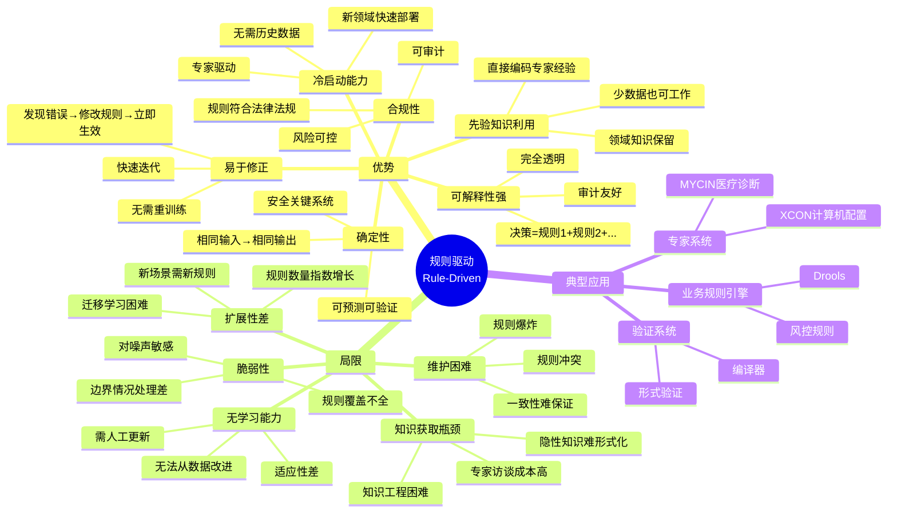
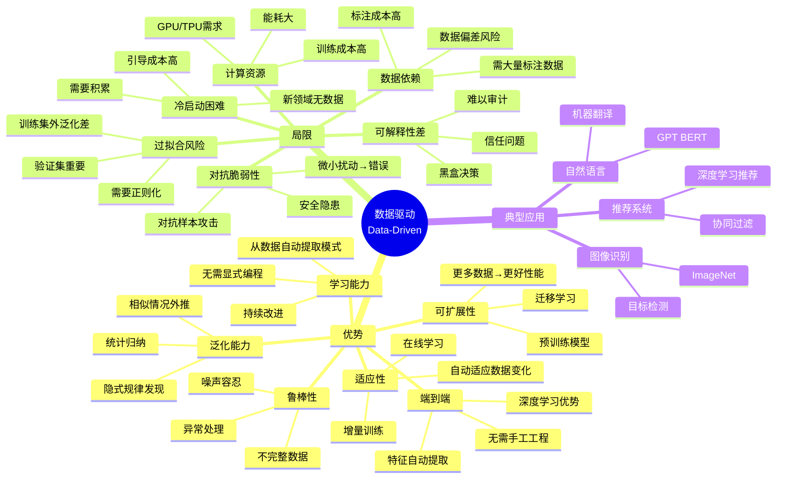
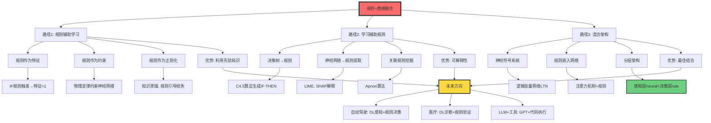
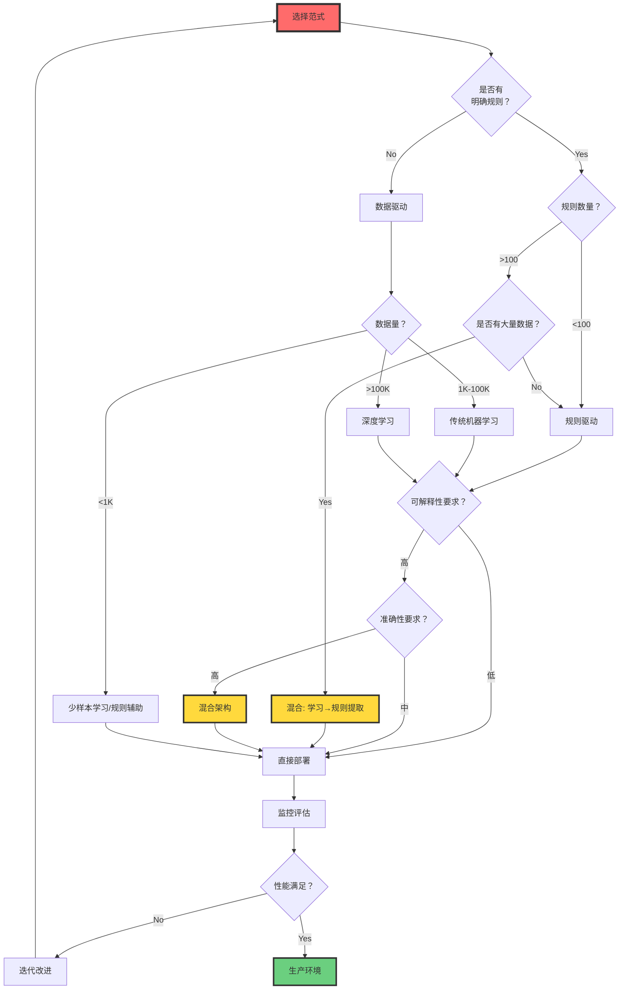

# 规则驱动 vs 数据驱动（Rule-Driven vs Data-Driven）

> **文档版本**: v1.0.0
> **最后更新**: 2025-10-27
> **文档规模**: 978行 | 规则驱动与数据驱动范式对比
> **阅读建议**: 本文对比规则驱动与数据驱动两大范式的原理、优缺点和融合方向

---

## 核心概念深度分析

<details>
<summary><b>⚖️ 点击展开：规则驱动vs数据驱动全景对比分析</b></summary>

本节提供规则驱动与数据驱动两大范式的系统化深度对比，包括知识来源、开发流程、性能特征、优势局限和融合方向。

### 1️⃣ 规则驱动vs数据驱动概念对比卡

**对比主题**: 规则驱动（Rule-Driven）vs 数据驱动（Data-Driven）

**🔹 核心思想对比**:

| 维度 | 规则驱动 | 数据驱动 |
|------|---------|---------|
| **核心流程** | 专家知识→规则→推理引擎→结果 | 数据→学习算法→模型→结果 |
| **知识来源** | 人类专家（先验） | 数据（后验） |
| **表达形式** | 显式规则 IF-THEN | 模型参数（权重） |
| **哲学基础** | 理性主义 | 经验主义 |

**🔹 形式化定义**:

**规则驱动**:
$$
f(x) = \begin{cases}
a_1 & \text{if } C_1(x) \\
a_2 & \text{if } C_2(x) \\
\vdots \\
a_n & \text{if } C_n(x)
\end{cases}
$$
其中 $C_i$ 是条件（规则前件），$a_i$ 是动作（规则后件）

**数据驱动**:
$$
\begin{align}
f_\theta(x) &= \text{model}(x; \theta) \\
\theta^* &= \arg\min_\theta \mathcal{L}(\theta; \mathcal{D})
\end{align}
$$
其中 $\theta$ 是模型参数，$\mathcal{D}$ 是训练数据

**🔹 知识表示对比**:

| 特征 | 规则驱动 | 数据驱动 |
|------|---------|---------|
| **表示空间** | 离散规则集 $\mathcal{R} = \{r_1, r_2, \ldots, r_n\}$ | 连续参数空间 $\theta \in \mathbb{R}^d$ |
| **知识编码** | 符号逻辑 | 数值向量 |
| **可读性** | 高（人类可理解） | 低（黑盒） |
| **获取成本** | 专家时间（高） | 标注成本（高） |

**属性维度表**:

| 维度 | 规则驱动 | 数据驱动 | 评价 |
|------|---------|---------|------|
| **诞生时间** | 1960s（专家系统） | 1950s理论→2010s实践 | 几乎同时 |
| **主流时期** | 1970s-1990s | 2012-至今 | 范式轮替 |
| **可解释性** | ✅ 高 | ❌ 低 | 规则优势 |
| **泛化能力** | ⚠️ 脆弱 | ✅ 强 | 数据优势 |
| **数据需求** | ✅ 低 | ❌ 高 | 规则优势 |
| **专家需求** | ❌ 高 | ✅ 低 | 数据优势 |
| **鲁棒性** | ❌ 弱（噪声敏感） | ✅ 强（噪声容忍） | 数据优势 |
| **冷启动** | ✅ 易 | ❌ 难 | 规则优势 |
| **可维护性** | ⚠️ 中（规则冲突） | ✅ 易（重训练） | 数据优势 |

---

### 2️⃣ 规则驱动vs数据驱动全生命周期对比



---

### 3️⃣ 规则驱动vs数据驱动十维深度对比矩阵

| 对比维度 | 规则驱动 | 数据驱动 | 胜者 | 适用场景 |
|---------|---------|---------|------|---------|
| **🧠 知识来源** | 人类专家（先验知识） | 数据（经验学习） | ⚖️ | 规则:小样本/专家领域, 数据:大数据 |
| **📝 可解释性** | 高（规则链可追踪） | 低（黑盒） | 🔴 规则 | 医疗、法律等高风险领域 |
| **🎯 准确性** | 取决于规则质量 | 取决于数据质量+量 | 🟢 数据 | 大数据场景 |
| **🔧 鲁棒性** | 脆弱（边界情况） | 鲁棒（噪声容忍） | 🟢 数据 | 真实世界噪声数据 |
| **💰 开发成本** | 专家时间（高） | 标注+计算（高） | ⚖️ | 不同资源约束 |
| **⚡ 冷启动** | 易（有规则即可） | 难（需要数据积累） | 🔴 规则 | 新领域/数据稀缺 |
| **🔄 可维护性** | 难（规则冲突） | 易（重训练） | 🟢 数据 | 快速迭代场景 |
| **📊 泛化能力** | 显式规则泛化 | 统计归纳泛化 | 🟢 数据 | 未见过的情况 |
| **⏱️ 响应时间** | 快（规则匹配） | 快（前向传播） | ⚖️ | 都可实时 |
| **🎓 学习能力** | 无（需人工更新） | 有（自动学习） | 🟢 数据 | 持续改进 |

**胜负统计**: 规则驱动 2胜 | 数据驱动 6胜 | 平局 2

**趋势**: 数据驱动在大数据时代占优，但规则驱动在可解释性和冷启动上不可替代。

---

### 4️⃣ 规则驱动优势-局限思维导图



---

### 5️⃣ 数据驱动优势-局限思维导图



---

### 6️⃣ 范式转换历史全景

| 时期 | 主流范式 | 代表成就 | 转换原因 | 标志事件 |
|------|---------|---------|---------|---------|
| **1960s-1970s** | 规则驱动萌芽 | LISP、Prolog | AI诞生，逻辑推理主导 | 1956达特茅斯会议 |
| **1970s-1990s** | 规则驱动黄金 | MYCIN、XCON专家系统 | 专家知识形式化 | 专家系统商业化 |
| **1990s** | 混合探索 | 决策树、SVM | 统计学习兴起 | - |
| **2000s** | 数据驱动崛起 | 谷歌搜索、推荐系统 | 互联网大数据 | PageRank算法 |
| **2012** | 深度学习突破 | AlexNet ImageNet | GPU+大数据+深度网络 | AlexNet ImageNet |
| **2016** | 数据驱动主导 | AlphaGo | 强化学习+深度学习 | AlphaGo战胜李世石 |
| **2018-至今** | 数据驱动统治 | GPT、BERT、ChatGPT | Transformer+海量数据 | GPT-3/ChatGPT |
| **2020s-未来** | 混合趋势 | 神经符号AI、LLM+Tools | 可解释性需求 | GPT-4+Code Interpreter |

**转换驱动力**:

1. **数据可用性**: 互联网→海量数据
2. **计算能力**: GPU/TPU→深度学习可行
3. **算法突破**: 反向传播、Transformer
4. **成本对比**: 标注数据 < 专家时间

---

### 7️⃣ 混合方法融合路径



---

### 8️⃣ 实践案例对比矩阵

| 应用领域 | 规则驱动方法 | 数据驱动方法 | 混合方法（实际采用） | 趋势 |
|---------|------------|------------|------------------|------|
| **垃圾邮件过滤** | 黑名单规则（早期） | 贝叶斯分类→深度学习 | 规则+ML（Gmail） | 数据驱动主导 |
| **自动驾驶** | 交通规则编码 | 端到端深度学习 | DL感知+规则决策 | 混合必然 |
| **医疗诊断** | MYCIN专家系统 | 深度学习图像诊断 | DL辅助+医生审核+规则验证 | 混合+人机协作 |
| **推荐系统** | 协同过滤规则 | 深度学习推荐 | DL召回+规则精排 | 混合优化 |
| **风控系统** | 规则引擎（主流） | 机器学习模型 | 规则筛选+ML打分 | 规则仍核心 |
| **编译器** | 语法规则（不变） | - | - | 纯规则 |
| **游戏AI** | 决策树规则 | 强化学习 | AlphaGo: DL+MCTS | 混合突破 |
| **客服对话** | 规则模板 | Seq2Seq→Transformer | LLM+知识库规则 | 数据驱动+检索 |

**关键洞察**:

- **纯规则**: 编译器等确定性任务
- **纯数据**: 图像识别等感知任务
- **混合**: 自动驾驶、医疗等高风险+复杂任务

---

### 9️⃣ 选择决策树



---

### 🔟 核心洞察与实践原则

**五大核心定律**:

1. **互补定律**
   $$
   \text{最优系统} = \text{规则} \cup \text{数据} \quad \text{而非} \quad \text{规则} \oplus \text{数据}
   $$
   - 规则提供结构，数据提供泛化
   - 融合优于单一

2. **数据规模定律**
   $$
   \text{范式选择} = \begin{cases}
   \text{规则驱动} & \text{if } |\mathcal{D}| < 1K \\
   \text{传统ML} & \text{if } 1K \leq |\mathcal{D}| < 100K \\
   \text{深度学习} & \text{if } |\mathcal{D}| \geq 100K
   \end{cases}
   $$

3. **可解释性权衡定律**
   $$
   \text{可解释性} \propto \frac{1}{\text{准确性}} \quad \text{（一般情况）}
   $$
   - 规则: 高解释性，中准确性
   - 深度学习: 低解释性，高准确性
   - 混合: 平衡点

4. **范式转换阈值定律**
   $$
   \text{转换条件}: \quad \frac{\text{数据成本}}{\text{专家成本}} < \alpha \quad \text{且} \quad |\mathcal{D}| > \beta
   $$
   - 2000s前: 专家便宜，数据贵 → 规则驱动
   - 2010s后: 数据便宜，专家贵 → 数据驱动

5. **混合必然性定律**
   $$
   \text{高风险系统} \Rightarrow \text{混合架构}
   $$
   - 自动驾驶、医疗、金融等
   - 数据提供能力，规则提供保证

**实践设计原则**:

```yaml
原则1_按场景选择:
  描述: 根据数据量、可解释性、风险选择范式
  规则:
    - 小数据+高解释 → 规则驱动
    - 大数据+低解释 → 数据驱动
    - 高风险 → 混合架构

原则2_渐进式迁移:
  描述: 从规则到数据的平滑过渡
  路径:
    1. 纯规则系统（冷启动）
    2. 规则+数据特征
    3. 数据主导+规则约束
    4. 纯数据+规则验证

原则3_可解释性保底:
  描述: 关键决策保留规则路径
  示例:
    - 自动驾驶: DL感知 + 规则决策
    - 医疗: DL辅助 + 医生+规则验证

原则4_持续学习:
  描述: 规则→数据→规则的闭环
  流程:
    1. 初始规则
    2. 数据学习改进
    3. 提取新规则
    4. 规则精炼迭代

原则5_人在回路:
  描述: 高风险场景人类审核
  必要性:
    - 数据偏差风险
    - 边界情况处理
    - 责任归属
```

**范式选择Checklist**:

```markdown
## 选择规则驱动的情况
- [ ] 有明确的领域规则
- [ ] 数据量很小（<1K样本）
- [ ] 需要100%可解释性
- [ ] 需要确定性行为
- [ ] 冷启动场景（新领域）
- [ ] 法律合规要求

## 选择数据驱动的情况
- [ ] 规则难以形式化
- [ ] 有大量标注数据（>100K）
- [ ] 可以容忍黑盒
- [ ] 需要从数据学习模式
- [ ] 感知任务（视觉/语音）
- [ ] 需要持续改进

## 选择混合方法的情况
- [ ] 高风险高价值场景
- [ ] 既需要性能又需要解释
- [ ] 有部分规则+部分数据
- [ ] 自动驾驶/医疗/金融
- [ ] 需要人机协作
- [ ] 合规+性能双要求
```

**终极洞察**:

> **"规则驱动是理性的先验，数据驱动是经验的后验。最优系统不是二选一，而是先验结构+后验学习的贝叶斯融合。未来属于'规则作为归纳偏置的数据驱动系统'。"**

**历史经验**:

- ❌ 单一范式霸权（1980s规则，2010s数据）→ 各自局限暴露
- ✅ 混合创新（AlphaGo, 自动驾驶）→ 突破性成果
- 🔮 未来: 规则提供可解释结构，数据提供泛化能力

**范式演进预测**:

- **短期（2025-2027）**: LLM+工具（GPT+代码执行）成为主流混合模式
- **中期（2027-2030）**: 神经符号架构标准化，规则嵌入神经网络
- **长期（2030+）**: 自学习规则系统，从数据自动提取可解释规则

</details>

---

## 📋 目录

- [规则驱动 vs 数据驱动（Rule-Driven vs Data-Driven）](#规则驱动-vs-数据驱动rule-driven-vs-data-driven)
  - [核心概念深度分析](#核心概念深度分析)
    - [1️⃣ 规则驱动vs数据驱动概念对比卡](#1️⃣-规则驱动vs数据驱动概念对比卡)
    - [2️⃣ 规则驱动vs数据驱动全生命周期对比](#2️⃣-规则驱动vs数据驱动全生命周期对比)
    - [3️⃣ 规则驱动vs数据驱动十维深度对比矩阵](#3️⃣-规则驱动vs数据驱动十维深度对比矩阵)
    - [4️⃣ 规则驱动优势-局限思维导图](#4️⃣-规则驱动优势-局限思维导图)
    - [5️⃣ 数据驱动优势-局限思维导图](#5️⃣-数据驱动优势-局限思维导图)
    - [6️⃣ 范式转换历史全景](#6️⃣-范式转换历史全景)
    - [7️⃣ 混合方法融合路径](#7️⃣-混合方法融合路径)
    - [8️⃣ 实践案例对比矩阵](#8️⃣-实践案例对比矩阵)
    - [9️⃣ 选择决策树](#9️⃣-选择决策树)
    - [🔟 核心洞察与实践原则](#-核心洞察与实践原则)
  - [📋 目录](#-目录)
  - [引言](#引言)
    - [核心问题](#核心问题)
    - [两大范式](#两大范式)
  - [规则驱动范式](#规则驱动范式)
    - [1. 基本思想](#1-基本思想)
    - [2. 规则表示](#2-规则表示)
      - [产生式规则（Production Rules）](#产生式规则production-rules)
      - [决策表（Decision Tables）](#决策表decision-tables)
      - [决策树](#决策树)
    - [3. 规则引擎](#3-规则引擎)
    - [4. 代表系统](#4-代表系统)
      - [专家系统](#专家系统)
      - [业务规则引擎](#业务规则引擎)
    - [5. 规则的来源](#5-规则的来源)
  - [数据驱动范式](#数据驱动范式)
    - [1. 基本思想1](#1-基本思想1)
    - [2. 学习范式](#2-学习范式)
      - [监督学习](#监督学习)
      - [无监督学习](#无监督学习)
      - [强化学习](#强化学习)
    - [3. 模型类型](#3-模型类型)
      - [决策树（从数据学习规则）](#决策树从数据学习规则)
      - [神经网络（黑盒模型）](#神经网络黑盒模型)
      - [统计模型](#统计模型)
    - [4. 代表系统1](#4-代表系统1)
      - [机器学习库](#机器学习库)
      - [深度学习框架](#深度学习框架)
    - [5. 数据的来源](#5-数据的来源)
  - [核心对比](#核心对比)
    - [1. 知识来源](#1-知识来源)
    - [2. 开发过程](#2-开发过程)
    - [3. 性能特征](#3-性能特征)
    - [4. 可维护性](#4-可维护性)
    - [5. 资源需求](#5-资源需求)
  - [优势与局限](#优势与局限)
    - [规则驱动的优势](#规则驱动的优势)
    - [规则驱动的局限](#规则驱动的局限)
    - [数据驱动的优势](#数据驱动的优势)
    - [数据驱动的局限](#数据驱动的局限)
  - [混合方法](#混合方法)
    - [1. 规则辅助学习](#1-规则辅助学习)
      - [规则作为特征](#规则作为特征)
      - [规则作为约束](#规则作为约束)
    - [2. 学习辅助规则](#2-学习辅助规则)
      - [决策树转规则](#决策树转规则)
      - [规则提取（Rule Extraction）](#规则提取rule-extraction)
    - [3. 混合架构](#3-混合架构)
      - [神经符号系统](#神经符号系统)
      - [规则嵌入神经网络](#规则嵌入神经网络)
  - [实践案例](#实践案例)
    - [1. 垃圾邮件过滤](#1-垃圾邮件过滤)
      - [规则驱动方法（早期）](#规则驱动方法早期)
      - [数据驱动方法（现代）](#数据驱动方法现代)
    - [2. 自动驾驶](#2-自动驾驶)
      - [规则驱动（传统方法）](#规则驱动传统方法)
      - [数据驱动（深度学习）](#数据驱动深度学习)
      - [混合方法（实际采用）](#混合方法实际采用)
    - [3. 医疗诊断](#3-医疗诊断)
      - [规则驱动（专家系统）](#规则驱动专家系统)
      - [数据驱动（深度学习）3](#数据驱动深度学习3)
      - [混合方法（趋势）](#混合方法趋势)
  - [范式转换](#范式转换)
    - [1. 为什么转向数据驱动？](#1-为什么转向数据驱动)
    - [2. 范式转换的标志事件](#2-范式转换的标志事件)
    - [3. 反思与平衡](#3-反思与平衡)
  - [总结](#总结)
    - [核心要点](#核心要点)
    - [选择指南](#选择指南)
    - [哲学反思](#哲学反思)
    - [未来方向](#未来方向)
  - [参考文献](#参考文献)
    - [综述](#综述)
    - [规则驱动](#规则驱动)
    - [数据驱动](#数据驱动)
    - [混合方法1](#混合方法1)
    - [实践案例1](#实践案例1)
    - [规则挖掘](#规则挖掘)
    - [工具](#工具)
  - [导航 | Navigation](#导航--navigation)
  - [相关主题 | Related Topics](#相关主题--related-topics)
    - [本章节](#本章节)
    - [相关章节](#相关章节)
    - [跨视角链接](#跨视角链接)

---

## 引言

**规则驱动 vs 数据驱动** 是计算机科学中两种根本不同的问题求解方法。

### 核心问题

> **如何让计算机完成任务？是告诉它规则，还是给它数据让它学习？**

### 两大范式

**规则驱动**（Rule-Driven / Knowledge-Based）：

```text
专家知识 → 规则 → 推理引擎 → 结果
```

**数据驱动**（Data-Driven / Learning-Based）：

```text
数据 → 学习算法 → 模型 → 结果
```

**参考文献**：

- [Wikipedia: Rule-Based System](https://en.wikipedia.org/wiki/Rule-based_system)
- [Wikipedia: Machine Learning](https://en.wikipedia.org/wiki/Machine_learning)

---

## 规则驱动范式

### 1. 基本思想

**核心**：

将问题求解知识显式编码为规则。

**形式**：

```text
IF 条件 THEN 动作
```

### 2. 规则表示

#### 产生式规则（Production Rules）

**例子（医疗诊断）**：

```text
IF 体温 > 38°C AND 咳嗽 = 是
THEN 诊断 = 流感 (置信度: 0.8)

IF 诊断 = 流感 AND 年龄 > 65
THEN 建议 = 紧急就医
```

#### 决策表（Decision Tables）

| 条件1 | 条件2 | 条件3 | 动作 |
|-------|-------|-------|------|
| T | T | F | 动作A |
| T | F | * | 动作B |
| F | * | * | 动作C |

#### 决策树

```text
              体温 > 38°C?
             /           \
           是              否
          /                 \
       咳嗽?              建议休息
      /    \
    是      否
   /          \
流感      感冒
```

**参考文献**：

- [Wikipedia: Production System](https://en.wikipedia.org/wiki/Production_system_(computer_science))

### 3. 规则引擎

**架构**：

```text
知识库（规则集）
    ↓
推理引擎（规则解释器）
    ↓
工作存储（事实）
    ↓
结果 + 解释
```

**推理策略**：

1. **前向链接**（Forward Chaining）：

    ```text
    从事实出发 → 应用规则 → 推导新事实 → ...
    数据驱动
    ```

2. **后向链接**（Backward Chaining）：

    ```text
    从目标出发 → 寻找支持规则 → 验证前提 → ...
    目标驱动
    ```

**冲突解决**：

当多个规则都适用时，如何选择？

- 优先级
- 最具体规则优先
- 最近使用规则优先

**参考文献**：

- [Wikipedia: Inference Engine](https://en.wikipedia.org/wiki/Inference_engine)

### 4. 代表系统

#### 专家系统

**MYCIN**（医疗诊断，1970s）：

```text
规则数：~600条
知识：传染病诊断
推理：后向链接
解释：可以解释推理链
```

**XCON/R1**（计算机配置，1980s）：

```text
规则数：~10,000条
任务：配置DEC计算机系统
成就：年省数百万美元
```

**参考文献**：

- [Wikipedia: MYCIN](https://en.wikipedia.org/wiki/MYCIN)

#### 业务规则引擎

**Drools**（现代规则引擎）：

```java
rule "VIP Customer Discount"
when
    $c : Customer( tier == "VIP" )
    $o : Order( customer == $c, total > 1000 )
then
    $o.setDiscount(0.15);
end
```

### 5. 规则的来源

**如何获得规则？**

1. **领域专家**：

    ```text
    专家访谈 → 知识工程师 → 形式化规则
    ```

2. **规则挖掘**（Rule Mining）：

    ```text
    从数据中自动提取规则
    例：关联规则挖掘（Apriori算法）
    ```

3. **决策树转换**：

    ```text
    决策树 → 规则集
    ```

**参考文献**：

- [Wikipedia: Association Rule Learning](https://en.wikipedia.org/wiki/Association_rule_learning)

---

## 数据驱动范式

### 1. 基本思想1

**核心**：

从数据中自动学习模式和规律。

**形式**：

```text
数据：D = {(x₁, y₁), ..., (xₙ, yₙ)}
目标：学习 f : X → Y
方法：最小化损失 L(f(x), y)
```

### 2. 学习范式

#### 监督学习

**给定**：

标注数据 (输入, 期望输出)

**学习**：

输入 → 输出的映射

**例子**：

- 图像分类：(图像, 类别标签)
- 语音识别：(音频, 文本)

#### 无监督学习

**给定**：

无标注数据

**学习**：

数据的内在结构

**例子**：

- 聚类
- 降维

#### 强化学习

**给定**：

环境交互 + 奖励信号

**学习**：

最优策略

**例子**：

- AlphaGo
- 机器人控制

**参考文献**：

- [Wikipedia: Supervised Learning](https://en.wikipedia.org/wiki/Supervised_learning)
- [Wikipedia: Unsupervised Learning](https://en.wikipedia.org/wiki/Unsupervised_learning)
- [Wikipedia: Reinforcement Learning](https://en.wikipedia.org/wiki/Reinforcement_learning)

### 3. 模型类型

#### 决策树（从数据学习规则）

```text
训练数据 → 决策树算法（ID3, C4.5, CART）→ 决策树
```

**特点**：

- 可解释（类似规则）
- 自动学习

#### 神经网络（黑盒模型）

```text
训练数据 → 反向传播 → 神经网络权重
```

**特点**：

- 强大表达能力
- 不可解释

#### 统计模型

**贝叶斯网络**：

```text
数据 → 学习条件概率 → 概率图模型
```

**支持向量机**：

```text
数据 → 学习最大间隔分类器 → SVM
```

### 4. 代表系统1

#### 机器学习库

**scikit-learn**（Python）：

```python
from sklearn.ensemble import RandomForestClassifier

# 训练
clf = RandomForestClassifier()
clf.fit(X_train, y_train)

# 预测
y_pred = clf.predict(X_test)
```

#### 深度学习框架

**TensorFlow / PyTorch**：

```python
import torch.nn as nn

# 定义模型
model = nn.Sequential(
    nn.Linear(784, 256),
    nn.ReLU(),
    nn.Linear(256, 10)
)

# 训练
for x, y in dataloader:
    loss = criterion(model(x), y)
    loss.backward()
    optimizer.step()
```

**参考文献**：

- [scikit-learn](https://scikit-learn.org/)
- [TensorFlow](https://www.tensorflow.org/)
- [PyTorch](https://pytorch.org/)

### 5. 数据的来源

**如何获得数据？**

1. **收集**：

   - 爬虫
   - 传感器
   - 用户行为日志

2. **标注**：

   - 人工标注（众包）
   - 自动标注（弱监督）

3. **增强**：

   - 数据增强（旋转、裁剪等）
   - 合成数据

---

## 核心对比

### 1. 知识来源

| 维度 | 规则驱动 | 数据驱动 |
|------|---------|---------|
| **知识来源** | 人类专家 | 数据 |
| **表达形式** | 显式规则 | 模型参数 |
| **获取方式** | 知识工程 | 机器学习 |
| **更新方式** | 手工修改规则 | 重新训练 |

### 2. 开发过程

| 阶段 | 规则驱动 | 数据驱动 |
|------|---------|---------|
| **1. 需求分析** | 需要 | 需要 |
| **2. 知识/数据获取** | 专家访谈、文档分析 | 数据收集、标注 |
| **3. 编码/训练** | 编写规则 | 训练模型 |
| **4. 测试** | 规则逻辑测试 | 验证集评估 |
| **5. 部署** | 规则引擎 | 模型推理 |
| **6. 维护** | 规则更新 | 模型重训练 |

### 3. 性能特征

| 维度 | 规则驱动 | 数据驱动 |
|------|---------|---------|
| **准确性** | 取决于规则质量 | 取决于数据质量和量 |
| **鲁棒性** | 脆弱（边界情况） | 鲁棒（噪声容忍） |
| **泛化** | 显式规则泛化 | 统计泛化 |
| **冷启动** | 易（有规则即可） | 难（需要数据） |

### 4. 可维护性

| 维度 | 规则驱动 | 数据驱动 |
|------|---------|---------|
| **可读性** | 高（规则可读） | 低（权重不可读） |
| **可调试** | 易（追踪规则链） | 难（黑盒） |
| **可扩展** | 难（规则冲突） | 易（更多数据） |
| **可解释** | 强（规则即解释） | 弱（需要后解释） |

### 5. 资源需求

| 资源 | 规则驱动 | 数据驱动 |
|------|---------|---------|
| **专家时间** | 高 | 低-中 |
| **标注成本** | 无-低 | 高 |
| **计算资源** | 低 | 高（训练） |
| **数据需求** | 低 | 高 |

---

## 优势与局限

### 规则驱动的优势

1. **可解释性强**：

    ```text
    决策 = 规则1 + 规则2 + ...
    完全透明
    ```

2. **先验知识利用**：

    ```text
    直接编码专家经验
    少数据也可工作
    ```

3. **确定性**：

    ```text
    相同输入 → 相同输出
    可预测、可验证
    ```

4. **易于修正**：

    ```text
    发现错误 → 修改规则 → 立即生效
    ```

### 规则驱动的局限

1. **知识获取瓶颈**：

    ```text
    专家难以表达隐性知识
    知识工程成本高
    ```

2. **规则维护困难**：

    ```text
    规则数量增加 → 冲突、冗余
    难以管理
    ```

3. **缺乏适应性**：

    ```text
    环境变化 → 规则需重写
    无法自动适应
    ```

4. **覆盖不完全**：

    ```text
    现实复杂 → 规则无法穷尽所有情况
    边界情况处理差
    ```

### 数据驱动的优势

1. **自动学习**：

    ```text
    数据 → 自动发现模式
    无需人工编程
    ```

2. **处理复杂模式**：

    ```text
    高维、非线性关系
    人类难以表达的模式
    ```

3. **自适应**：

    ```text
    环境变化 → 重新训练 → 适应新模式
    ```

4. **泛化能力**：

    ```text
    从例子中泛化到未见情况
    ```

### 数据驱动的局限

1. **数据依赖**：

    ```text
    需要大量标注数据
    数据质量决定模型质量
    ```

2. **黑盒问题**：

    ```text
    决策过程不透明
    难以理解"为什么"
    ```

3. **偏置风险**：

    ```text
    数据偏置 → 模型偏置
    公平性、歧视问题
    ```

4. **泛化局限**：

    ```text
    数据分布外的情况表现差
    无法推理到未见类型
    ```

---

## 混合方法

### 1. 规则辅助学习

**思想**：

用规则指导机器学习。

**方法**：

#### 规则作为特征

```python
# 手工特征工程
features = [
    rule1(x),  # 是否满足规则1
    rule2(x),  # 是否满足规则2
    ...
]
model.fit(features, y)
```

#### 规则作为约束

```text
学习目标 = 损失函数 + 规则一致性惩罚
```

**例子：知识蒸馏**-

```text
教师模型（规则系统） → 软标签 → 学生模型（神经网络）
```

### 2. 学习辅助规则

**思想**：

用机器学习提取规则。

**方法**：

#### 决策树转规则

```text
决策树 → 提取路径 → IF-THEN规则
```

#### 规则提取（Rule Extraction）

```text
训练神经网络 → 分析激活模式 → 提取规则
```

**例子：LIME**（Local Interpretable Model-Agnostic Explanations）

```text
黑盒模型 → 局部线性近似 → 可解释规则
```

**参考文献**：

- [Ribeiro et al., 2016](https://arxiv.org/abs/1602.04938) - "Why Should I Trust You?": Explaining the Predictions

### 3. 混合架构

#### 神经符号系统

```text
神经网络（感知） → 符号系统（推理） → 决策
```

**例子**：

- Neural Module Networks
- Differentiable Neural Computers

#### 规则嵌入神经网络

```text
规则 → 网络结构约束 → 训练
```

**例子**：

- Physics-Informed Neural Networks (PINNs)

**参考文献**：

- [Andreas et al., 2016](https://arxiv.org/abs/1511.02799) - Neural Module Networks

---

## 实践案例

### 1. 垃圾邮件过滤

#### 规则驱动方法（早期）

```text
规则：
- IF 包含 "免费中奖" THEN 垃圾邮件
- IF 发件人在黑名单 THEN 垃圾邮件
- IF 包含过多链接 THEN 垃圾邮件

问题：
- 规则易被规避（"免 费 中 奖"）
- 规则维护困难
```

#### 数据驱动方法（现代）

```text
数据：标注的邮件（垃圾/正常）
模型：朴素贝叶斯 / 神经网络
训练：学习垃圾邮件的统计特征

优势：
- 自动适应新的垃圾邮件策略
- 更高准确率
```

### 2. 自动驾驶

#### 规则驱动（传统方法）

```text
规则：
- IF 前方有障碍物 AND 距离 < 10m THEN 刹车
- IF 红灯 THEN 停车
- IF 车道偏离 THEN 转向修正

挑战：
- 现实情况复杂，规则难以穷尽
- 边界情况处理困难
```

#### 数据驱动（深度学习）

```text
数据：驾驶视频 + 人类驾驶动作
模型：端到端神经网络
输入：摄像头图像 → 输出：方向盘角度、油门、刹车

挑战：
- 需要海量数据
- 安全关键，黑盒不可接受
```

#### 混合方法（实际采用）

```text
感知：数据驱动（物体检测、语义分割）
规划：规则驱动（路径规划、决策逻辑）
控制：数据驱动（模型预测控制）

优势：结合两者之长
```

**参考文献**：

- [Bojarski et al., 2016](https://arxiv.org/abs/1604.07316) - End to End Learning for Self-Driving Cars

### 3. 医疗诊断

#### 规则驱动（专家系统）

```text
MYCIN：基于规则的传染病诊断
优势：可解释、医生信任
局限：知识获取困难、更新慢
```

#### 数据驱动（深度学习）3

```text
医学影像诊断（如肺癌检测）
数据：X光片 + 诊断结果
模型：CNN

优势：高准确率（甚至超越人类）
局限：黑盒、医生难以信任
```

#### 混合方法（趋势）

```text
深度学习 + 医学知识约束 + 可解释性方法
```

---

## 范式转换

### 1. 为什么转向数据驱动？

**数据爆炸**：

```text
互联网时代：海量数据可用
存储成本：指数下降
计算能力：GPU/TPU 崛起
```

**知识瓶颈**：

```text
规则系统：难以扩展
知识工程：成本高、周期长
```

**感知任务**：

```text
图像、语音：难以用规则描述
数据驱动：天然优势
```

### 2. 范式转换的标志事件

| 年份 | 事件 | 意义 |
|------|------|------|
| **2012** | ImageNet (AlexNet) | 深度学习突破 |
| **2016** | AlphaGo vs 李世石 | AI超越人类（复杂决策） |
| **2018** | BERT | 预训练语言模型 |
| **2020** | GPT-3 | 大规模语言模型 |
| **2022** | ChatGPT | AI进入大众应用 |

**参考文献**：

- [Krizhevsky et al., 2012](https://papers.nips.cc/paper/2012/hash/c399862d3b9d6b76c8436e924a68c45b-Abstract.html) - ImageNet Classification

### 3. 反思与平衡

**数据驱动不是万能的**：

1. **关键系统**：航空、医疗 → 需要可解释性
2. **小数据场景**：罕见病诊断 → 规则更有效
3. **因果推理**：需要领域知识
4. **伦理约束**：需要明确规则

**未来方向**：

```text
不是选择A或B，而是A+B
混合智能：规则驱动 ⊕ 数据驱动
```

---

## 总结

### 核心要点

1. **两大范式**：
   - 规则驱动：专家知识 → 规则 → 推理
   - 数据驱动：数据 → 学习 → 模型

2. **关键对比**：
   - 知识来源：人 vs 数据
   - 可解释性：强 vs 弱
   - 适应性：弱 vs 强
   - 数据需求：低 vs 高

3. **优势互补**：
   - 规则：可解释、确定性、先验知识
   - 数据：自适应、处理复杂模式

4. **混合方法**：
   - 规则辅助学习
   - 学习提取规则
   - 神经符号融合

5. **范式转换**：
   - 从规则驱动到数据驱动
   - 但不是完全替代
   - 趋向混合智能

### 选择指南

| 场景 | 推荐方法 | 原因 |
|------|---------|------|
| **关键安全系统** | 规则驱动 或 混合 | 可解释性、可验证性 |
| **大数据可用** | 数据驱动 | 自动学习模式 |
| **小数据/零样本** | 规则驱动 | 利用先验知识 |
| **感知任务** | 数据驱动 | 天然优势 |
| **推理任务** | 规则驱动 或 混合 | 逻辑推理 |
| **需要解释** | 规则驱动 或 可解释ML | 透明度 |

### 哲学反思

> **规则驱动体现理性主义：知识先于经验，演绎推理。**
> **数据驱动体现经验主义：经验产生知识，归纳学习。**
> **也许真正的智能需要两者：既有先验知识（规则），也能从经验中学习（数据）。**

### 未来方向

1. **可解释AI**：让数据驱动方法更透明
2. **小样本学习**：数据驱动如何利用先验
3. **因果推理**：结合规则和数据
4. **混合智能**：更好的规则-数据融合

---

## 参考文献

### 综述

1. [Wikipedia: Rule-Based System](https://en.wikipedia.org/wiki/Rule-based_system)
2. [Wikipedia: Machine Learning](https://en.wikipedia.org/wiki/Machine_learning)

### 规则驱动

1. [Wikipedia: Expert System](https://en.wikipedia.org/wiki/Expert_system)
2. [Wikipedia: MYCIN](https://en.wikipedia.org/wiki/MYCIN)
3. [Wikipedia: Production System](https://en.wikipedia.org/wiki/Production_system_(computer_science))
4. [Wikipedia: Inference Engine](https://en.wikipedia.org/wiki/Inference_engine)

### 数据驱动

1. [Wikipedia: Supervised Learning](https://en.wikipedia.org/wiki/Supervised_learning)
2. [Wikipedia: Unsupervised Learning](https://en.wikipedia.org/wiki/Unsupervised_learning)
3. [Wikipedia: Reinforcement Learning](https://en.wikipedia.org/wiki/Reinforcement_learning)

### 混合方法1

1. [Ribeiro et al., 2016](https://arxiv.org/abs/1602.04938) - "Why Should I Trust You?": Explaining the Predictions of Any Classifier
2. [Andreas et al., 2016](https://arxiv.org/abs/1511.02799) - Neural Module Networks: Deep Learning for Structured Domains

### 实践案例1

1. [Bojarski et al., 2016](https://arxiv.org/abs/1604.07316) - End to End Learning for Self-Driving Cars
2. [Krizhevsky et al., 2012](https://papers.nips.cc/paper/2012/hash/c399862d3b9d6b76c8436e924a68c45b-Abstract.html) - ImageNet Classification with Deep Convolutional Neural Networks

### 规则挖掘

1. [Wikipedia: Association Rule Learning](https://en.wikipedia.org/wiki/Association_rule_learning)

### 工具

1. [scikit-learn](https://scikit-learn.org/)
2. [TensorFlow](https://www.tensorflow.org/)
3. [PyTorch](https://pytorch.org/)

---

_本文档系统阐述了规则驱动与数据驱动两大计算范式的核心区别、优势局限和融合趋势，为理解AI系统设计提供了重要视角。_

---

## 导航 | Navigation

**上一篇**: [← 06.1 符号vs连接主义](./06.1_Symbolic_AI_vs_Connectionist_AI.md)
**下一篇**: [06.3 离散vs连续计算 →](./06.3_Discrete_vs_Continuous_Computation.md)
**返回目录**: [↑ AI模型视角总览](../README.md)

---

## 相关主题 | Related Topics

### 本章节

- [06.1 符号vs连接主义](./06.1_Symbolic_AI_vs_Connectionist_AI.md)
- [06.3 离散vs连续计算](./06.3_Discrete_vs_Continuous_Computation.md)
- [06.4 演绎vs归纳推理](./06.4_Deductive_vs_Inductive_Reasoning.md)
- [06.5 混合神经符号系统](./06.5_Hybrid_Neurosymbolic_Systems.md)

### 相关章节

- [05.2 Gold可学习性理论](../05_Learning_Theory/05.2_Gold_Learnability_Theory.md)

### 跨视角链接

- [Software_Perspective](../../Software_Perspective/README.md)
