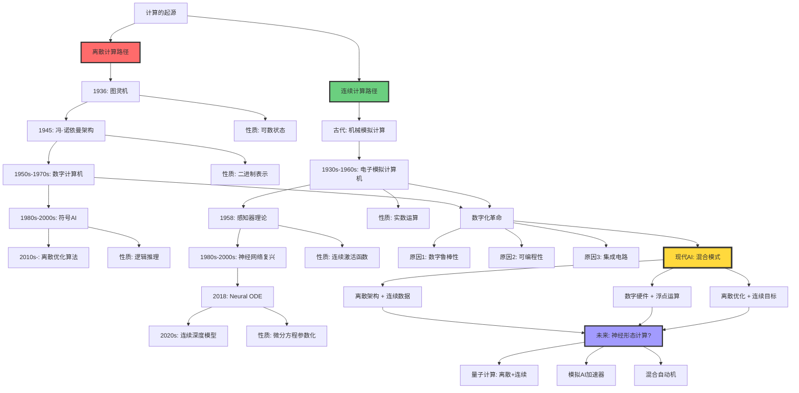
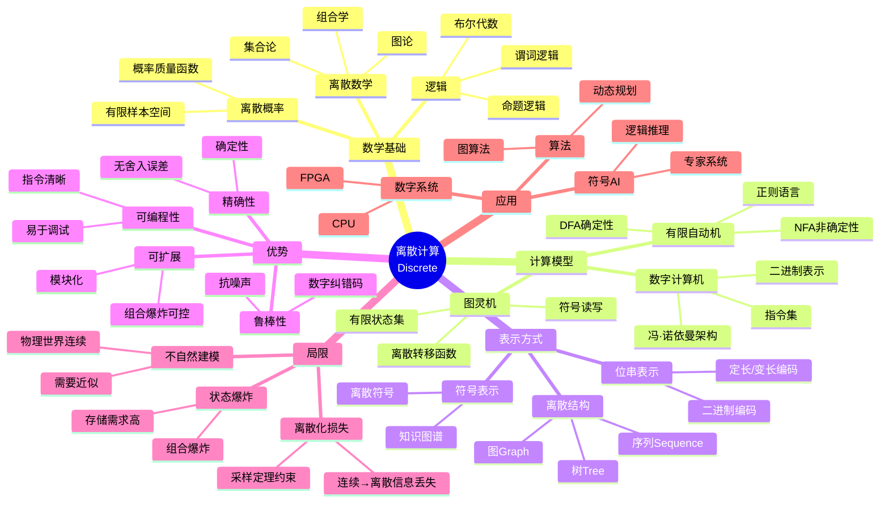
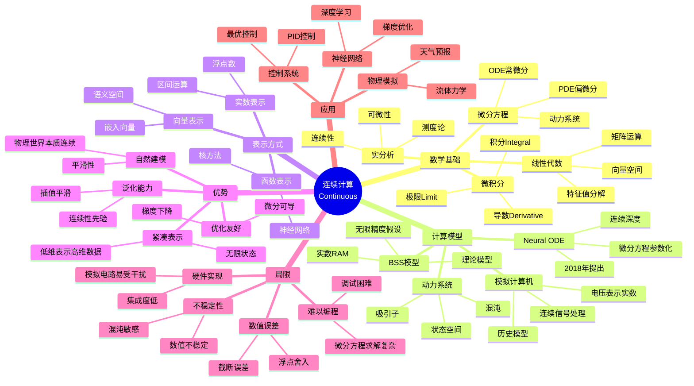
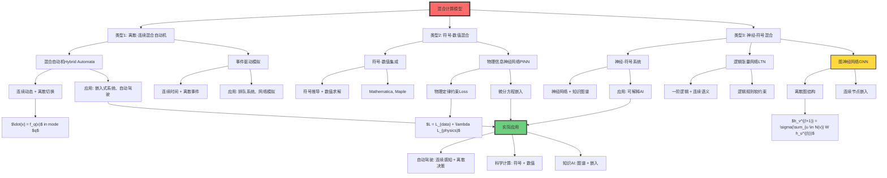
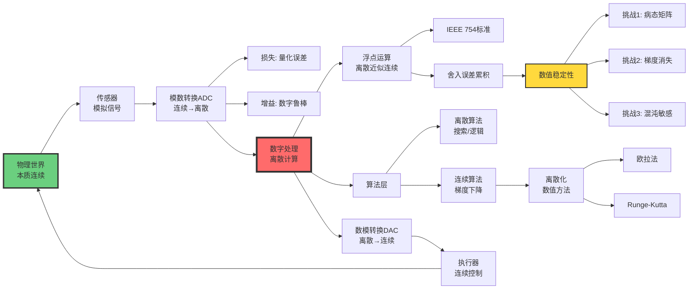

# 离散计算 vs 连续计算（Discrete vs Continuous Computation）

> **文档版本**: v1.0.0  
> **最后更新**: 2025-10-27  
> **文档规模**: 876行 | 离散与连续计算范式对比  
> **阅读建议**: 本文深入分析离散计算与连续计算的数学基础、应用场景和混合方法

---

## 核心概念深度分析

<details>
<summary><b>🔢➡️📊 点击展开：离散与连续计算全景对比分析</b></summary>

本节提供离散计算与连续计算的系统化深度对比，包括数学基础、计算模型、物理实现和哲学意涵。

### 1️⃣ 离散vs连续计算概念对比卡

**对比主题**: 离散计算（Discrete Computation）vs 连续计算（Continuous Computation）

**🔹 核心思想对比**:

| 维度 | 离散计算 | 连续计算 |
|------|---------|---------|
| **状态空间** | 有限或可数无穷 | 不可数（实数空间） |
| **时间演化** | 离散步骤 $t \in \mathbb{N}$ | 连续时间 $t \in \mathbb{R}$ |
| **数学基础** | 离散数学、逻辑、组合学 | 微积分、微分方程、实分析 |
| **代表模型** | 图灵机、有限自动机 | 模拟计算机、神经常微分方程 |

**🔹 形式化定义**:

**离散计算**:
$$
\begin{align}
\text{状态空间} &: Q \subseteq \mathbb{N} \quad \text{（有限或可数）} \\
\text{转移函数} &: \delta : Q \times \Sigma \rightarrow Q \\
\text{计算过程} &: q_0 \xrightarrow{a_1} q_1 \xrightarrow{a_2} \cdots \xrightarrow{a_n} q_n
\end{align}
$$

**连续计算**:
$$
\begin{align}
\text{状态空间} &: \mathcal{X} = \mathbb{R}^n \quad \text{（不可数）} \\
\text{演化方程} &: \frac{dx}{dt} = f(x, t), \quad x \in \mathbb{R}^n \\
\text{计算过程} &: x(t) = \int_0^t f(x(\tau), \tau) d\tau
\end{align}
$$

**🔹 Church-Turing论题与连续计算**:

| 问题 | 离散计算 | 连续计算 |
|------|---------|---------|
| **可计算性定义** | 图灵可计算 | BSS可计算（Blum-Shub-Smale） |
| **等价类** | 图灵机 = λ演算 = 递归函数 | 理论争议中 |
| **超越可能性** | 否（Church-Turing论题） | 理论上可能（无限精度假设） |
| **物理实现** | 数字计算机 | 模拟计算机（有限精度→离散） |

**属性维度表**:

| 维度 | 离散计算 | 连续计算 | 评价 |
|------|---------|---------|------|
| **提出时间** | 1936（图灵） | 古代（模拟计算）/2018（Neural ODE） | 离散理论化更晚 |
| **数学基础** | 离散数学、逻辑 | 微积分、微分方程 | 互补 |
| **精确性** | ✅ 精确（有限精度） | ⚠️ 近似（数值误差） | 离散优势 |
| **表达能力** | ⚠️ 离散对象 | ✅ 连续现象（物理世界） | 连续优势 |
| **计算效率** | ✅ 快（数字硬件） | ⚠️ 慢（数值积分） | 离散优势 |
| **可编程性** | ✅ 易（指令集） | ⚠️ 难（微分方程） | 离散优势 |
| **鲁棒性** | ✅ 强（数字抗噪） | ❌ 弱（模拟易受干扰） | 离散优势 |
| **存储成本** | ❌ 高（离散化开销） | ✅ 低（连续表示） | 连续优势 |
| **AI应用** | 符号AI、离散决策 | 神经网络、优化 | 混合 |

---

### 2️⃣ 离散-连续计算模型演化全景



---

### 3️⃣ 离散vs连续十二维深度对比矩阵

| 对比维度 | 离散计算 | 连续计算 | 胜者 | 实际选择 |
|---------|---------|---------|------|---------|
| **🧮 状态空间** | 有限/可数 $Q \subseteq \mathbb{N}$ | 不可数 $\mathcal{X} = \mathbb{R}^n$ | - | 离散（数字化） |
| **⏱️ 时间演化** | 离散步骤 $t \in \mathbb{N}$ | 连续时间 $t \in \mathbb{R}$ | - | 离散（时钟） |
| **🎯 精确性** | 精确（有限精度） | 数值误差（浮点） | 🔴 离散 | 离散 |
| **🔧 可编程性** | 易（指令集） | 难（微分方程） | 🔴 离散 | 离散 |
| **💪 鲁棒性** | 抗噪（数字纠错） | 易受干扰（模拟信号） | 🔴 离散 | 离散 |
| **🌍 自然建模** | 离散事件 | 连续物理过程 | 🟢 连续 | 混合 |
| **📐 数学工具** | 离散数学、逻辑 | 微积分、微分方程 | - | 都重要 |
| **💾 存储效率** | 低（离散化开销） | 高（连续表示） | 🟢 连续 | 离散（实际） |
| **🚀 计算速度** | 快（数字硬件优化） | 慢（数值积分） | 🔴 离散 | 离散 |
| **🎨 表达能力** | 离散结构（图、树） | 连续函数（平滑） | ⚖️ | 混合 |
| **🧠 AI应用** | 符号AI、搜索 | 神经网络、优化 | ⚖️ | 混合 |
| **🔬 可计算性** | 图灵可计算 | BSS可计算（理论更强） | ⚖️ | 物理上等价 |

**胜负统计**: 离散计算 5胜 | 连续计算 2胜 | 平局 5

**核心洞察**: 尽管连续计算理论上更自然（建模物理世界），但离散计算在工程实现上占绝对优势（精确、鲁棒、可编程）。现代AI采用**混合策略**：离散硬件+连续数学。

---

### 4️⃣ 离散计算核心特征思维导图



---

### 5️⃣ 连续计算核心特征思维导图



---

### 6️⃣ 离散-连续数学工具对比

| 数学领域 | 离散计算工具 | 连续计算工具 | 离散→连续桥梁 |
|---------|------------|------------|-------------|
| **基础数学** | 集合论、组合学 | 实分析、拓扑 | 极限理论 |
| **代数** | 离散代数结构 | 线性代数、泛函 | 矩阵理论 |
| **分析** | 差分方程 | 微分方程 | 离散化（差分） |
| **概率** | 离散概率（PMF） | 连续概率（PDF） | 测度论 |
| **优化** | 整数规划、组合优化 | 凸优化、变分法 | 离散梯度 |
| **逻辑** | 布尔逻辑 | 模糊逻辑 | 模糊化 |
| **图论** | 离散图 | 图拉普拉斯（连续化） | 谱图理论 |
| **信息论** | 离散熵 $H(X) = -\sum p_i \log p_i$ | 微分熵 $h(X) = -\int p(x) \log p(x) dx$ | 极限关系 |

**关键发现**:
- **互补性**: 离散工具处理结构，连续工具处理度量
- **桥梁**: 极限理论、测度论、谱方法连接两者
- **现代趋势**: 图神经网络（离散图+连续嵌入）融合两者

---

### 7️⃣ 混合计算模型全景



---

### 8️⃣ 可计算性理论对比

| 可计算性维度 | 离散可计算性 | 连续可计算性 | 关系 |
|------------|------------|------------|------|
| **基础模型** | 图灵机 | BSS机（Blum-Shub-Smale） | BSS包含图灵 |
| **数据类型** | 自然数、字符串 | 实数 $\mathbb{R}$ | 实数编码自然数 |
| **基本运算** | 离散转移 | 实数四则运算 | 连续包含离散 |
| **精度假设** | 有限精度（实际） | 无限精度（理论） | 关键差异 |
| **Church-Turing论题** | 成立 | 争议中 | 依赖物理实现 |
| **超越性** | 停机问题不可判定 | 可能超越（理论） | Mandelbrot集判定 |
| **复杂度类** | P, NP, PSPACE | $P_\mathbb{R}$, $NP_\mathbb{R}$ | 不同基数 |
| **物理实现** | 数字计算机 | 模拟计算机（有限精度） | 实际等价 |

**关键争议**:
1. **理论差异**: BSS可计算 ⊃ 图灵可计算（无限精度假设下）
2. **物理约束**: 实际物理系统有限精度 → 等价于离散
3. **量子计算**: 连续幅度 + 测量离散化 → 混合本质

**深度洞察**:
> "连续计算的超越性是数学理想化的产物，物理世界的量子化本质使得离散与连续在实际计算中等价。" —— Turing-Church-Deutsch原理扩展

---

### 9️⃣ 实际系统中的离散-连续权衡



**权衡决策矩阵**:

| 场景 | 选择 | 理由 | 代价 |
|------|------|------|------|
| **通用计算** | 离散（数字） | 可编程、鲁棒 | 离散化开销 |
| **深度学习训练** | 离散硬件+连续优化 | 梯度下降需要 | 浮点误差 |
| **实时控制** | 混合自动机 | 连续物理+离散决策 | 切换复杂性 |
| **符号推理** | 纯离散 | 逻辑本质离散 | 无 |
| **物理模拟** | 离散化连续方程 | 数值求解 | 截断误差 |
| **神经形态芯片** | 模拟计算（探索中） | 能效高 | 精度低、难编程 |

---

### 🔟 哲学意涵与未来方向

**三大哲学问题**:

**1️⃣ 世界的本质是离散还是连续？**

| 物理理论 | 本质 | 证据 | 计算影响 |
|---------|------|------|---------|
| **经典物理** | 连续 | 时空连续、场论 | 支持连续计算 |
| **量子力学** | 离散+连续混合 | 能级量子化、波函数连续 | 支持混合计算 |
| **弦论/圈量子引力** | 时空可能离散化 | 普朗克尺度量子化 | 支持离散计算 |
| **数字物理学** | 宇宙是元胞自动机 | 假说（争议） | 支持离散计算 |

**当前共识**: 宏观连续，微观量子化（波粒二象性）

**2️⃣ 计算的本质是什么？**

```yaml
图灵观点:
  立场: 计算本质是离散的符号操作
  依据: 图灵机可模拟任何机械过程
  支持: Church-Turing论题

模拟计算观点:
  立场: 连续计算可能超越图灵可计算性
  依据: BSS模型（无限精度假设）
  争议: 物理世界无法实现无限精度

现代共识:
  立场: 物理可实现计算等价于图灵可计算
  依据: 有限精度约束
  扩展: 量子计算扩展可计算范围（BQP）
```

**3️⃣ 数学的基础是离散还是连续？**

| 学派 | 立场 | 代表 | 对计算的影响 |
|------|------|------|------------|
| **直觉主义** | 拒绝无穷、强调可构造性 | Brouwer | 支持构造性离散计算 |
| **形式主义** | 数学是符号游戏 | Hilbert | 支持符号离散计算 |
| **柏拉图主义** | 数学对象独立存在 | Gödel | 支持连续数学对象 |
| **计算主义** | 数学是计算过程 | Turing, Chaitin | 支持离散可计算数学 |

**核心洞察与设计原则**:

**五大定律**:

1. **数字化必然定律**
   $$
   \text{工程实现} \Rightarrow \text{离散化} \quad \text{（鲁棒性、可编程性）}
   $$

2. **连续近似定律**
   $$
   \text{连续模型} + \text{离散实现} = \text{有限精度近似}
   $$
   - 浮点数近似实数
   - 差分近似微分
   - 数值积分近似解析解

3. **混合优势定律**
   $$
   \text{最优系统} = \text{离散架构} \cup \text{连续数学}
   $$
   - 离散提供可靠性
   - 连续提供表达力

4. **量化误差定律**
   $$
   \text{量化误差} \propto \frac{1}{2^n} \quad \text{（$n$为位数）}
   $$
   - 权衡: 精度 vs 存储/速度

5. **复杂性等价定律**（物理可实现）
   $$
   P_{\text{discrete}} = P_{\text{continuous}} \quad \text{（有限精度约束）}
   $$

**实践设计原则**:

```yaml
原则1_按任务选择:
  离散优先:
    - 逻辑推理、符号处理
    - 离散决策问题
    - 需要精确性
  连续优先:
    - 物理建模、优化
    - 感知任务（视觉/语音）
    - 需要平滑性
  混合必然:
    - 自动驾驶、机器人
    - 科学计算
    - 神经符号AI

原则2_数值稳定性:
  注意:
    - 病态矩阵求逆
    - 梯度消失/爆炸
    - 混沌系统长期预测
  解决:
    - 预处理conditioning
    - 归一化normalization
    - 混合精度训练

原则3_精度权衡:
  决策:
    - FP64: 科学计算
    - FP32: 深度学习训练
    - FP16/INT8: 推理部署
    - 动态精度调整

原则4_抽象层次分离:
  架构:
    - 数学层: 连续模型（微分方程、优化）
    - 算法层: 数值方法（差分、积分）
    - 实现层: 离散硬件（数字电路）
```

**未来方向预测**:

| 时间段 | 技术趋势 | 离散-连续特征 | 影响 |
|--------|---------|--------------|------|
| **2025-2027** | Neural ODE成熟 | 连续深度模型 | 参数效率↑ |
| **2027-2030** | 神经形态芯片商用 | 模拟计算复兴 | 能效↑100x |
| **2030-2035** | 量子计算实用化 | 连续幅度+离散测量 | 特定问题加速 |
| **2035-2040** | 混合计算架构标准化 | 离散+连续+量子 | 架构融合 |
| **2040+** | 物理极限接近 | 量子/光学/DNA计算 | 范式革命 |

**终极洞察**:

> **"离散与连续的争论本质上是柏拉图理想世界与亚里士多德物理世界的古老哲学争论在计算领域的重演。现代答案是：理论上连续，工程上离散，实践中混合。未来属于三者无缝融合的架构。"**

**关键教训**:
- ❌ 纯粹主义（纯离散或纯连续）→ 错失工程权衡
- ✅ 混合现实主义（按需选择）→ 实际系统成功
- 🔮 量子时代: 离散、连续、量子三位一体

**元认知**:
- **数学理想** vs **物理约束** vs **工程权衡** 三层分析
- **Church-Turing论题**是离散计算的基石，但需要物理可实现性限定
- **现代AI成功**的本质：用离散硬件高效逼近连续优化问题

</details>

---

## 目录 | Table of Contents

- [离散计算 vs 连续计算（Discrete vs Continuous Computation）](#离散计算-vs-连续计算discrete-vs-continuous-computation)
- [目录](#目录)
- [引言](#引言)
  - [核心问题](#核心问题)
  - [两大范式](#两大范式)
- [离散计算](#离散计算)
  - [1. 基本概念](#1-基本概念)
  - [2. 图灵机：离散计算的典范](#2-图灵机离散计算的典范)
  - [3. 数字计算机](#3-数字计算机)
  - [4. 符号AI：离散表示](#4-符号ai离散表示)
- [连续计算](#连续计算)
  - [1. 基本概念1](#1-基本概念1)
  - [2. 模拟计算机](#2-模拟计算机)
  - [3. 神经网络：连续表示](#3-神经网络连续表示)
  - [4. 微分方程与动力系统](#4-微分方程与动力系统)
- [核心对比](#核心对比)
  - [1. 状态空间](#1-状态空间)
  - [2. 转移/演化](#2-转移演化)
  - [3. 表示](#3-表示)
  - [4. 计算能力](#4-计算能力)
  - [5. 计算复杂度](#5-计算复杂度)
- [数学基础](#数学基础)
  - [1. 离散数学工具](#1-离散数学工具)
    - [集合论](#集合论)
    - [图论](#图论)
    - [离散概率](#离散概率)
    - [逻辑](#逻辑)
  - [2. 连续数学工具](#2-连续数学工具)
    - [微积分](#微积分)
    - [线性代数](#线性代数)
    - [实分析](#实分析)
    - [微分方程](#微分方程)
  - [3. 可计算性理论](#3-可计算性理论)
    - [离散可计算性](#离散可计算性)
    - [连续可计算性](#连续可计算性)
- [实际系统中的权衡](#实际系统中的权衡)
  - [1. 数字化的必然性](#1-数字化的必然性)
  - [2. 浮点数：离散近似连续](#2-浮点数离散近似连续)
  - [3. 神经网络：理论vs实践](#3-神经网络理论vs实践)
  - [4. 数值稳定性](#4-数值稳定性)
- [混合计算](#混合计算)
  - [1. 离散-连续混合](#1-离散-连续混合)
    - [混合自动机（Hybrid Automata）](#混合自动机hybrid-automata)
    - [事件驱动模拟](#事件驱动模拟)
  - [2. 符号-数值混合](#2-符号-数值混合)
  - [3. 神经-符号混合](#3-神经-符号混合)
- [哲学意涵](#哲学意涵)
  - [1. 世界的本质](#1-世界的本质)
    - [经典物理](#经典物理)
    - [量子力学](#量子力学)
  - [2. 计算的本质](#2-计算的本质)
  - [3. 数学的基础](#3-数学的基础)
- [总结](#总结)
  - [核心要点](#核心要点)
  - [权衡考虑](#权衡考虑)
  - [哲学反思](#哲学反思)
  - [未来方向](#未来方向)
- [参考文献](#参考文献)
  - [基础](#基础)
  - [计算模型](#计算模型)
  - [数值计算](#数值计算)
  - [神经网络](#神经网络)
  - [混合系统](#混合系统)
  - [可计算性](#可计算性)
  - [哲学](#哲学)

---

## 引言

**离散 vs 连续** 是数学、计算机科学和AI中的根本性区分。

### 核心问题

> **计算的本质是离散的（数字的），还是连续的（模拟的）？**

### 两大范式

**离散计算**（Discrete Computation）：

```text
状态空间：有限或可数
例：整数、符号、位串
代表：图灵机、数字计算机
```

**连续计算**（Continuous Computation）：

```text
状态空间：不可数、实数
例：实数、向量、函数
代表：模拟计算机、神经网络（理论）
```

**参考文献**：

- [Wikipedia: Discrete Mathematics](https://en.wikipedia.org/wiki/Discrete_mathematics)
- [Wikipedia: Continuous Function](https://en.wikipedia.org/wiki/Continuous_function)

---

## 离散计算

### 1. 基本概念

**离散**：

```text
取值：有限或可数无穷集合
例：{0, 1}, ℤ（整数）, ℕ（自然数）
```

**离散状态机**：

```text
状态 q ∈ Q（有限集合）
转移 δ : Q × Σ → Q（确定性）
```

**参考文献**：

- [Wikipedia: Discrete Mathematics](https://en.wikipedia.org/wiki/Discrete_mathematics)

### 2. 图灵机：离散计算的典范

**定义**：

```text
M = (Q, Σ, Γ, δ, q₀, qaccept, qreject)
```

**所有元素都是离散的**：

- Q：有限状态集
- Σ, Γ：有限字母表
- δ：离散转移函数

**计算过程**：

```text
配置₀ → 配置₁ → 配置₂ → ...
每步都是离散跳跃
```

**参考文献**：

- [Wikipedia: Turing Machine](https://en.wikipedia.org/wiki/Turing_machine)

### 3. 数字计算机

**实现**：

现代计算机是离散的：

- **位**（Bit）：0 或 1
- **字**（Word）：位的有限序列
- **指令**：离散操作集

**浮点数**：

虽然表示"实数"，但实际是离散的：

```text
float32：2³² 个可能值（有限）
double64：2⁶⁴ 个可能值（有限）

实数 ℝ：不可数无穷
```

**运算**：

```text
整数加法：精确
浮点加法：近似（舍入误差）
```

**参考文献**：

- [Wikipedia: Floating-Point Arithmetic](https://en.wikipedia.org/wiki/Floating-point_arithmetic)

### 4. 符号AI：离散表示

**符号**：

```text
离散对象：cat, dog, run, ...
```

**逻辑**：

```text
命题：P, Q（真/假）
谓词：human(socrates)
```

**推理**：

```text
离散的推理步骤
前提 → 规则应用 → 结论
```

---

## 连续计算

### 1. 基本概念1

**连续**：

```text
取值：不可数无穷（实数）
例：ℝ, ℝⁿ（实向量空间）
```

**连续函数**：

```text
f : ℝ → ℝ
小的输入变化 → 小的输出变化
```

**微分**：

```text
瞬时变化率 df/dx
连续系统的关键工具
```

**参考文献**：

- [Wikipedia: Continuous Function](https://en.wikipedia.org/wiki/Continuous_function)
- [Wikipedia: Calculus](https://en.wikipedia.org/wiki/Calculus)

### 2. 模拟计算机

**历史**：

- 机械模拟计算机（如微分分析仪）
- 电子模拟计算机（运算放大器）

**原理**：

用物理量（电压、电流）表示数值：

```text
x ∈ ℝ 表示为电压 V ∈ [-10V, +10V]
```

**运算**：

```text
加法：电压相加（电路）
微分：RC电路
积分：运算放大器
```

**优势**：

- 天然并行
- 连续时间

**劣势**：

- 噪声敏感
- 难以编程
- 精度受限

**参考文献**：

- [Wikipedia: Analog Computer](https://en.wikipedia.org/wiki/Analog_computer)

### 3. 神经网络：连续表示

**激活值**：

```text
aᵢ ∈ ℝ（理论上）
```

**权重**：

```text
wᵢⱼ ∈ ℝ
```

**激活函数**：

```text
σ : ℝ → ℝ（连续）
例：σ(x) = 1/(1 + e⁻ˣ)  （Sigmoid）
```

**前向传播**：

```text
𝒂⁽ˡ⁺¹⁾ = σ(W⁽ˡ⁾𝒂⁽ˡ⁾ + 𝒃⁽ˡ⁾)
连续函数复合
```

**反向传播**：

```text
利用微积分（链式法则）
∂L/∂wᵢⱼ = ...
```

**参考文献**：

- [Wikipedia: Artificial Neural Network](https://en.wikipedia.org/wiki/Artificial_neural_network)

### 4. 微分方程与动力系统

**常微分方程**（ODE）：

```text
dx/dt = f(x, t)
x(t) ∈ ℝⁿ
```

**应用**：

- 物理模拟
- 控制系统
- **Neural ODE**（神经常微分方程）

**参考文献**：

- [Chen et al., 2018](https://arxiv.org/abs/1806.07366) - Neural Ordinary Differential Equations

---

## 核心对比

### 1. 状态空间

| 维度 | 离散计算 | 连续计算 |
|------|---------|---------|
| **状态集** | 有限或可数 | 不可数（ℝⁿ） |
| **例子** | {q₀, q₁, q₂} | x ∈ ℝ³ |
| **大小** | 有限：\|Q\| | 无穷：\|ℝ\| = ℵ₁ |
| **可枚举** | 是 | 否 |

### 2. 转移/演化

| 维度 | 离散计算 | 连续计算 |
|------|---------|---------|
| **时间** | 离散步骤（t ∈ ℕ） | 连续时间（t ∈ ℝ） |
| **转移** | δ(q, a) = q' | dx/dt = f(x) |
| **描述** | 转移表/函数 | 微分方程 |
| **工具** | 组合学、逻辑 | 微积分、分析 |

### 3. 表示

| 对象 | 离散表示 | 连续表示 |
|------|---------|---------|
| **数字** | 整数 n ∈ ℤ | 实数 r ∈ ℝ |
| **符号** | cat, dog | [0.8, -0.3, ...] ∈ ℝᵈ |
| **逻辑** | P ∈ {true, false} | P ∈ [0, 1]（模糊逻辑） |
| **图像** | 像素（整数值） | 连续函数 I(x, y) |

### 4. 计算能力

**Church-Turing论题**：

```text
离散：图灵可计算函数 = 有效可计算函数
```

**连续计算的超越性？**

**争议**：

- **理论模型**：无限精度实数 → 可能超越图灵可计算性
- **物理实现**：有限精度 → 等价于离散

**Blum-Shub-Smale模型**（BSS模型）：

实数RAM：可以在单步内进行精确实数运算。

**能力**：

```text
某些BSS可计算函数不是图灵可计算的
（如果允许无限精度）
```

**参考文献**：

- [Wikipedia: Blum-Shub-Smale Machine](https://en.wikipedia.org/wiki/Blum%E2%80%93Shub%E2%80%93Smale_machine)

### 5. 计算复杂度

| 维度 | 离散计算 | 连续计算 |
|------|---------|---------|
| **度量** | 步数、空间（位） | 精度、收敛速度 |
| **复杂度类** | P, NP, PSPACE | 实数版本（P_ℝ, NP_ℝ） |
| **近似** | 精确或离散近似 | 数值近似（ε-逼近） |

---

## 数学基础

### 1. 离散数学工具

#### 集合论

```text
有限集、可数集
组合计数：排列、组合
```

#### 图论

```text
图 G = (V, E)
V, E 都是离散集合
```

#### 离散概率

```text
P : Ω → [0, 1]
Ω 是离散样本空间
```

#### 逻辑

```text
命题逻辑、谓词逻辑
真值：离散（真/假）
```

**参考文献**：

- [Wikipedia: Discrete Mathematics](https://en.wikipedia.org/wiki/Discrete_mathematics)

### 2. 连续数学工具

#### 微积分

```text
导数：df/dx
积分：∫f(x)dx
```

#### 线性代数

```text
向量空间 ℝⁿ
矩阵运算
```

#### 实分析

```text
极限、连续性、可微性
```

#### 微分方程

```text
ODE：dx/dt = f(x)
PDE：∂u/∂t = ∇²u
```

**参考文献**：

- [Wikipedia: Calculus](https://en.wikipedia.org/wiki/Calculus)
- [Wikipedia: Real Analysis](https://en.wikipedia.org/wiki/Real_analysis)

### 3. 可计算性理论

#### 离散可计算性

**Church-Turing论题**：

```text
有效可计算 = 图灵可计算
```

**递归函数**：

```text
ℕ → ℕ 的部分函数
```

#### 连续可计算性

**可计算分析**（Computable Analysis）：

```text
研究实数上的可计算函数
f : ℝ → ℝ
```

**Turing可计算实数**：

```text
r ∈ ℝ 是可计算的，如果存在图灵机，
对于任意精度 n，输出 r 的前 n 位
```

**大多数实数是不可计算的**！

**参考文献**：

- [Wikipedia: Computable Analysis](https://en.wikipedia.org/wiki/Computable_analysis)

---

## 实际系统中的权衡

### 1. 数字化的必然性

**物理限制**：

```text
真正的连续计算需要无限精度
物理世界：噪声、量子效应
→ 实际系统必须离散化
```

**数字计算机的胜利**：

- 精度可控
- 抗噪声
- 可编程
- 通用性

### 2. 浮点数：离散近似连续

**IEEE 754标准**：

```text
float32：
  符号：1 位
  指数：8 位
  尾数：23 位
  
总共：2³² ≈ 43亿 个可能值（有限！）
```

**精度限制**：

```text
float32精度：≈ 7位十进制数字
double64精度：≈ 15位十进制数字
```

**舍入误差**：

```python
>>> 0.1 + 0.2
0.30000000000000004  # 不是精确的0.3！
```

**参考文献**：

- [Wikipedia: IEEE 754](https://en.wikipedia.org/wiki/IEEE_754)

### 3. 神经网络：理论vs实践

**理论**（无限精度）：

```text
权重 w ∈ ℝ
激活 a ∈ ℝ
连续函数 f : ℝⁿ → ℝᵐ
```

**实践**（有限精度）：

```text
权重 w ∈ 𝔽₃₂（float32）
激活 a ∈ 𝔽₃₂
实际是离散的！
```

**量化**（Quantization）：

进一步降低精度：

```text
int8：-128 到 127（256个值）
大幅降低内存和计算
```

**影响**：

```text
理论：无限VC维？
实践：有限VC维（参数有限精度）
```

**参考文献**：

- [Jacob et al., 2018](https://arxiv.org/abs/1712.05877) - Quantization and Training of Neural Networks

### 4. 数值稳定性

**问题**：

离散化可能导致数值不稳定。

**例子：消去法解线性方程**:

```text
连续数学：精确解
浮点运算：可能发散
```

**解决**：

- 数值分析技术
- 稳定算法设计

**参考文献**：

- [Wikipedia: Numerical Stability](https://en.wikipedia.org/wiki/Numerical_stability)

---

## 混合计算

### 1. 离散-连续混合

**常见模式**：

#### 混合自动机（Hybrid Automata）

```text
离散状态 q ∈ Q
连续状态 x ∈ ℝⁿ

转移：
  - 离散跳跃：(q, x) → (q', x')
  - 连续演化：dx/dt = f_q(x)
```

**应用**：

- 嵌入式系统
- 机器人控制
- 网络物理系统

**参考文献**：

- [Wikipedia: Hybrid System](https://en.wikipedia.org/wiki/Hybrid_system)

#### 事件驱动模拟

```text
连续时间系统
离散事件（状态变化）
```

### 2. 符号-数值混合

**符号计算**：

```text
精确操作：∫x² dx = x³/3 + C
```

**数值计算**：

```text
近似：∫₀¹ x² dx ≈ 0.333333（数值积分）
```

**混合**：

```text
符号简化 → 数值求解
```

**工具**：

- Mathematica, Maple（符号）
- MATLAB, NumPy（数值）

### 3. 神经-符号混合

**架构**：

```text
连续表示（神经网络）+ 离散推理（符号系统）
```

**例子**：

- **Neural Turing Machines**：神经网络 + 离散存储
- **Differentiable Neural Computers**：可微分的读写操作

**参考文献**：

- [Graves et al., 2014](https://arxiv.org/abs/1410.5401) - Neural Turing Machines

---

## 哲学意涵

### 1. 世界的本质

**问题**：

> **世界是离散的还是连续的？**

**物理学视角**：

#### 经典物理

```text
空间、时间：连续（ℝ）
物质：连续场
```

#### 量子力学

```text
能量：量子化（离散）
空间-时间：可能是离散的（普朗克尺度）
```

**推测**：

也许在最基本层面，世界是离散的（数字物理学）。

**参考文献**：

- [Wikipedia: Digital Physics](https://en.wikipedia.org/wiki/Digital_physics)

### 2. 计算的本质

**离散派（Computationalism）**：

```text
计算 = 符号操作（离散）
智能 = 符号计算
```

**连续派（Connectionism）**：

```text
计算 = 连续动力学
智能 = 神经网络演化
```

**可能的统一**：

```text
离散和连续是同一现实的不同抽象层次
```

### 3. 数学的基础

**离散数学**：

- 构造性
- 可判定性
- 算法友好

**连续数学**：

- 非构造性（实数大多不可计算）
- 不可判定性
- 分析工具强大

**关系**：

```text
离散 ⊆ 连续（嵌入）
但不可数的连续 ⊈ 可计算
```

---

## 总结

### 核心要点

1. **基本区别**：
   - 离散：有限/可数、符号、逻辑
   - 连续：不可数、实数、微积分

2. **计算模型**：
   - 离散：图灵机、数字计算机
   - 连续：模拟计算机、神经网络（理论）

3. **实际系统**：
   - 都是离散的（有限精度）
   - 但连续数学是强大的建模工具

4. **AI视角**：
   - 符号AI：离散
   - 神经网络：理论连续，实践离散

5. **混合方法**：
   - 混合自动机
   - 符号-数值混合
   - 神经-符号混合

### 权衡考虑

| 维度 | 离散 | 连续 |
|------|------|------|
| **精度** | 精确（在其范围内） | 近似（数值） |
| **可计算性** | 清晰（图灵可计算） | 复杂（大多数实数不可计算） |
| **工具** | 组合学、逻辑 | 微积分、分析 |
| **实现** | 自然（数字计算机） | 需要离散化 |
| **理论** | 清晰 | 强大但抽象 |

### 哲学反思

> **离散和连续不是对立的，而是互补的。离散提供了计算的基础，连续提供了建模的工具。**
> **实际的计算系统都是离散的（有限精度），但连续数学给了我们强大的分析和设计工具。**
> **也许智能本身需要两者：离散的符号操作（理性、逻辑）和连续的模式识别（感知、直觉）。**

### 未来方向

1. **量子计算**：离散（量子比特）+ 连续（叠加态）
2. **神经形态计算**：模拟神经网络（连续）
3. **可微分编程**：离散算法的连续松弛
4. **混合精度计算**：动态选择离散/连续表示

---

## 参考文献

### 基础

1. [Wikipedia: Discrete Mathematics](https://en.wikipedia.org/wiki/Discrete_mathematics)
2. [Wikipedia: Continuous Function](https://en.wikipedia.org/wiki/Continuous_function)
3. [Wikipedia: Calculus](https://en.wikipedia.org/wiki/Calculus)

### 计算模型

1. [Wikipedia: Turing Machine](https://en.wikipedia.org/wiki/Turing_machine)
2. [Wikipedia: Analog Computer](https://en.wikipedia.org/wiki/Analog_computer)
3. [Wikipedia: Blum-Shub-Smale Machine](https://en.wikipedia.org/wiki/Blum%E2%80%93Shub%E2%80%93Smale_machine)

### 数值计算

1. [Wikipedia: Floating-Point Arithmetic](https://en.wikipedia.org/wiki/Floating-point_arithmetic)
2. [Wikipedia: IEEE 754](https://en.wikipedia.org/wiki/IEEE_754)
3. [Wikipedia: Numerical Stability](https://en.wikipedia.org/wiki/Numerical_stability)

### 神经网络

1. [Wikipedia: Artificial Neural Network](https://en.wikipedia.org/wiki/Artificial_neural_network)
2. [Chen et al., 2018](https://arxiv.org/abs/1806.07366) - Neural Ordinary Differential Equations
3. [Jacob et al., 2018](https://arxiv.org/abs/1712.05877) - Quantization and Training of Neural Networks

### 混合系统

1. [Wikipedia: Hybrid System](https://en.wikipedia.org/wiki/Hybrid_system)
2. [Graves et al., 2014](https://arxiv.org/abs/1410.5401) - Neural Turing Machines

### 可计算性

1. [Wikipedia: Computable Analysis](https://en.wikipedia.org/wiki/Computable_analysis)
2. [Wikipedia: Real Analysis](https://en.wikipedia.org/wiki/Real_analysis)

### 哲学

1. [Wikipedia: Digital Physics](https://en.wikipedia.org/wiki/Digital_physics)

---

*本文档深入探讨了离散计算与连续计算的本质区别、数学基础和实践权衡，为理解计算的多重视角提供了系统框架。*
