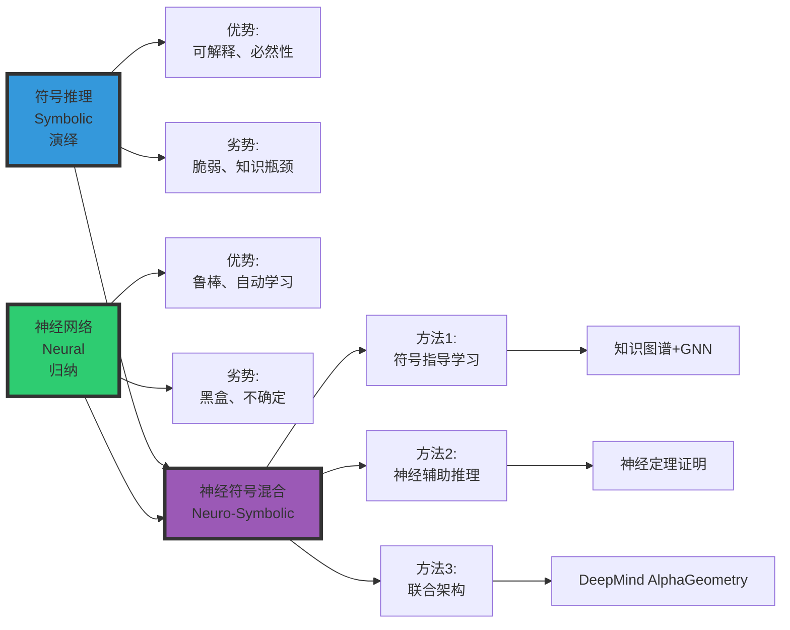

# 演绎推理 vs 归纳推理（Deductive vs Inductive Reasoning）

> **文档版本**: v1.0.0
> **最后更新**: 2025-10-27
> **文档规模**: 829行 | 演绎与归纳推理对比
> **阅读建议**: 本文系统对比演绎推理与归纳推理的逻辑基础、AI应用和哲学问题

---

## 核心概念深度分析

<details>
<summary><b>🔍🧮 点击展开：演绎vs归纳推理全景深度解析</b></summary>

本节深入剖析演绎/归纳/溯因三种推理、逻辑基础、Hume归纳问题与AI应用。

### 1️⃣ 演绎vs归纳推理概念定义卡

**概念名称**: 演绎推理vs归纳推理（Deductive vs Inductive Reasoning）

**内涵（本质属性）**:

**🔹 核心定义**:
演绎推理从一般原则推导出特殊结论（必然性），归纳推理从特殊观察概括出一般规律（概率性）。

$$
\begin{align}
\text{演绎} &: \text{一般}(\forall x) \Rightarrow \text{特殊}(P(a)) \quad \text{（必然）} \\
\text{归纳} &: \text{特殊}(P(a_1), P(a_2), ...) \Rightarrow \text{一般}(\forall x: P(x)) \quad \text{（可能）}
\end{align}
$$

**🔹 三种推理类型对比**:

| 维度 | 演绎推理 | 归纳推理 | 溯因推理 |
|------|---------|---------|---------|
| **方向** | 一般→特殊 | 特殊→一般 | 结果→原因 |
| **结论** | 必然真（前提真） | 可能真 | 最佳解释 |
| **增加信息** | ❌ 无（保真） | ✅ 有（扩展知识） | ✅ 有（假设生成） |
| **示例** | 所有人会死→苏格拉底会死 | 天鹅1-1000白→所有天鹅白 | 地湿→可能下雨 |
| **AI应用** | 专家系统、定理证明 | 机器学习、神经网络 | 诊断系统、NLU |
| **符号** | ∴（therefore） | →（probably） | ⇒（best explains） |

**外延（范围边界）**:

| 维度 | 演绎推理包含 ✅ | 归纳推理包含 ✅ | 不包含 ❌ |
|------|--------------|--------------|----------|
| **逻辑** | 三段论、谓词逻辑 | 枚举归纳、统计归纳 | 直觉、猜测 |
| **AI** | 专家系统、Prolog | 机器学习、深度学习 | 随机试错 |
| **科学** | 数学证明 | 科学实验、假设检验 | 伪科学 |

**属性维度表**:

| 维度 | 演绎 | 归纳 | 说明 |
|------|------|------|------|
| **确定性** | 100%（前提真） | <100%（概率） | 演绎保真 |
| **知识扩展** | 无 | 有 | 归纳创造新知 |
| **风险** | 无（逻辑必然） | 有（可能错） | 归纳问题 |
| **AI偏好** | 符号AI（1960s-1980s） | 机器学习（1990s-现在） | 范式转变 |

---

### 2️⃣ 演绎vs归纳vs溯因推理全景对比

```mermaid
graph TB
    Reasoning[推理 Reasoning]

    Reasoning --> Deductive[演绎推理<br/>Deductive]
    Reasoning --> Inductive[归纳推理<br/>Inductive]
    Reasoning --> Abductive[溯因推理<br/>Abductive]

    Deductive --> D1[一般→特殊<br/>∀x:P&#40;x&#41; ⊢ P&#40;a&#41;]
    Deductive --> D2[必然真<br/>Certainty]
    Deductive --> D3[无新信息<br/>Truth-preserving]
    Deductive --> DApp[应用:<br/>数学证明、专家系统]

    Inductive --> I1[特殊→一般<br/>P&#40;a₁&#41;,...,P&#40;aₙ&#41; ⊢ ∀x:P&#40;x&#41;]
    Inductive --> I2[可能真<br/>Probability]
    Inductive --> I3[扩展知识<br/>Ampliative]
    Inductive --> IApp[应用:<br/>机器学习、科学实验]

    Abductive --> A1[结果→原因<br/>Effect → Cause]
    Abductive --> A2[最佳解释<br/>IBE]
    Abductive --> A3[假设生成<br/>Hypothesis]
    Abductive --> AApp[应用:<br/>诊断、侦探推理]

    Problem[核心问题]
    Problem --> P1[Hume归纳问题<br/>无逻辑保证]
    Problem --> P2[演绎贫乏性<br/>无新知识]
    Problem --> P3[溯因不唯一<br/>多解释]

    AI[AI范式]
    AI --> AI1[符号AI<br/>演绎为主]
    AI --> AI2[机器学习<br/>归纳为主]
    AI --> AI3[神经符号<br/>混合]

    style Reasoning fill:#9b59b6,stroke:#333,stroke-width:4px
    style Deductive fill:#3498db,stroke:#333,stroke-width:4px
    style Inductive fill:#2ecc71,stroke:#333,stroke-width:4px
    style Abductive fill:#e67e22,stroke:#333,stroke-width:4px
    style Problem fill:#e74c3c,stroke:#333,stroke-width:4px
```



---

### 3️⃣ 演绎vs归纳十二维深度对比矩阵

| 维度 | 演绎推理 | 归纳推理 | 关键差异 |
|------|---------|---------|---------|
| **1. 逻辑方向** | 一般→特殊（Top-down） | 特殊→一般（Bottom-up） | **根本差异** |
| **2. 结论强度** | 必然真（前提真） | 可能真（概率） | 确定性vs不确定性 |
| **3. 知识增长** | ❌ 无新信息 | ✅ 扩展知识 | 演绎保守、归纳冒险 |
| **4. 风险** | 零风险（逻辑必然） | 有风险（可能错） | 归纳跃迁不安全 |
| **5. 形式化** | 完全形式化（逻辑系统） | 难以形式化（统计） | 演绎精确、归纳模糊 |
| **6. 可计算性** | 可判定（某些逻辑） | 不可判定（泛化问题） | 演绎机械、归纳智能 |
| **7. AI实现** | 专家系统、Prolog | 神经网络、深度学习 | 范式对立 |
| **8. 数据需求** | 少（规则即可） | 多（大数据） | 归纳数据饥渴 |
| **9. 解释性** | ✅✅✅ 完全可解释 | ❌ 黑盒 | 演绎透明、归纳不透明 |
| **10. 鲁棒性** | 脆弱（规则错→全错） | 鲁棒（噪声容忍） | 归纳更鲁棒 |
| **11. 泛化** | 无泛化（演绎） | 有泛化（学习） | 归纳是学习的本质 |
| **12. 哲学基础** | 理性主义（笛卡尔） | 经验主义（休谟） | 认识论分歧 |

**关键公式**:

$$
\begin{align}
\text{演绎有效性} &: \frac{P_1 \land P_2 \land ... \land P_n \Rightarrow C}{P_1, P_2, ..., P_n \vdash C} \\
\text{归纳强度} &: P(\text{一般规律} | \text{观察实例}) = \frac{n_{支持}}{n_{总数}} \\
\text{Hume问题} &: \text{过去规律} \not\Rightarrow \text{未来规律}
\end{align}
$$

**深度分析**:

```yaml
演绎推理（Deductive）:
  优势:
    - 必然性: 前提真→结论必真
    - 可验证: 机械检查
    - 可解释: 完整证明链
    - 无需数据: 规则足够

  劣势:
    - 贫乏性: 无新知识（分析命题）
    - 脆弱性: 规则错→全盘皆输
    - 知识瓶颈: 规则难以获取
    - 组合爆炸: 大规模推理困难

  AI应用:
    - 1960s-1980s: 专家系统黄金期
    - 失败: 知识工程瓶颈
    - 当前: 定理证明、形式验证

归纳推理（Inductive）:
  优势:
    - 扩展性: 创造新知识（综合命题）
    - 鲁棒性: 噪声容忍
    - 可扩展: 大数据时代受益
    - 自动化: 无需手工规则

  劣势:
    - 不确定性: 可能错（黑天鹅）
    - Hume问题: 无逻辑保证
    - 黑盒: 难以解释
    - 数据依赖: 需大量标注数据

  AI应用:
    - 1990s-现在: 机器学习主导
    - 成功: 深度学习革命
    - 问题: 可解释性、泛化

当前共识（2024）:
  - 归纳（机器学习）主导AI
  - 演绎（符号推理）复兴（神经符号）
  - 未来: 混合架构（最佳实践）
```

---

### 4️⃣ Hume归纳问题深度剖析

**David Hume（1748）**:
> "没有任何逻辑保证未来会像过去。"

**问题核心**:

$$
\underbrace{P(a_1), P(a_2), ..., P(a_n)}_{\text{过去观察（有限）}} \not\Rightarrow \underbrace{\forall x: P(x)}_{\text{未来规律（无限）}}
$$

**经典例子：火鸡的归纳**

| 天数 | 观察 | 归纳结论 |
|------|------|---------|
| 第1天 | 农夫喂食 | 农夫会喂食 |
| 第2-364天 | 农夫喂食 | 农夫一定会喂食！（强烈信念） |
| 第365天（感恩节） | 农夫杀火鸡 | 💀 归纳失败 |

**三种回应**:

```yaml
1. 怀疑论（Hume本人）:
   - 归纳无逻辑基础
   - 只能依靠"习惯"
   - 结论: 归纳不可辩护
   → 激进但诚实

2. 实用主义（Pragmatism）:
   - 归纳虽无保证，但有效
   - 科学进步依赖归纳
   - 结论: 接受归纳作为方法
   → 务实但逃避

3. 贝叶斯主义（Bayesianism）:
   - 归纳是概率推理
   - P(规律|证据) = P(证据|规律)·P(规律) / P(证据)
   - 结论: 归纳有概率保证（非必然）
   → 数学化但假设先验

贝叶斯公式:
  P(H|E) = P(E|H) · P(H) / P(E)

  H: 假设（规律）
  E: 证据（观察）
  P(H): 先验概率（问题: 如何确定?）
  P(H|E): 后验概率（归纳结论）
```

**对机器学习的影响**:

| ML问题 | Hume问题对应 |
|--------|------------|
| **过拟合** | 归纳跃迁过度（记住训练集） |
| **泛化** | 未来数据≠训练数据 |
| **分布偏移** | 测试分布≠训练分布（Hume的警告） |
| **黑天鹅** | 稀有事件（归纳失败） |
| **No Free Lunch** | 无通用归纳（Hume形式化版本） |

---

### 5️⃣ AI中的演绎vs归纳应用矩阵

| 应用领域 | 演绎方法 | 归纳方法 | 最佳实践 |
|---------|---------|---------|---------|
| **定理证明** | ✅✅✅ Coq、Isabelle | ❌ 不适用 | 纯演绎 |
| **图像识别** | ❌ 规则无法覆盖 | ✅✅✅ CNN | 纯归纳 |
| **医学诊断** | ✅ 专家系统（症状→疾病） | ✅ 数据驱动 | 混合（可解释归纳） |
| **自动驾驶** | ⚠️ 规则（交通法） | ✅✅ 感知（学习） | 混合（规则+学习） |
| **法律推理** | ✅✅ 判例法（演绎） | ⚠️ 预测量刑 | 演绎为主 |
| **科学发现** | ✅ 假设检验 | ✅✅ 模式发现 | 归纳为主 |
| **NLP** | ✅ 语法解析 | ✅✅✅ Transformer | 混合（预训练+规则） |
| **机器人规划** | ✅✅ STRIPS、PDDL | ⚠️ RL（试错） | 演绎为主，归纳辅助 |

**神经符号集成（Neuro-Symbolic AI）**:



---

### 6️⃣ 演绎vs归纳的哲学基础

| 哲学立场 | 对应推理 | 代表人物 | 核心主张 | AI影响 |
|---------|---------|---------|---------|--------|
| **理性主义<br/>Rationalism** | 演绎 | 笛卡尔、斯宾诺莎 | 天赋观念、先天知识 | 符号AI、专家系统 |
| **经验主义<br/>Empiricism** | 归纳 | 休谟、洛克 | 白板说、后天经验 | 机器学习、数据驱动 |
| **批判哲学<br/>Kant** | 综合 | 康德 | 先天综合判断 | 归纳偏置（Inductive Bias） |
| **实用主义<br/>Pragmatism** | 工具论 | 皮尔士、詹姆斯 | 有效即真理 | 实用AI（什么有效用什么） |

**康德的综合（Kant's Synthesis）**:

$$
\begin{align}
\text{分析命题} &: \text{演绎}（\text{无新知}）\quad \text{例: 单身汉=未婚男性} \\
\text{后天综合} &: \text{归纳}（\text{经验知识}）\quad \text{例: 天鹅是白色的} \\
\text{先天综合} &: \text{康德解法}（\text{范畴、时空形式}）\quad \text{例: 7+5=12}
\end{align}
$$

**对AI的启示**:

- **归纳偏置（Inductive Bias）** = 康德的"先天范畴"
- CNN的局部性假设 = 先验知识
- Transformer的全局注意力 = 不同先验
- "No Free Lunch": 无通用先验（需领域知识）

---

### 🔟 核心洞察与终极评估

**五大核心定律**:

1. **演绎保真定律**
   $$
   P_1 \land P_2 \land ... \land P_n \Rightarrow C \implies (P_i \text{ true} \Rightarrow C \text{ true})
   $$
   - 演绎传递真理，不创造真理

2. **归纳跃迁定律**（Hume）
   $$
   \text{有限观察} \not\Rightarrow \text{无限规律}
   $$
   - 归纳永远有风险（逻辑意义上）

3. **知识增长定律**
   - 演绎: 分析命题（重复已知）
   - 归纳: 综合命题（创造新知）
   - 科学进步依赖归纳

4. **AI范式定律**
   $$
   \text{符号AI} \approx \text{演绎}, \quad \text{机器学习} \approx \text{归纳}
   $$
   - 1960s-1980s: 演绎主导（失败）
   - 1990s-2020s: 归纳主导（成功）
   - 2020s+: 神经符号混合（未来）

5. **互补定律**
   - 演绎: 确定但贫乏
   - 归纳: 丰富但不确定
   - 最佳实践: 混合（取长补短）

**终极洞察**:

> **"演绎与归纳是人类认知的两个基本模式——从一般到特殊（演绎）和从特殊到一般（归纳）。演绎提供确定性但无新知识，归纳创造新知但有风险（Hume归纳问题）。AI的历史也是这两种范式的斗争史：1960s-1980s符号AI（演绎）失败于知识工程瓶颈，1990s-2020s机器学习（归纳）成功于大数据和深度学习。但归纳的黑盒性和Hume问题仍未解决。未来趋势是神经符号融合——用符号的可解释性约束神经网络的归纳，用神经网络的鲁棒性增强符号推理。这不仅是技术问题，更是认识论问题：我们如何在确定性与创造性之间找到平衡？康德的先天综合判断在AI中体现为归纳偏置——我们必须假设某些先验知识才能泛化。No Free Lunch定理证明了无通用归纳，这是Hume问题的数学版本。"**

**元认知**:

- **核心差异**: 必然性vs概率性、保守vs冒险
- **Hume问题**: 归纳无逻辑保证（根本障碍）
- **AI范式**: 演绎→归纳→神经符号混合
- **哲学基础**: 理性主义vs经验主义
- **实践智慧**: 混合最佳（演绎约束+归纳学习）
- **终极问题**: 如何平衡确定性与创造性？

</details>

---

## 📋 目录

- [演绎推理 vs 归纳推理（Deductive vs Inductive Reasoning）](#演绎推理-vs-归纳推理deductive-vs-inductive-reasoning)
  - [核心概念深度分析](#核心概念深度分析)
    - [1️⃣ 演绎vs归纳推理概念定义卡](#1️⃣-演绎vs归纳推理概念定义卡)
    - [2️⃣ 演绎vs归纳vs溯因推理全景对比](#2️⃣-演绎vs归纳vs溯因推理全景对比)
    - [3️⃣ 演绎vs归纳十二维深度对比矩阵](#3️⃣-演绎vs归纳十二维深度对比矩阵)
    - [4️⃣ Hume归纳问题深度剖析](#4️⃣-hume归纳问题深度剖析)
    - [5️⃣ AI中的演绎vs归纳应用矩阵](#5️⃣-ai中的演绎vs归纳应用矩阵)
    - [6️⃣ 演绎vs归纳的哲学基础](#6️⃣-演绎vs归纳的哲学基础)
    - [🔟 核心洞察与终极评估](#-核心洞察与终极评估)
  - [📋 目录](#-目录)
  - [引言](#引言)
    - [核心问题](#核心问题)
    - [三种推理](#三种推理)
  - [演绎推理](#演绎推理)
    - [1. 定义](#1-定义)
    - [2. 形式逻辑](#2-形式逻辑)
      - [三段论（Syllogism）](#三段论syllogism)
      - [命题逻辑](#命题逻辑)
      - [谓词逻辑](#谓词逻辑)
    - [3. 数学证明](#3-数学证明)
    - [4. 专家系统](#4-专家系统)
  - [归纳推理](#归纳推理)
    - [1. 定义1](#1-定义1)
    - [2. 归纳的类型](#2-归纳的类型)
      - [枚举归纳（Enumerative Induction）](#枚举归纳enumerative-induction)
      - [消除归纳（Eliminative Induction）](#消除归纳eliminative-induction)
      - [统计归纳](#统计归纳)
    - [3. 机器学习：归纳的机械化](#3-机器学习归纳的机械化)
    - [4. 科学方法](#4-科学方法)
  - [溯因推理](#溯因推理)
    - [1. 定义2](#1-定义2)
    - [2. 与演绎和归纳的关系](#2-与演绎和归纳的关系)
    - [3. 应用](#3-应用)
      - [医学诊断](#医学诊断)
      - [故障诊断](#故障诊断)
      - [自然语言理解](#自然语言理解)
  - [核心对比](#核心对比)
    - [1. 逻辑性质](#1-逻辑性质)
    - [2. 应用场景](#2-应用场景)
    - [3. 优势与局限](#3-优势与局限)
      - [演绎推理3](#演绎推理3)
      - [归纳推理1](#归纳推理1)
  - [在AI中的应用](#在ai中的应用)
    - [1. 符号AI：演绎推理](#1-符号ai演绎推理)
    - [2. 机器学习：归纳推理](#2-机器学习归纳推理)
    - [3. 归纳逻辑编程（ILP）](#3-归纳逻辑编程ilp)
    - [4. 溯因推理在AI](#4-溯因推理在ai)
  - [结合两者](#结合两者)
    - [1. 假设演绎法](#1-假设演绎法)
    - [2. 神经符号集成](#2-神经符号集成)
    - [3. 元学习](#3-元学习)
    - [4. 贝叶斯推理](#4-贝叶斯推理)
  - [哲学基础](#哲学基础)
    - [1. 归纳问题（Hume）](#1-归纳问题hume)
    - [2. 演绎的局限](#2-演绎的局限)
    - [3. 理性主义 vs 经验主义](#3-理性主义-vs-经验主义)
  - [总结](#总结)
    - [核心要点](#核心要点)
    - [对比总结表](#对比总结表)
    - [哲学反思](#哲学反思)
    - [未来方向](#未来方向)
  - [参考文献](#参考文献)
    - [基础](#基础)
    - [逻辑](#逻辑)
    - [科学方法](#科学方法)
    - [AI](#ai)
    - [神经符号](#神经符号)
    - [哲学](#哲学)
  - [导航 | Navigation](#导航--navigation)
  - [相关主题 | Related Topics](#相关主题--related-topics)
    - [本章节](#本章节)
    - [相关章节](#相关章节)
    - [跨视角链接](#跨视角链接)

---

## 引言

**演绎 vs 归纳** 是逻辑学和认识论中的基本区分。

### 核心问题

> **我们如何获得知识？是从一般到特殊（演绎），还是从特殊到一般（归纳）？**

### 三种推理

**演绎推理**（Deductive Reasoning）：

```text
一般 → 特殊
前提真 → 结论必然真
```

**归纳推理**（Inductive Reasoning）：

```text
特殊 → 一般
前提真 → 结论可能真
```

**溯因推理**（Abductive Reasoning）：

```text
结果 → 原因（最佳解释）
```

**参考文献**：

- [Wikipedia: Deductive Reasoning](https://en.wikipedia.org/wiki/Deductive_reasoning)
- [Wikipedia: Inductive Reasoning](https://en.wikipedia.org/wiki/Inductive_reasoning)
- [Wikipedia: Abductive Reasoning](https://en.wikipedia.org/wiki/Abductive_reasoning)

---

## 演绎推理

### 1. 定义

**演绎推理**：

从**一般前提**推出**特殊结论**，结论必然蕴含于前提中。

**形式**：

```text
前提1：所有人都会死（一般规律）
前提2：苏格拉底是人（特殊事实）
结论：苏格拉底会死（必然）
```

**特点**：

- **保真性**（Truth-Preserving）：前提真 → 结论真
- **非增殖性**（Non-Ampliative）：结论不包含前提之外的新信息

### 2. 形式逻辑

#### 三段论（Syllogism）

**标准形式**：

```text
大前提：所有 M 是 P
小前提：所有 S 是 M
结论：所有 S 是 P
```

**例子**：

```text
所有哺乳动物是温血动物
所有鲸鱼是哺乳动物
→ 所有鲸鱼是温血动物
```

#### 命题逻辑

**推理规则**：

1. **肯定前件**（Modus Ponens）：

    ```text
    P → Q
    P
    ---
    ∴ Q
    ```

2. **否定后件**（Modus Tollens）：

    ```text
    P → Q
    ¬Q
    ---
    ∴ ¬P
    ```

3. **假言三段论**（Hypothetical Syllogism）：

    ```text
    P → Q
    Q → R
    ---
    ∴ P → R
    ```

**参考文献**：

- [Wikipedia: Propositional Logic](https://en.wikipedia.org/wiki/Propositional_calculus)
- [Wikipedia: Modus Ponens](https://en.wikipedia.org/wiki/Modus_ponens)

#### 谓词逻辑

**全称实例化**：

```text
∀x P(x)
---
∴ P(a)  （对于任意常量 a）
```

**存在泛化**：

```text
P(a)
---
∴ ∃x P(x)
```

**参考文献**：

- [Wikipedia: First-Order Logic](https://en.wikipedia.org/wiki/First-order_logic)

### 3. 数学证明

**演绎推理是数学的基础**：

**例子（毕达哥拉斯定理证明）**：

```text
公理 + 定义 → 引理 → 定理
每一步都是演绎推理
```

**特点**：

- 绝对确定性
- 永恒真理（在给定公理系统内）

### 4. 专家系统

**规则库**：

```text
IF 条件 THEN 结论
```

**推理引擎**：

```text
前向/后向链接
演绎应用规则
```

**例子（MYCIN）**：

```text
IF 感染是原发菌血症
   AND 培养部位是血液
   AND 怀疑入口是胃肠道
THEN 病原体是拟杆菌（证据0.7）
```

**参考文献**：

- [Wikipedia: Expert System](https://en.wikipedia.org/wiki/Expert_system)

---

## 归纳推理

### 1. 定义1

**归纳推理**：

从**特殊观察**推广到**一般规律**，结论超出前提范围。

**形式**：

```text
观察：天鹅1是白色
观察：天鹅2是白色
...
观察：天鹅n是白色
结论：所有天鹅都是白色（概括）
```

**特点**：

- **非保真性**：前提真，结论可能假
- **增殖性**（Ampliative）：结论包含前提之外的信息

### 2. 归纳的类型

#### 枚举归纳（Enumerative Induction）

**形式**：

```text
观察到的所有 A 都是 B
→ 所有 A 都是 B
```

**问题**：

- 多少观察才足够？
- 黑天鹅问题（Karl Popper）

#### 消除归纳（Eliminative Induction）

**Mill的方法**：

1. **求同法**（Method of Agreement）：

    ```text
    A和B同时出现 → 可能有因果关系
    ```

2. **求异法**（Method of Difference）：

    ```text
    有A则有B，无A则无B → A可能导致B
    ```

3. **共变法**（Method of Concomitant Variation）：

    ```text
    A变化，B也变化 → 相关
    ```

**参考文献**：

- [Wikipedia: Mill's Methods](https://en.wikipedia.org/wiki/Mill%27s_Methods)

#### 统计归纳

**形式**：

```text
样本中 x% 的 A 是 B
→ 总体中约 x% 的 A 是 B（±误差）
```

**基础**：

概率论、统计推断

### 3. 机器学习：归纳的机械化

**监督学习**：

```text
训练数据：{(x₁, y₁), ..., (xₙ, yₙ)}（特殊）
学习：f(x) ≈ y（一般规律）
```

**过程**：

1. **观察**：收集数据
2. **假设**：选择模型类 ℋ
3. **学习**：找到最佳 h ∈ ℋ
4. **泛化**：应用到新数据

**归纳偏置**：

选择模型类 = 归纳偏置

**参考文献**：

- [Wikipedia: Machine Learning](https://en.wikipedia.org/wiki/Machine_learning)

### 4. 科学方法

**科学归纳循环**：

```text
观察 → 假设 → 预测 → 实验 → 修正假设 → ...
```

**假设演绎法**（Hypothetico-Deductive Method）：

```text
1. 观察现象（归纳）
2. 提出假设
3. 演绎预测
4. 实验验证
5. 接受/拒绝假设
```

**Popper的证伪主义**：

```text
不能证明理论真，但可以证伪
一个反例 → 理论假
```

**参考文献**：

- [Wikipedia: Scientific Method](https://en.wikipedia.org/wiki/Scientific_method)
- [Wikipedia: Falsifiability](https://en.wikipedia.org/wiki/Falsifiability)

---

## 溯因推理

### 1. 定义2

**溯因推理**（Abduction）：

从**结果**推测**原因**，选择**最佳解释**。

**形式**：

```text
观察：草地湿了（结果）
假设：可能下雨了（原因）
结论：接受这个假设（最佳解释）
```

**特点**：

- 推测性
- 选择最可能/最简单的解释

**参考文献**：

- [Wikipedia: Abductive Reasoning](https://en.wikipedia.org/wiki/Abductive_reasoning)

### 2. 与演绎和归纳的关系

| 推理类型 | 方向 | 确定性 | 例子 |
|---------|------|--------|------|
| **演绎** | 一般 → 特殊 | 必然 | 所有人会死 → 苏格拉底会死 |
| **归纳** | 特殊 → 一般 | 可能 | 100个天鹅是白色 → 所有天鹅白色 |
| **溯因** | 结果 → 原因 | 最佳猜测 | 草地湿 → 可能下雨 |

**比较**：

```text
演绎：规则 + 事实 → 结果
归纳：事实 + 结果 → 规则
溯因：规则 + 结果 → 事实
```

### 3. 应用

#### 医学诊断

```text
症状（结果） → 疾病（原因）
选择最可能的疾病
```

#### 故障诊断

```text
故障现象 → 原因
选择最可能的故障点
```

#### 自然语言理解

```text
句子 → 意图（最佳解释）
```

---

## 核心对比

### 1. 逻辑性质

| 维度 | 演绎 | 归纳 |
|------|------|------|
| **方向** | 一般 → 特殊 | 特殊 → 一般 |
| **保真性** | 是（前提真 → 结论真） | 否（结论可能假） |
| **确定性** | 必然 | 可能 |
| **信息** | 不增加新信息 | 增加新信息 |
| **可证伪** | 可验证正确性 | 可证伪（一个反例） |

### 2. 应用场景

| 场景 | 演绎 | 归纳 |
|------|------|------|
| **数学** | ✅ 证明 | ❌ |
| **逻辑** | ✅ 推理 | ❌ |
| **科学** | ✅ 预测 | ✅ 发现规律 |
| **AI** | ✅ 专家系统 | ✅ 机器学习 |
| **日常推理** | ✅ 应用规则 | ✅ 学习经验 |

### 3. 优势与局限

#### 演绎推理3

**优势**：

- ✅ 绝对确定性（在前提真的情况下）
- ✅ 可验证
- ✅ 明确的推理链

**局限**：

- ❌ 前提必须已知
- ❌ 不产生新知识
- ❌ 现实中前提难以完全确定

#### 归纳推理1

**优势**：

- ✅ 从经验中学习
- ✅ 发现新规律
- ✅ 处理不确定性

**局限**：

- ❌ 不保证正确
- ❌ 归纳问题（Hume）：无法逻辑证明
- ❌ 过拟合风险

---

## 在AI中的应用

### 1. 符号AI：演绎推理

**专家系统**：

```text
知识库（规则） + 推理引擎（演绎） → 结论
```

**逻辑编程**（Prolog）：

```prolog
parent(tom, bob).
parent(bob, ann).
ancestor(X, Y) :- parent(X, Y).
ancestor(X, Y) :- parent(X, Z), ancestor(Z, Y).

?- ancestor(tom, ann).  % 演绎推理
Yes
```

**自动定理证明**：

```text
公理 + 演绎规则 → 定理
```

**参考文献**：

- [Wikipedia: Logic Programming](https://en.wikipedia.org/wiki/Logic_programming)

### 2. 机器学习：归纳推理

**监督学习**：

```text
训练数据（例子） → 学习算法（归纳） → 模型（一般规律）
```

**归纳学习**：

```text
ID3（决策树学习）：
从例子归纳出决策规则
```

**神经网络**：

```text
从数据中归纳出权重（隐式规则）
```

### 3. 归纳逻辑编程（ILP）

**目标**：

从例子和背景知识学习逻辑规则。

**输入**：

- 正例：P⁺
- 负例：P⁻
- 背景知识：B

**输出**：

逻辑程序 H，使得：

```text
B ∪ H ⊨ P⁺（覆盖正例）
B ∪ H ⊭ P⁻（不覆盖负例）
```

**参考文献**：

- [Wikipedia: Inductive Logic Programming](https://en.wikipedia.org/wiki/Inductive_logic_programming)

### 4. 溯因推理在AI

**诊断系统**：

```text
症状 → 溯因推理 → 可能疾病
```

**自然语言理解**：

```text
句子 → 最佳语义解释
```

**规划**：

```text
目标 → 溯因推测 → 达成目标的前提条件
```

---

## 结合两者

### 1. 假设演绎法

**科学方法的AI实现**：

```text
1. 归纳：从数据生成假设
2. 演绎：从假设推导预测
3. 验证：测试预测
4. 迭代：修正假设
```

### 2. 神经符号集成

**架构**：

```text
神经网络（归纳，学习） + 符号系统（演绎，推理）
```

**例子**：

- **Neural Theorem Provers**：学习辅助演绎证明
- **Differentiable ILP**：可微分的归纳逻辑编程

**参考文献**：

- [Evans & Grefenstette, 2018](https://arxiv.org/abs/1711.04574) - Learning Explanatory Rules from Noisy Data

### 3. 元学习

**"学习如何学习"**：

```text
元训练数据（多个任务） → 元学习（归纳） → 学习策略
新任务 → 应用学习策略（演绎应用策略） → 快速学习
```

**参考文献**：

- [Finn et al., 2017](https://arxiv.org/abs/1703.03400) - Model-Agnostic Meta-Learning

### 4. 贝叶斯推理

**结合先验（演绎）和数据（归纳）**：

```text
P(H|D) = P(D|H) × P(H) / P(D)

P(H)：先验（演绎/已有知识）
P(D|H)：似然（演绎预测）
P(H|D)：后验（归纳更新）
```

**参考文献**：

- [Wikipedia: Bayesian Inference](https://en.wikipedia.org/wiki/Bayesian_inference)

---

## 哲学基础

### 1. 归纳问题（Hume）

**休谟的质疑**：

> **我们凭什么相信未来会像过去？归纳推理无法逻辑证明。**

**例子**：

```text
太阳过去每天升起
→ 太阳明天会升起？

逻辑上无法证明！
```

**回应**：

- **实用主义**：归纳虽不完美，但有用
- **概率论**：用概率而非确定性
- **贝叶斯**：归纳作为概率更新

**参考文献**：

- [Wikipedia: Problem of Induction](https://en.wikipedia.org/wiki/Problem_of_induction)

### 2. 演绎的局限

**Gödel不完备性定理**：

```text
足够强的形式系统：
- 不完备：存在真但不可证明的命题
- 不一致性不可内部证明
```

**意义**：

演绎推理有内在局限。

**参考文献**：

- [Wikipedia: Gödel's Incompleteness Theorems](https://en.wikipedia.org/wiki/G%C3%B6del%27s_incompleteness_theorems)

### 3. 理性主义 vs 经验主义

**理性主义**（Descartes, Leibniz）：

- 知识来源：理性、先天观念
- 方法：演绎推理

**经验主义**（Locke, Hume）：

- 知识来源：经验、感知
- 方法：归纳推理

**综合**（Kant）：

- 两者都需要
- 先天形式 + 后天内容

**对应AI**：

- 符号AI：理性主义
- 机器学习：经验主义
- 神经符号：综合

---

## 总结

### 核心要点

1. **演绎推理**：
   - 一般 → 特殊
   - 保真、必然
   - 数学、逻辑、专家系统

2. **归纳推理**：
   - 特殊 → 一般
   - 非保真、可能
   - 科学、机器学习

3. **溯因推理**：
   - 结果 → 原因
   - 最佳解释
   - 诊断、理解

4. **在AI中**：
   - 符号AI：演绎
   - 机器学习：归纳
   - 现代AI：结合两者

5. **哲学基础**：
   - 归纳问题：无法逻辑证明
   - 演绎局限：Gödel定理
   - 需要两者互补

### 对比总结表

| 维度 | 演绎 | 归纳 | 溯因 |
|------|------|------|------|
| **方向** | 一般→特殊 | 特殊→一般 | 结果→原因 |
| **确定性** | 必然 | 可能 | 最佳猜测 |
| **信息增加** | 否 | 是 | 是 |
| **AI应用** | 专家系统 | 机器学习 | 诊断系统 |
| **哲学** | 理性主义 | 经验主义 | 实用主义 |

### 哲学反思

> **演绎提供确定性，但不产生新知识。归纳产生新知识，但不保证正确。智能需要两者：既要学习（归纳），也要推理（演绎）。**
> **人类认知同时使用演绎和归纳：我们从经验中学习（归纳），然后应用学到的规律（演绎）。真正的AI也应如此。**

### 未来方向

1. **神经符号融合**：更好地结合归纳学习和演绎推理
2. **可解释AI**：让归纳学习的结果可演绎验证
3. **因果推理**：超越相关性，发现因果
4. **元学习**：学习归纳偏置本身

---

## 参考文献

### 基础

1. [Wikipedia: Deductive Reasoning](https://en.wikipedia.org/wiki/Deductive_reasoning)
2. [Wikipedia: Inductive Reasoning](https://en.wikipedia.org/wiki/Inductive_reasoning)
3. [Wikipedia: Abductive Reasoning](https://en.wikipedia.org/wiki/Abductive_reasoning)

### 逻辑

1. [Wikipedia: Propositional Logic](https://en.wikipedia.org/wiki/Propositional_calculus)
2. [Wikipedia: First-Order Logic](https://en.wikipedia.org/wiki/First-order_logic)
3. [Wikipedia: Modus Ponens](https://en.wikipedia.org/wiki/Modus_ponens)
4. [Wikipedia: Logic Programming](https://en.wikipedia.org/wiki/Logic_programming)

### 科学方法

1. [Wikipedia: Scientific Method](https://en.wikipedia.org/wiki/Scientific_method)
2. [Wikipedia: Falsifiability](https://en.wikipedia.org/wiki/Falsifiability)
3. [Wikipedia: Mill's Methods](https://en.wikipedia.org/wiki/Mill%27s_Methods)

### AI

1. [Wikipedia: Machine Learning](https://en.wikipedia.org/wiki/Machine_learning)
2. [Wikipedia: Expert System](https://en.wikipedia.org/wiki/Expert_system)
3. [Wikipedia: Inductive Logic Programming](https://en.wikipedia.org/wiki/Inductive_logic_programming)

### 神经符号

1. [Evans & Grefenstette, 2018](https://arxiv.org/abs/1711.04574) - Learning Explanatory Rules from Noisy Data
2. [Finn et al., 2017](https://arxiv.org/abs/1703.03400) - Model-Agnostic Meta-Learning (MAML)

### 哲学

1. [Wikipedia: Problem of Induction](https://en.wikipedia.org/wiki/Problem_of_induction)
2. [Wikipedia: Gödel's Incompleteness Theorems](https://en.wikipedia.org/wiki/G%C3%B6del%27s_incompleteness_theorems)
3. [Wikipedia: Bayesian Inference](https://en.wikipedia.org/wiki/Bayesian_inference)

---

_本文档系统阐述了演绎推理与归纳推理的根本区别、哲学基础和在AI中的应用，为理解智能推理的本质提供了深刻洞察。_

---

## 导航 | Navigation

**上一篇**: [← 06.3 离散vs连续计算](./06.3_Discrete_vs_Continuous_Computation.md)
**下一篇**: [06.5 混合神经符号系统 →](./06.5_Hybrid_Neurosymbolic_Systems.md)
**返回目录**: [↑ AI模型视角总览](../README.md)

---

## 相关主题 | Related Topics

### 本章节

- [06.1 符号vs连接主义](./06.1_Symbolic_AI_vs_Connectionist_AI.md)
- [06.2 规则驱动vs数据驱动](./06.2_Rule_Driven_vs_Data_Driven.md)
- [06.3 离散vs连续计算](./06.3_Discrete_vs_Continuous_Computation.md)
- [06.5 混合神经符号系统](./06.5_Hybrid_Neurosymbolic_Systems.md)

### 相关章节

- [05.1 PAC学习框架](../05_Learning_Theory/05.1_PAC_Learning_Framework.md)
- [05.5 归纳偏置](../05_Learning_Theory/05.5_Inductive_Bias.md)

### 跨视角链接

- [FormalLanguage_Perspective](../../FormalLanguage_Perspective/README.md)
