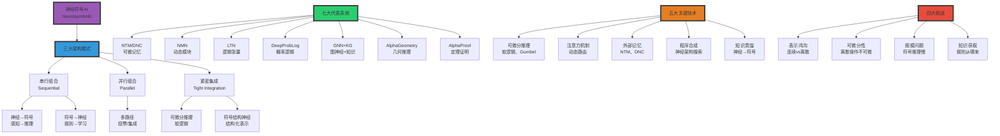

# 混合神经符号系统（Hybrid Neurosymbolic Systems）

> **文档版本**: v1.0.0
> **最后更新**: 2025-10-27
> **文档规模**: 1057行 | 神经符号融合系统
> **阅读建议**: 本文深入介绍神经网络与符号系统的融合架构、关键技术和应用前景

---

## 1 核心概念深度分析

<details>
<summary><b>🔗🧠 点击展开：神经符号融合全景深度解析</b></summary>

本节深入剖析神经符号AI的三大架构、七大代表系统、五大关键技术与未来愿景。

### 1 . 神经符号系统概念定义卡

**概念名称**: 神经符号AI（Neurosymbolic AI）

**内涵（本质属性）**:

**🔹 核心定义**:
神经符号AI是融合神经网络（学习、感知）与符号系统（推理、知识）的混合架构，旨在实现"可学习的推理"和"可推理的学习"。

$$
\text{神经符号AI} = \underbrace{\text{神经网络}}_{\text{学习、感知}} + \underbrace{\text{符号系统}}_{\text{推理、知识}} \Rightarrow \text{认知AI}
$$

**🔹 三大范式演进**:

| 时期 | 范式 | 核心方法 | 代表成就 | 核心局限 | 主导度 |
|------|------|---------|---------|---------|--------|
| **1950s-1980s<br/>第一波** | 符号主义 | 逻辑推理、专家系统 | MYCIN、Cyc | 知识瓶颈、脆弱 | 已衰落 |
| **1980s-2020s<br/>第二波** | 连接主义 | 神经网络、深度学习 | AlexNet、GPT | 黑盒、逻辑弱 | **当前主导** |
| **2010s-未来<br/>第三波** | 神经符号融合 | 混合架构 | AlphaGeometry | 工程复杂、规模受限 | **未来趋势** |

**外延（范围边界）**:

| 维度 | 神经符号包含 ✅ | 不包含 ❌ |
|------|--------------|----------|
| **架构** | NTM、DNC、LTN、GNN+KG | 纯神经、纯符号 |
| **技术** | 可微分推理、注意力机制 | 不可微符号、纯反向传播 |
| **应用** | VQA、常识推理、科学发现 | 纯感知、纯逻辑 |

**属性维度表**:

| 维度 | 神经网络 | 符号系统 | 神经符号融合 |
|------|---------|---------|------------|
| **学习能力** | ✅✅✅ 强 | ❌ 弱 | ✅✅✅ 强 |
| **推理能力** | ❌ 弱 | ✅✅✅ 强 | ✅✅✅ 强 |
| **可解释性** | ❌ 差 | ✅✅✅ 好 | ✅✅ 改进 |
| **数据需求** | 大 | 小 | 中等 |
| **鲁棒性** | ✅✅ 好 | ❌ 差 | ✅✅ 好 |
| **泛化能力** | ⚠️ 中 | ⚠️ 中 | ✅✅ 强（理想） |

---

### 2 . 神经符号融合架构全景图谱



---

### 3 . 神经符号三大架构模式对比

| 架构模式 | 耦合度 | 实现难度 | 性能 | 可解释性 | 代表系统 |
|---------|-------|---------|------|---------|---------|
| **串行组合<br/>Sequential** | 低（松耦合） | ⚠️ 低 | ⚠️⚠️ 中 | ✅✅✅ 好 | Neuro+Prolog |
| **并行组合<br/>Parallel** | 低（独立） | ⚠️ 低 | ⚠️⚠️ 中 | ✅✅ 较好 | 集成学习 |
| **紧密集成<br/>Tight** | 高（深度融合） | ⚠️⚠️⚠️⚠️ 高 | ✅✅✅ 高 | ✅✅ 较好 | NTM, LTN |

**详细分析**:

```yaml
1. 串行组合（Sequential）:

  方式1: 神经→符号
    - 流程: 神经感知 → 符号推理
    - 示例: 图像识别 → 逻辑推理
    - 优势: 模块化、易实现
    - 劣势: 误差传播、信息损失

  方式2: 符号→神经
    - 流程: 符号生成规则 → 神经学习
    - 示例: 物理公式 → 神经模拟
    - 优势: 知识注入
    - 劣势: 规则固化

  应用:
    - 医疗诊断: CNN识别影像 → 专家系统推理
    - 自动驾驶: 感知 → 规划

2. 并行组合（Parallel）:

  方式: 神经路径 ∥ 符号路径 → 融合
    - 两系统独立运行
    - 最后融合（投票、加权）

  优势:
    - 各司其职
    - 容错性高

  劣势:
    - 缺乏协同
    - 融合策略简单

  应用:
    - 集成学习
    - 多专家系统

3. 紧密集成（Tight Integration）:

  方式: 神经 ⊗ 符号（深度融合）

  三种实现:
    a. 可微分符号（Differentiable Symbolic）:
       - 软逻辑: 离散→连续松弛
       - Gumbel-Softmax: 可微分采样
       - 示例: Logic Tensor Networks

    b. 符号结构神经（Structured Neural）:
       - 神经网络遵循符号结构
       - 示例: Neural Module Networks, GNN

    c. 混合记忆（Hybrid Memory）:
       - 神经读写外部符号记忆
       - 示例: NTM, DNC

  优势:
    - 端到端可训练
    - 信息无缝流动

  劣势:
    - 工程复杂度高
    - 训练困难

  应用:
    - AlphaGeometry（IMO几何题）
    - AlphaProof（定理证明）
    - VQA（视觉问答）
```

---

### 4 . 七大代表神经符号系统深度对比

| 系统 | 年份 | 机构 | 核心思想 | 架构模式 | 突破 | 局限 | 成熟度 |
|------|------|------|---------|---------|------|------|--------|
| **NTM** | 2014 | DeepMind | 可微外部记忆 | 紧密集成 | 首个可微记忆 | 训练困难 | TRL 4 |
| **DNC** | 2016 | DeepMind | 改进NTM | 紧密集成 | 动态内存管理 | 仍难训练 | TRL 4-5 |
| **NMN** | 2016 | Berkeley | 动态模块组合 | 紧密集成 | 可解释VQA | 模块设计难 | TRL 5 |
| **LTN** | 2017 | Oxford | 逻辑张量网络 | 紧密集成 | 一阶逻辑可微 | 规模受限 | TRL 4 |
| **DeepProbLog** | 2018 | KU Leuven | 神经概率逻辑 | 紧密集成 | 概率推理 | 推理慢 | TRL 4 |
| **GNN+KG** | 2018+ | 多家 | 图神经+知识图谱 | 紧密集成 | 大规模知识 | 推理深度有限 | TRL 6-7 |
| **AlphaGeometry** | 2024 | DeepMind | 神经+符号几何 | 串行+紧密 | IMO金牌水平 | 特定领域 | TRL 6 |

**深度分析**:

```yaml
NTM/DNC（神经图灵机/可微神经计算机）:
  核心创新:
    - 外部记忆矩阵 M[N×W]
    - 注意力读写（可微寻址）
    - 控制器（LSTM/Transformer）

  数学:
    读: r_t = Σ w_t[i] · M[i]  (加权读取)
    写: M[i] ← M[i] · (1-w_t[i]·e) + w_t[i]·a  (擦除+写入)

  突破: 算法学习（复制、排序）

  局限:
    - 训练极困难（梯度消失）
    - 内存N限制（100-1000）
    - 慢（O(N²)注意力）

  影响: 启发Transformer、记忆网络

NMN（神经模块网络）:
  核心创新:
    - 动态组合神经模块
    - 模块: find, relate, and, ...
    - 根据问题动态构建计算图

  示例VQA:
    问题: "红色物体旁边有什么?"
    模块链: find(红色) → relate(旁边) → describe()

  优势: 高度可解释

  局限:
    - 模块设计需人工
    - 泛化能力有限

  后续: 自动模块发现（难）

LTN（逻辑张量网络）:
  核心创新:
    - 将一阶逻辑嵌入神经网络
    - 谓词 = 神经网络
    - 逻辑连接词 = 模糊逻辑算子

  数学:
    ∧(p,q) = min(p,q)  或  p·q
    ∨(p,q) = max(p,q)  或  p+q-p·q
    ¬p = 1-p
    ∀x:P(x) ≈ min_x P(x)  (软量词)

  优势: 知识注入

  局限:
    - 软逻辑非严格推理
    - 大规模推理慢

  应用: 常识推理、关系抽取

AlphaGeometry（2024突破）:
  架构:
    - 神经: 直觉模型（Transformer）
    - 符号: 演绎引擎（Prolog风格）
    - 协作: 神经生成猜想，符号验证

  成就:
    - IMO几何题: 25/30（金牌线~17）
    - 首次达人类金牌水平

  意义:
    - 证明神经符号可行
    - 但需大量合成数据（1亿题）

  局限:
    - 特定领域（几何）
    - 数据合成成本高

当前趋势（2024）:
  - 紧密集成成为主流
  - LLM+符号推理崛起
  - 自动规则学习关键
```

---

### 5 . 神经符号五大关键技术

| 技术 | 核心问题 | 解决方案 | 代表工作 | 成熟度 |
|------|---------|---------|---------|--------|
| **可微分推理** | 离散符号不可微 | 软逻辑、Gumbel-Softmax | LTN, DeepProbLog | ⚠️⚠️⚠️ |
| **注意力机制** | 动态选择 | Transformer注意力 | NTM, NMN | ✅✅✅ |
| **外部记忆** | 长期记忆 | 可微记忆矩阵 | NTM, DNC | ⚠️⚠️⚠️ |
| **程序合成** | 自动生成符号程序 | 神经架构搜索、RL | DreamCoder | ⚠️⚠️ |
| **知识蒸馏** | 神经→符号提取 | 规则提取算法 | TREPAN | ⚠️⚠️ |

**详细技术剖析**:

```yaml
1. 可微分推理（Differentiable Reasoning）:

  挑战: 符号操作（∧, ∨, ¬, ∀, ∃）是离散的
  → 无法反向传播梯度

  解法1: 软逻辑（Fuzzy/Soft Logic）
    - 将{True, False}松弛为[0,1]
    - ∧ → min或乘积
    - ∨ → max或和
    - 问题: 失去严格推理保证

  解法2: Gumbel-Softmax
    - 可微分采样离散分布
    - 温度退火: τ → 0 时趋近离散
    - 应用: 离散潜变量、组合优化

  解法3: REINFORCE（RL）
    - 将推理视为动作序列
    - 策略梯度估计
    - 问题: 高方差

  现状: 仍是核心挑战

2. 注意力机制（Attention）:

  作用: 动态选择相关信息

  在神经符号中:
    - NTM: 注意力读写内存
    - NMN: 注意力选择模块
    - Transformer: 自注意力

  数学:
    Attention(Q,K,V) = softmax(QK^T/√d)V

  突破: Transformer革命（2017）

3. 外部记忆（External Memory）:

  动机: RNN记忆容量有限

  NTM设计:
    - 记忆矩阵 M[N×W]
    - 寻址机制: 内容寻址 + 位置寻址
    - 可微读写

  DNC改进:
    - 动态内存分配
    - 时序链接矩阵
    - 更强寻址

  问题:
    - 训练极困难
    - O(N²)复杂度

  后续: Memory Networks, Transformer KV cache

4. 程序合成（Program Synthesis）:

  目标: 自动生成符号程序

  方法:
    a. 神经架构搜索（NAS）
       - 搜索计算图结构
       - RL或进化算法

    b. 神经程序合成
       - 输入输出→程序
       - 示例: DreamCoder, AlphaCode

    c. 归纳逻辑编程（ILP）
       - 从例子学习逻辑规则

  挑战: 组合爆炸、泛化

5. 知识蒸馏（Knowledge Distillation）:

  方向: 神经网络 → 符号规则

  方法:
    - 决策树近似
    - 规则提取算法（TREPAN, Eclaire）
    - LLM生成解释

  挑战:
    - 保真度 vs 简洁性权衡
    - 深度网络难以提取

  应用: 可解释AI、监管合规
```

---

### 6 . 神经符号应用领域矩阵

| 应用领域 | 神经部分 | 符号部分 | 融合方式 | 成功案例 | 成熟度 |
|---------|---------|---------|---------|---------|--------|
| **视觉问答(VQA)** | CNN视觉编码 | 逻辑推理 | NMN动态模块 | GQA, CLEVR | TRL 5-6 |
| **常识推理** | LLM + 知识图谱 | 逻辑规则 | GNN+KG | RoBERTa+COMET | TRL 4-5 |
| **科学发现** | 数据拟合 | 物理定律 | 符号回归 | AI Feynman | TRL 4-5 |
| **定理证明** | 神经引导 | 符号证明 | AlphaGeometry | IMO几何 | TRL 6 |
| **医疗诊断** | 影像识别 | 专家系统 | 串行组合 | IBM Watson? | TRL 5-6 |
| **机器人规划** | 感知 | PDDL规划 | 分层RL | 研究原型 | TRL 3-4 |
| **因果推理** | 数据驱动 | 因果图 | DoWhy+神经 | Microsoft DoWhy | TRL 4-5 |

**杀手级应用: AlphaGeometry（2024）**

```yaml
任务: IMO几何证明题
  - 国际数学奥林匹克
  - 金牌线: ~18/42分（几何6题）

架构:
  1. 符号演绎引擎（Symbolic Deductive Engine）:
     - 经典几何公理
     - 穷举式证明搜索
     - 快速但只能证明简单定理

  2. 神经语言模型（Neural Language Model）:
     - Transformer（1B参数）
     - 训练数据: 1亿合成几何题
     - 生成"有用的辅助构造"

  协作流程:
     Step 1: 符号引擎尝试证明
     Step 2: 若卡住 → 神经模型建议辅助线
     Step 3: 符号引擎继续
     循环直到证明完成

成绩:
  - IMO 2000-2022几何题: 25/30
  - 人类金牌平均: ~17/30
  - 首次超越人类奥赛金牌水平

关键创新:
  - 大规模合成数据（1亿题）
  - 神经"直觉" + 符号"严谨"
  - 协同而非替代

局限:
  - 特定领域（几何）
  - 数据合成成本极高
  - 无法直接泛化到其他数学分支

意义:
  - 证明神经符号路线可行
  - 但需大量领域知识+数据
```

---

### 1.7 🔟 核心洞察与终极评估

**五大核心定律**:

1. **互补定律**
   $$
   \text{神经}(\text{学习、感知}) + \text{符号}(\text{推理、知识}) = \text{认知AI}
   $$
   - 各有优势，融合更强

2. **表示鸿沟定律**
   $$
   \text{连续}(\text{神经}) \leftrightarrow \text{离散}(\text{符号})
   $$
   - 根本性障碍: 如何桥接？

3. **可微分困境定律**
   - 符号离散 → 不可微 → 难训练
   - 软化松弛 → 可微 → 失去严格性
   - 两难困境

4. **知识瓶颈定律**
   - 神经符号需符号知识
   - 符号知识从哪来？（人工 vs 自动学习）
   - AlphaGeometry: 1亿合成数据（成本极高）

5. **架构复杂度定律**
   $$
   \text{紧密集成度} \propto \text{工程复杂度}^2
   $$
   - 融合越紧密，实现越困难

**终极洞察**:

> **"神经符号AI是第三波AI的核心方向，旨在融合神经网络的学习能力与符号系统的推理能力。三大架构模式中，紧密集成（可微分推理）是最理想但也最困难的路线。2024年AlphaGeometry在IMO几何题上超越人类金牌水平，标志着神经符号首次在复杂推理任务上的重大突破。但其成功依赖1亿合成数据，凸显知识瓶颈问题。核心挑战仍未解决：①表示鸿沟（连续vs离散）②可微分困境（严格性vs可训练性）③知识获取（人工vs自动）④规模问题（符号推理的组合爆炸）。未来方向包括：自动规则发现、大规模常识推理、因果推理、认知架构。预测：神经符号将在2025-2030年成为主流，但完全融合的认知AI仍需10-20年。这不仅是技术问题，更是认知科学问题——人类智能本身就是感知（神经）与推理（符号）的融合。"**

**元认知**:

- **核心理念**: 融合学习与推理（神经+符号）
- **三大架构**: 串行（简单）、并行（独立）、紧密（理想）
- **关键突破**: AlphaGeometry（2024, IMO金牌）
- **核心挑战**: 表示鸿沟、可微分困境、知识瓶颈、规模问题
- **时间线**: 2025-2030主流化，完全认知AI需10-20年
- **哲学意义**: 模拟人类认知（感知+推理）
- **终极目标**: 认知AI（Cognitive AI）

</details>

---

## 📋 目录

- [混合神经符号系统（Hybrid Neurosymbolic Systems）](#混合神经符号系统hybrid-neurosymbolic-systems)
  - [1 核心概念深度分析](#1-核心概念深度分析)
    - [1 . 神经符号系统概念定义卡](#1--神经符号系统概念定义卡)
    - [2 . 神经符号融合架构全景图谱](#2--神经符号融合架构全景图谱)
    - [3 . 神经符号三大架构模式对比](#3--神经符号三大架构模式对比)
    - [4 . 七大代表神经符号系统深度对比](#4--七大代表神经符号系统深度对比)
    - [5 . 神经符号五大关键技术](#5--神经符号五大关键技术)
    - [6 . 神经符号应用领域矩阵](#6--神经符号应用领域矩阵)
    - [1.7 🔟 核心洞察与终极评估](#17--核心洞察与终极评估)
  - [📋 目录](#-目录)
  - [2 核心架构模式](#2-核心架构模式)
    - [1 . 串行组合（Sequential）](#1--串行组合sequential)
    - [2 . 并行组合（Parallel）](#2--并行组合parallel)
    - [3 . 紧密集成（Tight Integration）](#3--紧密集成tight-integration)
  - [3 代表性系统](#3-代表性系统)
    - [1 . Neural Turing Machines (NTM)](#1--neural-turing-machines-ntm)
    - [2 . Differentiable Neural Computers (DNC)](#2--differentiable-neural-computers-dnc)
    - [3 . Neural Module Networks (NMN)](#3--neural-module-networks-nmn)
    - [4 . Logic Tensor Networks (LTN)](#4--logic-tensor-networks-ltn)
    - [5 . DeepProbLog](#5--deepproblog)
    - [6 . Graph Neural Networks (GNN) + Knowledge Graphs](#6--graph-neural-networks-gnn--knowledge-graphs)
  - [4 关键技术](#4-关键技术)
    - [1 . 可微分推理](#1--可微分推理)
      - [1 软逻辑（Soft Logic）](#1-软逻辑soft-logic)
      - [2 Gumbel-Softmax](#2-gumbel-softmax)
    - [2 . 注意力机制](#2--注意力机制)
    - [3 . 记忆网络](#3--记忆网络)
    - [4 . 程序合成](#4--程序合成)
    - [5 . 知识蒸馏](#5--知识蒸馏)
  - [5 应用领域](#5-应用领域)
    - [1 . 视觉问答（VQA）](#1--视觉问答vqa)
    - [2 . 常识推理](#2--常识推理)
    - [3 . 规划与决策](#3--规划与决策)
    - [4 . 科学发现](#4--科学发现)
    - [5 . 医疗诊断](#5--医疗诊断)
  - [6 挑战与局限](#6-挑战与局限)
    - [1 . 技术挑战](#1--技术挑战)
      - [1.1 可微分性](#11-可微分性)
      - [1.2 规模](#12-规模)
      - [1.3 知识获取](#13-知识获取)
    - [2 . 概念挑战](#2--概念挑战)
      - [2.1 表示鸿沟](#21-表示鸿沟)
      - [2.2 学习 vs 推理](#22-学习-vs-推理)
    - [3 . 评估挑战](#3--评估挑战)
  - [7 未来方向](#7-未来方向)
    - [1 . 更强的融合](#1--更强的融合)
    - [2 . 自动规则发现](#2--自动规则发现)
    - [3 . 常识推理](#3--常识推理)
    - [4 . 因果推理](#4--因果推理)
    - [5 . 元学习](#5--元学习)
    - [6 . 认知架构](#6--认知架构)
  - [8 总结](#8-总结)
    - [1 核心要点](#1-核心要点)
    - [10.2 系统对比](#102-系统对比)
    - [10.3 哲学反思](#103-哲学反思)
    - [10.4 未来愿景](#104-未来愿景)
  - [参考文献](#参考文献)
    - [10.5 综述](#105-综述)
    - [10.6 代表系统](#106-代表系统)
    - [10.7 关键技术1](#107-关键技术1)
    - [10.8 应用](#108-应用)
    - [10.9 未来方向1](#109-未来方向1)
    - [10.10 其他](#1010-其他)
  - [导航 | Navigation](#导航--navigation)
  - [相关主题 | Related Topics](#相关主题--related-topics)
    - [10.11 本章节](#1011-本章节)
    - [10.12 相关章节](#1012-相关章节)
    - [10.13 跨视角链接](#1013-跨视角链接)

---


## 4 核心架构模式

### 1 . 串行组合（Sequential）

**架构**：

```text
神经网络 → 符号系统
```

或

```text
符号系统 → 神经网络
```

**例子**：

**模式1**：感知 → 推理

```text
图像 → CNN（识别物体） → 符号表示 → 逻辑推理 → 决策
```

**模式2**：规则 → 学习

```text
符号规则 → 指导神经网络训练
```

**优势**：

- ✅ 模块化
- ✅ 易于实现

**劣势**：

- ❌ 误差传播
- ❌ 不是端到端

### 2 . 并行组合（Parallel）

**架构**：

```text
         输入
          ↓
    ┌─────┴─────┐
    ↓           ↓
神经网络    符号系统
    ↓           ↓
    └─────┬─────┘
          ↓
       融合 → 输出
```

**例子**：

**集成方法**：

```text
神经网络预测 + 符号系统预测 → 加权融合
```

**优势**：

- ✅ 容错性（一个失败，另一个补救）
- ✅ 互相验证

**劣势**：

- ❌ 不充分交互
- ❌ 冗余计算

### 3 . 紧密集成（Tight Integration）

**架构**：

```text
神经网络 ⇄ 符号系统（双向交互）
```

**特点**：

- 神经网络嵌入符号表示
- 符号推理指导神经计算
- 端到端可微分（理想情况）

**例子**：

- 注意力机制 + 知识图谱
- 逻辑约束的神经网络
- 可微分推理

**优势**：

- ✅ 充分交互
- ✅ 端到端学习

**劣势**：

- ❌ 复杂
- ❌ 难以设计

---

## 5 代表性系统

### 1 . Neural Turing Machines (NTM)

**提出**：Graves et al., 2014

**思想**：

神经网络 + 外部存储器（类似图灵机纸带）

**架构**：

```text
控制器（神经网络）
    ↓
读写头（注意力机制）
    ↓
外部存储器（矩阵 M）
```

**读操作**：

```text
读向量 r = ∑ᵢ w(i) M(i)
```

其中 w(i) 是注意力权重。

**写操作**：

```text
M(i) ← M(i) × (1 - w(i)e) + w(i)a
```

其中 e 是擦除向量，a 是添加向量。

**能力**：

- ✅ 学习算法（如复制、排序）
- ✅ 可微分（端到端训练）

**局限**：

- ❌ 可解释性仍然有限
- ❌ 训练困难

**参考文献**：

- [Graves et al., 2014](https://arxiv.org/abs/1410.5401) - Neural Turing Machines

### 2 . Differentiable Neural Computers (DNC)

**提出**：Graves et al., 2016

**改进NTM**：

- 更复杂的存储器管理
- 动态分配
- 时序链接

**能力**：

- ✅ 图遍历
- ✅ 推理任务

**参考文献**：

- [Graves et al., 2016](https://www.nature.com/articles/nature20101) - Hybrid Computing using a Neural Network with Dynamic External Memory

### 3 . Neural Module Networks (NMN)

**提出**：Andreas et al., 2016

**思想**：

将问题分解为子模块，每个模块是一个神经网络。

**例子（视觉问答）**：

**问题**："图中红色物体的左边是什么？"

**模块组合**：

```text
find[red] → filter[left] → query[what]
    ↓           ↓              ↓
  CNN模块    空间模块       分类模块
```

**优势**：

- ✅ 模块化
- ✅ 组合泛化
- ✅ 部分可解释

**参考文献**：

- [Andreas et al., 2016](https://arxiv.org/abs/1511.02799) - Neural Module Networks: Deep Learning for Structured Domains

### 4 . Logic Tensor Networks (LTN)

**提出**：Serafini & Garcez, 2016

**思想**：

将一阶逻辑嵌入到张量空间。

**核心**：

- **常量** → 向量
- **谓词** → 神经网络（映射到[0,1]）
- **逻辑连接词** → 模糊逻辑操作

**例子**：

```text
谓词：friends(x, y)
表示：f_friends(𝒗_x, 𝒗_y) → [0, 1]
```

**逻辑规则**：

```text
∀x,y: friends(x, y) → friends(y, x)
```

转换为损失函数，通过梯度下降学习。

**优势**：

- ✅ 可微分逻辑
- ✅ 端到端学习

**参考文献**：

- [Serafini & Garcez, 2016](https://arxiv.org/abs/1606.04422) - Logic Tensor Networks: Deep Learning and Logical Reasoning from Data and Knowledge

### 5 . DeepProbLog

**提出**：Manhaeve et al., 2018

**思想**：

概率逻辑编程 + 神经网络

**架构**：

```text
神经网络 → 概率事实 → ProbLog推理 → 概率答案
```

**例子**：

```prolog
digit(X) :: nn_digit(X).  % 神经网络识别数字
sum(X, Y, Z) :- digit(X, DX), digit(Y, DY), Z is DX + DY.
```

**优势**：

- ✅ 结合逻辑推理和感知
- ✅ 概率推理

**参考文献**：

- [Manhaeve et al., 2018](https://arxiv.org/abs/1805.10872) - DeepProbLog: Neural Probabilistic Logic Programming

### 6 . Graph Neural Networks (GNN) + Knowledge Graphs

**思想**：

在知识图谱上进行神经网络推理。

**架构**：

```text
知识图谱（符号） → 嵌入（神经） → GNN推理 → 预测
```

**应用**：

- 知识图谱补全
- 关系推理
- 问答系统

**参考文献**：

- [Wikipedia: Graph Neural Network](https://en.wikipedia.org/wiki/Graph_neural_network)

---

## 6 关键技术

### 1 . 可微分推理

**挑战**：

符号操作（离散）不可微分 → 无法端到端训练

**解决方案**：

#### 1 软逻辑（Soft Logic）

**硬逻辑**：

```text
P ∧ Q：{0, 1}
```

**软逻辑**：

```text
P ∧ Q ≈ min(P, Q) 或 P × Q：[0, 1]
```

可微分！

#### 2 Gumbel-Softmax

**问题**：

离散采样不可微。

**Gumbel-Softmax**：

```text
z = softmax((log π + g) / τ)
```

其中 g 是Gumbel噪声，τ 是温度。

当 τ → 0 时，逼近离散采样，但仍可微。

**参考文献**：

- [Jang et al., 2017](https://arxiv.org/abs/1611.01144) - Categorical Reparameterization with Gumbel-Softmax

### 2 . 注意力机制

**作用**：

在神经网络中实现"软"符号查询。

**例子**：

```text
查询：Q（符号意图）
键：K（知识库）
值：V（知识内容）

注意力 = softmax(QK^T)V
```

**参考文献**：

- [Vaswani et al., 2017](https://arxiv.org/abs/1706.03762) - Attention Is All You Need

### 3 . 记忆网络

**思想**：

神经网络 + 外部知识库

**Memory Networks**：

```text
1. 输入 → 编码
2. 查询记忆（注意力）
3. 读取相关记忆
4. 推理 → 输出
```

**参考文献**：

- [Weston et al., 2015](https://arxiv.org/abs/1410.3916) - Memory Networks

### 4 . 程序合成

**思想**：

神经网络生成符号程序。

**Neural Program Synthesis**：

```text
输入输出例子 → 神经网络 → 程序（符号）
```

**应用**：

- 自动编程
- 规则提取

**参考文献**：

- [Balog et al., 2017](https://arxiv.org/abs/1611.01989) - DeepCoder: Learning to Write Programs

### 5 . 知识蒸馏

**思想**：

符号系统（教师） → 神经网络（学生）

或反向。

**应用**：

- 规则 → 神经网络
- 神经网络 → 规则（提取）

**参考文献**：

- [Hinton et al., 2015](https://arxiv.org/abs/1503.02531) - Distilling the Knowledge in a Neural Network

---

## 7 应用领域

### 1 . 视觉问答（VQA）

**任务**：

```text
图像 + 问题 → 答案
```

**神经符号方法**：

```text
图像 → CNN（感知） → 物体符号
问题 → 解析 → 逻辑查询
符号推理 → 答案
```

**例子**：

**问题**："图中有几个红色物体？"

```text
1. 感知：识别所有物体
2. 符号化：[物体1: 红色, 物体2: 蓝色, ...]
3. 推理：count(filter(物体, 颜色=红色))
4. 答案：2
```

**参考文献**：

- [Johnson et al., 2017](https://arxiv.org/abs/1705.03633) - CLEVR: A Diagnostic Dataset for Compositional Language and Elementary Visual Reasoning

### 2 . 常识推理

**任务**：

利用常识知识进行推理。

**神经符号方法**：

```text
文本 → 语义理解（神经网络）
     ↓
常识知识库（符号）
     ↓
推理（逻辑） → 结论
```

**例子**：

**问题**："水结冰后体积会怎样？"

```text
知识：水 → 冰（相变）
知识：冰的密度 < 水的密度
推理：密度小 → 体积大
答案：变大
```

### 3 . 规划与决策

**任务**：

从当前状态到目标状态的行动序列。

**神经符号方法**：

```text
感知（神经网络） → 状态符号
规划（符号推理） → 行动序列
执行（神经网络策略）
```

**应用**：

- 机器人规划
- 游戏AI

### 4 . 科学发现

**任务**：

从实验数据中发现科学规律。

**神经符号方法**：

```text
数据 → 神经网络（发现模式）
     ↓
符号规则提取
     ↓
科学定律（符号表达式）
```

**例子**：

- 物理定律发现
- 化学反应规则

**参考文献**：

- [Udrescu & Tegmark, 2020](https://arxiv.org/abs/1905.11481) - AI Feynman: A Physics-Inspired Method for Symbolic Regression

### 5 . 医疗诊断

**任务**：

症状 + 医学知识 → 诊断

**神经符号方法**：

```text
医学影像 → CNN（病变识别）
症状文本 → NLP（提取症状）
医学知识库 → 符号推理
     ↓
诊断 + 解释
```

**优势**：

- ✅ 高准确率（神经网络）
- ✅ 可解释（符号推理）
- ✅ 符合医学规范

---

## 8 挑战与局限

### 1 . 技术挑战

#### 1.1 可微分性

**问题**：

符号操作离散 → 不可微 → 难以端到端训练

**部分解决**：

- 软逻辑
- Gumbel-Softmax

**仍然困难**：

复杂逻辑推理的完全可微分化

#### 1.2 规模

**问题**：

- 符号推理：组合爆炸
- 神经网络：参数量大

**权衡**：

如何平衡两者？

#### 1.3 知识获取

**问题**：

仍需要符号知识（规则、本体）

**部分缓解**：

- 从数据中提取规则
- 利用预训练语言模型的知识

### 2 . 概念挑战

#### 2.1 表示鸿沟

**问题**：

神经表示（向量）⇄ 符号表示（离散）

如何无损双向转换？

**当前**：

- 向量 → 符号：聚类、离散化
- 符号 → 向量：嵌入

都有信息损失。

#### 2.2 学习 vs 推理

**问题**：

端到端学习 vs 模块化推理

**权衡**：

- 端到端：性能好，不可解释
- 模块化：可解释，误差传播

### 3 . 评估挑战

**问题**：

如何评估神经符号系统？

**维度**：

- 准确性
- 可解释性
- 泛化能力（组合泛化）
- 知识迁移
- 样本效率

**基准**：

- CLEVR（视觉推理）
- bAbI（文本推理）
- ARC（抽象推理）

**参考文献**：

- [Chollet, 2019](https://arxiv.org/abs/1911.01547) - On the Measure of Intelligence

---

## 9 未来方向

### 1 . 更强的融合

**目标**：

真正无缝的神经-符号集成。

**方向**：

- 统一表示（既可微分又可解释）
- 端到端可微分符号推理

### 2 . 自动规则发现

**目标**：

从数据中自动提取符号规则。

**方法**：

- 归纳逻辑编程
- 符号回归
- 程序合成

### 3 . 常识推理

**目标**：

让AI具备人类级别的常识。

**方法**：

- 大规模常识知识库（ConceptNet, Cyc）
- 从文本中学习常识
- 神经符号推理

**参考文献**：

- [Wikipedia: ConceptNet](https://en.wikipedia.org/wiki/ConceptNet)

### 4 . 因果推理

**目标**：

超越相关性，发现因果关系。

**神经符号方法**：

```text
神经网络（观察数据） + 因果图（符号）→ 因果推断
```

**参考文献**：

- [Pearl & Mackenzie, 2018](http://bayes.cs.ucla.edu/WHY/) - The Book of Why: The New Science of Cause and Effect

### 5 . 元学习

**目标**：

学习如何学习（学习归纳偏置）。

**神经符号元学习**：

```text
学习任务 → 神经网络（学习） + 符号系统（提取规律）→ 元知识
新任务 → 应用元知识 → 快速学习
```

### 6 . 认知架构

**目标**：

模拟人类认知的完整架构。

**例子**：

- SOAR
- ACT-R
- Sigma

**神经符号认知架构**：

结合神经网络的感知学习和符号系统的推理规划。

**参考文献**：

- [Laird, 2012](https://mitpress.mit.edu/9780262122962/the-soar-cognitive-architecture/) - The Soar Cognitive Architecture

---

## 10 总结

### 1 核心要点

1. **动机**：
   - 神经网络：强学习、弱推理
   - 符号系统：强推理、弱学习
   - 融合：两者之长

2. **架构模式**：
   - 串行：感知→推理 或 规则→学习
   - 并行：神经+符号 并行
   - 紧密集成：双向交互

3. **代表系统**：
   - NTM/DNC：神经网络+外部存储
   - NMN：模块化神经网络
   - LTN：逻辑张量网络
   - DeepProbLog：概率逻辑+神经网络

4. **关键技术**：
   - 可微分推理（软逻辑）
   - 注意力机制
   - 记忆网络
   - 程序合成

5. **应用**：
   - 视觉问答
   - 常识推理
   - 规划决策
   - 科学发现

6. **挑战**：
   - 可微分性
   - 表示鸿沟
   - 规模
   - 评估

7. **未来**：
   - 更强融合
   - 自动规则发现
   - 常识推理
   - 因果推理

### 10.2 系统对比

| 系统 | 神经组件 | 符号组件 | 集成方式 | 可微分 |
|------|---------|---------|---------|--------|
| **NTM** | 控制器 | 外部存储 | 注意力 | ✅ |
| **NMN** | 模块网络 | 模块组合 | 程序结构 | ✅ |
| **LTN** | 谓词网络 | 一阶逻辑 | 张量嵌入 | ✅ |
| **DeepProbLog** | 神经网络 | 逻辑程序 | 概率推理 | ✅ |
| **GNN+KG** | GNN | 知识图谱 | 图结构 | ✅ |

### 10.3 哲学反思

> **神经符号AI体现了一个深刻洞察：智能不是单一的，而是多面的。我们需要System 1（快速、直觉、神经）和System 2（慢速、理性、符号）的结合。**
> **也许人类智能的秘密，就在于大脑如何无缝集成这两种计算模式。神经符号AI是向这个目标的重要一步。**

### 10.4 未来愿景

**终极目标**：

```text
通用人工智能（AGI）=
  感知（神经网络）
  + 学习（神经网络）
  + 推理（符号系统）
  + 规划（符号系统）
  + 元认知（神经符号融合）
```

**实现路径**：

1. **短期**：特定领域的神经符号系统
2. **中期**：通用神经符号架构
3. **长期**：完整认知架构

---

## 参考文献

### 10.5 综述

1. [Wikipedia: Neurosymbolic AI](https://en.wikipedia.org/wiki/Neurosymbolic_AI)
2. [Garcez et al., 2019](https://arxiv.org/abs/1905.06088) - Neural-Symbolic Computing: An Effective Methodology
3. [Marcus, 2020](https://arxiv.org/abs/2003.08485) - The Next Decade in AI: Four Steps Towards Robust Artificial Intelligence

### 10.6 代表系统

1. [Graves et al., 2014](https://arxiv.org/abs/1410.5401) - Neural Turing Machines
2. [Graves et al., 2016](https://www.nature.com/articles/nature20101) - Differentiable Neural Computers
3. [Andreas et al., 2016](https://arxiv.org/abs/1511.02799) - Neural Module Networks
4. [Serafini & Garcez, 2016](https://arxiv.org/abs/1606.04422) - Logic Tensor Networks
5. [Manhaeve et al., 2018](https://arxiv.org/abs/1805.10872) - DeepProbLog

### 10.7 关键技术1

1. [Vaswani et al., 2017](https://arxiv.org/abs/1706.03762) - Attention Is All You Need
2. [Jang et al., 2017](https://arxiv.org/abs/1611.01144) - Categorical Reparameterization with Gumbel-Softmax
3. [Weston et al., 2015](https://arxiv.org/abs/1410.3916) - Memory Networks
4. [Hinton et al., 2015](https://arxiv.org/abs/1503.02531) - Distilling the Knowledge in a Neural Network
5. [Balog et al., 2017](https://arxiv.org/abs/1611.01989) - DeepCoder: Learning to Write Programs

### 10.8 应用

1. [Johnson et al., 2017](https://arxiv.org/abs/1705.03633) - CLEVR Dataset
2. [Udrescu & Tegmark, 2020](https://arxiv.org/abs/1905.11481) - AI Feynman

### 10.9 未来方向1

1. [Chollet, 2019](https://arxiv.org/abs/1911.01547) - On the Measure of Intelligence
2. [Pearl & Mackenzie, 2018](http://bayes.cs.ucla.edu/WHY/) - The Book of Why
3. [Wikipedia: ConceptNet](https://en.wikipedia.org/wiki/ConceptNet)
4. [Laird, 2012](https://mitpress.mit.edu/9780262122962/the-soar-cognitive-architecture/) - The Soar Cognitive Architecture

### 10.10 其他

1. [Wikipedia: Graph Neural Network](https://en.wikipedia.org/wiki/Graph_neural_network)

---

_本文档全面阐述了混合神经符号系统的理论基础、核心技术和代表性工作，为理解AI的未来发展方向提供了重要视角。_

---

## 导航 | Navigation

**上一篇**: [← 06.4 演绎vs归纳推理](./06.4_Deductive_vs_Inductive_Reasoning.md)
**下一篇**: [07.1 中文房间论证 →](../07_AI_Philosophy/07.1_Chinese_Room_Argument.md)
**返回目录**: [↑ AI模型视角总览](../README.md)

---

## 相关主题 | Related Topics

### 10.11 本章节

- [06.1 符号vs连接主义](./06.1_Symbolic_AI_vs_Connectionist_AI.md)
- [06.2 规则驱动vs数据驱动](./06.2_Rule_Driven_vs_Data_Driven.md)
- [06.3 离散vs连续计算](./06.3_Discrete_vs_Continuous_Computation.md)
- [06.4 演绎vs归纳推理](./06.4_Deductive_vs_Inductive_Reasoning.md)

### 10.12 相关章节

- [02.3 图灵完备性分析](../02_Neural_Network_Theory/02.3_Turing_Completeness_Analysis.md)

### 10.13 跨视角链接

- [Software_Perspective](../../Software_Perspective/README.md)
- [概念交叉索引（七视角版）](../../CONCEPT_CROSS_INDEX.md) - 查看相关概念的七视角分析：
  - [DIKWP模型](../../CONCEPT_CROSS_INDEX.md#61-dikwp模型-七视角) - 知识表示的五层模型
  - [Gold可学习性理论](../../CONCEPT_CROSS_INDEX.md#91-gold可学习性-gold-learnability-theory-七视角) - 形式语言学习的理论限制
  - [图灵完备性](../../CONCEPT_CROSS_INDEX.md#191-图灵完备性-turing-completeness-七视角) - 计算能力的理论基础
