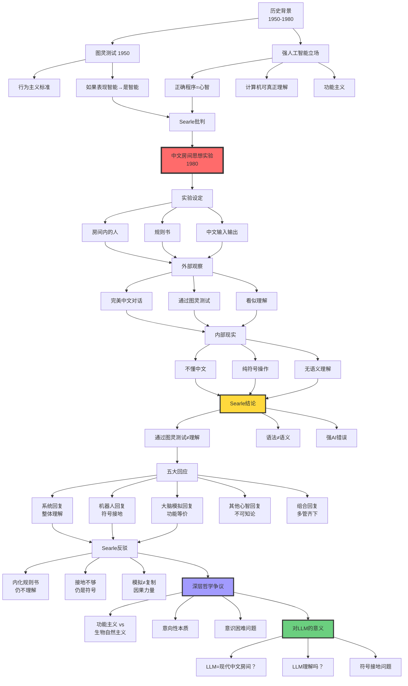
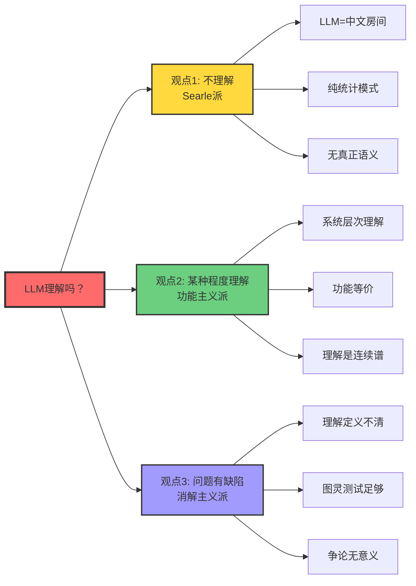

# 中文房间论证（Chinese Room Argument）

> **文档版本**: v1.0.0  
> **最后更新**: 2025-10-27  
> **文档规模**: 634行 | AI哲学经典思想实验  
> **阅读建议**: 本文深入分析Searle的中文房间论证及其对大语言模型理解能力的哲学启示

---

## 核心概念深度分析

<details>
<summary><b>🏠🤔 点击展开：中文房间论证哲学深度分析与LLM理解问题</b></summary>

本节深入剖析Searle的中文房间论证，揭示"理解"的本质、语法与语义的鸿沟，以及这对评估大语言模型能力的深刻哲学意义。

### 1️⃣ 中文房间论证概念定义卡

**概念名称**: 中文房间论证（Chinese Room Argument）

**内涵（本质属性）**:

**🔹 核心论证**:
Searle (1980) 提出的反驳强人工智能（Strong AI）的思想实验：

**论证结构**:
$$
\begin{align}
\text{前提1}: &\quad \text{房间通过图灵测试（行为等价）} \\
\text{前提2}: &\quad \text{房间内的人不理解中文（无语义）} \\
\text{结论}: &\quad \text{通过图灵测试} \neq \text{真正理解}
\end{align}
$$

**🔹 三个核心区分**:

| 区分 | A | B | Searle主张 |
|------|---|---|-----------|
| **强AI vs 弱AI** | 计算机=心智 | 计算机模拟心智 | 只有弱AI可能 |
| **语法 vs 语义** | 符号操作 | 符号意义 | 语法≠语义 |
| **内在 vs 派生意向性** | 固有"关于性" | 外部赋予 | AI仅有派生 |

**🔹 思想实验组件**:

| 组件 | 描述 | 类比 |
|------|------|------|
| **房间内的人** | 不懂中文，只会操作符号 | CPU |
| **规则书** | 符号操作指令（英语） | 程序 |
| **输入** | 中文问题（纸条） | 输入数据 |
| **输出** | 中文答案（正确） | 输出结果 |
| **外部观察** | 完美通过图灵测试 | LLM行为 |
| **内部现实** | 纯符号操作，无语义理解 | 矩阵运算 |

**外延（范围边界）**:

| 维度 | 包含 ✅ | 不包含 ❌ |
|------|---------|----------|
| **目标** | 反驳强AI | 不反驳弱AI |
| **论证范围** | 纯符号操作系统 | 具身机器人（部分） |
| **针对** | 功能主义、计算主义 | 神经科学、物理主义 |
| **争论点** | 理解的本质 | 智能行为的有用性 |

**属性维度表**:

| 维度 | 值/描述 | 说明 |
|------|---------|------|
| **提出者** | John Searle | 伯克利大学哲学家 |
| **提出时间** | 1980 | Minds, Brains, and Programs |
| **哲学立场** | 生物自然主义 | 意识需要生物"因果力量" |
| **核心主张** | 语法≠语义 | 符号操作不足以产生理解 |
| **影响力** | ⚠️⚠️⚠️⚠️⚠️ 极高 | AI哲学最著名论证 |
| **争议性** | ⚠️⚠️⚠️⚠️⚠️ 极高 | 至今未解决 |
| **对LLM意义** | ⚠️⚠️⚠️⚠️⚠️ 极高 | 直击理解核心 |

---

### 2️⃣ 中文房间论证全景结构图



---

### 3️⃣ 强AI vs 弱AI立场详细对比

| 维度 | 强人工智能（Strong AI） | 弱人工智能（Weak AI） | Searle立场 |
|------|----------------------|-------------------|-----------|
| **本体论主张** | 计算机**就是**心智 | 计算机**模拟**心智 | ✅ 仅弱AI |
| **理解** | 程序真正理解 | 程序假装理解 | 无真正理解 |
| **意识** | 程序可有意识 | 程序无意识 | 需要生物基础 |
| **意向性** | 内在意向性 | 仅派生意向性 | 计算机仅派生 |
| **图灵测试** | 通过=有心智 | 通过≠有心智 | 行为≠本质 |
| **功能主义** | ✅ 功能决定心智 | ❌ 功能不够 | 需因果力量 |
| **计算主义** | 心智=计算 | 心智≠计算 | 心智>计算 |
| **哲学基础** | 功能主义、行为主义 | 工具主义 | 生物自然主义 |
| **实例** | AGI、有意识AI | 当前所有AI系统 | 所有现有AI |
| **支持者** | Dennett, Hofstadter | Searle, Penrose | Searle本人 |

**关键争论焦点**:

$$
\begin{align}
\text{强AI主张}: &\quad \text{正确程序} \Rightarrow \text{理解} \\
\text{中文房间反驳}: &\quad \text{正确程序} + \text{正确输出} \nRightarrow \text{理解}
\end{align}
$$

---

### 4️⃣ 五大回应与Searle反驳详细矩阵

| 回应 | 核心论点 | 支持者 | Searle反驳 | 评价 | 对LLM意义 |
|------|---------|--------|-----------|------|----------|
| **系统回复** | 整个系统（人+规则+房间）理解中文 | 功能主义者 | 让人内化规则，仍不理解 | ⚠️⚠️⚠️ 强力回应 | LLM作为系统可能理解？ |
| **机器人回复** | 具身+感知接地→理解 | Harnad | 加传感器仍是符号操作 | ⚠️⚠️ 部分有效 | 多模态LLM更接近理解？ |
| **大脑模拟** | 模拟大脑→必有理解 | 功能等价论 | 模拟≠复制，需因果力量 | ⚠️ 哲学僵局 | 神经形态AI？ |
| **其他心智** | 我们也无法证明他人理解 | 认识论挑战 | 这是不可知论，非答案 | ❌ 回避问题 | 不适用 |
| **组合回复** | 系统+接地+学习→理解 | 折衷主义 | 仍是符号操作堆叠 | ⚠️⚠️ 最强组合 | 具身LLM+RLHF？ |

**系统回复深入分析**:

```yaml
系统回复核心:
  论点: "理解"是系统层次的涌现属性
  类比: 
    - 单个神经元不理解，大脑理解
    - 单个蚂蚁不智能，蚁群智能
  
Searle反驳（内化论证）:
  场景: 让人记住所有规则
  结果: 人=系统，但人仍不理解
  关键: 内化不改变符号操作本质

问题:
  - 人真的能内化所有规则吗？（实现可能性）
  - 内化后人=系统吗？（同一性问题）
  - 涌现是实在的吗？（本体论）

对LLM:
  如果LLM的"理解"是系统层次的涌现
  那么询问单个神经元是否理解=类别错误
```

**机器人回复与符号接地**:

$$
\begin{align}
\text{符号接地问题（Harnad）}: &\quad \text{符号} \xrightarrow{\text{感知}} \text{世界} \\
\text{机器人回复}: &\quad \text{房间+传感器} \Rightarrow \text{接地} \Rightarrow \text{语义} \\
\text{Searle反驳}: &\quad \text{传感器输入} = \text{新符号} \Rightarrow \text{仍无语义}
\end{align}
$$

---

### 5️⃣ 对大语言模型的深刻意义分析

**LLM作为现代中文房间**:

| 维度 | 原版中文房间 | 大语言模型 | 相似度 |
|------|------------|-----------|--------|
| **符号操作** | 人按规则操作汉字 | Transformer矩阵运算 | ✅✅✅ 高 |
| **规则书** | 英语指令手册 | 权重矩阵$W$ | ✅✅✅ 高 |
| **输入输出** | 中文问答 | 自然语言文本 | ✅✅✅ 高 |
| **外部观察** | 完美对话 | 流畅回答 | ✅✅✅ 高 |
| **内部过程** | 不懂中文 | 矩阵运算 | ✅✅✅ 高 |
| **训练方式** | 规则预设 | 数据驱动学习 | ⚠️ 中等 |
| **规模** | 人能执行 | 1750亿参数 | ❌ 低 |
| **具身性** | 无 | 无（纯文本） | ✅✅✅ 高 |

**关键区别**:

```yaml
中文房间:
  - 规则是预设的（演绎）
  - 人执行规则
  - 静态系统

LLM:
  - 规则是学习的（归纳）
  - 神经网络执行
  - 动态优化

是否改变本质？
  Searle派: 否，仍是符号操作
  功能主义: 是，学习=理解的基础
```

**LLM"理解"吗？三派观点**:



**详细论证**:

**1️⃣ 不理解派（Searle）**:

$$
\begin{align}
&\text{LLM行为} = f(\text{输入}; W) \quad \text{（纯计算）} \\
&\text{无内在意向性} \Rightarrow \text{无真正理解} \\
&\text{证据}: \text{长度泛化失败、幻觉、无常识}
\end{align}
$$

**2️⃣ 某种理解派（功能主义）**:

- **理解是连续谱**: LLM有"浅层理解"
- **涌现**: 规模→质变（GPT-3.5→GPT-4）
- **功能等价**: 如果行为等价，何必纠结内部？

**3️⃣ 消解派（Wittgenstein风格）**:

- **"理解"是家族相似概念**: 无严格定义
- **语言游戏**: LLM玩"理解游戏"足够
- **实用主义**: 有用就行，别问本质

---

### 6️⃣ 语法vs语义：核心鸿沟分析

| 层面 | 语法（Syntax） | 语义（Semantics） | 鸿沟 |
|------|--------------|-----------------|------|
| **定义** | 符号的形式规则 | 符号的意义、指称 | 形式→意义？ |
| **例子** | "猫在垫子上"的语法结构 | "猫"指真实的猫 | 如何关联？ |
| **中文房间** | 规则书定义的操作 | 符号的中文意义 | 房间内的人无语义 |
| **LLM** | Transformer矩阵运算 | 词语的真实指称 | 矩阵如何产生意义？ |
| **形式化** | $s_1 \to s_2$（重写规则） | $\llbracket s \rrbracket = o$（指称） | 计算→指称？ |
| **Searle主张** | 可形式化 | 不可纯计算化 | **根本鸿沟** |

**Searle核心论断**:

$$
\boxed{\text{语法} \nRightarrow \text{语义}}
$$

**理由**: 相同语法可有不同语义，语法无法唯一确定语义。

**反例（Quine不确定性）**:

```yaml
句子: "Gavagai"
语法: 名词
可能语义:
  1. 兔子（整体）
  2. 兔子阶段（时间切片）
  3. 未剥离的兔皮
  ...

结论: 语法不确定语义
```

**对LLM的意义**:

- LLM学习的是**共现模式**（语法++）
- 是否学到**真实指称**（语义）？存疑
- **符号接地**是关键：如何将符号连接到世界？

---

### 7️⃣ 意向性层次与AI定位

**意向性分类（Dennett）**:

| 层次 | 意向性类型 | 特征 | 例子 | AI状态 |
|------|----------|------|------|--------|
| **0阶** | 无意向性 | 纯物理因果 | 石头、钟表 | ✅ 传统程序 |
| **1阶** | 一阶意向性 | 信念、欲望 | 动物：猫相信有老鼠 | ⚠️ LLM？ |
| **2阶** | 二阶意向性 | 关于信念的信念 | 狗：我相信主人相信我饿了 | ❌ LLM |
| **高阶** | 多层意向性 | 递归嵌套 | 人类：我知道你知道我知道... | ❌ LLM |

**内在vs派生意向性**:

$$
\begin{align}
\text{内在意向性}: &\quad \text{固有"关于性"，不依赖外部解释} \\
&\quad \text{例}: \text{人的信念} \\
\text{派生意向性}: &\quad \text{外部赋予"关于性"} \\
&\quad \text{例}: \text{书本文字、计算机符号}
\end{align}
$$

**Searle主张**: 
$$
\boxed{\text{AI最多只有派生意向性}}
$$

**争议点**:
- **功能主义反驳**: 派生vs内在的区分不清晰
- **涌现论反驳**: 足够复杂的派生可涌现为内在？

---

### 8️⃣ 功能主义vs生物自然主义哲学对决

| 维度 | 功能主义 | 生物自然主义（Searle） |
|------|---------|---------------------|
| **核心主张** | 心智=功能组织 | 心智需要生物"因果力量" |
| **多重可实现** | ✅ 硅可实现心智 | ❌ 必须是生物基质 |
| **计算主义** | 心智=计算 | 心智>计算 |
| **意识** | 功能决定 | 生物过程产生 |
| **理解** | 正确输入输出=理解 | 需要内在语义 |
| **类比** | 心智:大脑 = 软件:硬件 | 心智不可脱离大脑 |
| **AI可能性** | ✅ 强AI可能 | ❌ 仅弱AI |
| **支持者** | Putnam, Dennett | Searle, Nagel |

**功能主义核心**:

$$
\text{心智状态} = \text{功能角色（输入→状态→输出）}
$$

**例子**: "疼痛" = 特定输入（受伤）→状态→输出（呻吟）

**生物自然主义核心**:

$$
\text{心智} = \text{大脑的生物过程产生的因果力量}
$$

**关键概念"因果力量"（Causal Powers）**:

```yaml
Searle主张:
  大脑有特殊的因果力量（生物性质）
  这些力量产生意识和理解
  硅基计算机缺乏这些力量
  
问题:
  什么是"因果力量"？（定义不清）
  为何碳基可以，硅基不行？（基质沙文主义？）
  如果精确模拟大脑呢？（仍不行）
```

**深层争论**:

$$
\begin{align}
\text{功能主义}: &\quad \text{组织结构决定心智} \\
\text{生物自然主义}: &\quad \text{物理基质+组织结构决定心智}
\end{align}
$$

---

### 9️⃣ 中文房间论证的现代挑战与演进

**对Searle论证的现代质疑**:

| 质疑 | 论点 | 评价 |
|------|------|------|
| **规模论证** | GPT-4规模>>人脑理解规则，质变？ | ⚠️⚠️ 有力 |
| **涌现论证** | 大规模→涌现能力（COT, ICL） | ⚠️⚠️⚠️ 强力 |
| **多模态论证** | GPT-4V看图→部分接地？ | ⚠️⚠️ 中等 |
| **具身论证** | 机器人+LLM→真实交互 | ⚠️⚠️ 中等 |
| **实用论证** | 有用就行，何必纠结本质？ | ⚠️ 哲学回避 |

**涌现能力对中文房间的挑战**:

```yaml
现象:
  GPT-3.5 → GPT-4: 显著质变
    - Chain-of-Thought推理
    - In-Context Learning
    - Few-shot泛化
  
问题:
  这些是"理解的萌芽"还是"更复杂的符号操作"？
  
Searle派:
  仍是符号操作，只是更复杂
  
功能主义派:
  涌现=理解的标志
  规模×复杂度→质变
```

**中文房间2.0：具身多模态LLM**:

$$
\begin{align}
\text{中文房间1.0}: &\quad \text{纯文本（房间）} \\
\text{中文房间2.0}: &\quad \text{文本+视觉+具身（机器人）}
\end{align}
$$

**是否改变本质**？

- **Searle派**: 否，加传感器仍是符号操作
- **接地派**: 是，感知→语义
- **折衷派**: 部分改善，但不充分

---

### 🔟 核心洞察与哲学启示

**五大哲学洞察**:

1. **语法-语义鸿沟定律**
   $$
   \text{形式操作} \nRightarrow \text{意义理解}
   $$
   - 中文房间核心
   - 符号接地问题根源

2. **行为-本质分离定律**
   $$
   \text{通过图灵测试} \neq \text{真正理解}
   $$
   - 批判行为主义
   - 外部行为≠内部状态

3. **系统涌现悖论**
   $$
   \text{部分不理解} \xrightarrow{？} \text{整体理解}
   $$
   - 最强回应vs最强反驳
   - 涌现的本体论地位

4. **基质独立性争议**
   $$
   \text{功能主义}: \text{基质无关} \quad \text{vs} \quad \text{Searle}: \text{生物基质必要}
   $$
   - AI哲学核心争论
   - 仍未解决

5. **理解连续谱假说**
   $$
   \text{理解} \neq \text{二元（有/无）}, \quad \text{而是连续谱}
   $$
   - 消解绝对主义
   - LLM有"某种程度"理解？

**对AI研究的实践启示**:

```yaml
启示1_符号接地优先:
  认知: 纯文本LLM缺乏真实接地
  行动: 发展多模态、具身AI
  例子: GPT-4V, 机器人+LLM

启示2_功能测试不够:
  认知: 通过基准测试≠真正理解
  行动: 设计探测深层理解的任务
  例子: 反事实推理、因果理解

启示3_混合架构方向:
  认知: 纯神经难有真正语义
  行动: 神经+符号混合
  例子: LLM+知识图谱

启示4_谦逊态度:
  认知: 我们还不理解"理解"
  行动: 避免过度宣称AI能力
  例子: 承认LLM局限

启示5_哲学继续重要:
  认知: 技术进步不能回避哲学问题
  行动: 跨学科对话（AI+哲学）
  例子: AI伦理、AI意识研究
```

**终极洞察**:

> **"中文房间论证揭示的不是AI不可能，而是我们对'理解'本质的无知。它不是结束讨论的论证，而是开始深入思考的起点。LLM的成功既不证明也不反驳Searle，而是把争论推向更深层次：如果GPT-4在实用层面'足够理解'，我们还需要纠结哲学上的'真正理解'吗？答案取决于我们的目标——是追求哲学真理，还是构建有用系统？也许，这本身就是个错误的二分法。"**

**元认知**:
- **中文房间≠反AI**: Searle反对强AI，不反对弱AI
- **争论未解决**: 功能主义vs生物自然主义仍是僵局
- **LLM是新挑战**: 超越Searle 1980年想象
- **实用vs理论**: 工程成功≠哲学问题解决
- **理解的本质**: 也许是错误的问题（Wittgenstein）
- **保持开放**: 未来AI可能超越当前哲学框架

</details>

---

## 目录 | Table of Contents

- [中文房间论证（Chinese Room Argument）](#中文房间论证chinese-room-argument)
  - [目录 | Table of Contents](#目录--table-of-contents)
  - [概述](#概述)
  - [历史背景](#历史背景)
    - [强人工智能 vs 弱人工智能](#强人工智能-vs-弱人工智能)
  - [中文房间思想实验](#中文房间思想实验)
    - [实验设定](#实验设定)
    - [形式化描述](#形式化描述)
  - [塞尔的核心论证](#塞尔的核心论证)
    - [三段论](#三段论)
    - [语法 vs 语义](#语法-vs-语义)
    - [意向性（Intentionality）](#意向性intentionality)
  - [对论证的主要回应](#对论证的主要回应)
    - [1. 系统回复（Systems Reply）](#1-系统回复systems-reply)
    - [2. 机器人回复（Robot Reply）](#2-机器人回复robot-reply)
    - [3. 大脑模拟回复（Brain Simulator Reply）](#3-大脑模拟回复brain-simulator-reply)
    - [4. 其他系统回复（Other Minds Reply）](#4-其他系统回复other-minds-reply)
    - [5. 组合回复（Combination Reply）](#5-组合回复combination-reply)
  - [对大语言模型的意义](#对大语言模型的意义)
    - [大语言模型是"中文房间"吗？](#大语言模型是中文房间吗)
      - [相似之处](#相似之处)
      - [关键区别](#关键区别)
    - [大语言模型"理解"吗？](#大语言模型理解吗)
      - [观点1：不理解（塞尔派）](#观点1不理解塞尔派)
      - [观点2：某种程度上理解（功能主义派）](#观点2某种程度上理解功能主义派)
      - [观点3：问题本身有缺陷（消解主义派）](#观点3问题本身有缺陷消解主义派)
    - [中文房间的现代版本](#中文房间的现代版本)
  - [哲学争议的核心](#哲学争议的核心)
    - [功能主义 vs 生物自然主义](#功能主义-vs-生物自然主义)
    - [语义的本质](#语义的本质)
    - [意识的困难问题（Hard Problem of Consciousness）](#意识的困难问题hard-problem-of-consciousness)
  - [实践意义](#实践意义)
    - [对AI开发的启示](#对ai开发的启示)
    - [对AI伦理的影响](#对ai伦理的影响)
    - [对AI研究方向的指导](#对ai研究方向的指导)
  - [总结](#总结)
    - [中文房间论证的要点](#中文房间论证的要点)
    - [对大语言模型的意义1](#对大语言模型的意义1)
    - [哲学争论的核心](#哲学争论的核心)
    - [一句话总结](#一句话总结)
  - [延伸阅读](#延伸阅读)
    - [核心文献](#核心文献)
    - [Wikipedia和百科全书条目](#wikipedia和百科全书条目)

---

## 概述

**中文房间论证**是美国哲学家约翰·塞尔（John Searle）在1980年提出的思想实验，旨在反驳**强人工智能**（Strong AI）的主张。

**核心问题**：
> **运行正确程序的计算机是否真正"理解"它所处理的符号？**

这个论证至今仍是AI哲学中最具争议的话题之一，对理解大语言模型的本质具有重要意义。

**参考文献**：

- [Searle, 1980](https://www.cambridge.org/core/journals/behavioral-and-brain-sciences/article/abs/minds-brains-and-programs/DC644B47A4299C637C89772FACC2706A) - Minds, Brains, and Programs
- [Wikipedia: Chinese Room](https://en.wikipedia.org/wiki/Chinese_room)
- [Stanford Encyclopedia: Chinese Room Argument](https://plato.stanford.edu/entries/chinese-room/)

## 历史背景

### 强人工智能 vs 弱人工智能

**强人工智能（Strong AI）**：

- 正确编程的计算机不仅是**模拟**心智，而是**就是**心智
- 计算机可以真正**理解**、**思考**、**有意识**

**弱人工智能（Weak AI）**：

- 计算机只是有用的工具，**模拟**心智过程
- 没有真正的理解或意识

**图灵测试的不足**：

艾伦·图灵（1950）提出：
> **如果机器的行为与智能人类无法区分，我们就应该说它是智能的。**

塞尔认为：**行为等价不蕴含心智等价**。

**参考文献**：

- [Turing, 1950](https://academic.oup.com/mind/article/LIX/236/433/986238) - Computing Machinery and Intelligence
- [Wikipedia: Turing Test](https://en.wikipedia.org/wiki/Turing_test)
- [Wikipedia: Philosophy of Artificial Intelligence](https://en.wikipedia.org/wiki/Philosophy_of_artificial_intelligence)

## 中文房间思想实验

### 实验设定

想象以下场景：

1. **房间**：封闭的房间
2. **人**：只懂英语的人（Searle自己）
3. **规则书**：用英语写的规则，告诉如何操作中文符号
4. **输入**：房间外的人递进中文问题（纸条）
5. **处理**：房间内的人根据规则书操作符号
6. **输出**：房间内的人递出中文答案

**关键点**：

- 规则书足够完善，使得输出的中文答案完全正确
- 从外部看，房间"理解"中文
- 但房间内的人**完全不懂中文**，只是机械地操作符号

### 形式化描述

**系统组成**：

```text
S = (Person, RuleBook, Input, Output)
```

**Person**:

- 不懂中文
- 只会按规则操作符号

**RuleBook**:

- 形式：if (符号串 X) then (输出符号串 Y)
- 完全用英语描述
- 相当于一个图灵完备的程序

**行为**:

```text
Input(中文问题) → Person + RuleBook → Output(中文答案)
```

**外部观察**：

- 输入输出完全正确
- 通过图灵测试（中文版）
- 表现得像懂中文

**内部现实**：

- Person 不懂中文
- RuleBook 不懂中文
- 只有符号操作，无语义理解

**参考文献**：

- [Searle, 1980](https://www.cambridge.org/core/journals/behavioral-and-brain-sciences/article/abs/minds-brains-and-programs/DC644B47A4299C637C89772FACC2706A) - 原始论文

## 塞尔的核心论证

### 三段论

**前提1**：程序的本质是**形式符号操作**（syntax）
**前提2**：**语法**不足以构成**语义**（semantics）
**前提3**：心智有**语义内容**（理解、意向性）

**结论**：程序本身不能产生心智

### 语法 vs 语义

| 层面 | 语法（Syntax） | 语义（Semantics） |
|-----|--------------|-----------------|
| **定义** | 符号及其操作规则 | 符号的意义和指称 |
| **例子** | "猫"这个符号的形状 | "猫"指向现实中的动物 |
| **计算机** | ✅ 处理语法 | ❓ 是否有语义？ |
| **人类** | ✅ 处理语法 | ✅ 理解语义 |

**塞尔的主张**：

> **语法（形式符号操作）本质上不足以产生语义（理解、意向性）。**

**参考文献**：

- [Wikipedia: Syntax (logic)](https://en.wikipedia.org/wiki/Syntax_(logic))
- [Wikipedia: Semantics](https://en.wikipedia.org/wiki/Semantics)
- [Wikipedia: Intentionality](https://en.wikipedia.org/wiki/Intentionality)

### 意向性（Intentionality）

**定义**：
> **意向性是心智状态"关于"某物的性质。**

**例子**：

- 信念"猫在垫子上" → 关于猫和垫子
- 欲望"想喝水" → 关于水
- 感知"看见红色" → 关于红色

**内在意向性 vs 派生意向性**：

| 类型 | 内在意向性 | 派生意向性 |
|-----|-----------|-----------|
| **定义** | 固有的"关于性" | 从外部赋予的"关于性" |
| **例子** | 人的信念 | 书本中的文字 |
| **特性** | 不依赖于他人解释 | 依赖于他人赋予意义 |

**塞尔的主张**：

> **计算机最多只有派生意向性（由程序员或用户赋予），没有内在意向性。**

**参考文献**：

- [Stanford Encyclopedia: Intentionality](https://plato.stanford.edu/entries/intentionality/)
- [Searle, 1983](https://en.wikipedia.org/wiki/Intentionality_(book)) - Intentionality: An Essay in the Philosophy of Mind

## 对论证的主要回应

### 1. 系统回复（Systems Reply）

**论证**：

> **房间内的人不懂中文，但"整个系统"（人+规则书+房间）懂中文。**

**类比**：

- 单个神经元不理解语言
- 但整个大脑理解语言

**塞尔的反驳**：

> **让人记住所有规则书的内容。现在人=系统，但人仍然不懂中文。**

形式化：

```text
Person ← 内化 RuleBook
Person 仍然只做符号操作，不理解语义
```

**评价**：

- ✅ 系统回复有一定道理（涌现性）
- ⚠️ 塞尔的反驳假设人能记住并执行所有规则（不现实）

**参考文献**：

- [Wikipedia: Chinese Room - Systems Reply](https://en.wikipedia.org/wiki/Chinese_room#Systems_reply)

### 2. 机器人回复（Robot Reply）

**论证**：

> **把程序嵌入机器人，让它与世界交互。现在它有了"接地"（grounding），可以理解语义。**

**符号接地问题**（Harnad, 1990）：

- 符号必须通过感知与世界连接
- 纯符号操作无法产生意义

**塞尔的反驳**：

> **即使机器人有传感器，房间内的人仍然只是操作符号（现在包括来自传感器的符号），不理解它们的意义。**

**评价**：

- ✅ 接地确实重要
- ⚠️ 是否足以产生理解？有争议

**参考文献**：

- [Harnad, 1990](https://www.sciencedirect.com/science/article/abs/pii/0167278990900876) - The Symbol Grounding Problem
- [Wikipedia: Symbol Grounding Problem](https://en.wikipedia.org/wiki/Symbol_grounding_problem)

### 3. 大脑模拟回复（Brain Simulator Reply）

**论证**：

> **如果程序精确模拟人类大脑的神经过程，它必然产生理解。**

**塞尔的反驳**：

> **即使规则书模拟大脑的每个神经元，房间内的人仍然只是操作符号。模拟不等于复制。**

**类比**：

- 模拟飓风的程序不会把房间吹湿
- 模拟消化的程序不会消化披萨

**更深层次的问题**：

- 功能主义：心智 = 功能组织
- 塞尔反对：心智还需要正确的**因果力量**（causal powers）

**评价**：

- ⚠️ 涉及物理主义 vs 功能主义的深层争论
- ⚠️ "因果力量"概念不够清晰

**参考文献**：

- [Wikipedia: Functionalism (philosophy of mind)](https://en.wikipedia.org/wiki/Functionalism_(philosophy_of_mind))
- [Wikipedia: Causal Powers](https://en.wikipedia.org/wiki/Causal_powers)

### 4. 其他系统回复（Other Minds Reply）

**论证**：

> **我们也不能确定其他人类是否真正理解，只能通过行为判断。计算机与人类在这方面没有区别。**

**塞尔的反驳**：

> **但我们知道人类大脑的生物结构产生意识。计算机的物理结构（电路）与大脑本质不同。**

**涉及问题**：

- 他心问题（Problem of Other Minds）
- 生物沙文主义（Biological Chauvinism）

**参考文献**：

- [Wikipedia: Problem of Other Minds](https://en.wikipedia.org/wiki/Problem_of_other_minds)
- [Stanford Encyclopedia: Other Minds](https://plato.stanford.edu/entries/other-minds/)

### 5. 组合回复（Combination Reply）

**论证**：

> **系统+机器人+大脑模拟的组合足以产生理解。**

**塞尔的回复**：

> **组合仍然只是符号操作，核心问题未变。**

## 对大语言模型的意义

### 大语言模型是"中文房间"吗？

#### 相似之处

1. **符号操作**：
   - GPT：token → token 转换
   - 中文房间：符号 → 符号转换

2. **无内在理解**：
   - GPT没有"意识"去理解文本
   - 中文房间内的人不懂中文

3. **通过行为测试**：
   - GPT可以通过图灵测试（某些版本）
   - 中文房间通过中文图灵测试

**类比**：

```text
GPT ≈ 电子版的中文房间
规则书 ≈ 神经网络权重
人 ≈ GPU执行引擎
```

**参考文献**：

- [Marcus, 2022](https://www.noemamag.com/artificial-intelligence-is-not-intelligent/) - AI is Not Intelligent（中文房间类比）

#### 关键区别

1. **学习能力**：
   - GPT：从数据中学习
   - 中文房间：规则固定

2. **表示**：
   - GPT：高维连续向量
   - 中文房间：离散符号

3. **接地**：
   - 多模态模型（如GPT-4V）：有视觉接地
   - 中文房间：纯符号

4. **规模**：
   - GPT-3：175B参数
   - 中文房间：规则书难以想象的庞大

### 大语言模型"理解"吗？

#### 观点1：不理解（塞尔派）

**论证**：

- LLM只是统计模式匹配
- 没有真正的语义理解
- 只有派生意向性

**证据**：

- 幻觉（Hallucination）：编造不存在的事实
- 逻辑错误：有时犯简单的推理错误
- 缺乏常识：需要特别训练

**参考文献**：

- [Bender & Koller, 2020](https://aclanthology.org/2020.acl-main.463/) - Climbing towards NLU: On Meaning, Form, and Understanding
- [Marcus & Davis, 2020](https://arxiv.org/abs/2002.06177) - GPT-3, Bloviator

#### 观点2：某种程度上理解（功能主义派）

**论证**：

- 如果行为无法区分，就应承认有某种理解
- "理解"是程度性的，不是二元的
- 接地可以通过多模态学习实现

**证据**：

- 零样本学习：能处理训练中未见过的任务
- 类比推理：能进行某种抽象推理
- 涌现能力：规模增大后出现新能力

**参考文献**：

- [Wei et al., 2022](https://arxiv.org/abs/2206.07682) - Emergent Abilities of Large Language Models

#### 观点3：问题本身有缺陷（消解主义派）

**论证**：

- "理解"的定义不够清晰
- 人类的"理解"也可能只是复杂的符号操作
- 争论涉及难以验证的主观体验

**哲学背景**：

- 反对心身二元论
- 支持物理主义

**参考文献**：

- [Dennett, 1991](https://en.wikipedia.org/wiki/Consciousness_Explained) - Consciousness Explained
- [Wikipedia: Eliminative Materialism](https://en.wikipedia.org/wiki/Eliminative_materialism)

### 中文房间的现代版本

**思想实验**：

**2025年版中文房间**：

1. **房间** = 数据中心
2. **人** = GPU集群
3. **规则书** = GPT-4的权重（175B参数）
4. **输入** = 用户prompt
5. **输出** = 生成的文本

**问题**：

- 这个系统"理解"语言吗？
- 它有意向性吗？
- 它有意识吗？

**新挑战**：

1. **规模**：权重数量远超人类神经元数量
2. **学习**：不是固定规则，而是从数据学习
3. **涌现**：大规模后出现未预期的能力
4. **多模态**：不仅文本，还有图像、音频

## 哲学争议的核心

### 功能主义 vs 生物自然主义

**功能主义**（Functionalism）：

> **心智是功能组织，不依赖于物理实现。**

- 相同的功能 = 相同的心智状态
- 硅基可以有心智（如果功能正确）

**生物自然主义**（Biological Naturalism）（塞尔）：

> **心智是生物大脑的因果产物，依赖于特定的生物机制。**

- 功能不足以产生意识
- 需要正确的"因果力量"

**参考文献**：

- [Wikipedia: Functionalism](https://en.wikipedia.org/wiki/Functionalism_(philosophy_of_mind))
- [Searle, 1992](https://en.wikipedia.org/wiki/The_Rediscovery_of_the_Mind) - The Rediscovery of the Mind

### 语义的本质

**问题**：语义从何而来？

**选项1**：**内在语义**（Intrinsic Semantics）

- 某些物理系统固有地具有语义
- 人类大脑有，计算机没有

**选项2**：**派生语义**（Derived Semantics）

- 所有语义都是从外部赋予的
- 即使人类的语义也是社会约定

**选项3**：**因果/功能语义**（Causal/Functional Semantics）

- 语义来自因果关系或功能角色
- 计算机可以有（如果适当连接到世界）

**参考文献**：

- [Stanford Encyclopedia: Semantics](https://plato.stanford.edu/entries/semantics-cognitive/)

### 意识的困难问题（Hard Problem of Consciousness）

**David Chalmers (1995)**：

**简单问题**：

- 如何处理信息？
- 如何反应刺激？
- ...

**困难问题**：
> **为什么处理信息会伴随主观体验（qualia）？**

**与中文房间的关系**：

中文房间论证触及困难问题：

- 符号操作（功能） ≠ 理解（体验）
- 行为 ≠ 意识

**参考文献**：

- [Chalmers, 1995](https://consc.net/papers/facing.html) - Facing Up to the Problem of Consciousness
- [Wikipedia: Hard Problem of Consciousness](https://en.wikipedia.org/wiki/Hard_problem_of_consciousness)

## 实践意义

### 对AI开发的启示

1. **不要混淆行为和理解**：
   - 通过测试 ≠ 真正理解
   - 需要更深层次的评估

2. **重视符号接地**：
   - 多模态学习
   - 与物理世界的交互

3. **谨慎声称"AI理解"**：
   - 避免拟人化
   - 精确描述AI的实际能力

### 对AI伦理的影响

1. **责任归属**：
   - 如果AI不真正理解，谁负责其行为？
   - 程序员？用户？AI本身？

2. **权利问题**：
   - 如果AI没有意识，需要给予权利吗？
   - 关闭AI系统是否有伦理问题？

3. **信任问题**：
   - 用户可能过度相信"看起来理解"的AI
   - 需要透明度和教育

**参考文献**：

- [Floridi & Sanders, 2004](https://link.springer.com/article/10.1023/B:MIND.0000035461.63578.9d) - On the Morality of Artificial Agents
- [Wikipedia: AI Ethics](https://en.wikipedia.org/wiki/Ethics_of_artificial_intelligence)

### 对AI研究方向的指导

1. **神经符号整合**：
   - 结合符号推理和神经学习
   - 可能突破纯符号操作的限制

2. **具身AI**：
   - 强调与环境的交互
   - 符号接地

3. **意识研究**：
   - 整合神经科学和AI
   - 理解意识的计算基础

**参考文献**：

- [Garcez et al., 2019](https://arxiv.org/abs/1905.12389) - Neural-Symbolic Computing
- [Wikipedia: Embodied Cognition](https://en.wikipedia.org/wiki/Embodied_cognition)

## 总结

### 中文房间论证的要点

1. **核心主张**：语法（符号操作）不足以产生语义（理解）
2. **目标**：反驳强人工智能
3. **方法**：思想实验
4. **结论**：运行程序的计算机不真正理解

### 对大语言模型的意义1

1. **挑战**：LLM只是统计模式匹配，无真正理解
2. **回应**：规模、学习、涌现、多模态可能改变情况
3. **开放问题**：什么是"理解"？如何测试？

### 哲学争论的核心

| 立场 | 功能主义 | 生物自然主义 | 消解主义 |
|------|---------|-------------|---------|
| **心智本质** | 功能组织 | 生物因果 | 物理过程 |
| **AI可能性** | ✅ 可能 | ❌ 不可能 | 问题有误 |
| **代表人物** | Dennett, Hofstadter | Searle | Churchlands |

### 一句话总结

> **中文房间论证揭示了行为与理解、语法与语义之间的深刻鸿沟；它对大语言模型的挑战仍未完全解决，但推动了对"理解"本质的深入思考。**

## 延伸阅读

### 核心文献

1. **原始论文**：
   - [Searle, 1980](https://www.cambridge.org/core/journals/behavioral-and-brain-sciences/article/abs/minds-brains-and-programs/DC644B47A4299C637C89772FACC2706A) - Minds, Brains, and Programs

2. **回应集**：
   - 同一期刊包含27位学者的回应
   - Searle的再回复

3. **后续发展**：
   - [Searle, 1990](https://www.cambridge.org/core/journals/behavioral-and-brain-sciences/article/abs/is-the-brains-mind-a-computer-program/42F0FD62DFF11F9A56BE5AA76AAEB5C5) - Is the Brain's Mind a Computer Program?

### Wikipedia和百科全书条目

- [Wikipedia: Chinese Room](https://en.wikipedia.org/wiki/Chinese_room)
- [Stanford Encyclopedia: Chinese Room Argument](https://plato.stanford.edu/entries/chinese-room/)
- [Wikipedia: Philosophy of AI](https://en.wikipedia.org/wiki/Philosophy_of_artificial_intelligence)
- [Wikipedia: Strong AI](https://en.wikipedia.org/wiki/Strong_AI)

---

*本文档系统阐述了中文房间论证及其对AI（特别是大语言模型）哲学理解的意义。这是一个持续争论的话题，没有简单的答案。*
