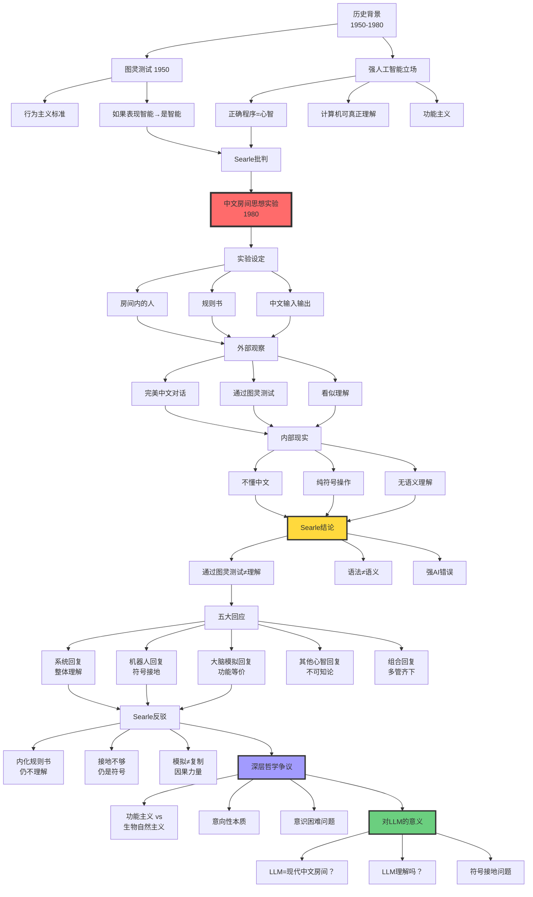
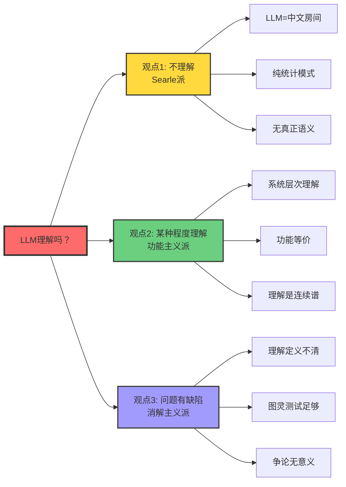

# 中文房间论证（Chinese Room Argument）

> **文档版本**: v1.0.0
> **最后更新**: 2025-10-27
> **文档规模**: 634行 | AI哲学经典思想实验
> **阅读建议**: 本文深入分析Searle的中文房间论证及其对大语言模型理解能力的哲学启示

---

## 1 核心概念深度分析

<details>
<summary><b>🏠🤔 点击展开：中文房间论证哲学深度分析与LLM理解问题</b></summary>

本节深入剖析Searle的中文房间论证，揭示"理解"的本质、语法与语义的鸿沟，以及这对评估大语言模型能力的深刻哲学意义。

### 1 . 中文房间论证概念定义卡

**概念名称**: 中文房间论证（Chinese Room Argument）

**内涵（本质属性）**:

**🔹 核心论证**:
Searle (1980) 提出的反驳强人工智能（Strong AI）的思想实验：

**论证结构**:
$$
\begin{align}
\text{前提1}: &\quad \text{房间通过图灵测试（行为等价）} \\
\text{前提2}: &\quad \text{房间内的人不理解中文（无语义）} \\
\text{结论}: &\quad \text{通过图灵测试} \neq \text{真正理解}
\end{align}
$$

**🔹 三个核心区分**:

| 区分 | A | B | Searle主张 |
|------|---|---|-----------|
| **强AI vs 弱AI** | 计算机=心智 | 计算机模拟心智 | 只有弱AI可能 |
| **语法 vs 语义** | 符号操作 | 符号意义 | 语法≠语义 |
| **内在 vs 派生意向性** | 固有"关于性" | 外部赋予 | AI仅有派生 |

**🔹 思想实验组件**:

| 组件 | 描述 | 类比 |
|------|------|------|
| **房间内的人** | 不懂中文，只会操作符号 | CPU |
| **规则书** | 符号操作指令（英语） | 程序 |
| **输入** | 中文问题（纸条） | 输入数据 |
| **输出** | 中文答案（正确） | 输出结果 |
| **外部观察** | 完美通过图灵测试 | LLM行为 |
| **内部现实** | 纯符号操作，无语义理解 | 矩阵运算 |

**外延（范围边界）**:

| 维度 | 包含 ✅ | 不包含 ❌ |
|------|---------|----------|
| **目标** | 反驳强AI | 不反驳弱AI |
| **论证范围** | 纯符号操作系统 | 具身机器人（部分） |
| **针对** | 功能主义、计算主义 | 神经科学、物理主义 |
| **争论点** | 理解的本质 | 智能行为的有用性 |

**属性维度表**:

| 维度 | 值/描述 | 说明 |
|------|---------|------|
| **提出者** | John Searle | 伯克利大学哲学家 |
| **提出时间** | 1980 | Minds, Brains, and Programs |
| **哲学立场** | 生物自然主义 | 意识需要生物"因果力量" |
| **核心主张** | 语法≠语义 | 符号操作不足以产生理解 |
| **影响力** | ⚠️⚠️⚠️⚠️⚠️ 极高 | AI哲学最著名论证 |
| **争议性** | ⚠️⚠️⚠️⚠️⚠️ 极高 | 至今未解决 |
| **对LLM意义** | ⚠️⚠️⚠️⚠️⚠️ 极高 | 直击理解核心 |

---

### 2 . 中文房间论证全景结构图



---

### 3 . 强AI vs 弱AI立场详细对比

| 维度 | 强人工智能（Strong AI） | 弱人工智能（Weak AI） | Searle立场 |
|------|----------------------|-------------------|-----------|
| **本体论主张** | 计算机**就是**心智 | 计算机**模拟**心智 | ✅ 仅弱AI |
| **理解** | 程序真正理解 | 程序假装理解 | 无真正理解 |
| **意识** | 程序可有意识 | 程序无意识 | 需要生物基础 |
| **意向性** | 内在意向性 | 仅派生意向性 | 计算机仅派生 |
| **图灵测试** | 通过=有心智 | 通过≠有心智 | 行为≠本质 |
| **功能主义** | ✅ 功能决定心智 | ❌ 功能不够 | 需因果力量 |
| **计算主义** | 心智=计算 | 心智≠计算 | 心智>计算 |
| **哲学基础** | 功能主义、行为主义 | 工具主义 | 生物自然主义 |
| **实例** | AGI、有意识AI | 当前所有AI系统 | 所有现有AI |
| **支持者** | Dennett, Hofstadter | Searle, Penrose | Searle本人 |

**关键争论焦点**:

$$
\begin{align}
\text{强AI主张}: &\quad \text{正确程序} \Rightarrow \text{理解} \\
\text{中文房间反驳}: &\quad \text{正确程序} + \text{正确输出} \nRightarrow \text{理解}
\end{align}
$$

---

### 4 . 五大回应与Searle反驳详细矩阵

| 回应 | 核心论点 | 支持者 | Searle反驳 | 评价 | 对LLM意义 |
|------|---------|--------|-----------|------|----------|
| **系统回复** | 整个系统（人+规则+房间）理解中文 | 功能主义者 | 让人内化规则，仍不理解 | ⚠️⚠️⚠️ 强力回应 | LLM作为系统可能理解？ |
| **机器人回复** | 具身+感知接地→理解 | Harnad | 加传感器仍是符号操作 | ⚠️⚠️ 部分有效 | 多模态LLM更接近理解？ |
| **大脑模拟** | 模拟大脑→必有理解 | 功能等价论 | 模拟≠复制，需因果力量 | ⚠️ 哲学僵局 | 神经形态AI？ |
| **其他心智** | 我们也无法证明他人理解 | 认识论挑战 | 这是不可知论，非答案 | ❌ 回避问题 | 不适用 |
| **组合回复** | 系统+接地+学习→理解 | 折衷主义 | 仍是符号操作堆叠 | ⚠️⚠️ 最强组合 | 具身LLM+RLHF？ |

**系统回复深入分析**:

```yaml
系统回复核心:
  论点: "理解"是系统层次的涌现属性
  类比:
    - 单个神经元不理解，大脑理解
    - 单个蚂蚁不智能，蚁群智能

Searle反驳（内化论证）:
  场景: 让人记住所有规则
  结果: 人=系统，但人仍不理解
  关键: 内化不改变符号操作本质

问题:
  - 人真的能内化所有规则吗？（实现可能性）
  - 内化后人=系统吗？（同一性问题）
  - 涌现是实在的吗？（本体论）

对LLM:
  如果LLM的"理解"是系统层次的涌现
  那么询问单个神经元是否理解=类别错误
```

**机器人回复与符号接地**:

$$
\begin{align}
\text{符号接地问题（Harnad）}: &\quad \text{符号} \xrightarrow{\text{感知}} \text{世界} \\
\text{机器人回复}: &\quad \text{房间+传感器} \Rightarrow \text{接地} \Rightarrow \text{语义} \\
\text{Searle反驳}: &\quad \text{传感器输入} = \text{新符号} \Rightarrow \text{仍无语义}
\end{align}
$$

---

### 5 . 对大语言模型的深刻意义分析

**LLM作为现代中文房间**:

| 维度 | 原版中文房间 | 大语言模型 | 相似度 |
|------|------------|-----------|--------|
| **符号操作** | 人按规则操作汉字 | Transformer矩阵运算 | ✅✅✅ 高 |
| **规则书** | 英语指令手册 | 权重矩阵$W$ | ✅✅✅ 高 |
| **输入输出** | 中文问答 | 自然语言文本 | ✅✅✅ 高 |
| **外部观察** | 完美对话 | 流畅回答 | ✅✅✅ 高 |
| **内部过程** | 不懂中文 | 矩阵运算 | ✅✅✅ 高 |
| **训练方式** | 规则预设 | 数据驱动学习 | ⚠️ 中等 |
| **规模** | 人能执行 | 1750亿参数 | ❌ 低 |
| **具身性** | 无 | 无（纯文本） | ✅✅✅ 高 |

**关键区别**:

```yaml
中文房间:
  - 规则是预设的（演绎）
  - 人执行规则
  - 静态系统

LLM:
  - 规则是学习的（归纳）
  - 神经网络执行
  - 动态优化

是否改变本质？
  Searle派: 否，仍是符号操作
  功能主义: 是，学习=理解的基础
```

**LLM"理解"吗？三派观点**:



**详细论证**:

**1️⃣ 不理解派（Searle）**:

$$
\begin{align}
&\text{LLM行为} = f(\text{输入}; W) \quad \text{（纯计算）} \\
&\text{无内在意向性} \Rightarrow \text{无真正理解} \\
&\text{证据}: \text{长度泛化失败、幻觉、无常识}
\end{align}
$$

**2️⃣ 某种理解派（功能主义）**:

- **理解是连续谱**: LLM有"浅层理解"
- **涌现**: 规模→质变（GPT-3.5→GPT-4）
- **功能等价**: 如果行为等价，何必纠结内部？

**3️⃣ 消解派（Wittgenstein风格）**:

- **"理解"是家族相似概念**: 无严格定义
- **语言游戏**: LLM玩"理解游戏"足够
- **实用主义**: 有用就行，别问本质

---

### 6 . 语法vs语义：核心鸿沟分析

| 层面 | 语法（Syntax） | 语义（Semantics） | 鸿沟 |
|------|--------------|-----------------|------|
| **定义** | 符号的形式规则 | 符号的意义、指称 | 形式→意义？ |
| **例子** | "猫在垫子上"的语法结构 | "猫"指真实的猫 | 如何关联？ |
| **中文房间** | 规则书定义的操作 | 符号的中文意义 | 房间内的人无语义 |
| **LLM** | Transformer矩阵运算 | 词语的真实指称 | 矩阵如何产生意义？ |
| **形式化** | $s_1 \to s_2$（重写规则） | $\llbracket s \rrbracket = o$（指称） | 计算→指称？ |
| **Searle主张** | 可形式化 | 不可纯计算化 | **根本鸿沟** |

**Searle核心论断**:

$$
\boxed{\text{语法} \nRightarrow \text{语义}}
$$

**理由**: 相同语法可有不同语义，语法无法唯一确定语义。

**反例（Quine不确定性）**:

```yaml
句子: "Gavagai"
语法: 名词
可能语义:
  1. 兔子（整体）
  2. 兔子阶段（时间切片）
  3. 未剥离的兔皮
  ...

结论: 语法不确定语义
```

**对LLM的意义**:

- LLM学习的是**共现模式**（语法++）
- 是否学到**真实指称**（语义）？存疑
- **符号接地**是关键：如何将符号连接到世界？

---

### 7 . 意向性层次与AI定位

**意向性分类（Dennett）**:

| 层次 | 意向性类型 | 特征 | 例子 | AI状态 |
|------|----------|------|------|--------|
| **0阶** | 无意向性 | 纯物理因果 | 石头、钟表 | ✅ 传统程序 |
| **1阶** | 一阶意向性 | 信念、欲望 | 动物：猫相信有老鼠 | ⚠️ LLM？ |
| **2阶** | 二阶意向性 | 关于信念的信念 | 狗：我相信主人相信我饿了 | ❌ LLM |
| **高阶** | 多层意向性 | 递归嵌套 | 人类：我知道你知道我知道... | ❌ LLM |

**内在vs派生意向性**:

$$
\begin{align}
\text{内在意向性}: &\quad \text{固有"关于性"，不依赖外部解释} \\
&\quad \text{例}: \text{人的信念} \\
\text{派生意向性}: &\quad \text{外部赋予"关于性"} \\
&\quad \text{例}: \text{书本文字、计算机符号}
\end{align}
$$

**Searle主张**:
$$
\boxed{\text{AI最多只有派生意向性}}
$$

**争议点**:

- **功能主义反驳**: 派生vs内在的区分不清晰
- **涌现论反驳**: 足够复杂的派生可涌现为内在？

---

### 8 . 功能主义vs生物自然主义哲学对决

| 维度 | 功能主义 | 生物自然主义（Searle） |
|------|---------|---------------------|
| **核心主张** | 心智=功能组织 | 心智需要生物"因果力量" |
| **多重可实现** | ✅ 硅可实现心智 | ❌ 必须是生物基质 |
| **计算主义** | 心智=计算 | 心智>计算 |
| **意识** | 功能决定 | 生物过程产生 |
| **理解** | 正确输入输出=理解 | 需要内在语义 |
| **类比** | 心智:大脑 = 软件:硬件 | 心智不可脱离大脑 |
| **AI可能性** | ✅ 强AI可能 | ❌ 仅弱AI |
| **支持者** | Putnam, Dennett | Searle, Nagel |

**功能主义核心**:

$$
\text{心智状态} = \text{功能角色（输入→状态→输出）}
$$

**例子**: "疼痛" = 特定输入（受伤）→状态→输出（呻吟）

**生物自然主义核心**:

$$
\text{心智} = \text{大脑的生物过程产生的因果力量}
$$

**关键概念"因果力量"（Causal Powers）**:

```yaml
Searle主张:
  大脑有特殊的因果力量（生物性质）
  这些力量产生意识和理解
  硅基计算机缺乏这些力量

问题:
  什么是"因果力量"？（定义不清）
  为何碳基可以，硅基不行？（基质沙文主义？）
  如果精确模拟大脑呢？（仍不行）
```

**深层争论**:

$$
\begin{align}
\text{功能主义}: &\quad \text{组织结构决定心智} \\
\text{生物自然主义}: &\quad \text{物理基质+组织结构决定心智}
\end{align}
$$

---

### 9 . 中文房间论证的现代挑战与演进

**对Searle论证的现代质疑**:

| 质疑 | 论点 | 评价 |
|------|------|------|
| **规模论证** | GPT-4规模>>人脑理解规则，质变？ | ⚠️⚠️ 有力 |
| **涌现论证** | 大规模→涌现能力（COT, ICL） | ⚠️⚠️⚠️ 强力 |
| **多模态论证** | GPT-4V看图→部分接地？ | ⚠️⚠️ 中等 |
| **具身论证** | 机器人+LLM→真实交互 | ⚠️⚠️ 中等 |
| **实用论证** | 有用就行，何必纠结本质？ | ⚠️ 哲学回避 |

**涌现能力对中文房间的挑战**:

```yaml
现象:
  GPT-3.5 → GPT-4: 显著质变
    - Chain-of-Thought推理
    - In-Context Learning
    - Few-shot泛化

问题:
  这些是"理解的萌芽"还是"更复杂的符号操作"？

Searle派:
  仍是符号操作，只是更复杂

功能主义派:
  涌现=理解的标志
  规模×复杂度→质变
```

**中文房间2.0：具身多模态LLM**:

$$
\begin{align}
\text{中文房间1.0}: &\quad \text{纯文本（房间）} \\
\text{中文房间2.0}: &\quad \text{文本+视觉+具身（机器人）}
\end{align}
$$

**是否改变本质**？

- **Searle派**: 否，加传感器仍是符号操作
- **接地派**: 是，感知→语义
- **折衷派**: 部分改善，但不充分

---

### 1.10 🔟 核心洞察与哲学启示

**五大哲学洞察**:

1. **语法-语义鸿沟定律**
   $$
   \text{形式操作} \nRightarrow \text{意义理解}
   $$
   - 中文房间核心
   - 符号接地问题根源

2. **行为-本质分离定律**
   $$
   \text{通过图灵测试} \neq \text{真正理解}
   $$
   - 批判行为主义
   - 外部行为≠内部状态

3. **系统涌现悖论**
   $$
   \text{部分不理解} \xrightarrow{？} \text{整体理解}
   $$
   - 最强回应vs最强反驳
   - 涌现的本体论地位

4. **基质独立性争议**
   $$
   \text{功能主义}: \text{基质无关} \quad \text{vs} \quad \text{Searle}: \text{生物基质必要}
   $$
   - AI哲学核心争论
   - 仍未解决

5. **理解连续谱假说**
   $$
   \text{理解} \neq \text{二元（有/无）}, \quad \text{而是连续谱}
   $$
   - 消解绝对主义
   - LLM有"某种程度"理解？

**对AI研究的实践启示**:

```yaml
启示1_符号接地优先:
  认知: 纯文本LLM缺乏真实接地
  行动: 发展多模态、具身AI
  例子: GPT-4V, 机器人+LLM

启示2_功能测试不够:
  认知: 通过基准测试≠真正理解
  行动: 设计探测深层理解的任务
  例子: 反事实推理、因果理解

启示3_混合架构方向:
  认知: 纯神经难有真正语义
  行动: 神经+符号混合
  例子: LLM+知识图谱

启示4_谦逊态度:
  认知: 我们还不理解"理解"
  行动: 避免过度宣称AI能力
  例子: 承认LLM局限

启示5_哲学继续重要:
  认知: 技术进步不能回避哲学问题
  行动: 跨学科对话（AI+哲学）
  例子: AI伦理、AI意识研究
```

**终极洞察**:

> **"中文房间论证揭示的不是AI不可能，而是我们对'理解'本质的无知。它不是结束讨论的论证，而是开始深入思考的起点。LLM的成功既不证明也不反驳Searle，而是把争论推向更深层次：如果GPT-4在实用层面'足够理解'，我们还需要纠结哲学上的'真正理解'吗？答案取决于我们的目标——是追求哲学真理，还是构建有用系统？也许，这本身就是个错误的二分法。"**

**元认知**:

- **中文房间≠反AI**: Searle反对强AI，不反对弱AI
- **争论未解决**: 功能主义vs生物自然主义仍是僵局
- **LLM是新挑战**: 超越Searle 1980年想象
- **实用vs理论**: 工程成功≠哲学问题解决
- **理解的本质**: 也许是错误的问题（Wittgenstein）
- **保持开放**: 未来AI可能超越当前哲学框架

</details>

---

## 📋 目录

- [中文房间论证（Chinese Room Argument）](#中文房间论证chinese-room-argument)
  - [1 核心概念深度分析](#1-核心概念深度分析)
    - [1 . 中文房间论证概念定义卡](#1--中文房间论证概念定义卡)
    - [2 . 中文房间论证全景结构图](#2--中文房间论证全景结构图)
    - [3 . 强AI vs 弱AI立场详细对比](#3--强ai-vs-弱ai立场详细对比)
    - [4 . 五大回应与Searle反驳详细矩阵](#4--五大回应与searle反驳详细矩阵)
    - [5 . 对大语言模型的深刻意义分析](#5--对大语言模型的深刻意义分析)
    - [6 . 语法vs语义：核心鸿沟分析](#6--语法vs语义核心鸿沟分析)
    - [7 . 意向性层次与AI定位](#7--意向性层次与ai定位)
    - [8 . 功能主义vs生物自然主义哲学对决](#8--功能主义vs生物自然主义哲学对决)
    - [9 . 中文房间论证的现代挑战与演进](#9--中文房间论证的现代挑战与演进)
    - [1.10 🔟 核心洞察与哲学启示](#110--核心洞察与哲学启示)
  - [📋 目录](#-目录)
  - [导航 | Navigation](#导航--navigation)
  - [相关主题 | Related Topics](#相关主题--related-topics)
    - [11.3 本章节](#113-本章节)
    - [11.4 相关章节](#114-相关章节)
    - [11.5 跨视角链接](#115-跨视角链接)

---


## 导航 | Navigation

**上一篇**: [← 06.5 混合神经符号系统](../06_Computational_Paradigms/06.5_Hybrid_Neurosymbolic_Systems.md)
**下一篇**: [07.2 意识与AI →](./07.2_Consciousness_in_AI.md)
**返回目录**: [↑ AI模型视角总览](../README.md)

---

## 相关主题 | Related Topics

### 11.3 本章节

- [07.2 意识与AI](./07.2_Consciousness_in_AI.md)
- [07.3 理解vs模拟](./07.3_Understanding_vs_Simulation.md)
- [07.4 Chomsky的AI批判](./07.4_Chomsky_AI_Critique.md)
- [07.5 可解释性与可解释AI](./07.5_Explainability_Interpretability.md)
- [07.6 AI对齐问题](./07.6_AI_Alignment_Problem.md)

### 11.4 相关章节

- [01.1 图灵机与可计算性](../01_Foundational_Theory/01.1_Turing_Machine_Computability.md)
- [03.3 Transformer LLM理论](../03_Language_Models/03.3_Transformer_LLM_Theory.md)
- [06.1 符号AI vs 联结主义AI](../06_Computational_Paradigms/06.1_Symbolic_AI_vs_Connectionist_AI.md)

### 11.5 跨视角链接

- [Software_Perspective: 语义形式对偶](../../Software_Perspective/01_Foundational_Theory/01.1_Semantic_Formal_Duality.md)
