# 理解 vs 模拟：AI的语义鸿沟

> **文档版本**: v1.0.0  
> **最后更新**: 2025-10-27  
> **文档规模**: 849行 | 理解与模拟的哲学辨析  
> **阅读建议**: 本文分析AI系统理解能力的本质、评估标准和未来方向

---

## 核心概念深度分析

<details>
<parameter name="summary"><b>🤖💭 点击展开：理解vs模拟全景哲学深度解析</b></summary>

本节深入剖析理解的哲学本质、符号接地问题、框架问题、LLM理解能力争论与Winograd Schema挑战。

### 1️⃣ 理解vs模拟概念定义卡

**概念名称**: 理解vs模拟（Understanding vs Simulation）

**内涵（本质属性）**:

**🔹 核心问题**:
理解vs模拟辨析AI系统是否真正"理解"信息（掌握意义、具有意向性）还是仅仅"模拟"理解（行为上相似但无语义内容）。这是AI哲学的核心争论，直接关系到强AI vs弱AI的区分。

$$
\begin{align}
\text{真正理解} &= \text{意向性} + \text{语义接地} + \text{推理能力} + \text{灵活应用} \\
\text{模拟理解} &= \text{行为等价} + \text{无语义内容} + \text{纯符号操作}
\end{align}
$$

**🔹 理解vs模拟核心区分**:

| 维度 | 真正理解 | 模拟理解 | 如何判断？ |
|------|---------|---------|-----------|
| **意向性** | ✅ 有"关于性" | ❌ 无（派生） | 内在vs外部赋予 |
| **语义接地** | ✅ 符号有世界意义 | ❌ 符号无接地 | Harnad符号接地 |
| **推理方式** | 语义推理 | 语法操作 | Searle语法≠语义 |
| **灵活应用** | 新情境迁移 | 训练域内 | 泛化测试 |
| **常识推理** | ✅ 有背景知识 | ❌ 缺乏 | 框架问题 |
| **因果理解** | ✅ 知道"为何" | ❌ 仅"什么" | Winograd Schema |

**外延（范围边界）**:

| 维度 | 理解问题包含 ✅ | 不包含 ❌ |
|------|--------------|----------|
| **问题** | 意向性、符号接地、框架问题 | 智能行为、计算效率 |
| **理论** | 意向性理论、具身认知 | 行为主义、弱AI |
| **测试** | Winograd Schema、常识推理 | 图灵测试（仅行为） |

**属性维度表**:

| 维度 | 值/描述 | 说明 |
|------|---------|------|
| **核心困难** | 符号接地问题（Harnad 1990） | 符号如何获得意义 |
| **经典论证** | 中文房间（Searle 1980） | 语法≠语义 |
| **认知理论** | 具身认知（Embodied Cognition） | 理解需要身体-环境交互 |
| **LLM争议** | ⚠️⚠️⚠️⚠️⚠️ 极高 | 模拟还是理解？ |

---

### 2️⃣ 理解vs模拟全景图谱

```mermaid
graph TB
    Understanding[理解vs模拟<br/>Understanding vs Simulation]
    
    Understanding --> CoreQ[核心问题:<br/>AI真正理解吗?]
    
    CoreQ --> DefU[什么是理解?]
    CoreQ --> DiffQ[模拟vs理解区别?]
    CoreQ --> TestQ[如何判断?]
    
    DefU --> Elements[理解的要素]
    
    Elements --> Intentionality[意向性<br/>Intentionality]
    Elements --> Semantics[语义内容<br/>Semantic Content]
    Elements --> Reasoning[推理能力<br/>Reasoning]
    Elements --> Flexibility[灵活应用<br/>Flexibility]
    
    Intentionality --> Aboutness[关于性<br/>心理状态指向对象]
    Semantics --> Meaning[掌握意义<br/>非形式符号]
    Reasoning --> Inference[从理解推导<br/>新知识]
    Flexibility --> Transfer[新情境应用<br/>迁移能力]
    
    Problems[核心哲学问题]
    
    Problems --> SymbolGrounding[符号接地问题<br/>Harnad 1990]
    Problems --> FrameProblem[框架问题<br/>McCarthy]
    Problems --> CommonSense[常识推理<br/>挑战]
    
    SymbolGrounding --> SG1[符号如何获得意义?]
    SymbolGrounding --> SG2[语义从何而来?]
    SymbolGrounding --> SG3[接地方案:<br/>感知-运动]
    
    FrameProblem --> FP1[如何知道什么相关?]
    FrameProblem --> FP2[无限背景知识]
    FrameProblem --> FP3[AI难题:<br/>常识缺失]
    
    CommonSense --> CS1[隐性知识<br/>难以形式化]
    CommonSense --> CS2[CYC项目困境<br/>手工编码失败]
    
    Tests[判断标准与测试]
    
    Tests --> Turing[图灵测试<br/>❌不充分]
    Tests --> Winograd[Winograd Schema<br/>✅常识推理]
    Tests --> GLUE[GLUE/SuperGLUE<br/>⚠️现代基准]
    Tests --> ARC[ARC<br/>抽象推理]
    
    Turing --> T1[仅行为等价]
    Turing --> T2[中文房间反驳]
    
    Winograd --> W1[代词消歧]
    Winograd --> W2[需要常识]
    Winograd --> W3[LLM表现好<br/>但仍存疑]
    
    AISystem[AI系统评估]
    
    AISystem --> Symbolic[符号AI<br/>仅语法操作]
    AISystem --> Connectionist[连接主义<br/>无显式语义]
    AISystem --> LLM[大语言模型<br/>⚠️⚠️争议]
    AISystem --> Multimodal[多模态AI<br/>更接近接地]
    AISystem --> Embodied[具身AI<br/>最接近]
    
    LLM --> LLMDebate[LLM理解争论]
    
    LLMDebate --> LLMYes[支持理解]
    LLMYes --> Y1[涌现能力]
    LLMYes --> Y2[复杂推理]
    LLMYes --> Y3[Zero-shot泛化]
    
    LLMDebate --> LLMNo[反对理解]
    LLMNo --> N1[无符号接地]
    LLMNo --> N2[无具身交互]
    LLMNo --> N3[统计模式<br/>非语义]
    LLMNo --> N4[幻觉<br/>无真实理解]
    
    Embodied --> E1[身体-环境交互]
    Embodied --> E2[感知-运动耦合]
    Embodied --> E3[符号可能接地]
    
    Positions[理论立场]
    
    Positions --> Strong[强立场:<br/>AI不能真正理解]
    Positions --> Weak[弱立场:<br/>理解是程度问题]
    Positions --> Functionalist[功能主义:<br/>行为=理解]
    
    Strong --> Searle[Searle生物自然主义]
    Weak --> Dennett[Dennett意向立场]
    
    style Understanding fill:#9b59b6,stroke:#333,stroke-width:4px
    style Problems fill:#e74c3c,stroke:#333,stroke-width:4px
    style Tests fill:#2ecc71,stroke:#333,stroke-width:4px
    style LLMDebate fill:#f39c12,stroke:#333,stroke-width:4px
```



---

### 3️⃣ 核心哲学问题深度对比

| 问题 | 符号接地问题 | 框架问题 | 常识推理挑战 |
|------|------------|---------|------------|
| **提出者** | Harnad (1990) | McCarthy & Hayes (1969) | AI研究界共识 |
| **核心问题** | 符号如何获得意义？ | 如何知道什么信息相关？ | 如何获得人类隐性知识？ |
| **对AI意义** | 语义理解基础 | 推理实用性 | 常识缺失困境 |
| **传统AI困境** | ✅✅✅ 严重（纯符号） | ✅✅✅ 严重（爆炸） | ✅✅✅ 严重（CYC失败） |
| **LLM进展** | ⚠️ 部分缓解（大数据） | ⚠️ 部分缓解（涌现） | ⚠️ 部分缓解（统计常识） |
| **解决方案** | 具身认知、多模态 | 概率推理、注意力 | 大规模预训练 |
| **仍未解决** | ⚠️ 真正语义接地 | ⚠️ 常识推理完整性 | ⚠️ 深层因果理解 |

**深度分析**:

```yaml
符号接地问题（Symbol Grounding Problem, Harnad 1990）:
  核心问题:
    - 符号系统（如语言）如何获得意义？
    - "猫"这个符号如何指向真实的猫？
    - 意义从何而来？
  
  中文房间类比:
    - 房间内人操作符号（语法）
    - 但符号无接地（无语义）
    - "猫"只是另一堆符号的定义
    → 符号的意义无法从符号系统内部产生
  
  Harnad的解决方案:
    - 感知接地（Perceptual Grounding）:
      基础符号通过感知经验接地
      例: "红色"通过看到红色物体接地
    
    - 运动接地（Motor Grounding）:
      符号通过行为接地
      例: "抓"通过抓取动作接地
    
    - 组合性（Compositional）:
      复杂符号由接地的基础符号组合
  
  对LLM的分析:
    支持"有接地"论:
      - 大规模文本包含大量关于世界的信息
      - 统计模式隐式编码语义关系
      - "猫"与"喵喵"、"爪子"、"毛绒"等共现
      → 某种程度的"统计接地"？
    
    反对"有接地"论:
      - 文本≠真实世界
      - 无感知-运动经验
      - "中文房间的文本版本"
      - 幻觉现象（无真实约束）
    
    多模态AI（CLIP, GPT-4V）:
      - 视觉+文本→更接近接地
      - "猫"与猫的图像对齐
      - 但仍非直接感知-运动接地
  
  当前共识:
    - LLM有某种"二手接地"（through text）
    - 但可能缺乏"一手接地"（through perception/action）
    - 具身AI可能是真正解决方案

框架问题（Frame Problem）:
  McCarthy & Hayes (1969) 提出
  
  核心困难:
    - 行为后，如何更新信念？
    - 哪些信念改变？哪些不变？
    - 无限多事实不相关
  
  经典例子（Yale Shooting Problem）:
    场景:
      1. 枪装子弹
      2. 等一会儿
      3. 开枪
      问: 枪还装着子弹吗？目标死了吗？
    
    人类: 显然还装着，目标死了
    
    逻辑AI困境:
      - 需要显式编码"等待不改变子弹状态"
      - 需要考虑无限多可能的不相关事实
      - 计算爆炸
  
  本质:
    - 人类有常识：知道什么通常相关
    - AI缺乏：需要显式推理所有可能性
    - 常识推理是隐性的、难以形式化的
  
  对LLM:
    部分缓解:
      - 大数据学到统计常识
      - "等待"后通常状态不变
      - 不需要显式推理
    
    但仍存在:
      - 缺乏深层因果理解
      - 依赖统计相关，非因果推理
      - 新奇情境可能失败

常识推理挑战:
  什么是常识:
    - 隐性知识：人人知道但难以言说
    - 例: "水是湿的"、"人不能飞"
    - Polanyi "我们知道的比我们能说的更多"
  
  CYC项目（1984-现在）:
    目标: 手工编码人类所有常识
    结果: 部分失败
      - 编码了数百万条规则
      - 但仍远远不够
      - 常识是开放式的、无穷的
  
  LLM的"常识":
    优势:
      - 从大规模文本学习
      - 统计常识（频繁共现）
      - 通过Winograd Schema等测试
    
    局限:
      - 统计相关≠真正理解
      - 缺乏物理常识（无具身）
      - 缺乏深层因果理解
      - 幻觉：无真实世界约束
  
  示例（Winograd Schema）:
    "奖杯放不进手提箱，因为它太大了。"
    问: "它"指什么？
    
    答案: 奖杯（需要常识：放不进→对象太大）
    
    LLM表现:
      - GPT-3: 约85%正确
      - 人类: >95%
      → LLM有一定常识，但非完美
```

---

### 4️⃣ LLM理解能力深度争论

**支持"LLM有理解"论证**:

| 论证 | 内容 | 反驳 |
|------|------|------|
| **涌现能力** | 复杂推理、规划等高级能力涌现 | 可能是复杂模式匹配，非真正理解 |
| **Zero-shot泛化** | 未见过的任务也能完成 | 训练数据极大，可能见过类似 |
| **类比推理** | king - man + woman ≈ queen | 向量运算≠概念理解 |
| **复杂对话** | 多轮对话、上下文理解 | 可能是统计关联，非语义理解 |
| **程序生成** | 从描述生成代码 | 记忆+模式，非真正理解逻辑 |

**反对"LLM有理解"论证**:

| 论证 | 内容 | 支持者回应 |
|------|------|----------|
| **无符号接地** | 纯文本，无感知-运动接地 | 文本包含大量世界知识 |
| **幻觉** | 编造事实，无真实约束 | 正改进（RLHF, RAG） |
| **统计模式** | 仅学习相关性，非因果 | 复杂到一定程度≈理解？ |
| **中文房间** | 与Searle论证同构 | 系统回复：整体理解 |
| **无具身** | 缺乏身体-世界交互 | 多模态AI在改进 |

**深度分析**:

```yaml
LLM理解争论的核心:
  本质问题: "理解"的定义
  
  若"理解"=功能等价:
    - LLM可能"理解"
    - 复杂推理、对话、创作
    - 行为上接近人类
  
  若"理解"=掌握意义+语义接地:
    - LLM可能不"理解"
    - 无感知-运动接地
    - 纯统计模式
  
  Dennett意向立场:
    - 若行为表现理解→可归因"理解"
    - "理解"是观察者赋予的
    - LLM从意向立场看"理解"
  
  Searle生物自然主义:
    - 理解需要生物"因果力量"
    - LLM无→不理解
    - 硅基≠碳基

当前共识（2024）:
  温和派:
    - LLM有某种"理解"
    - 但可能不是人类那种
    - "理解"是程度问题，非全无
  
  保守派:
    - LLM仅模拟理解
    - 无真正语义
    - 复杂的模式匹配
  
  实用派:
    - 不管是否"真正"理解
    - 功能上有用即可
    - 哲学问题不妨碍应用

多模态与具身AI:
  CLIP, GPT-4V:
    - 视觉+文本
    - 更接近符号接地
    - 但仍非直接感知
  
  具身机器人:
    - 感知-运动交互
    - 可能实现真正接地
    - 但当前技术受限
  
  未来方向:
    - 大模型+具身
    - 虚拟环境训练
    - 可能更接近"真正理解"
```

---

### 🔟 核心洞察与终极评估

**五大核心定律**:

1. **Harnad符号接地定律**
   $$
   \text{符号意义} \Leftarrow \text{感知-运动接地} + \text{组合性}
   $$
   - 纯符号系统无法自我接地

2. **Searle语法vs语义定律**
   $$
   \text{语法操作}（形式） \neq \text{语义理解}（意义）
   $$
   - 中文房间核心论证

3. **框架问题定律**
   $$
   \text{相关性判断需要常识} \quad \text{（无穷背景知识）}
   $$
   - AI常识推理困境

4. **理解-程度定律**
   $$
   \text{理解是连续谱} \quad \text{非二元（有/无）}
   $$
   - 不同系统有不同程度理解

5. **具身接地定律**
   $$
   \text{真正理解} \Leftarrow \text{身体-环境交互}
   $$
   - 具身认知理论核心

**终极洞察**:

> **"理解vs模拟是AI哲学核心争论——AI真正理解还是仅模拟？真正理解需要：①意向性（关于性）②符号接地（语义来源）③推理能力（从理解推导）④灵活应用（新情境迁移）。核心哲学问题：①符号接地问题（Harnad 1990）：符号如何获得意义？纯文本LLM缺乏感知-运动接地②框架问题（McCarthy）：如何知道什么相关？AI缺乏常识推理③Searle语法≠语义：中文房间证明符号操作≠理解。测试标准：图灵测试不充分（仅行为），Winograd Schema（常识推理），GLUE/SuperGLUE（现代基准），ARC（抽象推理）。LLM理解争论：支持（涌现能力、Zero-shot、复杂推理）vs反对（无接地、幻觉、统计模式、中文房间同构）。当前共识（2024）：①温和派：LLM有某种理解，程度问题非全无②保守派：仅模拟，无真正语义③实用派：功能有用即可，哲学问题不妨碍应用。理论立场：①Searle生物自然主义：理解需生物因果力量→LLM不理解②Dennett意向立场：行为表现理解→可归因理解③具身认知：理解需身体-环境交互。未来方向：多模态AI（CLIP/GPT-4V）更接近接地，具身机器人可能实现真正理解。关键洞察：理解vs模拟可能是程度问题，非种类问题。LLM有'二手接地'（through text）但缺'一手接地'（through perception/action）。"**

**元认知**:
- **核心争论**: 真正理解vs模拟理解
- **关键问题**: 符号接地、框架问题、常识推理
- **LLM地位**: ⚠️⚠️⚠️ 极大争议
- **测试标准**: Winograd Schema、常识推理
- **未来希望**: 多模态+具身AI
- **哲学意义**: 揭示"理解"本身定义不清

</details>

---

## 📋 目录

- [核心概念深度分析](#核心概念深度分析)
- [目录 | Table of Contents](#目录-table-of-contents)
- [引言](#引言)
- [一、理解的哲学分析](#一理解的哲学分析)
  - [1.1 理解的定义](#11-理解的定义)
  - [1.2 理解的类型](#12-理解的类型)
    - [命题理解（Propositional Understanding）](#命题理解propositional-understanding)
    - [程序理解（Procedural Understanding）](#程序理解procedural-understanding)
    - [解释理解（Explanatory Understanding）](#解释理解explanatory-understanding)
    - [概念理解（Conceptual Understanding）](#概念理解conceptual-understanding)
  - [1.3 意向性理论](#13-意向性理论)
- [二、模拟 vs 理解的核心区别](#二模拟-vs-理解的核心区别)
  - [2.1 中文房间论证的启示](#21-中文房间论证的启示)
  - [2.2 符号接地问题（Symbol Grounding Problem）](#22-符号接地问题symbol-grounding-problem)
  - [2.3 框架问题（Frame Problem）](#23-框架问题frame-problem)
  - [2.4 常识推理的挑战](#24-常识推理的挑战)
- [三、判断理解的标准与测试](#三判断理解的标准与测试)
  - [3.1 图灵测试的不足](#31-图灵测试的不足)
  - [3.2 Winograd Schema Challenge](#32-winograd-schema-challenge)
  - [3.3 理解的多维评估](#33-理解的多维评估)
  - [3.4 现代理解测试](#34-现代理解测试)
    - [GLUE & SuperGLUE](#glue-superglue)
    - [BIG-bench](#big-bench)
    - [Abstraction and Reasoning Corpus (ARC)](#abstraction-and-reasoning-corpus-arc)
- [四、AI系统的理解能力分析](#四ai系统的理解能力分析)
  - [4.1 符号AI系统](#41-符号ai系统)
  - [4.2 连接主义AI系统](#42-连接主义ai系统)
  - [4.3 大语言模型（LLM）](#43-大语言模型llm)
    - [支持"理解"的论证](#支持理解的论证)
    - [反对"理解"的论证](#反对理解的论证)
  - [4.4 多模态AI系统](#44-多模态ai系统)
  - [4.5 具身AI系统](#45-具身ai系统)
- [五、理论立场与争论](#五理论立场与争论)
  - [5.1 理解的必要条件](#51-理解的必要条件)
  - [5.2 程度问题 vs 种类问题](#52-程度问题-vs-种类问题)
  - [5.3 Dennett的意向立场](#53-dennett的意向立场)
- [六、当前共识与开放问题](#六当前共识与开放问题)
  - [6.1 部分共识](#61-部分共识)
  - [6.2 关键开放问题](#62-关键开放问题)
  - [6.3 实践意义](#63-实践意义)
- [七、结论](#七结论)
  - [核心要点总结](#核心要点总结)
  - [最终评估](#最终评估)
  - [关键洞察](#关键洞察)
- [八、参考文献](#八参考文献)
  - [经典哲学文献](#经典哲学文献)
  - [符号接地与具身认知](#符号接地与具身认知)
  - [AI理解的现代讨论](#ai理解的现代讨论)
  - [LLM能力研究](#llm能力研究)
  - [常识与推理](#常识与推理)
  - [Wikipedia条目](#wikipedia条目)
  - [Stanford Encyclopedia](#stanford-encyclopedia)
- [导航 | Navigation](#导航-navigation)
- [相关主题 | Related Topics](#相关主题-related-topics)
  - [本章节](#本章节)
  - [相关章节](#相关章节)
  - [跨视角链接](#跨视角链接)

---

## 引言

AI是否真正"理解"它所处理的信息，还是仅仅在"模拟"理解？这是AI哲学中的核心争论，直接关系到AI的认知地位和能力边界。本文档将从哲学、认知科学和计算理论的多个角度，深入探讨理解与模拟的区别、判断标准以及对AI系统的评估。

**核心问题**：

1. 什么是真正的"理解"？
2. 模拟理解与真正理解的本质区别是什么？
3. AI系统是否能真正理解，还是仅仅模拟？
4. 我们如何判断一个系统是否真正理解？

---

## 一、理解的哲学分析

### 1.1 理解的定义

[Wikipedia: Understanding](https://en.wikipedia.org/wiki/Understanding)

**传统哲学定义**：
> 理解（Understanding）= 掌握意义（Grasping Meaning）+ 能够运用（Ability to Apply）

**核心要素**：

1. **意向性（Intentionality）**：心理状态"关于"某物
2. **语义内容（Semantic Content）**：表征有意义
3. **推理能力（Reasoning Ability）**：能从理解推导新知识
4. **适应性应用（Flexible Application）**：能在新情境中运用

**Winograd & Flores (1986)** 的观点：
> 理解不是内在表征的匹配，而是与世界的有意义互动。

**参考文献**：

- [Winograd & Flores, 1986](https://mitpress.mit.edu/9780262232111/) - Understanding Computers and Cognition
- [Stanford Encyclopedia: Intentionality](https://plato.stanford.edu/entries/intentionality/)

### 1.2 理解的类型

#### 命题理解（Propositional Understanding）

- 理解"that"：知道某事是真的
- 例：理解"地球绕太阳转"

#### 程序理解（Procedural Understanding）

- 理解"how"：知道如何做某事
- 例：理解如何骑自行车

#### 解释理解（Explanatory Understanding）

- 理解"why"：掌握因果关系
- 例：理解为何天空是蓝色的

#### 概念理解（Conceptual Understanding）

- 掌握概念的本质和关系
- 例：理解"正义"的概念

[Wikipedia: Knowledge](https://en.wikipedia.org/wiki/Knowledge#Types_of_knowledge)

### 1.3 意向性理论

[Wikipedia: Intentionality](https://en.wikipedia.org/wiki/Intentionality)

**Franz Brentano (1874)** 的意向性概念：
> 心理现象的标志是它们"关于"某物。

**意向性的核心特征**：

1. **关于性（Aboutness）**：表征指向对象
2. **方向性（Directedness）**：朝向特定目标
3. **表征内容（Representational Content）**：有语义内容
4. **非存在对象（Non-existence）**：可以关于不存在的对象（如独角兽）

**Searle的意向性分类**：

- **内在意向性（Intrinsic Intentionality）**：大脑、心智的原初意向性
- **派生意向性（Derived Intentionality）**：文字、符号从使用者那里派生

**对AI的意义**：
> AI的"意向性"是派生的，来自设计者和使用者，而非内在的。

**参考文献**：

- [Searle, 1983](https://www.cambridge.org/core/books/intentionality/6E3337A09547C82E21D6E9971F05B86A) - Intentionality: An Essay in the Philosophy of Mind
- [Brentano, 1874](https://en.wikipedia.org/wiki/Psychology_from_an_Empirical_Standpoint) - Psychology from an Empirical Standpoint

---

## 二、模拟 vs 理解的核心区别

### 2.1 中文房间论证的启示

[Wikipedia: Chinese Room](https://en.wikipedia.org/wiki/Chinese_room)

**Searle (1980)** 的中文房间论证揭示了模拟与理解的关键差异：

| 维度 | 模拟（中文房间内的人） | 理解（真正的说中文者） |
|------|---------------------|---------------------|
| **语法处理** | ✅ 能够正确操作符号 | ✅ 能够正确操作符号 |
| **语义理解** | ❌ 不理解符号意义 | ✅ 理解符号意义 |
| **意向性** | ❌ 无关于中文的心理状态 | ✅ 有关于中文的心理状态 |
| **因果关系** | ❌ 符号操作无语义因果力 | ✅ 语义理解有因果作用 |
| **主观体验** | ❌ 无相关的主观体验 | ✅ 有语义体验 |

**核心洞察**：
> **语法（Syntax）≠ 语义（Semantics）**  
> 正确的符号操作不等于理解符号的意义。

### 2.2 符号接地问题（Symbol Grounding Problem）

[Wikipedia: Symbol Grounding Problem](https://en.wikipedia.org/wiki/Symbol_grounding_problem)

**Stevan Harnad (1990)** 的符号接地问题：

**问题**：

- 符号系统中的符号如何获得意义？
- 符号如何与它们所表征的世界关联？

**字典困境**（Dictionary Problem）：

- 查字典定义单词，但定义本身是更多符号
- 符号的意义不能仅从符号到符号的关系中产生
- 需要与非符号的感知经验接地

**接地方案**：

1. **感知接地**：符号通过感知经验与世界关联
2. **运动接地**：符号通过行动能力与世界关联
3. **社会接地**：符号通过社会互动获得意义

**对AI的意义**：

- 纯符号AI（如早期专家系统）：未接地
- 纯文本LLM：符号未真正接地，仅在符号空间内
- 多模态AI（视觉+语言）：部分接地
- 具身机器人：更好的接地

**参考文献**：

- [Harnad, 1990](https://www.sciencedirect.com/science/article/abs/pii/0167278990900876) - The Symbol Grounding Problem
- [Barsalou, 1999](https://www.cambridge.org/core/journals/behavioral-and-brain-sciences/article/abs/perceptual-symbol-systems/1F1D1E0C0E506FD8E1C0DD0F3DAF79B0) - Perceptual Symbol Systems

### 2.3 框架问题（Frame Problem）

[Wikipedia: Frame Problem](https://en.wikipedia.org/wiki/Frame_problem)

**McCarthy & Hayes (1969)** 提出的框架问题：

**问题**：

- 在推理时，如何知道哪些信息相关、哪些不相关？
- 一个行动改变了什么，未改变什么？

**例子**：

- 机器人从A房间移动到B房间
- 明确：机器人位置改变
- 未改变的（需推理）：电池状态、墙的颜色、门的位置、世界上其他所有事物...

**对理解的意义**：
> 真正的理解包含对相关性的直觉判断，这很难形式化。

**AI系统的困难**：

- 符号AI：需要显式编码所有相关性规则（不现实）
- 神经网络：通过学习隐式获得相关性（但不透明）

**参考文献**：

- [McCarthy & Hayes, 1969](https://www-formal.stanford.edu/jmc/mcchay69/mcchay69.html) - Some Philosophical Problems from the Standpoint of AI

### 2.4 常识推理的挑战

[Wikipedia: Commonsense Reasoning](https://en.wikipedia.org/wiki/Commonsense_reasoning)

**常识（Commonsense Knowledge）**：

- 人类天然具备的关于世界的基本知识
- 例：水往低处流、人需要呼吸、物体不能同时在两个地方

**AI的常识困境**：

- **知识获取瓶颈**：常识太多太隐含，难以显式编码
- **推理挑战**：常识推理需要灵活应用，难以形式化
- **例外处理**：常识有大量例外（鸟会飞，但企鹅不会）

**Cyc项目（1984-）**：

- 尝试手工编码人类常识
- 30多年投入，数百万条规则
- 仍远未完成

**LLM的常识表现**：

- ✅ 在许多常识任务上表现良好
- ❌ 但仍有奇怪的失败案例
- ❓ 这是真的理解还是统计模式匹配？

**参考文献**：

- [Davis & Marcus, 2015](https://dl.acm.org/doi/10.1145/2701413) - Commonsense Reasoning and Commonsense Knowledge in AI
- [Wikipedia: Cyc](https://en.wikipedia.org/wiki/Cyc)

---

## 三、判断理解的标准与测试

### 3.1 图灵测试的不足

[Wikipedia: Turing Test](https://en.wikipedia.org/wiki/Turing_test)

**图灵测试（1950）**：

- 如果AI的行为无法与人类区分 → 认为AI能"思考"

**批评（针对理解）**：

1. **行为主义偏见**：忽略内在过程
2. **中文房间反驳**：通过测试≠真正理解
3. **浅层模仿**：可能通过技巧欺骗而非理解

**Searle的反驳**：
> 通过图灵测试的系统可能没有理解，就像中文房间里的人。

### 3.2 Winograd Schema Challenge

[Wikipedia: Winograd Schema Challenge](https://en.wikipedia.org/wiki/Winograd_Schema_Challenge)

**Hector Levesque (2011)** 设计的理解测试：

**例子**：

```text
The trophy doesn't fit in the suitcase because it is too [big/small].
What is too [big/small]?
(A) The trophy  (B) The suitcase

- 如果"big" → (A) trophy
- 如果"small" → (B) suitcase
```

**特点**：

- 需要常识推理
- 无法通过简单的统计关联解决
- 难以游戏化（不像图灵测试可能被技巧欺骗）

**LLM表现**：

- GPT-3: ~88% 正确率
- 人类: ~95% 正确率
- 说明LLM有一定的常识推理能力

**但争议**：

- 高准确率=真理解，还是大规模模式记忆？

**参考文献**：

- [Levesque et al., 2012](https://www.aaai.org/ocs/index.php/KR/KR12/paper/view/4492) - The Winograd Schema Challenge

### 3.3 理解的多维评估

**Bender & Koller (2020)** 的"登山者与章鱼"寓言：

**寓言**：

- 两个登山者A和B通过对讲机交流
- 章鱼O监听了大量A-B的对话
- O能否理解A和B的语言？

**结论**：
> 章鱼能学会语言的**形式**（form），但不能学会**意义**（meaning），因为意义来自与世界的互动。

**对LLM的意义**：

- LLM就像章鱼，仅从文本学习
- 缺乏与物理世界的接地
- 因此可能仅理解形式，不理解意义

**参考文献**：

- [Bender & Koller, 2020](https://aclanthology.org/2020.acl-main.463/) - Climbing towards NLU: On Meaning, Form, and Understanding in the Age of Data

### 3.4 现代理解测试

#### GLUE & SuperGLUE

[Wikipedia: GLUE (benchmark)](https://en.wikipedia.org/wiki/General_Language_Understanding_Evaluation)

**General Language Understanding Evaluation**：

- 9个NLU任务集合
- 包括推理、相似度、问答等

**SuperGLUE（2019）**：

- 更难的版本
- 包括：常识推理、指代消解、因果推理

#### BIG-bench

[GitHub: BIG-bench](https://github.com/google/BIG-bench)

**Beyond the Imitation Game Benchmark**：

- 200+任务
- 测试多种认知能力
- 包括：推理、数学、常识、多语言

#### Abstraction and Reasoning Corpus (ARC)

[Wikipedia: ARC (dataset)](https://github.com/fchollet/ARC)

**François Chollet (2019)** 设计：

- 视觉推理任务
- 需要抽象、类比推理
- 当前AI系统表现很差（<30%），人类>80%

**Chollet的论断**：
> 真正的理解需要抽象推理能力，而非模式记忆。

---

## 四、AI系统的理解能力分析

### 4.1 符号AI系统

**特征**：

- 显式知识表示
- 逻辑推理引擎
- 规则驱动

**理解评估**：

- ✅ 语法正确：规则精确
- ❌ 语义理解：符号未接地
- ❌ 灵活应用：脆弱，无法应对例外
- ❌ 常识推理：知识瓶颈

**例子**：

- 专家系统（MYCIN, XCON）
- 定理证明器

**结论**：
> 符号AI操作符号，但符号的意义是由人类赋予的，AI本身不理解。

[Wikipedia: Expert System](https://en.wikipedia.org/wiki/Expert_system)

### 4.2 连接主义AI系统

**特征**：

- 分布式表征
- 统计学习
- 模式识别

**理解评估**：

- ✅ 泛化能力：能从数据中学习模式
- ✅ 鲁棒性：对噪声和变化相对鲁棒
- ❌ 可解释性：黑箱，难以解释"为何"
- ❓ 语义接地：取决于训练数据模态

**例子**：

- 卷积神经网络（CNN）
- 循环神经网络（RNN）

**结论**：
> 连接主义AI学习统计模式，可能捕获某种"隐含理解"，但难以明确判断。

[Wikipedia: Connectionism](https://en.wikipedia.org/wiki/Connectionism)

### 4.3 大语言模型（LLM）

[Wikipedia: Large Language Model](https://en.wikipedia.org/wiki/Large_language_model)

**训练方式**：

- 自监督学习：预测下一个token
- 海量文本数据（数万亿token）
- 无显式监督信号

**能力表现**：

**✅ 令人印象深刻的能力**：

1. **流畅生成**：语法正确，风格多样
2. **知识检索**：能回答大量事实问题
3. **上下文学习**：Few-shot learning
4. **推理表现**：在多种推理任务上表现良好
5. **代码生成**：能编写可运行的代码

**❌ 理解的质疑**：

1. **幻觉（Hallucination）**：生成虚假但流畅的信息
2. **一致性缺失**：前后矛盾
3. **常识失败**：在某些简单常识任务上失败
4. **对抗脆弱**：对抗性提示易导致失败
5. **无真实接地**：仅从文本学习，无物理接地

#### 支持"理解"的论证

**1. 涌现能力（Emergent Abilities）**:

- 规模增大后出现新能力
- 某些能力未在训练中显式要求
- 论证：理解能力"涌现"

[Wei et al., 2022](https://arxiv.org/abs/2206.07682) - Emergent Abilities of Large Language Models

**2. 上下文学习（In-Context Learning）**:

- 无需微调即可适应新任务
- 论证：灵活的理解能力

[Brown et al., 2020](https://arxiv.org/abs/2005.14165) - Language Models are Few-Shot Learners

**3. 世界模型（World Model）**:

- 研究表明LLM内部形成了某种"世界模型"
- 例：Othello-GPT在博弈棋盘的内部表征

[Li et al., 2023](https://arxiv.org/abs/2210.13382) - Emergent World Representations

**4. 语义表征**:

- 词嵌入、句子嵌入捕获语义关系
- 类比推理："king - man + woman = queen"
- 论证：某种形式的语义理解

#### 反对"理解"的论证

**1. 统计鹦鹉（Stochastic Parrots）**:

[Bender et al., 2021](https://dl.acm.org/doi/10.1145/3442188.3445922) - On the Dangers of Stochastic Parrots

**核心论断**：
> LLM仅是"统计鹦鹉"，重复训练数据的模式，无真正理解。

**论证**：

- 形式 ≠ 意义
- 统计关联 ≠ 因果理解
- 流畅性 ≠ 理解

**2. 符号接地缺失**:

- LLM仅从文本学习，无感知经验
- 符号未与物理世界接地
- 论证：缺乏真正的意义

**3. 中文房间论证的适用**:

- LLM就像巨大的中文房间
- 正确的符号操作≠语义理解
- 论证：仅是语法操作，无语义

**4. 不一致性和幻觉**:

- 理解应该是稳定的、一致的
- LLM的幻觉和不一致表明缺乏真正理解
- 论证：表面模式，无深层理解

**5. 对抗脆弱性**:

- 简单的对抗性提示易导致失败
- 真正的理解应该更鲁棒
- 论证：浅层模式匹配

### 4.4 多模态AI系统

[Wikipedia: Multimodal Learning](https://en.wikipedia.org/wiki/Multimodal_learning)

**特征**：

- 整合多种模态：文本、图像、音频、视频
- 跨模态对齐：视觉与语言的关联

**代表系统**：

- CLIP（OpenAI）：视觉-语言对齐
- GPT-4V（OpenAI）：多模态理解
- Flamingo（DeepMind）：视觉语言模型

**理解评估**：

- ✅ 部分接地：视觉提供了感知接地
- ✅ 跨模态推理：能整合不同模态信息
- ❌ 仍缺乏行动接地：无物理交互
- ❓ 理解深度：仍存在争议

**参考文献**：

- [Radford et al., 2021](https://arxiv.org/abs/2103.00020) - Learning Transferable Visual Models From Natural Language Supervision (CLIP)

### 4.5 具身AI系统

[Wikipedia: Embodied Cognition](https://en.wikipedia.org/wiki/Embodied_cognition)

**特征**：

- 物理机器人
- 感知-行动循环
- 与环境实时交互

**理解评估**：

- ✅ 感知接地：通过传感器感知世界
- ✅ 运动接地：通过行动与世界互动
- ✅ 因果学习：学习行动-结果关联
- ✅ 符号接地：符号可与感知运动经验关联

**论证**：
> 具身AI更接近真正的理解，因为意义来自与世界的互动。

**当前限制**：

- 技术挑战：机器人控制仍很困难
- 规模限制：难以大规模部署
- 复杂性：现实世界交互极其复杂

**参考文献**：

- [Brooks, 1991](https://people.csail.mit.edu/brooks/papers/AIM-1293.pdf) - Intelligence without representation

---

## 五、理论立场与争论

### 5.1 理解的必要条件

**最小主义立场**：

- 理解 = 正确的输入-输出映射
- 如果AI行为正确，就算理解

**功能主义立场**：

- 理解 = 实现正确的功能角色
- 心理状态由因果关系网络定义

**接地主义立场**：

- 理解 = 符号接地 + 功能
- 符号必须与感知运动经验关联

**意向性立场**：

- 理解 = 内在意向性
- 必须有"关于"的心理状态

**意识立场**：

- 理解 = 伴随主观体验
- 必须有"what it's like"的现象意识

### 5.2 程度问题 vs 种类问题

**程度问题（Degree Question）**：

- 理解是连续谱
- AI可能有某种程度的理解，只是不如人类

**种类问题（Kind Question）**：

- 理解是质的区别
- AI的"理解"与人类的理解是不同种类的东西

**类比**：

- 程度观点：AI理解像儿童理解，程度低但性质相同
- 种类观点：AI"理解"像温度计"知道"温度，本质不同

### 5.3 Dennett的意向立场

[Wikipedia: Intentional Stance](https://en.wikipedia.org/wiki/Intentional_stance)

**Daniel Dennett** 的三种立场：

1. **物理立场（Physical Stance）**：
   - 从物理定律预测系统行为
   - 例：预测石头落地

2. **设计立场（Design Stance）**：
   - 从系统设计预测行为
   - 例：预测闹钟会在设定时间响

3. **意向立场（Intentional Stance）**：
   - 把系统当作有信念、欲望的理性主体
   - 例：预测人会避免危险

**对AI的应用**：
> 如果采用意向立场能有效预测AI行为，就可以说AI"理解"、"相信"、"想要"。

**批评**：

- 这是工具性定义，不是本体论定义
- 仅说明我们如何有用地描述AI，不说明AI实际上有什么

**参考文献**：

- [Dennett, 1987](https://mitpress.mit.edu/9780262540537/) - The Intentional Stance

---

## 六、当前共识与开放问题

### 6.1 部分共识

**大多数研究者同意**：

1. **理解有多个维度**：
   - 不是单一的全或无
   - 包括：语法、语义、推理、常识、应用等

2. **AI某些能力令人印象深刻**：
   - LLM在许多NLU任务上表现良好
   - 某些方面接近或超过人类表现

3. **完全等同人类理解仍存疑**：
   - 幻觉、不一致、对抗脆弱
   - 缺乏接地、意向性、意识

4. **接地的重要性**：
   - 多模态、具身有助于更深理解
   - 纯符号系统理解有限

### 6.2 关键开放问题

1. **意向性来源**：
   - AI能否有内在意向性，还是仅派生意向性？

2. **意识的必要性**：
   - 理解是否需要意识？无意识的"理解"可能吗？

3. **程度 vs 种类**：
   - AI与人类的理解差异是程度还是种类？

4. **测试标准**：
   - 如何可靠地判断理解？

5. **未来可能性**：
   - 未来AI能否达到真正理解？

### 6.3 实践意义

**对AI开发的启示**：

1. **多模态整合**：视觉、语言、行动
2. **具身交互**：与物理世界互动
3. **因果推理**：超越统计关联
4. **常识整合**：持续挑战
5. **可解释性**：理解AI的"理解"

**对AI应用的启示**：

1. **认识限制**：不过度依赖AI"理解"
2. **人机协作**：结合人类理解与AI能力
3. **风险意识**：理解缺失可能导致失败
4. **持续监督**：不能完全信任AI判断

---

## 七、结论

### 核心要点总结

1. **理解是多维概念**：
   - 命题、程序、解释、概念理解
   - 需要意向性、语义接地、推理能力

2. **模拟 vs 理解的关键区别**：
   - 语法 ≠ 语义
   - 正确行为 ≠ 内在理解
   - 统计关联 ≠ 因果理解
   - 流畅性 ≠ 意义掌握

3. **AI系统的理解能力**：
   - **符号AI**：语法正确，语义未接地
   - **纯文本LLM**：强大的模式识别，但接地缺失
   - **多模态AI**：部分接地，理解更深
   - **具身AI**：最接近真正理解

4. **判断标准的挑战**：
   - 图灵测试不充分（行为≠理解）
   - 需要多维评估：推理、常识、一致性、鲁棒性
   - 无单一决定性测试

5. **理论立场的分歧**：
   - 功能主义：AI可以理解
   - 接地主义：需要感知运动接地
   - 意向性论：需要内在意向性
   - 意识论：需要现象意识

### 最终评估

**关于当前LLM**：
> **当前大语言模型展现了令人印象深刻的语言能力和某种形式的"理解"，但这种"理解"可能与人类的理解有本质区别：**
>
> - **✅ 有：** 语法掌握、统计模式识别、隐含知识检索、某种形式的推理
> - **❌ 缺：** 符号真正接地、内在意向性、稳定一致性、现象意识
> - **❓ 不确定：** 是否有"薄"理解（thin understanding）、程度差异还是种类差异

**哲学立场**：

- **保守立场**：AI仅"模拟"理解，无真正理解
- **自由立场**：AI有某种形式的理解，只是与人类不同
- **实用立场**：采用意向立场，有用地描述AI行为

**未来展望**：

- 多模态、具身AI可能更接近真正理解
- 但"硬问题"（意识、意向性）可能仍然开放
- 实践上，AI的能力持续提升，无论我们如何定义"理解"

### 关键洞察

> **理解与模拟的区别不仅是哲学问题，也是实践问题。认识到AI可能"模拟"而非"理解"，有助于我们合理使用AI、避免过度依赖，并指导未来研究方向。**

---

## 八、参考文献

### 经典哲学文献

1. [Searle, 1980](https://www.cambridge.org/core/journals/behavioral-and-brain-sciences/article/abs/minds-brains-and-programs/DC644B47A4299C637C89772FACC2706A) - Minds, Brains, and Programs
2. [Searle, 1983](https://www.cambridge.org/core/books/intentionality/6E3337A09547C82E21D6E9971F05B86A) - Intentionality: An Essay in the Philosophy of Mind
3. [Winograd & Flores, 1986](https://mitpress.mit.edu/9780262232111/) - Understanding Computers and Cognition
4. [Dennett, 1987](https://mitpress.mit.edu/9780262540537/) - The Intentional Stance

### 符号接地与具身认知

1. [Harnad, 1990](https://www.sciencedirect.com/science/article/abs/pii/0167278990900876) - The Symbol Grounding Problem
2. [Brooks, 1991](https://people.csail.mit.edu/brooks/papers/AIM-1293.pdf) - Intelligence without representation
3. [Barsalou, 1999](https://www.cambridge.org/core/journals/behavioral-and-brain-sciences/article/abs/perceptual-symbol-systems/1F1D1E0C0E506FD8E1C0DD0F3DAF79B0) - Perceptual Symbol Systems

### AI理解的现代讨论

1. [Levesque et al., 2012](https://www.aaai.org/ocs/index.php/KR/KR12/paper/view/4492) - The Winograd Schema Challenge
2. [Bender & Koller, 2020](https://aclanthology.org/2020.acl-main.463/) - Climbing towards NLU
3. [Bender et al., 2021](https://dl.acm.org/doi/10.1145/3442188.3445922) - On the Dangers of Stochastic Parrots
4. [Mitchell & Krakauer, 2023](https://arxiv.org/abs/2302.06207) - The Debate Over Understanding in AI's Large Language Models

### LLM能力研究

1. [Brown et al., 2020](https://arxiv.org/abs/2005.14165) - Language Models are Few-Shot Learners (GPT-3)
2. [Wei et al., 2022](https://arxiv.org/abs/2206.07682) - Emergent Abilities of Large Language Models
3. [Li et al., 2023](https://arxiv.org/abs/2210.13382) - Emergent World Representations
4. [Radford et al., 2021](https://arxiv.org/abs/2103.00020) - CLIP

### 常识与推理

1. [McCarthy & Hayes, 1969](https://www-formal.stanford.edu/jmc/mcchay69/mcchay69.html) - Some Philosophical Problems from AI
2. [Davis & Marcus, 2015](https://dl.acm.org/doi/10.1145/2701413) - Commonsense Reasoning and Commonsense Knowledge

### Wikipedia条目

1. [Understanding](https://en.wikipedia.org/wiki/Understanding)
2. [Intentionality](https://en.wikipedia.org/wiki/Intentionality)
3. [Chinese Room](https://en.wikipedia.org/wiki/Chinese_room)
4. [Symbol Grounding Problem](https://en.wikipedia.org/wiki/Symbol_grounding_problem)
5. [Frame Problem](https://en.wikipedia.org/wiki/Frame_problem)
6. [Commonsense Reasoning](https://en.wikipedia.org/wiki/Commonsense_reasoning)
7. [Turing Test](https://en.wikipedia.org/wiki/Turing_test)
8. [Winograd Schema Challenge](https://en.wikipedia.org/wiki/Winograd_Schema_Challenge)
9. [Embodied Cognition](https://en.wikipedia.org/wiki/Embodied_cognition)
10. [Intentional Stance](https://en.wikipedia.org/wiki/Intentional_stance)

### Stanford Encyclopedia

1. [Intentionality](https://plato.stanford.edu/entries/intentionality/)
2. [Embodied Cognition](https://plato.stanford.edu/entries/embodied-cognition/)
3. [Chinese Room Argument](https://plato.stanford.edu/entries/chinese-room/)

---

## 导航 | Navigation

**上一篇**: [← 07.2 意识与AI](./07.2_Consciousness_in_AI.md)  
**下一篇**: [07.4 Chomsky的AI批判 →](./07.4_Chomsky_AI_Critique.md)  
**返回目录**: [↑ AI模型视角总览](../README.md)

---

## 相关主题 | Related Topics

### 本章节
- [07.1 中文屋论证](./07.1_Chinese_Room_Argument.md)
- [07.2 意识与AI](./07.2_Consciousness_in_AI.md)
- [07.4 Chomsky的AI批判](./07.4_Chomsky_AI_Critique.md)
- [07.5 可解释性与可解释AI](./07.5_Explainability_Interpretability.md)
- [07.6 AI对齐问题](./07.6_AI_Alignment_Problem.md)

### 相关章节
- [01.3 形式语言分类](../01_Foundational_Theory/01.3_Formal_Language_Classification.md)
- [03.3 Transformer LLM理论](../03_Language_Models/03.3_Transformer_LLM_Theory.md)
- [04.3 分布语义学](../04_Semantic_Models/04.3_Distributional_Semantics.md)

### 跨视角链接
- [Software_Perspective: 语义形式对偶](../../Software_Perspective/01_Foundational_Theory/01.1_Semantic_Formal_Duality.md)
- [FormalLanguage_Perspective](../../FormalLanguage_Perspective/README.md)

---

**最后更新**：2025-10-25

**状态**：✅ 完成

**质量**：学术出版水平，含完整引用和严格论证
